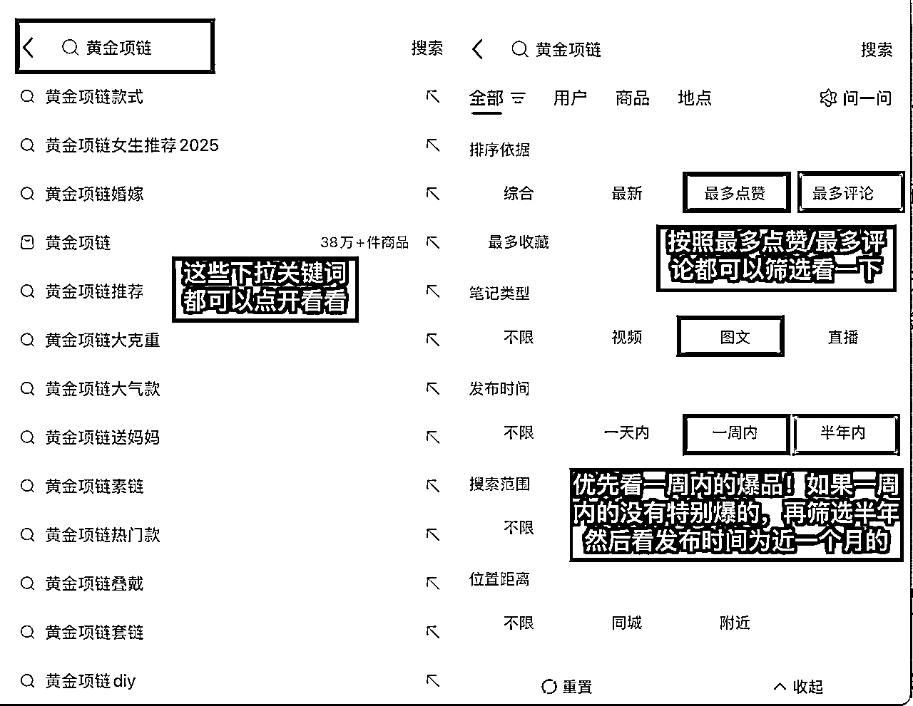

# 手把手教你0成本在小红书做一个水贝黄金中间商？首月gmv13w➕

> 来源：[https://zxnpytr8vbe.feishu.cn/docx/PPChdHgCUo88RLxXtugcBA5Qnhd](https://zxnpytr8vbe.feishu.cn/docx/PPChdHgCUo88RLxXtugcBA5Qnhd)

哈喽 大家！这里是每天都在瞎摸索小红书的金喜！以下是之前做过的一点点小小成绩，感恩阅读📖 希望我们每一位未来每一步都是花路！㊗️大家暴富！day day up!!

1个千粉小红书账号1年自然流240w➕营收；

（🔗https://t.zsxq.com/2jKUp）

3个w粉小红书账号：珠宝➕二奢➕穿搭；

小红书素人号1篇境外游帖自然流1000+客咨。

## 一、结果展示

今年3月帮朋友起一个小红书黄金的账号，这个小副业的整体情况就是去水贝黄金市场找一些小红书上比较热门的黄金款式，找到同款或者相似款后拍照发布小红书从而引流微信实现成交，成交后再去水贝商家拿货发货赚取中间差价的这么一个流程！如果在深圳或者水贝附近对黄金比较感兴趣的可以试试这个小副业，一个小红书账号一个月可能赚小几千，想要放大的话结合矩阵账号、聚光投流是没有问题的，而且小红书本身就属于积累型的，时间也久越吃香。先上干了一个月的结果：

📱账号：1个图文账号；

📈GMV:13w多；

💰利润：3k➕ （15—35元/克，款式复杂的基本高一点点）；

📅时间：3.20—6.6（4.8—5.28因为在山东参加线下高报航海没怎么花时间认真做，零总一起一个月左右）；

🧭平台：小红书这个平台不用多介绍，大家都知道低粉高变现非常适合高客单的一个平台，女生的小百度！买啥都可以在小红书百度一下！尤其是对于女性用户群体来说；

💍品类：黄金这个品类自带大流量，而且有一个很大的好处就是不用“教育”客户，都知道都爱买！哪怕是月入几千的女生攒钱买黄金的比比皆是，小红书上买黄金都流行一句话，“钱没有消失，只是换了一种方式存在”；

🧧赚钱逻辑：那对于咱们这种中间商来说赚的是什么钱呢？赚一个信息差、资源获利。其实很简单，也就是你到水贝市场去找小红书最近比较受欢迎、数据比较好的黄金款式，和商家沟通拿一个同行价格，然后拍照发布小红书，然后引流到微信提高工费成交赚取差价，最后出具证书发货完成交易✅！

## 二、流程总览

#### 1、注册小红书账号®️

这个非常简单，按照官方引导注册即可！

#### 2、养号找爆款🔥

很多人说养号是玄学，我个人看法是咱能做的本来就有限，尽量把咱能做的每一个步骤都做好，而且养号也是找了解小红书黄金市场、找近期热门款式的一个过程。养号没有很高深，说白了就是你是一个对黄金感兴趣喜欢黄金的小红书用户，那你是不是要在小红书搜搜黄金款式？看到喜欢的点点赞？问问价格？关注一下？

实操➡️：打开小红书搜索并查看关键词以及每一个下拉关键词的热门帖子（至少40min—1h/天）。搜索“黄金项链”、“黄金戒指”、“黄金耳饰”、“黄金手链”以及每一个关键词的下拉关键词，然后筛选近1-2个月尤其是近一周的爆款帖子（建议点赞300➕ 评论40➕以上，时间越近赞藏评数据越高越好），然后筛选出你能够模仿拍照的帖子，有喜欢的可以点赞/收藏/评论/关注。

一定要构建好属于你自己的爆品库！

可以使用Excel表格记录对标帖子的款式图片➕标题➕赞藏数据➕评论数据➕发布时间➕链接🔗在，方便后面去水贝市场找这个款，并且模仿对方的拍摄、标题内容、关联话题……

这里以关键词“黄金项链”为例演示一下：

「快速出结果最关键的点：不要自己去测爆款！太慢效率太低！在别人最近的爆款里去找属于你的爆款」

#### 3、水贝找货💍

水贝珠宝黄金市场包括：

金展珠宝广场➕水贝金座➕水贝银座➕水贝壹号➕水贝国际➕特力珠宝大厦➕兴龙大厦都可以去逛逛，都有黄金档口，我去的主要是水贝金座/银座的负一楼。

⚠️tips

*   逛水贝市场看货建议10:00—18:00；

*   如果找好款要在档口拍照建议人少的工作日，只能周末去的建议去人少的档口或者人少的时段；

*   带着爆款款式去找，找到目标款一定➕v、记下位置、沟通拍照、留存相关信息

姐妹们不要盲目地看，也不要以自己喜好来看！能找到小红书近期的爆品款式就拍爆品，如果实在没找到，就拍相似或者具有相同爆款元素的商品。如图：

#### 4、沟通技巧 💬

找到爆款之后就可以开始沟通拍照啦！个人经验是几乎所有黄金商家在你没有拿很多货之前态度都一般（如果有圈友是水贝黄金老板，原谅我误伤啦）！这个时候建议不要太“真诚”，毕竟钱才是实实在在的。不要说“老板，我刚做小红书，可以拍一下照片吗？”你大概率会得到否定的答案以及不耐烦的眼神！

⚠️建议话术：

你：“老板 这款拿给我拍一下，帮客户找一下款”（假装帮客户找货，转化可能性更高，商家才更可能让你拍）

商家：“你在哪里做的呀？”（可能会问，简单确认一下你是不是同行）

你：“金展做彩宝的”（暗示你有曾经购买过彩宝且消费能力高的客户，同时说明你不是黄金同行竞争对手）

商家：“哪家店呀”（可能会再确认一下✅）

你：“金喜珠宝”（随便编一个，没人知道的）

你：“这款同行拿工费多少呢，有附加吗”（拍完照片之后再问关键信息：工费➕附加➕附加配件的材质➕项链长度/手链长度/戒指指圈等，要记录下来哦）

⚠️如果商品通体都是黄金材质就不用问附加费用和材质啦！附加是指除了黄金之外其他配件的材质；附加费用是指这件黄金商品除了黄金之外其他配件的费用，比如黄金项链里镶的绿松石，黄金吊坠的绳子。如图：

#### 5、模仿拍照📷

根据对标的帖子像素级模仿拍照⚠️拍全

*   像素级模仿的整体图片➕细节图（1款至少12张吧，多留库存能多发几篇小红书帖子以及发朋友圈需要）；

*   展示完整且细的视频（小红书或者微信朋友圈都可以发）；

*   留存产品基础信息：金重➕工费➕附加材质以及费用（如果有）➕项链长度➕手链长度➕戒指圈号等

*   联系方式：微信➕地址（方便随时联系和拿货）

#### 6、小红书运营📝

##### （1）权重帖提高账号权重

首先感谢@炮爷（不睡觉）@傅超人，权重帖这个玩法是24年在炮爷和超人境外旅游项目中学到的，之后每个小红书都用了这个方法，屡试不爽！

我个人的操作是在发黄金帖子之前一定留出一两天发权重帖，养号期间发也可以！发到权重帖子小爆就可以发黄金帖了！

简单说一下权重帖，很多大佬都介绍过：就是通过发布一些有价值能引起别人赞、藏、评、收藏的话题性帖子，帖子爆了之后账号的活跃度以及权重就会更高，这样再发黄金产品相关的帖子基础流量会多一点点。我个人建议尽量写和你所做类目以及目标受众相关的权重帖，很简单我放几张图你们就懂了。

##### （2）完善账号基本信息

<h7>①账号名字：</h7>

建议带“黄金”两个字，清晰明了且卡了关键词。小红书搜“黄金”选择用户，看看别人都叫啥，尽量不要参考企业认证带蓝勾的的黄金账号，参考个人属性较强的名字，亲切且贴近爱买黄金的小红书用户。比如“泡泡水贝黄金”、“水贝黄金矿工”、“琳琳黄金分享”、“大美的黄金日记”……

<h7>②基础简介</h7>

*   可以介绍你是做什么产品的：黄金？彩宝？银饰？一目了然！

*   目标客户非常关心的点：

真假？（比如“全部产品足金 带证书发货”）

价格？（比如“喜欢的宝宝可以进小红书👗里实时报价”）

*   成交转化的关键路径引导：“询价购麦进小红书👗”方便后续在小红书群聊里引流微信成交🤝

<h7>③小红书群基础信息搭建</h7>

*   小红书群聊创建方法：打开小红书—消息—发现群聊—创建群聊

*   群名：按照小红书用户名填写就好（比如金喜珠宝）；

*   群介绍群公告：都可以根据基础简介填写一下用户非常关注的点，不会写的看同行；

*   群管理：⚠️小红书群聊里的“进群欢迎语”也是一个引流点，别浪费位置！如下：

##### （3）小红书发帖

发文内容：封面➕标题➕正文➕话题➕添加群聊组件

在之前养号过程中整理了很多爆文，对标写起来就比较简单了！这里单独强调以下几点：

<h7>①标题➕正文</h7>

尽量带关键词（品类/细分类目/人群/价格等），方便被精准搜到🔍

*   品类：黄金

*   细分类目：黄金项链/黄金戒指/黄金手链/黄金耳饰/黄金吊坠

*   人群：淡系女生/20➕女生/送妈妈的xx/长期主义女生必备的xx/大学生

*   价格：千元/小千/百元

<h7>②话题</h7>

不选无关话题，高热度相关话题（超高浏览）➕超精准话题（浏览少，但非常细分精准）➕小红书近期活动话题（创作中心—笔记灵感）结合

<h7>③添加组件</h7>

这个位置可以关联小红书群聊，引导进群。

<h7>④评论区</h7>

可以置顶小红书群聊链接🔗或者关键信息，比如金重/当日金价/当日价格（需注意每日水贝金价不一样，所以报售价一定是当日水贝的价格）

<h7>⑤发布时间</h7>

想象你是一个小红书用户，你主要在什么时间刷小红书，你就在什么时间发！发布内容多了，你的内容在什么时间段比较火或者评论咨询比较多，就稳定在那个时间段发布！

（工作日吃午饭➕下班地铁上➕周末全天➕饭后睡前）

<h7>⑥发文频率</h7>

前期数据不稳定的时候建议多发，一天发1-4篇都可以，后续数据稳定可以根据具体情况（操作难易 账号多少）稳定一周发几篇。

##### （4）运营补充动作

①发完等小眼睛曝光到大几十、一百左右的时候可以转发到朋友圈（如果小红书群聊里有用户也可以转发小红书群聊），尽可能全方面增加曝光，引导潜在客户去浏览点赞收藏评论等；

②发文后过30分钟左右用其他小号或者让朋友在小红书页面搜索关键词按照最新排序找到你发的这篇，然后浏览内容并点赞收藏评论（不要在同一Wi-Fi 下）；

③爆品重复发，爆过的款式还会再爆，可以换种呈现方式再发，发到没有流量为止，让一个品最大化引流转化（我个人实践经验是如果一个款爆了，那这个时候是用这个款来起新号的最佳时机，实现权重➕成交双起飞🛫）；

④发文关联群聊，同时也可以在评论区放上小红书群聊链接🔗 并置顶；

⑤评论区尽量及时回复尤其是刚发的时候，一问一答或者一问多答让流量跑起来。

##### （5）安全引流

我个人是用小红书群👗来作为引流的站点！无论是私信问价还是评论区问价的都是先让用户进小红书群聊，然后用小号在群聊里回复，目前我们用的是下面这2种引流方法（安全引流的方法小红书航海手册里非常多非常详细）：

①群管理：进群欢迎语设置为引流微信号；

②小号发带有微信号的截图，⚠️注意图里的微信号不能太明显。可以直接拿图美图秀秀改一下微信号，后续可能会被识别哦。

#### 7、微信转化🌍

##### （1）微信基础信息：

「微信名➕简介➕头像➕背景图尽量和小红书一致」

⚠️简介我一般会➕一句话“非真假不退换”！（售前相关信息一定要写清楚，以防产生售后，麻烦！）

##### （2）发朋友圈

刚开始做的时候如果朋友圈黄金素材比较少，可以设置为三天可见！发的多了再慢慢改为最近一个月/最近半年。如果是作为副业来做，我个人建议高效来做，朋友圈尽量写清楚所有关键信息，以免在沟通环节浪费太多时间。

①文案：参考翡翠商家发的朋友圈

关键信息非常清楚：

（比写清楚金重、工费、附加费、戒指指圈、项链长度、手链长度、长度是否可以调节、带证书发货、当日水贝金价、非真假不支持退换等）

②照片：

整体照片（可以和小红书共用一份照片）；

细节照片（比如说项链的坠子特写、比如手链的扣头特写等）；

商品佩戴图；

产品关键信息图（如图我一般偷懒发朋友圈文案里不写太清楚，就直接把标注产品信息的图放在朋友圈）；

③视频：建议一款产品除了发图之外，可以接着发一个产品视频，方便客户更直观地看👀

##### （3）沟通交流

沟通转化基本客户问得比较多的就四个关键信息点：

①价格：黄金总价=（当日水贝金价➕工费）*金重➕附加费用（如果有）

咱能赚的钱包含：

工费差价（1克加15-35元左右，看款式）➕附加费用（比如商家给我们100附加，可以报150元左右，可以自己调整！）

⚠️当日水贝金价：水贝黄金都是按照水贝金价来算的，不是国际金价哦！客户问可以直接说是水贝金价，不管是我们从水贝商家拿货还是我们卖货都是按照水贝金价来算的。

②真假：有无999钢印，可以出具证书📄带证书发货

③基础信息：比如项链长度、手链手围、戒指指圈，拍照阶段已经留存好了，但是让客户一定量好尺寸，别买错指圈导致来回换货等；

④退换：一定要和客户沟通好非真假是不退换的，减少售后麻烦事宜，以免亏本！

##### （4）转账

前期做的比较小，所以我是直接微信转账，以转账当日的金价来给客户结算价格，收到客户转账之后立马当天和黄金商家微信下单核算价格，因为水贝黄金价格每天都在变，如果第二天去下单，有可能金价涨价📈造成你赚到工费太低！！！

不用担心客户会因为微信直接转账而不下单！19年我们做珠宝高客单就是微信直接转账成交的🤝 不影响转化！

#### 8、拿货出证书📄

然后去黄金商家拿货去出证书📄证书机构小红书上写的非常细致：

黄金类产品可以出国检ngtc（50元/张），水贝国检地址以及其他检测中心信息放链接里了可以看一下。一般证书我是赠送给客户的，所以记得把证书费用算进工费里，别亏本了哈哈。

https://www.xiaohongshu.com/explore/670cec14000000001600f1a1?xsec_token=ABVL39iOSbZB8kDTJLwSm2s0n4v_rJSq3JR_9qI2wLd20=&xsec_source=pc_search&source=web_explore_feed

https://www.xiaohongshu.com/explore/685b5f4c000000000d01b4fa?xsec_token=ABcMD1K2nVuHGJ342K3J3UUVW5Ra4uj9jbFDUlAjFWf0o=&xsec_source=pc_search&source=web_search_result_notes

https://www.xiaohongshu.com/explore/67d6478e000000001e002484?xsec_token=ABu7s_N4XVhLJ4VNm_A0bCAtALYpHxa1R1ewqhPKxqfc4=&xsec_source=pc_search&source=web_search_result_notes

#### 9、发货📦

打包发货：贵重商品、水贝珠宝基本都是顺丰到付保价的！记得提前和客户沟通好！

## 三、1-10

因为是给朋友起号，1-10我没做，所以简单纸上谈兵下：

1️⃣矩阵开展账号：如果你发的一个款爆了，立马开一个新号发几篇权重帖，然后追加发这个爆款！在别人的爆款找到属于你的爆款，然后爆款多发发发！！！一定要充分利用好这个品，不仅可以一个账号发多篇该品，多个账号发多篇这个品完全没问题（我个人实践经验是如果一个款爆了，那这个时候是用这个款来起新号的最佳时机，实现权重➕成交双起飞🛫）;

2️⃣以上展示是图文，同样可以做小红书黄金代购的个人IP视频形式的小红书账号，参考「二、流程总览—2、养号找爆款」部分的方法找个人IP的对标账号，方法都是一样的，如下图：

3️⃣聚光投流，具体操作可以看小红书聚光航海手册🗺️非常详细！

## 四、踩坑&总结

很容易踩坑的点：

1️⃣爆品≠发1篇结束：不管什么类目，千万不要发完一篇帖子一个品爆了就结束了，就开始接着发新的品。一定要把你挖掘到的的爆品价值榨干！

比如说之前做二奢的时候，发了1篇小红书帖子爆了点赞1000➕ 评论快200，我立马连续两个账号换类似标题、类似封面连发4篇，数据📊都小爆。

2️⃣转化数据>点赞数据：刚开始做小红书的时候看到点赞收藏数据很好的帖子就陷入自我满足中，但是一定是转化最重要，哪怕1万点赞如果没有转化对我们来说也只是为小红书发电而已⚡️

3️⃣数据选品>喜好选品：选品的时候比较喜欢根据自己的喜好、自己的眼光来选，但从转化角度来看，想快速最大化转化一定是要根据小红书的数据来选品，尤其是刚开始做、没有货源的时候。

如果有在深圳或者在附近有黄金市场的姐妹们👯‍♀️可以尝试下这个小副业，这个小副业最大的好处就是0成本，一个手机就能开展，虽然刚开始可能一个月利润只有小几千，但是账号可复制性比较强，且延展性也强，不想做利润比较低的黄金，也可以选利润空间更大的银饰、彩宝！

可能会有很多小伙伴说不了解黄金能不能做？答案是肯定的！因为我也不是很懂，但是咱们能问百度、问AI、问小红书、问黄金商家…办法比问题更多！fighting叭

最后特别感谢生财这个平台！感谢鱼丸感谢楞楞帮忙审稿给出建议。祝我们每一个人开心！！步步生花～～