# 业绩实现100倍增长，小红书高效变现路径全解析！-哈默

> 来源：[https://g9b7q6p1o2.feishu.cn/docx/BtiUdUpFloGapRxJY66chrb8nCb](https://g9b7q6p1o2.feishu.cn/docx/BtiUdUpFloGapRxJY66chrb8nCb)

小红书蕴藏巨大商机，无论是接广告还是引流，都能让你的生意更上一层楼！

如果你还没搞懂小红书底层玩法，很多机会失之交臂！

为啥由我来分享？简单自我介绍下：

我是哈默，世界500强新媒体培训师，出版3本新媒体书，做过10年自媒体，遍布微博、豆瓣、今日头条、知乎、抖音、小红书、视频号等几乎所有平台，且都拿到过结果。比如，获得2017年度教育头条号、微博教育头部自媒体、抖音单条播放量2800万+、小红书涨粉榜第一等等

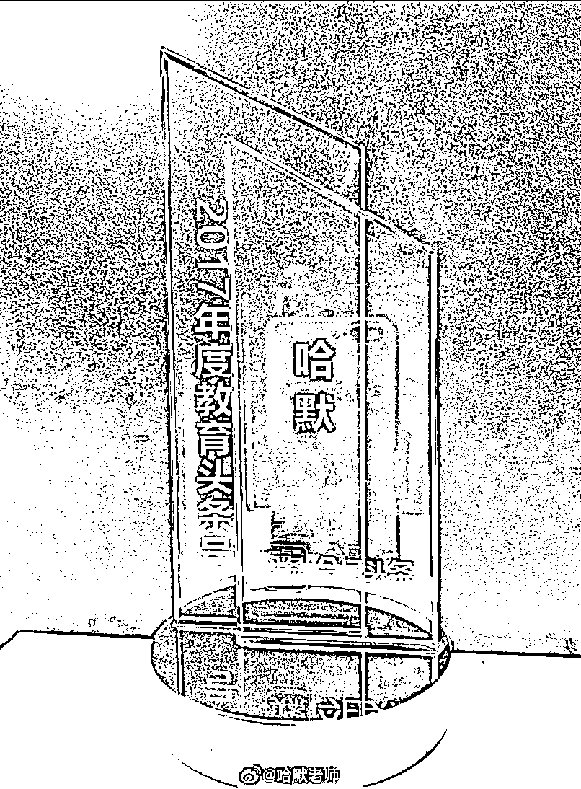

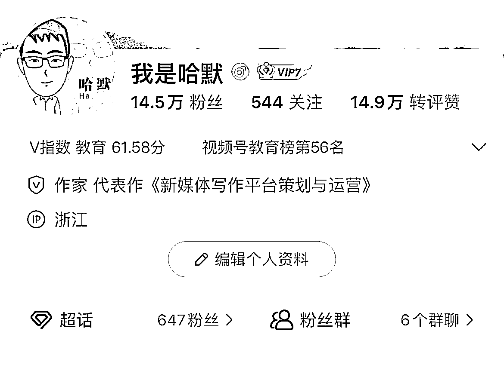

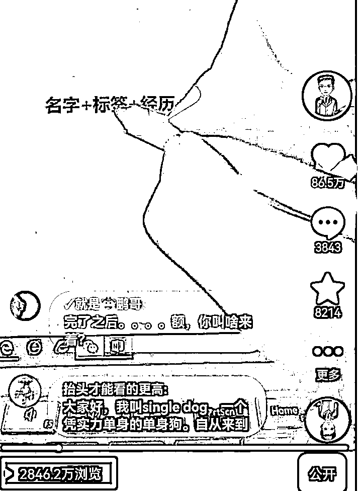

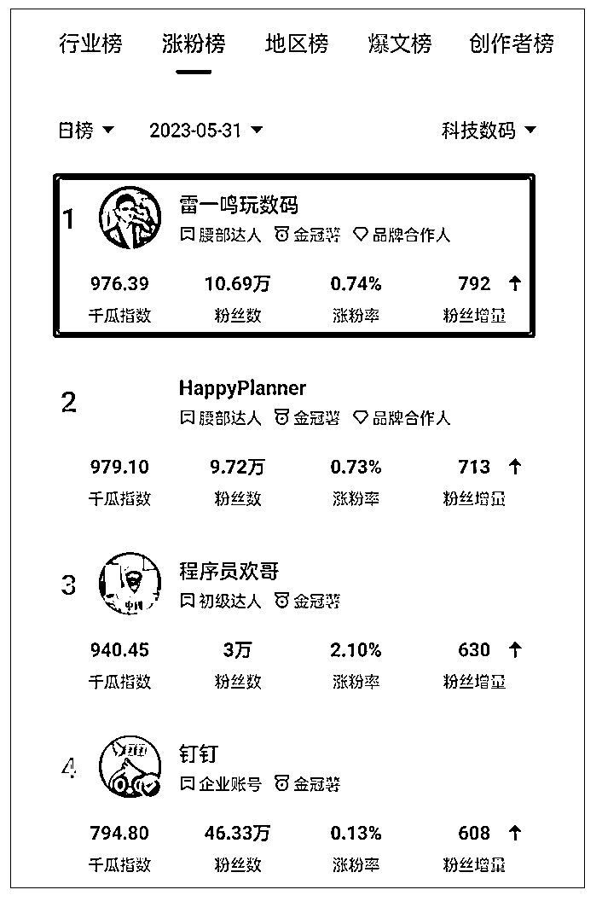

2017年度教育头条号 微博教育榜56名 抖音单条播放2846万 小红书涨粉榜第一

另外，我也几乎跑通绝大多数自媒体商业模式，比如知识付费近1万人报名、线下培训单场1200人、出版第一本书加印9次、开新媒体公司等等

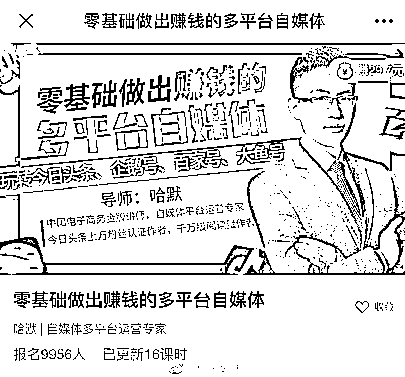

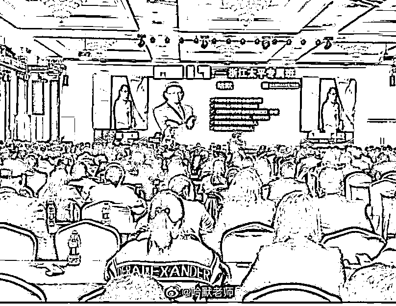

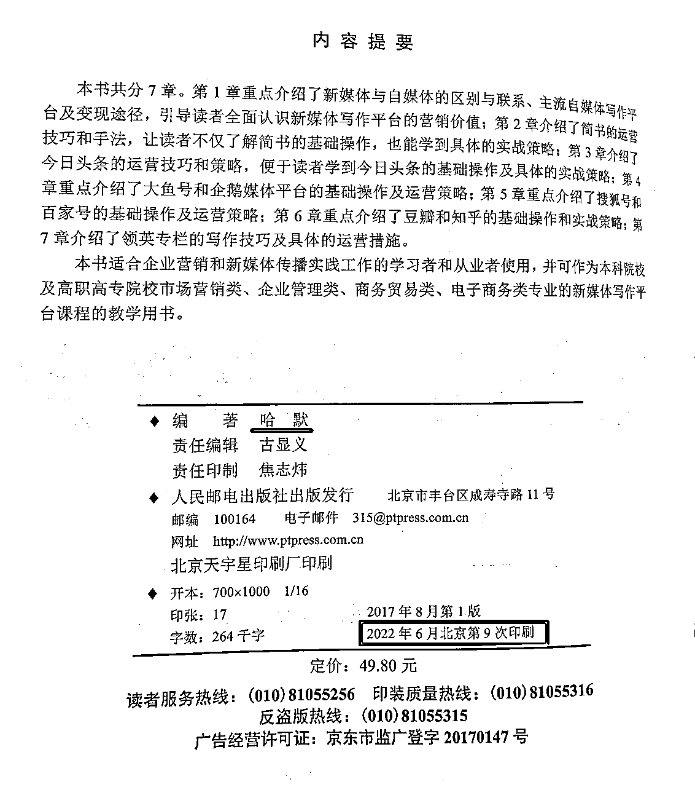

单门课接近1万人报名 线下课单场1200人 第一本加印9次

讲这些目的，不是为了炫耀，而是告诉大家，我在新媒体领域这10年的探索，有经验、负责任告诉大家：小红书真的是超级香的平台，比以往任何平台都要优质，甚至普通小白只要用心都能赚到钱！

本次小红书平台高效获客方法，我核心分享4个部分：

1.  小红书2大主流玩法的底层逻辑

1.  从0到1，如何快速搭建小红书变现体系？

1.  小红书三位一体系统：产品-流量-转化

1.  小红书高效引流微信的全套路径指南

# 一 小红书2大主流玩法的底层逻辑

无论小红书个人号还是企业号，这是从属性上划分；而专业选手，往往从功能属性划分，小红书上主流只有2大类账号：接广号和引流号

## 一）小红书与抖音、视频号的本质区别

抛开一切产品属性、创始人特质等维度，小红书与其他平台最重要的区别是：把决策权交给用户！

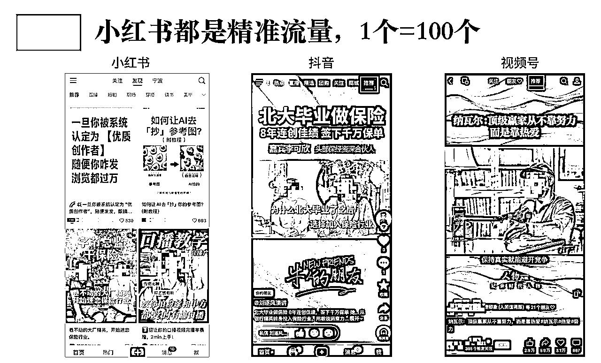

如图是3大主流平台的展现样式：小红书是4个页面展示的“瀑布流”，无论是推荐流量还是搜索流量，都是用户主动选择，每个阅读都是对主题感兴趣、真实需求的精准流量。

抖音是靠强大算法驱动，平台根据用户兴趣投喂短视频；视频号是【社交+算法】双向驱动，进行短视频推荐。

这也是每个平台的核心优势：

抖音最厉害的是算法，抖音有强大自信，靠自身算法就能击中用户兴趣，让陌生用户在刷20条视频之内，产生依赖，留住用户；

视频号最厉害的是社交平台，它的算法不如抖音，但它靠社交和算法双向驱动，猜中用户兴趣，让用户产生依赖，欲罢不能；

但小红书与2大平台都不同：小红书在算法和社交都没有优势，所以，它把选择权交给用户，让用户的每次主动点击来投票，进而驱动算法推荐更多，让用户爱上小红书。

所以，抖音是算法平台，视频号是社交平台，而小红书则是【用户社区平台】

这3大平台的本质区别，导致小红书的流量都是精准流量，甚至1个阅读=100个其他平台的阅读

## 二）小红书流量2大核心来源

打开任何app，详细看app界面，你便知每个平台的流量来源

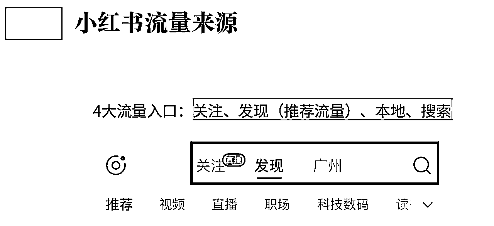

如图便可知，小红书主要有4大流量来源：关注、发现（推荐流量）、本地、搜索流量

而我们根据阅读量过万，小红书笔记分析得知，小红书最重要的2大流量来源：推荐流量+搜索流量。

比如下图中：左图，推荐流量占比95%，单篇笔记阅读量7.8万；右图，搜索流量占比94%，单篇笔记阅读量2.2万；

所以，推荐流量和搜索流量，只要你稳稳拿捏一个渠道，你的笔记爆火都是极大概率。

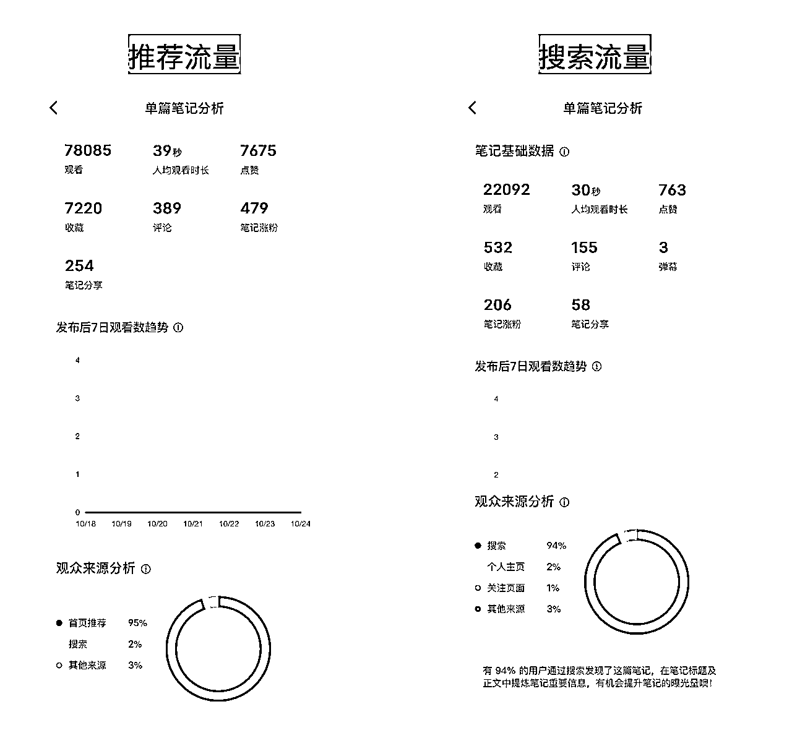

问题来了：如何搞定推荐流量和搜索流量呢？

1）推荐流量的本质是【行为设计学】：网络流传小红书推荐逻辑是CES评分，官方未明晰，但不论如何，推荐流量的核心就是设计用户的【点赞+收藏+评论+转化+关注】的行为，让平台看到用户行为的反馈，加速推荐。

如果想搞定推荐流量？建议读读这套书《行为设计学》，如图

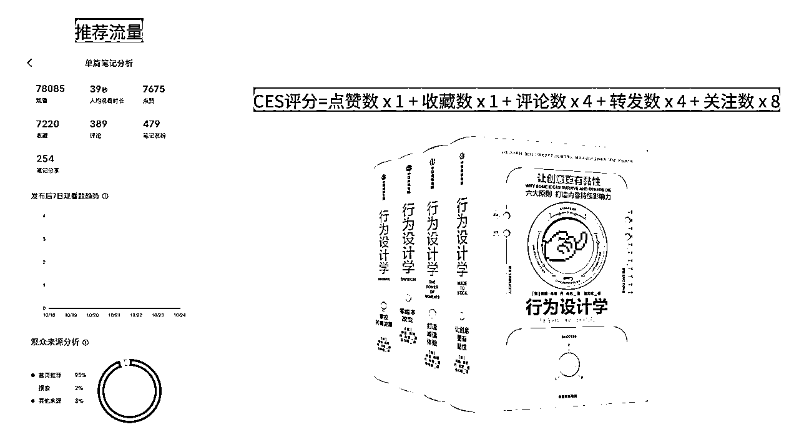

2）搜索流量的本质是【关键词卡位】：我们需要借助官方平台【小红书聚光平台】，查询每个关键词的搜索指数，进而明确卡位的核心关键词，如图

（备注：小红书聚光平台，需要认证小红书蓝V企业号，认证费用600元。小红书聚光平台主页链接：https://ad.xiaohongshu.com/aurora/home）

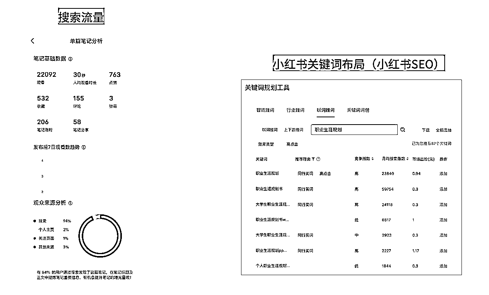

## 三）小红书2大主流玩法的底层逻辑

### 接广号

我们公司是新媒体广告公司，主要服务的类目是【数码家电】，我们服务几乎90%以上国内头部数码家电品牌，比如京东、拼多多、天猫、vivo、OPPO、苹果、格力、海尔、美的、TCL、苏宁易购、老板电器、联想、方太、海信等

而这一切品牌方资源的由来：都是我们做了一大批【小红书数码家电账号】，如图是2022-2024年，我们做的账号：方法可复制、自孵化、矩阵化

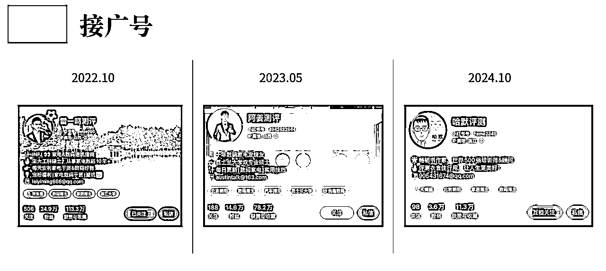

比如，2022年10月，我们才开始做【数码家电账号】，这些账号经常霸榜，甚至受邀参加明星活动

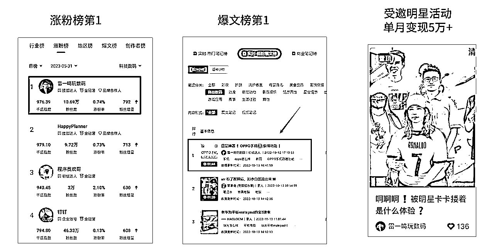

而且，数码家电账号，变现效果特别好：比如2024年，我才出镜做账号，【哈默评测】这个小红书账号，起号一个月就开始接广告变现：单月接广告16条，单月变现3万+，如图！后面我也会详细分享，快速接广告变现的方法！

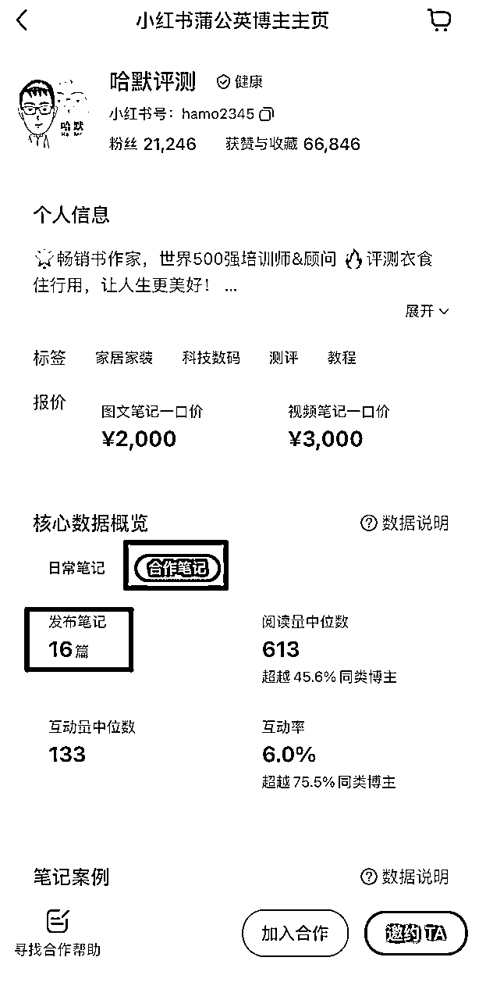

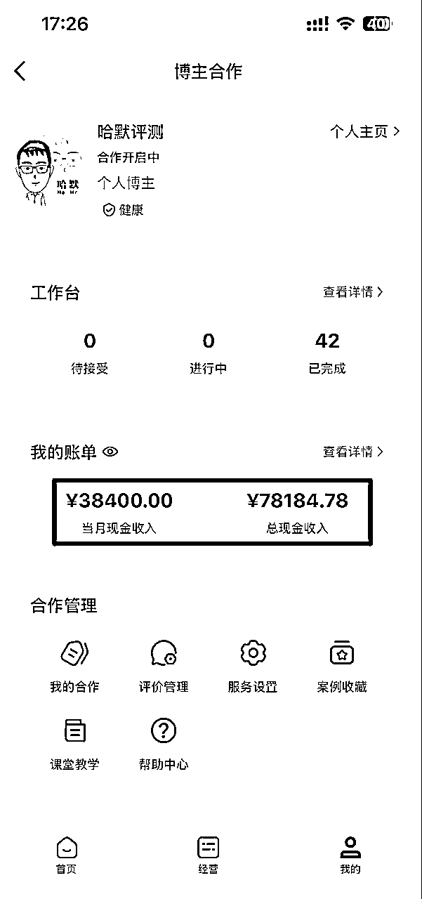

### 引流号

引流号，顾名思义就是引流到微信私域，进行销售转化。如图，是我们自己和辅导过的案例，引流效果都很不错。我在后面也会详细介绍，引流玩法以及商业路径。

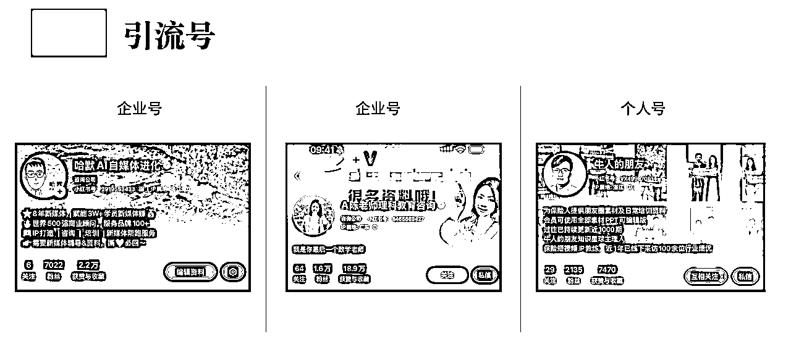

小红书人群非常优质：我们单篇笔记引流过500+到微信，而且售卖顾问服务，客单价成交10万+！如图。

针对小红书平台，需要认真打磨引流产品和内容，发挥小红书独特平台魅力！

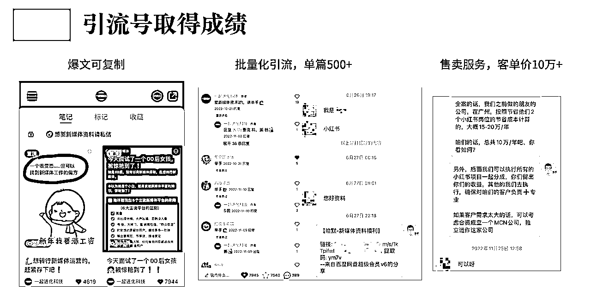

### 小红书接广号和引流号如何选择？

首先给大家展示，2024年下半年，我做的这个账号【哈默评测】，半年发了82条笔记，接了53条广告，接广率65%；而且接的都是数码家电品牌，是我们要找的大客户，如图vivo和老板电器。

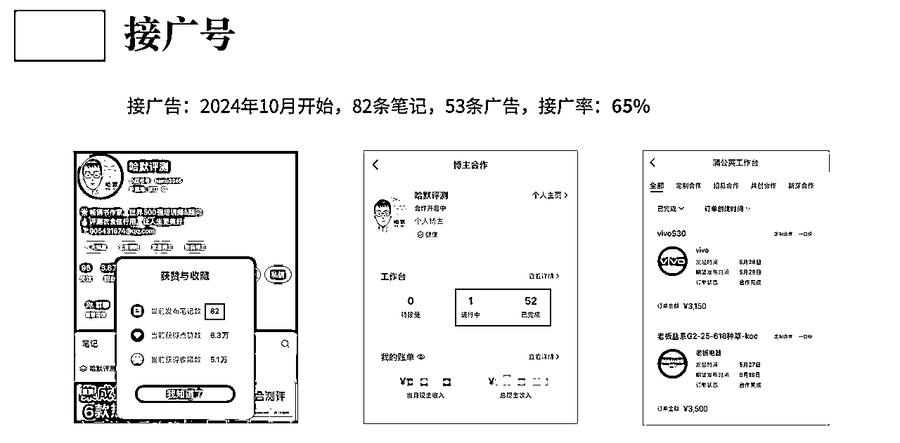

我这个账号只有3万多粉丝，为啥接广告这么猛？源于小红书种草平台属性。下图给大家展示京东投放的博主，93.42%的博主粉丝量都在5万以下，如图。

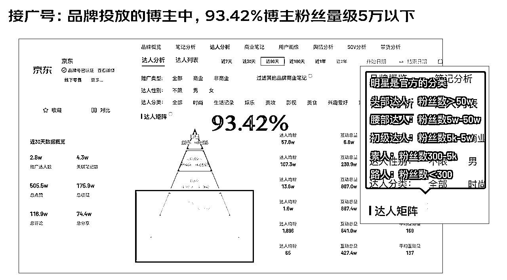

甚至我们根据自己账号以及执行的头部品牌项目，得出结论：在小红书上粉丝1-10万量级，报价1000-10000元区间的博主，最好接广告，而且很多时候，一个月都有10条广告以上。

接下来，详细分析小红书2大主流账号玩法：接广告和引流号

#### 1）对于接广号：赛道大于一切

给大家展示两个账号，如图

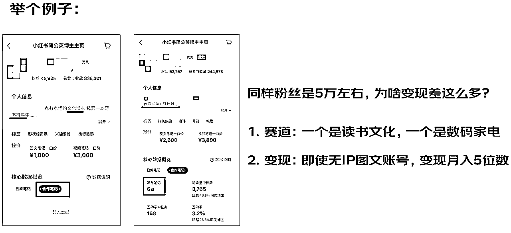

同样是5万粉丝左右的博主：左侧是读书文化博主，真人出镜；右侧是数码测评账号，没有IP的图文号

但是左侧的账号一个月没接到广告，而右侧一个月接广变现5位数

是能力的差距吗？不是！

我做数码家电账号以前，也做【个人成长类博主】，做了1年多，没接到一条广告；

但是自从我转型到【数码家电测评博主】，1个月之后就开始接广告变现；

原因是啥？赛道决定一切，数码家电是接广告的天选赛道

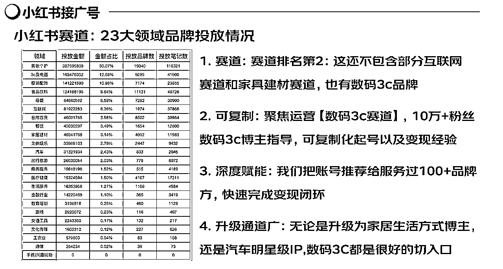

我汇总小红书23大赛道的品牌投放情况，如上图：

你会发现：前5大赛道，几乎占据品牌投放金额的绝大多数，如果你选择的是非前5的赛道，注定很难接广告，因为你的品牌方没钱，你又如何接到广告？

在23个赛道中，【3C&电器】排名第2，都是响当当的品牌方；同时，【3C&电器】可拓展的领域极多：对于女生，可以拓展为家居生活方式博主；对于男生，可以拓展为汽车博主。

所以，我经常跟小伙伴们说：如果你想接广告，又不知道选啥赛道？很简单，就做数码家电赛道！

很多女生误认为数码家电是男生的赛道，其实不是：数码家电分为3大部分：大家电（冰箱、洗衣机、空调等）、小家电（破壁机、空气炸锅、扫地机等）、数码手配（手机、平板、耳机等），具体可以看官方给出的月报。在官方看来这3大部分，同属于垂直领域【3C行业】，所以，女生可以直接做大家电、小家电，也是这个赛道领域。

当然，你也可以考虑排名第一的【美妆个护】，但不像数码家电有专业门槛，美妆个护门槛不高，竞争激烈，报价不高；所以，如果两者都没有特殊偏好的话，还是建议接广号从【数码家电赛道】起步

如何一个月接广告10条以上呢？核心原则：以终为始，提前布局广告位！

比如，当我们用【小红书蒲公英平台】，查看同领域账号接广告情况，如图，当我看到同领域账号，最近接的都是【咖啡机、净水器、洗烘套装、按摩椅的广告】，我肯定要拍一条【净水器】视频，提前布局广告位，告诉品牌方这类内容我擅长，尽管来找我投广告。

（备注：当你开通小红书蓝V企业号时，用这个蓝V账号可以扫码登录小红书蒲公英平台，查看博主接广告情况。小红书蒲公英平台主页链接：https://pgy.xiaohongshu.com/solar/pre-trade/home）

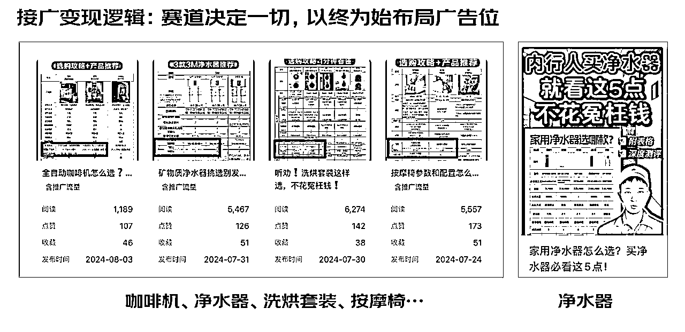

接广告笔记更新频率如何？对于接广号，当你广告笔记多时，甚至都可以不发日常笔记，照样可以！比如，如图这个博主，一个月发9条，全都是广告，但他从没更新日常笔记。

【总之，接广告账号必备认知】

1.  选对赛道大于一切，优先选择品牌投放金额前5的赛道

1.  以终为始，提前布局广告位

1.  日常更新频率不是取决因素，要看你接广告多少

1.  爆款笔记才是接广告必备要素：账号有过单篇笔记点赞>1000

1.  接广告对于笔记平均阅读量要求：阅读量（小眼睛）>1000，点赞>100

1.  小红书广告报价：平均报价为粉丝数/10，可根据赛道、账号内容优质情况，提高溢价

#### 2）对于引流号：阅读量不重要，每一个都是精准流量

给大家展示一个我们自己的账号：你想都不敢想，每篇笔记阅读量不超过10，但是小红书店铺商品依然卖得动。单个小红书账号，卖掉知识星球会员220份+，我们整个知识星球会员也有2000人了，如图

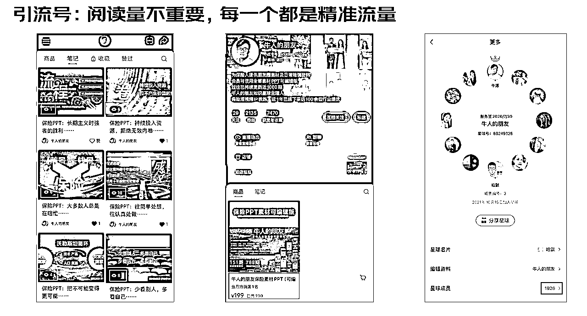

对于引流号，不要关心阅读量，而要关注私信、评论和商品销售量。如图便是我们引流号的评论区，清一色全部“要资料”

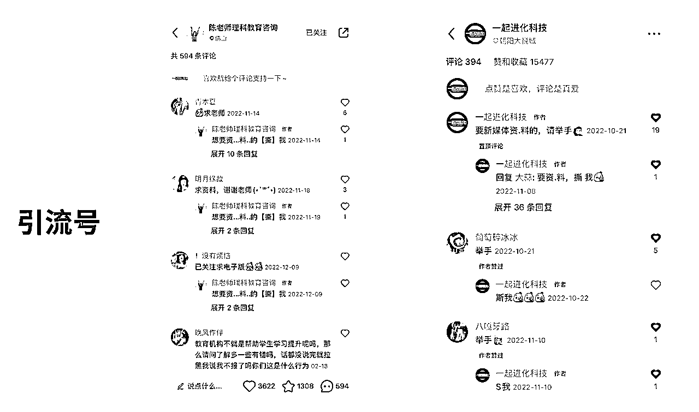

在小红书上，我将笔记划分为：爆款笔记和引流笔记

如下图，给大家展示3条笔记：哪个是爆款笔记、哪个是引流笔记呢？

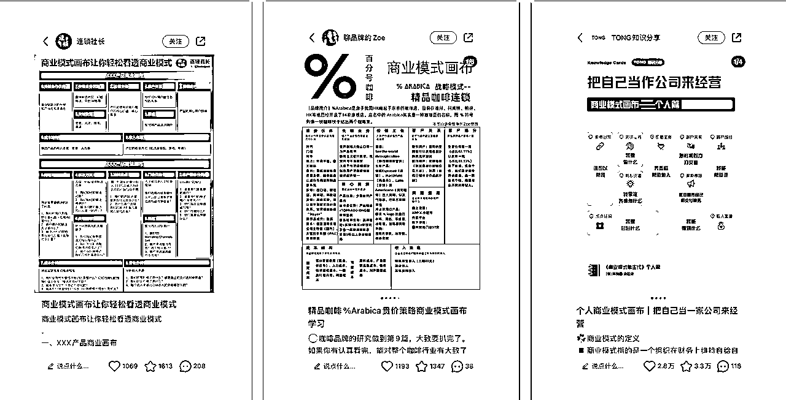

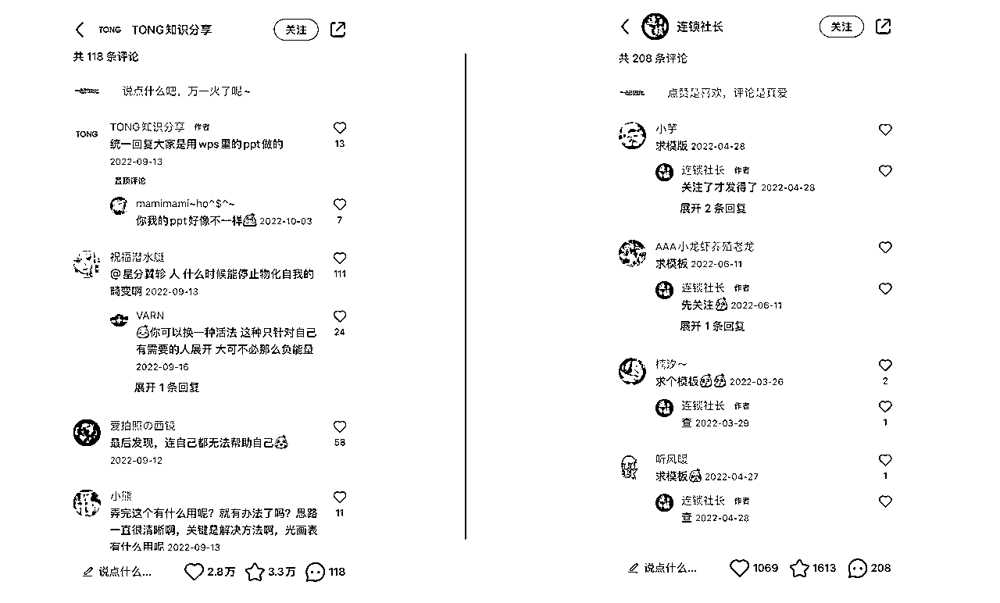

当我们打开笔记评论区：左侧图虽然是2.8万点赞，但是评论区用户并没有想要资料模版，而是谈论知识干货，这个笔记只具备爆款笔记属性；而右侧图，虽然只有1000赞，但是评论数超过左侧图，而且评论区清一色“求模板”，这个就是典型引流笔记

很显然：左侧图是爆款笔记，右侧图是引流笔记

为了便于区分，我给这两种笔记，给出基础数据判定，如图：

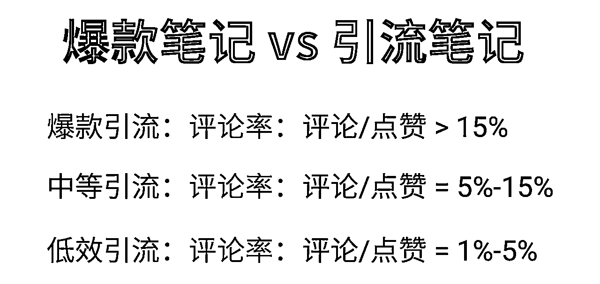

所以，如果你做的是接广号，我们核心关注【爆款笔记】；如果你做的是引流号，我们核心关注【引流笔记】

关于这一节【小红书2大主流玩法底层逻辑】，简单做个小结，便于小伙伴们查阅！

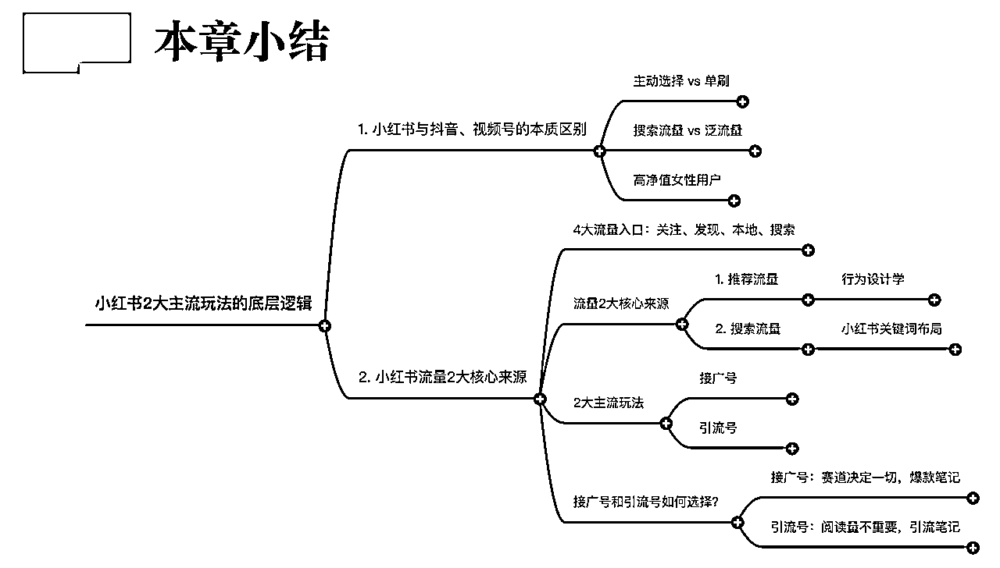

# 二 从0到1，如何快速搭建小红书变现体系？

小红书高效变现核心原则：无论是接广号还是引流号，一切围绕【业务】做账号！

## 一）接广号

其实，我们做【数码家电接广号】，也是围绕业务做的，如图，我来详细复盘下：

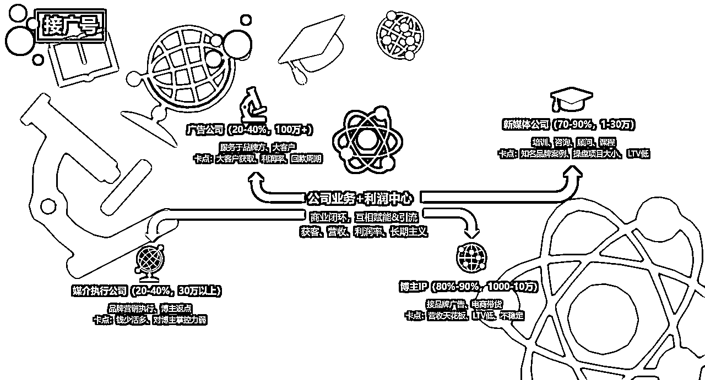

我们目前公司是有4大板块：

1.  广告公司：主要是服务头部数码家电品牌，做小红书品牌营销全案，单个项目100万+

1.  媒介执行公司：主要服务中头部数码家电品牌，做媒介执行，单个项目30万+

1.  新媒体培训公司：主要服务中小企业，主要做培训、咨询、顾问，客单价1-30万

1.  博主IP：一批数码家电账号，主要是接广告，客单1000-10万元

2022年以前，我们只有第一部分广告公司，但我发现客户就那么几个，因为付得起100万/项目的品牌方屈指可数，而且增长瓶颈特别明显；也就是这是一个存量市场，基本80%服务老客户，基本没啥增量

而且广告公司，最大的弊端是工作量大、人员多、回款周期长、利润薄

怎么办呢？2022年，我们很多头部客户主动问我们：“你们可否做小红书业务？”

刚开始，我们拒绝说，我们不做，我们只做TVC等品牌营销全案！

但是，一个月很多客户都问小红书品牌营销，甚至大客户直接跟我们说：“如果你们不接小红书品牌营销，我们将换一家公司，把项目全部承接。”

于是，我们2022年10月份，我们开始做小红书，从哪里入手呢？我们的决定是：从小红书数码家电博主入手，几个创始人都要做博主IP

当我们做数码家电博主后，公司所有业务都盘活了：

1.  广告公司要给品牌方提案，通常5个公司比稿，但我们每个比稿的人，都是小红书万粉以上的博主，瞬间提高成功率。记得，某个品牌方听到我们是这个领域的小红书万粉博主，直接现场叫老师，快速提升信任

1.  数码家电博主，我们可以为其他3个业务引流：

*   很多品牌方，都是先给我们投放几千元小红书广告，进而接触到我们；

*   我们执行力和专业性好，进而邀请我们去他们那讲课，盘活培训业务；

*   培训我们会见到他们市场部的人，反馈好，继续让我们帮他们做媒介执行，一个月投放300+博主，我们媒介执行业务也盘活；

*   一切都执行顺利之后，然后他们会交给我们【小红书品牌营销全案】，直接成为我们广告公司的客户，100万+

也就是我们做到：引流即利润！数码家电接广号，是我们一切高客单项目的引流品，一切围绕业务做账号

所以，当我们所有创始人，都做数码家电博主后，公司覆盖全部客单价从1000-100万+，利润率也从20%提升到40%，引流和执行成本极速降低，甚至单单博主接广告这个引流品，就能养活团队！

而且，更重要的是：一家广告公司的核心资产是啥？不是项目而是随着时间复利的博主IP！这是其他广告公司无法做到，而且是我们借助【内容+IP优势】累积的！

总之，每个创始人都要做自己所在领域的IP，我们广告公司服务的是数码家电品牌方，我们做IP的方式就是做小红书数码家电博主

## 二）引流号

同样引流号，也是围绕业务去做的，比如我们这个保险引流号

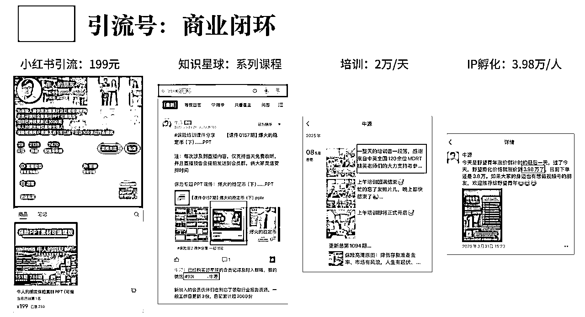

1.  小红书店铺卖199元保险从业者素材，单账号就卖了200+份

1.  成交到知识星球服务，目前2000个用户，在知识星球继续售卖其他系列课，比如综合金融等专业课

1.  2-5万培训，给保险公司和保险从业者讲课

1.  保险IP孵化，3.98万/人，已经有100+人

接下来，核心讲讲小红书起号流程

## 三 ）起号流程

起号主要有4大部分：账号策划-选题-内容-运营

### 账号策划5件套

1️⃣ 昵称：跟领域强相关，便于承接搜索流量

2️⃣ 头像：个人号建议真人，企业号建议与真人一致的漫画，提升信任

3️⃣ 简介：我的牛经历+现在做的事+关注&联系我有啥好处+引流指引

4️⃣ 主页风格：风格一致、系列化，提升涨粉率

5️⃣ 背景图：与账号定位紧密相连

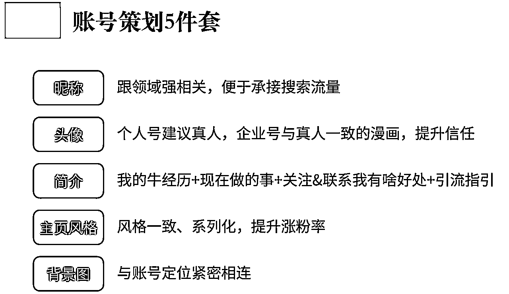

个人号与企业号，账号策划举例：

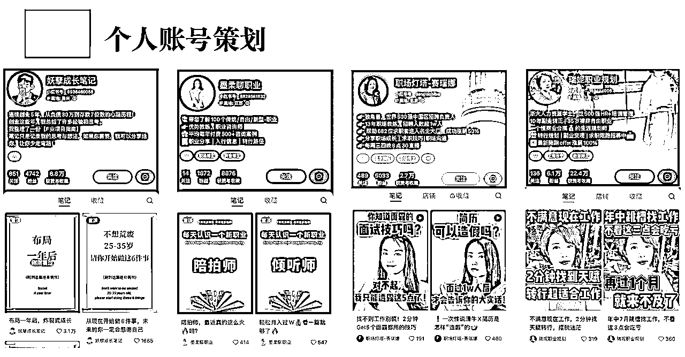

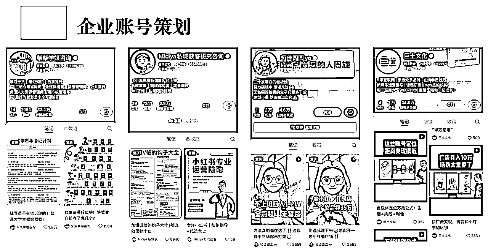

### 选题

#### 1）低粉爆文榜

几乎我们所有新账号，都是用【低粉爆文】来选题，快速起号！

低粉爆文，我们可以使用工具，效率高：比如灰豚、千瓜，如图

如果不想花钱买软件，也可以自己手动找：低粉爆文通常指的是：粉丝<1万，点赞>1000的账号笔记

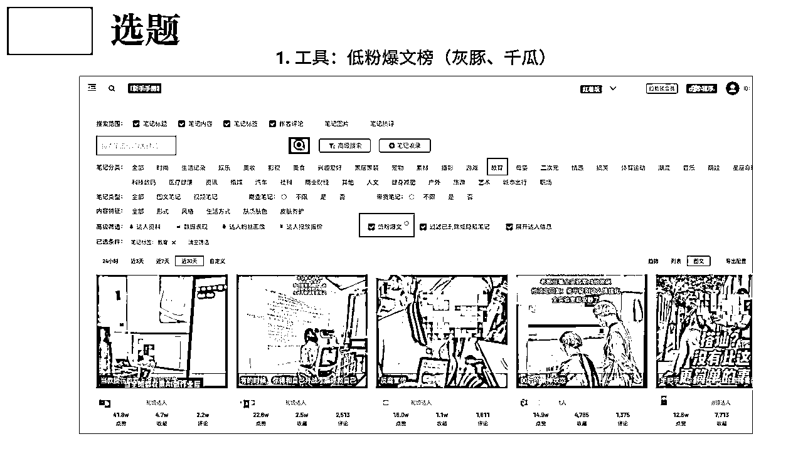

#### 2）小红书平台内搜索

可以用小红书app进行平台内搜索，找到选题，如图

比如可以输入关键字，筛选最热笔记，看30+篇最热笔记，找到这些笔记的共同点

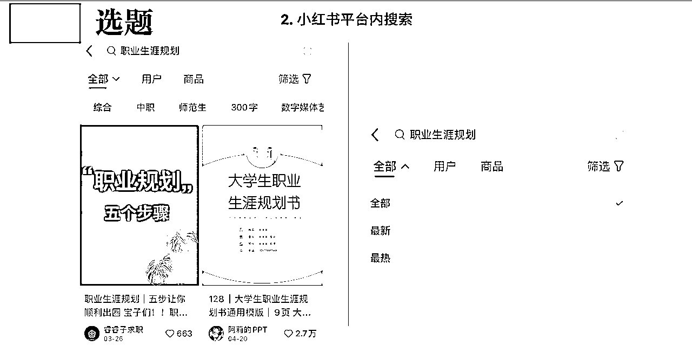

#### 3）小红书SEO

我们经常使用【小红书聚光平台】，查看每个关键词的搜索指数，进而找到需求大的选题，如下图中的左图

而且，当你在小红书搜索时，你可以留意下拉关键词，做为选题依据，如图-中间图

当你输入关键词，你可以留意横向关联词，作为选题依据，如图中的右图

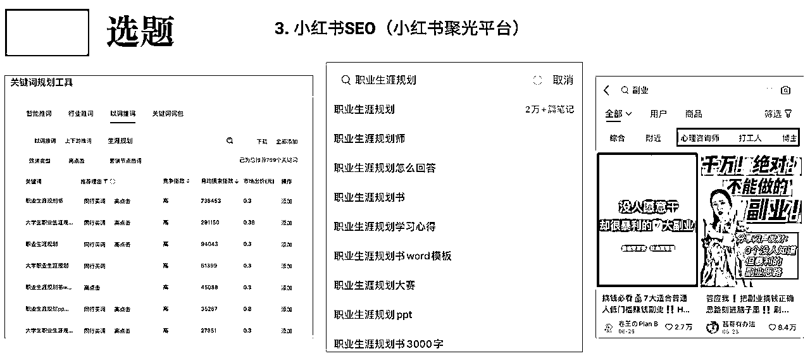

#### 4）刷同行

你可以通过刷同行的方式，找到选题，具体什么笔记可以作为同行对标选题呢？

1.  点赞>100

1.  发布日期最近3个月

1.  比博主日常笔记数据好5-10倍

1.  我们可以找一个手机，专门刷成同领域的，加大选题入口

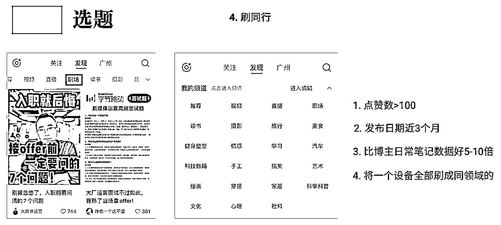

#### 5）选题规划表

给大家一张，我们常用的选题规划表，作为运营小红书的必备工具：主要有6大列-选题日期、对标选题、归属类别、关键词、选题目的、选题要求，如图

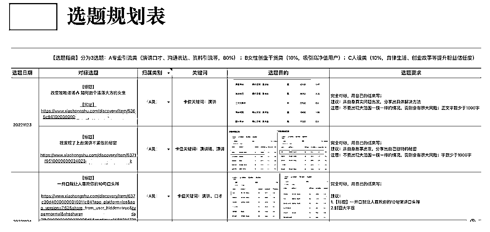

### 内容

内容主要有5个方面：封面图、封面标题、文案标题、正文、评论

*   封面图：必须是当前爆款封面，不只是同领域，也可以是跨领域，尺寸是3:4

*   封面标题：主要吸引用户点击，辅助封面图

*   文案标题：主要用于小红书关键词布局（SEO），写成2行

*   正文：结构化、信息密度、小红书表情包、关键词布局

*   评论：引导用户关注，提升推荐流量；评论区引流，3个小号验证是否评论上

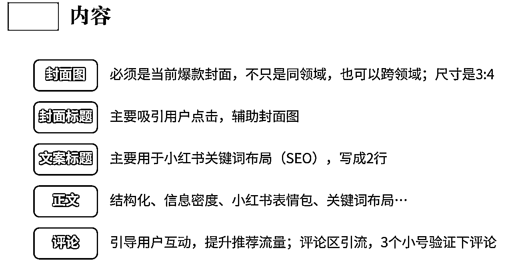

#### 1）封面图

多查看爆款封面，提升网感，跨领域对标，尺寸强烈建议3:4

我们常用的小红书制作封面的工具是：稿定设计https://www.gaoding.com/

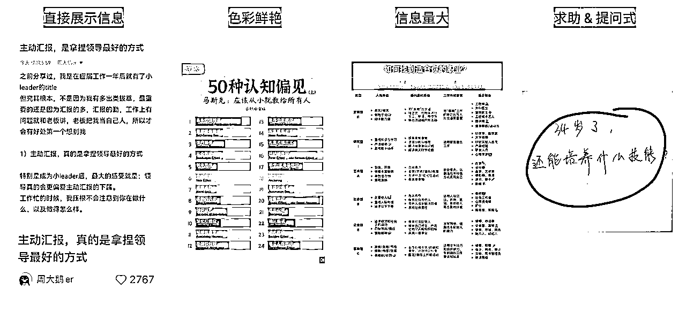

#### 2）封面标题&文案标题

内容如何布局小红书关键词？

1.  确保笔记被平台收录，建议使用句易网等工具查询http://www.ju1.cn/

1.  笔记中埋好关键词，要做4个关键动作：

*   标题：无特殊情况，标题一定要有关键词

*   图片：图片带上目标关键词

*   正文：头、中、尾各出现一次，实在不行，正文里至少出现一次

*   话题：带上关键词的话题

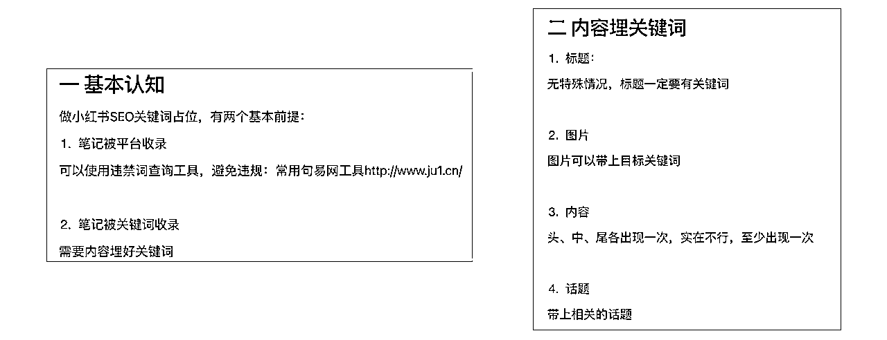

#### 3）正文

核心就5点，如图：

1.  确保关键词布局

1.  结构化、逻辑清晰、断行

1.  信息密度

1.  小红书表情包、五颜六色符号

1.  行为设计：引导用户【赞藏评关注】等行为动作

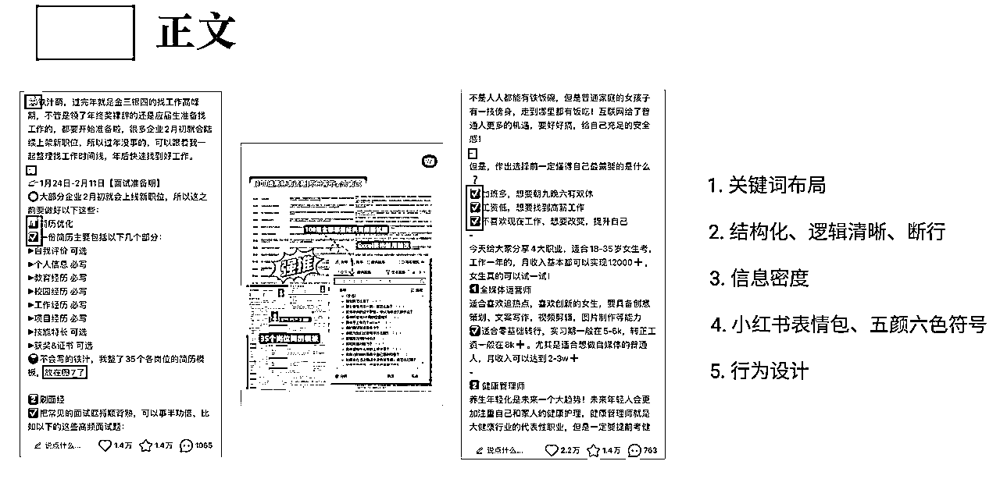

#### 4）评论区

评论区多引导用户互动，如果是引流号的话，引导用户私信，并注意用一些谐音词避免违规

如果你是小红书信息流投放的话，用户可以直接私信你，你也可以正常回复（小红书信息流投放，官方有一些免责规定，避免引流封号）

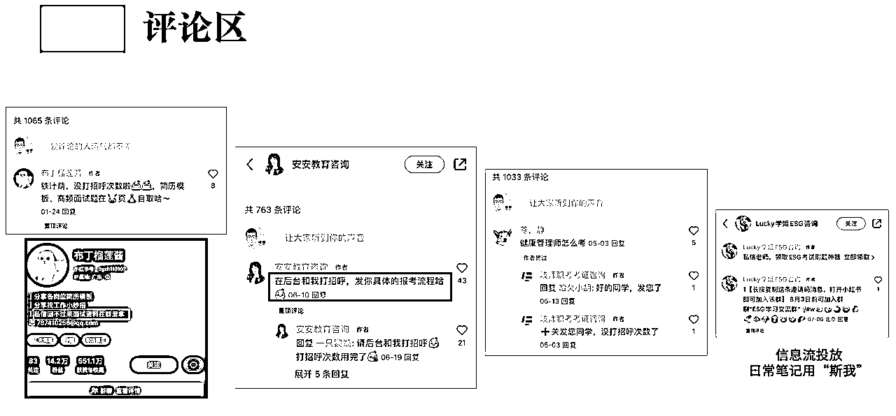

### 运营

接广号，核心关注的运营数据：粉丝数、爆文、点赞&收藏；

引流号，核心关注的运营数据：评论数、私信数

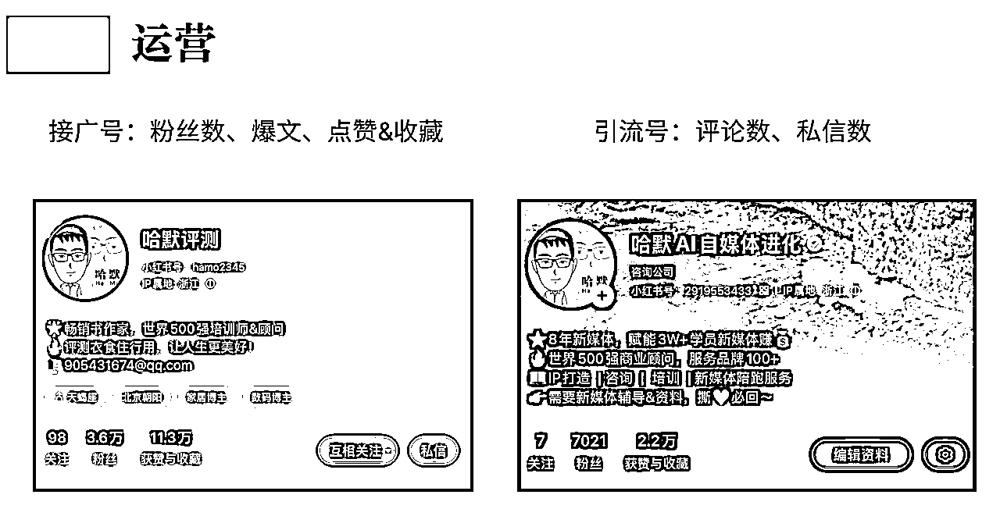

如果你自己或者团队，有其他小红书账号，具体运营方法，有6个关键步骤：

*   笔记发布之后，用其他号搜索【文案标题】找到该笔记（获取搜索流量）

*   笔记阅读完，点赞&收藏，然后关注博主（拿到CES各项数据评分）

*   关注完成后，以后发笔记，首先在【发现页】刷3屏，进行点赞收藏等动作（获取推荐流量）

*   如果【发现页】没找到，搜索笔记关键词，找到该笔记（获取搜索流量）

*   数据维护时，如果团队账号较多，可以切换为【手机网络】，避免被系统识别

*   数据指标：接广号确保10个【点赞&收藏&好】；引流号确保5个【点赞&收藏&引流评论】

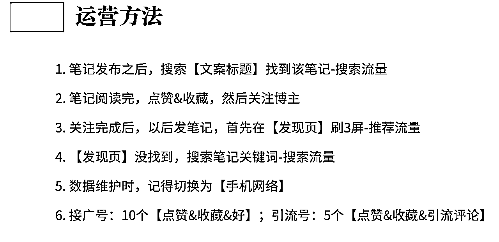

问题思考：小红书个人号和企业号，如何选择呢？

*   注意区分：个人号和企业号是按照属性划分的，我们做账号选择时不应该以这个为主要依据，而应该问自己：做接广号还是引流号！接广号和引流号，是小红书底层账号功能划分

*   个人号：适合在小红书生态内玩法，接广号和带货为主，为高客单提供背书

*   企业号：适合小红书公域导私域，引流号和矩阵号为主，为引流变现提供支撑

【本章小结】

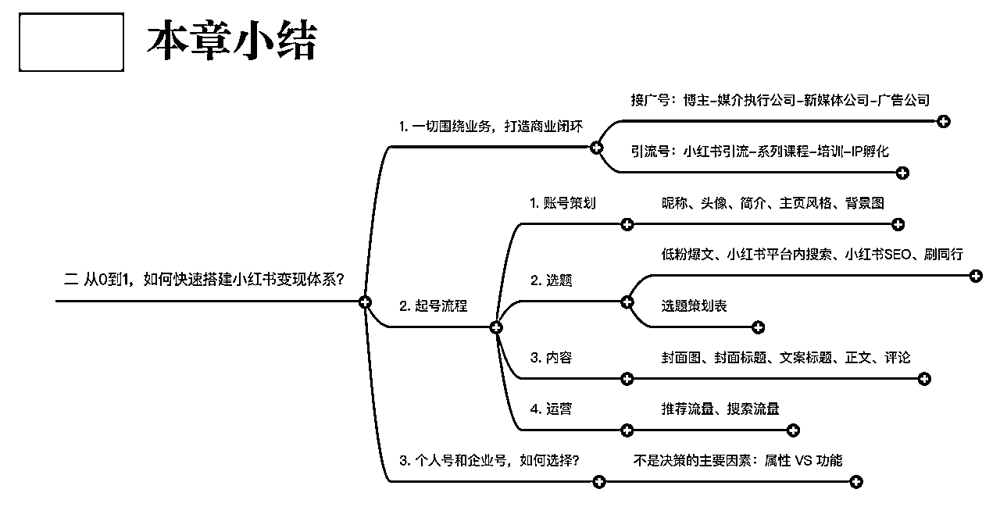

# 三 小红书三位一体系统：产品-流量-转化

## 一）产品

小红书寻找卖得动产品的方法：在平台内找对标，进行产品开发

路径：小红书搜索-关键字-商品销量优先-找到卖得动的产品，如图

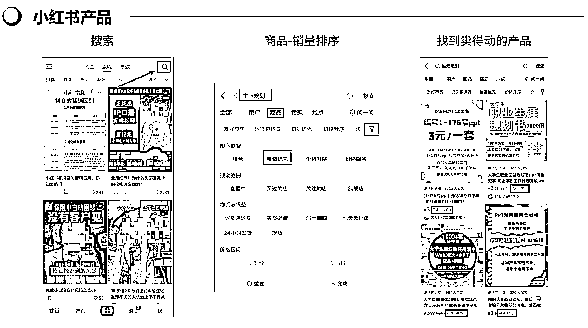

## 二）流量

举例子：曾经有个心理咨询师，问我小红书应该卖啥产品呢？流量应该怎么做呢？

我直接给了她3张图，如图

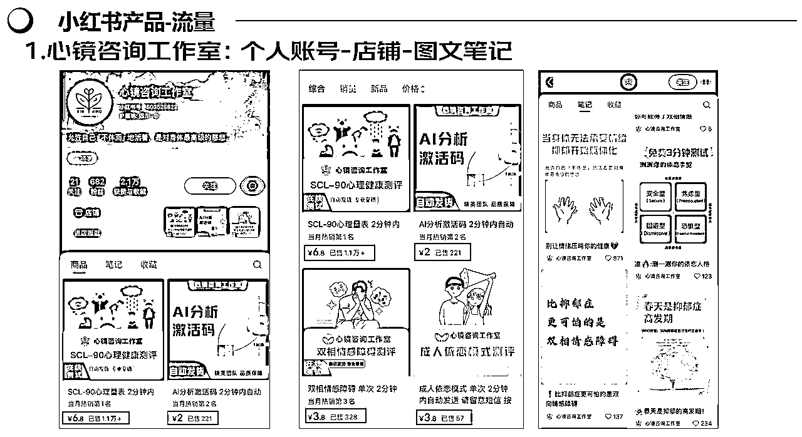

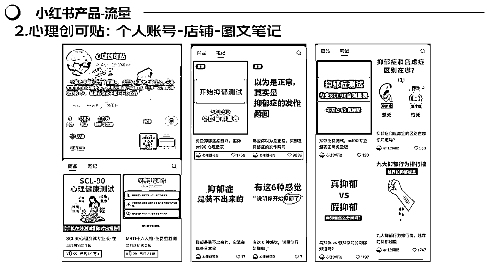

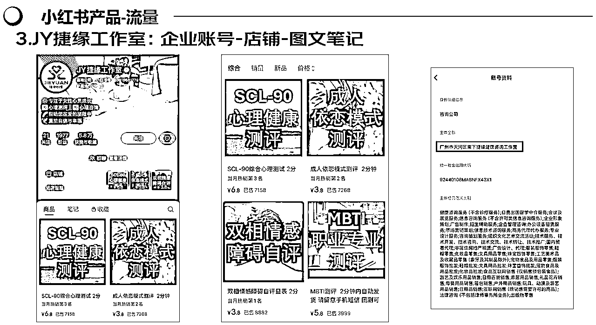

当她拿到3张调研结果之后，瞬间搞懂：

*   卖的产品是：SCL-90，因为无论是粉丝几百个还是上千个，这个产品都能卖几千上万份，说明产品足够好

*   流量做法：个人号和企业号都可以，要开通小红书店铺，用图文笔记进行流量获取

于是她开始执行，第二周就开始在小红书上成功变现！

所以，若想提高小红书变现效率：你要的答案，都在竞争对手那里！

## 三）转化

小红书一共有7大转化路径：如图

*   普通笔记

*   商销笔记（挂购物车的笔记）

*   群聊

*   私信

*   直播

*   表单

*   种草外溢（外溢到京东、天猫等平台）

比如我们自己的保险引流账号，就用的是：商销笔记和群聊，如图所示

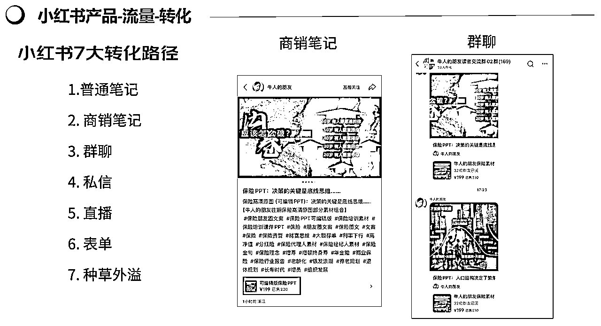

所以，无论你看谁的账号，一定按照7个转化路径，详细梳理，找到适配自己的

【本章小结】

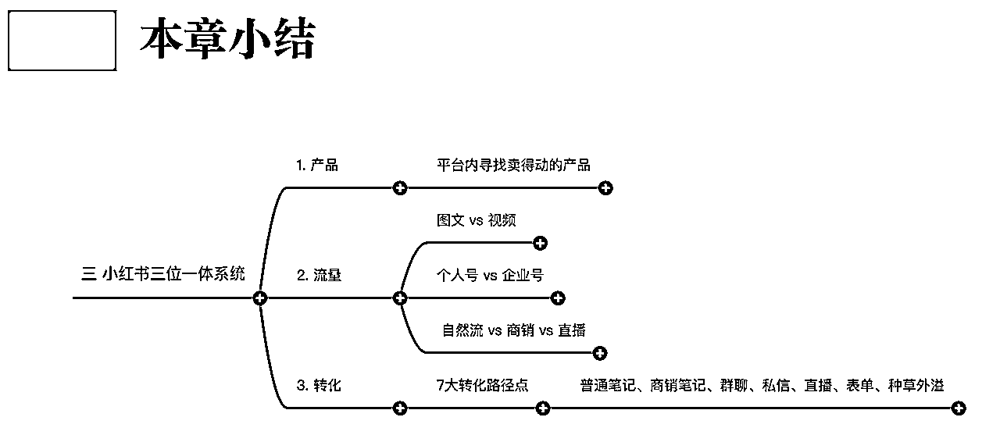

# 四 小红书高效引流微信的全套路径指南

## 一）引流路径

我给大家列出9种引流方式，如图，其中只有5种是安全的：社群维护、被动私信、评论引导、账号简介和店铺商品

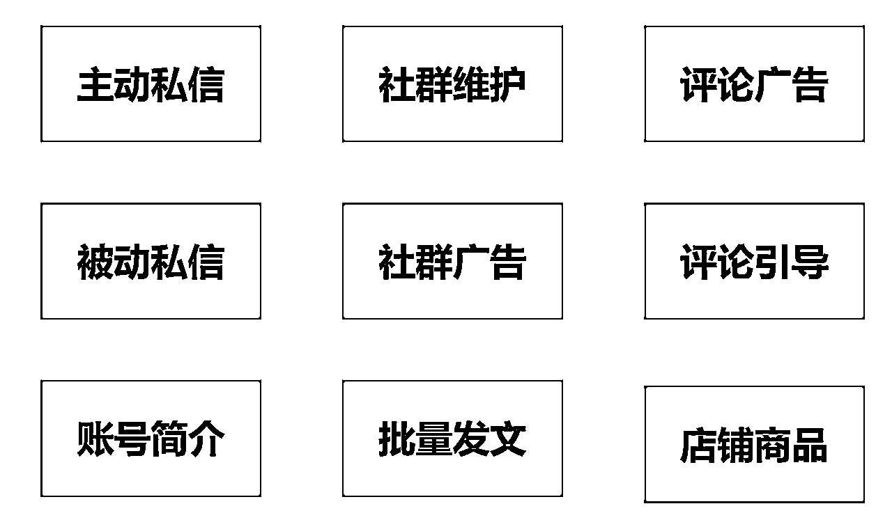

按照引流效率高低，分为3种：效率低、效率中、效率高

### 效率低：引导用户发联系方式

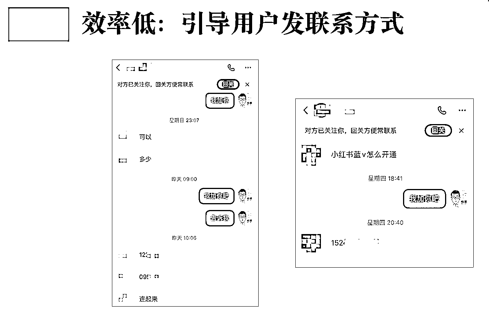

### 效率中：账号简介、社群维护

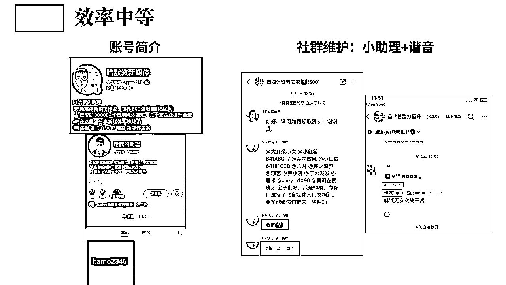

### 效率高：评论引导、被动私信、店铺商品

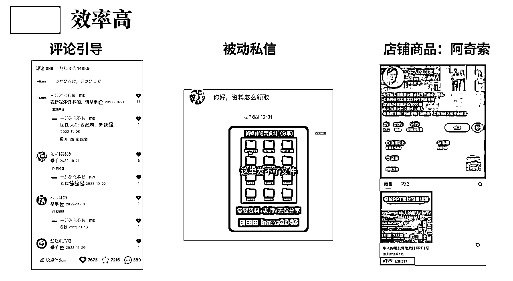

特别推荐：评论引导+被动私信+店铺商品

作为这么敏感的保险领域，我们在小红书安全引流的方式，主要采用的就是【店铺商品】：开通小红书店铺，笔记挂载商品，当用户下单产品时，获取用户联系方式加到微信。

（对于敏感&限流领域，不妨多试试商销笔记，用挂载小红书购物车的方式，避免私信的违规处罚）

## 二）小红书公转私工作流

小红书公域转私域，总共有9个步骤，如图：选题策划-笔记创作-关键词布局-评论引导-诱饵物料-小红书私信-微信承接-加微话术-销售转化

选题策划、笔记创作、关键词布局，前面已经详细讲过；加微话术、销售转化属于私域里的动作

所以，我们着重以【评论引导-诱饵物料-小红书私信-微信承接】为例分享：

评论区做好引导，当用户用户私信时，直接发【诱饵物料】图片，当用户加微时，我可以同时加企微和个微（先在企微添加用户，然后还可以继续加个微，实现双渠道添加）如图

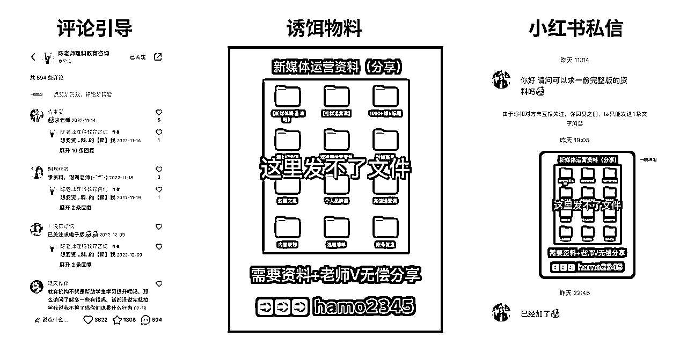

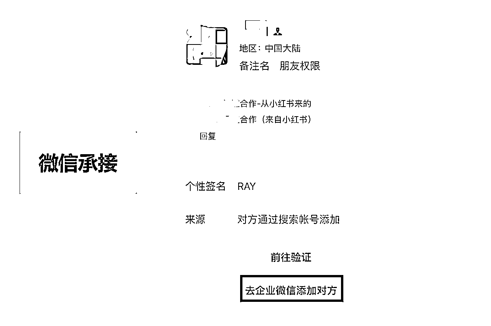

另外，当你做好引流全流程，想快速引流放大的话，可以使用2种方式：矩阵化+信息流投放

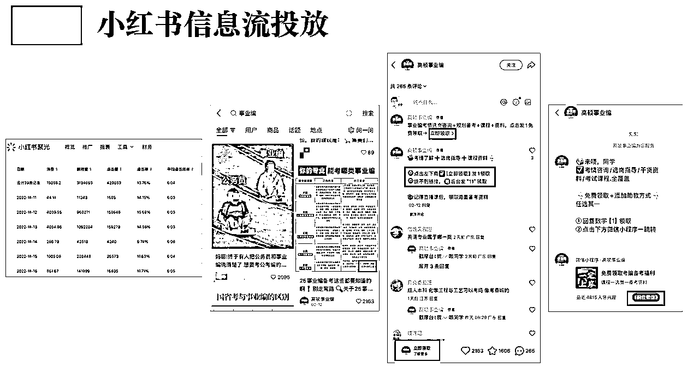

【本章小结】

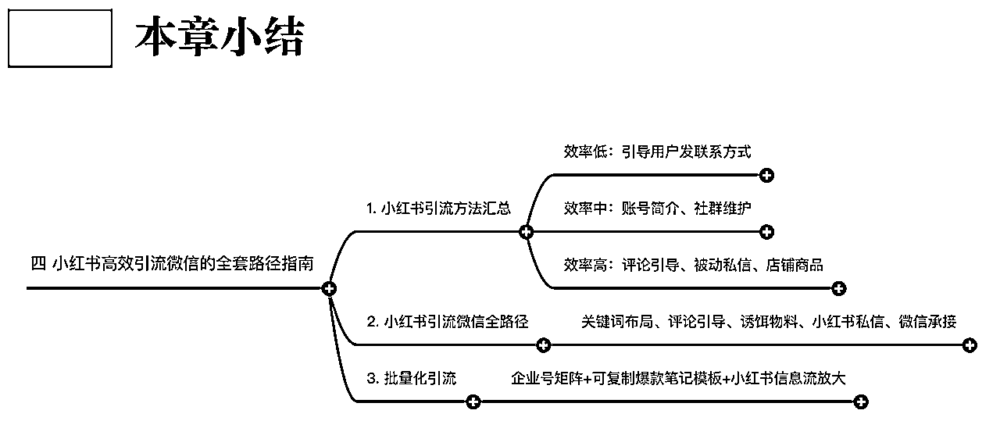

总之，小红书是非常优质的平台，可以助力你的业绩翻10-100倍

无论是接广号还是引流号，一切围绕业务做小红书！让你的小红书账号服务于品牌、战略、产品以及整个商业模式！

最后，祝愿各位在小红书上拿到结果，让好品牌、好产品、好业务在小红书上闪闪发光！

我是哈默，期待与你多多交流，让我们一起进化！