# 快手ai短视频带货玩法实战分享

> 来源：[https://wql5ixa4cw.feishu.cn/docx/YAKAdyFvLouDxdxYoqRclTDEndg](https://wql5ixa4cw.feishu.cn/docx/YAKAdyFvLouDxdxYoqRclTDEndg)

# 前言

各位圈友大家好，我是金成，不善言辞的实战派，5年老圈友。

这么多年兜兜转转，和快手一直有解不开的缘分，从21年快手小游戏一直到现在，几大主流平台之中，我最熟悉的也是快手。

今天给大家分享一个最近比较火，变现能力比较强，容易上手的项目，快手ai短视频带货的实战玩法。这个项目不是我发现的，更不是我发明的，是快手官方放开全站商品投放之后，江湖上流传出来的新玩法。我只是从实战角度给大家做个分享，把一些最新的重要点以及大坑给说清楚，以免圈友走弯路。我之前不太愿意在圈内分享，是这种玩法虽然难度不高，但是本质上是一种搬运行为，我觉得上不得台面，入不了各位大佬法眼。

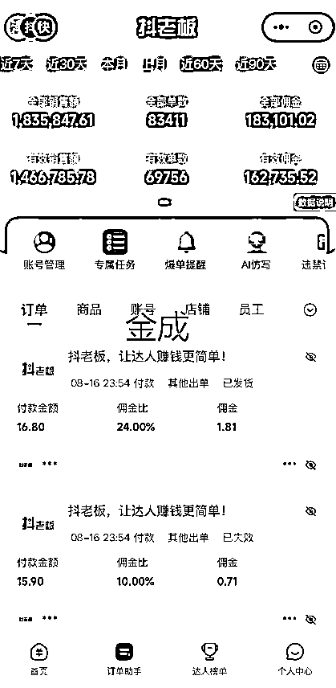

开篇之前，我先给大家建立一个共识，快手这个平台是被很多圈友严重忽略的一个平台，因为平台粉丝群体不一样，这么多年的发展逻辑不一样，所以在快手有一些不为人知的玩法，变现能力还是很不错的，甚至可以说快手有些方面很包容，所以变现方式很狂野。

例如我之前分享过的《民间土方分享直播玩法》https://scys.com/articleDetail/xq_topic/8858444418814422

现在还在做，只不过难度相比之前更高一些，成本也更高一些。贴一组数据给大家参考一下。有兴趣的可以去看下我之前这篇文章。

# 正篇

闲话少叙，正是开始今天的主题，我会从“是什么，为什么，怎么做”，着重实操的角度给大家解析，快手ai短视频带货实战玩法。

这里再给大家达成一个共识：搬运一直存在，并且之后很长的时间内也会存在，会随着平台的迭代一直迭代。这是我们没有办法避免， 甚至会在一些角落被平台所默许。因为平台也要吃饭。我从做短视频开始，我一直是看不上做搬运的，但是并不妨碍这种玩法的存在，并不以个人意志为转移。

# 一、快手ai短视频带货是什么？

这是一种快手独有的，达人带货形式，在各种选品广场的榜单上，都有他们的账号存在。

你可以去搜好物、五金等等关键词，可以直接找到他们。只要看到作品是带有这种封面的都是。正在直播的说明正在赚钱。

## 基本的操作流程

个人账号实名之后，开通带货达人资格，可以实现零粉开始带货，零粉新号每天可以挂车20条视频。然后使用ai软件自动处理视频，复制链接，自动处理视频，自动发布，自动挂车，用自然流出单。借助开直播（聊天室放映厅放电影就可以）加上微付费投流，去撬动动自然流出单，再去适量放大。

我们都知道挂车之后的视频数据跑不高，那就借助工具用量取胜，ai软件+矩阵去放大收益。关于个人如何实现矩阵后面会说到。下面这个视频可以很清楚的这个玩法的模型。

# 二、为什么会存在？

存在即合理。现在各大平台已经基本定式。对于快手这样的粉丝已经定型的老平台，维持生存才是最重要的目标。所以快手在去年底开始测试这样的“全站商品玩法”，今年三月份开始放量。所以出现了各种狂野的变现玩法。

不得不说发现这种玩法的人是个人才，居然利用聊天室+微付费的方式去撬动自然流，甚至还有白嫖付费的方式（后面会重点讲）。

项目的推动肯定是需要官方的推动，这点毋庸置疑。现在快手正在大力推动这个事情，在快手官方的名称叫做“商品推广-全站推广”，现在“快手全站推广“这个付费流量入口上线时间不长，快手的商品素材流量，在这个付费入口得到推荐以及流量扶持。所以现阶段机会还是有的，至于是不是风口，全凭个人感知，有肉先吃，无肉喝汤等风来。

尤其是新号，从七月开始，新号的七天扶持期还是非常明显的。很多都是在这七天之内做起来的，后面就一路长虹。像下面这这样的账号，别看几百条作品，其实做的时间都不长。一天20条作品。五百条作品也就是不到一个月的新号。

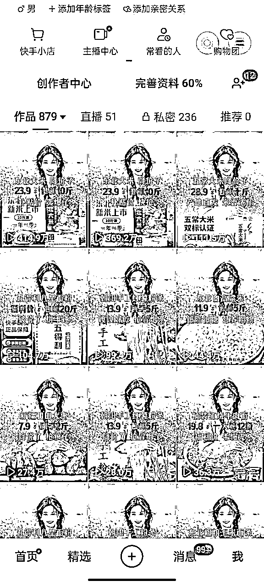

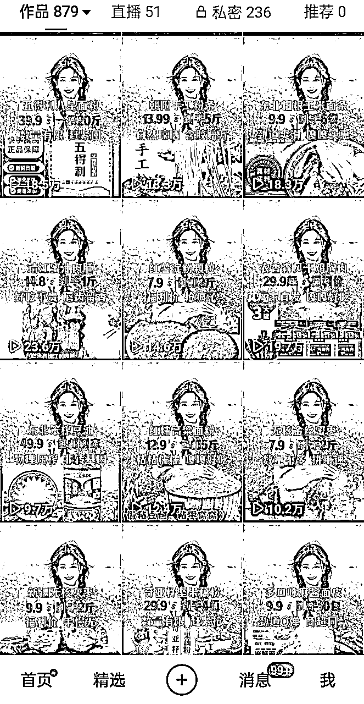

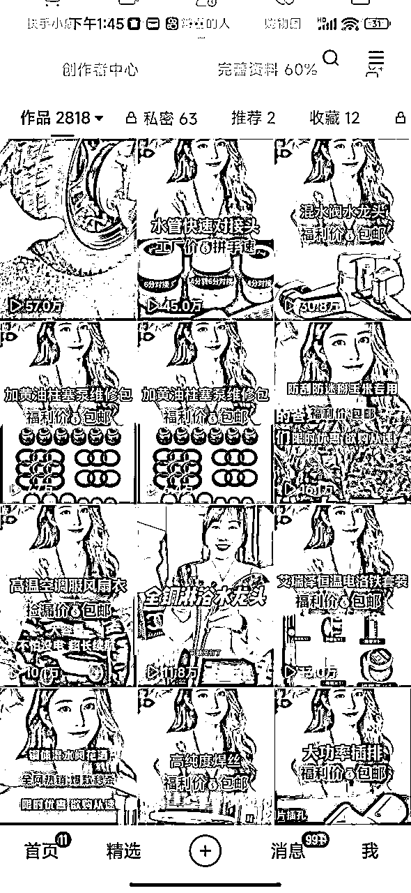

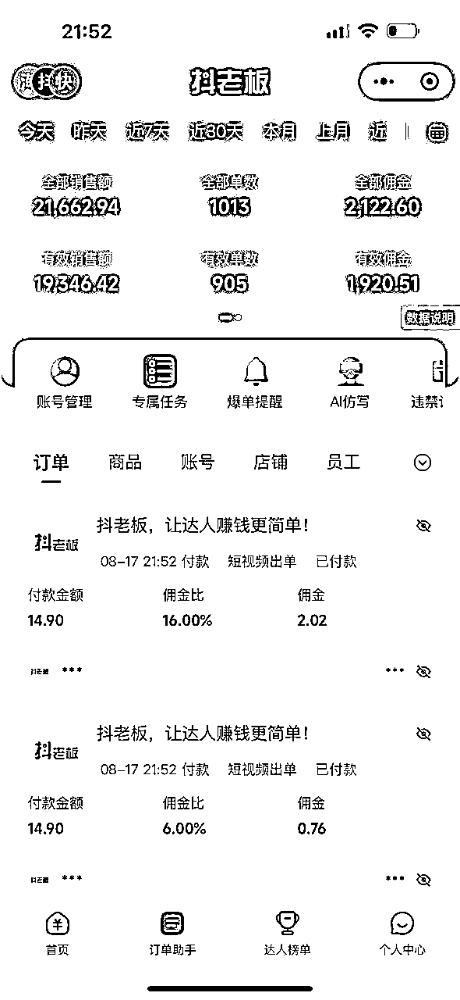

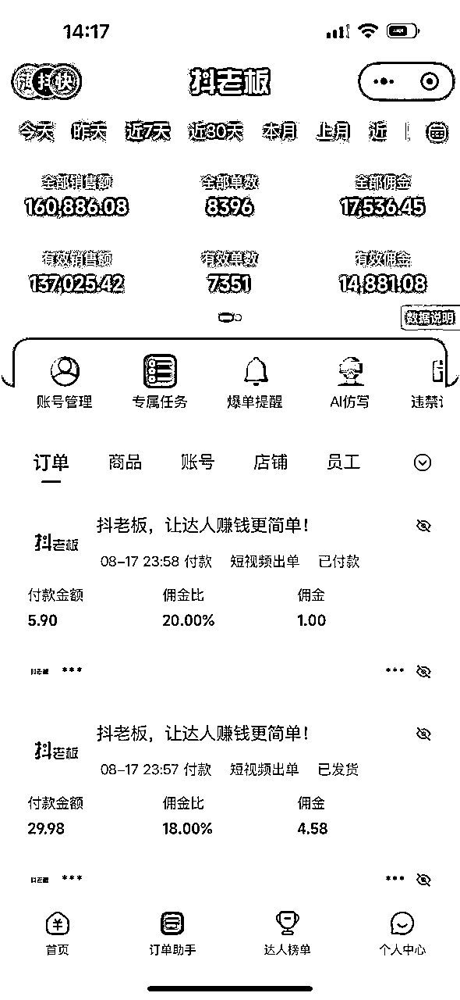

# 三、具体怎么做？

这里正式开始进入实操环节，每一步都是细节，也是现在最新实战中的技巧。掌握好了可以一周之内起号并且盈利。后面会有重点问题答疑，做个补充，算是喂饭级教程。

## 账号准备

个人玩家：至少3-4台手机+电脑。

电脑是用来安装ai软件的。也方便后期查看账号数据之类的。手机安卓最好（8+128）二手市场400左右一台。一个人可以实名注册两个快手号。个人玩家准备3-4个号是很容易办到的。

如果实在没有电脑的个人玩家，也可以用手搓的ai软件，只是效率相对低一点，不过说真的，手搓的视频，反而更容易过审。有同学时候一直用手搓软件，收益比较稳定。

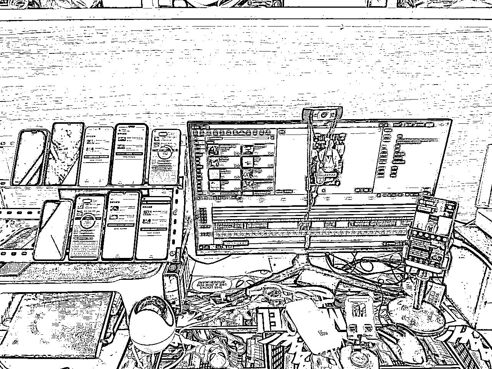

工作室玩家：一张个体营业执照可以开通5个快手达人资格，然后找人实名快手号。提现直接到营业执照法人银行卡，这样方便提现管理。一个法人可以三张不同的营业执照各开通5个达人带货资格。账号多多益善，但是提醒一下，先跑通一个号或者是一组账号，然后再再去放大比较好，这里重点难点在于后面的选品，以及选品之后的延续，才是稳定出单的保证。

这里也有一个弊端，假如某一天，某个账号有大型违规，存在罚款的话，这个账号的不交罚金，会从其他账号上面扣除，不过现在我们带的品不会出现这样的现象。

## 1.账号的分布管理

手机按照功能要区分为直播手机和选品手机，通常的做法是直播手机顾名思义用于挂车发视频以及直播。一机一卡一号，直播的时候可以用WiFi。

选品手机主要用于选品，选品手机上面登录的是挂车的快手号。

例如：三台手机ABC，AB是直播手机，C是选品手机。C手机上面会下载一个快手极速版一个，这样用选品手机选品，添加商品，不影响直播手机挂播。也可以借助有些安卓手机的分身功能，实现分屏直播。

## 2.矩阵账号的网络问题

个人玩家的几台手机，一机一卡一号是没有问题的，直播的时候用一个WiFi没有问题。

超过15台以上的矩阵，建议多拉一条网线。

## 3.设备要求

直播手机8+128以上配置都够用，安卓优先。如果要用手搓ai软件的话，建议使用好一点的安卓。然后分发到各直播手机。我用的是小米10，可以软件自带分身，相当于可以登录两个快手，两个极速版。其他平台的一些手机型号也有一样的功能。

电脑：CPUI5以上，1060以上独立显卡，我自己的要求是，能成功运行剪映的电脑就够用(我对电脑配置不懂)。

## 4.软件的选择

现在市面上分为两大类，手搓ai和电脑ai。各有优点，看自己的习惯选择合适的才是最好的 。

手搓ai有MT，雷霆智剪AI，都比较稳定，MT需要对应旧版本的快手。雷霆需要卡密。

电脑ai软件，用传说，闪电侠。比较稳定。但是电脑用的软件都需要密钥，这里就没有办法给大家做演示。市面上有人专门卖月卡季卡之类的。

下面是MT的使用教程，大家可以看下。安装包我也在放这里。

上面↑↑↑这是最新版本的MT安装包。需要下载快手旧版本。旧版快手去豌豆荚里面下载。

## 5.起号阶段

基本的流程是：新号发布一条随手拍的视频，放24小时以后，流量正常那就直接实名开始带货，记住了一定是开通达人带货资格，不要去开店。

我一般是采用三天递增的方式发布作品，第一天发3条，第二天发3-5条，第三天发10条，第四天发10-15条，第五天发到20条。

第二天开始投流前一天的作品，第三天投流前两天数据好的作品。后面类推。投流的细节内容，后面会重点讲解。

这里注意一个小问题，新号开通达人以后，看不到自己视频下面的小黄车，也看不到别人视频的小黄车，很不方便。

解决办法：可以直接给快手客服打电话 4001260088，选电商问题找人工客服，告诉他解除新手保护。一般24之内小时就搞定。

# 重点来了，选品和投流

选品是重中之重，投流是按部就班，按照基本方法论走能拿到结果。

# 选品

选品需要遵循的原则是：1.近期的爆品，2.垂类选品 3.低价高佣+高价低佣，后面商品计划，白嫖付费流，做到零消耗每天几百单。

## 1.近期的爆品

有几个途径可以选。刚开始随便选一个去找品，或者都可以去看看。这个要养成一个好习惯。比如今天你要发20个品的视频，那就选30个品出来，再优中选优。

如何去选，可以参考下图， 曲线正在上升的，或者有趋势上升的，或者巅峰后正在回落的。或者出单一直比较稳定的品都是可以参考的。

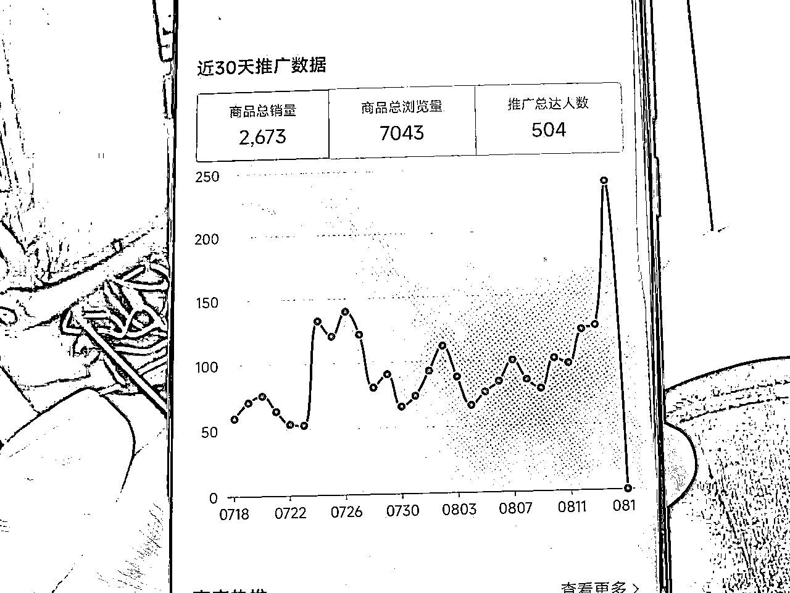

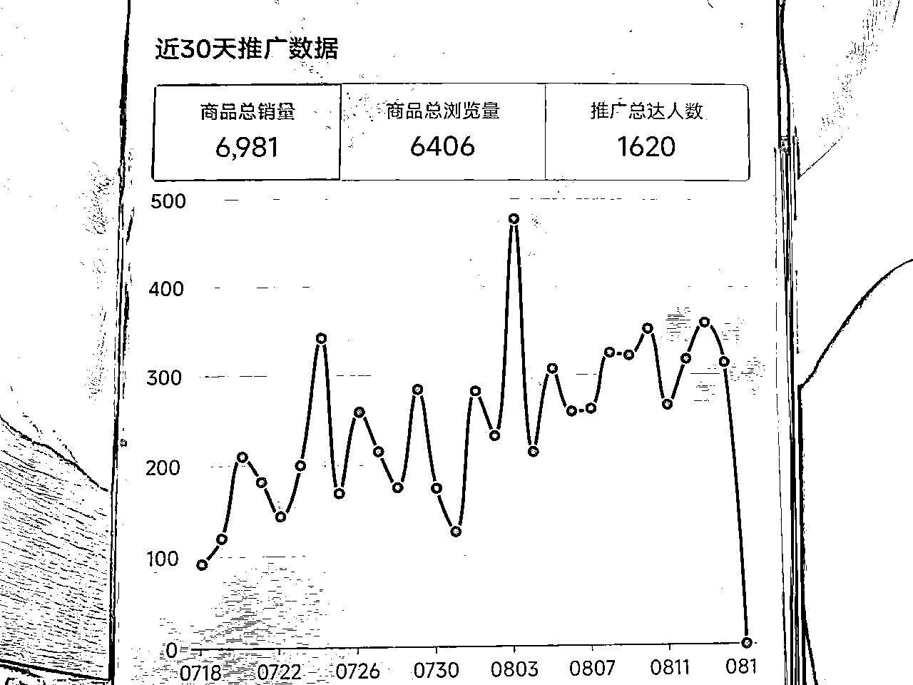

销量远远大于推广达人数，多多益善，参考下图

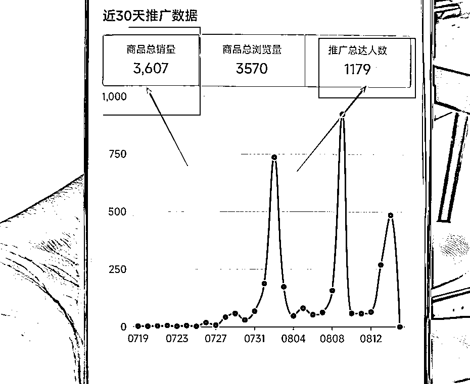

商家评分一定要高于4.6以上，好评率越高越好。至少也要这个商品的商品评分不能低于4.5。不然会对我们自己有影响。如图参考。

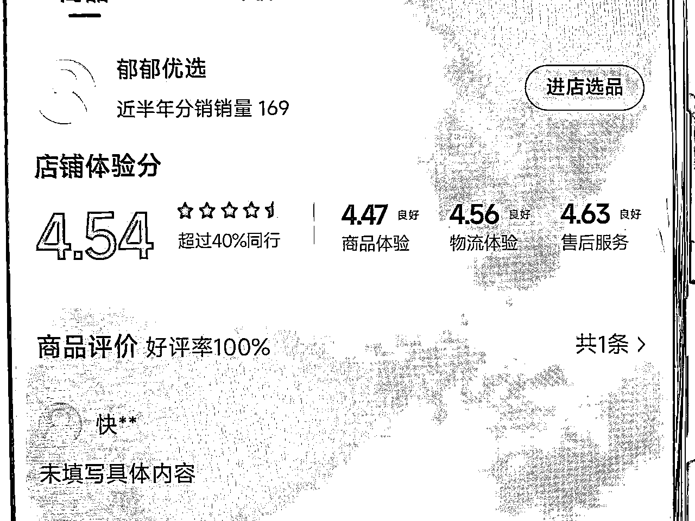

## 2.垂类选品+人群分类选品。

顾名思义，就是一定要做垂直类的账号，至少也要粉丝人群垂直。方便以后产品的延伸，因为不可能一个产品一直卖。卖女装就坚持卖女装，只要一直出单那就不用换，一直选最新的女装跟进爆款。这就是真正的垂类选品。某一天发现女装有点卖不动了，可以针对这个人群选一个相关的品，还是会出单，

比如之前卖女装，粉丝是45以上妇女，那换品可以有多个方向，保湿润肤的美妆用品；厨房相关的品。都是可以去尝试。

我们最近做的主要品在于，五金，女装，美妆，零食，户外，美食。其实还有很多细分方向还是可以做的。做细分赛道的其实也很香。新手建议随大流先拿到结果，找到感觉以后再做细分赛道。

还有一种方法选品，是全品类起号，筛选出出单的细分方向。新号选品各大品类都选一个到两个，哪个品类出单再去垂类更新。

这里切记新号先用软广起号，再接硬广。这招百试不爽，效率和成功率都能大大提升。

什么是软广，什么是硬？看下面的视频案例，一目了然。

## 3.容易违规的品

这里不得不说一下，千万别碰的品，快手罚款的时候手是很黑的，大家千万要注意。

产品严重与链接不符合 （会罚款）,以下这些都是团队踩坑一个一个踩过来的，都是血泪教训。

素材买卖价格与链接极度不符合（素材里面讲9块9发5个，实际链接9块9发三个）

擦边产品不要碰（黑五类的 类似于这种，不要去发）

罚款品：冰粽子 肉粽子 榴莲粽子 咸鸭蛋 鸡爪

零食：地锅鸡，甲鱼克数，酸菜鱼克数，葱油饼，盐渍海带丝，玉米包装克数，核桃和核桃相关的，

所有水果，地里种的，树上结的，冰箱里面拿出来的

各种冷冻海鲜，鲜肉类，肚包肉

各种蛋类，鹌鹑蛋，鸭蛋

功能性产品：减肥的，祛斑的，失眠的，降糖的，咖啡。封建迷信，壮阳保健，酸枣仁茶(文案助眠)，

卖惨的桑葚干【如:哥哥姐姐们今年的桑葚都卖不出去】

爆爆珠(接吻糖)，白桦树汁，荞麦面包，荞麦月饼，蛋月烧桑叶茶，亚麻籽桃酥，鹰嘴豆(文案控糖)

五金:弹弓，刀具棍棒，弩

如果不是本人实名的账号，里面也没有佣金，罚款过多就不要了，切记！！视频素材产品跟链接一定要是一样的东西 （包括颜色、款式、数量，不能货不对板，发的时候要仔细看一下完整视频，如果不一样就先不要发，会违规罚款，正常不会出现，但大家也要自己看一下细心一点总没错）

## 4.低价高佣+高价低佣

新号选品记得先选低价高佣的品，比如九块九佣金15%，甚至20%佣金的品。这样的品容易出单（参考前面的选品规则）。

账号会逐步形成商品标签，再加一些客单价低佣金的品去卖。

最重要的是，这样起来的号，半个月之后的作品数量到了一定程度，开启商品推广的时候，可以把所有的品拉通投流。会出现几乎为零的消耗，单量却很大的现象。直接白嫖官方流量，经常出现一天几百单甚至几千单的白嫖。后面会重点讲到这个投流的具体实操内容。

# 投流

快手AI短视频带货玩法的投流，属于微投流，一次充值10块去消耗就够了。主要是为了配合直播撬动自然流。

这里就按照账号阶段的时间线给大家梳理实操，更容易理解。

## 1.起号阶段，探索标签。

起号的时候每天都在递增的发作品，第四天开始每天都有10个以上的作品。我们可以选择当天投新发的作品，第二天投前一天的作品，后续每天延伸出单的品去选品。

举例：今天五金的扳手出单，那可以延伸到改锥、工具刀和五金相关的品，和出单人群的可能有共同需求的品类去选品，至少选十个品，也就有10-15条作品。

同时投流，今天把昨天所有的品全部一起投粉条，明天也是重复这个动作。

这里投流可以选择投粉条，也可以投极简。粉条的投法和极简的投法，全站的投法，下面有视频教程。

前三天如果有出单，就可以马上开全站直播，没出单，就等作品在40-50个以后，开全站直播拉标签。

这时候就会出现两种情况，前三天就开始出单的，那就全站开启，这时候可以选择性的给视频投粉条。

第二种情况，作品发到50个左右开启全站，但是还没有出单，那就选择视频数据好一点的进行投流。出单就按照第一种情况处理，如果还是不出单，那就直接换品，继续按照前面的步骤来操作。

到这里第一步就算是走完了。

## 2，上升阶段，延伸品类，适当放量

到了这个阶段，同学们应该都对整个前期流程以及选品、投流有一定的感知。下面分两步走：

1.把出单的品去做延伸，筛选出这个账号更多会出单的品，每天继续把出单的品，继续找新的素材，把流量榨干，实在找不到新的素材就把之前出过单的视频素材，混剪之后，过ai软件再发。

同时每天都在上新品，做延伸去选品，让一个账号多品出单，那这个账号就算是培育成功了，毕业了。后续就是按部就班的到下个阶段开始“商品共振、白嫖流量”

2，加账号放量。第一个号或者叫做第一组号，例如选的是五金的品，通过前面的实操，已经对这个品类，以及整套流程比较熟悉，那再培育出第二个第三个，甚至更多的账号，就轻车熟路。

把这个账号变成这组账号。这样去放量效果翻倍。如下图就是一组6个号一天的数据。

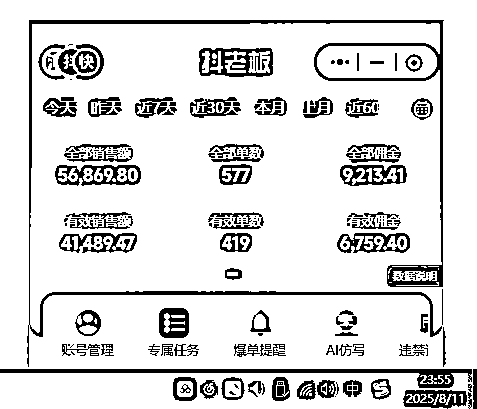

另外有的同学肯定就要问了，那我做了五金，能不能做其他的品类。那肯定的，鸡蛋不要放在一个篮子里面。好的篮子，足够多的篮子是很必要的。

我们可以根据，自己的精力，资源。再扩一组五金或者其他品类都是没有问题的，这就是更加适合工作室来操作。个人精力实在有限，贪多嚼不烂。把一组，两组账号培育好，就已经很不错了，一个月下来五到十万问题不大的。

## 3.成熟阶段商品共振，白嫖流量

前面两部走完之后，账号的作品，以及选的品已经积累到一定程度，（这三步骤，没有非常明显的界限划分），每天稳定出单之后，选品的整体都是，低价高佣+高价低佣。那所有的品都可以一起开商品计划，实现这样的白嫖。

一单收益在2-4块以上的品就比较合适形成共振，一般不选佣金过5块以上的品。如果要说原因的话，高佣金的品，不容易跑出量。没有量没有意义。

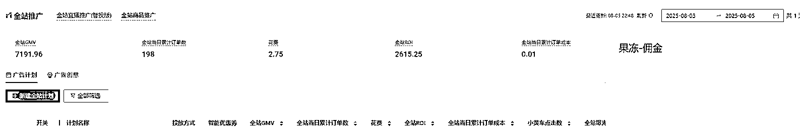

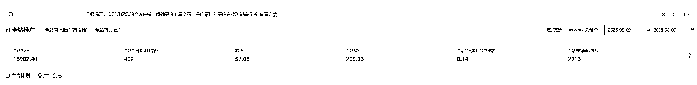

## 4.ROI系数的调整策略

以上是三个基本阶段，那这个过程中会出现的常见问题就是，ROI系数的调整策略，这是我们实操之后行之有效的方法，大家可以试试。

### 基础原则1：

新号找到能出单，又能消耗的平衡点，多做人群探测，数据会越来越好。

新号对于平台来说，没有任何数据，标签，平台不知道你要干啥，所以这时候投流是微亏的，前面视频教程看到我们充值都是10块充一次。就是为了预防跑飞的现象。最低成本的起号。

所以把握这个度就很重要。

### 基础原则2：

稳定出单的号，保持能消耗的ROI系数，尽量去消耗，适当的做放量。

# 四、常见问题答疑（没有重要性先后排列）

1.投粉条的时候有两种情况：

播放是高，转化低，投点赞评论；播放不高，转化好，投播放量

2.发完作品5分钟一定要检查是否掉框。

掉框的作品，删掉用软件处理之后，还可以再发。

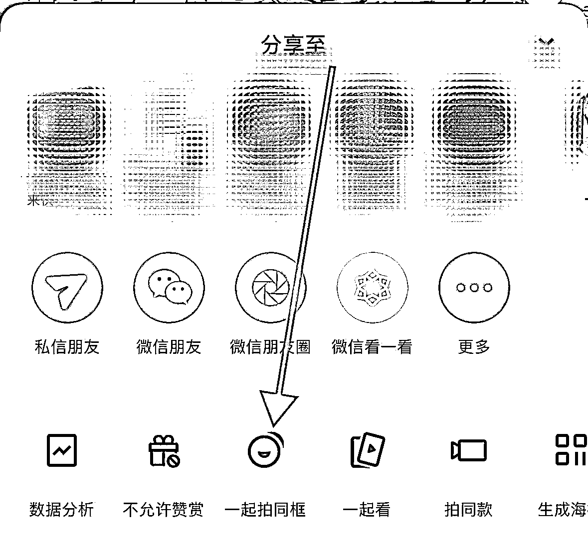

3.聊天直播间怎么开？

4.店铺评分一定要选4.6以上，4.4以下会限流。

5.服装类 预售尽是不要选，发货慢 退款多，找48小时发货

6.找素材要仔细看视频内容，包装，品牌，重量，价格一定要和链接相符，不能货不对板，会违规，擦边的品都不要做，不要有侥幸心理

7.关于快手短视频带货，提现官方扣服务费30%，可以连续一个星期，每天直人直播一个小时即可恢复到服务费10%。

8.矩阵起号，一个品的素材，最多只能发6个账号，第7个账号一定要换素材，否则会批量同质化。

9.开聊天室直播的时候，放短剧。封面要风景的，不要美女图，标题写大家好，不要写厂家发货这些，短剧选集数多的，不要有暴力，擦边那种，容易违规，选正能量的剧，麦静音关掉，进场提醒打开。

10.选品的主要渠道，参考下图。以及在视频推荐也能刷到很多爆款素材。

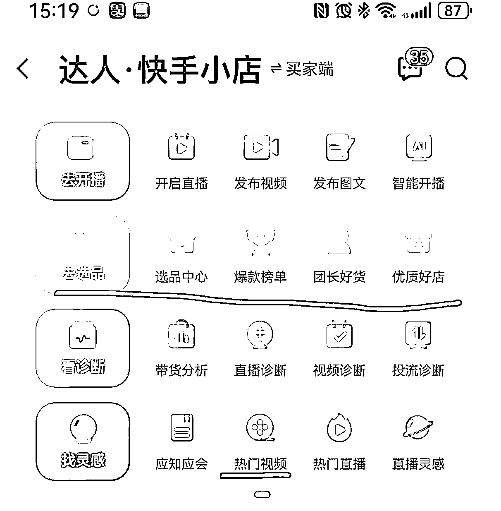

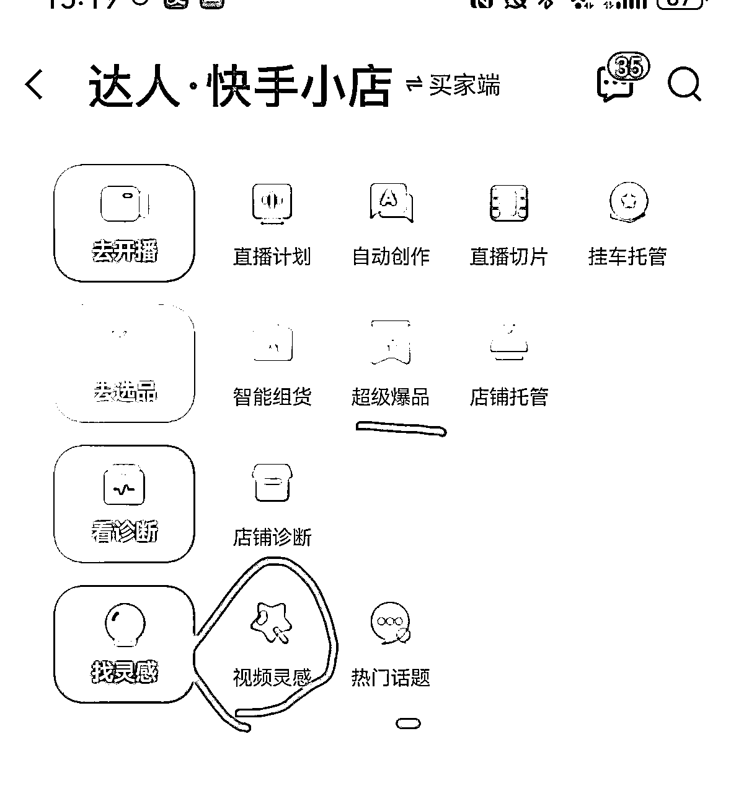

11.这个玩法，老号不如新号吃香。建议直接上新号，新号有七天扶持期。不要在老号浪费时间。

# 结尾

以上就是我整理，快手ai带货的全部实操流程。觉得有用的话，麻烦给我一个小小的鼓励，非常感谢！！

越分享，越幸运，少看多做，把手弄脏，一定会有收获。所有圈友一起生财！！！

其实我个人还是更倾向于做原创相关的内容，但是这就比较熬人，但是做难而正确的事情，一定是对的，我已经在动了，等我做出一定成绩的时候，再来给各位圈友分享。加油！！我们一定会越来越好。