# 公众号流量主：不卷长文，豆包+剪映，分分钟搞定AI漫画，也能日入四位数？

> 来源：[https://p2tkpuv6qm.feishu.cn/docx/R4rodS884oPwuhxFbFQcfb93nCe](https://p2tkpuv6qm.feishu.cn/docx/R4rodS884oPwuhxFbFQcfb93nCe)

hi，各位圈友们大家好，我是格子，做自媒体三年来一直聚焦于公众号流量主变现。

今天这篇内容，我觉得价值千金，就看它能不能等到有缘人了。

最近公众号流量主，我在测试AI漫画领域，并且测试了自己做内容VS搭建工作流创建智能体做内容，日入1000+很轻松。

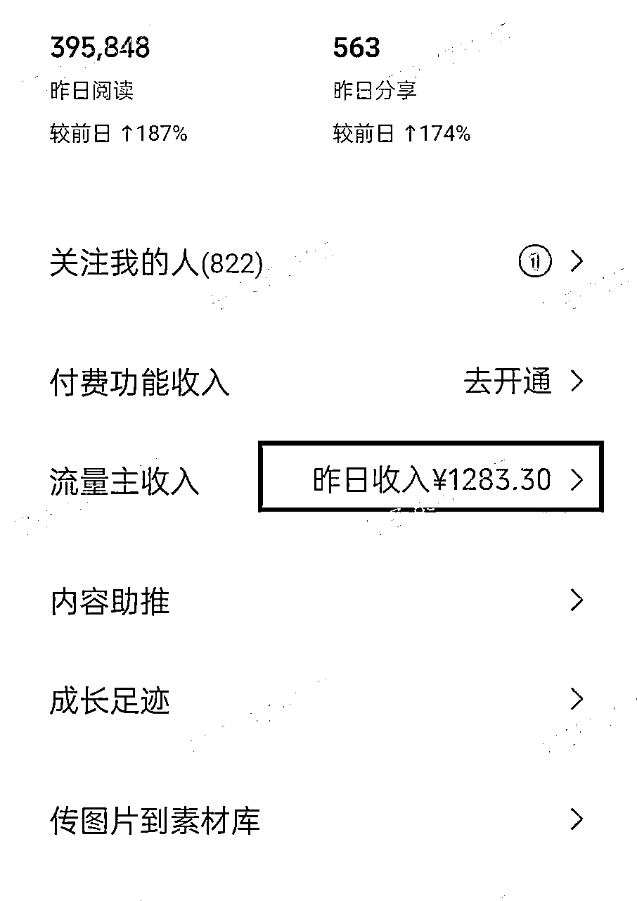

# 一、AI漫画在公众号上的展现形式

AI漫画真的是一个被大多数人忽视的新风口，这个领域潜力巨大，而且正处于爆发前夜！

这种漫画，不是指那种复杂连载漫画，而是几张图配几句点睛文字的“轻漫画”形式。

标题通常带数字盘点感：“这5位明星的逆袭之路”、“00后最赚钱的10种职业”、“情侣相处最忌讳的3件事”……

最惊人的是，这种形式正在席卷公众号的流量池，平台对这种展现形式的内容正在拼命地给流量，有些号真的是天天10w+大爆款。

那些曾经依赖长文打天下的领域，现在正被AI漫画强势重构！

目前用AI漫画重新做的领域比较火爆的有：明星领域、职业盘点、体制类、情感领域等等，我挨个截图给你们看看：

### 1、明星领域：

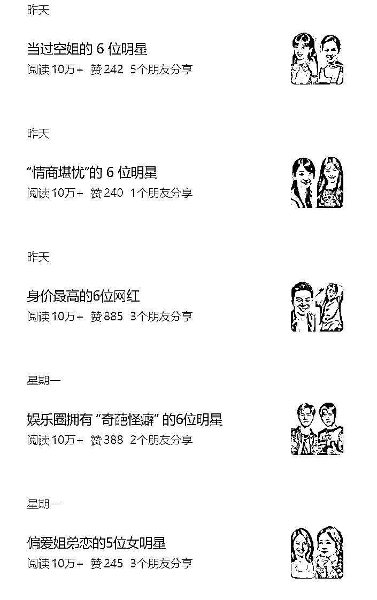

### 2、职业盘点：

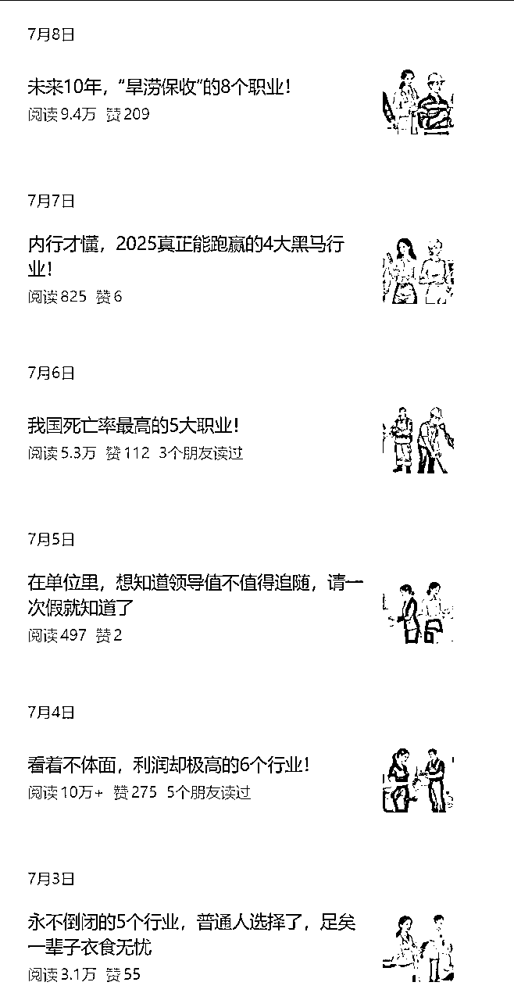

### 3、体制内：

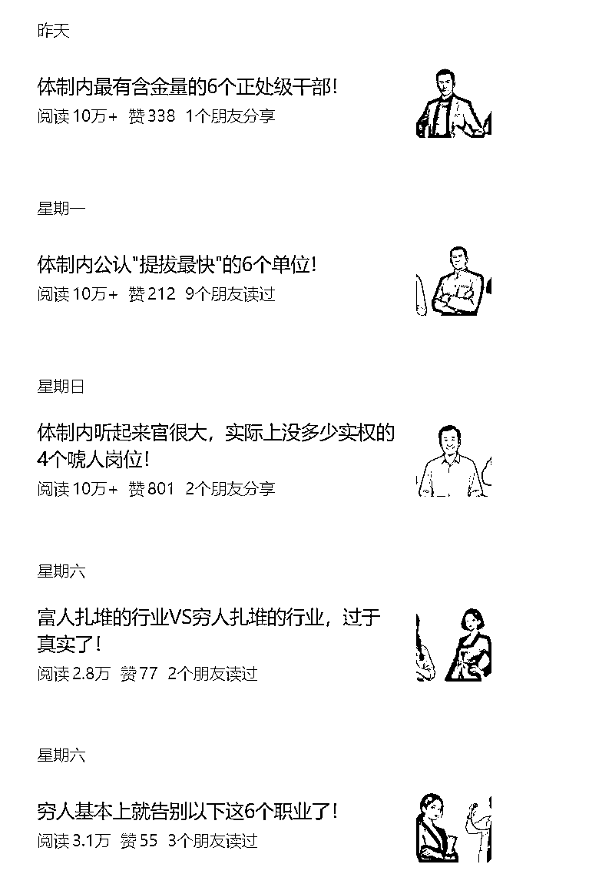

### 4、育儿类：

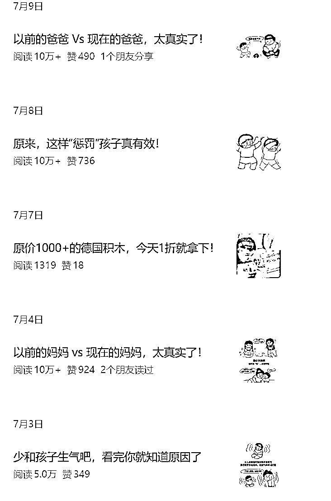

两性情感类的其实也有不少，甚至还有人开始写反腐，流量也很猛，我就不一一贴了，你们自己去看一看搜你感兴趣的领域的关键词，看看有没有做得好的号。

这些爆款你们点进去可以发现，其实内容就是几张图片，图片上加几段总结性的文字，结尾来段100字左右的感想，一篇公众号流量主的文章就完成了。

以上领域，我测试过好几个，都可以很快起号，大部分号一周就能进流量池了。

# 二、AI漫画变现逻辑以及单价

### 1、单价

单价方面的话，我们测试下来，明星类单价更高些，万次阅读可达40-60块，而且流量很猛，很多号一天都是几十万的阅读量，收益每天都是1000+起步，但是也很卷，号起来的概率相对较低些。

像职场、情感类这些漫画领域的话，单价就低一些了，万次只有10-30块的样子，不过没有明星领域那么卷，起号成功率高一点。

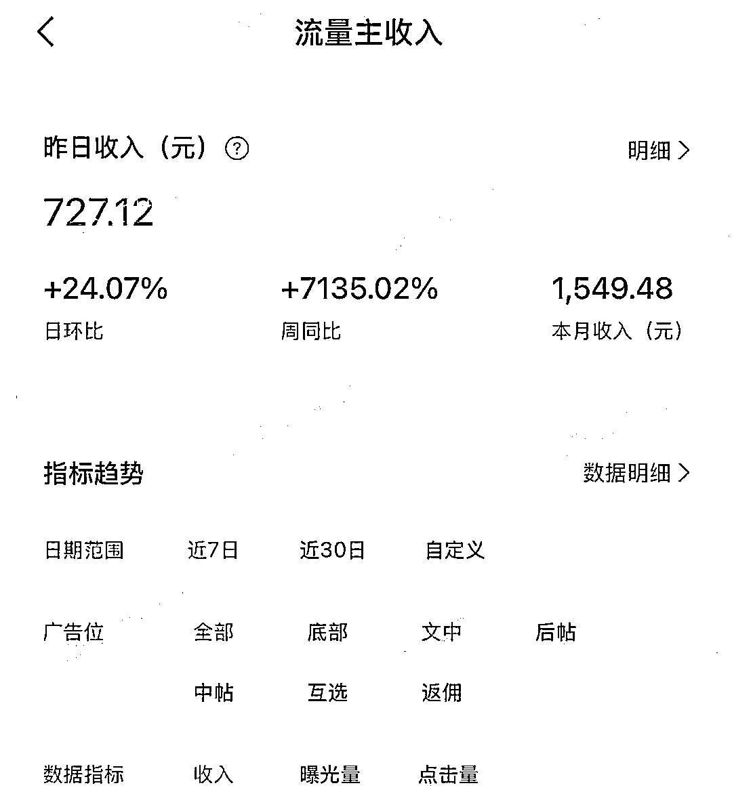

### 2、变现逻辑

在做公众号流量主的小伙伴应该都懂变现逻辑，但是新手可能不懂，所以这里花点时间普及下，老手可以直接跳到后面看重点实操内容。

我们公众号满了500粉以后，可以开通公众号流量主，就能靠阅读量挣钱了，阅读量越多，我们的收益就越多，这个是一个最基本的变现逻辑。

至于500粉怎么来的，其实就是花点小钱解决下，做流量主的都是这样做的，不要总问花钱是不是有风险，如果这个方法不行，大家都不会这样操作了。

开通流量主后，腾讯就会自动插入广告到文章里面，文中2条，底部一条。也就是说：我们一篇1000字左右的文章，会插入三条广告，我们的收益，就是来自于这三条广告的展现，三个广告里，底部广告单价比文中广告单价要高。

像我上面说到的AI漫画，实际上是图片展现形式，文字很少，只有100字左右，那就只有一个底部广告，这种就是挣底部广告的钱。

来个直观的例子：如果这一篇文章有100个人看了，有50个人把你这篇文章都看完了，那就是对50个人展现了三个有效的广告；如果说50个人只看到了第一个广告，那就是有一个广告有效展现。

所以收益就是跟文章阅读量挂钩的，阅读量越高，收益就越多。

### 3、单价怎么算？

1）每个领域是不一样的。

我们做过很多领域，有一些领域的话，可能万次阅读单价只有二三十块，有一些领域万次阅读可能会有100左右，每个领域不一样。

像上面我也说过了，同样是AI漫画，不同的领域单价也不一样，明星的高，职场的情感的就低一些。

也就是说，同样一篇1万阅读量的文章，明星类漫画收益可能在50-60块，而情感只有二三十块。

2）每个人写法不一样，单价也不一样。

这个是针对1000字以上的文章来说的。

领域只会决定大概的收益区间，但不是说一个领域单价就固定了，随便写都有这么多，每个人写得不一样，单价也不一样。

简单来说，哪怕是一模一样的领域，写的是一模一样的选题，但是因为每个人写法不一样，单价也不一样。

有些人写得好，完读率，互动率，转粉率，转发率都很高的话，收益就会高很多，相反地，即使你文章有1万人看了，但是他们看了开头就走了，广告不能有效展现出来，收益也不会太高。

# 三、任何领域都可以用AI漫画再做一遍

普及完基础知识，重点来了：

这种形式，兴起不久，很多领域目前还没有人做，接下来，如果肯研究，其实是可以把精力花在这上面，想一想我们过去做的长文领域，是不是也可以做成漫画形式的。

比如养老金、民生、军事、美食、汽车等，是不是都可以用AI漫画重做一遍呢？

所以今天我想和大家分享的最重要的、最有价值的一句话就是：任何领域，都可以用AI漫画来重做一遍。

不要去卷已经火爆的领域，而是去挖掘别人没做但有潜力的领域，但凡你的号是第一批做这个领域的，那你就能长期的、稳定地挣大钱。

也许过去你有很擅长的领域，那是不是可以想一想，我们做的内容能用AI漫画再做一遍吗？

五六月份的时候，这种AI漫画做得更多的是明星盘点和情感类的，但是到了今天，很多领域都开始用AI漫画做了，比如段子、育儿、反腐、食物等等，咱们是不是也可以打开思维，多去尝试呢？

做公众号流量主这个项目就是这样的，你只有做第一批进去做这个领域的人，才能真正挣到大钱，而且是持续不断地挣钱，一旦很多人都开始冲这个领域了，那就意味着机会不多了。

像我们流量主学员群里有个小伙伴，上个月我们在冲明星漫画领域，他就去做职场漫画类领域了，如今账号很稳定，每天都是大几百的收益。

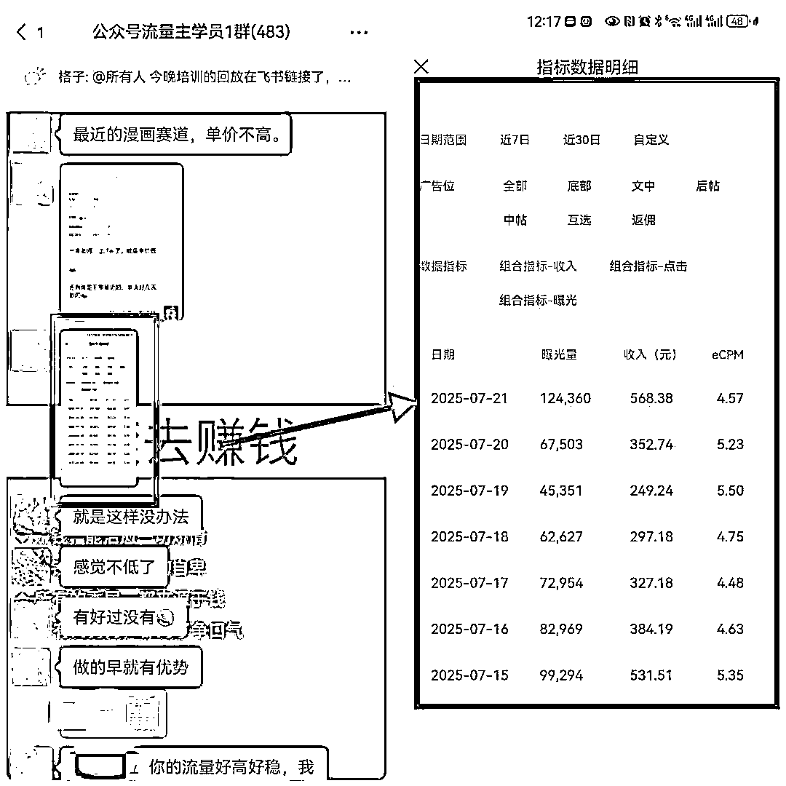

# 四、AI漫画怎么做？

你们千万不要觉得必须要专业人员才能做，现在AI这么发达，AI不到一分钟就能搞定了。

我们用豆包的图像生成功能，选择图片的比例，简单给个指令，就能生成我们要的图片了。

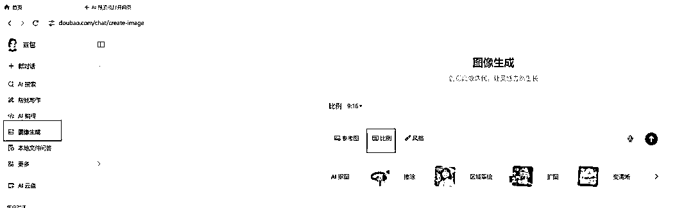

指令真的不需要多复杂，你要什么场景，就简单表述一下，风格的话可以自己去选择，豆包那里是有各种风格可以选的。

比如我现在要画一张图片，是婆媳在吵架，我选的港风，那我就给个指令：

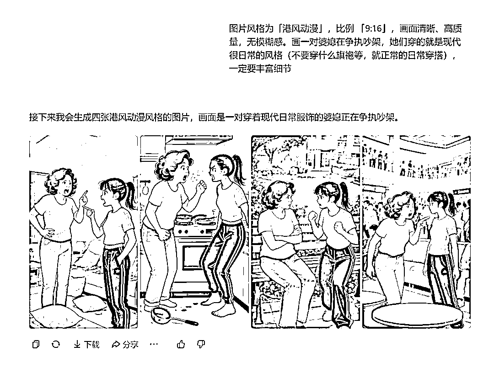

自己想要什么风格就多去测试调整，后面一直固定这个风格就行了。

图片弄好了以后，去修图软件加上字，就完成了。

我一般用剪映，因为剪映，我做好第一张可以都可以图片替换，剪映做好的图片直接放大截图就可以了，当然也可以导出静帧画面，不过我嫌麻烦，都是直接截图粘贴到公众号后台的。

你们也可以用美图秀秀或者醒图等这类app，看你们自己习惯就好。

一张张图片画呢，是个人做几个号的玩法。

如果是工作室呢，那就用扣子搭建工作流，做一个AI智能体，做好后，给一篇文章链接，它就把图片全部重新生成好了，而且连文字都配上了。

我也测试了号，专门只发工作流做的内容，一样能进流量池，而且一两分钟就能搞定，当然了，这种做出来的质量肯定没自己手动做的高，但是矩阵化做本身就是博概率，不是看质量的。

# 五、实操：AI漫画-明星领域

以防大家看不懂，我以明星这个领域，给大家实操一遍，其他领域也是差不多的流程。

### 1、需要用到的工具与网站

1）百度找图，www.baidu.com 这个是用来找明星原图的

2）秘塔AI，https://metaso.cn/，这个是用来写明星文案的，一定要用AI写，别去洗稿别人的文案，小心掉原创

3）豆包图片生成，https://www.doubao.com/chat/create-image，这个是用来AI画画的

4）剪映，如果用电脑就用剪映最快，这个去应用市场下载，用来给图片加文字和制作封面的

5）美图秀秀/醒图等，如果用手机修图，也可以用这些修图app，4和5是二选一的关系，剪映最方便

### 2、详细制作流程

1）先选同行最近的爆款标题，越近越好，阅读量优先选10w+的，因为这个领域流量很猛，10w+的选题很多很多，没有10w+的再找上万的。

2）同行的爆款标题可以改也可以不改，改的话一般就是改下数字，比如娱乐圈中的9大真千金，可以改成娱乐圈中的8大真千金，娱乐圈中的6大真千金，娱乐圈中的10大真千金...

3）确定好了选题，就用这个选题去百度确定这几位明星，不用看对标账号写的是谁，直接百度去找，打开www.baidu.com ，输入你的标题，比如娱乐圈中的6大真千金。

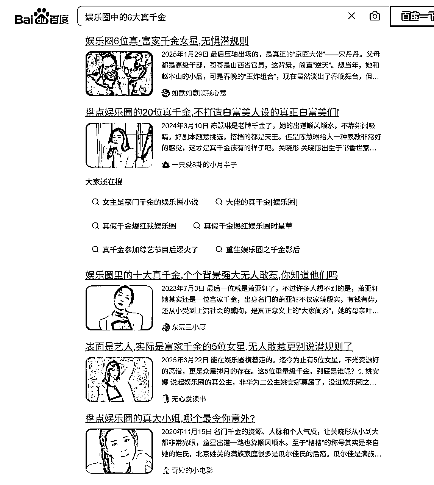

4）根据百度出来的结果，确定好6个明星，像我上面出来了这么多，我挨个看看，选6个真正有点实力的就行了，不用纠结到底哪6个，比如我现在确定好的6个人就是：刘亦菲、柯蓝、韩雪、姚安娜、朱珠，许晴，虞书欣

5）去百度里找到这6个人的高清原图，一定要高清的，糊的图片AI画不出那个相似感，而且找的图片一定要相对干净的，背景里面不要有太多的元素，也尽量找表情丰富的近照，不要找那种很美很美的全身照，这样AI很难生成像的。

6）打开www.baidu.com ，输入明星名字，比如：刘亦菲，选择图片，就会出来很多很多图片，选高清的，有特色的近照即可。

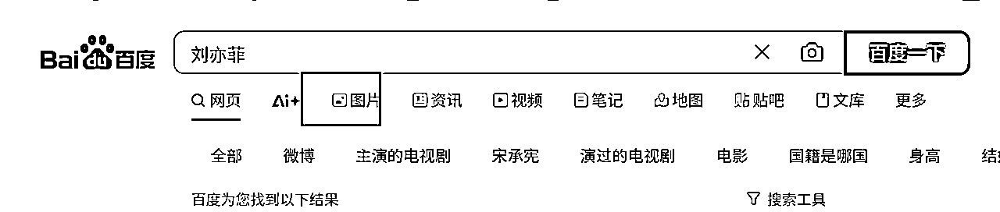

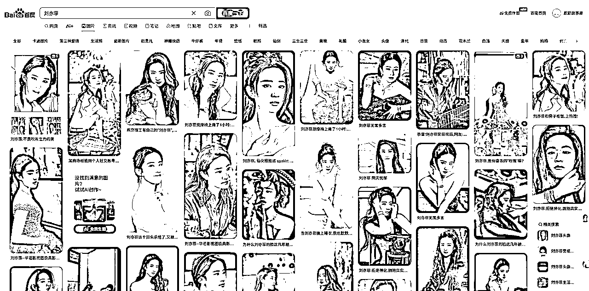

7）保存图片，或者直接复制粘贴到豆包画图都可以的，保存图片是为了批量画图

8）把6个明星的原图照片都按这个流程找就行了

9）豆包改图，我们电脑/手机都可以下载豆包，选择豆包的图像生成功能，把原图上传给豆包，输入我们的指令，静等它出图就行了

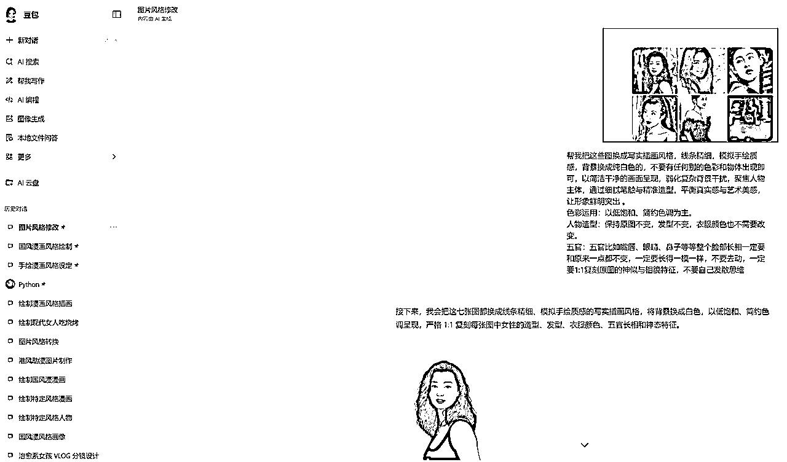

10）AI画图指令如下（这个是我自己喜欢的风格，你们可以调整成自己喜欢的）：

帮我把这些图换成写实插画风格，线条精细，模拟手绘质感，背景换成纯白色的，不要有任何别的色彩和物体出现即可，以简洁干净的画面呈现，弱化复杂背景干扰，聚焦人物主体，通过细腻笔触与精准造型，平衡真实感与艺术美感，让形象鲜明突出 。

色彩运用：以低饱和、简约色调为主。

人物造型：保持原图不变，发型不变，衣服颜色也不需要改变。

五官：五官比如嘴唇、眼睛、鼻子等等整个脸部长相一定要和原来一点都不变，一定要长得一模一样，不要去动，一定要1:1复刻原图的神似与相貌特征，不要自己发散思维

11）打开秘塔AI，电脑端：https://metaso.cn/，手机端直接去应用市场下载，把指令发给秘塔AI，让它帮我们生成文案，指令如下：

我现在要总结下娱乐圈中的6大真千金！这6个明星如下：刘亦菲、柯蓝、韩雪、姚安娜、朱珠，许晴，虞书欣，查实到的信息一定要确保准确无误，然后分别用两句话简短介绍下他们的显赫家世情况，内容要有亮点，要吸引人哦，可以写父母或者祖父母的显赫地位，写的时候要口语化表达，要贴近生活，就像和闺蜜聊八卦一样，另外结尾总结下，100字以内就行了，比如含着金钥匙出生，但是她们为了自己的梦想还是很拼的....后面的内容请你补充，一定要积极向上，而且要接地气贴近生活化地表达感慨就行啦

这个指令每次要改的就是我下面红色框起来的部分，比如标题，明星，内容，以及总结：

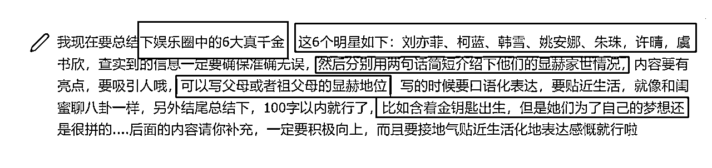

12）用剪映给图片配文案，上面豆包生成好图片以后，我们把图片保存到本地，然后挨个配文案，文案就是上面秘塔AI写的内容，然后再弄个封面，基本上这个内容就差不多啦，去公众号后台发布就可以了。

下图就是我这一套流程做出来的图片，当时这篇文章是跑了20多万的阅读量，单篇挣了1000+。

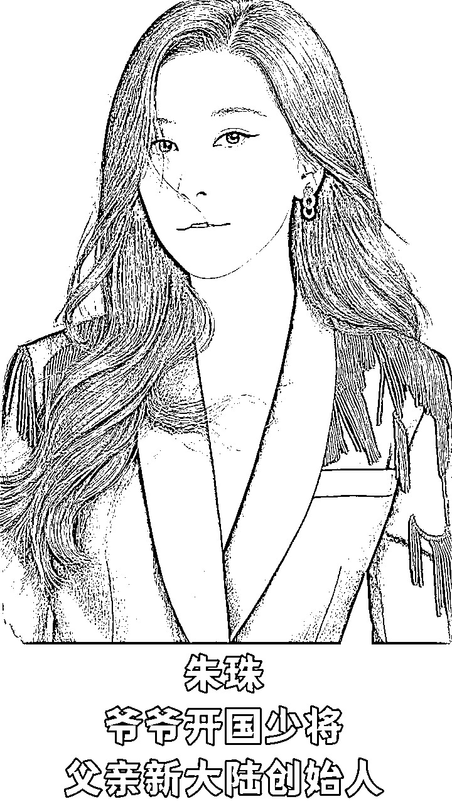

### 3、特别注意：

公众号起号本身就是有概率性的，不要发一两篇没阅读量，或者做一个号没做起来就怀疑这个项目。

真正做起来的人，都是几个号不断测试，也许三个里面跑起来了一个，或者更多号才跑出来了一个。

而且这个领域不行，那就换个领域试试看，但是任何一个领域你至少要更新上一个月才断定号能不能行。

发个三五天就焦虑的人，就不要入局做公众号流量主这个项目了。

因为这个项目就是很磨人，也不是一个能快速挣钱的项目，熬不住的人是挣不到钱的。

# 六、新手小白该怎么做?

其实分享到这里，只要是做过公众号流量主的人，都已经懂了该怎么做了，毕竟我已经把我付费课程里面的内容都无私分享出来了。

但是怕如果还有小白看完不懂怎么做的，干脆好人做到底，再多补充点基础内容。

### 第 一步：注册公众号

1.  电脑登陆 https://mp.weixin.qq.com/，按照流程走就行了。

1.  我建议大家用手机注册，更快。

手机去应用市场下载公众号助手，直接跟着引导去注册就好了，比电脑快了很多，可以一键授权！（注：想要用谁的微信注册公众号就得用谁登陆了微信号的手机。）

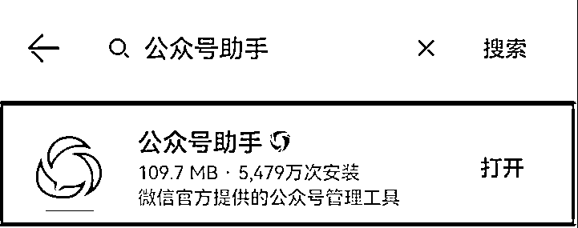

### 第二步：选择自己要做的领域

账号注册好了以后，选择一个领域，像我上面说的漫画类的，也是有细分不同领域的。

### 第三步：弄到500粉丝

账号注册后，可以花钱搞500粉丝（不是 100 粉丝）开通流量主，价格一般是几十块。

### 第四步：开通流量主

粉丝到账一周后开通流量主，具体操作如下:

进入微信公众平台 https://mp.weixin.qq.com/下拉找到左则的流量主-->点击流量主-->申请开通-->同意协议-->确定开通-->然后点击“财务管理“进去相关页面后，按提示填好身份证、银行账号等相关资料即可。

上传身份证时，记得先把身份证的正面和背面，拼在一起，再上传，因为后台只能上传一张图。

绑定的身份证和银行卡，不是必须和公众号主体一致。比如你用你爸妈的微信注册的公众号，但是打款又想打到自己的卡上，那就可以选择委托个人收款，自己将协议打印出来，签字后拍照上传。

### 第五步：找20个同行对标

先在你要做的领域，去找20个左右的对标账号，建个群，用这些对标账号的爆款题目，作为自己的选题，前期可以一个字不改。直接来用，不会侵权。

### 第六步：持续日更

可以提前写好第二天的文章，定时发布就行，养成规律的日更，每天看自己的精力，更新1-2篇。

注意：做流量主必须要日更。

以 15 天为一个周期，来看看流量变化。如果流量一直都是个位数，那么这个领域可能不适合，可以转领域，转流量更大的领域看看账号能不能起来。

转领域，可以不用删文章，不改名字，什么都不动，直接发新领域文章，没影响。

好了，我分享的内容差不多就是这些，纯干货，能看完去执行的一定能多挣不少钱。

记得：当所有人涌入明星盘点领域时，正是你在其他领域用AI漫画“降维打击”的绝佳时机！

你过去深耕的领域，就是你今天最大的优势。 别让长文的思维定式束缚了你，用AI漫画重新做一遍吧！