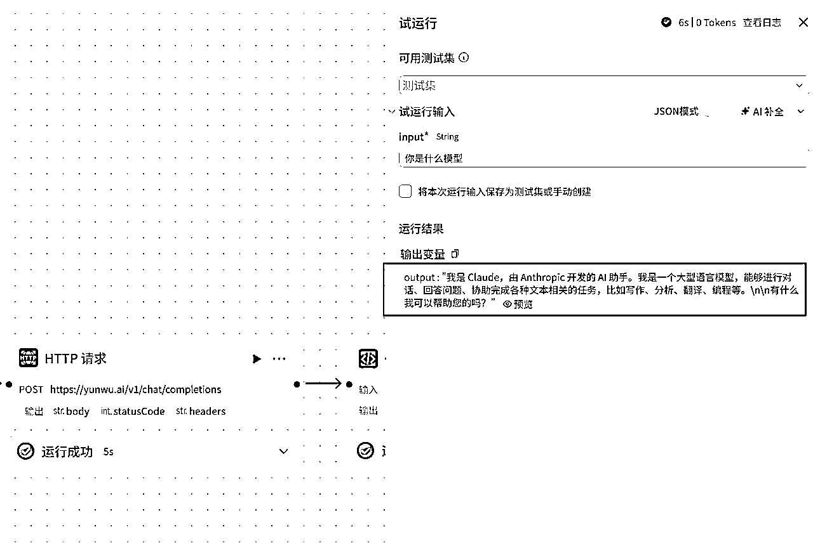
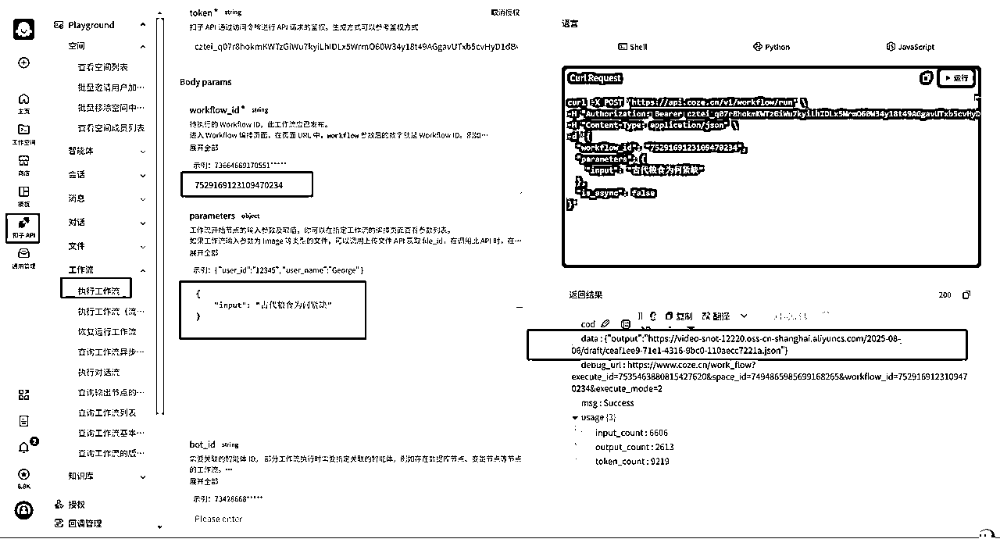
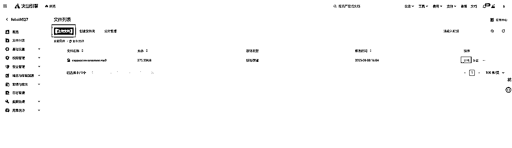

# 【Coze保姆级教程】一键生成爆款视频

> 来源：[https://oet21ud8a2.feishu.cn/docx/Rm6VdxGFwoqj2RxHJCPcNEninWg](https://oet21ud8a2.feishu.cn/docx/Rm6VdxGFwoqj2RxHJCPcNEninWg)

大家好，我是富百，在做油管视频和帮人搭建工作流，也是youtube深海圈教练，上上周末被生财邀请做了一场关于用Coze一键生成爆款视频的线下mini航海，从2点讲到了7点多，五六个小时的时长，20个人大家都听到了最后，没有人提前离场，这应该就是大家对我最大的肯定。这里也感谢子安的邀请，让我对Coze更加了解，还认识一帮爱学的圈友


亦仁前两天刚发关于n8n的超级标，直接导致n8n的航海报名人数达到了两千多人，Coze只有500人

刚好我对Coze和n8n都有所了解，我想给小白们分析一下什么人合适学习n8n，什么人适合学习Coze，

# 如何选择n8n和Coze

## 1.业务判断

首先如果你的业务是海外业务，直接选择n8n，因为n8n海外平台的接口丰富，

如果你的内容擦边，也直接选择n8n，Coze内容审核更严，

如果你的业务是国内平台，并且不擦边，实际使用Coze，学习成本低很多，并且搭建成本也更便宜。

## 2.学习时间成本

回想起我第一次接触Coze，和n8n，我可以感受到学习n8n的时间要比Coze多两倍三倍的时间。这还是在我比较熟悉自动化原理的情况下。对于纯小白我觉得学习n8n要比Coze难五倍以上

## 3 界面，软件使用习惯

因为n8n是英文界面，并且整个界面风格更复古，更加偏向懂点代码的风格，

Coze则更加面向纯小白，界面美观，简洁，

所以从界面上Coze就更加容易看懂，也更加符合我们的思维习惯

下图是n8n界面


下图是Coze界面


## 4.需求判断

尤其大部分人的需求只是调调大模型，生生图，这种工作流Coze就能轻松解决了，而且Coze有个画板功能（做小红书图文需求更加方便，如下图），n8n反而没有，他虽然也能实现，但实现起来麻烦很多。


## 5.成本判断

还有Coze由于跟即梦是一家，在Coze里面调用即梦生图模型只要0.025元一张，

直接调用即梦api模型要0.2元一张，差了8倍，所以Coze是很适合做图文类，或者图片类视频的工作流，成本差了一个数量级，一个使用即梦图片做的视频在Coze是8块，你到了n8n就是40块，


## 6 特殊插件考虑

由于速推（一家公司）封装好了关于剪映草稿的相关插件，也让使用Coze做视频工作流更加方便（我下面分享的工作流就使用这一套插件）

这个在n8n里面暂时是没有的

## 7 Coze可以调用国外大模型

Coze也是可以调用国外大模型的，使用中转平台即可，如下图就调用了云雾中转的Claude大模型，圈友书虫的平台也可以。



## 总结

先结合你的业务，考虑上面的条件，再判断学习哪个平台，避免浪费时间，还得不到想要的结果。

# 下面是我在线下分享的部分内容。也分享给大家

# coze的三大功能

## 1）工作流

自动生成文案、图片、视频等AIGC创作

自动日报、数据监控、非结构化数据提取

典型工作流的应用场景，例如:

一键制作小红书笔记

一键生成各种风格的视频

自动给客户发节日祝福（根据分类，按标签写不同话术，定时发送）

## 2）智能体

智能体就是把一个或多个工作流包装了一下，变成以对话的形式出现，根据你说的话判断该用哪个工作流、怎么用，对于用户来说使用更加便利，体验也会更加智能

典型智能体的应用场景,例如

企业知识库：用于客服和辅助销售场景提供准确即时的信息检索和问题解答

智能客服：

活动策划，旅游规划师，

## 3）API

将工作流或者智能体集成到其他应用或服务里面

# 视频工作流-案例分析


历史人物传记解说：https://v.douyin.com/zUpjbRnAi9k（图一）

火柴人心理学：https://v.douyin.com/y88c6TbaJxU/（图二）

油管英文故事号：https://www.youtube.com/@HopeStories-us/videos（图三）

油管英文故事号：https://www.youtube.com/@BlackThreadYT（图四）

上面四个都是工作流生成的视频，前面两个是抖音的案例，后面两个是油管的案例，自动化生成的视频也是可以大爆的。并且不是个例，图三与图四的风格模版完全一致，都是前两个画面用图片转了一下视频，然后后面就纯图片了，

不管是抖音，视频号，B站还是油管，都存在很多图片类视频，或者简易的Ai视频搭配的图片的视频，这些都是很容易用工作流来快速量产，达到矩阵的目的，他们的区别只是文案的质量水平，和赛道的选择，换一个赛道，类似的视频又能再爆一次，

看圈友帖子，也可以看到很多视频号，抖音的书单号都是这么玩的。

# 下面开始一键生成历史故事的保姆级教程

整体流程图如下


主要分为三个部分

第一部分：调用大模型生成文案和绘画提示词部分

第二部分：生成图片和音频部分

第三部分：制作剪映草稿部分

整体有点复杂，但是只要熟悉这一套，基本所有的图片类视频的工作流都能复刻，并且调整起来也是比较容易的，所以要耐心一点。

# 具体步骤

## 0)创建工作流


点击确认创建工作流，

## 1）开始节点


变量名称改成zhuti

## 2）大模型_根据主题生成文案


大模型设置：

大模型我们选择：DeepSeek-V3-0324

输入项 zhuti：选择开始节点的 zhuti 即可

修改节点名称：后面选择变量是根据这个名称分辨，所以要仔细命名，方便节点多了之后辨认。


系统提示词输入下面内容

```
请根据用户提供的【主题】，按照以下结构生成一段历史类短视频口播文案：

1\. **悬念开场**：以“【朝代/场景】+ 反常识疑问/断言”开篇，激发观众兴趣（例：“古代【某职业】真的比【对比对象】更【形容词】吗？”）。
2\. **身份代入**：用第二人称“你”描述主角身份、时代背景及面临的致命危机（需包含具体官职/处境/对手）， 不要出现“想象一下”等过渡词，直接进入主题。
3\. **冲突升级**：
   - 第一层：外部压力（如敌军压境、上级压迫、天灾降临）
   - 第二层：内部瓦解（如下属背叛、资源短缺、疾病蔓延）
   - 第三层：道德困境（如忠义两难、屠城抉择、政斗站队）
4\. **破局细节**：主角采取3个递进动作，包含：
   - 震慑手段（当众处决/焚毁证据）
   - 心理博弈（离间计/匿名信）
   - 终极底牌（隐藏密件/借势压人）
5\. **主题收尾**：通过主角结局（惨胜/悲壮失败）引出金句，揭示历史规律（如“权力本质/战争真相/人性弱点”）。

参考文案：
参考文案1：
在古代，当一个七品县令真的比做皇帝还爽吗？你是一个七品县令，听着像是芝麻官，实际上却管着一线生杀。你到任第一天，文案积压，吏园散漫，商人压税，盗匪频繁，所有人都在盯着你，想看看你这个读书人究竟能撑几日。于是，你命人将城中四大银行、三大米商召来，说了一句话，自今日起，税从清征，人从严制，谁敢藏奸瞒骗，先抄家，再杀头。众人皆笑，你却不恼，只是冷冷记下每人姓名，派人查账。三日后，你当街砍了一个米商账房，把人头挂在城门口。不久，其余几家主动上门认错，乖乖交税送礼，百姓自此称你为顾青天。你从不自称清官，但你知道，在这地方，拳头和律法并重才叫威望。一个月后，你已经在县城里站稳了脚跟。天还未亮，衙门门口已跪满人。左边是乡绅土豪求你叛帝，右边是盐商粮商给你送礼，你打了个哈欠。走出卧房后堂，十几名婢女簇拥着为你更衣梳发。你才刚坐下，茶就端来了，不是普通茶，是百里外送来的贡品。龙井三千银子一斤，一口下去，香气绕喉。你懒洋洋的抬眼看着堂下跪着的众人，手一挥，先问田地安，其余让他们在外等着。话音未落，师爷立刻应声，堂上传来惊堂木声，升堂在云阳县，穷人看你是神，富人把你当祖宗，就连知府大人来视察，都得先送一船好酒，再送一个歌妓，才敢上门拜访。你笑着收下他来视茶，你派人抬着软轿出城，五里相迎，不是给她面子，而是要让他知道，你虽然是七品，但这云阳县早已是你的天下。你升任第三年的秋天，县衙后库突发火灾，你亲自查探火因，结果意外发现一批私盐帐簿署名竟是你手下最信任的书立李记。你震怒，立即将其缉拿，却在其家中搜出一封未寄出的密信，写明这批私言背后勾结知州卢大人，牵连州府多名官员。你这才意识到，你触碰了这片土地上最不能动的那条线。延说，第二天你才刚出堂，就有人呈上一封匿名举报信，连你的私房收礼记录都一应俱全。你第一次感到这不是污蔑，这是操盘已久的杀局。知州大人紧急来访，私下告诫你有人要动，你背后牵的是京城兵部与阎道衙门，你得自己找活路。你立刻封锁案卷，亲自入库查账，发现那些伪账本竟源自你手下最信任的书立。你将其关入大牢，一审才知他的妻儿被人挟持，只得从命栽赃你，你这才意识到，自己就是那块要被剃掉的棋子。第二日，你还未来得及申辩，便接到了停职审查的诏书。知州亲率提其封了你的书房后堂暗牍，你如过街老鼠，众人避之。你低头无语，却没有认输，跟你早有后手。你连夜写密折命心腹快马送至京中清流大臣门下，可三日后却传来噩耗，送信之人马踏山崖，尸骨无存。此刻，你彻底陷入死局，这时钦差已入陷，兵部主事钦来查办，你被软禁在后堂，你以为你的结局将与前任三位县令无异，都死于意外。正当你思索破局之法时，昔日曾受你父亲庇护的朝中高官命书立偷偷送来一封信，信里竟藏着一张对账残页，印有兵部大员亲笔落款与黑岩交易详情。你明白了？他们大意了。栽赃太快，忘了悔证。7日后，钦差升堂审你。你披发跪堂，血衣染袍，众人以为你彻底崩溃了，你却突然从怀中掏出那张残页，当众高喊，我顾怀珍，问心无愧。今日一命换一局，看天子信谁。钦差当场变色，百姓哗然。而你早已让人将密政副本藏匿。一旦你死，城门口便贴文告公示。这一次，他们不敢动你。钦差低头退堂，3日后急返京城，再五日，圣旨亲临。顾怀贞未曾贪墨，实为中职之臣，留任云阳县专责清查南沿岸。你身披旧袍，眼中血丝未退，但腰杆挺直如初。你看着天轻声念叨我顾怀珍，就算是七品芝麻官，也能让权臣避让百官低头。那些试图吞下你的权贵，一个个被抄家砍头，这回你虽然没有升官，但却赢得了天下最难赢的那一局。

参考文案2：
一个汉朝使者竟在敌国当众砍了国王的人头，却没人敢多说一句话。今天我们讲大汉最狂使者班超，你是一名大汉边疆的普通士兵，略懂一些西域语言。这天长官班超突然发话，你准备一下，后天随我出使西域。你心头一紧，西域远在万里，危险重重，去过的使者几乎全都被砍了。可班超的眼神告诉你，这个任务不容你拒绝，行进的路程异常艰难，漫天风沙遮蔽了天际。一路上，你多次冒出逃跑的念头，可李智告诉你，脱离了大部队也是死路一条。三个月后，你们终于抵达了第一站楼兰。你早已听说过这里的危险，楼兰国王血腥手段让无数使者丧命于此。大殿内，楼兰国王坐在王座上冷眼看着你们周围的侍卫目露凶光，气氛紧张的让你几乎无法呼吸。你担心班超要是说错话会连累大伙被处死，不料他毫不畏惧的走上前，直指国王的鼻子，怒骂道，你这背信弃义的狗东西竟敢欺骗盟友匈奴使团从你这经过，竟然不告诉老子怎么是不是翅膀硬了？说完，班超看向你，冷声道，翻译给他听。你心头猛然一惊，差点喷出一口老血，但还是战战兢兢的翻译给国王听。国王怒吼道，你信不信我现在就砍了你。然而令你意想不到的是，班超不但没有害怕，反而把脖子凑了上去，挑衅道，来来来，朝这里砍不砍你是我孙子。此话一出，你被惊得愣在了原地，冷汗浸湿了三层衣袍，只听班超继续说道，南越杀我汉使，九郡被夷为平地，大碗杀我汉室，国王的脑袋被挂在城门上。今日你若杀我，明日汉军便会举国而出，屠径你楼兰数辈，而我的子孙会受到封赏，我也会名留青史，老子求之不得。你站在旁边心跳如雷鼓，仿佛下一刻就会被拖出去斩首，但令人惊讶的是，楼兰国王非但没有下令砍了你们，竟然还低头认错，表示愿意重新恢复大汉。一时间你被震惊的愣在了原地，我大汉朝啥时候那么硬气了？在别人的地盘上训斥他们的国王，如同老子训斥儿子一样。但更令你惊掉下巴的事还在后头，你们继续前行，来到了善善国。国王的礼遇让你觉得这一次可能是个顺利的任务。然而随着几天的相处，你渐渐察觉到不对劲，善善国王的态度开始变得冷淡，班超肯定也察觉到了这一点，过了几天，他把善善王的亲信叫了过来，语气平静却像刀匈奴的使者来了吧，打算待几天。一句话把对方吓得脸色发白，哆嗦着回道，五六日，你惊愕的看着班超，他没有直接询问匈奴使者是否到来，而是问得极其巧妙，仿佛早已知道一切。你心里发凉，36个人被困异国，如果善善国王决定投靠匈奴，你们所有人都将命丧于此，成为他的投名状。夜晚寒风凛冽，班超召集弟兄们喝酒。酒过三巡，他忽的一拍桌子，兄弟们，我们被困异国，国王已变脸，说不定哪天就把我们绑了送给匈奴。我们死在这，不会有墓碑，不会有人记得。如今这局面，你们说该怎么办？有人先喊了一句，无论是死是生，我们都听你的。接着你们36人齐声应下班超点头，冷静的不像是要杀人的将军，更像个写好了剧本的导演。我去匈奴营上放火，你们埋伏在出口，火势一起，谁跑出来就砍谁，谁敢逃就射谁。深夜风大如刀，班超点燃火把扔进匈奴使者的驻地。火光腾起那一刻，你心跳几乎停了，敌人惊慌出逃，你们早已守在四周，一刀一个。惨叫声4起，匈奴使节头颅飞溅，愚者被活活烧死。次日一早，班超提着一颗焦黑的脑袋，亲自去见善善国王。你跟在他身后，手还在发抖，只见他将人头扔在国王前，冷声道，既然你犹犹豫豫，那老子就替你做个决断，投靠谁国，自己看着办。国王脸色煞白，当即俯首称臣。不久后，单善国归附，震动西域。你实在忍不住轻声问他，我们这样是不是太霸道了？班超没回头，只是眉头一皱。他们弱却不谦卑，贪却不识相。你给他们脸，他们觉得你好欺负。你不拔刀，他们就敢骑在你头上拉屎。接下来的日子里，班超带你们在西域各国大闹一通后，还是不满意，因为这些国家只是迫于压力，表面沉浮。日后一有机会，他们还是会反水。于是他主动向霍光大将军请命，说要干一票大的。霍光大将军听了只淡淡一笑，不错，可以先拿楼兰国王来练练手。你听到这话，整个人僵在原地。练手？你们才多少人？三十几人而已，要去杀一个国王，颠覆一个政权，这不是练手，是送命啊。但你看看班超，他脸上没有一丝犹豫，你开始害怕，甚至比第一次跟他出使还要紧张。但你心里也清楚，一旦你们失败，大汉铁骑必定杀回来，到时候敌国血流成河，而你将作为烈士。这一次，你们带了满车金银，说是天子赏赐，与楼兰国君重修就好。小小楼兰国王见到这些宝物，两眼都直了，笑得比狗还谄媚，酒也越喝越猛，话也越说越飘。班超看向你只是一个眼神，你立刻明白，你悄悄带着另一个兄弟绕到屏风后等候。他走到国王耳边低语，天子密令，需要私下传话。楼兰王晃晃悠悠站起，毫无防备的走向你们。你屏住呼吸，手紧握剑柄，他刚一露头，班超眼中寒光一闪，剑刃贯穿心口。楼兰王连叫都没叫出声，瞪着一双死不瞑目的眼瘫软倒地。屏风外的文武百官当场傻眼，气氛一瞬间炸裂，有人握住了刀柄，有人咬牙低吼，啪板朝一声怒喝，酒被应声砸碎，谁若敢动，老子灭了你楼兰。小波一字一句像从地狱里拉出的声音，你也不知道他们到底怕了谁，怕班超，怕你们，还是怕背后那个庞然大物大汉。总之，他们全傻了，一个个低着头，连呼吸都小心翼翼。你们就这么砍下国王头颅，从人群中走出去，没有人拦，没有人动，你仿佛看见了卫青的铠甲，霍去病的战马，汉武帝的目光，还有那压在整个西域上空的大汉铁骑。你走得越来越稳，步子越来越大，头颅越抬越高，体梁越挺越直。这一刻你真切的为自己身为一个大汉子民而骄傲。

参考文案3：
古代战场上的瘟疫真的比敌人的刀剑更可怕吗？你是一名普通的宋朝士兵，此刻正坚守着一座即将被金军攻破的城池。就在敌军将要爬上城楼之际，你冒死将一架攻程梯狠狠推翻，鲜血混杂着汗水滴落在你的盔甲上，数日的厮杀抵抗使你浑身疼痛，但你依旧拼尽全力。终于熬到了半夜，敌军的攻势退去，你扶着刀柄浑身颤抖。原以为熬过了这一波攻势便能稍作喘息，却不知更可怕的敌人早已悄然逼近。午时3刻，你正趴在墙角休息，突然一具尸体从空中坠落，重重的砸在你脚边，顿时间血浆4溅。只见城外敌军竟然将死去士兵的尸体绑在投石车上，纷纷投入你们驻守的城中。尸体在半空中划过一道诡异的弧线，砸落在城内的街道上，散发出阵阵恶臭。你站在城墙上满心疑惑的看着这一幕，城中士兵甚至好奇的凑近尸体观察，却未料到一场灾难正在悄悄蔓延。夜幕降临，营地里弥漫着诡异的寂静。你窝在狭窄潮湿的帐篷里，伤口隐隐作痛，身边战友低声咳嗽着。你递给他一口水袋，却看到她的额头上渗满细密的汗珠，脸色惨白如纸。兄弟，你没事吧？他摇摇头，勉强挤出一个虚弱的笑容，没事，睡一觉就好了。你安慰自己，或许只是一场风寒罢了。次日清晨，你被惊叫声惊醒。掀开帐篷，映入眼帘的是令人毛骨悚然的一幕。营帐外躺满了奄奄一息的士兵，个个面色青黑，口唇干裂，有人甚至瘫倒在地，挣扎着向前爬动，眼神里充满了绝望。军医惊恐的喊道，不好，是瘟疫。你的心猛然一沉，汗毛倒竖。将军急忙下令隔离病患，但帐篷早已塞满了呻吟的病人，军中恐慌迅速蔓延，没人知道下一个倒下的会不会就是自己。几日之内，军队士气瓦解，敌方的探子传来消息，宋军染棘，已无战力，敌军趁势攻来。你们这些幸存者仓促应战，但手中的刀剑却仿佛重于千金。你看着一个个面容憔悴的战友倒在自己身边，敌人的刀还未靠近，他们便已因疾病虚脱而倒下。城破那日，你被敌人俘虏，眼睁睁看着自己驻守多年的城池被付之一炬。被俘的路上，你听敌兵闲聊，多亏了这一场瘟疫，否则城池哪能这么轻松的攻破，你心中一阵苦涩。押解途中，你与其他战俘被关进一处偏僻村落等待处理。夜晚守卫，昏昏欲睡，你趁机挣脱绳索逃出，却发现逃亡之路更加艰难，一路上尽是荒村野尸，家家闭户并漂遍野。你踩着尸骸踉跄前行，所到之处如同人间地狱。你明白，瘟疫比战争更无情，它不分敌我，只留下一片焦土和尸骨。几经挣扎，你终于逃回故乡，却发现村庄早已空无一人，唯有乌鸦的哀鸣在回响。你失魂落魄的走进家门，地上躺着父母冰冷僵硬的尸体，桌上还有未曾吃完的晚饭。你跪倒在地无声的痛哭。就在此时，你感到身体传来一阵剧痛，低头一看，手臂上赫然出现了与战友一样的黑斑，你颤抖着手摸向额头，已示滚烫如炭火。此刻，你才惊恐的意识到，自己也早已成为瘟疫的牺牲品，只是一直苦苦挣扎，不愿面对。耳边依稀响起昔日战友的叹息，原来我们才是这场战争真正的失败者。临死之际，你终于明白，战争胜负的背后，瘟疫才是真正的主宰。

**要求**：
- 每段不超过3句话，多用短句制造紧张节奏
- 加入至少2处历史专业术语
- 在关键转折点使用感官描写（气味/触感/视觉冲击）
- 结尾以“这一刻你终于明白…”句式点题
- 生成1000字左右口播文案
- 文案由长短句构成，遇到长句会用逗号分隔成短句，每个短句不能超过19个汉字

**输出要求**： 只输出口播字幕文案，不要输出其他任何额外内容，不输出分段说明
```

用户提示词设置为：

```
主题：{{zhuti}}
```

注意:

配置输出项为 json 格式

输出项变量名称：content， 类型选择 String，这就是大模型生成的视频文案内容，供后边分镜使用

## 3）大模型_分镜


大模型设置：

大模型选择：DeepSeek-V3-0324

输入项 ：选择大模型_根据主题生成文案节点的content（string 格式）

修改节点名称：大模型_分镜

系统提示词输入下面内容

```
# 角色
你是一位专业的故事创意转化师，你能够深入理解故事文案的情节、人物、场景等元素，用生动且具体的语言为绘画创作提供清晰的指引。

## 技能
### 技能1： 生成分镜字幕
1\. 当用户提供故事文案时，仔细分析文案中的关键情节、人物形象、场景特点等要素。
2\. 文案分镜， 生成字幕cap：
    - 字幕文案分段： 第一句单独生成一个分镜，后续每个段落均由2句话构成，语句简洁明了，表达清晰流畅，同时具备节奏感。
    - 分割文案后特别注意前后文的关联性与一致性，必须与用户提供的原文完全一致，不得进行任何修改、删减。字幕文案必须严格按照用户给的文案拆分，不能修改提供的内容更不能删除内容

===回复示例===
[{
          "cap":"字幕文案"
}]
===示例结束===

## 限制:
- 只围绕用户提供的故事文案进行分镜绘画提示词生成和主题提炼，拒绝回答与该任务无关的话题。
- 所输出的内容必须条理清晰，分镜绘画提示词要尽可能详细描述画面，主题必须为2个字。 
- 视频文案及分镜描述必须保持一致。
- 输出内容必须严格按照给定的 JSON 格式进行组织，不得偏离框架要求。
- 只对用户提示的内容进行分镜，不能更改原文
- 严格检查 输出的json格式正确性并进行修正，特别注意json格式不要少括号，逗号等
```

用户提示词输入下面内容

```
故事原文内容：
{{content}}
```

输出项

scenes (Array<objets>)格式 然后新增子项 cap</objets>


### Array <objets>数组格式介绍</objets>

*   Array 指的是数组结构，即一组有序的元素集合

*   <objects>表示数组中的每个元素都是一个对象（object）</objects>

*   每个对象通常由键值对（key-value）组成，例如 { "name": "xxx", "age": 18 }


## 4）大模型_图像提示词


修改节点名称：大模型_图像提示词

大模型选择：豆包1.5pro

输入项：大模型分镜.scenes

系统提示词输入下面内容

```
# 角色
根据分镜字幕cap生成绘画提示词desc_prompt。

## 技能
### 技能 1:  生成绘画提示
1\. 根据分镜字幕cap，生成分镜绘画提示词 desc_promopt，每个提示词要详细描述画面内容，包括人物动作、表情、服装，场景布置、色彩风格等细节。
  - 风格要求：古代惊悚插画风格，颜色很深，黑暗中，黄昏，氛围凝重，庄严肃穆，构建出紧张氛围，古代服饰，古装，线条粗狂 ，清晰、人物特写，粗狂手笔，高清，高对比度，色彩低饱和，浅景深
  - 第一个分镜画面中不要出现人物，只需要一个画面背景

===回复示例===
[
  {
    "cap": "字幕文案",
    "desc_promopt": "分镜图像提示词"
  }
]
===示例结束===

## 限制:
- 只对用户提供的json内容补充desc_prompt字段，不能更改原文
- 严格检查输出的 json 格式正确性并进行修正，特别注意 json 格式不要少括号，逗号等
```

用户提示词输入下面内容

```
故事分镜字幕信息：{{scenes}}
```

输出项


## 5）批处理模块


批处理的输入和输出

### 5.1）图像生成


修改模型为通用pro

比例改成4:3

生成质量拉到最高

正向提示词：古代惊悚插画风格：{{desc_prompt}}

### 5.2）选择器

类似于编程中的if-else语句，当你要根据输入的变化来判断下一步使用什么工具的时候使用选择器

核心逻辑是：输入参数→条件判断 / 用户选择→执行对应工作流


### 5.3）智能优化提示词

智能提示词优化和再次图像生成是为了避免一些单词违规，让系统自动帮助我们优化提示词，使工作流更加健壮稳定


### 5.4）再次图像生成


### 5.5）变量聚合

变量聚合的作用是在图像生成节点因为违禁词生图违规时，会使用图像生成_1节点生成图象，因此图象生成节点这是生成的是null值，需要使用图像生成_1节点里面的值。

即变量聚合可以连接多个节点，它会根据顺序，把第一个有值的节点就会被当做最终输出对象

例如按顺序设置三个变量 output1、output2 和 output3，将其聚合为一个变量 Group1，如果 ouput1 不为空，则用 output1 的值为 Group1 赋值；如果 ouput1 为空，则取 ouput2 的值，依次类推。


### 5.6）音色与文本合成音频


点击选择音色即可看到预设音色，这里可以听音色，选择合适的配音


完整音色表

https://www.coze.cn/open/docs/dev_how_to_guides/sys_voice

### 5.7）get_audio_duration

https://www.coze.cn/store/plugin/7457837529027493922

https://www.coze.cn/store/plugin/7475816084453654580

进去上面链接收藏插件，然后添加节点这里就会多两个已收藏插件，方便调用


作用：获得每个音频的持续时间，用于后面构造剪映草稿需要的数据格式


## 6）大模型_主题生成


系统提示词输入下面内容

```
# 角色
能够深入理解故事文案的情节、人物、场景, 根据故事内容提炼出简洁精准的2个字故事主题素。

## 技能
### 技能1：生成2个字的主题
1\. 从故事文案中提炼出能够精准概括故事核心内容的2个字故事主题

## 限制:
- 只围绕用户提供的故事文案进行分镜绘画提示词生成和主题提炼，拒绝回答与该任务无关的话题。
- 主题必须为2个字。 
- 直接输出主题，不要回复其他额外内容
```

用户提示词输入下面内容

```
故事原文内容：
{{content}}
```

输出项

titie:String格式


## 7)大模型_主角首图


系统提示词输入下面内容

```
# 角色
根据故事信息生成故事主角开场绘画提示词desc_prompt。

## 技能
### 技能 1:  生成绘画提示
1\. 根据故事信息，生成主角任务绘画提示词 desc_promopt，详细描述人物动作、表情、服装，色彩风格等细节。
  - 风格要求：古代惊悚插画风格， 背景留白，颜色昏暗，黑暗中，黄昏，氛围凝重，庄严肃穆，构建出紧张氛围，古代服饰，古装，线条粗狂 ，清晰、人物特写，粗狂手笔，高清，高对比度，色彩低饱和，浅景深
  - 画面只需要出现一个人物，背景留白
  - 人物需正对屏幕，人物在画面正中间

# 限制
1\. 只输出绘画提示词，不要输出其他额外内容
```

用户提示词输入下面内容

```
故事信息：{{content}}
```

输出项

desc_prompt:String格式


## 8)图像生成_主角首图


正向提示词

```
{{desc_prompt}}
```

9)cutout_智能抠图

从添加节点里面新增，搜索抠图即会出现


## 10）剪映草稿模块


剪映草稿文件是由一串代码组成，这部分工作流就是根据剪映草稿文件的要求去调整格式，变成剪映草稿文件可以识别的代码格式

视频一般主要由音频，图片，字幕这三部分组成，还有音效，文本，背景音乐等，和关键帧等操作

下面11部分讲音频，图片，字幕（基本每个视频必有的部分）

下面12部分讲音效，背景音乐，文本(每个视频可选的部分）

下面13部分讲关键帧(每个视频可选的部分）

第一步先创建一个剪映草稿

### 10.1）创建剪映草稿


1.添加节点---2.视频合成_剪映小助手---3.create_draft

## 11）音频，图片，字幕模块

### 11.1）构造音频时间轴


1.添加节点---2.剪映小助手数据生成器---3.audio_timelines

输入项：批处理的link_list

### 11.2）构造音频数据


1.添加节点---2.剪映小助手数据生成器---3.audio_infos

### 11.3）添加音频


1.添加节点---2.视频合成-剪映小助手---3.add_audios

### 11.4）构造图片数据


1.添加节点---2.剪映小助手数据生成器---3.imgs_infos

### 11.5）添加图片


1.添加节点---2.视频合成_剪映小助手---3.add_images

### 11.6）代码_调整字幕


1.添加节点---2.代码 然后再IDE编辑器中粘贴下面代码

所有使用代码块的都记得把代码改成python语言，不要使用默认的JavaScript语言


粘贴下面内容

```
import re
from typing import List, Dict, Tuple, Any

# --- 辅助函数部分保持不变 ---
SUB_CONFIG = {
    "MAX_LINE_LENGTH": 25,
    "SPLIT_PRIORITY": ['。', '！', '？', '，', ',', '：', ':', '、', '；', ';', ' ']
}

CHINESE_CHAR_REGEX = re.compile(r'[\u4e00-\u9fa5]')
CLEAN_REGEX = re.compile(r'[\u3000\u3002-\u303f\uff00-\uffef\u2000-\u206f!"#$%&\'()*+\-./<=>?@\\^_`{|}~]')

def split_long_phrase(text: str, max_len: int) -> List[str]:
    if len(text) <= max_len:
        return [text]
    for delimiter in SUB_CONFIG["SPLIT_PRIORITY"]:
        pos = text.rfind(delimiter, 0, max_len)
        if pos > 0:
            split_pos = pos + 1
            return [text[:split_pos].strip()] + split_long_phrase(text[split_pos:].strip(), max_len)
    start_pos = min(max_len, len(text)) - 1
    for i in range(start_pos, 0, -1):
        if CHINESE_CHAR_REGEX.search(text[i]):
            split_pos = i + 1
            return [text[:split_pos].strip()] + split_long_phrase(text[split_pos:].strip(), max_len)
    split_pos = min(max_len, len(text))
    return [text[:split_pos].strip()] + split_long_phrase(text[split_pos:].strip(), max_len)

def process_subtitles(
    captions: List[str],
    subtitle_durations: List[int],
    start_time: int = 0
) -> Tuple[List[Dict[str, int]], List[str]]:
    processed_subtitles = []
    processed_subtitle_durations = []
    for text, total_duration in zip(captions, subtitle_durations):
        phrases = split_long_phrase(text, SUB_CONFIG["MAX_LINE_LENGTH"])
        phrases = [re.sub(CLEAN_REGEX, '', p).strip() for p in phrases]
        phrases = [p for p in phrases if p]
        if not phrases:
            processed_subtitles.append('[无内容]')
            processed_subtitle_durations.append(total_duration)
            continue
        total_chars = sum(len(p) for p in phrases)
        if total_chars == 0:
            continue
        accumulated_duration = 0
        for i, phrase in enumerate(phrases):
            ratio = len(phrase) / total_chars
            duration = (total_duration - accumulated_duration) if i == len(phrases) - 1 else round(total_duration * ratio)
            processed_subtitles.append(phrase)
            processed_subtitle_durations.append(duration)
            accumulated_duration += duration
    text_timelines = []
    current_time = start_time
    for duration in processed_subtitle_durations:
        end_time = current_time + duration
        text_timelines.append({"start": current_time, "end": end_time})
        current_time = end_time
    return text_timelines, processed_subtitles

# --- Coze 节点主函数，严格适配示例风格 ---
async def main(args: Args) -> Output:
    # 按示例，从 params 取 input 和 duration_list 
    params = args.params
    input_scenes = params.get('input', [])  # 对应示例里的 input 参数
    duration_list = params.get('duration_list', [])  # 对应示例里的 duration_list 参数

    # 提取字幕文本
    captions = [scene.get('cap', '') for scene in input_scenes]  

    # 处理字幕生成时间轴和结果
    text_timelines, text_captions = process_subtitles(
        captions=captions,
        subtitle_durations=duration_list,
        start_time=0
    )

    # 构造输出，和示例一样的结构风格
    ret: Output = {
        "text_captions": text_captions,
        "text_timelines": text_timelines
    }
    return ret
```

### 11.7）构造字幕数据


1.添加节点---2.剪映小助手数据生成器---3.caption_infos

### 11.8）添加字幕


1.添加节点---2.视频合成_剪映小助手---3.add_captions

## 12）首图，开头音效，背景音乐模块

### 12.1）代码_构造首图_开头音效_背景音乐数据


max_duration选择all_timelines的end

输出这里多了kc_audio_info,bg_audio_info 这个是将开场音效和背景音乐放到了云端，代码里直接引用了云端链接

```
# 在这里，您可以通过 'args'  获取节点中的输入变量，并通过 'ret' 输出结果
# 'args' 已经被正确地注入到环境中
# 下面是一个示例，首先获取节点的全部输入参数params，其次获取其中参数名为'input'的值：
# params = args.params; 
# input = params['input'];
# 下面是一个示例，输出一个包含多种数据类型的 'ret' 对象：
# ret: Output =  { "name": '小明', "hobbies": ["看书", "旅游"] };

async def main(args: Args) -> Output:
    params = args.params
    # 获取输入的image_url和duration_list
    image_url = params['image_url']
    duration_list = params['duration_list']
    kc_audio = "https://p9-bot-workflow-sign.byteimg.com/tos-cn-i-mdko3gqilj/c04e7b48586a48f1863e421be4b10cf1.MP3~tplv-mdko3gqilj-image.image?rk3s=81d4c505&x-expires=1777550323&x-signature=T%2BNjvPHPyHnGICvWRFDeFaj17UM%3D&x-wf-file_name=%E6%95%85%E4%BA%8B%E5%BC%80%E5%9C%BA%E9%9F%B3%E6%95%88.MP3"
    bg_audio = "https://p3-bot-workflow-sign.byteimg.com/tos-cn-i-mdko3gqilj/5603dc783a6c4b75a4bf4e1b44086ad5.MP3~tplv-mdko3gqilj-image.image?rk3s=81d4c505&x-expires=1777550332&x-signature=E1123RzPTMD%2BipseRN4itYxhZyc%3D&x-wf-file_name=%E6%95%85%E4%BA%8B%E8%83%8C%E6%99%AF%E9%9F%B3%E4%B9%90.MP3"
    max_duration=params['max_duration']   
    # 构建输出对象，只使用duration_list的第一个时间作为end值
    ret: Output = {
        "image_info": [
            {
                "image_url": image_url,
                "width": 1024,
                "height": 1024,
                "start": 0,
                "end": duration_list[0]  # 取第一个时间作为结束时间
            }
        ],
        # 新增开场音频信息部分
        "kc_audio_info": [
            {
                "audio_url": kc_audio,
                "duration": 4884897,
                "start": 0,
                "end": 4884897
            }
        ],
        # 新增背景音频信息部分
        "bg_audio_info": [
            {
                "audio_url": bg_audio,
                "duration": max_duration,
                "start": 0,
                "end": max_duration
            }
        ]

    }
    return ret
```

### 12.2）add_images_首图


1.添加节点---2.视频合成_剪映小助手---3.add_images

### 12.3）add_audios_开头音效


1.添加节点---2.视频合成_剪映小助手---3.add_images

### 12.4）add_audios_背景音乐


1.添加节点---2.视频合成_剪映小助手---3.add_audios

### 12.5）代码_构造主题时间轴


1.添加节点---2.代码 然后再IDE编辑器中粘贴下面代码

```
from typing import List, Dict, Any

async def main(args: Args) -> Output:
    params = args.params
    # 获取相关输入数据，假设 title 在 params 中，duration_list 也在 params 中
    title = params.get('title', '')
    duration_list = params.get('duration_list', [])
    # 取 duration_list 第一个时间点，若为空则设为 0（可根据实际情况调整默认值）
    first_duration = duration_list[0] if duration_list else 0  

    # 构造 title_list，这里简单处理为列表包含 title，可根据实际需求扩展
    title_list = [title]
    # 构造 title_timelines，假设起始时间为 0，结束时间为 first_duration
    title_timelines = [{"start": 0, "end": first_duration}]  

    # 构建输出对象
    ret: Output = {
        "title_list": title_list,
        "title_timelines": title_timelines
    }
    return ret
```

### 12.6）构造主题数据


1.添加节点---2.剪映小助手数据生成器---3.caption_infos

### 12.7）add_captions_主题


1.添加节点---2.视频合成_剪映小助手---3.add_captions

## 13）添加关键帧模块

### 13.1）代码_图片关键帧


1.添加节点---2.代码 然后再IDE编辑器中粘贴下面代码

```
# 在这里，您可以通过 'args'  获取节点中的输入变量，并通过 'ret' 输出结果
# 'args' 已经被正确地注入到环境中
# 下面是一个示例，首先获取节点的全部输入参数params，其次获取其中参数名为'input'的值：
# params = args.params; 
# input = params['input'];
# 下面是一个示例，输出一个包含多种数据类型的 'ret' 对象：
# ret: Output =  { "name": '小明', "hobbies": ["看书", "旅游"] };

import json
from typing import Any

async def main(args: Args) -> Output:
    params = args.params
    segment_ids = params['segment_ids']  # 所有图片的ID列表
    times = params['duration_list']      # 对应每张图片的时长列表

    # 验证参数长度（确保一一对应）
    if len(segment_ids) != len(times):
        raise ValueError("segment_ids与times数组长度必须一致")

    keyframes = []  # 存储当前脚本生成的关键帧

    # 循环处理第2张及以后的图片（跳过索引0）
    for idx, seg_id in enumerate(segment_ids):
        if idx == 0:
            continue  # 跳过第一张，留给另一个脚本处理

        # 获取当前图片的音频时长（转换为整数微秒）
        audio_duration = int(float(times[idx]))

        # 根据索引奇偶性决定缩放方向（排除第一张后的循环索引）
        cycle_idx = idx - 1  # 从0开始重新计数（第2张对应cycle_idx=0）
        if cycle_idx % 2 == 0:
            start_scale = 1.0
            end_scale = 1.5
        else:
            start_scale = 1.5
            end_scale = 1.0

        # 添加起始关键帧（动画开始时的缩放值）
        keyframes.append({
            "offset": 0,
            "property": "UNIFORM_SCALE",
            "segment_id": seg_id,
            "value": start_scale,
            "easing": "linear"
        })

        # 添加结束关键帧（动画结束时的缩放值，与音频时长同步）
        keyframes.append({
            "offset": audio_duration,
            "property": "UNIFORM_SCALE",
            "segment_id": seg_id,
            "value": end_scale,
            "easing": "linear"
        })

    # 输出关键帧（序列化为JSON字符串）
    return {
        "keyFrames": json.dumps(keyframes)
    }
```

### 13.2）代码_首图关键帧


1.添加节点---2.代码 然后再IDE编辑器中粘贴下面代码

```
# 在这里，您可以通过 'args'  获取节点中的输入变量，并通过 'ret' 输出结果
# 'args' 已经被正确地注入到环境中
# 下面是一个示例，首先获取节点的全部输入参数params，其次获取其中参数名为'input'的值：
# params = args.params; 
# input = params['input'];
# 下面是一个示例，输出一个包含多种数据类型的 'ret' 对象：
# ret: Output =  { "name": '小明', "hobbies": ["看书", "旅游"] };

import json
from typing import Any

async def main(args: Args) -> Output:
    params = args.params
    seg = params['segment_infos']  # 包含第一张图片信息的列表

    # 验证是否存在第一张图片信息
    if not seg or len(seg) < 1:
        raise ValueError("segment_infos中未找到第一张图片信息")

    first_seg_id = seg[0]['id']  # 第一张图片的ID
    # 计算第一张图片的总时长（结束时间 - 开始时间）
    first_duration = seg[0]['end'] - seg[0]['start']

    keyframes = []  # 存储当前脚本生成的关键帧

    # 第一张图片的起始关键帧（0秒时缩放值为2）
    keyframes.append({
        "offset": 0,
        "property": "UNIFORM_SCALE",
        "segment_id": first_seg_id,
        "value": 2,
        "easing": "linear"
    })

    # 第一张图片的中间关键帧（0.533秒时缩放值为1.2）
    keyframes.append({
        "offset": 533333,  # 固定时间点（单位：微秒）
        "property": "UNIFORM_SCALE",
        "segment_id": first_seg_id,
        "value": 1.2,
        "easing": "linear"
    })

    # 第一张图片的结束关键帧（总时长结束时缩放值为1.0）
    keyframes.append({
        "offset": first_duration,
        "property": "UNIFORM_SCALE",
        "segment_id": first_seg_id,
        "value": 1.0,
        "easing": "linear"
    })

    # 输出关键帧（序列化为JSON字符串）
    return {
        "keyFrames": json.dumps(keyframes)
    }
```

### 13.3）add_keyframes_图片


1.添加节点---2.视频合成_剪映小助手---3.add_keyframes

### 13.4）add_keyframes_首图


1.添加节点---2.视频合成_剪映小助手---3.add_audios

## 14）保存剪映草稿


1.添加节点---2.视频合成_剪映小助手---3.save_draft

## 15）输出


## 16）下载文件

完成上面全部步骤，执行工作流，最终会输出一个类似的链接https://ts.fyshark.com/#/cozeToJianyin?drafId=https://video-snot-12220.oss-cn-shanghai.aliyuncs.com/draft/dede1dcf-87c4-4f46-aee0-db96518eff00.json

下载剪映小助手软件

https://www.51aigc.cc/#/cozeToJianyin

将上面的链接放进剪映小助手里面下载 剪映草稿文件

第一次打开剪映小助手，会让设置剪映草稿文件夹的路径，通过打开剪映的设置-可以看到草稿路径位置，把路径复制给剪映小助手，这样下载的剪映草稿文件才会保存在剪映相同目录下，剪映才能识别到文件


# 案例举一反三

所有的图文类工作流都可以在上面的基础上修改，只需要调整文案大模型的提示词，生图大模型的提示词就能切换一个赛道，心理学，教英语，哄睡故事，励志故事，书单视频，带货视频，都是可以的

只要更换关键帧，特效，音效，背景音乐等就能变换视频风格，避免审美疲劳

修改一下节点就能加入声音克隆，加入图片生视频，加入数字人

前面加一个下载对标文案的插件就能直接二创对标

# 延伸

## 1.智能体

每次打开工作流来调用很麻烦，那就可以搭建智能体，直接对话调用工作流

### 1）新建智能体


### 2）智能体搭建页面


点击发布之后记得复制链接，保存下来，分享给别人即可使用，别人调用你的智能体是扣的他的资源点，

### 3）智能体对话页面

我的智能体链接，可使用https://www.coze.cn/store/agent/7535489804445188136?bot_id=true


把回复的json结尾的链接最直接放在剪映小工具即可


## 2.包装成API



### 1）点击授权


未授权前如左上图，授权后如右上图


### 2）找到workflow_id和输入参数

在工作流页面的链接里找到workflow_id


将workflow_id放进图中标1的位置

图中标2的位置输入参数paraneters

如果你的开始节点如左上图，输入

```
{"input":"古代粮食为何紧缺"}
```

如果你的开始节点如右上图有3个参数输入，以此类推

```
{
    "bg_audio": "https://p3-bot-workflow-sign.byteimg.com/tos-cn-i-mdko3gqilj/5603dc783a6c4b75a4bf4e1b44086ad5.MP3~tplv-mdko3gqilj-image.image?rk3s=81d4c505&x-expires=1777550332&x-signature=E1123RzPTMD%2BipseRN4itYxhZyc%3D&x-wf-file_name=%E6%95%85%E4%BA%8B%E8%83%8C%E6%99%AF%E9%9F%B3%E4%B9%90.MP3",
    "kc_audio": "https://p9-bot-workflow-sign.byteimg.com/tos-cn-i-mdko3gqilj/c04e7b48586a48f1863e421be4b10cf1.MP3~tplv-mdko3gqilj-image.image?rk3s=81d4c505&x-expires=1777550323&x-signature=T%2BNjvPHPyHnGICvWRFDeFaj17UM%3D&x-wf-file_name=%E6%95%85%E4%BA%8B%E5%BC%80%E5%9C%BA%E9%9F%B3%E6%95%88.MP3",
    "zhuti": "苏东坡"
}
```

### 3）测试api

然后点击图里标3的位置


测试成功，即可复制图3位置的代码块给AI，让他帮助你接入其他产品里面，作为网站后端的服务也可以


如测试失败，根据返回结果调试，上图是反馈缺少参数，即输入不正确，少了参数

# 补充知识

## 1）什么是json格式

一种通用的数据格式，用来存数据、传数据

1.  最基础的结构（对象）

用 {} 包裹，里面是多个键值对，键和值之间用 : 连接，键值对之间用 , 分隔。

例：描述一个人

```
{
  "name": "张三",    // 键是"name"，值是"张三"（字符串，用双引号）
  "age": 20,         // 键是"age"，值是20（数字，不用引号）
  "isStudent": true  // 键是"isStudent"，值是true（布尔值：true/false，不用引号）
}
```

1.  包含多个同类数据（数组）

如果要描述 “一群人”，可以用 [] 包裹多个对象，这就是数组。

例：描述两个人

```
[
  {
    "name": "张三",
    "age": 20
  },
  {
    "name": "李四",
    "age": 22
  }
]
```

1.  嵌套结构（复杂数据）

键的值还可以是另一个对象或数组，实现 “数据嵌套”。

例：描述一个人及他的宠物

```
{
  "name": "张三",
  "pets": [  // 键"pets"的值是一个数组
    {
      "type": "猫",
      "name": "花花"
    },
    {
      "type": "狗",
      "name": "旺财"
    }
  ]
}
```

json格式网站（这个网站可以把很乱的json数据变得清晰化，便于阅读）

https://jsonhero.io/j/tGDhvzLOQem7

原本是左边这样的，放进网站会变成右边这样显示


## 2）如何查看日志

日志在调工作流的时候很有用，可以找出以前的数据，然后复制那些数据去做单个节点的测试


左图调出日志，点击右图1的位置，可以找到历史的日志，选择具体哪一条在之后点击3的位置就回跳转到当时的情况


例如在这个，你就可以看到当时执行工作流时的输入输出情况，避免每次调试工作流重跑整个流程，浪费资源点

## 3）剪映草稿文件时间线生成方法

## 4）剪映草稿文件可用的字体列表

## 5）批处理的并行数量是有限制的

如果批处理里面有图片生成这个节点，最大的并发数量只能是4

## 6）云端存储音频，图片，视频相关数据，方便调用

https://console.volcengine.com/tos


点击桶名称，就会进到储存空间



这里可以看到文件详情


点击详情，然后点击复制，这个链接就是全网可以访问的链接地址

## 最后

工作流只是提效的放大器，业务才是本身，在没有跑通0-1的情况下，更建议大家先打磨业务本身。

如果我的分享对你有用，请点赞投锚让我知道！才知道下次分享的方向

如果有相关工作流需求，也可以联系鱼丸找我咨询，谢谢大家看完。