# 0经验，从0到1，AI编程如何3个月做一个10W+产品

> 来源：[https://aiawaken.feishu.cn/docx/Eo9IdxZw4omqKsxj22TcyQCbnYT](https://aiawaken.feishu.cn/docx/Eo9IdxZw4omqKsxj22TcyQCbnYT)

## 大家好，我是周知。

今天和星友们分享一个实在的话题——怎么用AI做出一个能赚钱的产品。

我知道在座很多人都在想：AI这么火，我能不能也分一杯羹？

能。但有个前提——你得避开那些坑。

刚开始做产品的时候，我也和很多人一样，觉得技术很牛逼，功能很炫酷，结果用户不买账，钱包也不买账。

后来才发现，原来做产品和写作文一样，本质是解决问题。

我从失败中总结出的方法论。从怎么找需求，到怎么找搭子，再到怎么快速迭代，每一步都踩过坑。

最重要的是，我发现AI时代的知识付费，已经从"教你怎么做"变成了"帮你直接做"。


这个认知的转变，会决定你能不能在这波浪潮里真正赚到钱。

* * *

先问大家一个问题：有多少人试过做产品，结果做出来没人用？

我也是。一年半前，我做了个产品，猎头智能体，上线第一天，用户数是——7个。

其中5个是我朋友，剩下2个是我自己的小号。

但最近的一个数据，会把你吓了一跳。

AI生成的代码，已经占到全球代码产出的41%。

什么概念？就是说，现在每写10行代码，有4行是AI写的。

这意味着什么？意味着过去那种"先有技术，再找用户"的开发模式，已经彻底过时了。

我记得2年前，做一个产品至少要6个月。找技术、写代码、测试、上线，每个环节都是坑。

现在呢？从想法到上线，1个月够了。

我的智能笔尖，30天从想法到上线，首月变现7万多。

AI把产品开发的门槛降低了90%。

但是，大部分人还在用老的思维做新的事情。

传统开发失败率90%，AI开发成功率能提升5倍。

以前是这样的：我觉得这个技术很酷→做出来→找用户→没人要→凉凉。

现在是这样的：用户天天问我这个问题→用AI快速实现→48小时验证→有人付费→继续迭代。

看到区别了吗？以前是我想做什么，现在是用户需要什么。

意味着不会编程的人，也能做产品了。

门槛降低了，但机会真的来了。

* * *

## AI编程现状

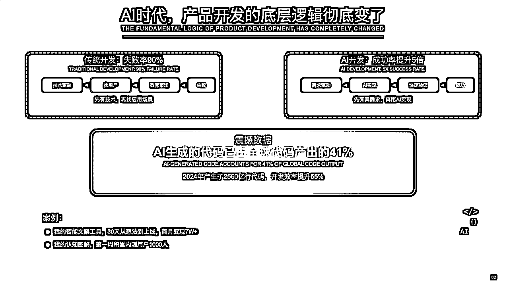

说实话，看到很多人做AI产品，我都替他们着急。因为大家都在重复类似的错误。

#### 第一个坑，技术坑。

"哇，我的AI能识别128种狗！" 用户："那又怎样？"

功能再酷，不解决真问题，就是自嗨。

追求酷炫功能，忽视用户痛点。就像我当初做的AI简历生成器，技术很牛，效果很好，就是没人付费。为什么？因为简历这事，一年最多用一次，没有复购。

#### 第二个坑，需求坑。

"我觉得大家都需要AI记账。"

真相：需要是需要，但不愿意为这个需求付费。

这就是为什么90%的AI产品都死了——他们只懂技术，不懂需求；或者只懂需求，不懂变现。

伪需求包装，没有付费意愿验证。我见过一个朋友，花了3个月做AI数据分析平台，

功能复杂得不行，结果用户上手就懵了。

太复杂的东西，再有用也没人愿意学。

#### 第三个坑，商业坑。

"我的产品日活1万！" "那你赚了多少？" "...还在探索商业模式。"

有流量无转化，变现路径不清晰。就像我那个AI绘画工具，追热点做的，用户不少，就是不赚钱。为什么？没有差异化，被大厂免费产品碾压。

真相是什么？

懂技术+懂抓需求，得两手都要抓，两手都要硬。

才能做出付费的AI小产品。

不是技术不重要，是你得先知道做什么，再考虑怎么做。

* * *

## 踩坑经验


说到踩坑，我真是专业的。

第一个作品：AI简历生成器。

当时我可兴奋了，一键生成专业简历，还能根据不同岗位定制。技术上，我用了最先进的模型；

界面上，我请了设计师朋友。

结果呢？

用户用完就跑，为什么？因为简历这东西，一年最多用两次。没有复购，怎么赚钱？

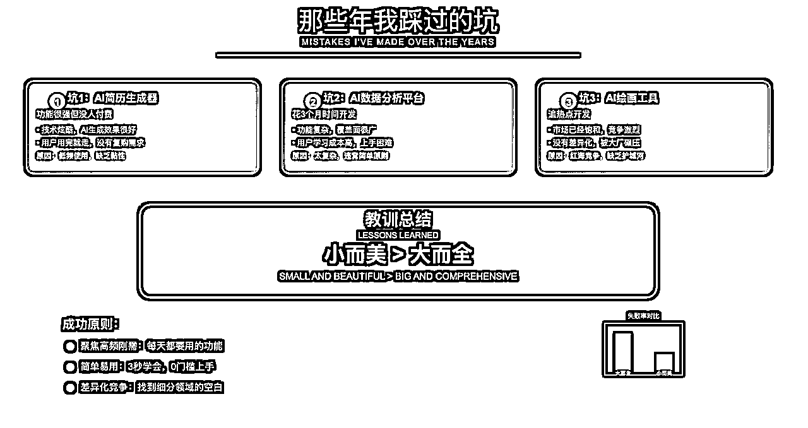

结论：AI简历生成器，功能很强但没人付费。用户用完就走，根本没有复购需求。我花了2个月才明白，低频使用的产品，再牛也赚不到钱。

AI数据分析平台，花了3个月做出来，用户看一眼就关了。太复杂了，学习成本高得离谱。我才知道，用户是懒的，能一步解决绝不走两步。

AI绘画工具，追热点做的，结果呢？市场已经是红海，没有差异化，被大厂免费版本打得措手不及。

三个产品，三种死法，但也让我明白了一个道理：：小而美永远胜过大而全。

不要想着做平台，不要想着做生态，就做一个小功能，做到极致，用户愿意付费，这就够了。

好产品不是设计出来的，是迭代出来的。

* * *

## 定赛道

好，现在进入正题。怎么找到那个"对的点"？

答案可能会让你意外——看看你的微信通讯录。

真的，你的私域就是你的金矿。

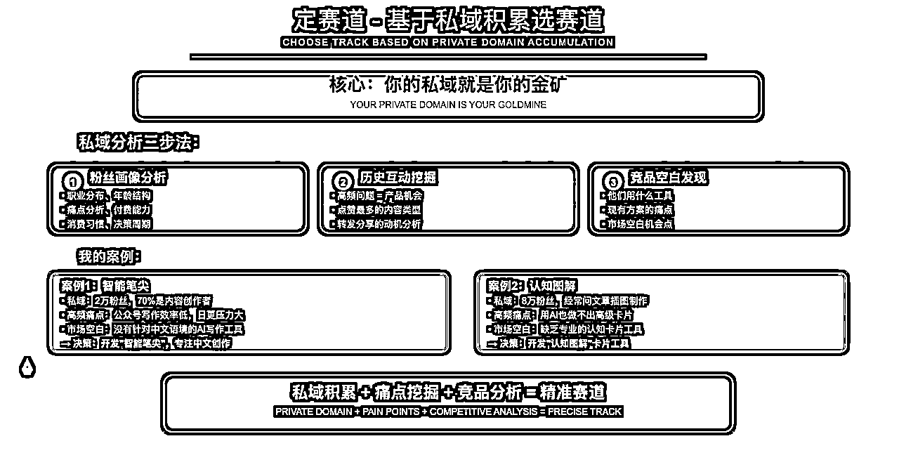

别去看什么行业报告，别去分析什么大趋势，就看你的粉丝每天在问什么。

第一步，我翻了翻我的公众号后台。2万粉丝，我导出了他们的互动数据。发现了什么？70%是内容创作者。

这是第一个信号。

第二步，我统计了最近半年的私信。排名第一的问题是什么？

"你的文章是怎么写的？有什么技巧吗？" "AI写作工具推荐一个？" "怎么保持日更还能有质量？"

这是第二个信号。

第三步，我去看了市面上的竞品。ChatGPT太通用，不懂中文语境；其他工具要么太贵，要么不好用。

私域分析三步：粉丝画像分析、历史互动挖掘、竞品空白发现。

三个信号汇总，答案就出来了：做一个懂中文、懂公众号、懂创作者的AI写作工具。

这就是"智能笔尖"的由来。

再举个例子，我的第二个产品"认知图解"。

怎么来的？我发现每次发文章，都有人问："你的配图是怎么做的？"

一开始我还挺得意，一个个回复。后来问的人太多了，我就想——这不就是需求吗？

8万粉丝，如果1%的人有这个需求，那就是800个潜在客户。如果转化率10%，客单价399，你算算是多少？

不要凭空想需求，你的粉丝会告诉你答案。

我的粉丝，70%是内容创作者，他们每天最头疼的是什么？写作效率低，日更压力大。高频问题就是产品机会。


我发现市场上没有针对中文语境的AI写作工具，于是决定做"智能笔尖"。

还有认知图解，因为很多人问我文章插图怎么做的，但用AI也做不出高级卡片，这就是机会。

认知图解的地址：https://xiaojuexing.com/ 、

有兴趣的圈友可以免费内测，领取内测码即可

```
YBXPFJSGTT
8C5TJ72UJM
9NEW8NJDNZ
K4VBKUSFKA
V6E6MHAWXN
PVYWBN7B3P
ZDSVVGKHWZ
9QPGME7XTR
9P8UBPTV8X

```

和产品视频：

记住一个公式：私域积累+痛点挖掘+竞品分析=精准赛道。

你的深度理解，就是你的护城河。

* * *

## 盘需求

找到方向只是第一步，接下来要做的是——让粉丝参与你的产品设计。

我的方法很简单，四个渠道：

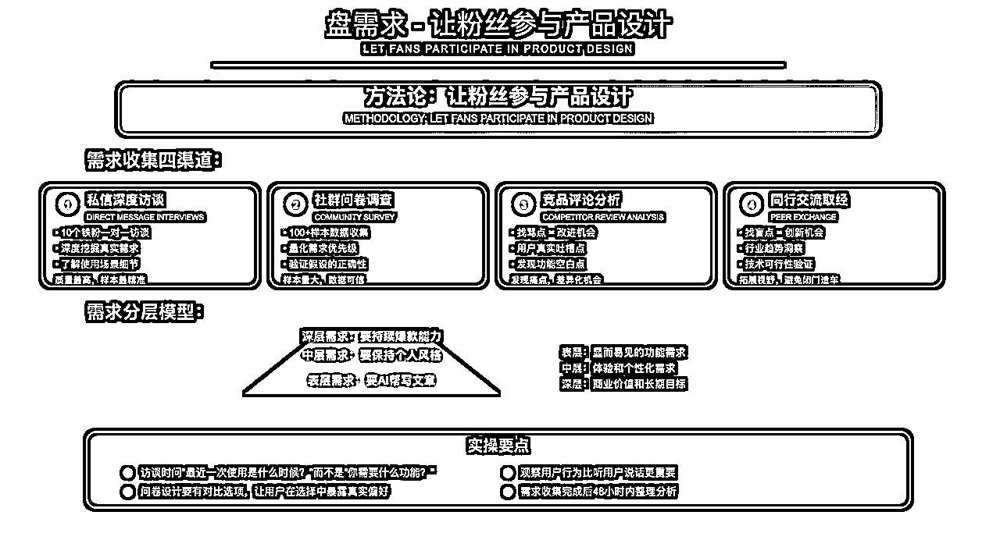

第一，深度访谈。

我找了10个经常互动的铁粉，每人聊一小时。不是问"你需要什么"，而是问"你现在是怎么写文章的"。

有个粉丝跟我说："每天最痛苦的不是没东西写，而是有想法但写不出那个感觉。"

这句话点醒了我——用户要的不是AI帮他写，而是帮他把想法变成文章。

第二，社群调查。

我在几个创作者社群发了问卷，收集了127份反馈。最有意思的是，大家的痛点出奇一致：

"想保持个人风格" "怕被平台判定为AI" "要有持续的爆款能力"

第三，竞品分析。

我去看了所有竞品的差评。你知道用户骂得最多的是什么吗？

"生成的内容没有灵魂" "一看就是AI写的" "不懂中文的表达习惯"

骂点就是机会。

第四，同行交流。

我找了几个做内容的朋友聊天。其中一个朋友说了句特别有意思的话：

"我不是不会写，我是不知道怎么开头。"

这让我意识到，AI不应该替代创作者，而应该做创作者的副驾驶。

通过这四个渠道，我终于搞清楚了用户要的到底是什么：

不是一个写作机器，而是一个懂他的写作伙伴。

观察用户行为比听用户说话更重要。

有思考的你+会写作的智能笔尖=未来AI作家。

* * *

## 瞄得准

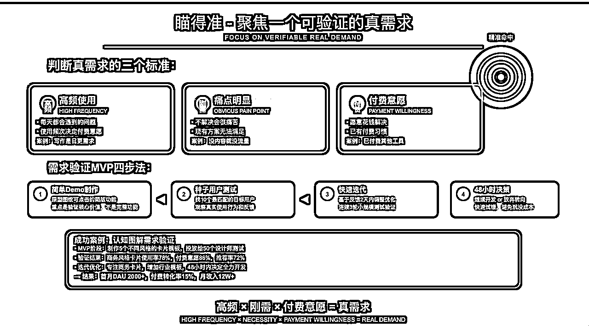

什么是真需求？

高频×刚需×付费意愿=真需求。

怎么判断哪个是真需求？

我有三个标准，特别简单：

第一，看频率。

写作是不是高频需求？是的，日更博主天天要写。 相比之下，做简历是高频需求吗？不是，一年两次。

第二，看痛苦程度。

不写文章会怎样？没内容就没流量，没流量就没收入。 这是真痛，不是痒。

第三，看付费意愿。

我做了个测试。在社群里说："如果有个工具能帮你提升50%的写作效率，你愿意付多少钱？"

80%的人选择了50-200元/月的区间。

这说明什么？说明这个需求不仅真实，而且用户愿意为它买单。

但光有理论还不够，我做了个MVP来验证。

花了48小时，我和技术搭档做了个最简版本：

*   只有一个功能：输入想法，生成开头

*   界面奇丑无比

*   但是能用

我找了10个种子用户测试。

第一天，3个人说"有点意思"。

第二天，7个人问"什么时候能出完整版"。

第三天，有人直接问"能不能先预定"。

这时候我知道，这事儿能成。

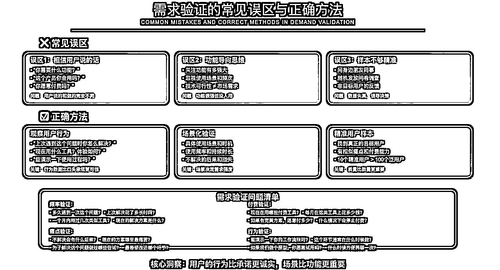

不要相信用户说的，要看用户做的。愿意掏钱的需求，才是真需求。

讲真，用户的行为比承诺更诚实，场景比功能更重要。

10个精准用户胜过100个泛用户。

* * *

## 找搭子

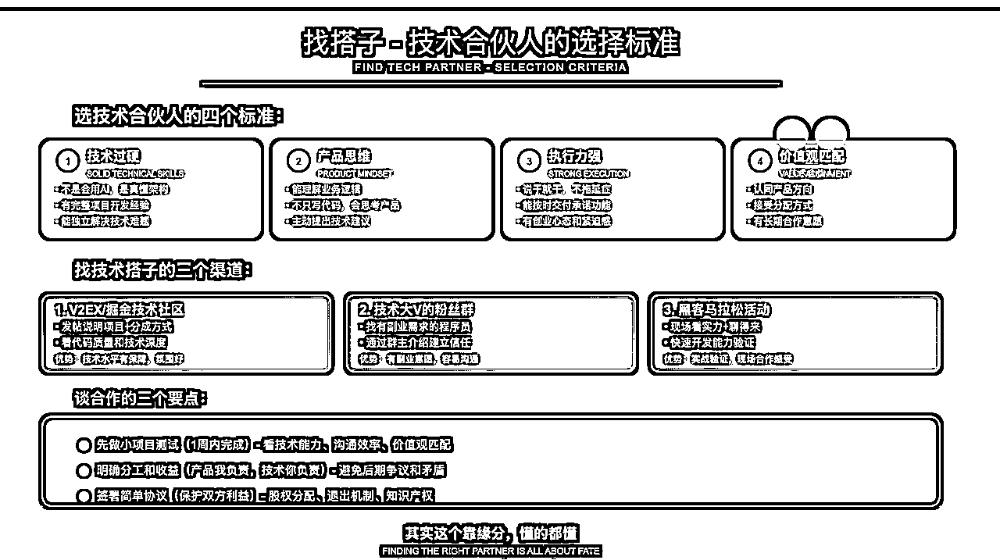

产品方向有了，需求验证了，接下来最关键的一步——找个靠谱的技术搭档。

说实话，这步最难。为什么？因为好的技术人才都很贵，而且未必愿意跟你一起创业。

我是怎么找到的？

先说说我的标准：

第一，技术要过硬。注意，不是会调用AI接口就行，而是真的懂架构。

我面试过一个哥们，说自己精通AI。我问他："怎么处理并发请求？"他愣了。

这种就不行。

第二，要有产品思维。

写代码谁都会，但能理解为什么这么做的人不多。我现在的搭档，经常会反问我："用户真的需要这个功能吗？"

这种才是好搭档。

第三，执行力要强。

创业最怕什么？最怕拖延症。说今天做，结果下周还没动。这种人再厉害也不要。

第四，价值观要一致。

什么叫价值观一致？就是都认同"先把产品做出来，赚到钱再说"。

那么去哪找这样的人？

我试了三个渠道：

第一个，技术社区发帖。比如稀土掘金，CSD N。

第二个，技术大V的粉丝群。很多程序员都有副业需求，而且能力不错。

第三个，黑客马拉松。这个最有效，因为能现场看到实力。

怎么确定的？

很简单，先做个小项目测试。我出了个题目："48小时内，做个简单的文本生成工具。"

不仅看结果，更看过程。有个哥们儿，虽然功能简单，但代码结构清晰，注释完整，还写了使用文档。

简单直接，不画饼，不忽悠。

现在回头看，找对搭档，真的是成功了一半。

总结就是：先做小项目测试、明确分工和收益、签署简单协议。

我的经验，其实这个靠缘分，懂的都懂。（真实的事，我和我的合伙人墨云认识很久）

好的搭子，不只是技术实现，是能和你一起思考产品方向的人。

价值观匹配比技术水平更重要。

* * *

## 认知流程重写

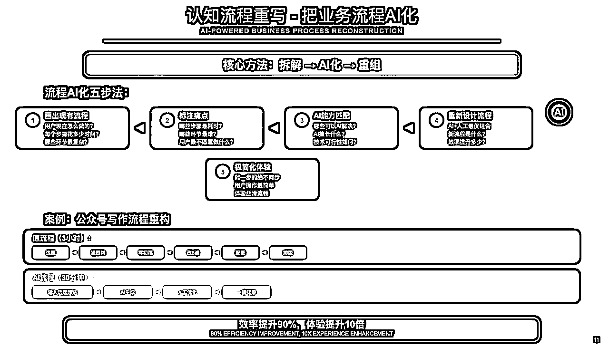

很多人用AI，还是在做加法。

真正的AI化，是重新设计流程。

拆解→AI化→重组，这是核心方法。

我拿公众号写作举例。

原流程：选题→查资料→写初稿→改5遍→配图→排版，3小时。

AI流程：输入选题想法→AI生成→人工优化→一键排版，30分钟。

效率提升90%，体验提升10倍。

但这不是简单的工具替换，是流程再造。

你要问自己：哪些步骤最耗时？哪些环节最难？AI能解决什么？

重点是，能一步的绝不两步，能自动的绝不手动。

AI不是让你的工作变得更复杂，是让复杂的事情变简单。

流程AI化五步法：画出现有流程、标注痛点、AI能力匹配、重新设计流程、极简化体验。

但这还不够。我们发现一个问题：AI生成的内容太"AI"了。

怎么办？

我们加了个"风格学习"功能。用户可以上传自己以前的文章，AI会学习他的写作风格。

这样生成的内容，既高效又有个人特色。

有个用户反馈特别有意思："用了你们的工具，我老婆都没发现文章是AI帮我写的。"

这就对了。最好的AI工具，是让人感觉不到AI的存在。

记住：不要让用户适应你的产品，而要让产品适应用户的习惯。

* * *

## 出产品文档

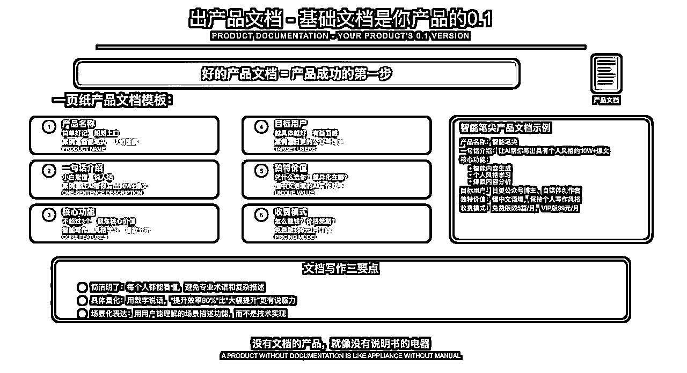

产品流程有了，接下来要写产品文档。

很多人觉得这个不重要，大错特错。一份好的产品文档，能让你少走很多弯路。

我的产品文档特别简单，就一页纸：

产品名称：智能笔尖 （为什么叫这个？笔是写作，尖是精准，智能不用说）

一句话介绍：让AI帮你写出10W+爆款文章 （注意，不是"AI写作工具"，而是"写出10W+"，直接说结果）

核心功能：就三个

1.  智能写作（不是生成，是辅助）

1.  风格学习（保持个人特色）

1.  爆款分析（什么样的文章容易火）

目标用户：日更的公众号博主 （越具体越好，不要"内容创作者"，而是"日更的公众号博主"）

独特价值：懂中文语境的AI写作工具 （市面上大部分工具都是英译中，我们是原生中文）

收费模式：99元/月订阅制 （为什么是99？不是69也不是199？因为刚好低于100元的心理价位）

这份文档，我们前后改了不下20版。每改一次，产品思路就清晰一分。

最有用的是那句"一句话介绍"。如果你不能用一句话说清楚你的产品，说明你自己都没想清楚。

还有个小技巧：把这份文档打印出来，贴在墙上。每次想加新功能的时候，

看看它。如果新功能不符合核心定位，坚决不加。

克制，比放纵更重要。

文档写作三要点：简洁明了、具体量化、场景化表达。

没有文档的产品，就像没有说明书的电器。

* * *

## 选前端

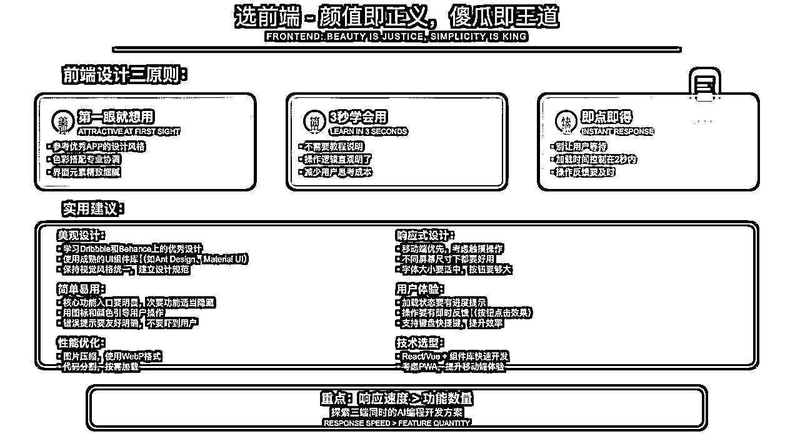

用户不会因为你的技术有多牛而付费，但会因为界面太丑而离开。

是的，这个看脸的世界，产品也要看颜值。

我们的第一版，那叫一个惨不忍睹。灰色背景，宋体字，按钮都是默认样式。

结果用户反馈："这是10年前的网站吗？"

痛定思痛，我们确定了三个原则：

第一，美观。 不求惊艳，但求舒服。我们参考了Notion的设计，简洁但不简陋。

第二，简单。 3秒学会用。首页就一个输入框，一个按钮。用户不需要看教程。

第三，快速。 点击就有反应，生成不超过3秒。宁可功能少一点，也要速度快一点。

特别是第三点，太重要了。

我们测试发现，如果生成时间超过5秒，50%的用户会关闭页面。

所以我们做了很多优化：

*   打字机效果，让用户感觉AI在实时创作

*   预生成机制，提前准备好常见内容

*   多模型负载均衡，哪个快用哪个

用户反馈："我擦，效果比克劳德还好"

在用户眼里，快就是好，美就是对。

* * *

## 理架构

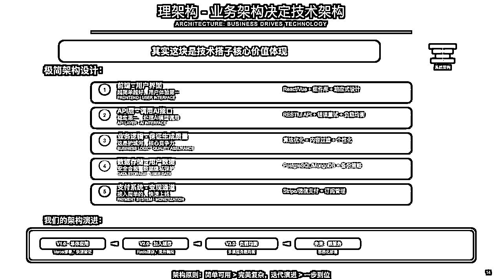

架构这块，说实话是技术搭档的主场。但作为产品负责人，你也要懂基本逻辑。

我们的架构演进很有意思：

V1.0版本，特别简单。 一个前端页面，一个API接口，直接调用OpenAI。部署在Vercel上，免费。

这版本支撑了我们的MVP测试。

V2.0版本，用户多了，问题来了。 API调用频繁超限，用户体验差。我们加了Redis缓存，把常见请求缓存起来。

效果立竿见影，成本降低了60%。

V3.0版本，追求稳定。 我们接入了多个AI模型，做负载均衡。OpenAI挂了用Claude，Claude挂了用通义千问。

用户无感知，但稳定性提升了90%。

这里有个血泪教训：不要一开始就追求完美架构。

我见过太多项目，还没有用户就在纠结"微服务还是单体"，"用MySQL还是PostgreSQL"。

真相是：你的用户不关心你用什么技术栈，他们只关心能不能用、好不好用。

先跑起来，再优化。这就是互联网思维。

* * *

## 跑得快


私域冷启动，不是终点，迭代才是王道。

我的节奏是这样的：每周小更新，每月大更新，每季度战略调整。

产品上线只是开始，真正的挑战是迭代。

我们的策略很简单：快速迭代，小步快跑。

每周五，我们会做三件事：

第一，看用户在骂什么。

是的，你没听错，专门看差评。第一周，骂得最多的是"生成的内容太模板化"。

我们立刻优化了提示词，加入了更多变化。

第二，看用户在求什么。

有个功能需求出现了17次："能不能一键生成小红书文案？"

虽然这不是我们的核心功能，但用户需要，我们就加。结果这个功能成了付费转化率最高的。

第三，看用户在夸什么。

被夸最多的是"风格学习"功能。这给了我们信心，继续在这个方向深挖。

我们的迭代节奏是：

*   每周小更新（修bug，微调体验）

*   每月大更新（新功能上线）

*   每季度战略复盘（要不要调整方向）

举个例子，我们的"爆款标题"功能，就是这么迭代出来的：

第一周：基础版，随机生成5个标题 用户反馈：太随机，不够精准

第二周：加入行业分类 用户反馈：还是不够个性化

第三周：结合历史爆款数据 用户反馈：这个可以！

第四周：加入情绪分析 用户反馈：绝了！这就是我要的！

四次迭代，付费率从5%提升到23%。

记住乔布斯那句话：好产品是迭代出来的，不是设计出来的。

不是所有需求都要满足。如果偏离了核心价值，宁可不做。

* * *

## 最后

我想和大家分享一个重要的认知。


AI时代的知识付费变了。

过去卖课程，教你怎么做；现在卖工具，帮你直接做；未来卖方案，替你想明白。

本质变化：从"知识交付"到"解决方案交付"。

不再是教会你，而是替你做好。

更狠的是，AI时代有三大机会：

产品开发门槛降低90%，AI编程让非技术人员也能做产品。

认知和私域是最大资产，深度理解用户需求比技术更重要。

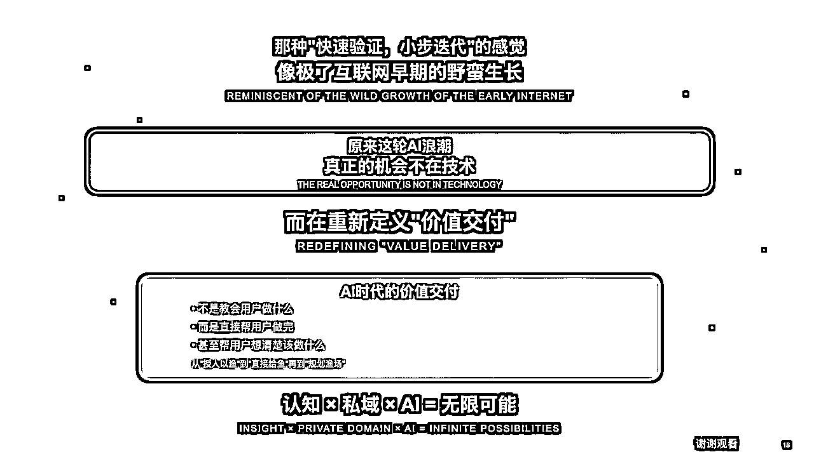

重新定义"价值交付"，真正的机会不在技术，在商业模式。

这轮AI浪潮，像极了互联网早期的野蛮生长。

机会属于那些敢于重新定义"价值交付"的人。

这轮AI浪潮，真正的机会不在技术，而在重新定义"价值交付"。

如果你依旧不顺手下场，再牛的AI也改不了命。

* * *

过往精华：

https://t.zsxq.com/AUKRR

https://t.zsxq.com/Z1BtR

https://t.zsxq.com/cUBLm

https://t.zsxq.com/UVice

https://t.zsxq.com/lXdyJ

