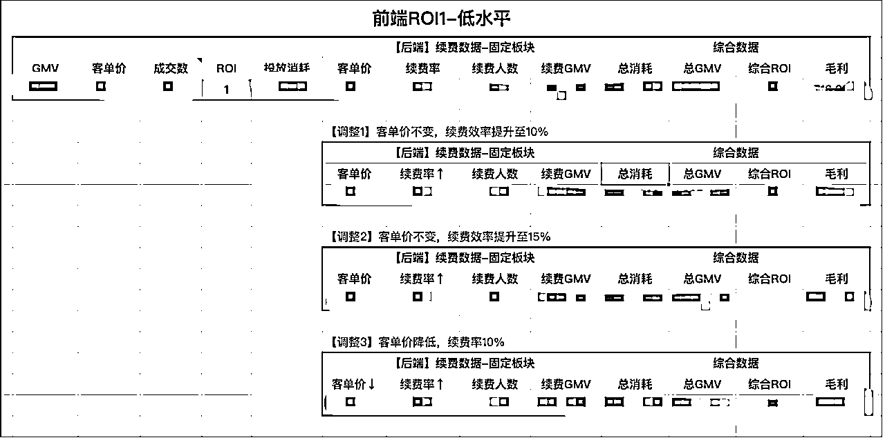

# 知识付费行业如何做好「公域大规模获客+私域高价值续费」的高效模型？

> 来源：[https://i4avwea6mr.feishu.cn/docx/SwWDdjdcSoDRI0x57cgcR71BnYb](https://i4avwea6mr.feishu.cn/docx/SwWDdjdcSoDRI0x57cgcR71BnYb)

大家好，我是小林，在教育行业摸爬滚打五年，做过K12、启蒙、成人业务，做过社群运营、销售、直播运营。俗话说，运营是块砖，哪里需要往哪搬～

入行赶上了微信裂变的高光末尾，亲历过私域大班直播课的浪潮，后转身投入了直播的怀抱，从0-1孵化过雅思赛道头部IP账号，单月GMV从0突破500w，23年合伙创业过一家小而美的IP公司，2年时间从出租屋3人组变成小50人的大家庭，作为运营负责人，成人英语赛道抖音直播一年营收过2000w，前后端公私域单年GMV 1亿+。

25年，又重新踏上“旅途”，加入了一家AI教育公司，目前是一位AI小白，正在探索AI赋能市场获客业务，包括矩阵账号+批量生成数字人视频+多平台内容二创改写获客。

如果你和我们一样，希望打造一个小而美形态+高人效的公司，又或者希望玩转公私域实现高利润，这篇分享或许能给到你帮助。第一次系统梳理这一切来时路，如有不到位的地方，请大家多多包涵～

# 一、如何判断你适不适合做公私域联动？

流量成本飙升已经成为大家的痛点，前端直播间今天投放把钱撒出去，看似ROI回了本，最后退费和各种成本一算，整个月白给平台打工了。我们曾经开玩笑的说，今天多勤奋挣个100块，月底就要多亏200块，还不如不上班，四舍五入立赚100块。

这个时候，你会发现市场上关于「做私域」的声音越来越大了。那我们先简单明确一个概念，为什么要做「私域」？

这两个字在五年前我刚入行就听到过，但从没有此刻这么重要。最直白的原因就是，公域已经赚不到钱了，必须要通过私域的续费、扩科、转介绍来提升用户LTV，业务才有存活的空间。

所以你看，有些道理我们明明早就知道，但只要这个需求不够痛，我们永远不会做出改变。延伸一句题外话，所以很多时候，当你在向用户宣传你的产品时，哪怕产品确实能带来价值，但你有让用户感受到这种足够痛到要改变的「一瞬间」吗？

基于单靠前端公域就实现盈利已经越来越难的背景，越来越多人进入了公私域联动的战场。所以私域也不是两年前那么好做了，哪怕你曾经在前端拿到过大成绩，来到私域你必须要足够投入，从零开始，才能拿到结果。

那么，目前公私域这套玩法，大家第一步在公域会怎么获客呢？基本上分这几种模式：

1\. 0元线索：从平台偷流量、信息流留资、客单价<10元的低价商品...，私域做转化

2\. 低价线索：最常见的就是书课包，各种19.9、29.9的商品，私域做转化

3\. 中价课：我定义是大于99、小于500的产品，用户购买课程有完整链路承接到私域，并在私域内完成高客单续费；

4\. 高价课：>500的产品。大部分老师其实直接定价在2000+，私域做续费。

那么对于每一种模式，其实对于IP和团队的能力要求，是非常不一样的。

## 第1种：0元线索获客

如果你是自然流偷流量的打法，那么你的内容感知能力要足够优秀，要足够高产并接受内容更重数不重质，而且要能接受同一内容的重复翻拍，因为用户感兴趣的点本来就那几个。而这对很多知识IP其实是很难打破的魔咒。

如果你是纯付费打法，那小公司基本玩不起，这是留给大机构的。因为这个模式一定要搭一个大的销售团队，搭了销售团队就需要你稳定供给线索量，否则不光挣不到钱，人力成本追着你跑。而且每一期roi就像过山车，可能心脏和钱包都承受不了。

## 第2种：低价线索

其实是第1种的付费打法发展出来的产物，团队要求基本一致，同样在销售团队上有极高的要求，在这里不赘述。

## 第3种：中价课

是我比较建议大家做的模式，也是我们曾经采取的方式，在这里我展开介绍下。

中价课的产品，相较于1、2种方式，你的风险系数会下降很多，因为你在前端盈利，后端纯赚。打个比方，我以前做的教育行业，1和2模式下的单个线索成本100-200一个，如果你后端转化率上不来，那整体ROI<1就亏钱。

但是3的模式，我卖一个两三百块钱的课程，高的话roi做到1.5，低的话roi做到0.8我都能接受，因为哪怕roi是0.8，我相当于花几十块钱就买到了一个比前面方式还要精准的用户，后面续费率一算上肯定挣钱。甚至我结合我私域续费的能力，我可以算前端公域能接受的最低roi，我卡着这个roi放量，就吃掉了别的老师的市场。因为没做私域的老师，前端公域必须挣钱，他两百客单价的课程，只敢花200以下的成本获取这个流量，而我有更大的接受度，可以接受300、400去获取这个流量，那我拿流量的优势肯定是更大的。所以到这就能明白，为什么一定要做私域。

我们这一套跑下来，线索成本低+质量高，销售的人效是普通公司的5倍，所以不需要搭很多销售。但对应的是，这一套模式想打出好的效果，对于前后端团队的人员要求都比较高，重质不重量。首先IP的产品力要足够硬，要能支持前后端2个价位的课程产品，前端的团队要能打磨出一个高成交直播间，后端的团队要能承接好流量并做好转化。

## 第4种：高价课

适合不愿意搭销售团队，只希望靠前端直播间就能盈利，这样也能挣点钱，但规模不大，或者说赛道合适+产品刚需+团队能力足够强，前端直接收高客单的情况下，还能保证成交量充足，后续还能做续费。

# 二、「高利润」公转私模型底层逻辑

我们靠着这套进阶打法，在过去一年实现了1亿+的营收，而且业务roi很健康。那你说，凡事都有两面，这件事的回报这么高，那为什么不大家都做呢？

实话就是，这件事有「门槛」，而且这个「门槛」往往就是护城河，不是知道了业务运营模式，就能瞬间复刻出来的。所以如果你有IP，你“肚子里有料”——你有内容的沉淀，你能“炒出一盘好菜”——内容已经成体系，并且能通俗易懂不晦涩地讲给用户听，那么你适合直接开始做这个进阶模式。

如果你不具备，那建议先回到“新手村”打怪升级，先保证中价课你都能卖得动，再来打磨高价课产品和业务。

如果你具备，并且也想和我们一样，走第3种模式，我在这里和你分享这套打法的大致3个阶段。

## 阶段一：测算你的业务健康度

虽然公司创立时的梦都已经做到上市了，但还是需要坐下来，冷静冷静，先务实的算一笔账。很多时候大家在不了解同行数据的情况下，会乐观高估自己的能力，导致盲目估算关键环节的数据，其实算笔账，有可能发现这业都没必要创。

我们当时问了一圈竞品的数据，公域包含普遍的【市场中价课平均定价多少】、【不同量级的老师月销量多少】、【市场消耗量级和ROI】，也包含特殊的，也就是和我们类似业务模式的老师，这几个关键数据大概是什么水平，因为如果是离你更近的人，你对于彼此的优劣势看得更清楚，以他的数据为基础，结合你们的能力差别做调整。

私域数据包括【后端续费课的客单价】和【续费率】。

这个时候你就可以算出纯业务上，你的毛利大概是【公域GMV=客单价*销量】+【私域GMV=续费率*公域销量*客单价】-【总消耗=公域GMV/ROI】。在这里，多在业务核心数据上调整，看看自己能接受的边界。

例如前端ROI稳定是1，去调整后端的数据看结果。后端续费率如果是10%，毛利是多少，如果后端客单价不变，但我的销售人员能力提升，续费率提升到15%，毛利是多少，那假定我是hard模式，卖不动那么高的客单价也做不了高转化率，那就把客单价降低转化率也降低，这个情况下的毛利都可以接受的话，那么业务的风险就更小了。

再假设如果前端ROI更高或者更低的情况下，把刚刚私域的不同情况再算一遍，你大概就知道自己要做到什么目标更现实了。

## 阶段二：梳理你的产品体系

在一开始就要把你的产品体系梳理好，让产品成为你丝滑续费的一环。

公域的课程就是个钩子，符合特性就是要瞬时收获感强，又价格实惠，吸引用户兴趣，但并不一定真正解决用户问题。有收获感比有收获更重要。

私域的课程就是深度链接的场域，符合特性就是要体系完善，真正能满足用户的需求，解决用户问题，才能建立信任。

我们公域课程定了50节，当时市面上其他卖中价课的老师课程至少都是100节起，走量大优惠的风格，但我们没选择这么多的节数，是因为公域一旦给的太多，用户就觉得只要买这个课就能解决问题了，所以我不需要续费。又或者，公域课这么多节我还没学完呢，够我学一壶的，所以我不续费了。这是数量上的平衡。

而且公私域产品一定要有「进阶性」和「差异化」，这是高转化率的影响点，因为你能从产品层面规避很多转化时候要弥补的话术。进阶意味着私域的课程一定要比公域课更精致、更体系、更有效果，用户才愿意花更高的价格购买，但又不能和公域是同一方面的进阶。

打个比方，公域我卖3000单词营，私域我续费10000单词营，这就让用户很容易觉得我还没学完，没必要买一个更大容量的课程。但如果有差异性和互补性，公域我卖一个单词记忆课，私域的课程是帮你进一步深度理解和运用单词，最终帮你提升口语的课程，这就能够更好利用用户需求的进阶去扩新的课程。

在这里一直有一个我想尝试的玩法，但没在产品期落地的，大家可以试试。可以在公域的课程交付中丝滑植入私域的课程卖点，可能用户在第一次被你集中销售时没有转化，但每次只要听你的课程，就又是一次软性的销售时机。

比如公域课我卖的是单词记忆课，我在课程中可以提到：“除了用我这个方法让大家快速记单词，如果你在生活中见到的很多场景，你都能尝试用英语去表达，在实际中去运用的时候，那么你单词的记忆效率就会比别人快3倍，我有门课就是系统讲带着大家在生活中去用英语。”点到即止，就像刷脸熟一样，刷多了用户就对这个产品有印象了，而且你可以把这些话术包装进方法讲解中，用户只会觉得你在讲学习方法，而不是在强硬地营销另一门课。

## 阶段三：打磨高成交直播内容

当你的兵草足了，就到了该打仗的时候了。很多人在公域或者私域直播拿到结果后，想延伸到另一端，都会遇到“惯性”问题，即“我在私域这么播效果很好，为什么公域就不行？”

这很正常嘛！公域就像是你在街边吆喝，周围人来人往，大家都有自己的安排，你要是来段演讲，肯定不如胸口碎大石表演，一瞬间就能抓住稀缺的注意力。另一个是用户早早就决定要看一场电影，提前买了一张电影票，空出了时间，进了影院从头坐到尾，除非电影真的太难看。明白了这个场景，你就知道为什么公域总是需要瞬时收获感更强的内容，更抢夺目光的形式，以及情绪浓度非常高的用语。

所以如果你在公域想做百元课，并想通过投放扩大量级，一定要找到【最小单元的干货闭环+让用户最有收获感的呈现逻辑+你独特的魅力】。

什么是最小单元的干货闭环？如果你的正式课一节课是40分钟把一个概念讲明白，让用户“真的会了”，那公域直播就是找到里面最具代表性的例子，在直播间内10分钟就能讲完，并让用户感觉自己“好像会了”。

什么是让用户最有收获感的呈现逻辑？接下来我以文字展现两个同样的知识点，但是不同的呈现逻辑（效果不如口播上课，大家请尽量理解下），理解一下什么是【植入反认知】+【有意识的引导用户】+【举一反三 逐层递进】+【强调效果】

例子1：

【at、cat、fat、chat、spat、scat】问学生觉得这几个词有什么共同之处？

是不是都含了at？

教会大家读at之后，再练习上面每个单词的发音，发现很简单就掌握了6个单词的发音

强调跟着我学，就是能很快速的掌握单词发音

例子2:

大家觉得不学音标，能读出不认识的单词吗？

大家都觉得必须要学音标，那今天我教你一个方法，让你不用音标也能读单词，学英语更轻松了，不信你试试看。

【at】这个单词知道怎么读吗？大家都会

那我们在前面加上一个单词「c-at」「h-at」「f-at」，这几个你是不是会读了？

那再接下来这几个单词， 哪怕你不知道中文意思，你也会读了？

m-at、p-at、r-at

那我们再试试进阶，加上两个字母

ch-at、s-p-at、s-c-at，像中文拼音一样，你也都能分开自己拼出来了？

所以跟着我学，你不用学音标，也能正确读出90%的单词，见字能读

什么是独特的魅力？直播迷人的地方，就是我们明明隔着上千公里，却因为一块小小的屏幕，让你「此时」「此地」与我「亲近」在一起，所以“人”味是非常重要的。不是激动的叫嚣的就是好的，而是你自己独特的风格，你可以是拽拽的，冷酷的，也可以是热情的，活泼的，但最害怕你像带上面具的人，虽然话术和稿子逐字不差，没有犯错，回答总是客观公正，没有流露个人情感和喜好，状态稳定，始终保持微笑，但你发现，这样的你就是无趣的，没有吸引力的。

如果你想做好私域的课，就像大家现在都在跑的训练营模式，2-4天的连续直播，类似连续剧的讲座形式。本质上，私域直播不像公域只是学会了一个具体的知识点，一个具体的招式，瞬时收获感强，而是给到用户一个看起来很厉害的「武功秘籍」，是一套心法和全套招式秘籍，让人感觉一下子打通任督二脉了，哪怕现在我还没有变强，但我坚信只要跟着这本体系秘籍往下练，我就能练成绝世大师。同时在诸多细节的地方，辅助一切的专业人设铺垫和加强“人与人之间的链接”。关于私域更具体的内容，说起来比较多，我会再单独整理一次，也会在7月底的夜话会里分享。

写于最后，到了阶段三，是最需要心力支撑的地方。因为一切的数据反馈都太快了，你做的好与不好，大屏上的数字立马会告诉你，所以在在冷启动期或者数据下滑的时候，就会让人尤其焦虑。你可能会因为数据下滑，而把更多时间投入到直播、复盘的死循环中，又因为状态不好迟迟得不到反馈，最终丧失信心。

但我想和你说的是，只要每天都在路上，做好每日该做的事，结果自然会来。累的时候给自己“停摆时间”，不要再埋头工作，多在工作以外找一些生活支点，反而会得到更多灵感～你的状态好了，你发现，结果也就来了。