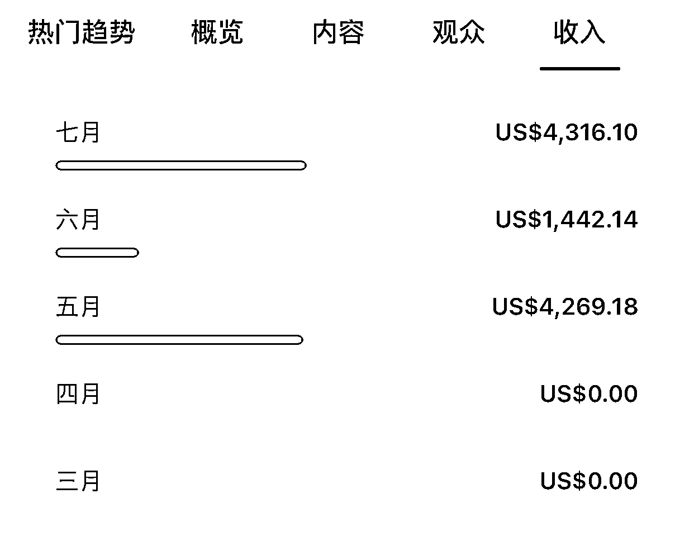
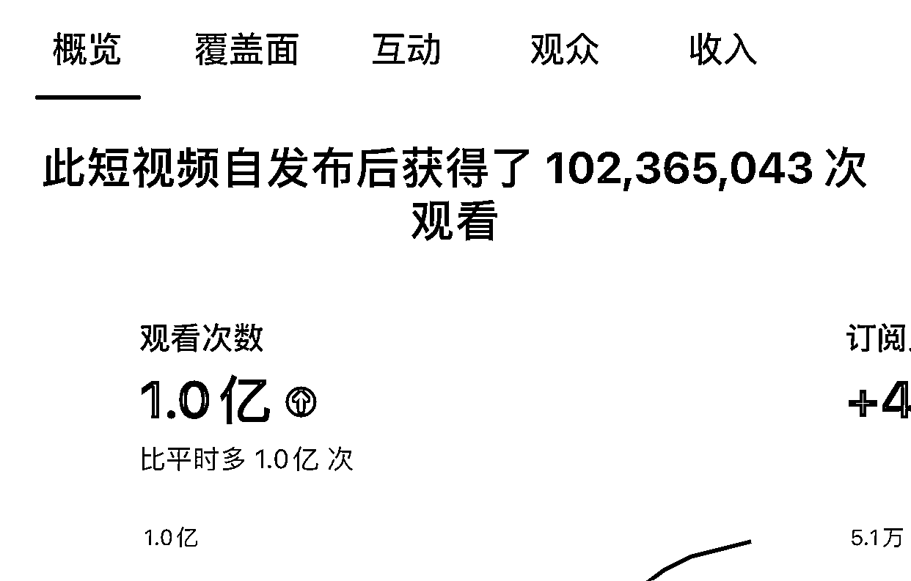
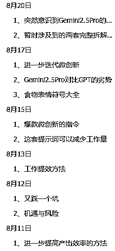
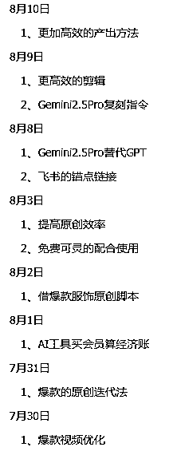
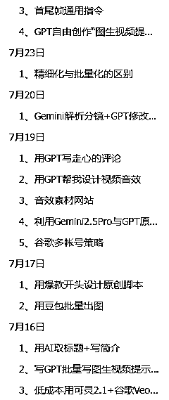

# Youtube shorts 单号突破万刀复盘

> 来源：[https://ndn9y8djot.feishu.cn/docx/LcXFdBIoco5P6kx83VqcsKO6nld](https://ndn9y8djot.feishu.cn/docx/LcXFdBIoco5P6kx83VqcsKO6nld)

多数人因为看见才相信。这张图是七月底截的，shorts单号突破万刀，七月底就想写，忙起来又忘了。

写下这篇复盘，是想把整个过程中的关键经验、思路和心态变化整理出来。

新的一期航海即将起航，希望能给刚入局的朋友一些参考，少走一些弯路。

## 新号应该注意什么

起一个新号，大概率是从抄爆款开始。怎么抄？为什么抄爆款没有流量？怎么找到适合自己的领域，怎么缩短开YPP的时间......

### 1、缩短时长

shorts 开 YPP 考核的是「互动观看次数」，而不是总时长。对新号来说，本身没有画像，系统的推荐比较随机，所以要尽快把“观看次数”做起来。

我在复刻爆款的时候，会刻意缩短视频时长，加快节奏。别人30秒，我可能会做到20秒，这样做有几个好处：

1.  完播率更高：视频越短，观众越容易看完，完播率高，算法就更愿意推。

1.  次数积累更快：观众用 1 分钟，看一个 60 秒视频只算 1 次观看，看 15 秒视频可能能算 4 次观看。短视频更容易快速累积到考核需要的互动观看次数。

1.  测试成本更低：时长短，制作门槛低，可以快速尝试更多不同的爆款模板，找到适合自己的方向。

### 2、记录细节

我起新号，有一个习惯，就是用表格做记录，任何细微的变化都会记录。在经营频道过程中，每一个细微的调整都可能影响结果。与其凭感觉做，不如通过记录来建立“自己的数据样本”。

为什么要记录？

1.  方便复盘：知道哪一步改动带来了正向效果，哪一步没有影响。除了表格记录，我还有一份每日复盘记录，已经写了六万多字。

1.  找到规律：每个账号的受众画像不同，别人的经验只能参考，最终还是要靠自己数据沉淀出最优解。

我通常会在表格里记录以下内容：

*   发布时间（早、中、晚的流量差异）

*   发布设备（电脑端和手机端，都发布试试，看看流量有没有影响）

*   IP 情况（切换IP，对流量是否有影响）

*   是否修改过缩略图、标题或描述

*   视频时长与结构调整

通过记录，我们可以对频道运营，平台规则等，有一个更清晰的认识。比如：

1.  发布时间：可能有人会说，发布时间直接跟着对标走就好了，这个可以参考，但是每个帐号，随着流量的增长，它的粉丝画像是不同的，适合自己的才是最好的，找到适合自己的数据样本。

1.  IP 问题：我最初担心频繁更换 IP 会影响流量，于是特意做了记录。结果发现，即便今天在这个国家的 IP，明天换到另一个国家，账号的流量并没有受到明显影响。至少目前来看，YouTube 在这方面的限制没有想象中严格。当然，为了减少风险，后面我还是买了静态IP。

### 3、转领域起号

很多人常说：“我还没想好做哪个赛道。” ，甚至航海都过半了，还有人没有选好做什么内容。为什么迈出第一步这么难，大概率是期待一做就成功，一发视频就流量起飞。

想一出手就成功，这个要靠运气。大部分人的运气都不好，如果一直纠结不做，永远起不来。

做的过程比选更重要。你不做，永远不知道什么样的内容在你的频道上有流量；你做了，才能在实践中发现机会。

所以我的建议是：

1.  先选一个自己相对喜欢的领域，把它当练手。不要刚做两个视频，就想着有泼天的流量。

1.  在创作过程中，多刷视频，多点进去看别人的频道，看看有哪些爆款。我发现：很多频道都转过领域，他们的爆款内容往往不是最初选的赛道。

1.  换个心态，不要想着一开始就能出大爆款，而是用“边做边试”来积累账号权重。等你的帐号积累了一定的权重，说不定换个其它领域就爆了。

什么时候考虑换领域？

这个没有统一答案，我的个人做法是用“15 条视频”为一个分界点：

*   如果发了 15 条，播放量大多在 3 万–5 万，偶尔 10 万–20 万，但一直没出百万，那我就会考虑换。

*   如果某条爆到百万甚至千万，那说明这个领域有潜力，可以继续深耕。

*   我另外一个号就是这样：前两个领域都没起色，基本就是3万5万，稍微高点能达到10万20万，换到第三个领域在 10 条以内就爆了 2000 万+。

选择什么领域，做什么内容，不是一开始就能找对的，而是在实践中迭代出来的。 与其纠结，不如先动手。通过【不断尝试、不断复盘、切换内容】，最终总能找到属于自己的赛道。

### 4、手动找感觉，理解透了再提效

当你尝试新领域时，不要一上来就追求产量，追求自动化，而是先通过“手动拆解”来找感觉。磨刀不误砍柴工，虽然手动分析慢，但能快速理解爆款的底层逻辑。

我的具体做法：

下载对标视频，拖进剪映，用智能镜头分割（识别不准的地方手动处理）；截取每个分镜的第一帧，丢给 GPT 反推提示词，再用文生图生成图片。

在这个过程中，你可以更直观地理解爆款的分镜结构、节奏变化、情绪起伏、以及隐藏技巧。

举个例子：我曾拆解过一条爆款视频，它表面上有 10 个分镜，但其实只用了 7 张图，有 3 张是重复的。也就是说，作者通过“重复利用”降低了工作量，却依然做出极具张力的效果。这个小技巧，如果不手动拆解，根本注意不到。

以上所说并不是重点，重点是理解情绪曲线：

除了画面和结构，更重要的是理解短视频的情绪曲线。一个优秀的作品，往往不是平铺直叙，它的情节是跌宕起伏的。观众在几十秒内情绪被反复牵动，才会一直看下去。

常见的情绪节奏是：

开头 3 秒：迅速制造冲突，引发好奇、震惊或恐惧（抓住注意力）。

中间部分：通过转折、对比、悬念牵住观众的注意力（避免划走）。

结尾收束：制造爆点、共鸣或反转，让观众获得情绪释放，更容易点赞、转发。

很多大爆的视频都遵循这个逻辑。比如：

开头用强烈的负面情绪（掉下悬崖、被推下飞机…）牢牢吸引注意力

这种跌宕起伏的情绪曲线，才是牢牢抓住观众注意力的根本。

所以我的建议是：前期先靠手动拆解，体会并模仿这些情绪节奏；等理解透了，再考虑用工具提效。

## 我做shorts的四个阶段

刚开始做的时候，就是不断的找近期爆款复刻，并且都是1000万+播放的。如果流量一直起不来，就换领域，直到迎来自己的第一个千万播放。

### 1、单点打爆，累积势能

以自己千万播放的视频脚本为参考，保留情感曲线，改变视频里的元素，视频模版化。因为所有视频的情感曲线都是一样的，只是换人物，换衣服，换角色，换场景，换天气，换表现形式。这样就会积累一种势能，后面的播放量越来越高。1000万+的播放量频频出现，还有两条视频的观看次数过亿。

大概在5月底至6月初，因为儿童安全问题，平台大批量的删视频，因此还收到一个警告，帐号受伤，所以6月的播放量低迷，这个帐号的收入也低迷。

### 2、熟悉工具，建立壁垒

做视频的流程，做得多自然就会，但真正拉开差距的，是对工具的熟练度，以及能否在细节上做出别人模仿不了的“壁垒”。

假如你的某个视频爆了五千万，很快就会有大量的人跟进复刻。如果大家的内容同质化严重，平台会降低推荐，流量被稀释。我这个帐号的爆款，刚开始也是“抄”别人的爆款，但是我做到了“超越”爆款，在它的基础上进行了迭代，最后我活下来了，我的对标停更了。

只有你的视频在细节、画面质感、动作难度、情绪表达上更胜一筹，平台才会继续给你流量。只要你在足够足够细分的领域上能做到第一，或者说某个剧情能做到第一，平台的流量就会向你倾斜。

领跑者吃肉，跟随者喝汤。

当你复刻对标的视频，如果某个分镜头，你在不同的工具里都做不出对方的效果，那么它就是壁垒。对标的视频表达的情绪，比你的视频更强烈，这也是壁垒...

同样的提示词，如果在工具A里做不出效果，就试试工具B，工具B也做不出效果，就试试工具C...。各种AI工具就是拿来用的，熟能生巧。不要迷恋某一个工具，每个 AI 工具都有擅长的方向。熟练掌握、灵活切换，才是提升视频质量的关键。

### 3、玩法迭代，核心不变

短视频能不能爆，本质上取决于它的情绪曲线，而不是具体用了什么人物或素材。只要情绪的起伏节奏能牢牢抓住观众，就具备爆的可能。

举个例子：

之前某些题材因为平台限制，不能再将“儿童置于危险的环境中”。那怎么办？我没有推倒重来，而是保留了原有的视频结构和情绪曲线，只是把小孩换成了大人。

刚开始有点担心效果会差，但实际测试发现：

*   结构不变，情绪曲线不变 → 流量依然不错；

*   与此同时，我也尝试了其他爆款视频的结构，但对比下来，“小孩换大人”的版本效果更好。

于是我确定了方向：继续坚持这种迭代方式，保持原有的情绪逻辑，只替换素材。结果随着账号的积累和持续发力，到了 7 月初，流量又重新起来了。

这也验证了一个规律：爆过的结构，还会再爆。关键在于迭代的思路——保持核心不变（情绪曲线），换掉容易受限或容易被模仿的表层元素。

当然，上面的举例只是迭代中的一个常规变化，还有更多隐性的进步，需要每天用心的去尝试，去感受，去观察，去体会。我建议每天写点与项目相关的文字：想法，心得，感悟，变化，踩坑，摸索，测试，总结......都可以写，我已经写了六万多字，只要有新的东西，我就会记录。

更多内容，就不一一截图了，我做youtube走过的路，在这份文档里都有迹可寻。

### 4、715 新政的应对

7 月初，YouTube 更新了 YPP 政策，宣布从 7 月 15 日开始打击“批量生产”和“重复性内容”。刚看到消息时，我也有些担心。于是从 7 月 10 日起，我暂停了爆款模版的发布，转而尝试：使用不同的视频结构，甚至尝试原创；隐藏了一部分可能存在风险的视频。

7 月 15 日之后，虽然平台没有大规模动作，但确实有人反馈频道被移除。这说明什么？

说明AI视频已经进入深化阶段了，平台不再需要粗制滥造的Ai内容。去年底，平台上AI的内容还不多，图片故事都能火，现在的AI内容百花齐放，平台肯定需要更优质的内容。这个规律，放在每个平台都是通用的。

这让我坚定了一点：在保留爆款核心逻辑的同时，必须不断迭代表现形式。

我的具体做法是：

*   核心不变：继续坚持“跌宕起伏的情绪曲线”，这是驱动视频爆量的根本。

*   形式变化：让 GPT 帮我原创脚本，调整分镜数量，调整镜头语言，调整运镜方式，尤其是在音频（背景音乐 + 音效）的处理上增加变化，避免模版化。

爆款是有生命周期的。它不会一直爆，爆一段时间，流量就下滑很正常。不要恋战，换个角度、换个领域，继续尝试，新的爆款还会到来。

我观察很多账号，大致有三种情况：

1.  流量下滑，停更。这种就是没有迭代，越做越没信心。

1.  流量很好，停更。大概率是被处罚了，或者YPP被取消了。

1.  之前流量好，后来流量下滑，调整领域或形式后，又出现了新的爆款。

复盘到这里，核心规律其实已经很清晰：

*   短期靠模仿起量，长期靠迭代生存；

*   爆款的灵魂是情绪曲线，而不是素材本身；

*   记录、复盘、调整，比盲目模仿更重要。

YouTube 的规则在变，平台的环境也在变，但不变的是平台需要更优质的内容来留住用户，而用户的审美在提高，他们也想看到更优质的内容。

如果你刚开始做，不要想着一步到位，而是不断尝试、总结、改进。真正能把流量做起来的，从来不是靠“运气爆一次”，而是持续迭代的能力。