# AI爬虫，不会代码的小白，也能硬爬你要的数据

> 来源：[https://a0u2vshvubw.feishu.cn/docx/EbqqdaVteohx7ixOKu9cdmHonNd](https://a0u2vshvubw.feishu.cn/docx/EbqqdaVteohx7ixOKu9cdmHonNd)

温馨提示：7000字长文，请准备好至少半小时以上完整时间阅读，并且非常建议您跟着教程操作。

前几天，我朋友跟我吐槽：

“每天翻 Boss 某聘翻到眼花，岗位又多又杂，真想一键导出来慢慢筛……可惜我不懂代码。”

我直接笑出声：

“都2025年了，连我妈都知道用 AI 了，你还在手动点？”

然后我带他从 0 到 1，用了不到一个小时，他这个完全不懂编程的人，就把所有招聘信息爬成了一张 Excel 表格。

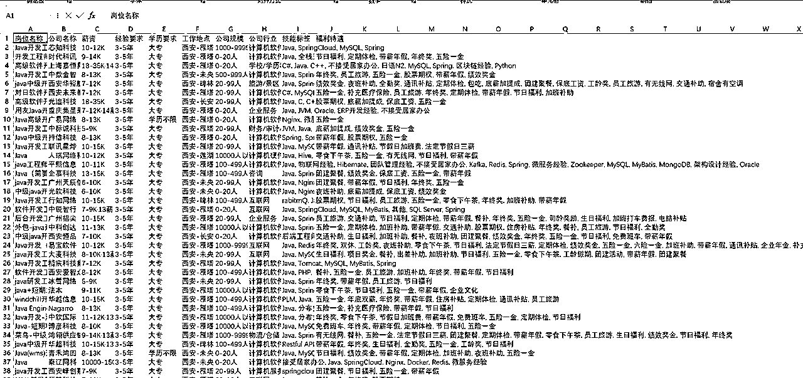

爬取文件如下：

我就想，随着AI时代的到来，真的就是把很多东西降低了门槛，让普通人也可以触碰到以前遥不可及的领域.

所以就有了今天这篇文章。

# AI爬虫核心就这五步，全程不需要你写一行代码：

1、明确爬取的目标网站以及自己想爬取的数据。

2、通过浏览器控制台，找到对应内容的数据。

3、根据数据所在的位置找到对应的数据信息。

4、把数据信息发送给AI。

5、运行AI代码，得到想要的数据。

# 下面我将一步一步手把手带你，爬取你想要得到的数据。

## 第一步：确定目标网站

我们以boss某聘网站为例，显然，左边的列表是咱们要爬取的信息。

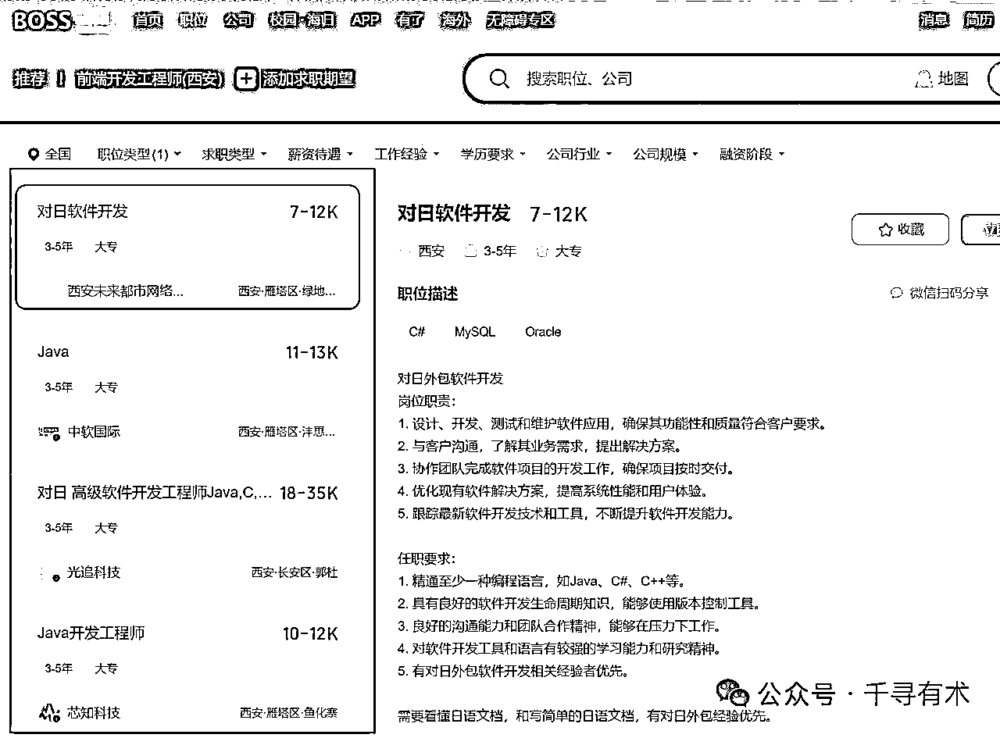

## 第二步：打开开发者控制台

有两种方式，

第一种是直接按键盘的F12，

第二种就是鼠标右键，选择【检查】。

这里以谷歌浏览器为例，成功的页面如下图，

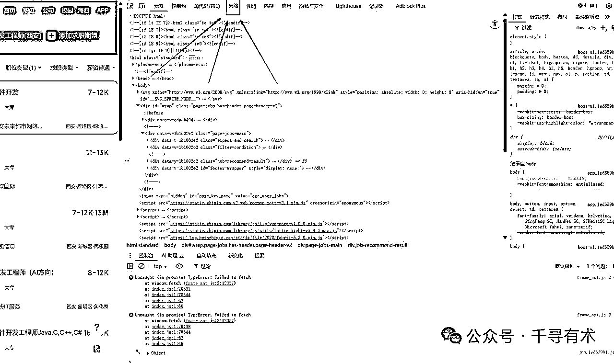

点击右侧最上面的【网络】选项卡，如果你的页面是英文的，那就是点击【Network】选项卡。

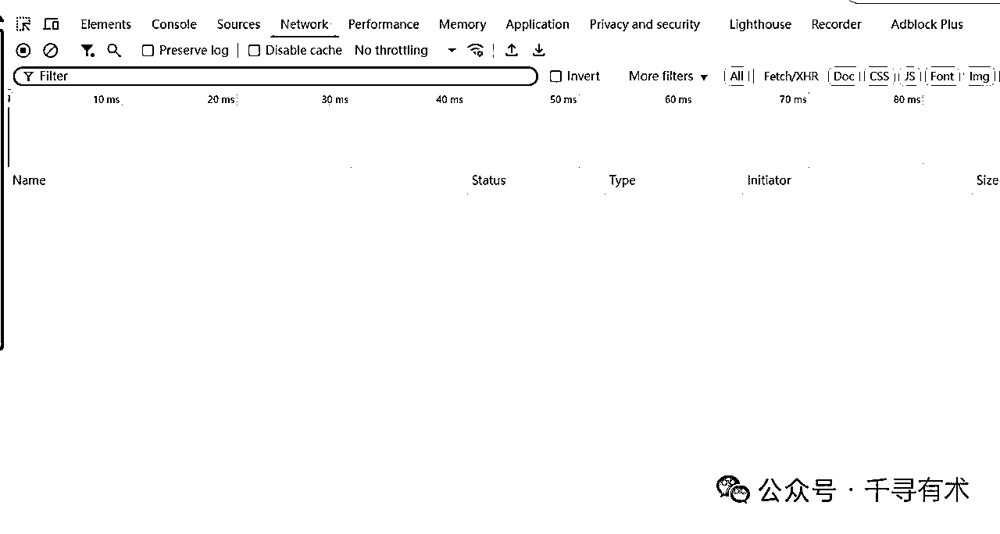

然后你会发现，咦，这怎么是空空的呢？是不是点错啦？不要怀疑，你没有错。

那是因为当你进入页面的时候，数据已经全部加载好了。

而控制台它的本质是在浏览器拿到数据的时候会把数据拦截暂存在这里。

那数据都传输完毕了，再拦截自然是只能看到空气咯。那么怎么办？

别慌，我要做的就是让数据继续流动，有两个办法：

（1）按F5刷新浏览器，直接所有数据都重新传输。

（2）滚动列表数据，获得更多数据的时候，也会继续传输新的数据。

这里我们用第二种办法，大家可以想想为什么？

我就把鼠标放在列表上，然后一直滚动鼠标滚轮，直到【Network】选项卡出现新的数据为止，如下图。

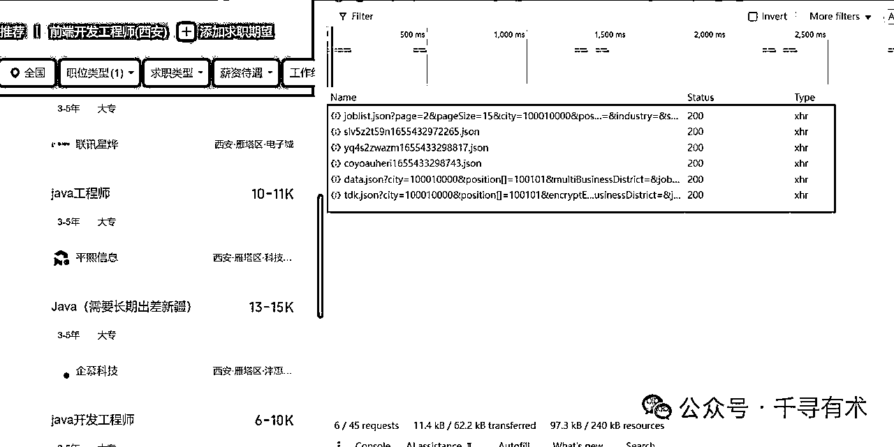

这个时候，上图红框里就是出现了我要想要的东西。

我们左侧显示的招聘信息，就在右侧的数据列表里。

这里英语好的朋友一看到jobList立马就猜到，第一个数据里就是我们要的岗位列表数据，于是，你点进去看了看，如下图。

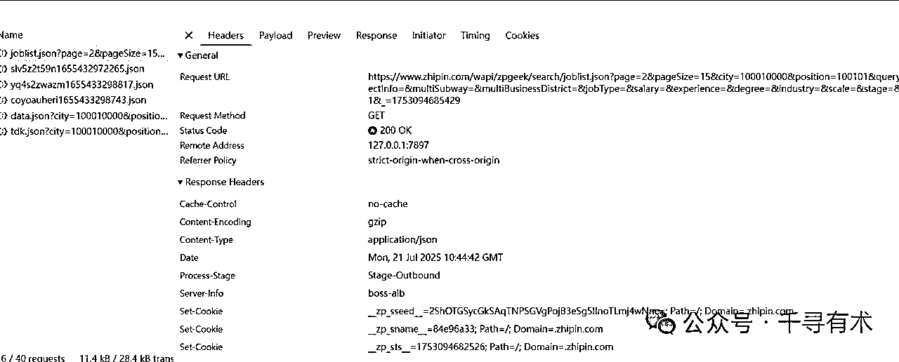

这里我介绍几个重要的选项卡，

第一个【Headers】：它是非常重要的东西，里面有请求地址、请求头、响应头。

那你可能会懵逼，这都什么鬼东西，不要着急，我来给你举个例子。

比如你是一个某拉拉司机，你在app上接了一单。

客户让你去【四川省乐山市市中区凌云路2435号】把乐山大佛，从四川拉到黑龙江。

那么上面的【乐山大佛地址】就是对应上面【Headers】里的Request URL。

## 第三步：整理数据信息

而【乐山大佛】就类似我们要的数据，所以这个Request URL路径是非常重要的东西。我们应该把它复制粘贴到你的小本本上，如下：

```
请求路径：https://www.zhipin.com/wapi/zpgeek/search/joblist.json
```

这里眼尖的同学应该发现了，我并没有全部复制，我把 ？和 ？后面的的全部删除了，如下

```
?page=2&pageSize=15&city=100010000&position=100101&query=&expectInfo=&multiSubway=&multiBusinessDistrict=&jobType=&salary=&experience=&degree=&industry=&scale=&stage=&scene=1&_=1753094685429
```

那这些东西又是什么呢？

还记得上面我的举的例子吧，我们是某拉拉司机，我们虽然到了那个地址，但是那里有很多的大佛呀。

比如尺寸有：5米的、3米的、50米的，

材质：有金的、银的、铜的、铁的，

颜色有：赤橙黄绿青蓝紫。

那你就要告诉接应你的人，你具体要拉哪一个大佛。

所以?后面的其实就是你抓取数据的条件，也是非常重要的。

只是我们不用这种写在路径后面的方式，因为它有专门的选项卡【Payload】, 如下图。

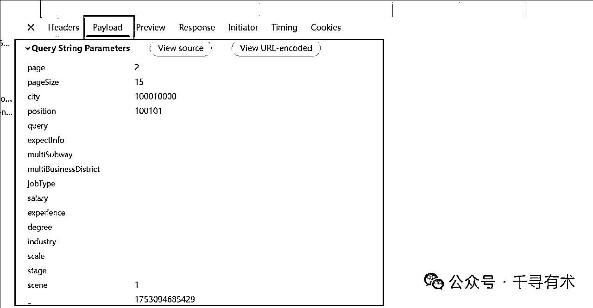

然后我们点击按钮【view source】，它就变成一行了，方便我们去复制它，并把它记在小本本上。

然后我们再回到第一个选项卡【Headers】，我们可以看到第二行是Request Method：GET。

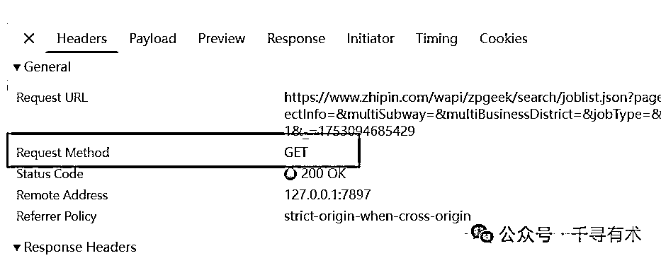

那这个东西是什么呢，它是一种请求的方式。

现在主流的请求方式一种就两种，一种是GET，还有一种就是POST。

这里不需要理解，直接把它记在你的小本本上就好了。

如果你每一步都跟得上，那么你的小本本应该是下面这样。

```
请求路径：https://www.zhipin.com/wapi/zpgeek/search/joblist.json
请求参数：page=2&pageSize=15&city=100010000&position=100101&query=&expectInfo=&multiSubway=&multiBusinessDistrict=&jobType=&salary=&experience=&degree=&industry=&scale=&stage=&scene=1&_=1753094685429
请求方式：GET
```

如果和我的一样，那说明你太棒了，一步都没有落下，如果不一样也没事，直接copy抄作业。

接下来，我们继续回到拉货，我们到了指定的地方是需要和接应的人对接。

那我们肯定得拿出能证明我们身份的东西，不可能谁都可以把货拉走，那就乱套了。

我们爬数据也是同理，也有能证明身份的东西，所以这里建议大家在爬之前最好登录下。

这样你就获得了身份证明，可以操作的权限就大了很多。

在代码中，身份证明都藏在了【Headers】的请求头里，如下图

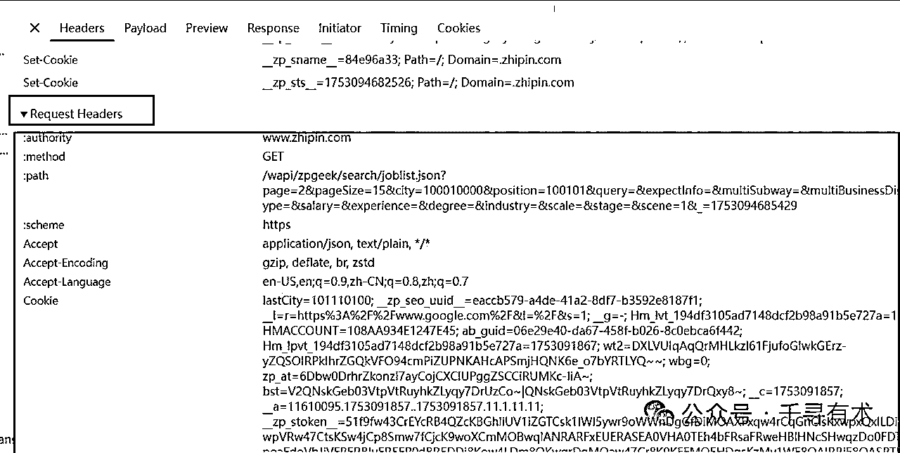

还是老规矩，我们把它存进小本本，然后同理，有请求头就有响应头。

响应头就可以理解成收货的人，我们不可能把货乱送，所以响应头我们也要存进小本本，如下图


这个时候你的小本本应该是下面这样：

```
请求路径：https://www.zhipin.com/wapi/zpgeek/search/joblist.json
请求参数：page=2&pageSize=15&city=100010000&position=100101&query=&expectInfo=&multiSubway=&multiBusinessDistrict=&jobType=&salary=&experience=&degree=&industry=&scale=&stage=&scene=1&_=1753094685429
请求方式：GET
请求头：:authoritywww.zhipin.com:methodGET:path/wapi/zpgeek/search/joblist.json?page=2&pageSize=15&city=100010000&position=100101&query=&expectInfo=&multiSubway=&multiBusinessDistrict=&jobType=&salary=&experience=&degree=&industry=&scale=&stage=&scene=1&_=1753094685429:schemehttpsacceptapplication/json, text/plain, */*accept-encodinggzip, deflate, br, zstdaccept-languageen-US,en;q=0.9,zh-CN;q=0.8,zh;q=0.7cookielastCity=101110100; __zp_seo_uuid__=eaccb579-a4de-41a2-8df7-b3592e8187f1; __l=r=https%3A%2F%2Fwww.google.com%2F&l=%2F&s=1; __g=-; Hm_lvt_194df3105ad7148dcf2b98a91b5e727a=1753091857; HMACCOUNT=108AA934E1247E45; ab_guid=06e29e40-da67-458f-b026-8c0ebca6f442; Hm_lpvt_194df3105ad7148dcf2b98a91b5e727a=1753091867; wt2=DXLVUIqAqQrMHLkzl61FjufoGIwkGErz-yZQSOIRPkIhrZGQkVFO94cmPiZUPNKAHcAPSmjHQNK6e_o7bYRTLYQ~~; wbg=0; zp_at=6Dbw0DrhrZkonzI7ayCojCXClUPggZSCCiRUMKc-IiA~; bst=V2QNskGeb03VtpVtRuyhkZLyqy7DrUzCo~|QNskGeb03VtpVtRuyhkZLyqy7DrQxy8~; __c=1753091857; __a=11610095.1753091857..1753091857.11.1.11.11; __zp_stoken__=51f9fw43CrEYcRB4QZcKBGhliUV1iZGTCsk1lWl5ywr9oWWnDgGfDiMOAXFxqw4rCqGnClsKxwpxQxILDiMKXwrLEicKjwpVRw47CtsKSw4jCp8Smw7fCjcK9woXCmMOBwqlANRARFxEUERASEA0VHA0TEh4bFRsaFRweHBlHNcSHwqzDo0FDTkE2W15cF1poaFdoVhJiVFRERBluER5EP0dBREDDj8Kow4LDm8OKwqrDgMOaw47Cr8K9KEFMQEHDgsKzMy1WE8OAIRRjE8OASRTDgcKsYsOUaMOHNT%2FCvcOuNT1Dw4TFg0xCJ05BQExAPUhAQjc9EMORb8OHOjrDgzMwRCFIQkBKR0BCQEhBTjZATDo2QkE0RRwSGB4YM0nCvcKvw4DDqkJApriorityu=1, irefererhttps://www.zhipin.com/web/geek/jobs?city=100010000&position=100101sec-ch-ua"Not)A;Brand";v="8", "Chromium";v="138", "Google Chrome";v="138"sec-ch-ua-mobile?0sec-ch-ua-platform"Windows"sec-fetch-destemptysec-fetch-modecorssec-fetch-sitesame-origintokenHhZ4dZjz0hc9QkmstraceidF-9602f5gsTRNOSJSEuser-agentMozilla/5.0 (Windows NT 10.0; Win64; x64) AppleWebKit/537.36 (KHTML, like Gecko) Chrome/138.0.0.0 Safari/537.36x-requested-withXMLHttpRequestzp_tokenV2QNskGeb03VtpVtRuyhkZLyqy7DrUzCo~|QNskGeb03VtpVtRuyhkZLyqy7DrQxy8~
响应头：cache-controlno-cachecontent-encodinggzipcontent-typeapplication/jsondateMon, 21 Jul 2025 10:44:42 GMTprocess-stageStage-Outboundserver-infoboss-albset-cookie__zp_sseed__=2ShOTGSycGkSAqTNPSGVgPojB3eSg5lInoTLmj4wNnc=; Path=/; Domain=.zhipin.comset-cookie__zp_sname__=84e96a33; Path=/; Domain=.zhipin.comset-cookie__zp_sts__=1753094682526; Path=/; Domain=.zhipin.com
```

请求头和响应头格式乱了没关系，因为我们是给ai看的。

最后我们差一个非常重要的数据，就是我们想爬的具体信息，我们要告诉AI。

我们要爬什么样的信息，然后这个信息的具体位置，也就是数据结构得告诉它。

我们点击第四个选项卡【Response】

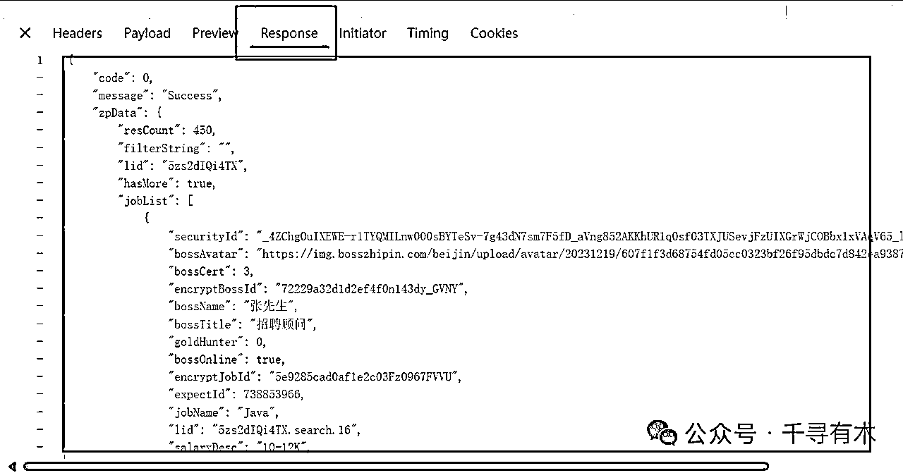

它就是我们最终需要的数据，当然并不是所有数据都需要，所以我只爬我们需要的数据。

这里我们举例，只抓取岗位名称、公司名称、薪资、发布日期这四个数据，那我们就要找到对应的信息，比如下图

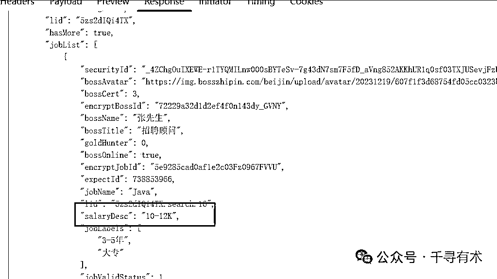

这个salaryDesc字段其实就是我们要的薪资信息，那我们就可以在小本本这样记录：

```
爬取数据字段：
薪资 ：在zpData下的joblist下的salaryDesc
```

这里的范围一定要从最最最外层的数据开始往里面写，直到我们想抓取的那个数据名称为止，如下图

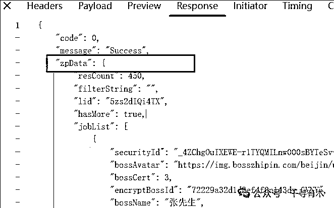

这里的最外层就是zpData，code和zpData是并列关系，salaryDesc是包含在zpData里面的，所以最外层是zpData。

同理我们把其他的数据位置也整理下，如果不确定字段的意思可以截图给AI看或者翻译。

最终经过我们的查找，我们的小本本记录如下：

```
爬取数据字段：
薪资 ：在zpData下的joblist下的salaryDesc
公司名：在zpData下的joblist下的brandName
岗位名称：在zpData下的joblist下的jobName
```

最后还缺一个信息就是完整数据的数据结构，我们直接从上到下复制，直到完整复制第一个岗位信息的数据，如下图：

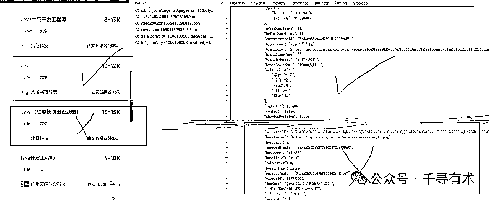

黄线以下就不要复制了，不确定的话可以和左侧的内容进行比对，这种列表基本上都是一个括号一段列表信息，最终的小本本如下。

```
请求路径：https://www.zhipin.com/wapi/zpgeek/search/joblist.json
请求参数：page=2&pageSize=15&city=100010000&position=100101&query=&expectInfo=&multiSubway=&multiBusinessDistrict=&jobType=&salary=&experience=&degree=&industry=&scale=&stage=&scene=1&_=1753094685429
请求方式：GET
请求头：:authoritywww.zhipin.com:methodGET:path/wapi/zpgeek/search/joblist.json?page=2&pageSize=15&city=100010000&position=100101&query=&expectInfo=&multiSubway=&multiBusinessDistrict=&jobType=&salary=&experience=&degree=&industry=&scale=&stage=&scene=1&_=1753094685429:schemehttpsacceptapplication/json, text/plain, */*accept-encodinggzip, deflate, br, zstdaccept-languageen-US,en;q=0.9,zh-CN;q=0.8,zh;q=0.7cookielastCity=101110100; __zp_seo_uuid__=eaccb579-a4de-41a2-8df7-b3592e8187f1; __l=r=https%3A%2F%2Fwww.google.com%2F&l=%2F&s=1; __g=-; Hm_lvt_194df3105ad7148dcf2b98a91b5e727a=1753091857; HMACCOUNT=108AA934E1247E45; ab_guid=06e29e40-da67-458f-b026-8c0ebca6f442; Hm_lpvt_194df3105ad7148dcf2b98a91b5e727a=1753091867; wt2=DXLVUIqAqQrMHLkzl61FjufoGIwkGErz-yZQSOIRPkIhrZGQkVFO94cmPiZUPNKAHcAPSmjHQNK6e_o7bYRTLYQ~~; wbg=0; zp_at=6Dbw0DrhrZkonzI7ayCojCXClUPggZSCCiRUMKc-IiA~; bst=V2QNskGeb03VtpVtRuyhkZLyqy7DrUzCo~|QNskGeb03VtpVtRuyhkZLyqy7DrQxy8~; __c=1753091857; __a=11610095.1753091857..1753091857.11.1.11.11; __zp_stoken__=51f9fw43CrEYcRB4QZcKBGhliUV1iZGTCsk1lWl5ywr9oWWnDgGfDiMOAXFxqw4rCqGnClsKxwpxQxILDiMKXwrLEicKjwpVRw47CtsKSw4jCp8Smw7fCjcK9woXCmMOBwqlANRARFxEUERASEA0VHA0TEh4bFRsaFRweHBlHNcSHwqzDo0FDTkE2W15cF1poaFdoVhJiVFRERBluER5EP0dBREDDj8Kow4LDm8OKwqrDgMOaw47Cr8K9KEFMQEHDgsKzMy1WE8OAIRRjE8OASRTDgcKsYsOUaMOHNT%2FCvcOuNT1Dw4TFg0xCJ05BQExAPUhAQjc9EMORb8OHOjrDgzMwRCFIQkBKR0BCQEhBTjZATDo2QkE0RRwSGB4YM0nCvcKvw4DDqkJApriorityu=1, irefererhttps://www.zhipin.com/web/geek/jobs?city=100010000&position=100101sec-ch-ua"Not)A;Brand";v="8", "Chromium";v="138", "Google Chrome";v="138"sec-ch-ua-mobile?0sec-ch-ua-platform"Windows"sec-fetch-destemptysec-fetch-modecorssec-fetch-sitesame-origintokenHhZ4dZjz0hc9QkmstraceidF-9602f5gsTRNOSJSEuser-agentMozilla/5.0 (Windows NT 10.0; Win64; x64) AppleWebKit/537.36 (KHTML, like Gecko) Chrome/138.0.0.0 Safari/537.36x-requested-withXMLHttpRequestzp_tokenV2QNskGeb03VtpVtRuyhkZLyqy7DrUzCo~|QNskGeb03VtpVtRuyhkZLyqy7DrQxy8~
响应头：cache-controlno-cachecontent-encodinggzipcontent-typeapplication/jsondateMon, 21 Jul 2025 10:44:42 GMTprocess-stageStage-Outboundserver-infoboss-albset-cookie__zp_sseed__=2ShOTGSycGkSAqTNPSGVgPojB3eSg5lInoTLmj4wNnc=; Path=/; Domain=.zhipin.comset-cookie__zp_sname__=84e96a33; Path=/; Domain=.zhipin.comset-cookie__zp_sts__=1753094682526; Path=/; Domain=.zhipin.com
爬取数据字段：
    薪资 ：在zpData下的joblist下的salaryDesc
    公司名：在zpData下的joblist下的brandName
    岗位名称：在zpData下的joblist下的jobName
完整数据结构：{    "code": 0,    "message": "Success",    "zpData": {        "resCount": 450,        "filterString": "",        "lid": "5zs2dIQi4TX",        "hasMore": true,        "jobList": [            {                "securityId": "_4ZChgOuIXEWE-r1TYQMILnw000sBYTeSv-7g43dN7sm7F5fD_aVng852AKKhUR1q0sf03TXJUSevjFzUIXGrWjCOBbx1xVAqV65_lStv7w1kJxlcaB4L_5zCfJ_xgeo1OplENQXh9sQGIehAZ76ii5fyZskYfw1tgVGvlGEEwpWoJJ8EQ~~",                "bossAvatar": "https://img.bosszhipin.com/beijin/upload/avatar/20231219/607f1f3d68754fd05cc0323bf26f95dbdc7d842ea93878ebb173fb84fcab09da89638bf4cb109d62_s.png.webp",                "bossCert": 3,                "encryptBossId": "72229a32d1d2ef4f0n143dy_GVNY",                "bossName": "张先生",                "bossTitle": "招聘顾问",                "goldHunter": 0,                "bossOnline": true,                "encryptJobId": "5e9285cad0af1e2c03Fz0967FVVU",                "expectId": 738853966,                "jobName": "Java",                "lid": "5zs2dIQi4TX.search.16",                "salaryDesc": "10-12K",                "jobLabels": [                    "3-5年",                    "大专"                ],                "jobValidStatus": 1,                "iconWord": "",                "skills": [                    "Java",                    "Hive",                    "SpringCloud",                    "Spark"                ],                "jobExperience": "3-5年",                "daysPerWeekDesc": "",                "leastMonthDesc": "",                "jobDegree": "大专",                "cityName": "西安",                "areaDistrict": "莲湖区",                "businessDistrict": "北关",                "jobType": 0,                "proxyJob": 0,                "proxyType": 0,                "anonymous": 0,                "outland": 0,                "optimal": 0,                "iconFlagList": [],                "itemId": 16,                "city": 101110100,                "isShield": 0,                "atsDirectPost": false,                "gps": {                    "longitude": 108.941379,                    "latitude": 34.280006                },                "afterNameIcons": [],                "beforeNameIcons": [],                "encryptBrandId": "3ed4c6834985d7501H17396-GFE~",                "brandName": "人瑞网络科技",                "brandLogo": "https://img.bosszhipin.com/beijin/icon/894ce6fa7e58d64d57e7f22d2f3a9d18afa7fcceaa24b8ea28f56f1bb14732c0.png",                "brandStageName": "",                "brandIndustry": "计算机硬件",                "brandScaleName": "10000人以上",                "welfareList": [                    "零食下午茶",                    "五险一金",                    "有无线网",                    "节日福利",                    "带薪年假"                ],                "industry": 101404,                "contact": false,                "showTopPosition": false            },
```

至此，你就完成了所有爬数据的准备工作了，接下来就是让ai写代码了。

当然了，上面的只是一种简单的情况，还有诸多复杂的情况。

比如路径动态、请求方式不是GET是POST或者PUT，参数有规律等等，复杂的情况就得去分析背后的规律。

因篇幅有限，暂时不讲太多。

## 第四步：把要求和数据信息发给AI

在小本本的最后，我们写上AI提示词，就是我们的具体要求，比如：

```
我想爬取招聘列表的岗位名、公司名、薪资信息，请根据以上数据信息，爬取列表的这三种数据，每个数据存到表格各一列。
```

然后你就可以把小本本上所有的内容都发给AI。

这里优先推荐用Cursor或者claude code , 其次是gpt ，最后是国产的一些ai软件。

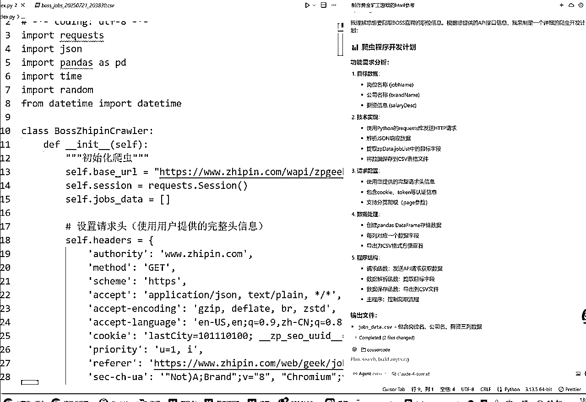

用Cursor不仅会给你写代码，甚至还会自己运行，这样你就直接拿到了数据表格。

用gpt 等等其他AI，虽然代码写出来了，但是还需要你手动复制到编辑器运行。

当然了，AI写的代码大概率是python代码，所以提前一定要把pyton环境装好，之后才能运行代码，不会装的可以关注我公众号的文章。

最后附上生成的代码，如果发现请求失败，可以检查下自己请求头的cookie是不是过期了，过期了则可以重新复制下请求头。

```
#!/usr/bin/env python3
# -*- coding: utf-8 -*-
import requests
import json
import pandas as pd
import time
import random
from datetime import datetime

class BossZhipinCrawler:
    def __init__(self):
        """初始化爬虫"""
        self.base_url = "https://www.zhipin.com/wapi/zpgeek/search/joblist.json"
        self.session = requests.Session()
        self.jobs_data = []

        # 设置请求头（使用用户提供的完整头信息）
        self.headers = {
            'authority': 'www.zhipin.com',
            'method': 'GET',
            'scheme': 'https',
            'accept': 'application/json, text/plain, */*',
            'accept-encoding': 'gzip, deflate, br, zstd',
            'accept-language': 'en-US,en;q=0.9,zh-CN;q=0.8,zh;q=0.7',
            'cookie': 'lastCity=101110100; __zp_seo_uuid__=eaccb579-a4de-41a2-8df7-b3592e8187f1; __l=r=https%3A%2F%2Fwww.google.com%2F&l=%2F&s=1; __g=-; Hm_lvt_194df3105ad7148dcf2b98a91b5e727a=1753091857; HMACCOUNT=108AA934E1247E45; ab_guid=06e29e40-da67-458f-b026-8c0ebca6f442; Hm_lpvt_194df3105ad7148dcf2b98a91b5e727a=1753091867; wt2=DXLVUIqAqQrMHLkzl61FjufoGIwkGErz-yZQSOIRPkIhrZGQkVFO94cmPiZUPNKAHcAPSmjHQNK6e_o7bYRTLYQ~~; wbg=0; zp_at=6Dbw0DrhrZkonzI7ayCojCXClUPggZSCCiRUMKc-IiA~; bst=V2QNskGeb03VtpVtRuyhkZLyqy7DrUzCo~|QNskGeb03VtpVtRuyhkZLyqy7DrQxy8~; __c=1753091857; __a=11610095.1753091857..1753091857.11.1.11.11; __zp_stoken__=51f9fw43CrEYcRB4QZcKBGhliUV1iZGTCsk1lWl5ywr9oWWnDgGfDiMOAXFxqw4rCqGnClsKxwpxQxILDiMKXwrLEicKjwpVRw47CtsKSw4jCp8Smw7fCjcK9woXCmMOBwqlANRARFxEUERASEA0VHA0TEh4bFRsaFRweHBlHNcSHwqzDo0FDTkE2W15cF1poaFdoVhJiVFRERBluER5EP0dBREDDj8Kow4LDm8OKwqrDgMOaw47Cr8K9KEFMQEHDgsKzMy1WE8OAIRRjE8OASRTDgcKsYsOUaMOHNT%2FCvcOuNT1Dw4TFg0xCJ05BQExAPUhAQjc9EMORb8OHOjrDgzMwRCFIQkBKR0BCQEhBTjZATDo2QkE0RRwSGB4YM0nCvcKvw4DDqkJA',
            'priority': 'u=1, i',
            'referer': 'https://www.zhipin.com/web/geek/jobs?city=100010000&position=100101',
            'sec-ch-ua': '"Not)A;Brand";v="8", "Chromium";v="138", "Google Chrome";v="138"',
            'sec-ch-ua-mobile': '?0',
            'sec-ch-ua-platform': '"Windows"',
            'sec-fetch-dest': 'empty',
            'sec-fetch-mode': 'cors',
            'sec-fetch-site': 'same-origin',
            'token': 'HhZ4dZjz0hc9Qkms',
            'traceid': 'F-9602f5gsTRNOSJSE',
            'user-agent': 'Mozilla/5.0 (Windows NT 10.0; Win64; x64) AppleWebKit/537.36 (KHTML, like Gecko) Chrome/138.0.0.0 Safari/537.36',
            'x-requested-with': 'XMLHttpRequest',
            'zp_token': 'V2QNskGeb03VtpVtRuyhkZLyqy7DrUzCo~|QNskGeb03VtpVtRuyhkZLyqy7DrQxy8~'
        }

        # 基础请求参数
        self.base_params = {
            'pageSize': '15',
            'city': '100010000',      # 北京
            'position': '100101',     # 技术岗位
            'query': '',
            'expectInfo': '',
            'multiSubway': '',
            'multiBusinessDistrict': '',
            'jobType': '',
            'salary': '',
            'experience': '',
            'degree': '',
            'industry': '',
            'scale': '',
            'stage': '',
            'scene': '1'
        }

        print("🚀 BOSS直聘职位信息爬虫初始化完成")
        print("=" * 50)

    def get_job_list(self, page=1):
        """
        获取指定页面的职位列表

        Args:
            page (int): 页码

        Returns:
            dict: API响应数据
        """
        params = self.base_params.copy()
        params['page'] = str(page)
        params['_'] = str(int(time.time() * 1000))  # 添加时间戳

        try:
            print(f"📡 正在获取第 {page} 页数据...")

            response = self.session.get(
                url=self.base_url,
                headers=self.headers,
                params=params,
                timeout=10
            )

            if response.status_code == 200:
                data = response.json()
                if data.get('code') == 0:
                    job_count = len(data.get('zpData', {}).get('jobList', []))
                    print(f"✅ 成功获取 {job_count} 条职位信息")
                    return data
                else:
                    print(f"❌ API返回错误: {data.get('message', '未知错误')}")
                    return None
            else:
                print(f"❌ 请求失败，状态码: {response.status_code}")
                return None

        except requests.RequestException as e:
            print(f"❌ 网络请求异常: {str(e)}")
            return None
        except json.JSONDecodeError as e:
            print(f"❌ JSON解析失败: {str(e)}")
            return None

    def parse_job_data(self, data):
        """
        解析职位数据，提取所需字段

        Args:
            data (dict): API响应数据

        Returns:
            list: 解析后的职位信息列表
        """
        if not data or 'zpData' not in data:
            return []

        job_list = data['zpData'].get('jobList', [])
        parsed_jobs = []

        for job in job_list:
            job_info = {
                '岗位名称': job.get('jobName', ''),
                '公司名称': job.get('brandName', ''),
                '薪资': job.get('salaryDesc', ''),
                '经验要求': job.get('jobExperience', ''),
                '学历要求': job.get('jobDegree', ''),
                '工作地点': f"{job.get('cityName', '')}-{job.get('areaDistrict', '')}-{job.get('businessDistrict', '')}",
                '公司规模': job.get('brandScaleName', ''),
                '公司行业': job.get('brandIndustry', ''),
                '技能标签': ', '.join(job.get('skills', [])),
                '福利待遇': ', '.join(job.get('welfareList', []))
            }
            parsed_jobs.append(job_info)

        return parsed_jobs

    def crawl_jobs(self, max_pages=5):
        """
        爬取多页职位信息

        Args:
            max_pages (int): 最大爬取页数
        """
        print(f"🎯 开始爬取职位信息，计划爬取 {max_pages} 页")
        print("-" * 50)

        for page in range(1, max_pages + 1):
            # 获取数据
            data = self.get_job_list(page)

            if data:
                # 解析数据
                jobs = self.parse_job_data(data)
                self.jobs_data.extend(jobs)

                print(f"📊 第 {page} 页解析完成，累计获取 {len(self.jobs_data)} 条数据")

                # 检查是否还有更多数据
                has_more = data.get('zpData', {}).get('hasMore', False)
                if not has_more:
                    print("ℹ️  已获取所有可用数据")
                    break
            else:
                print(f"⚠️  第 {page} 页数据获取失败，跳过")
                continue

            # 随机延时，避免请求过于频繁
            delay = random.uniform(1, 3)
            print(f"⏳ 等待 {delay:.1f} 秒后继续...")
            time.sleep(delay)

        print("-" * 50)
        print(f"🎉 爬取完成！总共获取 {len(self.jobs_data)} 条职位信息")

    def save_to_csv(self, filename=None):
        """
        保存数据到CSV文件

        Args:
            filename (str): 文件名，默认自动生成
        """
        if not self.jobs_data:
            print("❌ 没有数据可保存")
            return

        if filename is None:
            timestamp = datetime.now().strftime("%Y%m%d_%H%M%S")
            filename = f"boss_jobs_{timestamp}.csv"

        try:
            df = pd.DataFrame(self.jobs_data)
            df.to_csv(filename, index=False, encoding='utf-8-sig')
            print(f"💾 数据已保存到: {filename}")
            print(f"📈 文件包含 {len(df)} 行数据，{len(df.columns)} 列")

            # 显示数据预览
            print("\n📋 数据预览（前5行）:")
            print(df[['岗位名称', '公司名称', '薪资']].head().to_string(index=False))

        except Exception as e:
            print(f"❌ 保存文件失败: {str(e)}")

    def get_statistics(self):
        """获取数据统计信息"""
        if not self.jobs_data:
            print("❌ 没有数据可统计")
            return

        df = pd.DataFrame(self.jobs_data)

        print("\n📊 数据统计信息:")
        print("=" * 50)
        print(f"📝 总职位数量: {len(df)}")
        print(f"🏢 涉及公司数量: {df['公司名称'].nunique()}")
        print(f"💼 不同岗位类型: {df['岗位名称'].nunique()}")

        # 薪资统计
        print("\n💰 薪资分布 (Top 10):")
        salary_counts = df['薪资'].value_counts().head(10)
        for salary, count in salary_counts.items():
            print(f"  {salary}: {count} 个职位")

        # 公司统计
        print("\n🏢 热门公司 (Top 10):")
        company_counts = df['公司名称'].value_counts().head(10)
        for company, count in company_counts.items():
            print(f"  {company}: {count} 个职位")

        # 岗位统计
        print("\n💼 热门岗位 (Top 10):")
        job_counts = df['岗位名称'].value_counts().head(10)
        for job, count in job_counts.items():
            print(f"  {job}: {count} 个职位")

def main():
    """主函数"""
    print("🎯 BOSS直聘职位信息爬虫启动")
    print("=" * 60)

    # 创建爬虫实例
    crawler = BossZhipinCrawler()

    try:
        # 爬取职位信息（默认爬取5页）
        crawler.crawl_jobs(max_pages=5)

        # 显示统计信息
        crawler.get_statistics()

        # 保存到CSV文件
        crawler.save_to_csv()

        print("\n🎊 程序执行完成！")

    except KeyboardInterrupt:
        print("\n⚠️  用户中断程序执行")
    except Exception as e:
        print(f"\n❌ 程序执行出错: {str(e)}")

    print("\n👋 感谢使用BOSS直聘职位信息爬虫!")

if __name__ == "__main__":
    main()

```

# 最后，有任何建议都欢迎提出，有其他痛点或者需求也可以留言，眼过千遍不如动手一遍，一定要动手尝试你才能真正掌握，AI爬虫的奇妙之处。