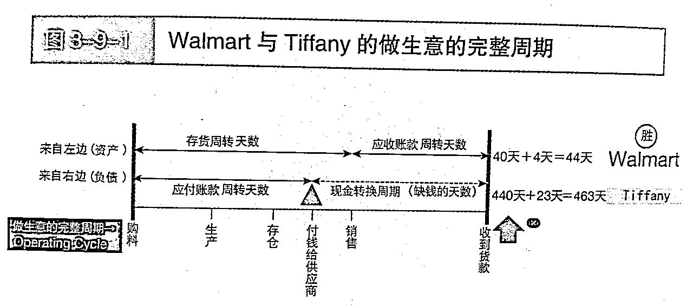

# 跨境新手看利润，投资人却看这几个关键指标

> 来源：[https://igk43cq0a6.feishu.cn/docx/VspqdkwF4orU0Mxrlm8cjTKDnne](https://igk43cq0a6.feishu.cn/docx/VspqdkwF4orU0Mxrlm8cjTKDnne)

10多年前上过一堂北大总裁班，老师不讲管理，讲了一个挺玄的概念“吉财和凶财”，

所谓“凶财”，就是这种钱入了你袋，会带来厄运。

现在有了些理解：有些利润，会吸干现金流。有些爆款，会拖垮业务。

前两天，@七天@生财有术 让我来分享一下，个体或小团队跨境卖家普遍面临的一个核心痛点：很多人不知道“现金流”其实比赚钱本身更重要。 结果往往是一旦遇到爆单，业务反而被拖垮了。

据说，98%的纯TikTok卖家都是亏损的，其中一个重要原因就是不会算账。即使去除了人工、水电、推广费等成本，虽然表面上订单量很大，但最后还是亏本。

而在亚马逊平台上，很多卖家虽然学会了算账，账面有利润，但公司依然因现金撑不下去。这是因为亚马逊的财务并不只是“营收-成本=利润”这么简单，还涉及到时间因素。比如，海运物流周期超过一个月，更容易导致账算错，本质上是现金流和库存周转的问题。

很幸运的是，我在自己做投资的时候学到了一些财务知识，所以一开始就避开了这个大坑。但我相信，90%的亚马逊个体卖家其实并没有考虑过“现金流”。

本文谈谈：

一、为什么利润很高，公司却倒闭了？

二、年赚100万，需要投入多少？

三、好营收和坏营收

四、如何AI解决这个问题

* * *

# 一、利润很高，公司却倒闭了？

对于许多小团队或刚起步的卖家来说，财务知识几乎是一片空白。他们最常犯的错误，就是把利润和现金流混为一谈。

### 月赚3万的餐馆老板老王 vs 月赚1万5的早餐摊主小李

在我们小区门口，有两个做餐饮的邻居，他们的故事完美诠释了什么叫“账面富贵”，什么叫“手里有钱”。

### 主角一：餐馆老板老王

老王经营着一家装修体面、菜品精致的中档餐馆。

*   账面利润： 每月营业额20万元，扣除12万元食材成本、3万元员工工资、2万元房租水电，账面月净利润高达3万元。朋友们都很羡慕，觉得他生意红火、收入可观。

*   现金流困境： 但实际上，老王却常常为资金发愁，甚至夜不能寐。为什么？

1.  大量企业客户挂账： 为了提升营业额，老王接了很多公司团建和商务宴请。这些企业客户基本都是签单挂账，“月底结”甚至“季度结”。所以20万元营业额中，有15万元其实是“应收账款”，只是纸面上的数字，不是账户里的现金。

1.  刚性现金支出： 房租每月1号就要支付，员工工资每月15号必须发放，供应商货款很多还要求现结或一周一结，拖不得。

*   结果就是： 账面上老王每月净赚3万，但实际现金流持续流出（付房租、工资、货款），现金流入却很有限（只有散客的即时付款），大部分收入都在“等待回款”。

*   老王经常为下周的货款四处筹钱，典型的“有利润，没现金”。生意越大，资金缺口越大，每天都如履薄冰。

### 主角二：早餐摊主小李

小李则在小区门口摆摊，卖豆浆、油条和煎饼果子。

*   账面利润： 一天流水约1500元，一个月营业额4.5万元，扣除成本后，月净利润约1.5万元，只有老王的一半。

*   现金流充裕： 但小李每天都睡得很香，毫无压力。原因很简单：

1.  100%现结： 没有人买早餐还打欠条，他每卖出一份早餐，钱立刻进了自己的口袋。营业额就是现金收入。

1.  极短周转周期： 今天收到的钱，明天就能用来进新鲜原料。资金周转周期只有24小时，用今天赚的钱支撑明天的生意。

*   结果就是： 虽然账面利润不如老王高，但小李的现金流非常健康，每天都有稳定的现金流入，扣掉成本后，账户余额稳步增长。

*   小李是典型的“现金流为王”，口袋里始终有钱，心态安稳，生意也做得踏实。

这个对比非常直观地说明了：利润只是账面的静态数字，现金流才是企业的生命线。 有利润但没现金，企业随时可能倒闭；而现金流健康，即使利润不高，生意也能长久稳定地做下去。

# 二、 年赚100万，需要投入多少？

## 库存：沉睡的现金与增长的引擎

“想在亚马逊年赚100万净利润，你需要投入多少库存资金？” 这个问题考验的是卖家对资本效率的理解。它并非一个简单的估算，而是由你的利润率和库存周转率共同决定的。

我们以一个严谨的模型来测算：假设你的产品拥有15%的净利润率，其中货物成本占销售额的30%。要实现100万的年净利润，你需要做到约670万元的年销售额。

这意味，你一年需要采购并售出总成本约为200万元（670万 × 30%）的货物。

这里的核心变量是库存周转率——即你的货物从采购入库到最终售出，一年能循环几次。在亚马逊，一年周转4-6次是相对健康的水平。

*   如果你的库存一年周转4次（即平均3个月卖完一批货）：你需要常备的平均库存资金为 50万元（200万年销售成本 / 4次）。

*   如果你运营效率极高，一年周转6次（即平均2个月卖完一批货）：你需要常备的平均库存资金为 33万元（200万年销售成本 / 6次）。

因此，要实现百万利润目标，你的生意里时刻都有33万至50万元的现金，以“货物”的形态沉睡在世界各地的仓库里和运输途中。这部分资金虽然是资产，但流动性极差。

更现实的挑战是应对“爆单”。如果你某个产品突然热销，为了抓住机会并覆盖“生产+运输”的漫长补货周期，你可能需要瞬间拿出2-3倍于平均库存的备货资金。这意味着，在50万库存的基础上，你可能需要立刻再投入50-100万现金去下单备货。

反之，如果产品滞销，这几十万的库存不仅占用了宝贵的现金流，还将持续产生仓储费，并面临跌价、清货甚至报废的风险，最终侵蚀你的利润。

## 广告：7倍烧钱的“吞金兽”

对于追求增长的卖家来说，广告是不可回避的“吞金兽”。广告的投入是即时的，每天花了多少钱、带来了多少曝光和转化，其实都可以实时监控和分析。但即便如此，广告投入和实际利润之间仍然存在时间差：

*   你今天投出去的广告费会立刻从账户扣除，广告带来的订单和销售数据也能很快看到，但现金回款却要等产品真正售出、平台结算到账后才能实现。

*   如果广告策略不精准，带来的不仅是曝光，还有可能是“无效点击”或低利润订单，导致广告费投入产出比失衡。

很多人喜欢做跨境电商，是因为看中了“1:7”的汇率差。但不要忘了，**广告投放同样是按美元计价，相当于“7倍烧钱”。**如果产品本身没有利润，广告花出去的每一美元，都会变成7倍的人民币成本，亏损也会被同步放大。

## 回款周期：资金流转的时间差

跨境电商的最大挑战之一，就是资金流转周期长。通常一笔资金的完整流转过程包括：

*   生产周期（15-30天）： 支付定金，安排生产；

*   物流周期（10-40天）： 支付尾款，发货运输；

*   入仓及销售周期（7-30天）： 上架FBA，等待销售；

*   平台账期（14-30天）： 销售完成后，等待平台回款。

整个流程通常需要2-4个月，具体时间会因产品、物流方式和平台政策不同而有所变化。这意味着，你1月份投入的资金，可能要到4月份才能回笼。而在这期间，2月、3月的货款、工资、广告费等支出仍需持续支付。随着业务规模扩大，这种“时间差”带来的资金缺口和压力也会越来越大。

参考图：《用生活常识就能看懂财务报表》

# 三、好营收和坏营收

以前投资，会看一家公司的财报，盈利只是表象，背面也有粉好营收和坏营收。

著名投资人霍华德·马克斯有个”第二层思维“方法论

*   第一层思维看“营收”，认为它是结果，是成功。

*   第二层思维看“营收的质量”，认为它只是一个表象，需要深入探究其背后的利润结构、现金流健康度和增长的可持续性。

核心问题是：“这个增长的代价是什么？它的质量如何？它能持续吗？”

基于这个核心问题，我初步分为“坏的营收增长”和“好的营收增长”。

## 什么是“坏的营收增长”？

“坏营增”看似风光，实则暗藏危机，常见特征包括：

1.  无利润的增长

*   只看销售额增长，忽视利润率。为冲高营收，牺牲毛利，或营销费用激增，导致卖得越多反而越亏。

1.  现金流紧张的增长

*   营收虽高，但实际可用现金持续减少。由于跨境电商资金回流慢，营收扩张往往意味着更多资金被库存、账期锁定，现金链条越拉越长，容易陷入“账面赚钱、实际没钱”的困局。

1.  脆弱的增长

*   过度依赖单一产品、渠道或流量红利。一旦市场风向变化、竞品入场、流量成本上升，增长瞬间坍塌，毫无抗风险能力。

1.  运营失衡的增长

*   前端销售冲得快，后端供应链、仓储、客服、售后等环节未同步提升，导致服务质量下降、差评增多，反噬品牌与平台权重。

## 什么是“好的营收增长”？

“好营增”意味着每一分增长都建立在扎实、健康的基础之上，具有以下特征：

1.  有利润的增长

*   营收增长同时，毛利率保持稳定或提升。健康的单位经济模型（LTV远大于CAC），每一单都是真正的盈利，而非“烧钱换规模”。

1.  现金流健康的增长

*   经营性现金流为正，库存周转快，现金循环周期短。即使业务扩张，依然能“自我造血”，不被资金链拖垮。

1.  有壁垒的增长

*   增长依托于品牌、产品创新、专利技术或强供应链等护城河，而非单纯依赖流量或低价。业务结构多元，抗风险能力强。

1.  可扩展的运营能力

*   随着销售增长，团队、供应链、系统能力同步提升，通过规模效应优化成本，保障服务体验，实现良性循环。

# 四、如何算账：你的专属AI财务分析师

上面都是理论，具体如何做呢？以前我是直接去啃“财务书的”。

但现在我们可以借助AI，轻松完成

下面是一个亚马逊卖家可以参考的“AI算账指令”。

你不需懂复杂的财务公式，花5分钟时间，填入一些数据，然后把整个指令复制给任何一个主流的AI助手（如ChatGPT、Gemini、豆包、deepseek等），就可以深度诊断报告。

操作步骤：

1.  复制下方灰色框内的全部文本。

1.  将 [ ] 中的示例数据，替换成你自己的真实数据。

1.  将修改后的完整内容，粘贴到AI对话框中，发送即可。

1.  后续有问题，可以继续对话。

* * *

你好，我是一位亚马逊卖家。请你扮演一位精通亚马逊运营、财务分析和现金流管理的专家顾问。我的目标是全面理解我一款核心产品的真实盈利能力和现金流健康状况，而不仅仅是看表面的利润。

请根据我下方提供的【输入数据】，为我生成一份详细的财务诊断报告。

输入数据 (请在此处填入你的产品数据)

【第一部分：基础信息】

*   产品名称/SKU： [例如：新款蓝色瑜伽垫-001]

*   销售站点： [例如：美国站]

*   当前售价 (美元): [例如：$29.99]

【第二部分：单位成本 (单个产品)】

*   产品采购成本 (人民币): [例如：￥35]

*   头程物流成本 (人民币): [例如：￥12]

*   平台佣金率 (%): [例如：15%]

*   FBA配送费 (美元): [例如：$5.8]

*   关税/VAT等税费率 (% of 售价): [例如：0% 或 10%]

*   其他可变成本 (如包装、贴标等, 人民币): [例如：￥1.5]

【第三部分：运营与周转 (估算周期)】

*   月均销量 (件): [例如：500件]

*   平均生产周期 (天): [从下达订单并支付定金，到生产完成的天数，例如：20天]

*   平均物流周期 (天): [从支付尾款发货，到FBA仓库上架可售的天数，例如：30天]

*   平均库存销售周期 (天): [这批货从上架到基本售完的天数，例如：60天]

*   平台回款周期 (天): [销售完成后，资金到达收款账户的平均天数，例如：14天]

【第四部分：固定开销 (月度)】

*   月度广告总花费 (美元): [例如：$1500]

*   月度固定成本 (如软件费、仓储费、人工等, 人民币): [例如：￥5000]

*   当前美元对人民币汇率: [例如：7.2]

分析与输出要求

请严格按照以下结构和要求，为我生成报告：

1.  【静态利润分析 (The Old Way)】

*   单位毛利润： 计算单个产品在扣除所有可变成本后的利润（以人民币计）。

*   单位净利润： 在毛利润基础上，再摊分月度固定开销（广告、固定成本）到每个产品上，计算最终的单位净利润（以人民币计）。

*   核心利润率： 计算毛利率、净利率。

*   月度总净利润： 计算该产品每月的总净利润（以人民币计）。

1.  【动态现金流分析 (The Smart Way)】

*   计算总现金周转周期： 生产周期 + 物流周期 + 库存销售周期 + 平台回款周期。并解读这个周期的长短意味着什么。

*   计算单批备货的资金占用： 假设一次备货满足一个“库存销售周期”的量，计算这批货需要占用的总采购成本是多少（以人民币计）。

*   计算维持运营的“蓄水池”需要多大： 估算要支撑一个完整的现金周转周期，你需要准备多少倍于“单批备货”的资金，才能保证业务不断货、可持续。

1.  【综合诊断与风险预警】

*   营收质量评估： 结合静态利润和动态现金流的分析，明确判断我当前的营收属于“好营收”还是“坏营收”。

*   好营收特征： 有利润的增长、现金流健康的增长。

*   坏营收特征： 无利润的增长、现金流紧张的增长。

*   点明核心风险： 用最直白的语言，指出我当前运营模式下最大的1-2个财务风险点。（例如：现金周转周期过长，利润无法覆盖资金成本；广告投入侵蚀了大部分利润等）。

*   提出优化建议： 给出3条具体、可执行的建议，帮助我改善现状，将“坏营收”转变为“好营收”。

请用清晰、易懂的语言呈现报告，多用比喻，就像在给一位急需帮助的卖家朋友提供咨询。

跨境生意，算账绝不是简单的“利润=销售额-成本”。

庆幸的是，我在入行跨境时就有一定财务认知，但太多新手只盯着爆单，却忽略了资金周转的现实压力。

“利润让你看起来很富有，现金流才决定你能不能活下去。”

希望能带给大家一点启发。