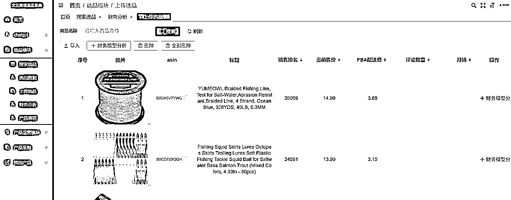

# 亚马逊的六大核心难点问题和对应解决方案

> 来源：[https://ocne68gryflo.feishu.cn/docx/VtJIdKOJUo4iV9xEAUkcZbwIn3f](https://ocne68gryflo.feishu.cn/docx/VtJIdKOJUo4iV9xEAUkcZbwIn3f)

大家好，我是张子卿，97年计算机出身。

我是疫情后开始做亚马逊的，

最开始是做传统的B2B外贸阿里国际站，当时在一个国企下面的子公司做外贸总监管理15-20人的团队。

后面出来自己创业选择B2C领域，最开始是做独立网站，搜索引擎优化和外链建设相关，有做到过小类目的头部，当时月利润大概2-3w左右，做的是中国直邮美国留学生代购的生意，因为选赛道比较擅长，SEO中文内容比较快的到了首页第一位。

后来转到B2C的亚马逊领域创业（因为发现这个市场前景更好），从0到1自己开设店铺，大概持续了5年多的时间，目前在杭州GMV大概在200w美金左右，团队刚刚发展到5-6个人，有4个店铺目前。

我有做过一个100w美金的实盘记录，在微信公众号：张子卿。以及一些日常的企业管理思考心得分享。

下面我说一下我做亚马逊遇到的一些核心难点问题和解决方案，以及当下正在遇到的问题和解决策略思考。

# 一.选品

选品其实是每个亚马逊卖家伴随终身的问题，这不是一朝一夕能解决的问题，也不是一招鲜吃遍天的事情。

根据自己的能力多次尝试，通过实践得出自己适合做哪个方向是最好的。

就像我最开始的思路是做冷门的高客单大件货，后来变成做一些优势供应链产品，最后我们目前做的是轻小件的赛道。

我对选品的核心理解就是，找到适合自己的生存空间的问题。

要足够理解自己能做什么，不能做什么的能力圈。

大公司适合做的不一定适合小卖家做，不同运营能力的公司自然能做的类目也不一样。

最开始我们都希望做搜索量高，短期上升速度快的爆品，后面发现这类产品其实生命周期短，竞争激烈，对手强大还时常有很多法律风险问题，最关键的就是没有复利效益，就算侥幸做起来了，短暂的辉煌过后，面对日益激烈的竞争和越来越低的利润，难以维系。

现在我们通过多年的经验教训和反思，总结了一套适合我自己公司的选品模型，我称之为Stop doing list，然后配合每月对亚马逊平台的数据采集和处理，进行选品，主要是做一些轻小件，ROI高，周转速度快的产品。

（自研的选品系统，本质就是一个数据收集筛选二次处理器，市面上卖家精灵，keepa，helium10都有相似的功能可以替代）

选品的话，我想重点聊聊我们的Stop doing list这个东西。

即，我们看重一个赛道的核心三要素：

1.满足我们的盈利模型，即ROI大于2，且生命周期较长，搜索量问题（好生意的逻辑）

2.市场竞争格局还没有固化，即还有生态位留给我们去做（生态位的逻辑）

3.消费者还有显著痛点没有被满足，即还能做出一个有竞争力优势的链接

在这个基础上，我们进一步缩小范围到了，非泛词，节日类产品，搜索量不稳定的赛道，cpc过高的赛道。

这个其实就是我们经过测试和划分，得到的自己的能力圈范围，我们只做自己能力圈范围内的产品和链接。

在综合我们当下，文案，图片，视频，运营能力，选赛道和做产品，供应链，物流等因素下得出的一个范围，比如我们的综合分数是75分，那么我们就选择对手平均分75分以下的竞争赛道。

通过我们的系统or市面上的选品软件，找到符合我们能力圈的产品，解决选赛道的问题。

同时进一步取样，详细调研后，得出是否可以做出一个有竞争力的链接，在决定是否投产去做。

随着公司进一步能力的提升和优化，我们的能力圈范围扩大，我们可以做的产品也会变得越来越多，这是一个动态的过程，所以选品是我们一直需要关注和解决的问题。

# 二.现金流问题

对于精品卖家来说，生意越好，其实就是越危险。备那么多货在美国本土，亚马逊又有很多侵权恶搞和黑科技手段。

包括一些TRO和召回，比如加州65号法案，美国DOE能源部条例等等这些不确定因素。

其实我们亚马逊卖家的反脆弱性是很差的，尤其是单一链接销售额特别大的白帽卖家。没有那么多店铺去做跟卖授权，所有资金都在一条链接或者单一店铺里，一旦旺季被恶搞一次损失就非常大。

以我亲身经历举例，ICE BATH这款产品，当时我们售价是129.99美金，在旺季备了几十万元的库存，结果在会员日当天被恶搞，产品滞销最后只能39.99清仓去解决。

包括之前我们有款融蜡灯类产品，在圣诞季的时候被亚马逊二审封店，等解封后已经过了圣诞季节，也是面临清仓大幅度亏损的问题。

这里还有一个实际投资回报率的问题，那就是我们开售测算的ROI和实际不符。

比如一款ROI为2的产品，那么按理说可以达到年化1200%

实际上是，我们需要压3倍左右的资金进去。海上一批，仓库一批，还一批在工厂投产。

这样实际的资金周转速度往往只有3分之一，在不考虑账期等问题的前提下，实际上也不应该考虑这些，任何账期都是要还的，本质没多大区别。

所以一个看似非常不错的年化1200%的项目，实际上亚马逊卖家的平均年化基本上在300-500%。

也就是你今年有100w本金，做的好的话年底算上库存，可能有300-500w本金。

这和我们早期测算上大打折扣了。

总而言之，几乎大部分精品卖家有或多或少有现金流问题，和反脆弱性极差的问题。

我目前解决方案就是做可以空运的轻小件，把周转速度提升起来，ROI变高，

即把一个年gmv100w美金的链接，拆分成20-30条，日销100美金的链接。

这样我一条链接被下架，还有20条在售，ROI和速度都提高了。

目前表现还不错，当然这样也有问题，那就是速度慢，需要的人力精力更多。

这里就看个人的发展阶段了，我们目前是自己培养产品经理的，先做小件，小件做的好了在慢慢往精品高客单方向去发展。有一个相互综合比如一个店铺有20条日销100美金的小链接，2-3条日销1000美金以上的大链接。

其实解决现金流和反脆弱性差的问题，就需要从源头商业模式上去做修改，要么多店铺，要么多链接，要么多平台。同时抓住周转速度和真实的单位时间投资回报率在选赛道的时候去优化。

# 三.商业模式标准化，SOP化的问题

对于我们这样白帽卖家以产品为驱动的模式，都非常吃那个核心的产品经理，比如开模，产品差异化，市场调研，供应链管理等。就像一家大酒楼，客人都是冲着那个大厨来的，但是大厨无法批量化复制，培养一个好的产品经理是很难的，有这个能力的员工也基本上都有创业的想法。

那么在企业进一步发展的时候，SOP化和标准化就卡在了这里。

我们的解决方法是，不做特别难的产品，不做特别考验做菜功底的事情。只是把简单的小事做好，可能就是一个产品的基本功，找到那些更弱，更小的赛道去深耕，找到大公司不愿做，小公司做不了的赛道，做消费者需求的满足。类似做预制菜的逻辑，连锁加盟的方式。

同时我们公司是产品运营一体化，因为我们的产品难度低，所以不需要特别的运营手法，所以就没那么考验厨师的功底。大部分产品都是拿平台的现货修修改改，做做包装，增加下配件，人效上会更高一些，其实也就是做更简单的事情，把一个复杂的事情拆分成20个简单的事情做好。

同时我们的产品经理，只负责提出需求和改进，文案，图片，视频，包装设计，都是和其他专业团队合作，去做，用飞书去做企业管理和配合。

从项目立项，采购，文案，图片，物流，补货等都做了相应的SOP和模板教程。

目的就是让一个相对聪明的大学生，通过1个月的简单学习和几个月的练习，可以做好这件事。

# 四.人才培养招聘和优秀人才留任问题

吸引人才和留下人才在我看来是两个方面能力的考量。

人才招聘，是个伪命题，好的人才基本上都比较难通过社招得到。所以我们主要还是靠简化自身的商业模型，降低上手难度。从0到1的去培养和筛选，建立一个培训体系，从文章到实操视频。

我们目前是直接校招大三的学生，以实习生的方式来我们公司实习学习我们录制好的培训课程，然后做一些简单的低客单轻小件产品，6个月后表现好且价值观相符的留下转正。是筛选的逻辑。

人才留任的话，我们基本上还是从3个方面去解决。

从用户需求的角度出发，来我们企业工作的大学生基本上有3个核心需求：

1.好的薪资待遇（高于市面上平均水平）

2.好的工作环境和工作氛围（企业文化不恶心，工作氛围好，福利待遇不错）

3.好的职业发展前景和适当的挑战（从事的行业有前景，自身的能力和薪资都在水涨船高，且有适当的挑战不是一成不变的）

好的薪资待遇这方面，我们基本上给到15k以上在杭州这边，前提是通过我们前期六个月以上的实习筛选。

好的工作环境和工作氛围，主要在于构建企业文化方面。

好的职业发展前景和适当的挑战，就需要HR或者部门主管根据每个人的进展，及时做出工作调整和待遇提升。

绩效考核方面，我们还在摸索中，目前是小团队，以每年两次，年中，年终的形式考核，以周报的形式查看每个人的进度。

# 五.运营体系化问题

之前我们的精铺轻小件的运营非常简单，就是上架开3组自动广告，根据推荐竞价慢慢去做调整。

今年新品推广的难度变得更高了，对卖家全方位的要求也更高好。我们过去简单的运营和广告打法变得不是很有效果了，现在正摸索一套全新的适合低客单轻小件的推广和运营打法，希望做到每个产品都可以按照一套标准的运营推广流程，根据数据反馈做出对应调整，让每个运营都能简单的上手和判断一个产品是否可以进入正反馈。

这块我们目前在尝试，形成一套全新的从0到1的轻小件运营和推广打法。目前还在多方面学习和测试中，比较简单的就是如下图的一个架构。

# 六.系统化提升问题和解决方案

同时如果解决广告问题后，我们打算继续解决的是系统化提升问题。

也就是优化，图片，文案，视频，选品，运营，供应链，产品设计，产品调研等各个模块。

包括但不限于，持续的去找到更好的资源，学习到更好的手法，做精做细，把亚马逊这门生意模块化成十几二十个环节，然后每个环节每次追求提升5%,整体下来每月有进步就行。

每个环节提升百分之5看似不多，但是最终做到没有短板，且每个环节都比同行优秀一点点，整体就会比同行提升很多。

这种系统化的思维方式，一点点的做优化才是一个跨境企业的核心内功，也是别人学不来的地方，长此以往也就成了护城河。

其实本质上这里不妨认真思考一个问题,对于亚马逊这个平台来说到底什么才是你链接的护城河？

是你的产品本身吗？还是你的客单价？其实都不是

没有不会被模仿的产品,商业就是充满竞争的。

一个产品出来,只要被发现,在义乌一个月就做出来同款。

所以不要想着没有人和你做相同的产品,只需要想着怎么做过别人就好。

天下的产品没有不被抄的其实，关键还是要做好自己的东西，文案 内容 图片 视频 关键词 供应链 产品把控等等 这种内功是没办法轻易模仿的。

在产品相同的情况下，电商平台的产品壁垒/护城河，可以从评论数量，链接质量，关键词位置，首发优势等去考虑。

找到生态位和格局还没有确定下来的赛道。找到大公司们看不上的角落去深耕。

把事情作对就是正心正念,一步一个脚印的做好链接积累评论。

剩下的请交给时间。请交给相信的力量。

在创业路上相信的力量一直是最重要的事情。

最后希望我的文章可以给同行路上的朋友参考和帮助。

May the force be with you！