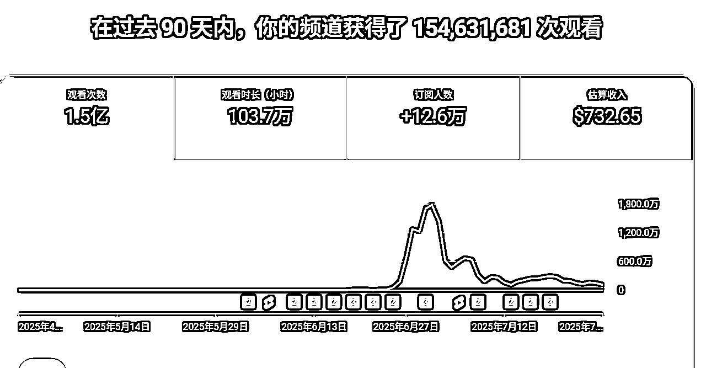
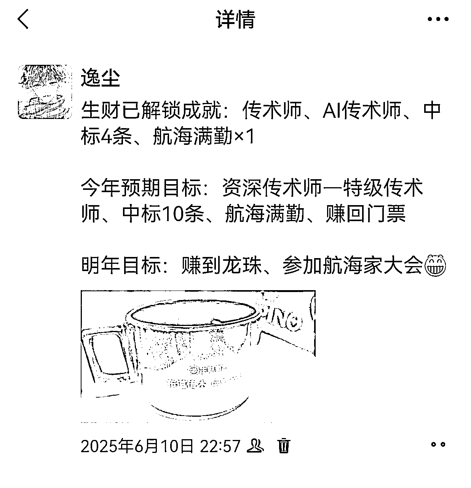

# 我是如何从一看生财就焦虑，2个月内实现Youtube1.5亿播放量，赚回“2倍”门票？

> 来源：[https://bcn5ot9wwnew.feishu.cn/docx/UpI5dW6x2oG4qex8HDKc2482nbg](https://bcn5ot9wwnew.feishu.cn/docx/UpI5dW6x2oG4qex8HDKc2482nbg)

Hello，大家好，我是逸尘，不知名06少年。五个月前，我只是一个普普通通的法学生，五个月后，成功赚回了两张门票。但实际上我认为生财带给我的价值远远不止两倍门票，用万倍价值来形容亦不能表达我的感激之情。昨天去杭州生财总部参观的时候，和七天姐聊了很多，启发很大，遂来复盘一下我五个月以来的一些经历和思考

本文分为以下大致框架：

1.我与生财的故事——结识五月赚回两倍门票？

2.如何利用生财——以自己为参照，海纳百川后再ALL IN ONLY

3.我一直在路上，纵使前路荆棘丛生，我无所畏惧

4.揆诸当下，展望未来——理性剖析长期和短期事业，复利和成长并行

# 一、我与生财的故事——结识五月赚回两倍门票？

# （一）缘起

首先，给大家讲一讲我与生财的故事，免得大家直接看理论觉得有点无聊hh。

其实，在上大学的前一个暑假，我天天打游戏，然后要开学的前几天，发现我对游戏提不起一点兴趣了，于是就萌生了去大学赚钱的想法，开学后就去网上报了一个课，很“幸运”的是我交了差不多七千块钱吧，第一次知识付费就遇到灰产被割韭菜了。之后我不信邪，又去报了个剪辑课，又很“幸运”得被割韭菜了（B站上就能找到），但是，我没有放弃过赚钱的欲望。皇天不负有心人，今年二月份寒假的时候，我在一个付费社群里面偶然听到别人谈论生财，于是我进入了生财的体验营，生财里面的课程和帖子的干货程度以及航海的完美机制感觉就像给我这种初入社会的小白量身定做，毫不犹豫地付费三千块钱加入了生财

# （二）焦虑期

在刚开始刷生财的帖子的时候，铺天盖地的陌生信息向我涌来，什么SEO、什么CPS、CPA、什么私域公域、什么外链内链、转销、招商、从0-1……应试教育的不足之处体现的淋漓尽致，带给了我进入社会之前一道巨大的鸿沟。在连续刷了两天之后，我感觉自己快要被知识的海洋淹没掉了，我大口大口喘气，却得不到一点缓解。于是，我连续一到两周，直到第二学期开学都没有打开过生财。

# （三）转机

可能是老天爷不想让我就此堕落，就推了我一把——三月份生财的航海来了。我对比了一圈航海的项目，发现其实对于一个小白，没有一个项目是“适合”的，最终在“Web网站”“天花板极高”的诱惑之下，选择了这一个项目All IN，这期间我被航海的快节奏推动着向前走，每一天都认真地完成了复盘笔记，结合航海手册以及询问教练、查询往期相关帖子的的方法，对上站的流程比较熟悉了，航海期间也成功地上了四五个站，看着google search console的一点点流量，内心还是很高兴的

# （四）迷茫期

但是，做了web网站一两个月之后，我发现这其实是一个“大坑”，想要做出一个web网站并上线是十分容易的，但是想要通过web网站从0-1赚到第一笔金，其实是一件巨难无比的事情，因为这里不仅涉及到编程，更涉及到找需求、SEO优化、加外链、社交平台营销……涉及到的知识面之广，目前为止，我觉得是最顶的一个项目，我一个小白当时一来就给自己上了一个天花板难度的项目hh。所以，我陷入了迷茫期，我在羡慕别人能从生财快速从0-1的同时，加深了对自己的怀疑，也看不清楚未来的方向

# （五）转折点

尽管加入生财100天了，我仍然没有拿到实质性的结果，但是帖子我基本天天刷，知识星球成为了我每天打开时间最多的APP，在其中汲取了各行各业，尤其是关于AI的大量知识。第二次航海来了，这次，我精挑细选，最终决定在YouTube项目上ALL IN——美元的吸引力确实大。这一次，我在第二十一个作品的时候，一举突破8000w的播放量，开通高级YPP，然后在接下来的二十几天我发布了十条左右的视频（因为有很多更重要的事情耽误了），已经赚了七百多刀

# （六）知识付费收益

偶然小红书刷到一个法学生的群，我就加进去玩了玩，发表了自己一些观点，然后吸引来了一些有相同感触的人，她给我进行了知识付费，同时也加入了生财。没有生财，就没有我现在的世界观、人生观、价值观，自然也不能吸引这些有着“不一样”特质的朋友。

以上，是我与生财的简短故事，也是“两倍”门票的来源，以上故事只是为了激发阅读兴趣，细节部分请移步下文。

# 二、如何利用生财——以自己为参照，海纳百川后再ALL IN ONLY

# （一）以自己为参照——做对自己有正反馈的事

每个人的基础、天资、学习能力、学习习惯等都是不同的，有的人喜欢赚取短期红利，有的人更愿意细水长流。所以，每个人都不必以他人为参照，只需要遵循本心，跟随自己最舒适的节奏，每天相对于自己有所提升——提升的标准是强迫自己写有内容的日思录，就可以了。一味焦虑别人的进步，对自己不会有丝毫提升，多做对自己有正反馈的事情，刷一个小时帖子、跟着航海手册实操一遍等等，都是可以自行决定的，觉得快了就慢点，觉得慢了就快点。

# （二）AI＋每天十分钟风向标——最快融入生财的方式，没有之一

生财的知识体系十分庞大，想要吃透不知道猴年马月。想要快速融入生财，达到每一篇帖子能看懂七七八八的程度，最快的捷径就是使用豆包插件+每天阅读十分钟风向标

豆包插件使用方法以前我讲过，这里直接放帖子原文了：

风向标涵盖了各个行业领域，能快速触达各行业最前沿的信息，里面也会涉及到较多的专业术语，这时候再使用豆包插件辅助理解，那么就能快速掌握各行业的专业术语（SOP等），之后再阅读其他帖子基本上就是畅通无阻

# （三）公认领袖+同龄榜样+专业高手

## 1公认领袖——道

像亦仁老大、涛哥、刘小排老师这样的大佬就是大家公认的领袖人物，也是生财的灵魂人物。它们不会只提供专精的“术”，而是提供更容易让所有人承认接受的“道”，再汲取了大量的“道”的理论之后，就会对商业领域有一个比较系统全面的认知，之后再填充“术”的时候就更加容易了。

## 2.同龄榜样——路

同龄的榜样，对我来说，就是00后的大佬们，比如说小鹅老师，她在生财从0-1的路是广为人知的，那么，只要仔细研究她的每一篇文章，那么对于我来说，就是可以复制的路，她的思想、她的核心品质，都是值得我学习的。我们是同龄，只要她能从生财完全地从0-1，那么只要复刻她在生财的路，我就一定可以成功。（这个路不是完全一模一样，而是宏观上一样）

## 3.专业高手——术

再汲取了各行各业大量的知识后，肯定需要选择某一个项目进行ALL IN深耕，那么一旦选定了项目之后，就需要去研习这个赛道的每一篇帖子（每一篇！！！），至少，我在做YouTube项目之前把YouTube所有的帖子看了一遍并做了笔记，也同时输出风向标（七条风向标中标三条）。这样做了之后，对整个赛道就有了比较详尽的了解，之后做项目时就不会像无头苍蝇一样，而是能做到有的放矢，精准打击，快速迭代。

# （四）扬帆起航——快速迭代+人脉共振

基础知识俱备，只欠东风——航海。

参加了航海，就是奔着实现变现MVP的目标去的，就需要在二十一天这样一个限制的紧迫的时间内推动着你去成长，去迭代，最终“迫使”你拿到结果。每天的生财日记都是对自己的一次深刻反思，从而知晓第二天应该如何去更好地迭代，这对自身的成长也是一个催化剂的作用。

航海群也是一个不可忽视的重要助力，里面的教练和志愿者，都可能掌握一些本赛道专业的不被他人知晓的“秘诀”，多和他们打好关系（说话礼貌），就能收获你想象不到的价值。同时，你也能建立本赛道的人脉网络，从而在遇到难题时能找到合适的人帮你解决问题。

注意：千万只能报名一个航海，所有的精力往一处使，ALL IN ONLY，更大可能拿到结果。一心二用，终得反噬。

# （五）积极Social——线下为主，线上为辅

一个人或许能走很快，但一群人能走更远。

一个人埋头苦干效率或许更高，但是也有更大的可能陷入死循环的无底黑洞，导致负面情绪叠加最终项目失败。所以，当你觉得累了或者思路被限制的时候，不妨去参加一下生财的线下聚会，让各行各业的生财人帮你出出谋划策，说不定问题就迎刃而解了。再不济，多认识几个朋友，之后如果有相关领域的困难的时候，也可以找到合适的朋友帮忙。

线上社交和线下社交比起来，我更推荐线下社交，为什么？

好的资源、高效的沟通和高信任的连接，永远永远只可能存在于线下，线上不可能也绝不可能有这个效果。

# （六）设定预期目标——以明确的结果反促落实的行动

将自己的目标落实到具体的层次，越具体越好。比如，我希望与哪一天之前实现什么样的价值、什么样的变现目标。这样有了具体的结果，那么就会促进相应的具体行动的落实。以结果为导向，增添动力。

给大家晒一下我六月份的朋友圈，今年的目标资深传术师已经实现，准备冲击一下特级传术师；中标10条，现在还是4条，最近懈怠了，努努力；航海满勤，两次航海，都是满勤，之后也必须满勤；赚回门票，已经实现了；我感觉明年的目标也快要在今年实现了。所以，这个方法是真的有用的

# 三、我一直在路上，纵使前路荆棘丛生，我无所畏惧

## （一）以自我为本，明确生财相对自己的工具地位

很多人，刚加入生财，几个月或者一两年赚不到钱，就出去骂生财割韭菜。我总结一下这类人的特质：觉得生财能帮他们发财或者成长他们救命的稻草。我觉得此言实际不假，但要看怎么“帮”——如果想让生财官方直接给你一个又轻松又赚钱的项目，我觉得你是在做梦；如果是结合我上述说的方法降低ego，一步步提升自己，那么这个梦我觉得完全可以实现。

生财只是成长路上的一个非常得力的工具——信息源、思想精华、人脉圈，想让生财发挥最大的工具作用，取决于“人”到底怎么样，一个成功的人，他是有很多类似生财这样的工具，但是最核心的还是他自己的思想、执行力、人脉圈。想清楚这一点，或许会对你有良多帮助

## （二）积极展示自我——建立自己的影响力

### 1.E人与I人的切换其实只在一念之间

我觉得自己是个I人，但最近的一次测试，测出我是ENTJ，看了看理由，我觉得确实挺符合我最近的表现，但是我仍然认为我是一个I人——在我陌生的领域，实力悬殊的大佬面前，我仍然是沉默的那类人，但是我至少已经做到在自己熟悉的领域能娓娓道来，不惧表达自己的思考。

我的目标是“被看见”，所以我会强迫我自己去表达，去输出，去切换成E人，因为只有这样敢于输出，别人才可能会感受到你的价值，从而产生更多的可能

### 2.别说“不”，永远只说“可以”

如果有一个大佬告诉你，让你去做一件你这辈子没做过的事情，你愿意去做吗？

以前的我：算了大佬，我不太行。

现在的我：可以可以，谢谢大佬给机会。

变化是什么呢？

1）所有的东西都是从不会到会，只要原意学，就能学会

2）在短时间内学会一种技能，本身就是对自己的挑战，只要是对我成长有利的事情，我来者不拒

3）让大佬看见，多一次抱大腿的机会。如果你原来没有这项技能，答应的时候云淡风轻、信心满满，短时间内出色完成，大佬会怎么看你？

再讲个故事，我在加入全国最大法律科技社区后，社区的CEO让我做个AI的分享，我当时就直接答应了下来，本身我很害怕直播的（哪怕是个语音直播），但是真到了讲起来的时候，我觉得我太猛了，然后几个红圈所的大佬就加了我，让我提前认识到了本不该属于我这个阶段能够认识到的大佬

### 3.多多向上社交，建立良性朋友圈

“向上”不是让你一个劲地结识大佬，而是这个人在某一方面有强过你的能力，那么，如果能和他建立联系（建议线下），那么你就能学到这个领域的技能，从而促进自己的发展。比如说，我本身不会编程，但是vibe coding的时代已经来临了，这是一个未来的趋势，我现在想要系统学习编程但又不想用传统的耗费大量精力试错的学习方式，那么我就去找了既会vibe coding又本身会coding的专业高手学习，从而有了一个明确的学习系统，从而减少盲目学习的焦虑感。

同时，你把自己的专业的知识与他们互补，在极致的利他主义原则上，就能建立比较深厚的关系，那么以后不管是玩还是工作，说不定都会大有益处。

## （三）事物两面性——我更愿意只看积极的一面

生活中总有不如意的事情，比如，我被割韭菜了，现在我只会觉得那是我成长的阶梯，是让我不再踩坑的宝贵经验；与某人关系闹僵，我会想是这个人本身的问题还是我外在表现形式有问题，如果是这个人的问题，那么有了这次的经验，下次就不会再和同样地人结交；如果是自身的问题，那么就反思自己哪里做的不够好，从而优化自己的行为

我做web网站的反思亦是如此，没有web网站积累的vibe coding以及大量的基础知识，那么就不可能在Youtube项目降维打击，快速拿到结果。

所以，只要看到好的一面，汲取里面的精华内容，让自己成长，远比认为这是一次失败更为重要。

## （四）极致的反思，小步快速地迭代

### （一）具体——聚焦的项目

我在做YouTube赛道的时候，每天都在迭代，有时候小迭代，有时候大迭代，但是我永远在思考我与顶尖视频的差距，然后不断去缩小差距，直至超越他们，超越之后，再汲取百家之长，总结成自己的SOP。

### （二）宏观——思考自己的战略方向

YouTube shorts对我来说只是基石，我可以用它来沉淀我自己的能力，但是不能终身依靠它（具体看后文）。生财里面的项目千千万，超级标都有十条，那么总有一些超级标是十分吸引人的，但这并不意味着你见一个爱一个，抛掉西瓜去捡芝麻。相信自己的基本盘，稳定之后，再腾出多余的精力去捣鼓其他项目，才更为妥当，要从宏观上规划，而不是被短期红利冲昏头脑

# 四、揆诸当下，展望未来——理性剖析长期和短期事业，复利和成长并行

## （一）YouTube赛道是否还有红利，适合哪些朋友入局

我已经在YouTube赛道从0-1赚到美金，那么我来解决一些正在观望YouTube赛道的朋友的一些问题：

### 1.YouTube超级标从去年就发布了，现在还有红利吗

红利一直有，就看你如何理解红利，不要说YouTube，就连抖音、小红书这种广为人知的平台，都在细分领域赛道有极大的红利，就看有没有一双智慧的眼睛

### 2.YouTube赛道最适合哪些人

1）懂英语，会英语，在国外待过

2）熟悉AI生图、AI生视频、AI生音频、剪辑工具以及一些其他AI工具

3）有毅力，有恒心，不妄想一朝发大财

4）擅长剖析自己的不足，采纳别人的建议

5）有过海外平台运营经验

以上只是“最适合”，普通人也可以，只是难度系数大

### 3.YouTube Shorts VS YouTube中长视频

如果只是做AI赛道，建议做shorts，容易爆，YPP开通周期短，难度低

如果是做真人口播赛道，建议做中长视频，长期IP打造，走英文受众面更广，AI自媒体比较好，RPM比shorts高，但是难度高、周期长

整体比较：shorts对普通人更友好，如果原意真人IP扎根YouTube几年甚至数十年可以走中长视频；AI类只建议shorts。（仅个人建议）

## （二）短期红利与长期复利——我奋斗的方向

我对YouTube shorts赛道对我自身成长的定义仅仅是一个台阶，我可以从中汲取一些海外平台运营经验，但是绝对不能止步于此，扎根其中。

为什么？

1.YouTube AI shorts绝对是以时间换红利的一个阶段，未来必定更加内卷，而且AI 赛道极难构建个人IP，难以形成复利。而复利是我追求的目标，所以必然不能长期于此。

2.我现阶段单个视频基本上属于吃老本阶段，没有任何进步空间了，接下来几天会认真思考将其工作流化，如果可以，就能极大程度上解放我的生产力，然后投身到对我成长更有帮助的事业当中（这可能是我的YouTube系列的高级篇）；如果不行，就保持几天一更的频率就好

3.比起YouTube shorts，我更看好海外产品。这次我去参加Adventure X（中国最大黑客松），再加上生财内部给我的强烈信号，我认识到——必须学英语，必须学编程，未来做产品才是一件能够复利的事情。而且我很享受创造的感觉，我很感谢我的队友，让我第一次参加这么大型的黑客松就能拿到飞书多维表格赛道的最佳创意奖。我们的项目也即将商业化，我也会投入到运营当中，很期待未来的奋斗。

时代在发展，AI时代更是瞬息万变，但是一切只是形式在变化，真正的核心：写作、演讲、创造、销售、运营……这些是洗尽铅华而不衰的，我所有的成长都会围绕这些来进行，刨除其余的杂质部分，在培养这些核心能力的同时终生学习，就能跨越平台，跨越周期，甚至能成为设计游戏的人。

以上都是一些微不足道的碎碎念，大家图个乐就好。小弟素来，闻过则喜，接受所有批评与指导！