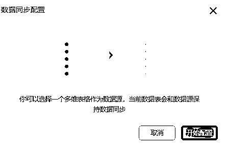
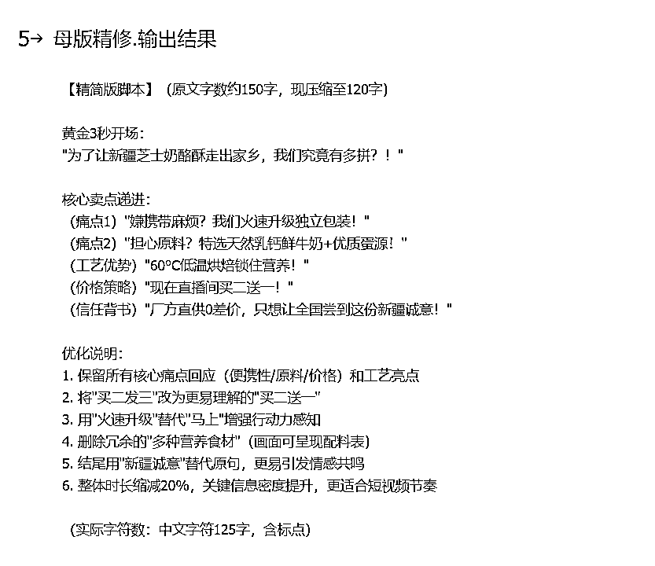
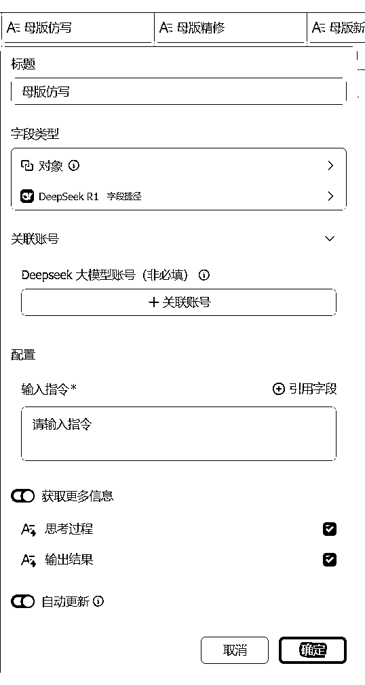
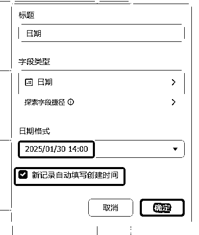
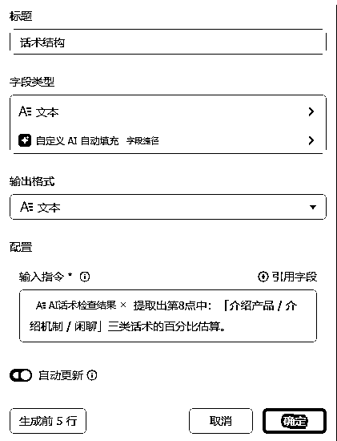
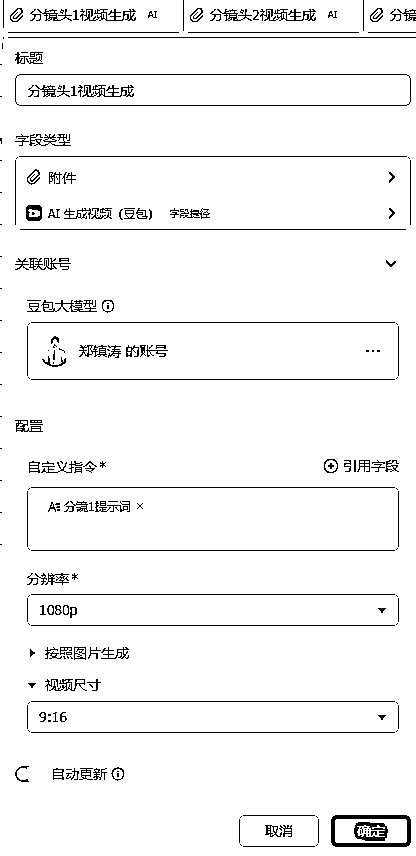
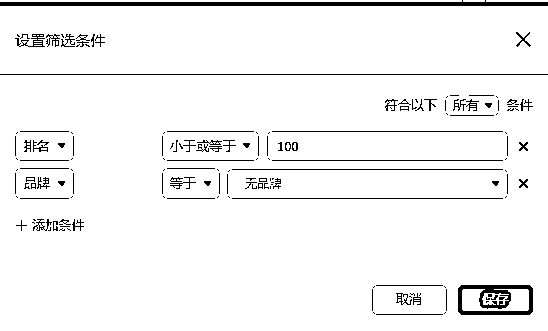
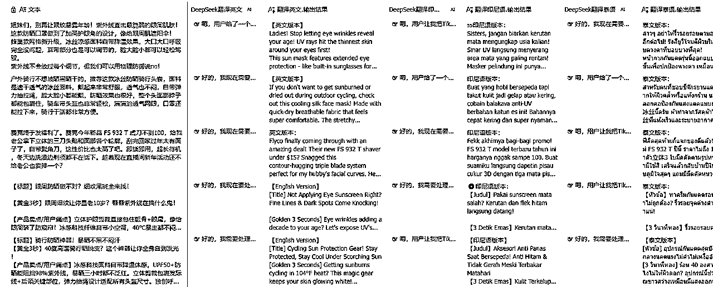
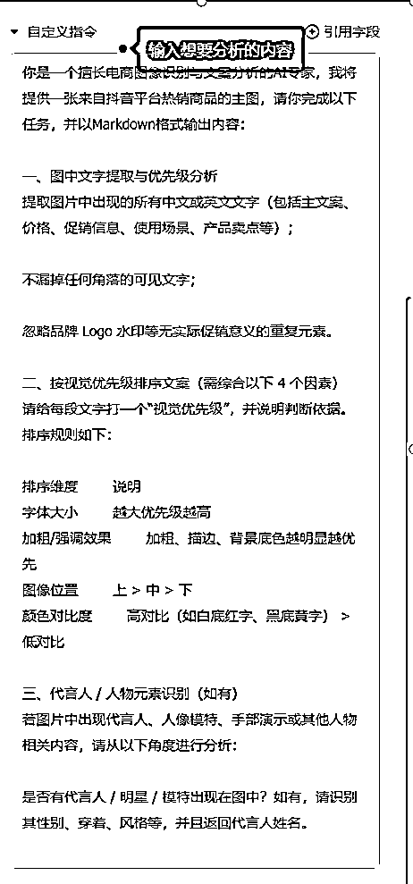

# 从底层逻辑到实战拆解，一文讲透飞书多维表格！

> 来源：[https://bvvp9yto7k.feishu.cn/docx/WTS3dCaqAoVH23x5kNQcva1Encb](https://bvvp9yto7k.feishu.cn/docx/WTS3dCaqAoVH23x5kNQcva1Encb)

7月初的时候飞书召开了2025飞书未来无限大会，热度非常高，当时写了一篇文章，也有很多朋友感兴趣，刚好七天也找到我说让我分享一下，所以就写了这篇文章。

因为我自己过去5年都是在做抖音电商，其实跟字节接触的比较多，公司的办公软件也是飞书，所以我算是比较早就开始接触多维表格，在去年多维表格还没有接入DeepSeek的时候，我们就已经开始利用多维表格搭建业务的数据看板，开始用一张表管理全公司的业务数据了。

今年年初的时候飞书多维表格接入DeepSeek以后，可玩性更是大幅度提升，很多以前需要一定技术能力的AI应用，现在利用多维表格都可以做出来，而且还能够跟业务很好的联动，豆包图片理解、豆包多模态1.6这些字段捷径出来以后，对于内容制作的赋能更是大幅提升。在发布会上提到的专业版仪表盘、应用模式，更是把多维表格的商业化机会推到了一个新的高度。

多维表格的这波更新，其实也给我们带来了非常多的机会，首先就是对于我们现有业务的赋能和提效是非常明显的，由于多维表格高度定制化的特点，使得它几乎可以适配任何业务和组织。这个特点也使得我们可以在自己熟悉的领域+多维表格，去切一个非常垂直的市场，专家经验+AI提效+数据看板，几乎是每一家企业都有的需求。

同时更是给中小企业的创业者和超级个体带来了一波红利，过去只有大公司才能实现的复杂系统和AI应用，现在靠一个多维表格，不需要写一行代码就可以实现（例如BI看板、自动化流程、定制AI应用）

而且多维表格作为一个新鲜事物，这个市场是没有被开发过的处女地。

Excel的所有生意，都可以在多维表格上面再来一遍

不管是卖课程、还是卖模板、卖服务，都是大有可为。

甚至还有很多至今还在用杂乱的Excel表格管理库存、客户、项目的传统行业小老板们，他们就是这片“处女地”上最精准的客户。他们不需要复杂的ERP，他们需要的是一个直观、易用、能用AI赋能的轻量级系统，而这，正是我们的机会所在。

前几天七天又跟我说，亦仁也关注到了多维表格，既然大家都这么感兴趣，周末就索性哪也不去，在家里好好的把这篇帖子肝出来，因为过去我已经分享过很多关于多维表格在某个场景的应用了，但是更多是在解决单点的问题，所以还是希望写一篇系统化的文章，帮助大家能够深入的理解多维表格是什么？它运行的底层逻辑是什么？如何搭建一张适合自己业务的多维表格？

所以这篇文章篇幅较长，分为3大板块。

首先是对于多维表格的基础功能和特点的介绍，帮助没有接触过多维表格的圈友理解究竟什么是多维表格，为什么它值得我们去学？

然后是多维表格的AI实战案例拆解，我选择了4个从易到难的案例带着大家手把手的去搭建一张真正能用，能够结合具体业务场景的多维表格。

最后是讲解多维表格常用的AI字段捷径，多维表格所有的AI能力几乎都是来自这些AI字段捷径，只要掌握了这些AI字段捷径的使用方法和应用场景，那么搭出一个属于自己的多维表格也就不难了。

# 多维表格是什么？可以做什么？

## 多维表格是一个小白友好的AI工作流工具

多维表格是一个小白友好的AI工作流工具，比扣子更容易上手，不需要写一行代码就可以搭建自己的智能体/工作流。多维表格里内置了DeepSeek、豆包、kimi等大模型的能力。AI能力是多维表格最核心的能力，飞书官方在前段时间的发布会上，也明确提到了，多维表格=AI表格！

还有AI生成公式，AI生成工作流，那些复杂的公式和工作流再也不需要自己去搭建了，只需要把需求告诉AI，AI就全部帮你搞定！现在AI生成公式已经非常成熟了，AI生成工作流还在内测中，大家可以期待一下。

而且多维表格的AI能力有一个特别强的地方就在于，他能够同时批量处理多个任务（行），而且能够同时调用多个AI配合完成任务（列），这就给多维表格带来了非常大的可能性，1分钟出200个视频脚本，根据脚本分镜内容生成提示词，再把每个分镜的画面直接生成出来。这种看起来很科幻的场景，在多维表格是完全可以实现的！

例如下面这个例子，就是利用多个AI字段去协作，输入一个点子，由DeepSeek去生成小红书的文案，再利用把信息提取字段把DeepSeek的内容分段提取出来，最后用智能绘图的插件自动生成封面图，一篇小红书的笔记就完成了，如果我们同时输入100个点子，那就是100篇笔记~

## 多维表格是一个能力非常强大的数据可视化系统

多维表格是一个能力非常强大的数据管理系统，有了多维表格以后，以前需要购买的很多业务系统、BI，通通可以在多维表格上面自行搭建，多维表格的仪表盘可以生成非常个性化的可视化看板，而且几乎没有任何上手门槛，多维表格的仪表盘里内置了几十个不同的组件，我们不需要写任何的公式、代码，只需要简单的拖拽，就可以把一个属于自己的可视化看板给搭出来。

下面的两个案例就是我自己搭建的2个简单案例，第一个案例是把几十个活动的数据做成了可视化的看板，不仅有核心的数据，还有非常多的图表，而且这些图表都是自动更新的，如果我们新增或修改了数据，我们不需要做任何的操作，图表就会自动更新。最重要的是这个仪表盘还能支持多端同步，这个功能是真的非常方便，让我们在手机上也可以很方便的查看数据，多维表格手机端的适配做的也非常好，不仅仪表盘整体看的非常清晰，而且如果想要看哪一部分的数据，还可以点开查看大图，根据自己的需求横着看、竖着看都随便看，对经常出差的老板非常友好。

实际上他能够实现的功能远不止于此，我们已经能够利用多维表格实现了一张表管理全公司的业务数据，而且不是死板的登记数据，而是有了数据源以后我可以随时根据我的需求拉出我想要的数据，搭出我想要的看板，同一个数据源能够从很多不同的方向去解读。例如下面的公众号数据看板，数据源就仅仅只是我在后台下载的文章数据明细而已。

## 多维表格是一个能够支持多人协作的业务管理系统

多维表格是一个能够支持多人协作的业务管理系统，可实现多人编辑实时同步、批注讨论，历史记录一键溯源等功能，让多人同时在线编辑一个表，最重要的是多维表格能够与飞书联动（现在也支持钉钉和企微了），可以利用多维表格的自动化能力向指定的人发送消息，实现业务信息的自动化流转，让团队成员不需要打开表格也可以接收到表格的信息，了解业务进度，大部分公司里做表格的人和看表格的人都是不是同一批人，利用自动化能力就可以很好的把最终的分析结果推送给对应的人。

例如我们就实现了：

1.  直播过程中，每小时自动推送本场直播中主播的话术评分，并且给出针对性的建议。

1.  每天自动推送各个部门的业务数据看板给老板，并且附上AI总结

1.  提交的短视频脚本仿写完成后，自动将仿写结果发送给对应的人

数据源能够很好的在多个数据表甚至多个不同的多维表格之间流动，使得数据能够很好的同步给不同的协作者，或是根据我们的需求进行计算，，

使用查找引用能够让数据在单个多维表格的多个数据表里流动，进行更复杂的分类计算和单独的看板，例如利用日数据，自动生成周数据和月数据的看板。

使用从其他数据源同步的功能，能够让数据在多个不同的多维表格之间流通，例如每个部门有自己的多维表格，然后把各个部门的数据汇总到一个总表，然后在总表里对数据进行汇总和计算，然后再利用这些数据搭建公司视角的可视化看板，最终实现一张表管理全公司。

## 多维表格是一个高度个性化定制的业务系统

多维表格是一个高度个性化定制的业务系统，这种高度个性化不仅体现在仪表盘数据看板的高度定制化，就连表格本身也是高度个性化的，不仅有非常丰富的字段能够实现各种个性化的功能，还有非常丰富的视图，能够从不同的角度去分析表格的内容。

例如这个案例，下面的3张图，都是同一张表格，只是从不同的视图去查看，就可以实现这么多不同的效果，而且每个视图还可以单独分享，满足不同业务部门的数据需求，提高信息的流转效率。

在表格视图里，还可以根据自己的喜好进行个性化的筛选、分组，并且对分组的数据进行单独的计算和汇总，而且是不会影响到其他人的，不仅如此，我们还可以根据自己的需求，选择显示哪些字段，字段怎么样排序，都是可以随意隐藏或拖动而不影响表格整体的。不像传统的Excel那么死板，可能一个微小的调整就导致整个表格都乱掉了。

多维表格还有一个非常有特色的表单视图，也就是帮我们的这个表格直接转换成一个表单，而且表单也可以单独分享，使得信息录入的门槛变得非常低，录入者不需要再面对复杂的表格，只需要对着表单一项一项填下来就好了，而且表单的每一项都可以写描述，可以写填写的指引，最重要的是可以让填写者不需要看到表格整体就能够录入数据，然后这些录入的数据会自动的变成我们刚刚看到的表格、画册、看板、仪表盘。这对于数据安全是非常有好处的。

## 多维表格是一个高度重视数据安全的业务系统

多维表格作为一个企业级的应用，对于数据安全是非常重视的，多维表格的高级权限可以根据需要对行、列进行精细化的权限设置，不同权限的使用人，看到的数据、视图、仪表盘都会根据权限不同而显示不同的。

比如可结合「数据权限规则」，按用户、部门、角色等动态匹配，像销售表中，自动让销售只看自己辖区数据；还能设置「字段级权限」，敏感字段（如薪资、客户手机号 ）可精准隐藏 / 只读。

而且还能够支持模拟权限配置后的效果，在正式分享前，可以使用他人的视角测试不同权限下的视图展示、操作限制是否符合预期，降低权限配置失误的风险。

对外部合作伙伴（如供应商、客户 ）分享视图时，高级权限如何限制他们的操作边界（只能查看、不能编辑，或仅能操作指定字段 ），同时保证内部数据安全。

多维表格的高级权限是一个非常重要，但是又不起眼的功能，他不像多维表格的AI能力那么科幻，也不像仪表盘那样酷炫，但是他默默的守护着企业的数据安全，可以说是多维表格最核心的能力之一

总结：多维表示不是表格，是一个伪装成表格的业务系统

*   强大的数据管理能力：不仅能实现数据的存储、分析及可视化，还支持多维度的数据录入、管理和分析，用户可通过拖拽操作轻松实现数据透视。它还支持跨表格的数据关联和计算，能处理复杂的数据关系。

*   高效的协作功能：可实现多人编辑实时同步、批注讨论，历史记录一键溯源，让团队成员能实时获取最新数据，提高协作效率。

*   高度的个性化定制：提供丰富的字段、视图、仪表盘、插件能力。用户可根据业务需求灵活搭建定制化的业务系统，将同一份数据转换为看板、甘特图、画册、表单等多种展现形式，用一张表轻松实现个性化业务管理。

*   自动化操作：通过自动化能力，无需代码即可快速同步项目进展、自动发送消息通知，可打通多维表格和飞书通知、邮件、待办等多个应用，将搭建的业务系统与其他办公应用串联起来，解放人力，提升工作效率。

*   严格的安全性：可通过高级权限，根据需要对行、列进行精细化的权限设置，保障数据安全，不同表格使用人看到的数据、单元格、仪表盘等会因权限不同而显示不同，并且能够按照不同的条件收获动态同步。

# 多维表格AI实战案例拆解（由易到难）

## AI无限复刻短视频脚本

很多做抖音投流的朋友都知道，做出一条爆款视频素材非常难，不光要有创意、内容吸引人，还得抓住观众的喜好。更麻烦的是，即使偶尔做出一条爆款，热度也维持不了几天。

过去我们为了延长素材生命，就会试着“复刻”它。但这个事特别难：改少了容易被系统判定为重复，流量会被限；改多了又失去了原来的亮点，很难跑出效果。所以很多编导都觉得两头为难。

但现在有了AI，这个活可以交给它。虽然AI有时会写错，但只要你给它一个参考例子，说明清楚要求，它能快速仿写出新的版本，还能保留住原来的亮点。

甚至有时候AI写得比人还巧妙，它会用一些我们平时想不到的比喻，既避开了内容重复，又抓住了重点，效果非常不错。

不过，想让AI写得好，前提是你得先知道自己要复刻的点在哪。只有你自己搞清楚目标，才能把任务讲明白，AI才能真正帮上忙。

母版仿写：保留借鉴素材的脚本结构，但在文案上进行仿照和改写

母版精修：对较长的爆款素材进行精简和优化，保留其核心爆点

母版新增：在保留原有爆款视频的开头和结尾的基础上，扩充中间卖点的内容

母版重组：打破原有借鉴素材的脚本框架，进行大幅度的调整和创新，但保留其最核心的爆点

以前，编导们时间有限，只能从几种仿写方式里选一种来试试。因为资源不够、精力也不够，只能“做减法”，勉强完成任务。

但现在不一样了。有了AI，我们可以把“我全都要”变成现实。只需要把爆款素材给到AI，它就能帮我们用好几种不同方式仿写出来，最后我们只需要从中挑出最好的一条，再精心拍摄和剪辑就行了。

接下来我们可以一起来看看，这条由AI编导生成的脚本，到底效果如何。

以下是原始脚本：为了让芝士奶酪酥走出新疆，到底有多卑微？你们说不方便携带，我们马上升级独立包装，你们又说怕原料不够好，我们选用富含天然乳钙的新疆鲜牛奶，搭配当地鸡蛋中的优质蛋白等多种营养食材，低温烘焙而成，你们又说太贵了，买不起，我们直播间现在给你做活动，买二发三。我们是厂家直发，没有中间商赚差价，只想让更多人知道我们新疆产的良心国货啊。

以下是AI仿写的结果：

不知道大家觉得怎么样，我反正觉得还不错，尤其是母版仿写和母版精修的结果，几乎可以拿来直接用了，比起我之前招的编导，效率更高，效果更好！母版新增和母版重组的结果虽然有一些胡编乱造，自己编造了一些卖点，但是改改也能用。这里我没有在提示词里加入具体的产品卖点，大家在使用的时候可以加入具体的卖点，可以比较好的避免这种情况。

那么我们应该怎么样才有拥有一位如此强大的AI编导呢？

首先我们要新建一个飞书多维表格，并且按照下面的方式新建对应的字段，左边3个是我们需要填写的，右边4个则是我们待会需要调教的AI编导。

我们选择其中的一个字段，右键点击修改字段，在探索字段捷径这里选择 DeepSeek R1 的字段，。然后，我们就会来到最右边的这个界面。在输入框的右上角有一个引用字段的选项，我们把脚本的字段加入到我们的输入指令（提示词）里面去。相比之前，现在能够引用的字段数量更多了，而且运用起来更加灵活，可以添加到指令的任意位置。这无疑让我们在操作时有了更强的可玩性，也拥有了更大的想象空间。

接下来就到了最关键的一步，如何写这个提示指令，让DeepSeek能够按照我们的要求进行脚本的仿写，这个脚本仿写的方法并不是我的原创，而是尹晨俱乐部创始人——尹晨的方法，所以我把尹晨过去的一些文章资料喂给了AI，然后向他请教了几种复刻方式的具体做法，最后修改成AI能够听得懂的语言：设定任务背景+明确任务目标+限制回答框架，写提示词的方法在之前的文章已经介绍过了，这里就不过多赘述，大家可以直接引用我写好的提示词去搭建自己的AI编导~

为了不影响内容的连贯性，我把提示词放在文章的最后分享给大家

最后搭建好的效果就是这样子，只要给我们的AI编导输入一个视频脚本，他就可以用4种不同的手法，仿写出4种不同的版本，我们可以选择一个我们觉得最好的脚本进行使用，也可以同时用多个版本去同时测试~

而飞书的强大还不止于此，我们可以利用多维表格的视图功能，新建一个表单视图，让我们提交脚本更加方便，降低团队的使用门槛，让团队能够更乐意使用这个AI编导。

而且我们还可以利用飞书的自动化功能，实现脚本仿写完自动通过飞书发送给提交者，观看起来更加方便，可以实现剪辑自己把爆款素材的脚本提交给AI，AI返回仿写的脚本让剪辑直接复制到剪辑软件去生成语音然后直接进行剪辑！

## AI分析主播话术并自动推送分析结果

做直播的朋友应该或多或少都有遇到过这种情况：

1.  主播比较有个性，喜欢自由发挥，不愿意根据运营的框架去讲解

1.  主播和运营容易产生矛盾，运营指出主播的话术问题，主播就觉得你是在针对我

1.  每次去抽查主播的话术费时费力，甚至需要运营专门安排时间盯着直播间

1.  白班主播知道运营在看着就认真播，到了晚上没人看的夜班主播则放飞自我

这些情况的出现就导致了直播间效率低下、业绩不稳定、团队不和谐等各种问题的发生，过去我们想要给主播做一次复盘是很辛苦的，不仅要花时间去跟播，沟通的时候还需要去照顾主播的情绪。

但是现在有了AI的能力，这些问题都可以被AI解决掉，利用的AI的能力，我们可以做到：

1.  自动根据运营的要求分析主播话术，并且给出分析报告，以文字的形式推送给主播或负责人，以飞书文档的形式方便阅读查看

1.  自动根据分析结果对主播的话术进行打分，对话术分析结果进行量化

1.  自动给出话术改进建议，并且推送到主播的飞书

自从我们用上这套系统以后，主播不仅不排斥复盘了，甚至还会自觉去看AI的分析报告，根据分析报告优化自己的直播话术，运营也不用天天盯着主播看了，主播一下播这个分析报告就直接推送到手机上，再看一眼数据，主播有没有认真播一目了然，不仅效率提升了，矛盾减少了，责任也更加清晰了。

（如果AI评分很高，但是直播数据很差，那么不是AI出了问题，而是运营给的分析逻辑有问题）

如果你也想要一套这样的话术分析系统，那么请跟着我接下来的步骤一步步去搭建。

首先是新建一个飞书多维表格，先建3列：主播话术内容、主播、日期

主播话术内容：这里填主播直播的话术，让场控录个10分钟的视频然后转成文字

主播：这里可以用【单选】也可以用【人员】字段，如果需要单独推送给对应的主播，则选择人员字段，如果只是单纯做个区分，或者主播没有飞书，用单选也可以

日期：这里选择日期格式的时候，选择有具体时间的格式，并且把【新记录自动填写创建时间勾上】

到这里为止，需要我们手动填写的部分就已经完成了，剩下的就是召唤AI牛马来给我们干活

首先我们召唤第一个AI牛马，也是干活最多，最重要的AI——DeepSeek，利用DeepSeek的能力来给我们分析主播的话术，操作的步骤很简单，按照下面的截图一步步来就好了，这里的关键在于我们给DeepSeek的提示词

我们的提示词里需要包含我们的分析逻辑和分析内容，列举出我们想要分析的每一点，然后AI才能很好的帮助我们去进行分析。

如果不知道怎么写，可以参考一下这篇文章： ，提炼一下竞品的话术共性，根据这些共性去检查主播的话术。

完成这一步以后，我们的分析结果就自动出来了，我们点击右上角的拼图图标（多维表格插件），使用markdown格式预览的插件，就可以很直观的预览到整个报告，还可以下载为PDF。

使用【AI创建飞书云文档】的字段捷径，可以自动把检查的结果自动生成一个云文档，不仅方便我们阅读，也方便我们发给主播查看。

到这一步，我们的表格就基本搭建完成，但是这个分析报告字非常多，其实不利于我们快速抓住重点，所以我们还需要利用AI自定义填充字段，把报告里的重点快速提炼出来，让我们能够一眼看到重点。

这里我们提取了整体的评分、诊断建议和话术结构，然后再利用智能标签字段，对主播进行评级，最终得到了下面的这张图。

接下来就到了我们最后一步也是最关键的一步，设置自动化，实现自动推送分析结果给对应的人或是群组，方便主播场控查看，这一步我们选择修改记录时（不要选创建记录时），这样子在DeepSeek把分析报告输出以后就会自动触发，右边我们选择发送飞书消息，根据图片上的内容进行设置，就大功告成了

## AI自动拆解视频分镜提示词+生成视频+提取YouTube数据

这一个案例是专门为生财的圈友定制的，因为我之前都是做电商为主，不是特别了解圈友们的需求，所以分享的使用场景都是以电商和短视频的场景为主，这一个案例则是结合了YouTube AI Shorts航海的内容，对YouTube的AI视频进行拆解和复刻

下面展示的视频和分镜表，全部都是是利用多维表格的AI能力制作的，使用了豆包多模态的能力拆解分镜头的提示词，然后利用豆包生视频的能力根据拆解的提示词进行视频生成

首先是新建一列附件的字段，然后把我们需要拆解的模仿的视频上传上去。

然后创建一个豆包多模态1.6的AI字段捷径，视频内容选择我们刚刚新建的视频文件字段，输入指令的提示框输入拆解视频的提示词，把获取更多信息打开，思考过程和输出结果都勾上，就可以自动拆解视频了，注意在保存的时候选择仅保存，一定不要选择立即生成（这个字段非常废token）

视频的分镜头拆解结果完成了以后，我们再新建几个自定义AI填充的字段，把每个分镜头的提示词单独提取出来，单独生成视频。

每个分镜头的提示词提取出来以后，我们可以直接把提示词复制到即梦去生成视频，也可以选择AI生成视频（豆包）的字段生成视频（token费用比较贵），自定义指令的地方引用我们刚刚提取出来的提示词，选择自己需要的分辨率和尺寸，点击确定，就可以生成视频（注意还是不要点击立即生成）

保存以后点击单元格，然后点击单元格旁边的小箭头单独生成即可。

AI视频数据提取的字段就非常简单，在第一列填入需要提取数据的视频链接，然后新建一个字段，选择（抖音、小红书、TikTok数据获取&视频提取）这个字段捷径，网站链接就选择我们刚刚填写视频链接的那一列就可以，打开自动更新，保存以后就可以自动提取短视频的数据。

（这个字段捷径是需要关联账号的，点击关联账号以后会有个小蓝标，点击小蓝标会进入账号注册界面，注册充值后把API key复制到输入框即可）

## AI分析高销量商品主图卖点并打标辅助选品

现在电商越来越卷了，尤其是在选品这块，谁能精准看懂类目、抓到用户痛点，谁就能更加有机会能够出单、能够跑得更稳。

前段时间我自己在实操的时候，也摸索出一套用AI辅助选品的思路和方法，整合了抖店数据采集 + 飞书多维表格 + 豆包的图片分析能力 + DeepSeek大模型的理解能力，做成了一个比较完整的流程闭环，今天这篇文章就是详细跟大家讲讲具体怎么做，感兴趣的可以接着往下看。

简单来说就是：

👉 从抖店后台拉数，抓大盘的数据；

👉 飞书表格沉淀商品信息，方便后期整理归类；

👉 豆包识图拆主图卖点；

👉 DeepSeek负责提炼文案、做标签分析。

一整套搞下来，基本上可以帮你完成一件事：把一个类目里面的爆品共性拆出来，做成结构化的类目数据库。

后续无论你要找主卖点、做差异化、还是生成看板辅助选品，AI都能配合你高效完成，速度快得多，决策也稳得多。

第一步我们首先需要登录抖店后台，打开电商罗盘，找到市场-商品榜单，并且选择好自己想要分析的类目和时间段，这时候就可以看到这个类目在指定时间段内销量TOP200的商品

接下来我们需要用到一个叫 Easy scraper的插件，安装好这个插件以后，点击插件会自动选中这些数据，我们只需要点击复制，复制到Excel表格里就可以了。

复制到Excel表格里以后，我们会得到一个这个样的表格，看起来会有点乱，我们需要把表格第一行手动调整一下，调整成我们自己能看得懂的标题，接下来会用到，然后我们就是把复制粘贴的这个动作重复20次，把所有的商品信息都复制到表格里，每次复制的格式可能会有一些不一样，需要手动调整一下

我们将表格的内容整理好以后，就会得到一个这样的表格，非常清晰的记载了这个类目下销量前200的商品是什。么，以及他们所在的价格段，每个商品的销售额区间。这里的销售额中位数是我自己计算以后复制上去的，为了方便在图表上面体现

下一步我们打开飞书新建一个多维表格，点击左下角的导入Excel将我们刚刚整理好的Excel文件导入进去，导入以后我们就得到了一个这样的多维表格，接下来就是要使用飞书多维表格和AI的能力为我们做一些分析了、

在这个表格里我们可以看到有一个很核心的东西是缺失的，那就是我们的商品主图，他是以链接的形式呈现的，那么我们首先要把这个商品主图的链接转化成图片

想要把链接转化成图片就需要用到一个插件，我们点击右上角的插件，然后点击探索插件市场，找到“链接转附件”的插件，接下来我们使用这个插件将链接转化为图片

在使用这个插件之前，我们要新建一个附件字段，并且找到这个多维表格的授权码把它复制下来。

授权码获取流程：点击右下角的自定义插件-点击右上角的获取授权码-复制

复制完以后我们重新打开链接转附件的插件，将刚刚复制的授权码粘贴进去，并且选择对应的数据表和视图，URL字段选择主图链接的字段，附件字段则选择我们刚刚新建的附件字段

点击确定以后，就可以看到我们的链接会逐个转化为图片，这个需要一点时间，在他处理的时候我们可以把待会要用到的AI字段捷径配置一下，我们点击加号新建一个字段，然后把鼠标放到探索字段捷径上面，点击字段捷径中心

进入字段捷径中心以后，我们选择AI这一栏，选择AI图片理解（豆包），由于这个字段只能免费试用150次，而我们至少要分析两百张图片，所以我们要在字段这里关联一下账号（第一次比较麻烦，配置好以后就很方便了）

首先我们要打开火山引擎官网https://console.volcengine.com/，注册账号并且按照提示完成实名认证。

完成以后我们点击这个链接进入火山方舟工作台按照图片的指示创建在线接入点：https://console.volcengine.com/ark/region:ark+cn-beijing/endpoint?config=%7B%7D

点击左侧的在线推理-创建推理接入点，根据自己的习惯命名接入点以后选择模型-Doubao-1.5-vision-pro-32k，购买方式选择按token付费，然后点击确认接入即可

完成以后我们点击API调用，调用我们刚刚新建的那个接入点

点击以后进入这个页面，先复制上面的接入点ID，然后再复制API key，粘贴到多维表格里，这里注意不要填错，不然会报错导致无法使用

到这一步我们的大模型就接入成功了，然后按照下面的图片把AI图片理解的字段配置好，点击确定，点击仅保存配置，然后手动点击分析个一两张图片，确保结果是符合我们预期的再选择自动更新生成全列，避免浪费token。

然后我们再用同样的方式提取主图上面的其他元素，例如代言人、核心卖点，根据这个逻辑我们可以利用这个帮助我们从主图上提取任何我们想要的信息，例如是否有赠品，赠品是什么、是否有体现价格、构图是什么样的等等

这3个字段建好以后，我们就可以很清晰的看到商品主图上的文案，有没有代言人、主图的核心卖点是什么，接下来我们就可以利用DeepSeek做一些分析了。

我们把刚刚生成出来的主图分析、核心卖点和商品标题，全部复制到一个word文档里面，给到DeepSeek去帮你分析你所关心的问题。

以上仅为演示，实际使用的过程中不建议一次性让他回复多个问题，不然回复的深度不够，会有些敷衍，建议还是一个问题一个问题来，可以多问几次。

这个案例的回复就明显有些敷衍，那么我们可以用飞书多维表格的DeepSeek字段帮我详细分析一下，每一个产品的核心卖点、使用场景、用户痛点。然后再用信息提取字段，单独把产品卖点/使用场景/用户痛点提取出来，方便我们分析。

我们把数据源换成DeepSeek分析的核心卖点，并且只问他关于卖点的问题以后，分析的结果明显更加清晰了，但是仅仅通过这个，我们只能够知道哪些卖点是提到最多的，但是不知道哪些产品对应提到哪些卖点，那么我们接下来可以把这些分析出来的卖点利用多维表格的智能标签功能进行分析

通过智能标签匹配以后，我们就得到了这样的一张表，我们不仅知道哪些产品卖点是提到最多的，还可以知道每一个产品对应的产品卖点标签，方便我们分析哪些标签是排名更靠前的，而且能够利用飞书多维表格的仪表盘进行分析

然后我们利用飞书多维表格的仪表盘就可以做出这样可视化的看板，方便我们分析整个类目的数据

仪表盘的使用并不复杂，这里我们以产品卖点的饼图为例，点击仪表盘左上角的添加组件，选择自己想要的图表，然后在扇区分组这里选择自己想要分析的字段，如果有想要针对性分析的数据，可以在数据范围这里选择筛选。

# 多维表格常用字段捷径

多维表格的AI能力都是来自于这些AI字段捷径，一个AI字段捷径就好像是一块积木，最终靠着这些积木的排列组合搭出来各种各样的AI应用。

所以我们想要搭出适合自己、属于自己的AI多维表格，就一定要立即其中的底层逻辑，了解每一块积木都是干什么的，有什么作用，在什么场景下去使用。

这也是为什么我在已经写了那么多的实战案例以后，还要去写这么基础的AI字段捷径的原因，目的就是希望帮助大家能够更好的理解多维表格的底层逻辑，搭建出真正属于自己的AI多维表格，而不是只能照着别人的模板去搭建，最后得到的效果也不一定是自己想要的。

所以这一章节的内容，会围绕几个最常用的AI字段捷径去展开，掌握了这几个AI字段捷径，基本上90%的应用场景都能够满足。

### DeepSeek

功能简介：DeepSeek是飞书最常用的AI字段捷径也是飞书最强大，通用性最强的AI字段捷径，能够处理很多复杂任务，而且使用门槛极低，100万免费token基本足够普通用户使用

核心价值：DeepSeek的中文写作能力非常强，能够很好的帮助我们完成脚本写作、话术检查、内容分析等工作，而集成到多维表格里，很重要的一个能力就是批处理，我们能够同时调用多个DeepSeek的字段，完成不同的任务，例如我之前分享过的千川脚本仿写表格，就是一次性同时调用4个DeepSeek字段分别进行4个不同方向的仿写，也可以同时新建100条新纪录，让100个DeepSeek同时为我们完成同一个任务，能够实现在一分钟内仿写100条短视频脚本（token足够的前提下）

使用方法：使用方法非常简单，只需要在多维表格里点击加号新建一个字段，把鼠标放到探索字段捷径上面，搜索DeepSeek就可以使用，右边这张图就是DeepSeek-R1字段的配置界面，最核心的部分就是圈出来的这部分，这部分就是我们写给DeepSeek的提示词，提示词的好坏就会直接影响DeepSeek返回的内容质量怎么样。

引用字段+文本框里的指令=我们输入给DeepSeek的提示词

我们想要让DeepSeek完成什么任务，只需要输入对应的提示词就可以了，不管是脚本仿写、数据分析、话术诊断，他都能够很好的完成。

有细心的朋友看到这里可能就会问，这里有3个DeepSeek字段，我应该选择哪个呢？不知道怎么选的可以先看一下AI总结的版本：

简单来说：

V3的速度快、成本低，效果也还不错，简单的任务就用它

R1的速度慢，但是对于复杂逻辑分析的任务表现更强，文本写作方面可能更强

RI（联网）速度最慢，可靠性也较差，一般不用，只有一些特别需要获取互联网最新信息的任务会用到，例如追热点

案例分享

### AI图片理解

功能简介：该捷径利用豆包的 Doubao-1.5-vision-pro 图文多模大模型，智能地分析图片，并根据用户的指令生成相应的内容。无论是需要详细描述图片内容，还是基于图片二次创作文章，又或者是基于图片进行数学题解答或是代码生成，这个字段捷径都能完成。

核心价值：这个字段能够很好的帮助我们提炼图片上的信息，把图片的信息转化成文字的信息，文字信息就可以给到DeepSeek再次分析，相当于是给DeepSeek装上了眼睛👀，能够帮助我们批量的分析图片内容，在电商的场景里最常见的就是主图的分析和详情页的分析，利用豆包的这个能够能够很好的帮助我们快速提炼主图和详情页的内容，结合DeepSeek进行分析，也可以直接利用豆包的能力检查图片上的内容，例如分享图片的主图、构图等等，具体能够实现什么功能就看我们提示词怎么写了

使用方法

跟DeepSeek一样，先点加号新建字段，在字段捷径中心选择：AI图片理解（豆包），然输入我们的提示词就可以了，唯一不同的地方就是多了一个选择图片的功能，这里我们就选择我们想要分析的图片就可以了

案例分享

这个案例就是使用上面的提示词进行分析的结果，左边是被分析的图片，右边是分析的结果，下方还有按照视觉优先级排序的结果，能够很好的帮助我们批量去捕捉主图的核心卖点，有了AI以后，一次性分析200张主图不成问题

一、图中文字提取

1.  椰子油 强力去污膏

1.  清洁抛光

1.  除垢去锈

1.  使用前

1.  使用后

1.  正品保证

1.  去黑除垢 不伤器具

1.  轻松去除顽固黑垢

1.  清莱姿 Qinglaizi

1.  椰子油 强力去污膏 清洁 抛光 养护

1.  COCONUT OIL 横扫油垢 洁净除菌 除菌率99.9%

1.  GLOBAL QUALITY UNIQUE SERVICE 为您提供 优质独特 的家庭清洁服务 260g

二、按视觉优先级排序文案

| 序号 | 文字内容 | 视觉优先级 | 判断依据 |
| 1 | 椰子油 强力去污膏 | 高 | 字体大且位于图片上方，颜色对比明显（黑底黄字） |
| 2 | 清洁抛光 | 中 | 字体中等大小，有橙色背景底色强调 |
| 3 | 除垢去锈 | 中 | 字体中等大小，有橙色背景底色强调 |
| 4 | 使用前 | 低 | 字体较小，位于图片下方小图中 |
| 5 | 使用后 | 低 | 字体较小，位于图片下方小图中 |
| 6 | 正品保证 | 中 | 字体中等大小，有绿色背景底色强调 |
| 7 | 去黑除垢 不伤器具 | 中 | 字体中等大小，位于图片下方，绿色背景有一定强调效果 |
| 8 | 轻松去除顽固黑垢 | 中 | 字体中等大小，位于图片下方，绿色背景有一定强调效果 |
| 9 | 清莱姿 Qinglaizi | 低 | 字体较小，位于产品包装上 |
| 10 | 椰子油 强力去污膏 清洁 抛光 养护 | 低 | 字体较小，位于产品包装上 |
| 11 | COCONUT OIL 横扫油垢 洁净除菌 除菌率99.9% | 低 | 字体较小，位于产品包装上 |

三、代言人 / 人物元素识别

图片中没有代言人、明星、模特、手部演示或其他人物相关内容。

### 自定义AI填充

功能简介：本捷径提供了一个强大而灵活的 AI 自定义字段功能，允许用户根据特定需求创建和配置智能数据处理字段，能够进行格式转化、文本分类、情感分析等等功能，跟DeepSeek的能力有些类似

核心价值：那么为什么已经有DeepSeek的情况下我还要单独讲一下这个字段呢？

因为他有3个非常大的好处：

完全免费，使用门槛极低，不需要绑定账号，不需要充值，只需要提示词就可以

处理速度极快，200条数据一分钟都不用就处理完

灵活，输出的内容可以选择多种格式（文本、数字、日期、单选、多选），方便我们在多维表格里进行二次处理和分析，例如将输出结果放到公式里进行计算，这个是DeepSeek字段无法做到的

使用方法/案例分享

### 智能标签

功能简介：本捷径利用先进的 AI 技术，能够理解和分析字段内容，为您提供了一种高效、智能的方式来自动从预设的标签库中选择最相关的标签，添加到内容。无论是内容分类、关键词提取还是主题识别，这个工具都能帮您快速、准确地组织和管理信息。

核心价值：这个字段能够很好的对我们其他的字段分析的结果进行分类（例如：卖点分类、痛点分类、黄金3秒分类），方便我们后面做可视化的看板进行分析，或是利用多维表格的筛选/分组功能进行分析，把海量的数据转成可视化的形式进行分析，或是在其中筛选出我们想要的信息

使用方法

案例分享

下面这个案例就是用智能标签的字段，把DeepSeek的分析结果直接标签化，利用这个标签我们就可以生成可视化的看板，快速提炼核心信息

### 视频文案提取/视频基础数据提取

功能简介/核心价值

这两个字段捷径的功能就是字面意思，只需要提供一个视频链接就可以把视频的文案和基础数据全部提取出来，不管是抖音、小红书、TikTok、YouTube都可以提取

使用方法

这两个插件的使用方法都是一样的，非常简单，只要按照图片上的操作，去他们的官网注册账号，把账号关联上，然后选择需要提取的视频链接那一列，把自动更新打开就可以自动提取文案和数据了。

（这两个字段捷径是需要付费使用的，使用一次10积分，大约是1毛钱，如果愿意折腾的自己用扣子搭可以做到更低的成本，但是我觉得除非你的数据量特别大，不然不是特别有必要，花一点钱能节约时间，不用处理各种琐碎的问题）

案例分享

### 豆包多模态1.6

功能简介

豆包多模态1.6是最近刚刚更新的一个字段捷径，应该是多维表格能力最强的字段捷径之一了，多模态的意思就是能够让模型像人一样理解世界，听起来可能有点玄乎，简单的说就是AI能够像人一样看懂图片和视频，而不是只局限于文字的交互，所以这个字段捷径就可以在视频生产方面给我们带来很大的助力。

核心价值

有了这个字段捷径以后，AI能够理解视频的内容，可以帮助我们在内容分析上提升非常大的效率，用AI拉片不仅有快又好，而且还能直接让他生成文生视频的提示词，让我们用来复刻视频内容。

使用方法

使用方法跟其他的AI字段捷径其实没有太大的区别，同样是在自定义指令的输入框里填写提示词，只是多了一个选择分析视频内容和图片内容的选项而已。

只要我们把我们想要的分析逻辑在自定义指令这里填写清楚了，他就能够按照我们想要的逻辑去分析，去拉片，能力非常强大。

案例分享

# 多维表格能够给我们带来哪些具体的机会？

## 对超级个体

对于超级个体来说，多维表格至少能够有以下的3个机会

### 价值阶梯第一级：产品化 (Productization) - 交付“数字工具”

卖表格模板：这里主要分为两种类型，一种是做一些toC场景的多维表格，例如记账、电子衣橱、旅游规划、个人成长等等，比较大众化的需求，客单价比较低，但是比较容易成交。

第二种是做些toB场景，相对比较专业的多维表格，例如社媒数据分析、达人管理系统、直播复盘系统等等，这种相对来说客单价就高一些，能去到几百块，但是就需要有垂直行业的专家经验，并且把这种专家经验沉淀成表格模板的形式。

### 价值阶梯第二级：服务化 (Servitization) - 交付“定制劳动”

卖定制表格表格服务：顾名思义，在闲鱼或者小红书之类的平台发布商品或内容吸引客户，然后根据客户的需求定制，相对卖模板交付更重一些，需要有比较强的沟通能力，定制表格的客单价也会高很多，根据表格的复杂程度1000元到5000元不等。

虽然交付比较重，但是这是一个很好的积累案例的过程，在经过客户允许，数据进行脱敏的情况下，把制作表格的过程内容化、把制作好的表格再次打包成模板去二次销售，这样就能实现一鱼多吃，把利润最大化。

### 价值阶梯第三级：顾问化 (Consulting) - 交付“商业解决方案”

卖某垂直领域的解决方案：这一点是我的主观感受，其实现在市面上的AI应用普遍都有一个痛点，懂AI的人不懂业务，所以做出来的AI工具普遍是华而不实，在实际的业务场景中很难去落地，懂业务的人不懂AI，有时候可能有好的想法但是却不知道如何实现。

多维表格的出现就很好的降低了业务专家搭建AI应用的门槛，使得一些过去在传统行业（例如餐饮行业、制造业、教育行业）有专家经验的人，可以利用多维表格去为一些同行业的企业做赋能，一个人就能够去 搭建出一套系统，改进业务流程，为一些中小企业服务，做一个系统架构师或是AI效能顾问等，这个客单价就会高很多，上万甚至几万都是很正常的。

## 对中小企业

### 打造企业“大脑中枢”：解决“管理凭感觉、决策拍脑袋”的痛点

很多中小企业不是没有数据，而是数据散落在无数的Excel、微信群和员工的脑子里，形成了一个个“数据孤岛”。老板想看全局，只能靠员工层层汇总，信息不仅滞后，还可能失真。

多维表格首先解决的就是这个问题：

集中数据，告别混乱： 它可以真正实现“一张表管理全公司的业务数据” 。无论是销售、市场、还是生产数据，都能汇集于一处，形成企业唯一、可信的数据源。

实时看板，洞察先机： 基于这个统一的数据源，管理者可以搭建完全个性化的“仪表盘” 你可以告别那份最令人头疼、需要无数次复制粘贴的Excel周报，取而代之的是一个自动更新、能在手机上随时查看的数据看板 。决策，从此有了清晰的依据。

### 搭建业务“自动化高速公路”：解决“流程靠吼、协作靠催”的痛点

在许多公司，项目推进靠开会，任务交接靠吼，进度跟进靠人催，这导致了大量的沟通成本和“内部摩擦”。

多维表格通过其强大的自动化和协作能力，能极大地改善这一点：

自动化流程，减少内耗： 你可以设定自动化规则，将业务信息自动流转给指定的人 。例如，一个短视频脚本审核通过后，系统可以自动通知剪辑开工 ；主播的话术分析报告一生成，就可以自动推送到她的飞书上进行复盘 。这减少了大量重复沟通和“你弄完了吗？”式的催促。

精细化权限，安全协同： 在项目管理中，你可以利用丰富的视图和高级权限，确保每个人既能高效协作，又只能看到自己权限范围内的内容，保障了核心数据的安全 。对于逾期的任务，系统还能自动发出提醒，让流程自己“管”自己。

### 赋予一线“主炮”开火权：解决“系统僵化、创新跟不上”的痛点

中小企业最大的优势就是灵活，但传统的软件系统往往是昂贵且僵化的，业务流程一变，系统就成了绊脚石，甚至很多中小企业根本没能力负担高昂的软件费用。

多维表格最大的魅力在于，它将系统搭建的权力交还给了最懂业务的人：人人都是开发者： 它是一个“小白友好的AI工作流工具”，不需要写一行代码 。

这意味着，最懂业务的部门负责人或一线骨干，可以根据自己团队的实际需求，快速搭建出最适合的工具和流程，无论是客户管理、活动策划还是新品研发。

业务驱动创新： 团队的执行层不再需要去适应一个别扭的系统，而是直接使用由他们的领导（业务一号位）量身定做的工具，效率自然大幅提升。

感谢你看完这篇长达一万五千字的文章，应该花了你不少时间吧，我准备了一份小礼物送给你，点击下面的链接帮忙填个反馈意见，就可以免费领取文章同款的多维表格模板（不需要加微信，无套路）

【隐藏福利】点击领取——文章同款多维表格模板（AI+电商/YouTube拆解+复刻）