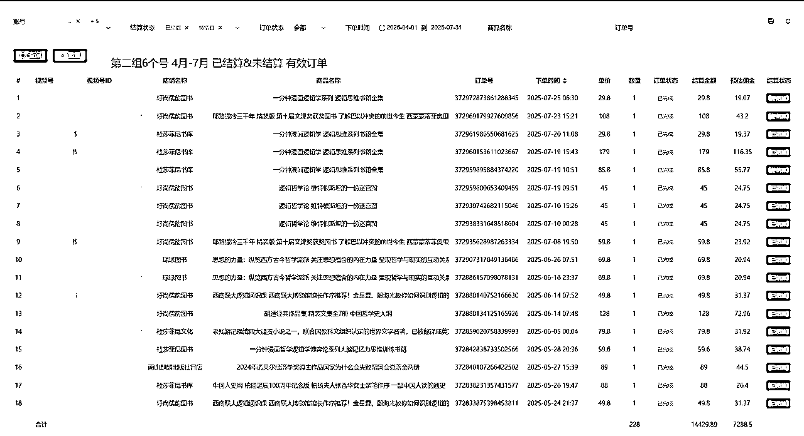
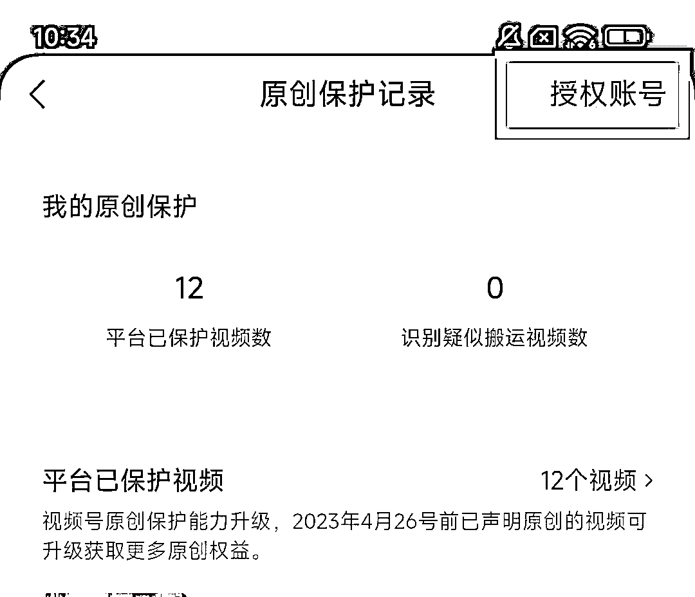
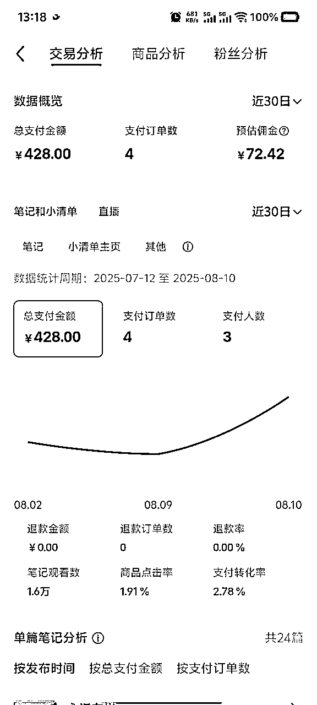

# 【口播图书带货】矩阵+效率优化，月佣稳定1w+实操分享

> 来源：[https://iqlk6ti4oem.feishu.cn/docx/XTmddEzcFoBM1FxkDEncwFpNnih](https://iqlk6ti4oem.feishu.cn/docx/XTmddEzcFoBM1FxkDEncwFpNnih)

写在前面，因为是第一次在生财分享，所以也将自己与生财结缘的过程做了下记录，有点碎碎念

各位可点击左侧目录直达【关于项目】即可。

# 我与生财

## 关于我

Leo（站在雞蛋一邊），90年闽南人，目前主要活动于上海/苏州，10年互联网牛马，有房贷有车贷，35岁被裁，拿着N+1（大约6个月的工资）进入生财，打开了独立面对市场赚钱这一扇门。

## 看到生财

23年下半年偶然听到纵横四海播客，并于12月底加入了纵横四海的星球，虽然第一次了解知识星球APP，但我有个习惯，喜欢看各种榜单，于是顺手看了下知识星球的榜单，榜单第一行显示：生财有术星球，年费2000+，人数50000+，运营7年，当时我就觉得有点东西，并且关注了生财有术公众号，这是我第一次看到生财有术。

## 了解生财

主要来源两个方面：

1.纵横四海微信群里有几位生财圈友，从他们偶尔零碎提及生财的交流中，我能感知并判断生财是一个口碑很好，谈钱不伤感情的社群；

2.开始在生财公众号里面一篇篇阅读文章，24年1月初接到了裁员通知，一边跟公司谈判，一边倒逼着去寻找出路，看了下记录，我在24年1月23日向鱼丸申请了3天体验卡；

## 加入生财

24年2月8日正式被裁，第二天就是除夕了，在过年期间，我意识到：

1.既然35岁能被裁，40岁也能，45岁更能了，打工这条路很难摆脱这个事情；

2.当时可能是我人生中最后一次可以探索“不做打工人，为自己做事”的机会了，因为我已经35岁，打了10年工，已婚，有贷款，本来没有勇气和机会的，但是我拿了6个月工资的N+1，搏一搏吧那就。

24年3月8日，通过纵横四海的生财航海家推荐，我申请并成功加入了航海家。

## 生财对我的帮助

航海家群

航海家有微信群，并且有嘉宾分享，所以我可以近距离地观察航海家们讨论和交流时的分析、思考和判断，以及他们如何解决问题，从航海家人群的视角来重新看待世界，是我一个10年打工人从未有过的体验，我还无法熟练使用文字来表达我的震撼，但它对我影响很大，光是这一点，就远远值回票价；

航海实战

生财有7年沉淀，内容自然过于丰富，但我知道实战才最重要，也只有实战才能赚到钱。

24年3月，我加入生财后的第一次航海，我报了8艘船（当时没有限制），报这么多的考虑有两点：1.我没有任何基础，我需要开眼看世界，航海应该是最好的途径；2.我不是一个自律的人，我需要机制来让我打开手册，去看去学去思考去实操去反馈，交押金打卡是很好的一个机制。当我被拉进16个微信群，并且看到8艘船的航海群里圈友的自我介绍时，又一次震撼了我，原来人生不只有踏踏实实打工，那么多人都可以有不同的人生轨迹和搞钱方式。当然我不可能特别深入学习和时间这8个航海，但最后我都上岸了，也一定程度上开了眼，并且在小红书店铺里赚到了第一块钱。从这以后，我参加了几乎每一次的航海，并且每一次都报名了志愿者，通过参与航海让自己一直保持行动。


亦仁

虽然我至今还没有和亦仁单独交流过，但亦仁对我的影响和帮助肯定是最大的。

参加完第一次航海后，虽然跑通了小红书店铺的变现，但并没有足够的反馈让我能持续坚持下去，我进入了找项目的阶段，但当时我明显还缺乏找到好项目的能力，像无头苍蝇到处转。

但是亦仁提供的两个信息帮我选好了项目：

1.亦仁于24年5月10日单独为晓文和超鹏老师的视频号口播航海发了个贴，在此之前我从未看到亦仁如此推荐一个航海项目；

2.在24年4月24日小马宋老师视频号发布了对谈亦仁的视频，小马宋老师问亦仁当时的机会有哪些，亦仁只说了一个项目，视频号；

结合以上两点，已经足够我把其他所有项目都排除，哪怕我没有接触过视频号，没有出镜过，但我选择相信亦仁的判断，于是我进入了视频号的世界，直到今天，看了下记录，我总共参加了4次视频号航海。


# 关于项目

项目简要介绍：视频号社科类图书口播带货，纯自然流，纯视频出单（挂车+橱窗），不直播，矩阵（18个号），同步抖音1个号，矩阵废号率较低（截至今天我还有17个号活着），每天每个号发布视频2-3条，受众画像：50+男性，江浙沪北广鲁地区

本质上我目前正在做的项目是在2024年5月份晓文&超鹏老师的【视频号口播带货】航海在社科类图书这个细分赛道的优化玩法，主要优化点在于矩阵及效率优化。

我的分享主要分为以下几个部分：

1.项目选择

2.成果及关键点

3.实操步骤及优化点

4.过程中遇到的困境及应对经验分享

5.其他一些补充

## 项目选择

25年3月份之前，我在视频号先后尝试过百货口播带货、养生/百货抠像矩阵带货、养生/百货数字人矩阵带货、微付费打品，其中在24年9月份数字人打品中抓住了一点红利，与两个小伙伴合计拿到单月38wGMV，17w佣金的结果。以上除了口播带货，其他项目的共同点：短期、变化快、废号、成本高。这类项目高风险高收益，红利来得快去得也快，作息也很难规律，仔细思考后我觉得自己可能并不太适合长期做这类项目。


于是在24年底微付费打品项目中没有拿到满意的结果后，我开始尝试寻找一个相对长期、低成本、稳定、低废号率的项目。

最终选择了社科类图书短视频矩阵带货，原因主要有以下几点：

1.长期：我能找到大量的对标账号，橱窗开通时间1年以上甚至2年以上并且还在稳定发布视频，账号存活时间长；

2.低成本：自然流玩法，既然长期，就无需租号，可以使用亲朋好友的账号，成本极低；

3.有短期起号的案例：我能找到大量的对标账号，橱窗开通时间3-4个月，销量大几百本甚至上千本；

4.佣金可观：关注图书品类后，我发现很多畅销图书佣金可以达到40%-60%，少数甚至可以达到70%-80%，并不低于养生和百货；

5.存在明显可优化空间：

①矩阵：我发现短视频图书带货对标账号大多只运营1-2个账号，极个别5-6个，几乎没有看到超过10个账号的，但我在做养生/百货数字人打品的时候，同时运营过30-50个账号。也就是说，图书带货是用少量账号做长期项目，养生/百货数字人打品是用大量账号做短期项目，我具备获取及运营大量账号（相对图书赛道而言）的能力，以此为切入点进行优化，尝试用大量账号做长期项目，应该有很大概率可以探索出来；

②数字人：当时接触到的数字人平台效果和成本还不够令我满意，但我相信技术在发展，后续这应该会是一个效率提升优化点（现在有了，数字人口播视频制作方法可移步2025年5月份阿甜&豪哥老师【AI 数字人口播IP】航海）；

6.品类优势：退货和售后少；（补充一个信息，是我前几天看到李笑来老师提到过的一个案例：亚马逊第一个商品选的就是书，原因是市场足够大、品类具有长期成长性、消费者复购率足够高、售后成本低甚至无需售后）

7.兴趣：我爱读书的记忆要追溯到小学时期了，上初中以后就很少看书了，但我内心知道要多读书，目之所及所有取得成就的大佬无一例外都在读书和推荐书，通过卖书来让自己适当增加阅读量，应该有一定可行性；

## 成果及关键点

### 成果

选定项目后，25年3月份，我开始实操并陆续增加账号，最终投入使用的账号数量是18个，同时抖音开了1个账号进行同步，4月、5月、7月佣金均过万（6月份开始我花了一些时间搭建sop并开始手把手带着身边的朋友们尝试复制，自己摆烂了），下图为视频号数据情况





说明：由于我一直没有彻底解决执行力的问题，以单日产出6条视频为有效工作日，实际上我每个月的有效工作日大约在15-20天左右。25年3月份至今，我累计只产出了不到300条口播/数字人短视频，剔除6月份彻底摆烂，平均每月产出视频约100条，累计通过授权分发的总短视频数量大约在1500-1700条左右。

另外，我6月份邀请了一个去年带着我做视频号打品项目的朋友来一起玩，因为有过做项目的基础，所以上手很快，也在我的方法上做了一些调整和优化，在刚结束的7月份，实现了单月佣金5.6w的结果，但因为时间较短，存在偶然性以及数据较少，本次分享暂不涉及他的调整优化，期待这位朋友稳定月入5w+，下次自己来分享，哈哈。


### 关键点

1.账号数量

在没有原创文案能力、自然流玩法的前提下，最重要的关键点就是账号数量，建议12个账号起步，并且能持续保持15-20个状态正常的账号可用比较靠谱；

2.文案

起步阶段是具备找到有效爆款文案的能力，简单洗稿甚至直接抄能最快拿到反馈，但也意味着被举报侵权和同质化违规会比较严重，长期也就变成短期了，想能够长期做好这个项目，就需要不断学习和提升底层的文案写作能力；

3.效率优化

通过对项目流程的拆解和研究，每一个环节上做一点效率优化，也是项目的关键之一；

接下来我来展开说一下项目实操

## 实操步骤及优化点

### 一、学习口播视频录制/数字人视频制作

口播视频的录制方法可移步2024年5月份晓文&超鹏老师的【视频号口播带货】航海，口播录制的优势是0成本；

数字人口播视频制作方法可移步2025年5月份阿甜&豪哥老师【AI 数字人口播IP】航海，数字人的优势是可实现视频产出的极大效率提升，但有一定成本，目前我们测试出来效果最好的是minimax+heygen，供参考使用。

以上两个航海内容都非常好，感谢以上各位老师的贡献，建议可以先从0成本的口播开始，赚到钱再使用数字人。

注意事项：不要过分纠结于个人形象及画面，因为素人口播形象和画面的一些细微差异对数据和变现的影响很难验证，容易陷入一个思维和时间的无底洞，怎么调整都不满意。要始终坚持核心是文案这一点，本质上就是有个人在镜头面前完整清晰地把文案念出来就可以了，其他的在过程中逐步进行优化即可；

### 二、准备账号

建议10个账号起步，需要找到5个亲朋好友配合实名，具体看个人资源情况，分享下我的找号经验：

1.做好利益分配：最开始我采用的模式是100元+10%佣金的方案，按照我提供的sop进行操作，大约20-30分钟可完成账号配置（正常来说，对于账号名额本身闲置的人来说，20分钟换100块钱，很多人还是愿意的），后续的10%佣金也能保障号主的配合度，到后期我的收益确定性提高后，就只给10%佣金也可以拿到账号了；

2.做好sop：录屏或者截图创建新账号的全流程sop，提供清晰准确的操作步骤，最大限度降低号主的操作时间和步骤，做好了可以复用N次；

下面直接附上我之前做的文字版sop，供参考，但我很久没有验证过这套流程了，使用时请自行验证确认，可添加图片进行丰富。

```
一、提前确认是否有实名名额（没有开过视频号的跳过这步）
每个人有两个视频号实名名额，如果已经开过视频号的提前确认下是否已经实名过，没有开过视频号或者未实名过且没有发过视频的才可以。
【确认路径：微信-我-视频号-右上角三个点-账号安全与绑定/账号管理-视频号实名】
二、提前准备：身份证和银行卡号
身份证银行卡在微信账号实名和微信小店带货者创建时需要使用到，后续视频号带货佣金只能提现到实名人的银行卡，如果是用别人的身份来实名账号，需要选择比较信任的人，保障佣金到账后能回到你的手里。（建议可以给到号主10%左右的利润分配）
具体操作步骤（使用自己主微信的直接跳到第4步）
1.注册新微信：
①自己日常微信可以直接拿来用，完全不会产生影响，想更彻底隔离开的就选择新注册微信；
②名字建议可以取【XX读书/读好书/读书角落/读书空间】之类的，头像建议使用真人生活照；
③注册新微信需要注册6个月以上的好友帮忙扫码邀请，需自行找身边家人朋友邀请；
2.实名微信：微信-我-服务-钱包-页面底部“身份信息”进行实名并绑定银行卡，微信密码自行设置（务必做好账号信息台账，记录好相关信息）；
3.养号：随便发一条朋友圈即可，不轻易更换登录设备；
4.创建、实名、设置视频号：
①微信-发现-视频号-右上角小人-发表视频-创建视频号；
②微信-我-视频号-右上三个点-账号安全与绑定-视频号实名；
③微信-发现-视频号-右上角小人-右上角设置-视频号账号：
【在个人名片上展示视频号】设置为【关闭】
【谁可以看我的视频号内容】设置为【公开，但不推荐给朋友】
【谁可以发评论和弹幕】设置为【所有人】
【谁可以向我打招呼】设置为【没有人】
5.开橱窗，缴纳保证金：
微信-发现-视频号-右上角小人-创作者中心-带货中心-没有货源，选品带货-去开通-去开通-个人
6.添加选品：微信-发现-视频号-右上角小人-创作者中心-带货中心-橱窗管理，随便添加几个商品即可（这步很重要，只有成功添加商品，账号才能开始带货，有问题及时反馈）
```

### 三、找文案和选品

会做视频，也有账号了，接下来就是发什么的问题了。

这里只提供一个我个人认为最简单最有效且最有价值的方法

我在上方的项目成果图中没有隐藏商品名称，你可以用开好橱窗的抖音账号到选品广场中直接搜索随便一本书籍名称，按销量降序，选择销量排名靠前的链接，下拉找到【创作灵感】，可以看到挂车这个商品的部分视频和销量（只选择口播类型视频），除了找到了对标文案，同时还获得了一个对标账号，点进对标账号主页，作品按最热排序，你可以获得这个对标账号数据最好的视频，也就获得了新的文案和新的品，拿新发现的品回到选品广场搜索，以此类推，你可以获得源源不断的优质的对标账号、爆款文案、爆款书籍，并且有非常明确的市场验证过的销量数据。

原创文案能力需要时间积累，但直接使用的话容易违规和被举报，提供一个简单二创的claude提示词，供参考使用

注意：简单的洗稿和二创不能杜绝文案同质化和被投诉侵权，但可以在掌握文案能力前缩短正反馈到来的时间。

```
## 文案重写指南：读书博主专用
### 核心定位
- 创作者 ：口播读书博主（抖音/微信视频号）
- 目标受众 ：50岁以上男性（主要分布在江浙沪和北上广地区）
- 内容特色 ：深度解读+批判性思考+实用建议
### 重写要求
1\. 保持原文案的核心观点和思想精髓
2\. 确保新文案与原文案的重复度不超过30%
3\. 字数与原文相差不超过±10%
4\. 不遗漏原文案的关键信息点
### 语言风格指南
1\. 语言基调 ：

   - 沉稳有力，不浮夸
   - 批判中带着建设性
   - 理性分析中融入情感共鸣
   - 体现人文关怀和温度
2\. 表达特色 ：

   - 适当引用经典名句或历史典故（古今中外融合）
   - 使用贴近中年男性生活的比喻和例子
   - 巧妙植入与受众年龄段相关的社会经验
   - 保持年轻视角与成熟思考的反差感
3\. 句式指导 ：

   - 主要使用简洁有力的中短句
   - 关键观点可用排比句强化
   - 避免过于学术化的长句和复杂结构
   - 适当使用反问句增强互动感
### 重写步骤
1\. 内容梳理

   - 提炼原文的3-5个核心观点
   - 识别可以强化的批判性思考点
   - 标记可以增加个人洞察的部分
2\. 结构优化

   - 确保开头直击痛点或核心问题
   - 中间部分深入分析，可引入对比视角
   - 结尾提供实用建议或思考启发
3\. 语言转化

   - 将书面语转为适合口播的表达方式
   - 增加口语化过渡词
   - 适当加入互动元素（"你有没有想过"、"很多朋友会问"）
### 重写技巧
1\. 接地气表达 ：用日常口语替换学术用语，如"这个观点站不住脚"替代"此论点缺乏论证基础""为什么"替代"为何"，用“你”代替“您”

2\. 增加共鸣点 ：融入目标受众的生活经验和时代记忆，如"我们80后90后可能不理解，但经历过80年代的朋友一定有感触"
3\. 强化价值输出 ：每个观点后增加"这对我们有什么启示"的实用延伸
4\. 巧用反差 ：以年轻视角评论传统观念，展现新鲜独特的思考角度
5\. 情感共振 ：在理性分析中适当加入个人情感表达，增强亲和力
### 特殊内容处理
- 引用内容 ：可保持原文，但前后增加个人解读
- 专业术语 ：保留必要术语，但增加通俗解释
- 数据信息 ：保持准确性，但增加直观比喻帮助理解
- 批判性内容 ：保持锋芒，但确保批判后有建设性建议
### 质量检查
- 朗读测试：文案是否适合流畅口播
- 共鸣测试：是否包含足够的目标受众共鸣点
- 价值测试：每段是否都有明确的思想价值输出
- 风格一致性：是否符合个人品牌的语言风格特色
### 示例对比
原文 ："该理论提出了一种新的经济发展模式，强调资源的可持续利用和环境保护。"

改写 ："说实话，这个理论真正厉害的地方，是它打破了我们过去'先发展后治理'的老思路。它告诉我们什么？发展经济的同时，必须对资源和环境负责。这一点，经历过90年代工业污染的朋友们，应该感受最深。"

请将您需要重写的原文案粘贴在下方：

```

### 四、授权发布

主账号手机端点击如下链接，点击【账号管理】下的【原创保护记录】，点击右上角【授权账号】，添加被授权的子账号，最多5个。

https://channels.weixin.qq.com/assistant-support/pages/creator-home/service

注：如果找不到【原创保护记录】，就是作品数量及播放量还没达到标准，发满10条播放量500以上的作品，正常都能出来。




这里补充一点信息：目前视频号规则仍然允许1条视频同步授权分发到其他5个账号上，也就是一拖五，但实际上这样操作多了以后，平台容易对视频进行限流减少曝光，实测下来，现阶段一拖二/一拖三比较稳妥，实际情况根据系统反馈进行调整；

### 五、运营者绑定

说明：当矩阵账号数量增多时，为了避免设备过多及微信在同一地点频繁登录切换导致微信风控，建议采用电脑运营者模式进行账号管理，只需要满足3-4个手机设备，按如下运营者绑定方法操作，即可管理几十个视频号账号

假设你现在有一个微信账号A，有三个视频号a、b、c，以下操作指导能实现微信A管理登录a、b、c，但只能轮流登录，不能同时登录在线；

1、关注：用微信A搜索a、b、c视频号名称并关注；

2、绑定运营者：a、b、c的网页端视频号助手【设置】-【人员设置】-【绑定运营者】，输入微信A的微信号，搜索并邀请绑定；

3、同意绑定：微信A会受到一条通知，点击同意即可，同时网页端的视频号【通知中心】会有一条信息【A已成功绑定为运营者】；

4、确认：a、b、c均按上述步骤操作完成后，用微信A扫码视频号助手时，会弹出a、b、c三个视频号供选择（标注为运营者），如果微信A自己也有视频号，就会显示4个账号，自带的视频号标注为管理员，选择哪个，就能登录哪个账号。但只能轮流登录，不能同时登录在线。

如果你的3-4个手机登录着6个微信账号，每个微信账号绑定3个运营者，即可同时管理18个账号，以此类推。

### 六、效率/效益优化

1.账号管理：

账号数量多了以后，需要账号管理软件，推荐我们自己使用的小v猫或者即刻矩阵软件；

2.商品链接的优化：

每一本书大概率都可以找到套装或者相关的书（同作者，同类型），选择这些多sku链接，几乎什么都不做，就可以大幅增加gmv及佣金，这个点常常被忽视，但非常重要，我用数据来说明。

以《逻辑哲学论》这本书为例

假如文案塑品是《逻辑哲学论》，你去选品中心搜索，有单sku的，也有多sku的，如下图


当消费人群通过观看你的短视频，产生购买行为时，点进你的橱窗或者挂车链接，这时候看到左图的人只会选择买这一本书，因为书不像养生品和百货，正常只会购买一本相同的书，而看到右图的人，有一定比例的人可能会选择购买多本书的选项。

下图是我的实际销售数据，在累计279个订单中，购买了单本书的39元和45元单价的订单数为242，订单数占比为86.7%，佣金占比为68.82%，而剩余的购买多本书的订单数仅为37，订单数占比13.3%，但贡献了剩余的31.18%的佣金。

以上我只是随便找了一本书拉了数据来说明，重视商品链接的选择和优化，是几乎不花什么时间，就可能让你大幅增加gmv及佣金。再截几个图


3.优化与商家对接效率：

正常情况下找商家对接调整佣金时，每个账号需要单独与商家对接邀约合作并做定向佣金推送，每新增一个商家都要每个视频号在手机端上去操作，还要检查商家推送佣金有没有遗漏，一两个号还行，一二十个号就要崩溃了。

我在带货过程中，发现有极个别商家可以提供团长链接，可以无需定向邀约和推送，一键添加即可享受调整后的佣金，但绝大部分商家都不提供，6月份我带着几个朋友加起来四五十个号，这个事情每次搞得焦头烂额，心力交瘁。

最终我自己申请了视频号团长，自己能生成团长链接了，在对接效率上节省了大量时间，对于矩阵操作非常友好。

备注：视频号团长代办价格不高，淘宝100块钱搞定，但需要先设立法人主体公司和开设对公账户，我以前的工作经历能让我独立完成公司设立和报税等，所以基本不花钱，但如果没有这方面技能，找财务代办每年的成本估计在2000左右，当然各地情况有所不同，大家自行了解一下。

另外，如果后续有圈友需要，我可以将自用的团长链接无偿提供使用。

### 七、违规问题及应对方法

当发布的视频无法获得基础播放（300-500）时，可按如下步骤排查

手机端点击如下账号诊断链接查看账号状态

https://channels.weixin.qq.com/assistant-support/pages/finder-account-status/finder/index

一、显示账号状态正常（绿色）

可能存在以下几种问题：

1.文案违规：如文案内容敏感、无新闻资质、文案同质化等等，此时账号状态没有问题，只是单条视频和文案的问题

应对方法：①如果账号检测页面下方显示了该条视频被减少曝光，删除即可；②停止再次发布该条文案的作品，制作并发布新的作品并观察能否获得基础播放；

2.隐形限流：如果发现多条（5-10条）作品都只能获得200以下播放量，并且账号检测页面不显示视频被减少曝光，此时可能账号被隐形限流了；

应对方法：一般隐形限流也有时间，可以先放置不管，隔7/15/30天后发视频测试播放量

二、显示账号被减少推荐7天/30天（红色）

可能存在的原因：

1.使用视频号里的画中画素材占整个视频时长比例太多

2.文案修改的太少（需要洗稿洗的彻底一些或者增加原创文案）

3.视频被判定素材与其他多名用户发表内容相似4-5条左右，会账号限流七天（这个尽量避免，对账号伤害不可逆，所以要认真对待每一篇文案）

应对方法：将账号检测页面下方显示被减少曝光的视频删除即可，无需申诉，等待时间到了账号就恢复了，申诉很难成功

三、显示账号被减少推荐（红色）

应对方法：没有时间期限的减少推荐，需要发布10条原创出镜视频并进行自证申诉。

## 过程中遇到的困境及应对经验分享

1.视频没有播放量导致的受挫

刚开始时由于不熟练，经常出现辛辛苦苦花了几个小时录制并剪辑出来的视频，发布后出现0播放/系统判定违规/被投诉/无资质发表新闻信息等等系统提示，有一种前面所做的努力全白费了的感觉，并且还能看到同样的文案别人的账号跑得很好

应对经验：最大程度降低每个视频的生产成本，做好每一个制作环节（提取文案，视频录制/制作，视频传输，剪辑，发布等等）的效率优化，每天尽可能产出更多视频发布到更多账号。你做5条视频有3条限流，跟做了50条视频被限流30条，感受和结果是完全不一样的，视频越少越在意越受挫，越多的视频跑出去正反馈来得越快。

2.三天打鱼两天晒网

自己一个人做项目很多人都要面对这个问题，我也不例外，直到现在我也没有彻底解决，但我做了一些尝试。

应对经验：加入或者自己组建一个打卡群/团队，我自己做了2个月后，实在无聊和难熬，但也找不到合适的社群或者团队，于是自己主动找了几个想搞钱的朋友，我负责教，他们负责陪我打卡和监督，团队氛围还是很重要的。现在我的这个问题已经好很多了，因为有一些朋友开始佣金比我高了，追都追不上，没空晒网了。

3.大的正反馈到来之前的自我怀疑

比如怀疑发布时间（别人都啥时间发布的，是不是有什么技巧），怀疑自己的个人形象（是不是没化妆/表情不自然/声音不好听/不够帅不够好看等），怀疑字幕敏感词没处理干净等等，总体来说很容易陷入一些很难被明确验证的问题中

应对经验：始终坚信文案是核心+贴近对标，怀疑什么动作做得不对，就去看爆款的对标视频有没有这样做的，常常就能得出答案。

（补充一个能帮助破除自我怀疑形象和口播能力的案例，@萧大业，大部分人看了以后应该都会觉得自己的形象和口播能力不太会输给这个视频号头部博主）

## 其他一些补充

### 关于一鱼多吃

这个项目起初我主战场在视频号，所以不太重视抖音，也没及时同步视频，因为毕竟只有一个号，总感觉跑出来的概率太小了，但7月份我开始把接近300条视频陆续同步到抖音之后，发现抖音虽然上限不高，但是跑出来推流很持久，并且规则相对视频号要清晰，不轻易封号。截止我写这篇分享的时间（8月11日），这一个抖音号近30日给我带来的有效收益达到了1.3w，这是一个意外收获，我也一并分享出来，供大家参考。

另外，因为有自动发布软件，所以我还同步了小红书，虽然因为平台人群不同，本不抱太大希望，但一周前我刚满千粉开通了小清单，目前也开始逐步出单，同样是意外收获。




### 关于项目的长期看法

段永平说：做对的事情，然后把事情做对；

李笑来说：做一个猛人，勇于做很久才能有收益的事；

这个项目核心是文案，仅做简单的抄袭或者洗稿，迟早也会变成一个短期项目，核心依然是文案能力，而要具备文案能力，要么是自己习得写作技能，要么是寻找合作，所以下一阶段除了自己努力提升文案能力外，也寻求具备文案能力的合作方，希望未来能在核心能力上有所突破，进入一个更健康更长期的项目阶段。

项目实操分享就到这里啦，第一次写总觉得不好，如有错漏，欢迎交流和批评指正！

# 感谢

感谢生财有术，帮助我在独立面对市场赚钱走出了很大一步，虽然目前成果还很微不足道，但每月收益已经趋近于离职前的工资了，要知道我进入生财也还不到一年半，我很满意，继续努力，感谢生财。

感谢亦仁，感谢一路遇到的生财圈友，感谢志愿者萱萱的鼓励让我发#生财好事才有了这篇分享。

以上，感谢大家的时间，一起生财有术！

最后的最后，何以生财，唯有实战！

9 月航海将在 8 月 20 日（本周三）20:00 正式开启报名！欢迎一起来实战！