# 公众号小白到6个月流量主收益200W_V正式版

> 来源：[https://rcnoiwi40o0u.feishu.cn/docx/JC57d3ScOo3pHsxKiY8csa8Vnle](https://rcnoiwi40o0u.feishu.cn/docx/JC57d3ScOo3pHsxKiY8csa8Vnle)

圈友见字暴富~

我是林途，

坐标河北石家庄

一个生财透明党,

前几天老大亦仁发了一个超级标，关于公众号细分垂直赛道。

今年也是我们做公众号的第三年，分享下关于从0到200W流量主收益完整复盘和思考。

说实话，开始写这篇复盘时我有点紧张。不是因为数据，而是担心分享得不够深入，浪费大家的时间，毕竟在生财这个高手云集的地方，200W收益算不上什么。

也许价值在于——如何在一个看似饱和的赛道里，通过拆解和执行，找到属于自己的那条路。

从小白一路走来，经历众多，踩坑很多，吃瘪很多。

希望我踩过的每一个坑能成为你们的垫脚石。

爆文很吃概率和运气，长久来看不太稳定，单流量主不足以支撑稳定长久的盈利。

今年上半年将侧重慢慢在做转变，布局垂直+IP+私域的一些动作。

整篇内容包含了如何从0-1，放大。

以及对于公众号爆文我们认为的公众号【1.0】【2.0】【3.0】时代的思考。

*   比如1.0时代的蛮荒时代纯AI洗稿就可以赚钱，当时咱们生财的航海算是比较朝前的。

*   2.0时代的细分垂直竞争，需要拼差异化和精细运营才能存活

*   3.0时代的更细分更垂直，公转私，产品承接等这部分的看法。

坦白说，我的写作水平到现在还是很差，但这并没有影响我把公众号流量做到几个亿，写得不好的地方，大家多包涵。

最近刚开了自己的公众号【林途link】

希望和各位大佬多交流，多链接，能够结识到这么多的伙伴非常开心呀😊

# 取得的成果

## 流量主的收益200W+，以及几个亿的公众号流量

项目始于2023年9月1日，10W+的几百篇，100W+的也有，但是不算太多。

整体粗略算了下有几个亿的流量，流量主收益已经达到200W+

截图下看下一个400多W的推荐

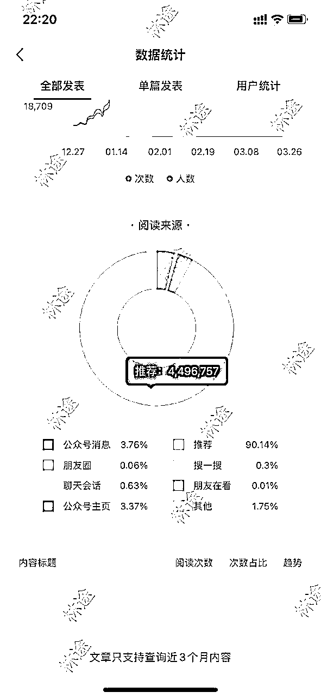

这个是其中一个号一周的收益，大概就是每天再翻倍

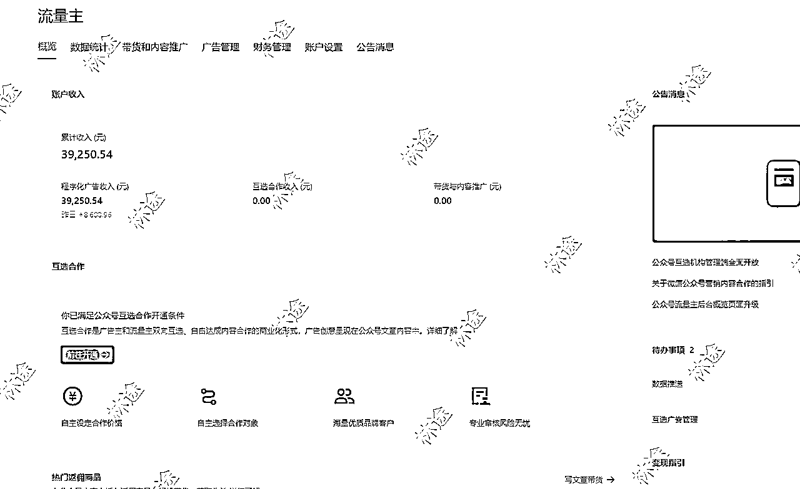

其他的一些数据收益简单可以晒下，一部分吧，因为我们没有做培训类的所以基本上也没有过多的整理素材。

## 沉淀出近100W的公众号矩阵粉丝

拿一些公众号的数据来做参考。

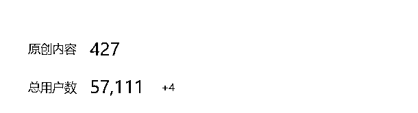

## 有10W+的私域

当时每天每个号上百个请求，同意好友用的RPA脚本来做的，并不是特别精准，可以用做原始流量的积累。

下面我会从自己的视角来复盘下整个项目的过程，如果觉得啰嗦可以直接按照目录来筛选。

# 项目从0开始

简单介绍下自己的履历，方便各位大佬熟悉。

当时刚满18岁的我成为了一个真正的北漂，依稀记得第一份工作的工资是2800。

在老东家近10年，当时北京带一个小团队负责整个华北区的交付业务，对接一些阿里，华为，金融，保险相关的业务，全国的省会城市大部分都跑遍了，后兜兜转转在软件公司做项目经理，售前咨询等。

08年开始做过很多的小项目，生财各位大佬中我算小白。

当时QQ空间盛行的时候卖过头像，流量卡，设计过QQ空间，倒腾QQ号，开过淘宝，带过游戏家族，电商，卡盟等等吧，全是兼职做的项目，奈何没有太大的复利，后来因为本职工作太忙很多就直接放弃了。

## 前言

河北石家庄这个地方当时一年的薪资也还行，单纯上班来说还算正常，只是职业发展会到达上限。

在一家上市公司的河北分公司做售前咨询属于24小时待命，技术+咨询。

觉得上班能赚到钱完全满足不了自己的追求，辞职待业后一直属于躺平状态，

## 萌芽

自己心中一直有一个信念当下就是不知道做什么是想做的，但非常清楚当下做的事情是自己不想做的。

比如AI这个我是从14年就了解AI，但是只不过是国内AI只是存在于知识库层面，跟现在的生成式AI完全两个概念。

没了收入，还要承担房贷车贷的压力。那种焦虑感，只有经历过的人才懂。摆过地摊，顶着夏天40度的高温在外面晒，收入少得可怜，那种绝望感现在想起来还心有余悸。

最终还是想着找自己擅长的网上的项目，借着AI的东风来看看有什么新机会。

## 接触

机缘巧合下在某个社群里面接触到公众号这个项目，这个社群的群主也是咱们生财的航海家。

当时能接触到的就是很简单的注册帐号的流程以及项目收益来源，很简单。

大概也就是7天左右的视频教程，每节3-7分钟左右，最简单的入门初级，相比咱们的航海手册就比较粗糙了。

于是在2023年9月1日，正式注册了自己的公众号。

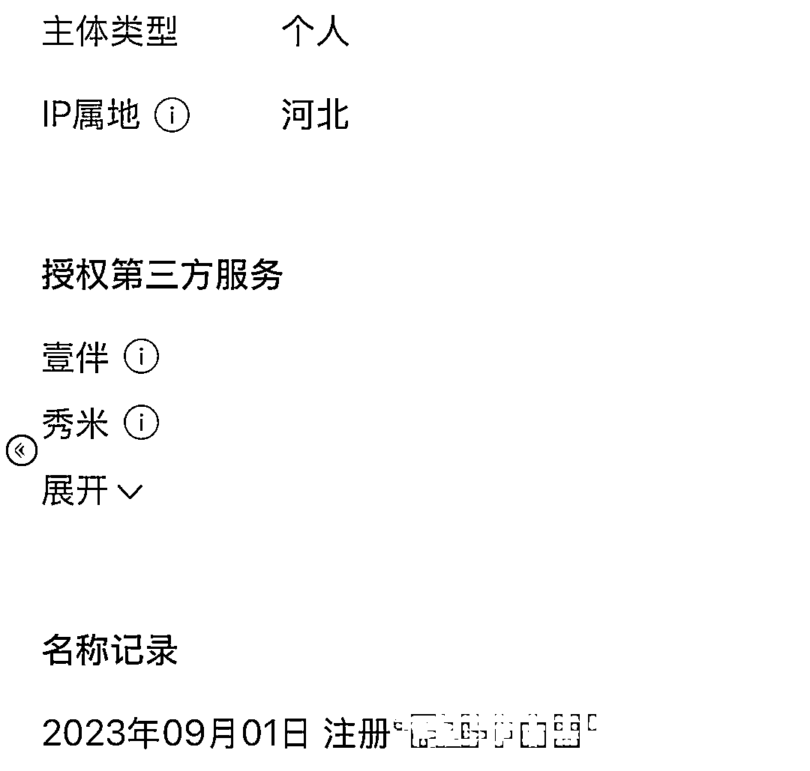

写的第一篇文章，纯AI文，现在看都不想看，哪有什么排版呀，但那是我的来时路。每一步都很珍贵。

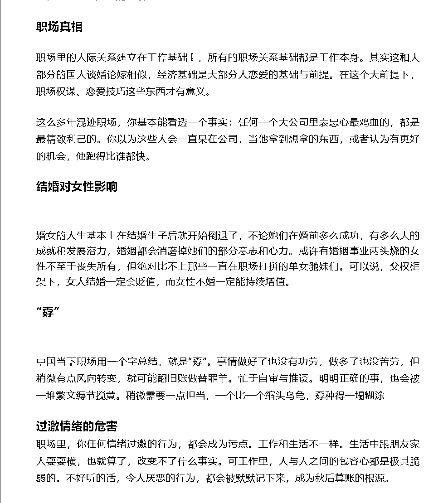

# 把手弄脏直接开干【1.0时代】

## 赛道选择

内容不会有太多注册入门级别的，如果有这方面需求的可以参考星球内的其他入门贴。

2023年当时大家比较吃香的几大赛道，包含：情感，民生，养老金，军事等。

对于我而言我可能那方面都不擅长。

于是我开始疯狂刷各种账号，寻找方向。我要找的方向有两个硬性要求：

*   非大众领域（大家都在做的一定太卷）

*   我擅长（结合我擅长的领域，我做起来会更有优势）

最终当时锁定的是职场赛道（上过班有点优势，利他，符合自己的价值观）。

再细分：

如何思考

*   我赚什么的钱（我赚的是流量的钱）

*   流量怎么来？（热门话题，有争议，八卦，金钱）

最终定的是职场八卦赛道（当时正值大厂裁员潮、35岁危机、赔偿纠纷满天飞，这些话题天然带流量。）危机慌慌，越焦虑的人，越爱看八卦。

凡事有利弊，职场大环境不好的时候写这些就有流量。

反之，大家工作稳定，大家可能不关注，因为不去找工作。

任何事情有好有坏，一分为二来看。

## 跑通0-1拿到正反馈

大概在9月份的有刷到一些帐号，职场八卦，互联网大厂裁员.

这个领域的流量篇篇几W，符合对标的逻辑，新号起来的比较快。

写作水平不行，胜在我相对擅长利用工具，感谢GPT出现，让我不再有写作恐慌。

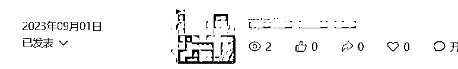

起号周期大多数在20天以上，9月1号注册就开始日更，逐步的学习，对标，框架，标题。

当时自己手上没有系统化的SOP文档（这个时候强烈安利咱们生财的航海手册）。

所有信息来源就是网上搜索出来内容，信息来源渠道：公众号，小红书，百度。

### 第一篇过万的阅读

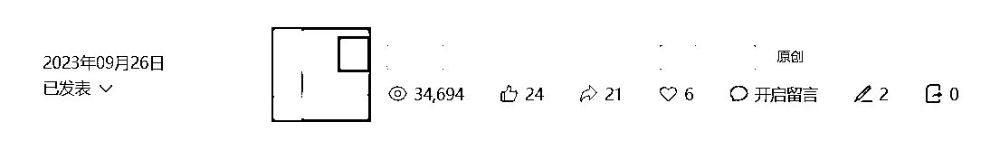

更新到20多天，9月26日喜提我的第一篇过万阅读，算是拿到最小MVP

（PS，那时候非常激动，天天早上5点醒来看数据，现在就算10W+，上百万都毫无波澜）

当时的数据大概维持了3个月左右，其中的一个账号随便出来一些数据

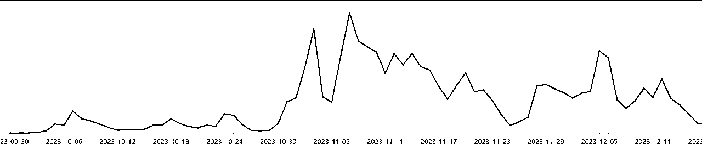

这个阶段的感悟：坚持，选题，时机都非常重要，正反馈是最好的动力

### 第一次拿到收益数据

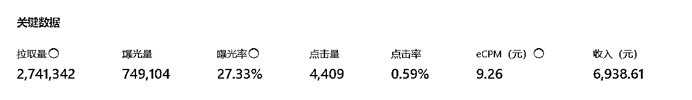

### 赛道的选择

同时起的号有几个赛道，情感，体制，教育，宠物。

*   情感的一直没有起色放弃。（当时认识的一个朋友情感的一篇文章爆了17000的收益）

*   体制内的违规严重小爆，放弃。

*   教育领域1个月没有起色，自己一直想要坚持，因为这方面个人感觉最有价值，自己又能学一些东西，又能分享给他人，符合自己的价值观，利他。（3个月后直接大爆发，天天10W+，坚持就是胜利）教育领域的坚持让我学到了最重要的一课：很多时候不是方向错了，而是坚持得不够久。教育内容确实更有价值，但需要时间积累信任。

*   宠物赛道内卷，对标帐号很难起放弃，变现需要后端承接。

属于红利期，无脑抄对标就做AI洗稿就行，只要坚持大概率能赚到钱，能赚2-5W左右。

### ECMP单价决定收益

当时的单价在万次/80左右具体可以参考下图数据。

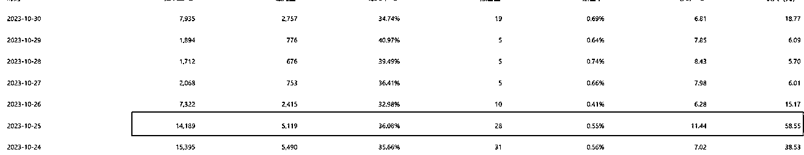

还有一个线下跟着我跑项目有一批那文章40W浏览，才给了900（低的可怜）

单价均到不到25块钱

看了下数据：完读率太低，30%左右，纯推荐过来的流量。

这样的数据自己闭着眼也能想明白，一定不会长久。

当时如何提高ECMP的想法就开始萌芽，思考为什么，什么原因，怎么提高

### 反思

项目均有周期性，当红利期风口过去之后，就会面临重新洗牌。

如何做穿越周期的事，甚至能在一个行业里面深耕下去，是需要考虑的问题。

## 帐号掉池，复盘，拓展

帐号大概维持了2-3个月左右，大部分掉了流量每个帐号赚了大概10000多，对于自己的信心有了很大的打击。

复盘自己的问题，原因猜测:

*   同质化严重

*   进场人太多（内卷）

*   AI无脑产出，平台打击（纯AI产出，AI味严重，平台不喜欢这样低质量的内容）

*   侵权，很多内容不实，AI改过后胡编乱造。

当时AI发展程度还没到当下这个状态，写的内容还是比较low，机器味很重，天天都是很重复的内容，在我理解的就是所谓的垃圾文（当然不影响撸流量主）

### 选择题

*   赛道深耕？

那么需要找对自己的赛道深耕，输出有价值的内容、需要大量的价值内容输出，当下没有那么多的精力。

*   增加领域？

当时经过筛选选择是文案情感赛道，这方面比较熟悉。

毕竟都曾经都是非主流时代，每天10句话，简单无脑操作，对标拾句先生

### 赛道确定

当时选择了关于情感文案类赛道（所谓的文案号）

这部分是我的小伙伴在测的一个领域每天30W流量，天天100-200，效率比较高。

当时一个月公众号涨粉大概2.5W

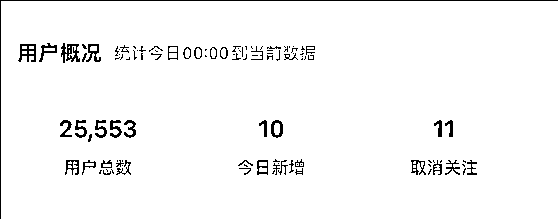

当时考虑假如一个号一天赚5块钱，100个号就是500。

全自动化问题不大，还有利润，外加一些小程序部分流量主的费用，可以放大，可以往下走。

优点：

*   不标原创

*   可操作性强

*   浏览粘性高

*   批量自动化

基于以上分析当时选择了第二个选项，搭建小团队，从1月份一直干到6月份。

### RPA提效

期间自己学习了关于RPA的相关教程，

用了一周的时间从流程，排班，上传，同步，发布，等等各个环节。

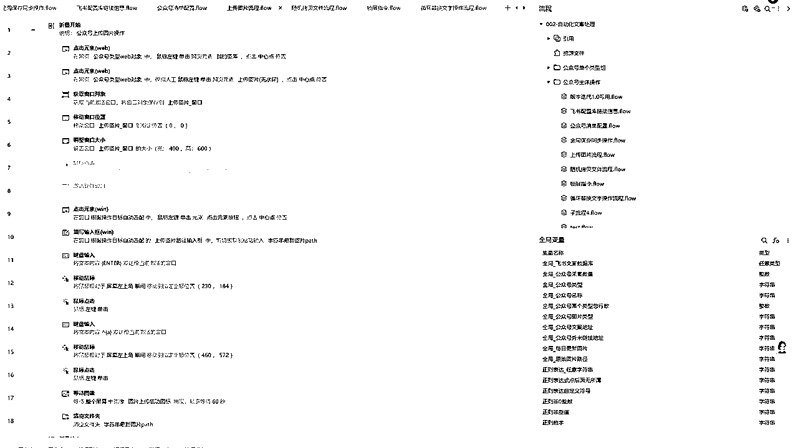

做了一套RPA工具以上仅供参考，整理素材库以及图片库等等，进行提效。

### RPA流程图

下面是大概的流程图供单价参考

整体的思路是：

*   飞书在线配置文档实现填写公众号配置，这个也是和网上的教程学习的。关于RPA对接飞书文档，这部分如可以从B站进行搜索，进行对应的设置。

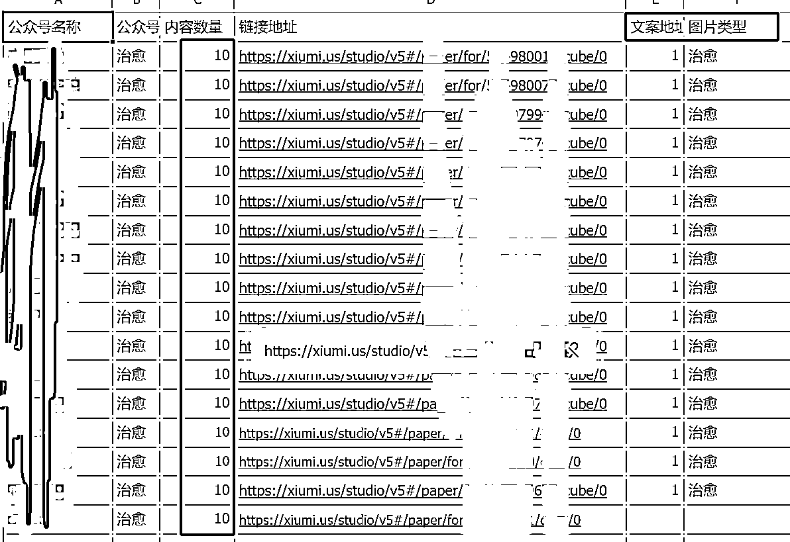

里面有涉及到公众号的类型，每个帐号都有各自的排班模版，对应配图也是同一类型的可以设置，比如搞笑，治愈，emo等等，可以根据对应的的文案类型来做配置。

*   帐号的模板是我自己手动一个一个的去设置的，为了避免同质化。

*   RPA操作的目的就是解决我批量替换图片和替换文字的操作流程。

*   RPA可以根据我让他们每篇文章替换几句话，这个在配置界面都可以进行设置，如上图飞书配置图10那里。

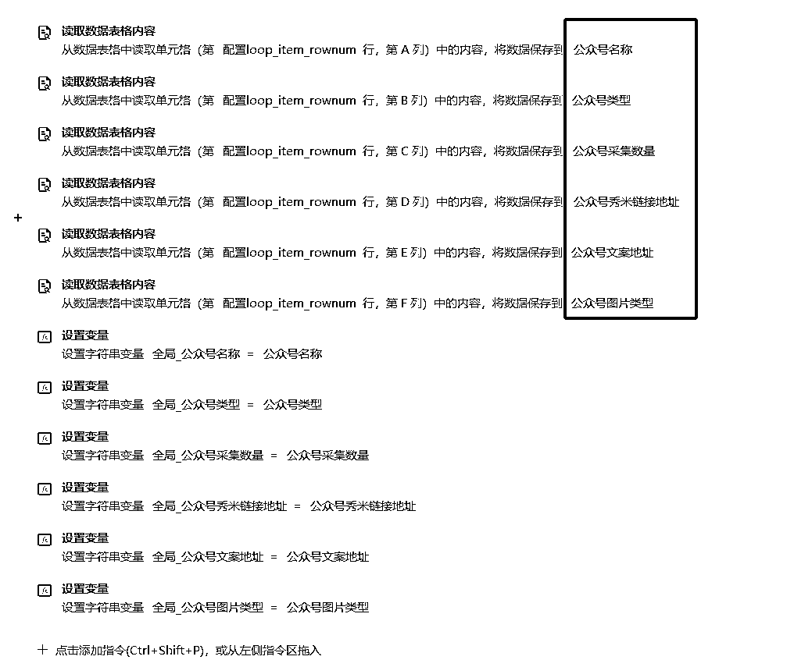

*   模版设置用的是秀米，然后绑定授权，可以通过RPA进行同步。

*   还有一个问题就是素材问题，图片我是直接爬的一些网上的数据，文案也是爬的然后进行人工分类的。（有人会问这部分内容用AI产不行吗，之前调整的试过，做精细化高质量的完全达不到要求的质量，所以就放弃了）单文案大概积累了有几W条数据，在素材库里面随机分发。

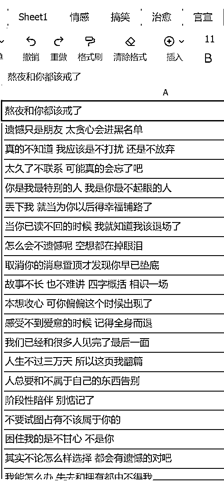

*   图片部分抓取的数据需要做二次修改，比如修改成1:1的，这样更美观，排班下来也会很直观。

这部分我是直接做的RPA小程序，（PS，当时AI写代码很费劲，自己写代码又不会），将所有的图片都切割成1：1，然后上传后排班美观很多。

*   比如标题如何拆解，分块去做的拆解，供参考，都是用10W+的标题拆解出来分析的。

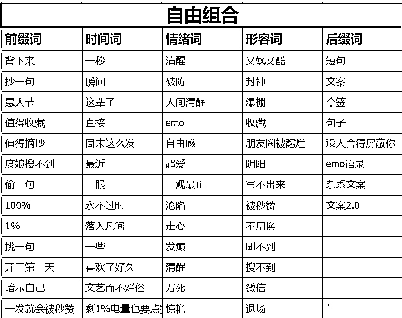

*   然后对接飞书群，同步完成后会在飞书群里面，发条消息XXX公众号已完成，作为日志。

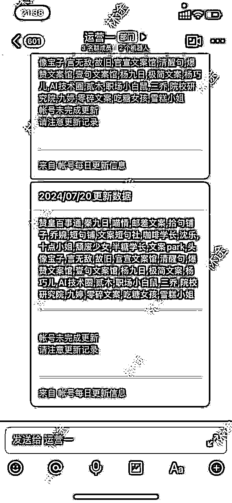

*   当时启动也做了自动化，直接用的邮件指令对接RPA，用邮件做触发器。（在家发一条消息就会直接自动化执行）

*   执行完成后电脑自动锁屏，发送结束指令。

### 自动化搭建完成

至此，效率和内容问题直接解决，综合下来一个账号大概需要1-2分钟的时间来同步发送内容，当时起了大概100个左右，有企业号（5家公司注册帐号）有个人号。

期间非常感谢生财的航海手册，以及精华帖，感谢猫哥精华帖思路的开拓。

### 结果

结果:企业号90%没戏，个人号90%以上全部起来，形成剧烈反差，(帐号权重问题)。

没起来的原因还有一部分是有一批帐号大概搞了20多家公司注册帐号在跑，显然我们的5家已经弱爆了。

算算外面市场上大概有1000多个号在跑，还没算没看到的。

变现方式比较简单粗暴，就是培训。

起来的账号比较稳定大概收益每天100左右，随便贴几个图。

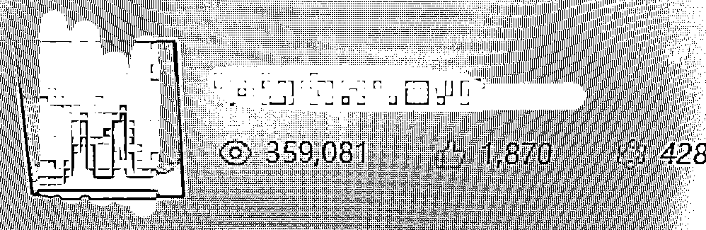

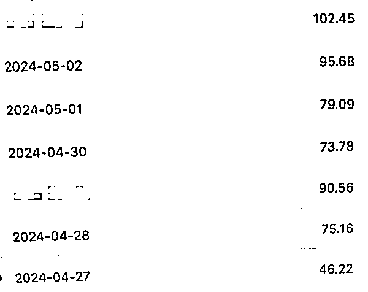

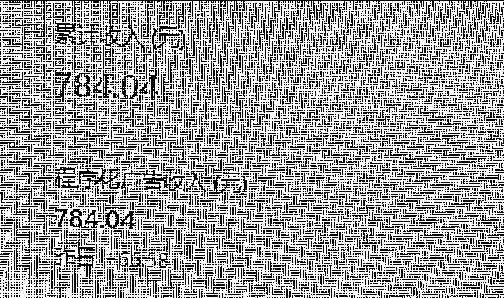

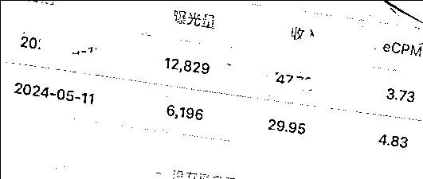

同步搭建了一款小程序，第一波怼了几千的流量，结果第二天收益1.88，心情瞬间凉了，和预期相差100倍。

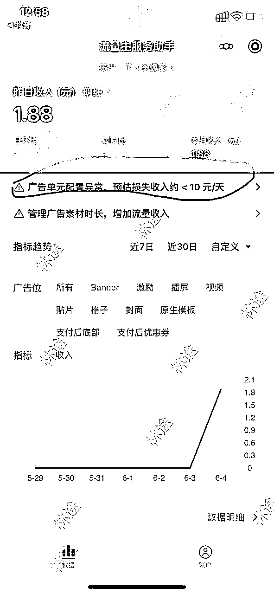

这部分的钱吃不到的话只能放弃，这个领域承接后端产品需要很大精力就没有再次加量，没有起来的号也直接吃灰。

当然目前还有一些此类账号在运营，收益不多，但胜在稳定，后台天天10W+，粉丝粘性不算太高全靠推荐流量。

起号难，需要内容支撑，周期性流量，很难把握。

### 思考复盘

下面是个人对这个领域的看法：

*   这个领域如果作为公司化运营需要后端产品承载放大利润。

*   个人兼职做可以，但是需要精细化运营，以及很强的网感来支撑。

至此对于公众号爆文项目纯AI洗稿时代，野蛮增长期我们认为结束。

称之为公众号爆文1.0时代，始于2023，终于2024~

# 二度重启职场领域【2.0时代】

随着1.0时代的结束，重新开始思考如何迭代玩法，齿轮开始转动。

### 改变策略

核心主题：卷流量不如卷单价（这个是我在去年线下分享的时候做的PPT供大家参考）

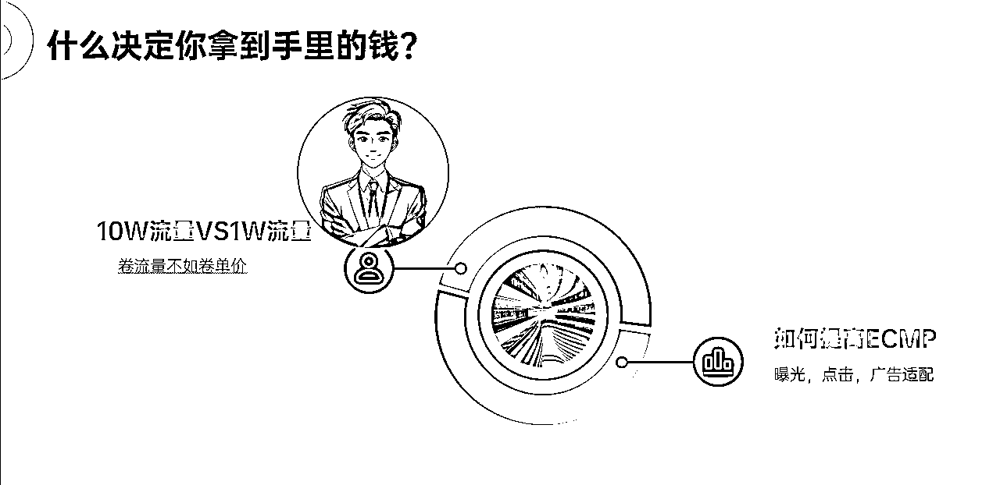

去年的6月份将文案的账号没有流量的逐步停更，原有的账号掉池后并没有注销。

拆解后关于公众号爆文的原创主流玩法分为三个见图。

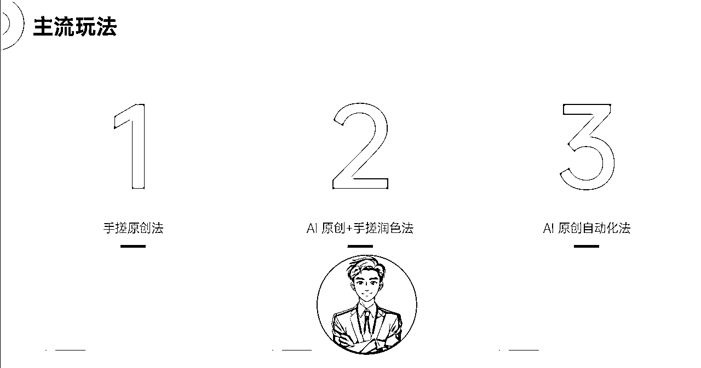

### 分析市场

当时市场上大部分在搞自动化以及代运营的方式在跑流量主、废号流为主（掉池后注销重来）。

至于我们为什么没有选择这种方式基于下面几点：

*   本着作为基本盘长久稳定的盈利；

*   代运营需要的是跑量，目前资源缺少，还未能打磨出一套可控可行的方案；

*   对于工具测的开发不太擅长，缺少编程技术支撑；

*   需要沉淀一些数字资产来供后期发展所需；

小插曲：

市场上大部分纯AI洗稿，在池的时间大概率在1个月左右，已比去年时间更短，很明显平台已经开始打击纯AI洗稿，当时我记得官方和封杀了一批账号。

### 测试数据

基于以上考虑在重新测试，测试过很多的赛道，比如生肖，情感，美女等等很多。

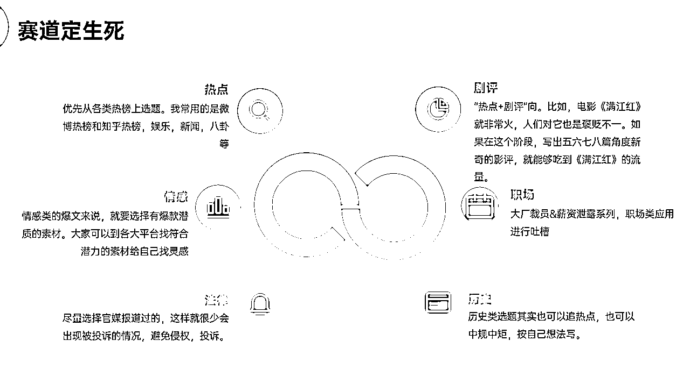

围绕几个关键点来做测试：擅长，单价，存活周期，价值，流量，单纯撸流量主的话需要直接针对中老年群体。

比如之前养老金的赛道算是经久不衰，法律赛道里面的内容违规点比较多，军事类的更是违规，还有一些SE的赛道，我们当时也碰到过封号的，还好问题不算太大。

针对以上的思考，我们开始测试各种赛道，还是会回归到本质上的，利他，有价值，有内容的东西才能坚持，才能长久。

### 赛道细分

以上思考后我们直接在大赛道里面找细分垂直赛道，比如职场类，一些高情商对话，八卦，还有一些解密体制内的赛道。

细分才有机会，模式就是测出数据直接上量，标准化拆分。

比如标题怎么写分几块，会布局一些关键词之类，这样的赛道如果空缺，我们会直接上量做区分。

这部分会有周期性，每个时间段都不一样，所以这部分建议细分赛道，做针对性的运营。

高单价的领域大概分享几个吧，养老金，美食，体育解说，游戏其实还有很多，可以按照我说的这些标准去挖掘大概率都有不错的收益。

### 精细化运营

上面应该提到过关于关于原创文章的三种方法，我们采用的是AI+人工的方式，去规避系统检测和内容质量的提升这部分。

我们会针对每个账号进行精细化的分析，账号的定位，以及内容的输出。

再者我们想着去沉淀一些自己的粉丝作为长久的运营，所以我在去年线下分享的时候就用的AI60%+人工40%的模式来做内容输出。

这样我们能保证账号的存活周期，在推荐池的周期更长，我们就能赚到更多的钱，打出差异化。

还有一点我们当时操盘的帐号已经被咱们圈友伙伴发到风向标里面直接被对标了，不得不佩服咱们圈友的嗅觉。

（当时内容天天10W+）

另外我们这边人工相对比较便宜，所以一些数据也还能打正，如果在省会城市就很难搞。

一般我们会把一篇文章拆成开篇吸引+中部内容+尾部升华这样的框架来做处理。

比如开篇就是一些热点内容，吸引人钩子来做留存，中部的内容一般就很水，尾部直接会把文章做升华处理，来提高完读率。

可以参考~

下面的部分细节上的内容可以参考

## 定位

*   名称，头像，个性签名（根据账号定位修改相应内容）

比如：情感号，职场号，亲子号等等。

*   寻找对标账号（越多越好）爆款选题，可以模仿对应标题，框架，内容，模板。

## 文章写作

1.  是原创类文章的情况下。要在原创度和内容质量合格的情况下：

每天日常查看对标账号异常数据的推荐率和账号的活跃情况，并且进行模仿。

注：热点标题或者素材的搜索，同时积累相应素材导入飞书文档。

1.  在没有推荐的情况下，按照（1）的方法活跃账号，前提是原创度至少低于25%

1.  推荐率达标的情况下（至少60%以上），适量挖掘新素材和新框架进行创新，打磨内容，提高内容的原创度和价值输出，尽可能拉高账号的权重，获得更大的推流。

1.  可以适量引流，前提是推荐率和阅读量达标的情况下。

## 排版

*   根据账号风格和定位进行排版设计，可以参考账号内容数据分析中的用户画像，根据年龄段喜好来设计

*   在美观的前提下尽可能简洁明了，拉高视觉舒适程度。

*   字体大小，行间距，格式，全文要统一，尽量粘贴之前预览一遍。

*   推荐阅读字号调整到10以下、

*   配图要高清统一，插入位置要合理。（有版权问题的要注明出处，注意留存备份）

*   文章开头或者结尾，增加公众号名片

## 细节

*   素材很重要，爆过的素材很容易爆，（素材决定了50%以上的概率），开头一定要吸引读者，否则没有完读率。

*   整体文章的完读率控制再60%以上，阅读时长0.7以上。

*   文章内容的推荐比例90%以上

*   图片版权特别注意配图用AI产生配图

*   每篇文章相似度低于25%

*   每日分析账号的单价

*   点击率（1.5%以上）

*   ecpm值（会对账号的单价有很大影响），通常数值在12以上

*   文章字数要控制在1100+，注意广告插入区间，起来的号一定要预览广告位置

以上问题有问题及时反馈跟进沟通

## 注意事项

### 数据低的原因：

*   点击率低是因为封面或者标题没有吸引力

*   完读率低是因为内容和用户没有产生共鸣，没有提供足够的价值输出

### 复盘

*   前期数据低很正常，需要账号活跃度，心态放平

*   后期即使起号成功也会有数据周期，数据低的时候要尽可能更精细化运营，进一步明确定位

## 其他

1.  同一账号必须做垂直受众，风格要统一，否则容易影响账号流量和单价

1.  编辑过程中出现卡顿，可关闭浏览页面，清除缓存，再次打开

### 提高ECPM

举个例子就是1W阅读，收益从20-1000不等，这里面就大有可为。

所以当时就提出的卷流量不如卷单价。

比如我们做1W流量有时候可以达到600-800的收益，别人做10W流量就400的收益，这两者的差距很大，所以我们果断去做提高单价的动作。

而且做1W流量一定比做10W流量容易，单纯从收益的角度出发，那么就必须直接提高单价。

下面是一些自己分析。

*   在我看来高单价的就是选择赛道的时候已经决定了，人群决定了点击率，一定是中老年肯定高，这也就是为什么养老金单价相对要高的原因之一。

*   另外一点就是广告的选择，你可以手动去调整，当然前提是你了解你的读者群体的前提下，否则你调整了可能会拉低你的单价，慎用。

*   广告的点击和周期有关和人群有关，需要自己摸索，比如过年的时候购物之类的点击率就高，培训类的广告的单价就高。

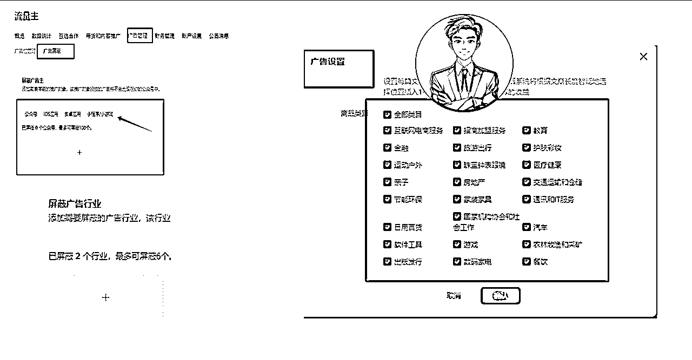

*   还有比如体育领域的赛道单价也很高，还有游戏类都是仅供参考，别到时候不高了来骂我，那我就惨了、

*   赛道的选择也可以根据上面的广告分类在做筛选选择。

*   广告的屏蔽也需要去做，比如我们会把棋牌游戏和成人用品这部分的广告给屏蔽了，这部分我们测试点点击率太低了。

*   排版需要做下，一个优质的排版会增加广告点击率（这些都是小细节问题），干净整洁就好。

*   我们在高单价的领域上会去做人工插入的操作，这点大家可以参考。

下面的单价图片可以供大家参考。

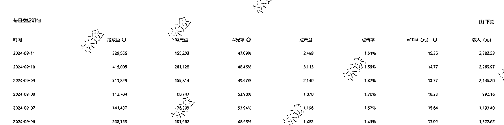

### 侵权问题

期间遇到的一些侵权问题基本上删除文章就能解决。

这部分说的是个人号，如果是公司主体的话建议一定要避免规避图片侵权。

因为之前认识的河南的一个朋友做公众号一个图片被法院判了5W的赔偿，当然大概率就算侵权了也就是几百块钱的事情，大家稍微注意下。

当时还遇到有人打电话到公司说侵权的问题，就是专门以搞侵权为生计的公司，大概率是在广撒网，当然直接没有理会。

还有就是一些确实侵权了 人家公司需要你删除的，我们一般会要求他们提供一些资质证书，发过来直接删除文章就好。

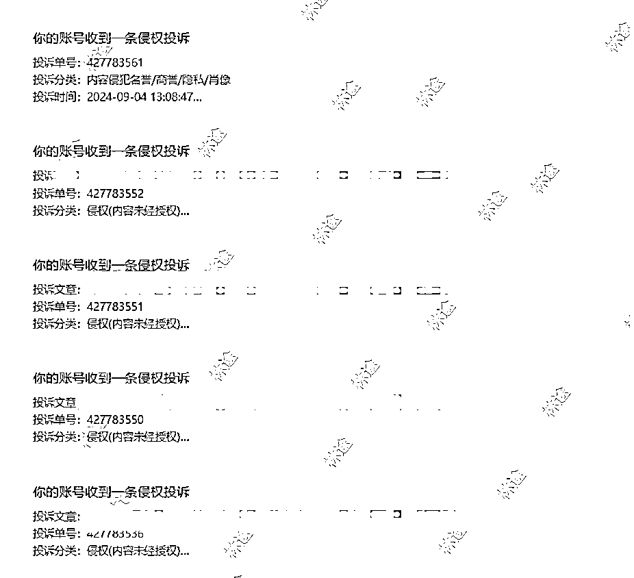

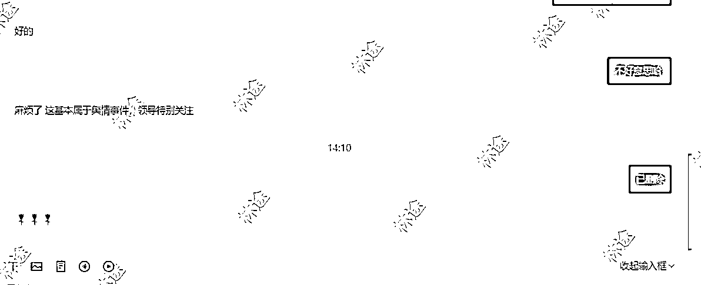

### 部分收益数据

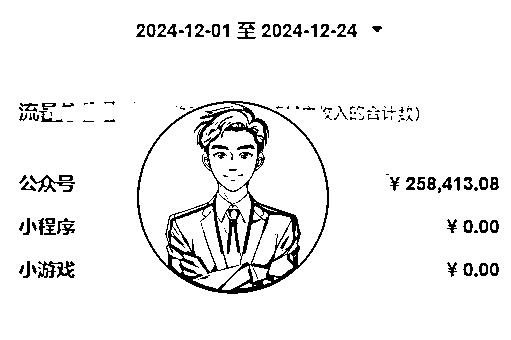

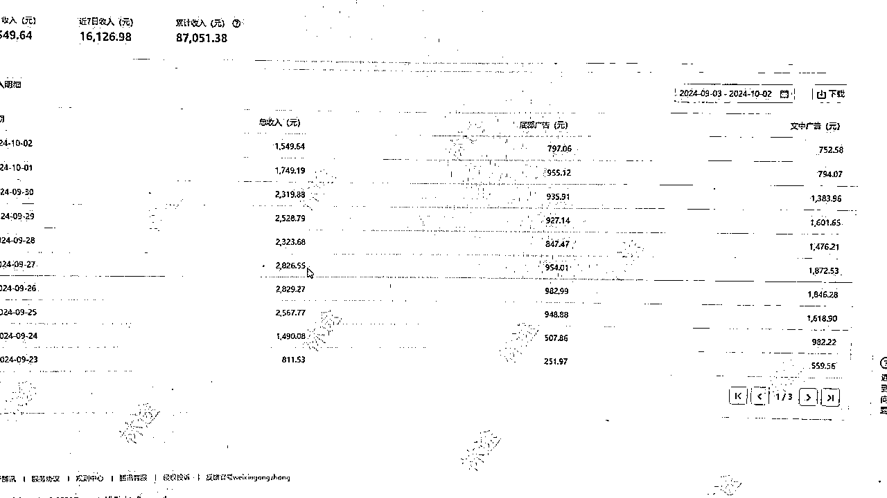

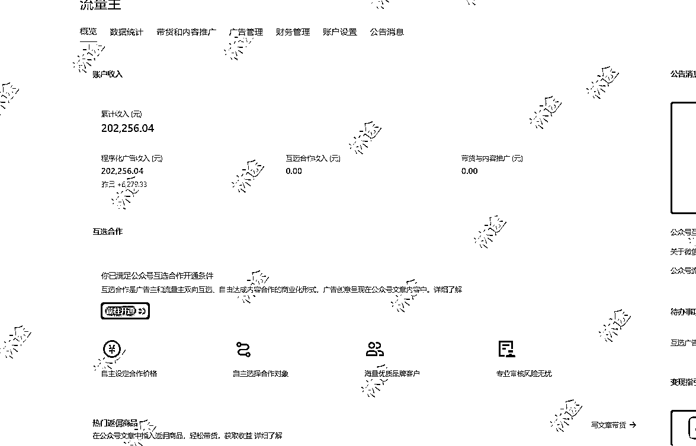

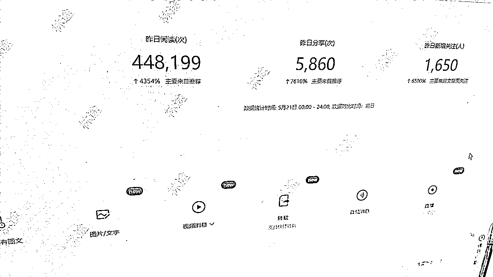

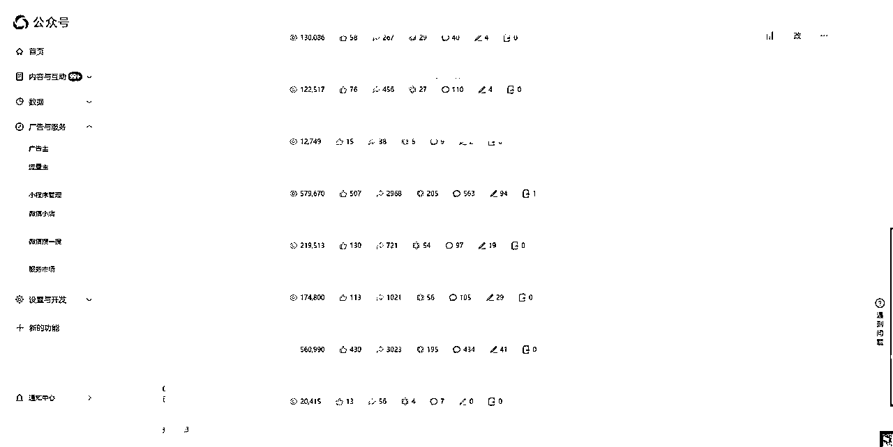

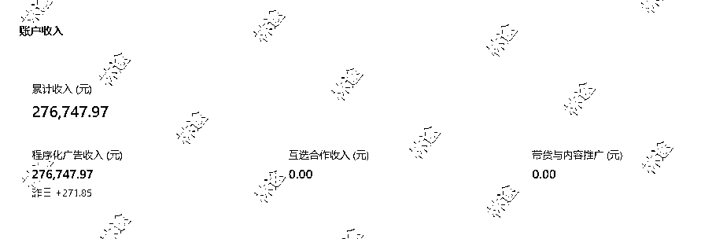

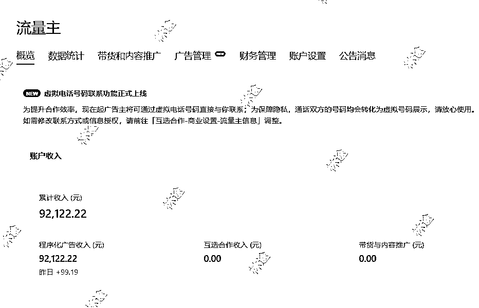

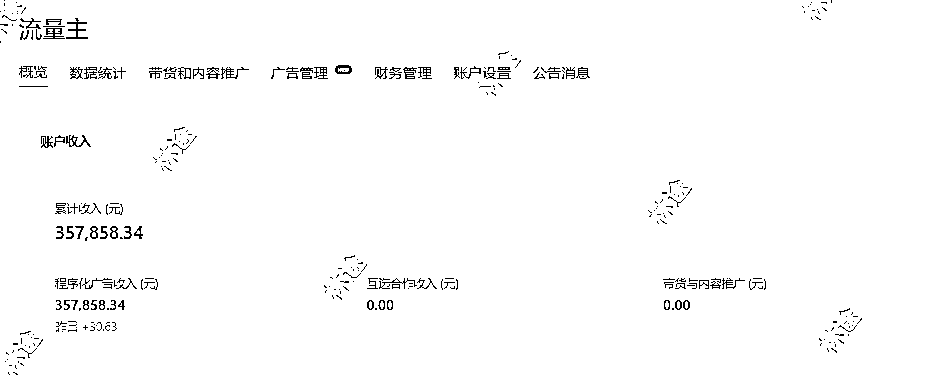

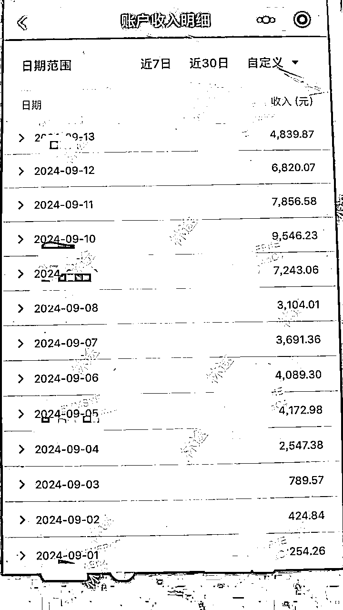

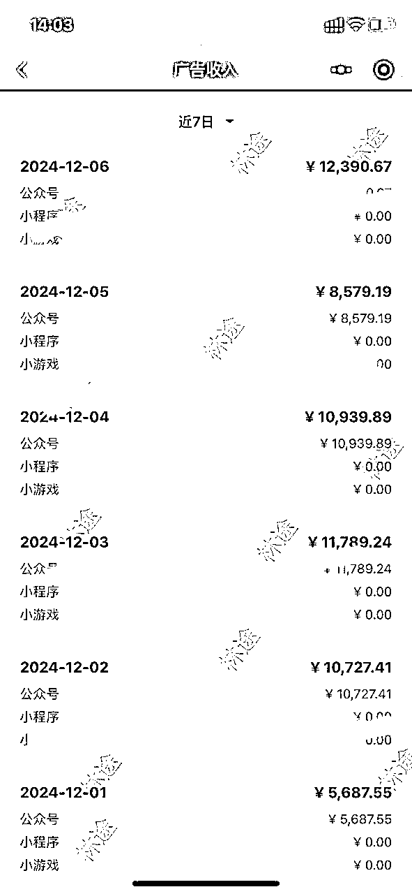

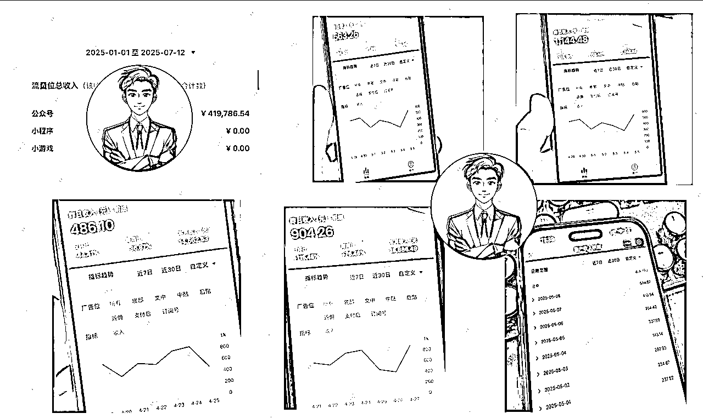

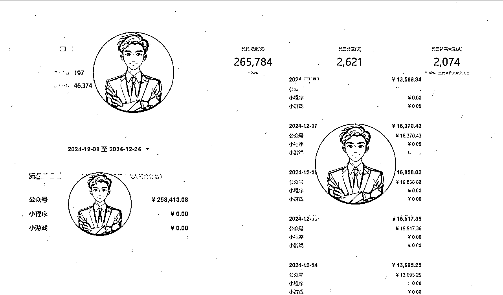

### 复盘总结

永远赚不到认知以外的钱。

当时起盘的点就是在做流量主，所以注定了收益不会太高，天花板有限，变现渠道太过于单一。

后面要做的就是提高认知，拆解商业模式，积累资源。

假如去年这些流量去做培训做，后端转化这部分，可能会赚的更多500+应该是没问题

当时对标一些相似案例的单价都在2000左右，而且去年去做培训的话市场应该是完全够的。

再者就是合作（借势，合作，共赢）。

比如亦仁老大讲的去寻找合作伙伴，找靠谱的合作伙伴，包括戴哥(戴巍)也是建议我们去做这个事情（当时去北京和戴哥聊过，再次感谢下戴哥安利我加入航海家）。

之前对接过一些企业主要是担心后端不够绿色，没有信任基础就没有做，所以很多时候合作还是建议咱们圈友优先合作，毕竟减少信任成本。

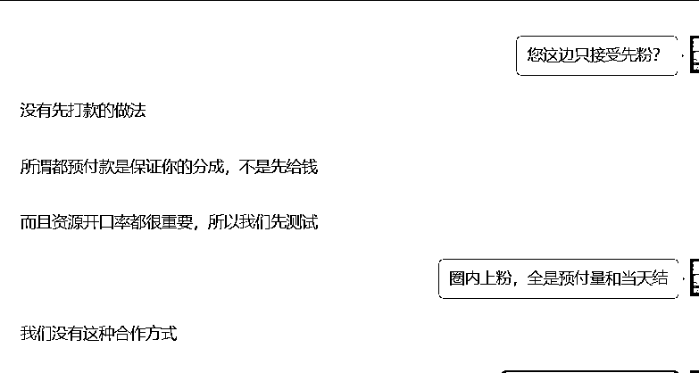

再者包括我们做流量，我们一直在做拆解，做新的模式，新的框架。

在同一赛道内我们会比同行做到更细致，然后集中打爆一个点。

很多事情需要做到人有我优，人优我特，人特我专。

但是单纯吃流量主这个事情显然对我们而言已经完全行不通，包括后面吃这种收益也不可取。

很惨的是其中有一个号半个月的收益近10W，直接给扣了让人很难受。😪

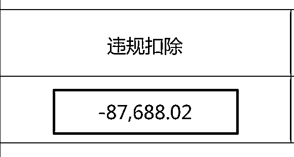

对我们而言，大概率是公众号流量主的2.0时代画上一个句号，至此作为end一个收尾。

# 布局私域产品转化【3.0时代】

## 瓶颈期

仔细算算去年单纯流量主的收益还算能维持，但是如果小个体工作室来做这个事情是没有问题的。

但做为团队化的运营，这个盈利模式显然很不合理，太不稳定，无法支撑一个团队来做。

所以在去年的时候我们就一直思考去做一些产品化的东西，来对抗这些不稳定因素。

毕竟靠平台推荐吃饭没有靠自己产品稳定，心里更踏实一点。

流量主收益是在给平台打工，平台开心了给你点流量，不开心了就让你喝西北风。但如果有自己的产品，就算流量少点，至少能保证基本的生存。

说实话内心挺煎熬的。

一方面流量主收益确实不错，但另一方面又知道这不是长久之计。就像温水煮青蛙，舒适区待久了就不想动，但不动就是等死。

下面也是我在去年分享的一些思考~，同时分享给大家。

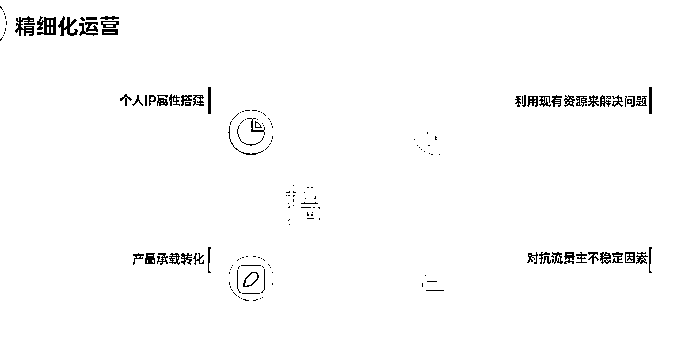

比如当下很多都不太好做，单纯的流量主作主营收已经不太容易，

前几天在一个朋友那里分享的时候，很多的朋友问，现在没有流量平台不给流量怎么办。

其实当时我做的这个PPT来分析。

首先，平台，政策，周期，红利这些我们是不可控的，这个是大方向的事情，我们很难控制。

我们能做的就只有，在大的范围内去做细节上的优化：

*   深度：你做的更深更专业，是不是爆文的概率增加1%？

*   量化：我们多加几个号，是不是又能增加1%？

*   技巧：标题、配图、时间点等等细节优化，再增加1%

*   坚持：别人放弃了你还在，又增加1%

1%+1%+1%+1%的累加，积少成多。

每一个小细节，小动作，都可能是成功的关键因素。细节决定成败，道理都懂，但真正做到的人不多。

PPT就比较粗糙了（大家凑合看）

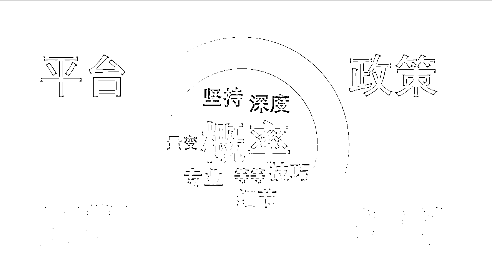

## 私域

公众号作为导私域最丝滑的平台，有绝对的平台优势。

可以没有抖音，可以没有小红书，可以没有快手，但你一定有微信，平台的优势。

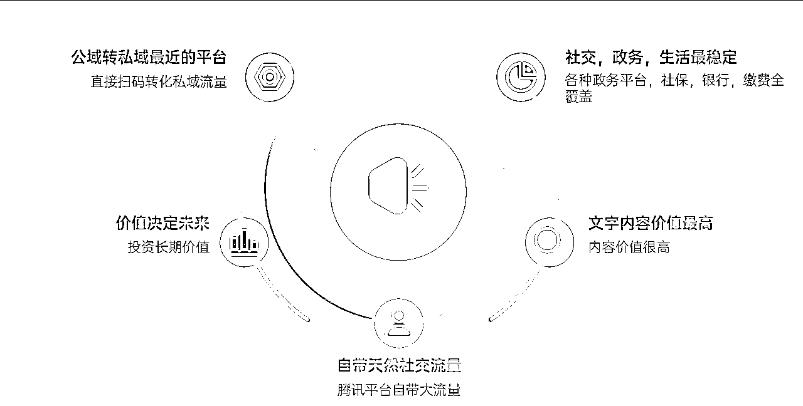

大家都觉得缺流量，流量越来越难搞，确实当下确实流量越来越贵。

但是对于我们做流量而言就像上面讲的，流量为了产品变现而服务，泛流量吃平台的钱。

还是回想到你要赚谁的钱，你就要站在谁的立场上去考虑，做他们的服务。

私域不是流量的终点，而是服务的起点。

精准流量才能转化产品，同时也在筛选用户，泛流过来可能会增加运营成本，转化率低。

所以在前端就要做好筛选，这样也会减少运营成本。

针对自己的用户群体去做内容，做第一次的筛选。

下面是做的一个整体的思路

*   以帐号矩阵为起始流量，做数据的分发作为流量的前台。

*   IP，优质内容作为背书，做成交前的信任基础，作为内容营销的中台。

*   在私域后台上做对应的产品矩阵来做流量的转化，承接前端流量的变现。

但是对于做流量而言，流量是为了产品变现而服务的：

*   泛流量：吃平台的钱（流量主模式）

*   精准流量：转化自己的产品（私域模式）

还是回想到你要赚谁的钱，你就要站在谁的立场上去考虑，做他们的服务。

以前只要写文章就行了，现在要考虑用户画像、转化漏斗、产品匹配度等等，复杂度至少提升了10倍。

目前我们会围绕这个框架来做公众号的布局，用矩阵的打法做流量，精细化的运营，期间一定会有众多的卡点，也欢迎各位圈友一起探讨交流，分享，迭代更多好玩的玩法。

## 销转

对于私域而言，销转解决后，流量问题也就解决了，这句话也是天堂地狱老师讲的，非常认同。

这个是我们目前布局的重点，从单一的流量前端转到重后端的运营不太容易，需要很多的资源，精力时间的投入。

目前我们也在一步一步的验证，测试， 路上有很多的坑，需要我们去解决，好在有各位生财的伙伴一路前行，路虽远，行则将至。

## 未来

最近老大写的一个关于公众号的超级标，垂直+IP的思路。

公众号公域流量的放开就是一个信号，腾讯作为全民社交平台，必然会和抖音小红书去分一杯羹。

微信相关的生态，包括视频号等等各方面的一个生态闭环值得去探索。

我的感受是：公众号的春天可能又来了。

以前大家都说公众号没落了，现在看来，只是进入了新的阶段，从粗放式的流量收割，到精细化的用户运营。

至于做到什么程度，值得一起去探索。我现在的想法是：不要为了规模而规模，要为了价值而价值。

至于公众号后面的玩法迭代，需要在实践中去做验证，现在变化太快了，计划赶不上变化。我们只能在大方向正确的前提下，保持足够的灵活性。

实践是检验真理的唯一标准，好在我们一直在这条船上，在这条船上已经航行了3年。有过暴风雨，也有过顺风顺水。

但最重要的是，我们还在船上，还在前进，这就够了。

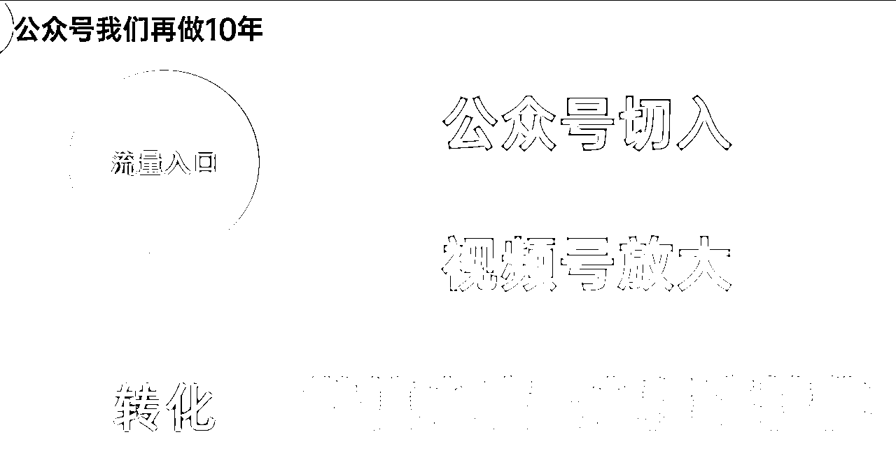

# 写在最后

*   项目的认知

从我的理解而言任何的项目都有周期性，借用最近在学习天堂地狱老师对于项目周期的理解。

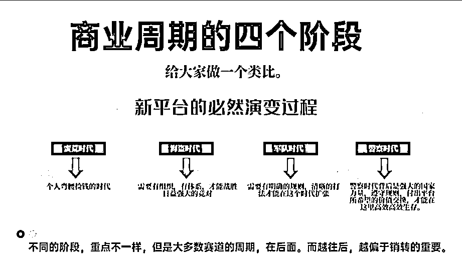

每个项目都有周期

第一阶段，就是在弯腰捡钱的时代，直接跑马圈地就好，只要你做就能赚到钱，能赚到多少取决于你的执行力，也就是公众号爆文的1.0时代，2023年开始的蛮荒时代，直接无脑操作就好。

第二阶段，需要有一些技巧跟上一些小团队，比如赛道的细分，单价的提高，有标准化，有规则的去做，才能赚到一定的钱，比如2.0阶段。

第三阶段，就像目前现在经历着的我们，需要改变，对于团队而已单纯的吃流量主打法对于我们而言已然行不通，需要去做改变，如何在当下环境下利用公众号拉出基本盘，做一个杠杆支点。

第四阶段，在以后在未来，在如何与平台，生态共存，互惠互利。

另外还有人会问现在公众号值得做吗？爆文值不值的做？

下面我会站在我自己理解的角度来聊下，

*   某些细分的赛道值得做，值得深入做，包括我们也在去布局，细分赛道里面绝对还有大流量。

*   普通人，小白想入门，你要考虑到周期性，现在的周期确实比较长，全职做这个项目，建议考虑IP+产品来做转化，考虑多种的变现方式来维持，作为一个流量载体而不是单纯吃流量主，本身就没有多少号，现在收益又降低很多，付出和收益不成正比，可能没有做高客单的项目或者出海来的更有效一点。

*   做副业，可以利用自己的优势去写一些内容，做没有边际成本的事情，可以增加自己的影响力，公转私，交朋友，锻炼自己的写作能力这方面，建议。

*   比如我自己以前坐那里半天扣不出来几个字，小时候一写作文就头疼，得亏现在AI救了我，锻炼了我的写作，至少现在还能写出来点，不然这篇文章现在你都看不到，不过放心这篇文章是我纯手码，所以还是建议去多锻炼。

*   亦仁老大的超级标，同样也印证了我们去年下半年的猜测，蛮荒时代和平台做对抗做洗稿的时代已经过去，需要做垂直小而美的，精细化的精品号的路径时代已经开启，值得做。

不善言辞，是个i人，感谢各位，觉得有用的可以点个赞，后面我会继续更新优化这篇内容。

感谢各位生财圈友，在我前行路上帮助太多

# Q&A

感谢生财提供这样一个优质的平台，必须给个赞。

原谅我词穷，没太大写作能力，一句牛X走天下，

也希望各位多提意见，千言万语不如交个朋友多聊聊

欢迎全国各地的朋友们到河北做客。

这么近，那么美，周末到河北😊

大家有任何的问题都可和我相互交流，评论也行找我微信交流也行，我把大家的一些问题会分享到这里~