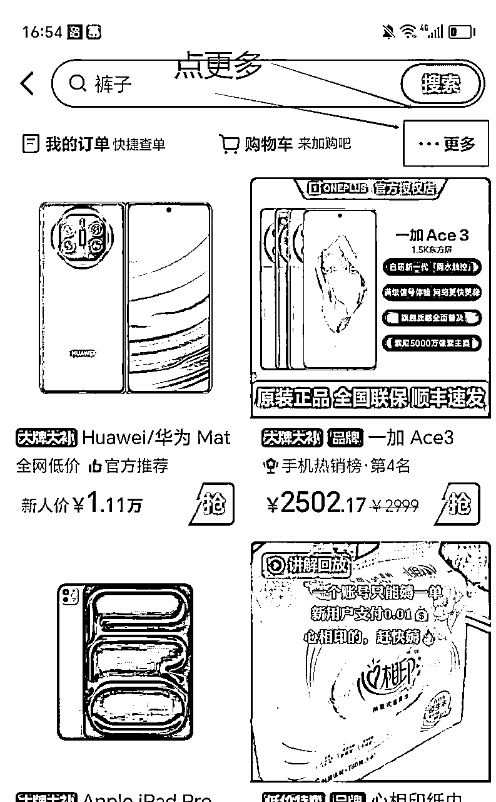

# 《快手好物全站微投流挂车，正反馈变现极快且持久稳定的新流量入口玩法》

> 来源：[https://vwzxb5qdvr.feishu.cn/docx/XbTQdvGHwoR32axFNY9cpxHNnnf](https://vwzxb5qdvr.feishu.cn/docx/XbTQdvGHwoR32axFNY9cpxHNnnf)

## 前言

哈喽，大家好，我是J森，上次分享还是在上次，目前毕业后主要靠着大学做项目攒的一点资金以及手头的小红书和直播的业务，跟大哥一起弄了个工作室，在广州一起做直播跟带货的业务。

快手好物全站投流挂车这个项目是在六月份中旬接触的，那时候我还在跟我大哥的工作室里测试弄小红书跟视频号的直播业务，还没分出精力All in这个项目，我一个之前一起做项目的好哥们跟我说快手可以整，并且拿了他测试的出单数据给我看：每天大概起来一个号三百多单左右这样：

且起来稳定出单的账号每天就是进行微付费调试把ROI的投产比例调整好，基本调整到一比一利润产出后，账号就可以稳定持续出利润，但如果想要获得持续出最大的自然流量以及最大的roi投产比就得进行多方上下调试到你自己账号系统所匹配的最大性价比roi的【值域】后就会持续稳定的最大比例稳定的推送自然流量。

这就是目前快手的全站直播投流挂车打法，且出转化出正反馈算是很快的，目前我们工作室入手测试的账号只要发作品介入微付费全站投流基本三四天都能出单，慢的话六七天左右看到正反馈。

## 一：项目收益

那时候看到我朋友这数据后且简单了解了项目玩法以及逻辑之后，我感觉这项目能整，流程也相对简单且见效快，因为那时候手头还在弄其他一些业务事情，于是乎我就让我工作室的一个兄弟入场测试实操体感，我提供方法论玩法让他去跑。

在6月28号，0基础起步开始学习测试，新号剪了十条视频发出去，然后开始进行日更操作：

日更视频加选品投了8块钱粉条后挂播账号第二天开始出单出正反馈起：

后面跑通方法论就是账号开始坚持日更输出作品，大概坚持日更半个月左右账号作品流量数据开始起量出单：

而且账号爆过一次选品视频素材之后，账号的标签权重就被打上了，后续视频选品素材的人群也会精准以及稳定推流，流量数据开始稳定增长。

账号调试账号视频素材的roi稳定输出数据之后，基本就做到一比一的利润比产出，相当于投10块的付费产出10块的利润，后面账号可以往上调整ROI输出之后，去探索快手全站直播的一个最具性价比的数值，从而以最低的一个消耗推广去探索出账号最精准的人群，以达到投产最高的一个ROI数值点。

我朋友测试开始变现后七月我们就开始矩阵多个账号一起测试账号，账号数据有高有低，玩过互联网的都知到账号项目数据有一定的【流量概率机制】，所以跑通方法论之后，多矩阵多加账号就好了，数据也自然客观起了。下面这是我们七月打了十多个号的左右的总体产值数据（数据图都是一个号的产值数据）

上面的并非全部利润，还要减去一部分微付费投流的成本这样。这些账号我们打的大部分美食，roi起量后，全站的消耗基本控制在1比3的利润产值左右，也就是账号全站消耗10块钱可以带来产值30的佣金，退货率保持在三成左右这样。

## 二：项目介绍

#### 1.快手全站推广流量入口介绍（基于官方资料整理整合）:

全站推广是快手电商平台推出的全域智能投放产品，以“目标投产比（ROI）” 为核心优化目标，通过系统算法在快手全站流量场景（包括推荐、搜索、关注、同城等）自动探索高转化人群，从而帮助商家在保障整体投放效率的前提下，实现商品交易额（GMV）的可持续增长，且这个流量入口是平台今年才开通的，对商家具有一定的扶持跟推荐。

##### 1.优化机制

商家设定目标ROI（即每消耗1元广告费预期带来的支付成交金额），系统自动优化投放策略，趋近目标值。

关键逻辑：ROI目标值越低，系统拿量能力越强；ROI目标值越高，流量精准度越高。

##### 2.流量覆盖

整合快手全域流量场景：

推荐页信息流 搜索结果页 关注页动态流 同城页 突破单一场景限制，最大化商品曝光深度。

##### 3\. 核心价值

ROI可控：保障投放效果稳定在设定投产比区间；

增量可持续：在ROI达标基础上，持续提升商品GMV；

智能省心：自动匹配高意向人群，无需人工调价。

##### 4\. 投放效果

稳定ROI：在达成设定投产比的基础上，保障投放效果稳定性； 长效增长：持续拉动商品GMV提升，满足商家长期经营诉求； 智能调控：无需手动调价，系统实时优化人群和出价。

##### 5.参数设置逻辑

目标ROI值越低：系统拿量能力越强，适合冲销量、拓人群； 目标ROI值越高：流量精准度越高，适合保利润、提效率。

##### 官方适配场景t

新品冷启动：快速获取全域曝光，精准测试潜力用户；

爆款放量：在ROI可控条件下规模化提升成交；

店铺经营：平衡全店整体投产与销售额增长目标。

“全站推广通过智能预算分配和实时竞价策略，在保障目标ROI的前提下，为商品挖掘全站高转化流量，实现长效经营增长。”

上面快手全站产品手册可看出，全站推广这个付费流量入口才上线没多久，真正实际在应用操作测试素材也才这一两 个月左右，目前快手 的商品素材流量基本都会在这个付费入口得到推荐以及流量扶持，所以之前我们这边开的几个账号测试才会那么快的变现转化出单得到正反馈。

#### 2.快手好物全站起号保姆级实操教学，看完0基础上手直接实操跑通变现

##### 注册账号测试流量

直接注册一个新的快手账号然后拍几个风景照视频实拍，然后观察等待数据推流一般第二天账号数据有个一两千的流量就说明账号OK，如果第二天流量没跑起来就再发两三条进行流量观察，过个一两千流量就可以去发带货作品了。

##### 实名＋开通橱窗达人端

账号如果做矩阵的朋友建议办张营业执照，然后开通达人分销都挂自己的个体工商户上面，这样到时候提现佣金货款的时候就不会受到实名影响需要实名者的身份才能去提现。也可以自己开个mcn账号，让所以名下的分销号都挂在一个人名下提现，这样提现的时候就不会错乱起：

##### 养号

其实就是刷对标，给你的账号推荐你要做的类目所要的内容，比如你要做美食，多刷这种内容，大数据后续就会给你推流这种内容，后面你选品就会比较直观。

##### 正常运营发布时间跟素材数量节奏：

第一天：10条素材

第二天：10条素材

第三天：10条素材

三天后账号正常推流一天可以发布20条素材

搬运爆款的素材需要进行替换跟去重处理，素材发完需要看是不是有带同框的原创标志。

手机端可以下载MT软件进行素材替换处理，具体操作下方可看教程：

MT管理器下载链接：

制作素材跟发布作品这块也可以用批量去重跟混剪软件跟自动发布素材处理去做去重跟自动发布处理，这个也可以自己去网上找软件测试，我目前用的素材自动去重混剪软件（月卡大概100左右）

前面三天都用粉条对账号作品进行预热处理：一般投十块钱选定十个作品，12小时投点赞评论加热。前三天都这样投就行

投三天后后面根据账号推流情况再进行粉条加热调整处理。

##### 5.全站微付费直播推广：

电脑端打开磁力金牛进入页面：

点击全站直播推广：

这里有自定义跟智能出价，设置智能出价就是系统直接给你烧流量，你可以不用管比较无脑。但是产出的ROI数值肯定比不上人为操作处理。

设置自定义你自己可以设置出价，调整roi调整到合适的点，也就是最高性价比的出价点从而达到用最小的出价去换取最高的流量从而达到最高的利润产出比：

一般自定义定价可以从15开始调整，前期可以充值10块钱然后调低ROI的出价让全站直播推广烧出去，账号如果不消耗或者消耗的慢就微调下2个点，如果消耗太快就往上调试ROI，只有把全站烧起来，后面视频的流量才会被带动，然后持续稳定的推流转化，这时候你就得调整你的roi，最开始你的ROI肯定是要先调整到1-1的出价利润产出比，就是你投一块钱能给你带来一块钱的利润的流量后，出利润之后，让全站消耗一段时间去让系统探索以及匹配全站的相应人群，探索到一定程度之后，系统会通过账号的学习期，这就说明系统已经匹配到了相对应的人群，后续会持续稳定的推送自然流量。

学习期过了之后，这时候可以把整体的roi调高，从而达到最后高roi以较低出价去获取流量且持续全站烧起来推流转化的效果。

这期间全站直播会有可能出现不消耗情况，就是账号的选品跟素材不大行，需要多发新的好的爆款素材结合粉条去刺激。

##### 6.选品:

正常账号养好能发作品就直接选品，先确定一个基础类目，比如女鞋，或者美食，百货，然后直接低价高佣入手，价格定在9.9-15块钱左右就行，前期低价起号账号上流量权重会快些，品跟素材可以从快手爆款榜单上选跟找，而且产品下a面有趋势曲线，曲线的趋势变化意味着近期的需求量跟市场情况：一般都是找上升趋势的即可：

选品中心找品：

根据趋势曲线找品跟素材测试：下面这种曲线图趋势就是比较完美的，也可以找有趋势但是竞争小的类目品

后面就是持续更新作品以及进行全站直播的ROI调试调整到全站直播的roi利润产出比达到账号的最具性价比产出量，这样账号就会持续稳定的推流跟产出利润。

全站挂播操作：使用全站直播推流玩法需要账号进行开播处理，这个手机端直接开直播放映厅计划放电影或者放歌曲让他挂播就好了。

## 三：项目稳定性

正反馈较快且稳定持久

为什么我称它正反馈快且持久稳定呢，因为他的全站推广这个流量入口才上线没多久，真正应用的也才这几个月，

且付费推广平台本身就是顺应平台的趋势

跟着平台的节奏走，自然会比较长久，只要你会进行全站消耗，平台就会给你一定的流量扶持起号出单，所以拿到正反馈出单闭环也会比较快。

且随着你发布的视频素材越来越多，平台给你推流所带来的长尾收益也会越来越显著。

哪怕你现在在更新的视频素材不爆，之前发布的素材推起来的流量，也会被全站直播推广微付费烧起来后所带动，之前的视频也会源源不断的推流，给你带来一批又一批的订单转化。

像下面这个号是一个不咋更新的账号，因为号有点多有些流量一般的就不咋管：

但是作品堆到一定数量之后，每天只需要调试好ROI的比值，达到利润产出的最佳投产比让全站去消耗，之前的作品也会带来源源不断的流量出单。

## 四、项目可能遇到的踩坑以及注意事项

项目测试过程中都会存在一定的踩坑点跟难点，个人下场一个多月测试项目，总结分析以下几个核心难点以及踩坑点：

1.各位遇到第一个卡点可能就是不好判断处理选的素材跟选的品具体爆发在哪些阶段，因为流量比较高的大爆款跟好的品，出来一段时间后，必然会有很多人在跟品跟素材，那么这种情况去跟，流量自然会少起，且因为跟的人多，你的素材就会出现同质化严重的情况，这样就导致你的roi端需要降低去出更高价格去跟别人消耗竞争流量。（当然不是说爆款完全不能跟品跟素材，这种情况可以选择哪些日期比较近的，且爆的流量比较大热门的素材跟品，以及抄的人不是那么泛滥的去跟测试，还有就是前期起号拿正反馈比较快的话可以选低价高佣品去起号起权重，低价永远是流量密码，高佣也会保证账号有一定的利润空间），也可以根据近期有趋势情况的产品，跨平台选择素材，去差异化竞争，快手站内有流量的品，然后去抖音小红书找优质的素材，也是一个避开竞争的起号思路。换素材换品之后可以适当降低ROI去刺激消耗就行。

2.选品测试的时候要注意对上家做好品控处理，比如选品的时候没注意看上家的店铺评分啥的（一般选上家店铺评分4.7以上，商品评分90%以上会更好）或者上家的产品是预收款这种情况，会导致订单退款情况，产生售前失效率，这会导致成为前面全站跟粉条消耗撬动出单的投流付费成本亏损的潜在因素。

3.调试全站ROI可能出现的问题:

前期调试的时候里面的钱不要充值过多，一般充值个10块左右即可，然后测试ROI的消耗测试体感，ROI可能存在的卡点有两个（一个是空耗跑飞，另一个就是账号不消耗跟消耗不动及慢的情况）

空耗情况：前期账号就是测试个ROI的消耗体感，有些账号可能前期会产生空耗情况，因为系统还没给你探索到精准人群以及计划还没有度过学习期，导致账号消耗的迅速又没探索到产品所需要的人群转化，这种情况就可能会导致账户全站消耗跑飞，所以前期在测试的时候，账号不用放太多余额，只需要充值你所适配的可控范围值域即可。如果账号全站消耗一段时间还处于空消耗不出单，那就是账号前期的人群权重不够精准，这种解决方法可以发垂直的产品跟素材，以及通过投粉条的人群点赞评论以及磁力金牛的极简投流的有效播放去打精准人群，人群精准调整转化出单后，全站就不会出现空耗情况现象。（每次粉条跟极简投10块钱即可）

ROI不动情况：在测试过程中，全站消耗也有可能会出现全站ROI不动的情况，导致不消耗的情况有很多种。

1.就是你的素材跟选品竞争力不足，导致全站不消耗以及出价过高，这种情况可以选择降低出价以及更新素材以及选去刺激消耗，还有适当投点粉条刺激账号去跑动。

2.第二种就是全站自定义在测试过程中频繁调试，一般正常调试一天调试3次就好，间隔时间几个小时以上，调多会导致系统敏感操作全站不消耗，而且系统感知反应也需要一定的时间间隙。

3.还有第三种就是账号稳定出利润后，账户上的余额也有保持一定的余额量，因为消耗完不管的全站计划重新充值可能会有一定的反应延迟间隔，也会导致不消耗情况。

4.第四种就是账号异常情况导致不消耗，正常账号每个小时都会有几毛钱以及几块钱的消耗动作，消耗体感很明显（烧的不快的情况下）以及排查上面几点因素不烧，那基本这种账号就是异常号，可以进行换号测试处理。

5.第五种就是计划衰退导致ROI消耗不动的情况，这种一般是账号消耗测试一段时间，有一定转化之后的情况，如果测试一段时间后账号计划出现衰退老化导致账号不消耗，这种正常新建一个计划开始测试消耗跑动就好了。

## 五、项目总结

个人认为这个项目目前对新手是相对好上手的，因为实操相对容易，并且前期测试也容易拿到正反馈，赚到第一块钱，如果你想尝试这个项目

你需要有：

1.一台可以用剪映跟使用去重混剪软件的电脑，一个可以做选品发作品跟挂播的手机（电脑也可挂）。

2.每天1-2个小时制作视频素材的时间投入。

3.打粉条几十块前期的投入以及后续全站调整roi消耗的投流费用。（因为打的微付费所以投的并不多）

4.以及一颗坚持日更作品的心。

目前这个项目不怕没时间操作，个人玩家只需要你提前做完半个月到一个月的作品，然后在快手创作者服务中心调定时到点电脑端自动定时发就行了。

以及调试好后续的全站的roi投产比例，让账号跑自然流出单以及更新作品就好了。工作室则可以借助软件批量复制矩阵操作。

且目前项目属于红利，全站推广的流量入口上面刚说到的也才出来没几个月，这个全站付费推广流量入口也是快手所推行给商家的付费入口，属于顺应平台趋势

我们只需要顺势而为去操作即可，且目前现在搬运混剪平台基本不管，可借助起号起权重，后面也可以转原创实拍或者出镜IP账号。

#### 人是环境的产物，互相交流，才可以挂播有更大的共同进步

以上，祝各位发财，如果内容对各位有帮助可以给我点个赞，给我点正反馈，有什么问题评论区交流，感谢你的阅读。