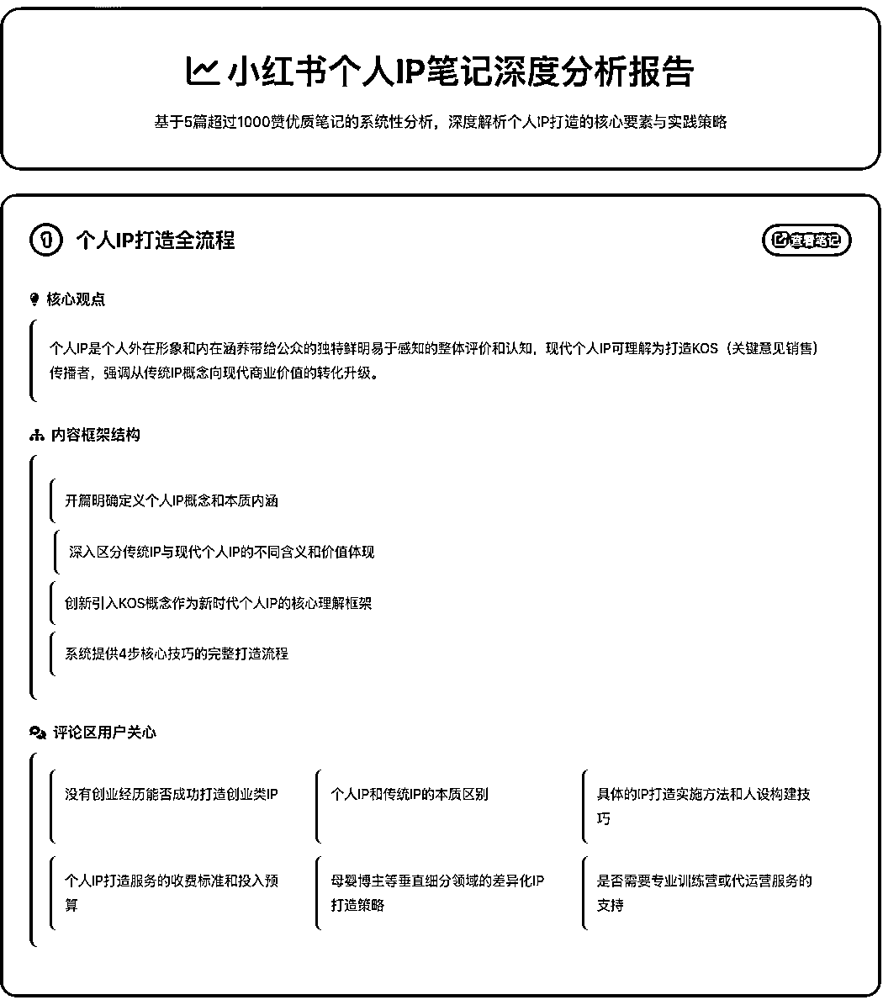
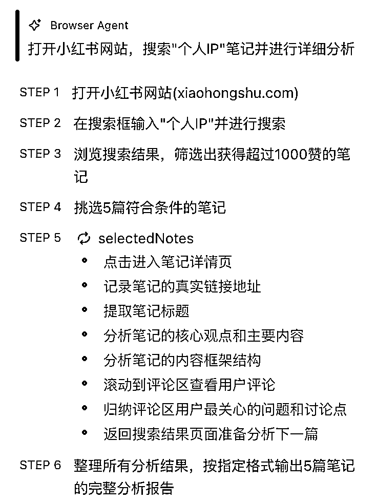
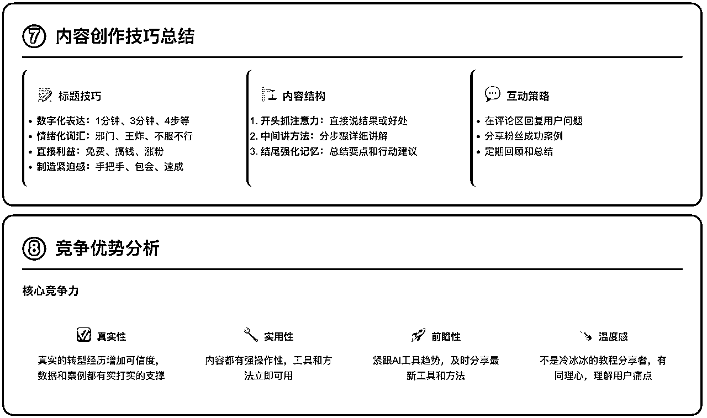

# Fellou牛逼！AI 浏览器自动刷小红书，自动找100篇爆文！自动分析对标账号

> 来源：[https://p03a4vs9s2.feishu.cn/docx/DXybdgEb1oVfdUxnphTc5iPqn0s](https://p03a4vs9s2.feishu.cn/docx/DXybdgEb1oVfdUxnphTc5iPqn0s)

用 AI 做小红书的账号分析，有多简单？

你只需要把这段话复制给 AI ：

分析小红书「xxxx博主」最近 xx 篇笔记，他的账号定位具体是什么？分析他内容的核心观点、账号方向、内容技巧和内容结构等等。把最终的分析结果，以一份可视化html代码输出给我。

然后你就能得到一份非常详细的账号分析报告：

如果你要找爆款对标笔记，也很简单，只需要跟他说：

打开小红书，搜索「个人IP」，找到大于1000赞的5篇笔记，详细分析笔记的观点、内容的框架结构、以及评论区用户最关心的问题是什么？

然后它就会：

当然，你同样可以让 AI 生成可视化html格式给你，AI 会直接给你一个链接，点开后，就是非常详细的对标分析结果：

怎么样？这效率还可以吗？

以上输出结果都是为了写文章，没有去打摸过提示词，但生成的效果依然很不错！这就是现在的 AI 浏览器！

我用的是Fellou浏览器，已经用了好几天了，在小红书上提效，一天比一天震惊。

接下来，具体说一下以上两个案例的效果是如何实现的：

## 1\. 找爆文，对标笔记

让Fellou AI 浏览器工作之前，需要做一下准备：登录小红书。

如果不登录，就无法读取小红书笔记信息。

也不用担心登陆后用 AI 会不会导致封号，我跑了很多流程了，没有收到任何提示，连防机器人的验证都没有弹出。所以这一步，是安全的。

登陆后，把提示词粘贴过去，之后 AI 会给你一个「工作流程」，点一下确认，这个流程就会正常工作。

这里有几个关键点：

1.1\. 搜索关键词

可以一个流程搜索多个关键词，关键词越精准，搜出来的笔记就越精准。所以这里就不要像我一样，直接搜「个人IP」这种大词。

替换成更精准的长尾词，或者用聚光后台的关键词规划工具，看下最近热搜词。比如，替换成「个人ip顺序」，搜出来的结果就更加精准。

1.2\. 爆款标准

不要直接跟 AI 说「帮我找爆文」，要具体的告诉 AI ，什么是爆文？比如我提示词里的，1000赞以上，就算做爆文。

1.3\. 分析结构

在你学习小红书爆款分析课程，或者看相关文章的时候，一般都会有一个爆款分析框架，让 AI 按照这些框架分析，效果会更好。

我在前面演示视频里，只要求分析观点、框架和评论区需求，是因为……我积分花完了……

1.4\. 输出要求

提示词里没有写，但是真正分析的时候，一定要让 AI 按照格式输出给你，否则可能会随意输出，得不到你想要的结果。

在爆款笔记搜集部分，我的输出格式要求是：

按照以下格式输出给我（注意，笔记链接必须是打开笔记后的真实链接）：

标题：

笔记链接：

核心观点：

内容框架结构：

评论区用户关心：

发现了吗，在“链接”部分我特别强调，必须是「打开笔记后的真实链接」，这样在采集链接的时候，才会得到真实有用的笔记链接。

否则可能会得到一个打不开的链接。

## 2\. 分析对标账号流程

按照同样的流程，让 AI 把工作任务换成账号分析，效果同样很棒。

只要把具体博主的昵称复制下来就行了，这里也有几个关键点：

2.1\. 博主昵称一定要精准

如果你跟 AI 说，帮我分析小红书上叫“momo”的博主，你就算有10万积分，也不够你跑的。

为啥？

因为小红书上“momo”昵称的博主太多了！AI 无法识别你说的是哪个博主，它就会一直搜，一直找。或者他会逐个分析……有多少积分都不够你造。

所以这里必须精准，如果你搜一下，发现同名的博主有很多，那就搜他的「小红书ID」，这个ID是唯一的，输入完整ID，一定能出现对应的博主。

2.2\. AI 能播放视频

Fellou 牛逼的地方是，在分析视频博主的时候，它会自动播放视频，并且识别视频的画面、声音，然后基于这些给你分析。

比如之前分析一个账号的，就把内容结构的方法给整理出来了……

2.3\. 可视化网页

我记得之前分享过「如何用 AI 做图片」，里面一个方法是让 AI 生成 html 格式的。当时还需要粘贴到文本编辑器，把「txt」改成「html」。

现在好了，直接跟 AI 说「以可视化 html 格式输出给我」，搞定，直接给你一个网站，打开就是了。

## 3\. 使用小建议

最后我们总结几个最关键的点：

3.1\. 任务一定要具体，这一点很重要

为什么你用 AI ，总是觉得 AI 很傻，生成不到你想要的东西？关键就在这。

不管任何 AI ，一定要把任务非常具体的描述出来。

不要跟 AI 讲：帮我找xxx对标账号、帮我筛选10万粉以上的xxx博主、帮我看下今天最火的笔记……

这些都不是具体任务，要具体到：

打开小红书，搜索xxx，进入xxx博主的账号主页，分别打开除置顶笔记外，最近的5篇笔记（或者判断最近大于500点赞的笔记，如果有，就进入分析步骤），并帮我分析笔记的核心观点、文案结构和选题、爆文特点等等……

3.2\. 流程要足够细致

虽然 AI 很聪明，开头给的提示词，你直接给fellou，它也能识别出步骤。

但如果你本来写的就很细，AI 识别会更精准。

比如，可以详细到第一步打开小红书 ➡️ 搜索账号……

这类细致的流程提示词，可以每个工作流写一个保存下来就行了。

3.3\. 目标要具体

不要跟他说，收集xxx标题和链接……尤其涉及到链接。

一定要具体到：逐一点开每条笔记的页面，复制笔记的真实链接，否则收集来的链接很可能是打不开的。

为啥会这样？

你给 AI 的工作流程是，找到这个笔记。当它看到标题，点赞数符合要求后，就等于找到了这个笔记，这时它复制的链接，很可能就不是笔记本身的链接。

所以涉及到链接的，一定要让它打开了，再保存链接。

3.4\. 信息源要干净

为什么你用 AI ，它总是给你一些废话？或者给你一些垃圾信息？

因为他是全网抓取信息的，网上的信息本来就参差不齐。要降低 AI 幻觉，就要让 AI 的信息源足够干净。

比如，我要每天都要看看小红书官方资讯和最新规则，我不会跟它说：找到最近小红书新规……

而是告诉 AI ，去哪里找什么样的新规。

我会说：

打开小红书，搜索：薯管家、商业广告薯……，收集的信息包括但不限于：小红书新规、热点趋势、违规公示、违规治理、活动通知等等……

另外，再打开「小红书电商学习中心」官网，进入「规则中心」，看看「规则公告栏」的新规通知，还有「公式中」的新规公告……

这样，他给我的信息就绝对干净，绝对是官方信息。

总之，一句话就是，任务足够具体，流程足够细化，信息源足够干净，它帮你做的事情就很靠谱。