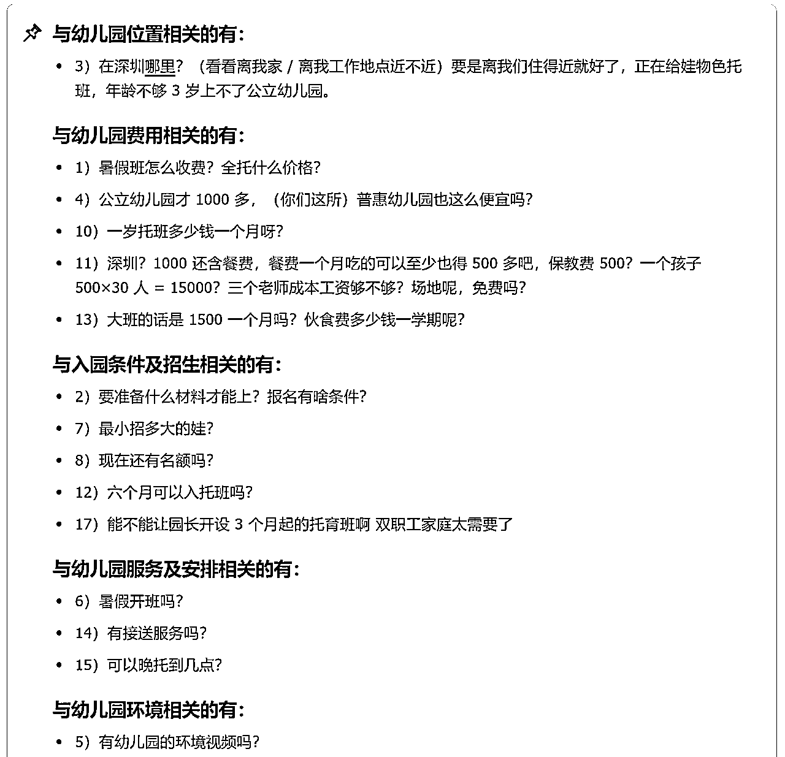

# 帮儿子幼儿园在小红书招生后，我发现了操盘手想赚「安稳钱」的正确和错误逻辑。

> 来源：[https://ncn18orsgwl2.feishu.cn/docx/Yoradi6G4oDvgQxWChXcnrAinFd](https://ncn18orsgwl2.feishu.cn/docx/Yoradi6G4oDvgQxWChXcnrAinFd)

你好，我是珍妮，从留学转行到房产，又因为不断被贵人们带着起飞，接触了美业&教育等盘子，把有的盘子变成了自营盘，而有的盘子，继续以代运营的形式接着，借代运营的力量，培养操盘手。

机缘巧合，因为以上经验，叠加主动帮我儿子的幼儿园在小红书招生后，

我终于明白了操盘手想赚「安稳钱」的正确和错误逻辑。

今天我会借帮幼儿园招生这个例子，和大家分享以下内容：

1）90%的操盘手，都在赚什么样的钱？

2）我为什么要帮幼儿园在线上拓客？

3）我帮幼儿园拓客时，做了哪些准备工作？拿到了什么样的招生成绩？

4）操盘手想要赚安稳钱，应该从哪一步开始？

# 90%的操盘手，都在赚什么样的钱？

90%的操盘手，往往是：什么赛道什么项目分的佣金更多，就冲进去给这个项目做获客。

然而，如果一个项目，大老板甲给操盘手分的佣金很多，那么可能出现以下几种情况：

A）销转极差。靠操盘手送的客资去测试销转率，并且优化销转话术。

B）这个项目的运营获客打法还是从0到1的阶段，适合画一个大饼找到操盘手来跑0-1。

C）交付拉胯。对方的交付端也搭建的不怎么样，不断出新的岔子。

D）销转好，交付靠谱，还分给操盘手很多佣金。长久以往，大老板甲一定会不高兴的。他一定会在做大业务以后，找机会把操盘手踹掉。而操盘手因为没有掌握源头供应链，又没有去了解销转话术，所以会处在不利地位。

E）前期佣金能正常结算，后期老板卷钱跑路。

F）一去平台引流获客就马上被封号，因为本就是在平台红线蹦迪的赛道。

G）交付端一般，没有格外牛的产品竞争力。

此时操盘手不愿意真人露脸去为这个产品站台，只敢在平台做没有IP、无法露脸的矩阵号。

当平台越来越卷的时候，操盘手就只能继续上矩阵号增加运营成本。

当太多操盘手在平台写【伪素人第三方推荐种草文】、写【没有IP色彩的营销文】，那么这种内容就是不受读者和平台欢迎的。

因为到后面，读者也不知道自己应该相信谁，所以这些内容势必会被平台打压，直到后面，操盘手发现自己的运营成本越来越大，而自己分到的佣金还无法覆盖运营成本。

这就导致很多操盘手，如果去做一些佣金高的项目，而供应链却没法掌控在自己手里的时候，操盘手就没法或者很难长久在这个赛道工作。

这也导致操盘手没有办法赚到“安稳的钱”，永远不知道“自己会不会在有一天就没钱赚了”。

所以，操盘手想要赚安稳钱，应该从哪一步开始呢？

我会以【我给幼儿园招生】这件事情作为引子，在第四章节和大家分享：操盘手想要赚安稳钱，应该从哪一步开始呢？

# 我为什么要帮幼儿园在线上拓客？

今年6月的时候，我儿子的幼儿园在线上召开家长会，大致是说：“深圳太多幼儿园倒闭了。我家小孩所在的幼儿园，因为面临招生压力，准备下学期继续降学费，并且增加外教课。”

我并没有在腾讯会议看到老师们的脸，但是我隔着会议里的声音，感受到了老师们的压力和无奈，是那种真的感到“担心要倒闭，不知道哪天可能就要关园、裁员的无力感”。

我孩子所在的这家幼儿园，是深圳的普惠私立幼儿园，在深圳南山这个片区，学费算是非常非常划算的了。

幼儿园建校已经31年的校龄了，能挺过口罩，挺过这么多年风风雨雨的幼儿园，必定有几把刷子。

我线下见过园长和老师们，我第一次见的那天，我就知道，我把孩子放在这所幼儿园准没错。

一是因为直觉。

二是因为：我懂娃姐（ayawawa）的石剪布理论，我深耕学习这个理论3年了，总共学了5年了。

我能从一个人的神态、说话时的语气、甚至平时喜欢发的表情包、和我聊起的自己平时的工作习惯或者婚姻状态，我就能大致猜出这个人的属性、以及这个人适合去什么样的岗位。

我们公司招人用人，我都有用石剪布这套理论的，百试不爽。

所以无论一个人在我面前把自己包装得多么高大上、伟光正，我都能猜出：

1）ta会做些什么

2）ta靠什么赚钱

3）ta能赚什么钱

4）ta不能赚什么钱

5）和ta合作我要注意什么。

我遇到幼儿园的园长和老师们的那天，本来我还要去下一家幼儿园再看看的，但是看完这家幼儿园后，我就没有再去下一家了。我知道我找对幼儿园了。

如果幼儿园倒闭，我家小孩就要去换新的幼儿园了。2岁多的年龄，要不停换幼儿园，对孩子来说肯定不是什么好事。

而且下一家幼儿园的园长和老师，不一定能够让我这么放心。

我是真心认可这家幼儿园，我不希望他倒闭，所以我就去帮幼儿园拓客了。

# 我帮幼儿园拓客时，做了哪些准备工作？拿到了什么样的招生成绩？

我将从以下环节拆分我此次的拓客工作。

1）对幼儿园赛道加以调研

2）和园长主动聊合作、聊佣金。（未果）

3）擅自拍短视频，直接开始帮园长招生。

4）获得园长信任、拿到幼儿园的招生素材。

5）梳理文案爆点给到我的助理，让她帮忙写稿子。

6）收到正反馈后，马上找操盘手帮忙放大、写稿子、我负责指导操盘手。

7）写一篇公众号软文，植入我的教育观念以及这家幼儿园的名字。

8）帮忙招生后遇到的意外之喜

## 1）对幼儿园赛道加以调研

给幼儿园拓客很简单。

我当时花了不到3分钟时间在小红书调研了一下深圳幼儿园，我就知道这个赛道可以干。

我曾经在6月的广州航海家大会时担任过夜话嘉宾，在那场夜话里，我有发过纸质资料给到当时参与夜话的友友，纸质资料上写的，是：

【我如何判断小红书各个赛道的线上引流卷王程度】

因为是纸质资料，所以很多友友是快速看完后找我提问的，以至于即使有夜话录音，也没法听到当时现场关于卷王程度的分析，因为大部分人当时都是在看资料，而不是发声。

## 2）和园长主动聊合作、聊佣金。（未果）

一开始我还想赚点钱。

我就去问园长：如果给贵校招生，佣金怎么算？

园长显然不熟悉佣金这个东西是咋回事，估计之前做自媒体拓客的人还没有想过要去和幼儿园有深度合作。

所以幼儿园这个赛道，还属于“没被自媒体操盘手们上矩阵号洗过的赛道”。

我是6月12号给园长留言的。

6月13号园长没有答复我，估计她也不知道应该怎么算钱才比较合适。

## 3）擅自拍短视频，直接开始帮园长招生。

6月13那天我没有收到园长答复。

我看了一下日历，当天是周五。

我和不同的人合作过太多年了，我明白有些人周六日是不回复消息的，所有进度条都可能要周一才能继续推进。

我做事是个急性子，让我拖拉一天我自己就急的不行了，所以很多时候是团队里的人还在慢悠悠的时候，我已经开始干了。

算了一下：周五不答复我，就要拖到周一去了，每拖一天都会导致这个幼儿园面临更大的招生压力。

我创业好几年了，我太懂“早早出手、行动起来”有多么宝贵了。

于是，6月13，我也没有等园长答复我，我擅自开始拍了一条短视频，自己粗糙剪辑了一下，就发视频号了。

当时做好了准备：“即使园长不给我佣金，我也得帮她拓客。帮园长就是帮我儿子。为了我儿子有个稳定点的成长环境，这笔幼儿园的佣金，我不赚了。”

结果因为这个视频，园长非常感动。

我于是问园长：我是否可以把这条短视频发到幼儿园的家长群里、并且让我作为家长身份、去幼儿园的微信群里夸夸这所幼儿园。

（之所以要找园长确认是否可以这么做，是因为我擅自在别人的微信群里发我自己的视频号是很不礼貌的行为，有引流的嫌疑。）

园长同意后我又火速去托班群里，把我的视频转发到群，然后写长文感谢了一波幼儿园。

果然，其他家长在群里跟着感谢幼儿园。

（于是我把好评截图下来，拿去当了小红书引流拓客素材）。

## 4）获得园长信任、拿到幼儿园的招生素材。

因为这波真人出镜+带头去家长群里感谢幼儿园的行为，我获得了园长的信任。

园长很感谢我，于是我赶紧问园长要招生素材。

## 5）梳理文案爆点给到我的助理，让她帮忙写稿子。

当天晚上我梳理了这家幼儿园的优势给到助理，让她开始写稿子，写完稿子后我来复审，然后就发布了。

下方是珍妮作为家长角度，梳理出来的该幼儿园的优势。

结果第二天客资就爆了。

有的小红书家长想要了解晚托班，因为我没送我孩子读过晚托班，所以我找园长核实了一下。

## 6）收到正反馈后，马上找操盘手帮忙放大、写稿子、我负责指导操盘手。

收到正反馈后，我想要快速铺一些素人号。

我就找了几位操盘手写稿子。

我是按篇数给操盘手付费，一共买了24篇软文。

当时找了6位操盘手，每位帮我写4篇稿子。

他们写稿子的时候，我会教他们“怎么写稿子是对的、要如何优化”。

以下是我当时优化稿件时的部分分析，感兴趣的友友可看：

至于幼儿园的宣传思路，是我用一套固定话术生成的，生成出来的思路如下：

当时操盘手们爆过的稿件如下：

## 7）写一篇公众号软文，植入我的教育观念以及这家幼儿园的名字。

仅仅帮幼儿园拍视频和发小红书，是不够的。

因为如果是拍短视频，短视频能容纳的观点有限，如果是要发长长的一段观点，有些家长可能看不下去。

如果是发小红书，小红书一下子多出来20多篇软文，有的家长会质疑这家幼儿园在炒作，反而给幼儿园招生带来负面影响。

据珍妮对深圳家长的观察，

深圳有些家长会喜欢在微信里面直接搜索这家幼儿园。

对微信搜一搜功能熟悉的友友都知道，搜一搜功能不仅能搜到视频号，还能搜到公众号。

而公众号的长文，是特别适合植入很多观点、写深度长文、与读者建立信任的。

这就代表：

只要珍妮写一篇公众号长文去植入我的教育观点，并且在长文里面植入这家幼儿园的名字，

那么去微信搜索搜这家幼儿园名字的人，一定会搜到我的视频号和公众号。

当读者在小红书刷到这家幼儿园的时候，他会对幼儿园建立第一层信任，但是他一定会犹豫，他会试图去短视频平台或者公众号平台再次搜一下这家幼儿园，并且线下去看看这家幼儿园。

刷到珍妮以真实家长身份为这家幼儿园发声的时候，他会对这家幼儿园建立第二层信任。

刷到我写的公众号长文的时候，他会对幼儿园建立第三层信任。

这时候他再刷刷园长视频号，加上园长微信，线下访校，基本就能快速把信任建立起来了。

所以我就动手写了一篇软文。

软文前半段是写我的教育观点。

后半段植入这家幼儿园的优势。

并且在后半段的文字里，就“小红书家长喜欢在评论区提的问题”，给出了答案。

以下是我当时写的软文节选：

以下是我当时整理过的“小红书家长喜欢在评论区提的问题”

（把评论区家长们提的问题搜集下来，然后让豆包帮忙做分类整理即可。）

## 8）帮忙招生后遇到的意外之喜

帮幼儿园招生后，我遇到了一些意外之喜。

深圳某几十万粉丝、房产大V的合伙人的老婆、因为这个短视频、加上了我的微信，然后也把孩子送去这所幼儿园了。

熟悉我的友友知道我是从留学转行到房产的，

所以因为帮幼儿园招生这件事情，

因为和大V合伙人的小孩都在同一个幼儿园这件事情，

我又和房产界加深了一层联系。

而且因为对方的老婆加我微信后，曾经在7月、问我孩子在哪个暑假班的群，我才知道现在这个幼儿园已经招到至少2个班起步的暑假班了。

而我6月18左右，园长还只是和我说：有11个客户从小红书过来咨询了，我没想到到7月那会已经发展到招了2个班起步了。（我没去问园长到底招了多少个学生，因为在我没有问别人要佣金的情况下，我还去问到底招了多少个学生，就显得有点暗示园长给我转钱的味道，所以我没有去问。我只知道园长特别感谢我。）

# 操盘手想要赚安稳钱，应该从哪一步开始？

我从20年就在尝试创业，准确来说是21年12月初步创业成功，22年进入放大阶段。不管是当时做留学的自营盘和代运营，还是后来做房产，以及接一些代运营，

我发现：每次当我感到“我是在赚安稳钱”的时候，我做的事情一般会有以下特征：

1）供应链在我自己手上，我熟悉交付端，我可以自己调整供应链。我可以不断优化我的产品竞争力。

2）哪怕我不是一个擅长销售的人，但是销转环节我是知道的，我知道整个过程。

3）我做的事情是在打造我自己的个人IP，打造我的影响力，而不是在背后做一个默默无闻的操盘手，给人打客资。

4）我做的事情是真正对社会有价值的，而不是只有我自己和少部分人在赚钱的。

以上4个特征，在做项目的时候，必须要符合其中至少3个特征，我才会感受到自己是在赚安稳的钱。

那么哪些事情、会让人感觉“虽然自己好像也挺努力地在工作”，但依旧觉得“我不是在赚安稳钱呢”？

1）供应链不在我手上，我没有改良供应链的能力，而我在培训一线运营人员如何从小红书获客。

2）签多少个单子，不是我能直观看到的，是别人报给我的，每月给我结算佣金。

3）这个供应链我完全不感兴趣，只是为了赚钱而赚钱。

4）我没有花时间打造自己的影响力，沉迷在一线干活，被老板pua【我没有不可替代性】。

5）我做的事情并没有对社会很有价值，就是纯粹搞了些钱，甚至如果客户不买我推广的产品，他可能能遇到更好的产品。

以上是珍妮本人的情况，我还发现，其他操盘手会做以下事情，导致他们赚的钱也不够安稳：

1）不好好学运营获客的能力，一直在玩AI上矩阵。当写稿质量不行的时候，就算数量铺满了100个账号，也会发现自己出爆款的号也就那么几个，比不上别人精耕细作两个号赚的利润大。

2）学了运营获客的能力，但是不愿意接触销转端，销转完全被人拿捏。

3）学了运营获客的能力后，又开始提升自己做流量的能力，比如去学剪辑拍摄。结果自己的供应链和销转都非常糟糕，成交率也低。而且这时候，只懂运营获客和剪辑拍摄就永远只能卖私教陪跑产品，因为自己没有某个赛道的靠谱供应链。

珍妮之所以有以上感悟和发现，是因为以下经历：

1）【做留学自营盘和代运营盘】的经历

我做留学自营盘的时候，我改良了整个供应链。

举个例子：

2020年，我在当雅思老师的时候，我发现很多雅思写作老师没有时间给学生改雅思作文，要么随便改改，要么老师自己也不会改，要么没有精力去改，所以很多学生的雅思写作分数也很难提高。

但如果能有一个精细化的批改，学生的写作成绩是可以早一点提高的。

所以我当时搭建了第三世界国家的外教供应链，找外教帮我改学生的作文。外教在第三世界国家，改作文的价格很低。我白天当雅思写作老师，晚上把学生发给我的作业外包给老外，又能收获一堆好评，学生又能提分，我还不用改作业改到深夜。

因为我是一边兼职当雅思老师，一边创业的，在创业很拮据的一段日子，我把这个生意变成了“留学生论文dai写”的生意。我从dai写机构手里接单，千字400元，然后我外包给老外去做，我负责审核，结果把自己干成了这个机构的金牌写手。

但是做dai写很累，也很hui产，我怕做久了会有损福报，我那时候也不懂引流拓客，撑死一个月赚净利润1.8万，

所以我就洗白上岸了，只做英语论文的润色与翻译业务。

因为我在国外留学过，又曾经做过雅思老师，还做过dai写生意，所以我特别能看出：留学生写作业需要什么样的润色业务？

于是我就改良了供应链。这个产品刚推出就卖爆了。哪怕后来因为小红书对这个行业严打，哪怕AI出来了，哪怕我早就因为频繁死号没有再在小红书引流了，可是这个生意，到了2025年，还有客户在给我转介绍。

相反，代运营，因为供应链不在我自己手上，所以我没法改良供应链，当甲方一个月烧40万聚光投放费来抢占市场份额的时候，这个生意我就没法干下去了。甲方背后有大企业资本投资，我一个小创业人，不可能自己一个月烧50万去和甲方抢份额。

2）【为了把运营获客的打法梳理出来，让新人能快速学会运营，而一周六更运营打法】的经历

我因为做了一件【能给自己团队和别人团队】提供价值的事情，而突然拿到了很多市场的正反馈。

举个例子：

我在24年那会，觉得自己总是在一线培养运营人员真的很辛苦。

运营人员是会离职的。每离职一个，我就要重新培养一个。

有的运营人员没有自我迭代的能力，以至于我们矩阵号一铺，每三个月就要迭代运营打法的时候，运营团队全在盼着我去优化打法，真的很累。

而且由于我天天在我自己的赛道琢磨打法，我看不到其他赛道的运营打法，所以我的视野是很狭窄的。以至于当我也出现信息茧房，不知道怎么迭代运营获客的时候，我也会病急乱投医，花钱买一堆课程，最后对我的赛道没什么用处。

那时候我在想：

是不是可以把我做运营的思路写下来，给到一个培训指南，这样我们内部的运营人员就看我这个指南去学就好了呢？

是不是我应该去花时间看看别的赛道是怎么获客的，从中借鉴一些，找到灵感？这样我下次获客遇到瓶颈的时候，我不至于把希望全部寄托在别人身上。

所以我就一周六更运营打法，从24年3月1号更到了25年3月31号。因为25年我想腾出更多精力做自营盘业务，所以我从4月1号开始变成了一周三更运营打法。

而24年3月1号的我，并不知道：我的命运齿轮会因为这个事情而转动。

我从没想过：我可以靠【更新运营打法】而赚到钱。

结果，恰恰因为更新运营打法，我被很多人看到，他们发现我竟然真的能够做到一周六更运营打法且不灌水，所以我的IP突然在24年打起来了。

广州航海家大会，是我第一次参加线下聚会，竟然有很多人过来和我合照，把我都整懵了，这是什么待遇，我从来没遇到过这种事情。

但也正因为IP打起来了，所以我终于有了一些安全感。

因为在那以前，我也会经常怀疑自己：

“我是不是真的运营能力不行？别人说我运营能力不行而导致团队业绩下滑、这是真的吗？是我的原因还是产品的原因还是平台的原因?”

“别人说我没有不可替代性，只是在一线做培训而已，所以当我不想被人抽那么多成的时候，我是不应该提吗？”

自那之后我知道以上疑惑，都没必要疑惑。

如果有人评价我算账能力不行，我承认，我没有任何波澜，因为我就是不行。

以前有人评价我运营能力不行，我不承认，但也会怀疑自己。现在我没有任何波澜，因为我知道我很行。

以前有人说我没有不可替代性，我不承认，但我也会怀疑自己。现在别人说我没有不可替代性，我就换人。

因为我从市场上拿到了太多正反馈，太多人来感谢我，

我知道自己的长板在哪，也知道自己的局限性在哪，我不会再因为有人负面评价我而去再怀疑自己。

25年我都懒得像从前一样怀疑自己甚至内耗了，因为我天天从市场上收获正反馈，忙得很，天天干劲满满。

3）【转型后做自营盘时，把销转抓在自己手里】的经历

25年，我们转型后做自营盘的时候，内部团队做了一轮大调整。

以前我做代运营，是把客资加到自己微信后，再拉个群给合作方。

或者直接让客资去加合作方的微信。

今年我们改了，我们把客资直接加到了自己或者自家的助理号微信。

我们自己销转，收了客户的钱以后，再给到交付方去交付。

我们挑交付方，专挑【供应链好把控】的交付方。

如果交付方不实诚，我们就不合作了。

以前做代运营，别人愿意分25-30%的钱给我们就不错了，

我们自己拿到了流量和销转，翻身成为甲方爸爸后，

我发现到处都是质量靠谱又不擅长做流量和销转的交付方，他们竟然有人愿意分60-70%的钱给我们，直接把我们整懵了，分成最少的人都会给我们20-30%，而且是建立在对方自己已经有IP的基础上。

当然我们不会因为别人给我们分70%，我们就真的拿走70%的钱，因为我们担心交付方不靠谱。

所以我们会先筛选交付方的交付质量，然后再去决定如何谈分成方案。

4）【帮我儿子的幼儿园招生】的经历

操盘手要去找：在不考虑佣金的情况下，自己都愿意真诚去推、且以真人名义去推广的项目，此时说明这个项目的交付一定很靠谱。

而且，

只有当我们自己愿意露脸、不要钱都愿意赌上自己名誉去推广的项目，往往才是我们真正从内心认可的项目。

这时候我们会收到宇宙的正反馈，因为宇宙会告诉我们：我们做了一个利人利己的事情，而不是只利自己、不利他人的事情。

而【帮幼儿园招生】这个事情，让我更加意识到了：

只有真正找到好的供应链，找到操盘手本人愿意露脸站台的项目，才是操盘手能稳稳赚钱的基础条件。

# 总结：

结合以上经历，我发现：

真正能让一个操盘手长长久久、稳稳赚到钱的，还是回到了IP&供应链&销转三件事情上。

1）打造自己的个人IP。

2）筛选优质靠谱的供应链，且自己有能力优化这条供应链。

3）把销转掌控到自己手里。

除此以外，其他无IP的泛矩阵号、靠AI洗稿上号、天天琢磨剪辑拍摄技巧、沉迷在一线干活而不出来打造影响力啥的，都是没法让人长长久久赚到钱的。

所以，除了迭代运营获客能力以外，我会把接下来的时间拿来去广东线下筛选优质的供应链，而不只是当一个在线上做获客的人。我们团队有人擅长运营获客，有人擅长销售成交，有人擅长团队管理，我们现在只缺优质靠谱供应链。

欢迎有优质靠谱供应链的圈友滴滴珍妮。

欢迎需要帮幼儿园招生的幼儿园幕后大佬滴滴珍妮。

# 致谢：

感谢和我一起做幼儿园获客的操盘手，

他们是（排名不分先后）：

乔庭（微信昵称：乔庭|黄金姐）

阳明（微信昵称：日月山河永在）

乾风（现微信昵称：侯重华）

云蕾（微信昵称：黄云蕾）

一泽（微信昵称：一泽）

慧敏（微信昵称：栗子）

他们有的就在生财有术这个圈子，我是在生财遇到的他们。

感谢和我一起前行的合伙人和各项目操盘手，在从代运营变成自营盘这件事情上，我们经历过太多风雨，正因为有大家在，才能一起面对解决这么多问题。

感谢生财有术，我之所以能转型成功甚至遇到这么多一块合作的、有能力的搭档们，都是因为生财有术照亮了我，让我突然被很多人看到，从而有机会和各个大佬们合作，一起迎接创业路上的风雨和彩虹。