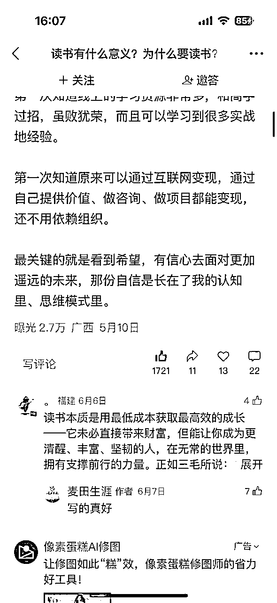
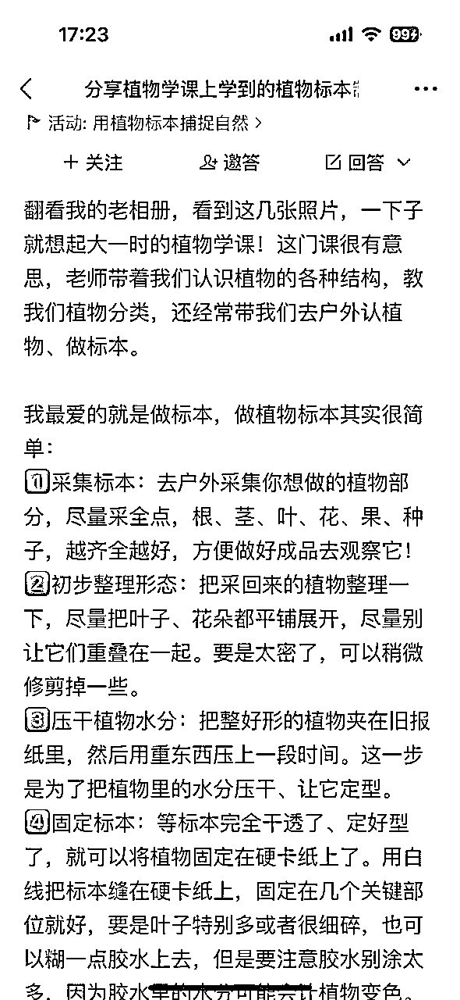

# 只用一部手机，我在微信问一问跑通副业闭环，日入200+实测分享

> 来源：[https://nk9l8wuzv3.feishu.cn/docx/V8Tfd1AJhoHWC9xpCxOclQsqn0g](https://nk9l8wuzv3.feishu.cn/docx/V8Tfd1AJhoHWC9xpCxOclQsqn0g)

## 一、个人介绍与项目成绩

我是麦几，一名优势转型教练，目前主业央企HR，副业深耕生涯规划、就业指导、盖洛普优势教练近8年。目前是广西区、桂林市人才服务中心特聘就业导师，每年都参与线下招聘会就业指导、讲座、生涯规划大赛评委等10余场。累计有600+一对一客户，B端高校、企业等30+。

#### 为什么要做“问一问”

微信“问一问”是微信于2023年推出的社区问答功能，依托微信搜一搜平台，允许用户提问并获得解答，同时为创作者提供流量入口和变现机会。

做”问一问“这个项目最早可以追溯到2023年，那时平台还是用微信号直接回答的，没啥水花就放弃了。直到2024年看到这个项目又可以启动了，开通分成计划就能拿到收入。

对于职场人想要尝试去突破自己，开启副业，开店要资金、滴滴外卖这些没有增长……而问一问，就是一部手机、一个账号，随时随地就可以开启你的输出。

如果你想从0开始尝试自媒体，在互联网拿到第一笔收入。这是一个非常好的小成本、快速跑通闭环的项目，快的小伙伴10天就可以完成分成计划开通，而且可以依托微信这个大平台把小输出作为我们的练手项目，真的再适合不过啦。

#### 入局成绩（持续变动中）：

##### 

我的账号是11月开通分成计划，因为没有定期更新收益不高，在1月16日爆了一条内容后开始日更，收入基本稳定

截止目前2个账号开通分成计划，每天投入 20分钟，回答2个账号，每个账号日更1条，流量主总收入5000+，平均一个月约1000元

收入其实和你的内容输出数量也有关，有些伙伴日更5-10条，当然他们的收入就会更高，投入越多回报越高

#### 公众号关注数增加近700，视频号关注数增加200+，总曝光过百万

#### 队友（完全零输出经验）实测成绩：

*   用不到1个月的时间跑通闭环（开通分成计划），随后秒开通第二个账号，两账号总收入近7000

*   他虽然是新手入局，每天用心回答、不知道的问题还去搜索找资料等等，收入正反馈很快，日曝光量最高达2万+

*   单日最高收益可达 200+

*   相比公众号的大起大落，问一问收益相对稳定，虽然金额不大，每天都有流水，正反馈极快

队友主号收入（截止7月4日）

## 二、为什么写这篇帖子

*   帮助想做副业却不知道如何开始的人，提供一个 0成本、正反馈快、简单可复制的入门项目

*   通过真实实测案例让大家看到“写点小东西也能赚钱”的确定性，先跑通闭环建立信心

*   作为长期副业前的练手项目，同时培养输出能力

*   可为公众号/视频号持续引流

*   可以通过公众号/视频引流到私域，成交你的产品（最近有一位写作者链接我完成了一次采访）

#### 这是一个 “低门槛、低成本、反馈快” 的副业项目

对想做副业又没方向、想练习输出又想赚钱的人来说非常适合：

✅ 不需额外花钱

✅ 碎片时间可做

✅ 每天都有流水，建立信心

✅ 为长期副业和IP沉淀打基础

如果你正打算找个项目先跑通0-1闭环，这个项目非常值得试一试。

#### 增加人生厚度、构建一致性家庭目标

*   带着队友做这个项目，为了积累素材，包括桂林的一些旅游景点、餐厅等本地搜索流量的布局，我们家刻意增加了很多外出体验的机会，原本可以在家里躺平的他，开始不断寻找周边好玩的地方，一起增加了很多人生体验与厚度

*   认知提升：把所有的消费都变成生产力，这点一定要划重点，我们家日常的小消费都赚回来啦

*   亲子关系优化：孩子看到我们做问一问，自觉让我们先拍照，而且自己也说要做问一问，等她大一些完全可以输出自己的内容，提升自己的写作能力

*   提升写作能力：截止目前我回答了570题，每题按照300字计算，输出有15万，够一本书啦

## 三、项目简介：

1.  什么是问一问？

是微信平台基于“搜一搜”搭建的一个问答平台，不同于百度和知乎，这里单个问题回答字数限制在500字，也意味着你不需要长篇大论，从平台要求的「优质」「真实」「实用」「个人特色」这几个维度去发布和回答问题。

下图是我在5月份的一篇内容，在6月份开始曝光达到2.7万，点赞1700+，评论22

1.  怎么进入“问一问”？

*   微信主界面 → 点击底部“发现” → 进入“搜一搜” → 选择“前往问一问”。

*   可以关注“微信问一问”公众号，点击下方的创作活动、问一问都可以进去

1.  开通分成计划的要求和标准

问一问创作分成计划是指：为符合条件，持续发表优质内容的优质创作者，提供在优质内容的评论区展示广告，参与平台广告分成的模式。

*   近90天发布大于30条内容 + 有效关注人数大于100人（需通过问一问平台关注）

*   满足质量要求，详见官方指南https://docs.qq.com/doc/p/acbbb2fbb125ae8d6a8d965db119155c7aef8fae

✅ 真实分享，真诚创作：基于真实经历、体验和感受进行创作，如有需要可搭配实拍图等素材充实内容。

✅ 贴近生活，讨论兴趣：分享日常生活中的细微观察，或是围绕兴趣进行同好交流，持续分享引发共鸣的见解。

✅ 专业翔实，深入浅出：结合案例和细节分享自己的经验和感受，用生活化和简明自然的语言创作表达。

✅ 简明扼要，清晰易懂：表述方式简洁明了，能抓住要点，同样的信息量越精炼越受欢迎，切忌啰嗦、空洞的长篇大论。

*   达到以上要求后可申请开通创作分成计划

*   🧡注：90天是指你在这个期间至少完成这个数量，如果你10天完成了以上数据，也是可以直接申请的哦。

1.  获得收益

当你通过分成计划审核，录入你的个人信息、账号等，就等着通过审核拿到收入啦

问一问的结算是半月一次，会有邮件发送到你的邮箱，这些收入也会综合纳入到你的个税

最终收到的收入会涉及到扣税，这点我们就不用额外自己交税了，很方便

## 四、项目具体玩法拆解（重点）

#### 准备阶段：账号准备

*   注册微信公众号或视频号，这个大家可以搜一搜就知道啦

*   评估定位你的输出内容与方向，平台有各种分类，你可以选择你感兴趣、有内容输出的方向才更加容易起号

*   初始账号未开通分成之前建议走相对专业路线，聚焦一个方向更加容易被官方运营看到，不错的创作者有单独的领域群管理，也会和大家讨论、分享话题等，这块服务还是不错的，但是和流量、收入不是一个部门

*   从挣钱的视角，目前看到流量比较高的是生活类的和相对稀缺的、独特的（这个需要自己去挖掘哈，不能透露），也在变化中，之前有段时间育儿、旅游的也不错

*   可以从问题广场点击进去，上方滑动就可以看到很多领域，可以点击进去查看你想要输出的方向和领域

*   专注在真人、实感、实用、有价值这些方向中，也不要被定位限制，比如你的身份、职业、兴趣爱好等等都是全方位的你

#### 快速达到开通条件：定位+输出（最好日更）

*   发布30条内容（建议10-30天内集中完成）

*   新增100+关注（通过回答高热度问题与原创发布动态积累），必须要通过问一问入口关注，可以适当让你的家人、朋友帮你关注，当然最好是通过内容吸引自然流，一个爆款内容可能会几天就达成这个任务

*   满足条件后提交申请开通分成计划，若首次不通过，需要10天后再次申请，再次审核不通过就要等30天，期间需要持续发布优质内容。

#### 日常运营步骤

初期需要投入时间比较多，每天投入30分钟到1小时，具体步骤如下：

*   每日可以发布1-2个你擅长的内容，可以展示你的个人特色

*   定期收集高热度问题（关注多、回答少的问题）放在你的草稿箱中，没有思路时可以去回答

*   日常收集、拍摄各类真实图片，切勿使用网图、AI图，问一问审核非常严格（来自官方指导）

*   利用 语音输入+笔记整理（get笔记） 加快内容生成效率

我比较喜欢用get笔记，随时随地把自己想要讲的内容语音输入，软件会去掉我们的语气词等整理为文字，这个内容就可以稍微调整后就可以直接复制输出到问一问啦。

#### 如何通过提高内容质量，拿到更多曝光？

*   找对标，寻找自己领域优质的账号，学习别人的方法和回答内容

*   参与官方的活动，官方会有运营组定期发布一些内容，你可以积极参与回答，抢占好的位置，也会得到曝光，进入问一问之后右上角有个头像，点击进来，在你的账号下方就有很多“创作活动”，可以发布也可以回答

*   好标题：有亮点、简单明了，有情绪指引共鸣，

*   ✅好标题：满园“金”色关不住，春日限定大赏-黄花风铃木，❎坏标题：扎心了！千万别再XX

*   ✅好标题：成都周边古路村徒步一日游玩功略-四川版悬崖绝壁虎跳峡；❎坏标题：xxxx，90%的人都XX

*   好图：优质图片，不需要像小红书一样很夸张，而是稍微修饰的美图即可，真实而不过分夸张是平台的需求

以下都是平台推荐的精选回答、精选发布，大家都可以去点击进去查看，图片不夸张、真实、吸引人就是好图

*   好内容：按照平台要求去输出自己的价值，可以帮助到别人，也可以转发吸引更多人关注、点赞、评论等

1\. 提供实用价值，有实际意义

2\. 分段展示，给与好的观感

3\. 分类整理、信息齐全

*   好评论：收入与你的评论区广告有关，需要有优质、有价值的评论

不是水内容、无关的即可，决定着你的评论区广告的展现

#### 内容产出注意事项

⚠️踩过的坑：

*   避免大量刷流量回答水内容，易限流

*   队友被无预警断流过两次，恰好是赚到200+的时候流量断掉，每天只有几分钱，10天后恢复，需要持续发布优质内容后回归，但是流量相比之前已经少了很多。

*   封号多因蹭热搜写水内容，建议以实用经验分享为主

*   过往那些很简单的攻略贴就不要再跟风了，很容易被限流

*   红线：不要用纯AI生成内容和图片，这是平台严禁打击的，当然出现问题时可以去申诉，我的内容被误判后申诉就通过啦。

🎗️总结：

*   内容务必原创或深度改写，严禁纯AI生成，避免封号、断流风险。

*   避免过多蹭热点或无价值的水内容，以实用干货为主，持续提升内容质量。

*   每天固定频次持续发布，逐步稳定增长关注度和收益。

## 五、总结

*   ✅为什么建议新手做这个项目？

我把问一问称之为“公域朋友圈”，如果你的朋友圈不太方便发，那不如把内容分享到这里，可以展示真实的自己，包括你的人生体验、经验、吃喝玩乐、美妆、汽车等等，只要你有内容、只要你想分享，都可以展示你自己。

*   如果你想开始副业，却不知道做什么、担心投入太高或太复杂，这个项目能帮你先拿到 第一桶副业正反馈

*   同时锻炼持续输出能力，后续可配合公众号/视频号引流，不管是做公众号爆文、IP、视频号等等，都是一个渠道补充，另外也可以反向增加流量。

*   无需额外成本，仅需手机+零碎时间，就能跑通闭环拿收益

*   不需要带着做号的心情去输出，否则一开始很容易陷入流量、收入的驱使，做真实的自己最容易

*   ✅对正在 0-1 创业的新人一些过来人的建议和鼓励

*   作为优势教练，我更希望大家可以找到自己的优势，用自己擅长、喜欢的方式做自己热爱的事情，同时又能赚到钱

*   坚持记录，本身就是一个很大的价值和意义，当你过年后回头看你的输出，一定可以给你留下美好的回忆

写在最后，生财真的是非常棒的平台，这次的内容输出非常感谢生财官方运营@黄阿兜🧡的指导，她拿出专门时间来指导我该怎么写，还帮我列了框架和大纲，真的超级赞。

对比生财平台拿到很多大结果的伙伴，这个项目真的很小，但是也恰恰是很快、很容易拿到结果，对于职场人、小白等等，想要通过写作赚到钱、构建自己的IP，问一问真的欢迎每一位愿意真诚分享的伙伴，也祝愿每一位伙伴都能收获成长、拿到结果，一起生财有术。