# 从小白到老油条的蜕变，在抖音，我是如何从3个月亏掉了50w的小白到开店第一个月做到184w营业额的老油条，实战保姆级攻略分享

> 来源：[https://mq5iejby4xc.feishu.cn/docx/YqBedJFtwolvAoxUPuHccrXonWh](https://mq5iejby4xc.feishu.cn/docx/YqBedJFtwolvAoxUPuHccrXonWh)

大家好，我是子贤，广州人，刚加入生财117天

目前主要深耕抖音电商，主营的赛道有：家具，女装，百货

看到生财很少有讲抖音电商的文章，决定自己写下这篇保姆级攻略

这篇文章主要复盘一下自己，如何从电商小白，3个月亏掉了50w的小白到开店第一个月做到180w营业额的心路历程，以及自己对当下抖音电商的一些思考，最后献上保姆级攻略

废话不多说，下面是我近期店铺的数据

1号店铺：

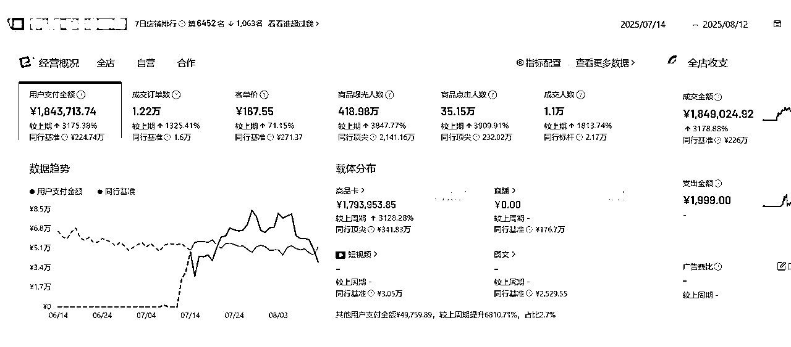

2号店铺：

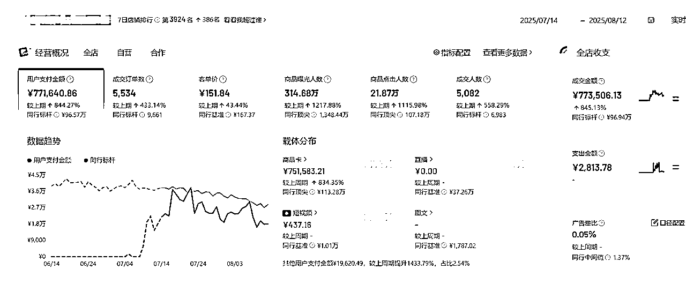

3号店铺：

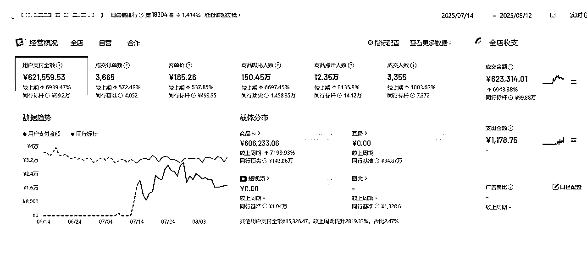

如图可以看到七月份开始起的店，截止到8.12，跑的最好的店铺营业额跑到了184w，其中短视频直播广告成交占比都为0，其他两个店铺也到了60w以上，操作流程，全部工作均由运营助理根据sop流程完成

引用亦仁大佬的一句话：数据可以默认是假的，但是流程是通的

# 文章主要分为六个部分：

## 我是如何进入到抖音电商这个赛道，从小白到老油条的整个过程

2020年大学毕业的我，校招进入了深圳的一家继电保护行业龙头公司，公司的前身是国企，后因国转私，被集团收购，主营业务是给国家电网提供继电保护装置，当时是在研发中心负责研发工作，工作了两年，代码撸到头秃，厌倦了996，一眼望到头，一心想要自由的我，在22年中毅然选择了离职

2023年开年，因身边一个大哥是做进口红酒的，我在他的扶持下，从未想过做电商的我，进入了抖音直播这个赛道，从此命运的齿轮开始了转动

刚进入这个行业，跟大多数小白一样，像个无头苍蝇一样，到处乱撞

看着一些做得好的直播间一场卖几十万甚至上百万，每天做着自己一个月卖100w的白日梦

在抖音上面学习怎么搭建直播团队，怎么搭建直播，怎么付费投流

然后就风风火火的开启了招聘，购买直播设备，租场地，想着先招一个运营，边看边学，当时对这个行业的团队架构，薪资体系也没什么概念，面试的时候运营说多少就多少，当时没有一丝犹豫就答应了，月薪1.5w

于是我的直播团队就这么搭建起来了：

场地400多m²，月租3.4w，押二付一，设备电脑直播相机采购共计7.5w，运营一名，月薪1.5w，主播3名月薪1w，拍摄剪辑，一名月薪6000

没错，就这样第一个月我就花掉了20w，后续每个月的运营成本差不多在10w左右

搭建起来的直播间：

播了一个月，也都没什么效果，亏本卖都卖不出去

每天下播回到家就在抖音看知识博主的直播入睡

处到去线下学习，学习付费投流，学习调教主播，学习抖音小店，学习短视频

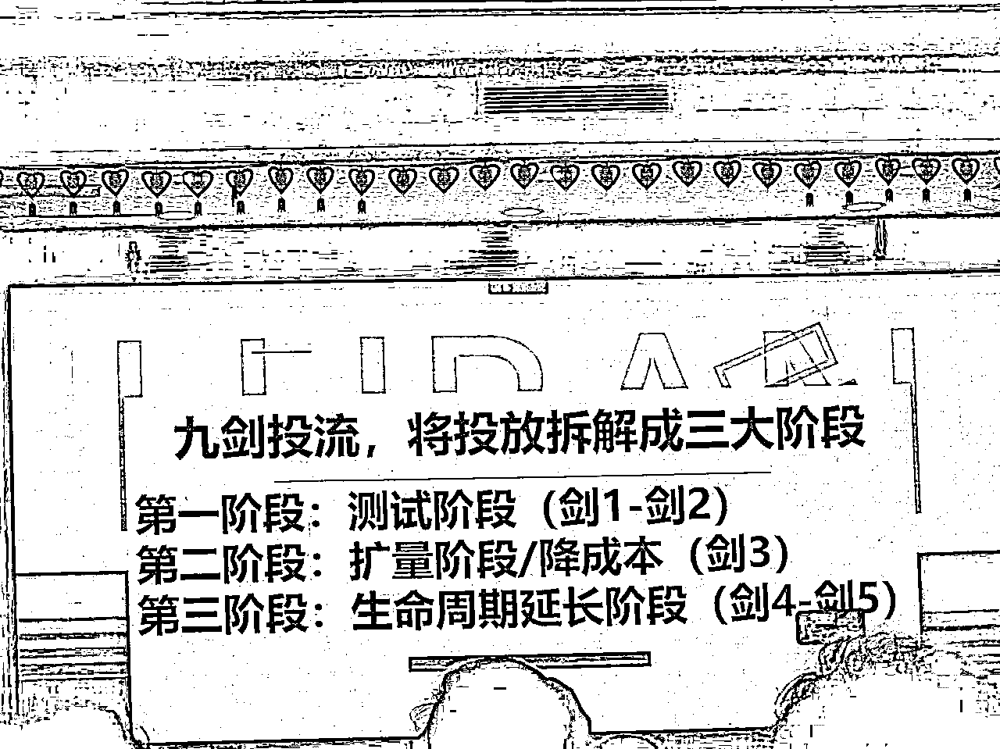

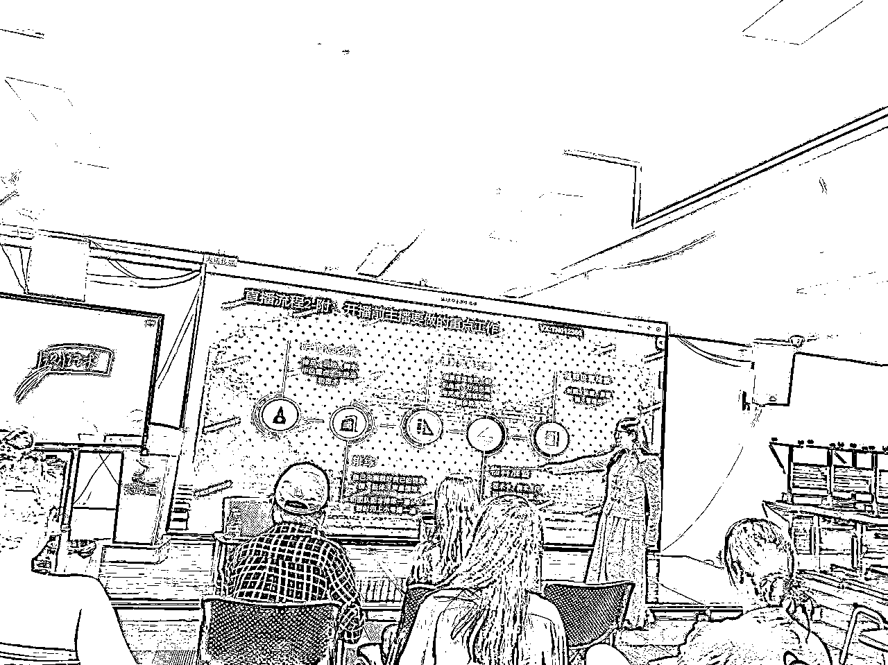

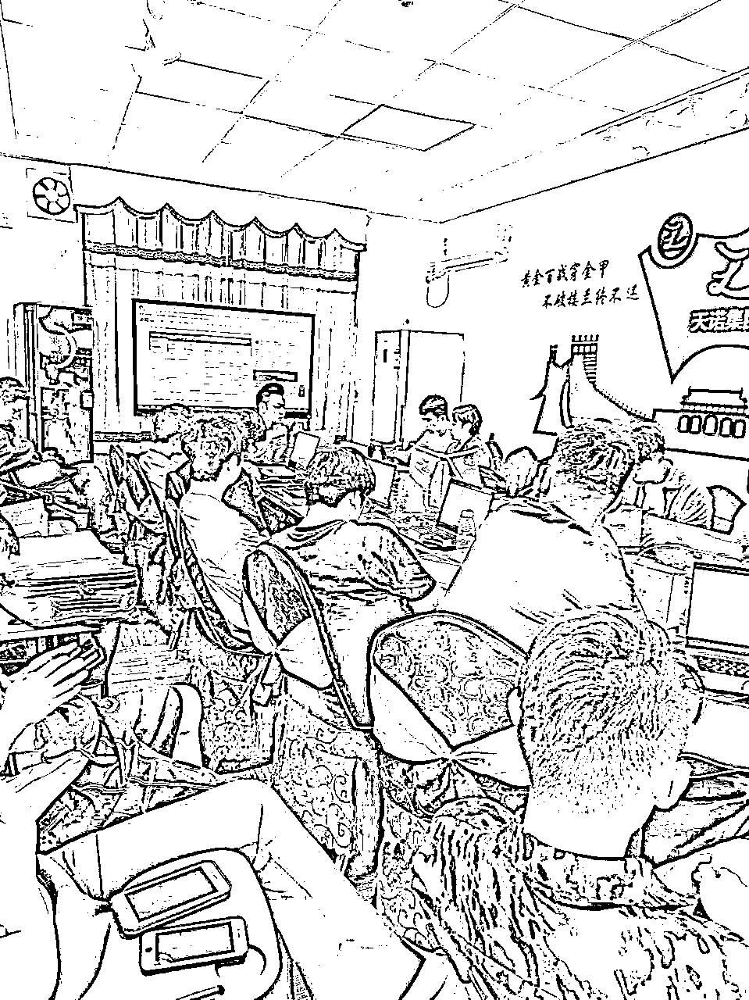

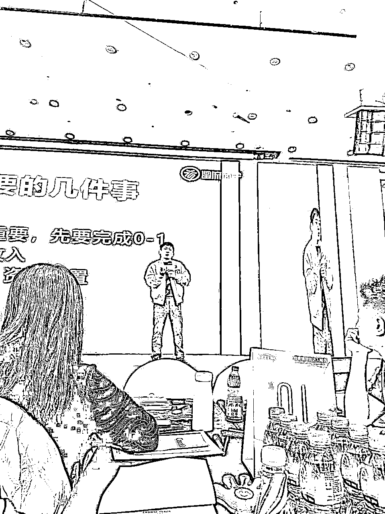

一路下来大大小小的知识付费也花了十几万，就这样，我三个月亏掉了50w，并且没有任何产出，大哥看到这样的情况，也开始喊停，但是我始终相信，只要不下牌桌，就永远有机会

于是我就退掉了场地，关闭了公司，自己在家继续钻研，期间做过达人短视频带货，抖音小店商品卡，什么都学，补充自己的短板

小白在没有任何行业经验的时候，尽量做一些几乎不需要试错成本或者成本非常低的项目，以至于你失败了还有重来的机会，创业的成功率不足3%，很多人创业上来就投个几十万，一但失败了，将背负债务，你的后半生都将在还债的路上

转折点在8月，抖音重点扶持货架电商，并且商品卡免佣，这个时候，我就知道机会来了，跟着平台政策走，肯定没错，于是便迅速入局了家具赛道，当同行都还在卷直播的时候，我在干商品卡，同行都不知道商品卡可以投放的时候，我通投拉满，当时真的没有任何技巧，直接新建计划，开始投放，随随便便都有十几的投产

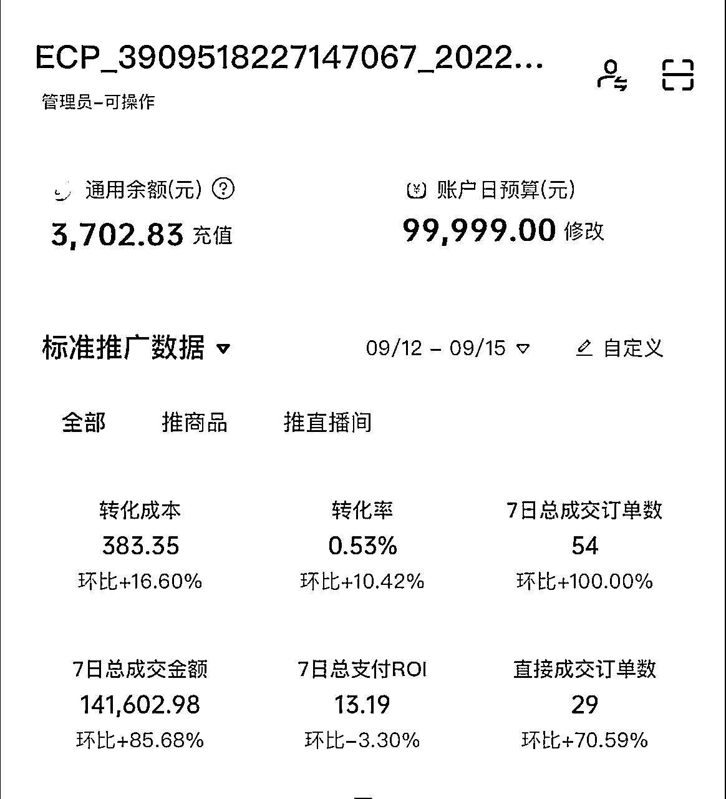

于是我马上整合团队，去到了江西产业带，并结识了现在的合作伙伴，他负责后端供应链发货售后客服，我负责前端运营流量，从9月份开始实现了业绩翻倍增长

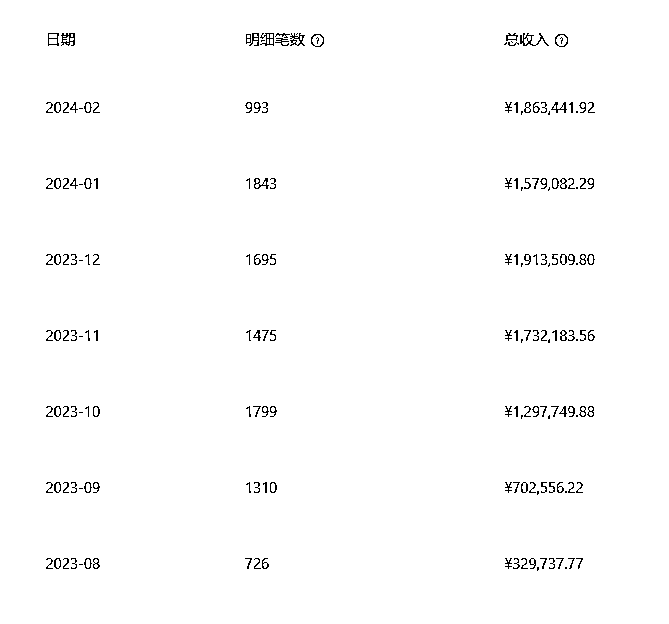

在这项目稳定期间，我一直在测试别的类目，做过男装，女装，百货等，因为我知道，平台的红利期不会太久，修屋顶最好的时间是阳光明媚的时候，而不是下雨才去修屋顶

一直持续到今年五月，抖音商品卡的一个改动：将不再支持标准计划投放，所有账户将只能投放全域计划，一轮测试下来发现，耐消品这个类目，掉量及其严重，投产直接因为这个政策影响打不正了，出现很多空耗，秒拍秒退的情况，以前还能依靠一些投放技术，把投产稳住，现在的广告计划只有一个按钮，打开关闭，没有任何操作的空间，于是我意识到了，时代已经结束，依托于平台政策红利的生意，一但政策出现变动，跟行业黑天鹅事件没什么区别

但在这期间，我一直有做的女装百货等快消品类目，因这个改动，有了巨大的红利，并且开发了几套打法，效果还不错，后面有时间我会详细讲讲

## 对于当下流量最大的平台：抖音的一些思考

抖音直到今天，依旧是一个巨额变现的平台，一些细分领域，依旧有很大红利，做一些细分领域的产品，远胜于大众型产品

在抖音光做流量是没有用的，项目占99%，先有变现模型才是关键，先找项目，再找流量

抖音+私域+社群到今天依旧是一个变现王炸组合

一个能成的项目不是想出来的，是调研出来的，投多少钱，赚多少钱，有无成功案例，是否具备可复制性，执行难度等都需要综合分析

所有项目都要有一个核心的判断：现在是风口吗？ 现在是起飞的时间点吗？太早入场成为炮灰，太晚入场十倍努力一倍结果

一定要借助平台红利，只有平台在爆发期，才容易拿到大结果

## 抖音商品卡项目分析

### 抖音商品卡是什么

抖音商品卡是抖音推出的货架场，简单可以理解为跟淘宝，pdd一样，不需要直播，不需要拍短视频，操作简单，把产品链接挂上去即可出单

### 为什么做抖音商品卡

抖音商品卡运营成本低，一张营业执照一个人一台电脑500元保证金即可开店，不像直播一样，你要有主播，运营，中控等

### 流量大，增速快

商品卡增速快空间大：2024年双11期间，商品卡GMV同步增长64%

### 2025年平台补贴再升级，商品卡免佣

25年平台补贴再升级：全年免佣补贴金额135亿，面向全量商家开放，并且每月仅需完成2-3项，即可获得免佣资格

### 渠道多，选择多，新手友好

抖音商城可以分为：兴趣场+货架场

有做兴趣场能力的可以做直播带货或者短视频带货，没有经验的可以选择做货架场的商品卡，上架即可出单，单量累计出来了就会有达人给你带货，实现躺赚

### 抖音商品卡的流量渠道主要是：猜你喜欢+搜索

抖音商品卡的流量渠道主要是：猜你喜欢+搜索

综上几个点，抖音商品卡是现阶段做抖音电商必做的方向，流量大，增速快，扶持大，操作简单，开店成本低，可做店群，可sop流程化运作

## 保姆级开店流程，店铺基础搭建

### 入驻店铺

店铺主体可分为三种：个人店，个体店，企业店，其中企业店可开设：企业店，专卖店，专营店，旗舰店

个人店：身份证，银行卡

个体店：个体工商户营业执照、法人身份证正反面、法人银行卡、法人微信商户号

企业店：个人独资或者合资的公司营业执照、法人身份证正反面、对公账户、法人微信商户号

专卖店：1个或多个普通授权品牌，多个授权品牌需属于同一商标所有人

专营店：授权2个及以上自有品牌或授权品牌

旗舰店：可经营1个或多个一级独占授权品牌，多个授权品牌需属于同一商标所有人

官方旗舰店：可经营1个或多个一级独占授权品牌，多个授权品牌需属于同一商标所有人

### 缴纳保证金

一般的常规类目都会有0元入驻，新手上来可以先不缴纳，达到100单后会要求补交保证金，现在除了特殊类目，常规类目基础保证金为：500元

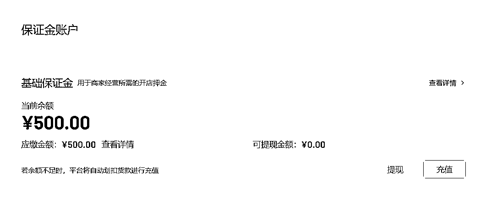

### 开通聚合账户

绑定法人收款银行卡

微信支付开通，开通之后还需要二次签约，不开通微信支付会导致客户不能使用微信支付，影响转化率

企业店需要绑定法人对公账户/企业网商银行

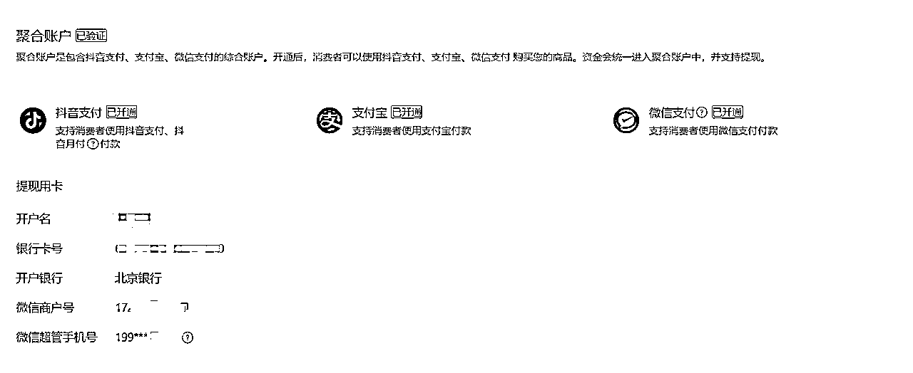

### 开通子账号

注册一个网易邮箱，用邮箱注册子账号，开通全部权限，作用：便于运营管理，有概率规避关联

### 新建运费模板

设置利润款常规偏远地区限售地区：香港 澳门 台湾 内蒙古 新疆 西藏 甘肃 青海 宁夏 海南

福利款羊毛党地区：两河两山一黑 河南河北 山东山西 黑龙江

### 设置地址库

店铺默认发货和退货地址设置：店铺没有设置地址库会影响厂家打单发货

设置默认退货地址时，如果我们的上家不确定或者多个，可以卡一个座机售后地址，来卡平台的闪电退

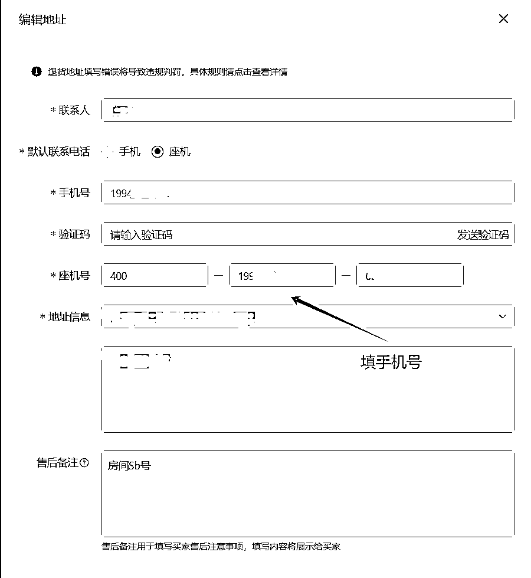

### 然后上架产品即可，各类目具体运营方法，运营思路，后续我会单独写一篇来讲讲

## 开店第一个月，我是如何做到184w营业额的

### 我做的是女装无货源铺货

为什么做的是这个：因为女装是抖音乃至全平台，流量最大的类目，当然竞争也非常大

同时女装属于非标品，不用担心价格高了就卖不出去，杜绝了比价

我做的是无货源铺货，通过软件选3-5w个链接，只要我链接足够多，就能出单，不需要任何运营技巧

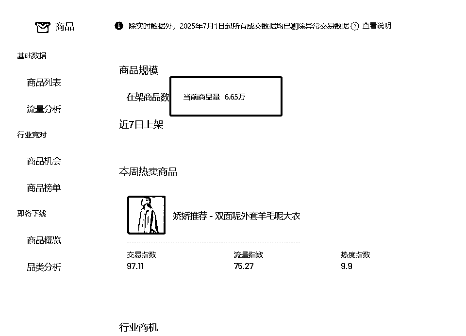

### 开店完成店铺基础搭建后先出体验分

先把体验分拉到90分以上，因为新店铺你不出体验分是没有流量的

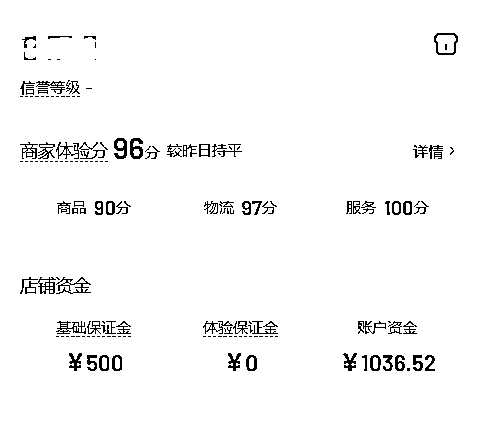

### 利用低价商品快速累计订单做出体验分

一般我会选择10元以内的福利商品累计订单，因为这个客单的商品比较好出单，只要出够30单了你就有70分的体验分

这些年自己也累计下了一个货盘，有几百个低价商品，上架就能出单，有需要的兄弟我可以分享出来

可以看到我的流量曲线，这里我是为了快速拉爆店铺，没有选择慢慢跑福利品，而是直接一天拉了500单，直接出了体验分

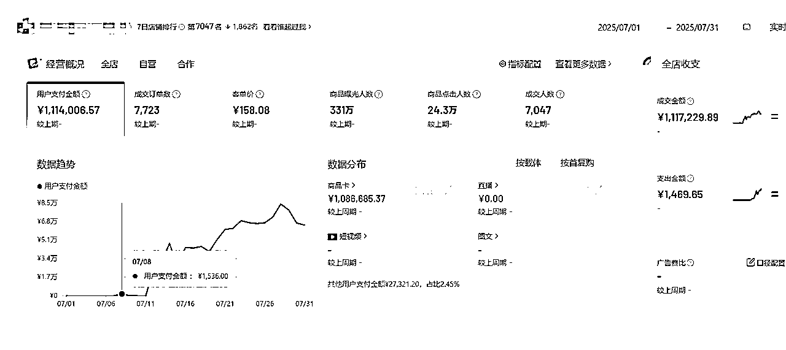

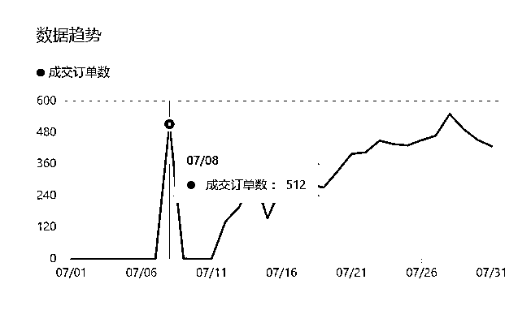

大概在两天后我的订单陆续出了评价后，我就开始准备上架我提前准备好的利润款

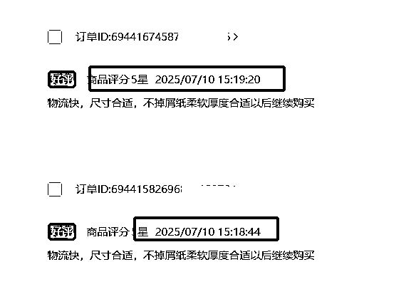

### 上架利润款

我是提前把链接上架到仓库，统一在同一天一键上架，设置好全店优惠卷坐等出单，毛利控制在50%左右

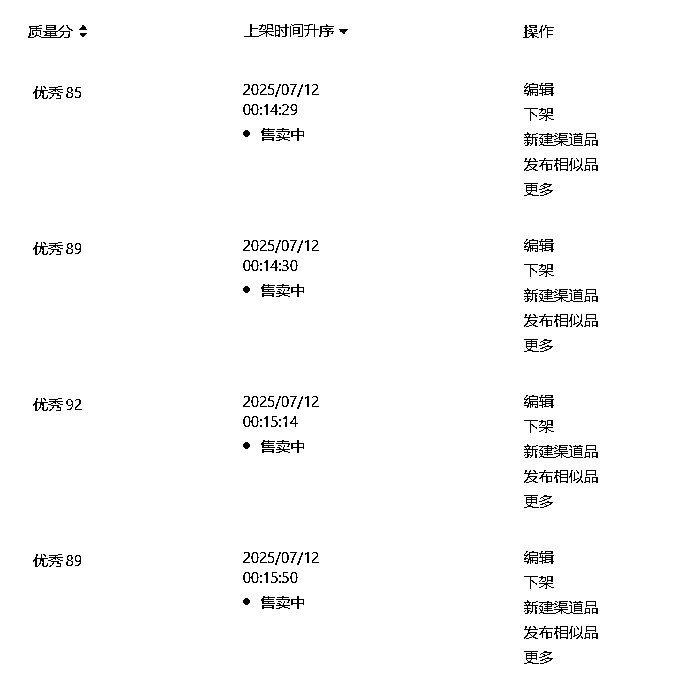

### 出单后在淘宝以图搜款，找到合适的商家，进行拍单

可以看到当天早上开始出单，利润在50%左右

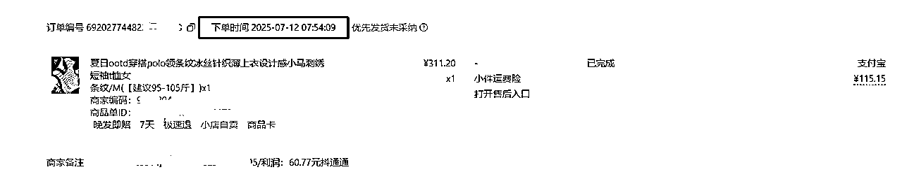

### 当天就卖了2w多，最高峰的时候一天卖了8.4w

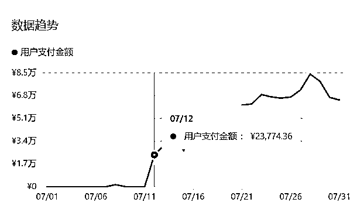

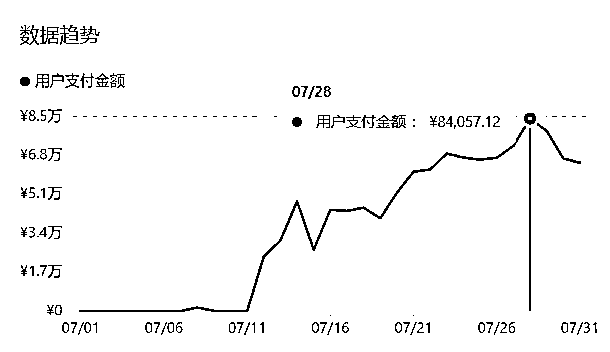

### 以上就是我做这个店铺的总体思路，非常简单无脑，只要采集好链接直接上架就能出单，并且同一批链接可以给多个店铺使用，所有操作都是运营助理详细按照sop流程进行

### 关于一些项目细节上的问题，可以在评论区留言哈

## 项目总结

很多人都说，女装退货率这么高，狗都不做，确实，狗都不做我做

接下来我将以财务角度来拆解我这个店铺的一个月的利润：

运营这个店铺所需要的人力：运营助理2名+售后客服1名（这样的人员配置可以同时做3个店）

运营助理：负责上架链接，维护店铺，接待客服等，拍单等工作

售后客服：负责退货管理，接待客服，给客户打电话等工作

运营助理月薪：3500*2

售后客服月薪：5000（这里我会选择比较有经验的，这样可以避免更多的售后损耗）多做一个店会额外给1000提成

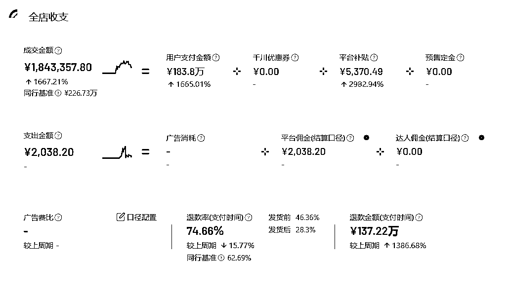

以上是我这个店铺一个月的营业额：

总体成交gmv：184w 退货率74%

实际我按80%的退货率来算，能实际签收36w左右

我的平均毛利在50%，36/2=18w

扣除我的人工开支：3500*2+5000=1.2w

场地开支：本身我就有场地，这个开支可以忽略不计

运费险成本平均一单：4元，保障了6280单，成本共计：4*6280=25120

平均实发一单损耗：我按5元来算：5*6280=31400

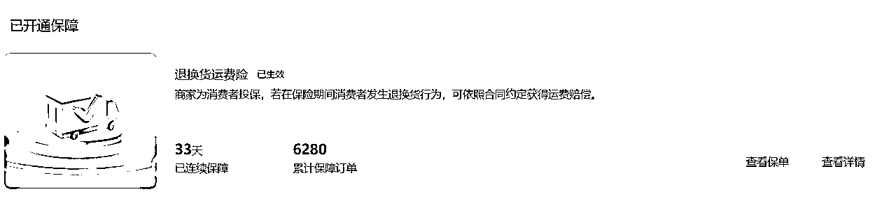

营收：18-1.2-2.5-3.14=11.16w

最终营收：扣除一些隐性成本大概这个店铺一个月有10w左右的利润

项目执行难度分析：

可复制性极强，操作难度低，新招的小白运营助理根据sop流程即可完成所有工作

一组团队可独立运营3个店铺

最后希望这篇实战分享对大家有所帮助，也欢迎大家在评论区跟我交流！