# 保姆级从0到1做tiktok经验分享，从tiktok直播引流到独立站的成交方式

> 来源：[https://oktm46nqfx.feishu.cn/docx/ZgtNdUYaGol4yuxjJXQcG1IRn2f](https://oktm46nqfx.feishu.cn/docx/ZgtNdUYaGol4yuxjJXQcG1IRn2f)

本文档的主旨是帮助圈友从商家的角度从0到1打通tiktok的流程，帮助中小商家走上正轨，走达人路线的也可以作为参考，让大家都能从TK上获利。

文档持续更新中，内容为本人所创，未经本人允许不得商用和copy，如有需要请找鱼丸联系本人。

## 0 前言

今年3月大厂被裁，结束了我7年的大厂生涯，在35岁的这个分叉口，我可以安心回家带孩子，但我不甘心，不甘心这一身的技能就淹没在家庭琐事中。在这期间一遍带娃，一边创业，尝试过小红书电商、珠宝私域卖货、tiktok直播、tiktok小店、独立站等好几个项目，最让我看好的就是tiktok的小店以及tiktok野播（不开店直接直播）的2个项目，虽然不是我现阶段拿到最好结果的项目，但是是最有前景的项目。

先来说说得到的成果：6月26号刚刚建站成功，7月2号功能才真正完善，到现在直播2场，一场17分钟，另一场半小时。独立站挂在tiktok首页什么广告也没打，自然流共进站209人，7月19号凌晨00：21成交1单，今天已发货成功。

流量数据：

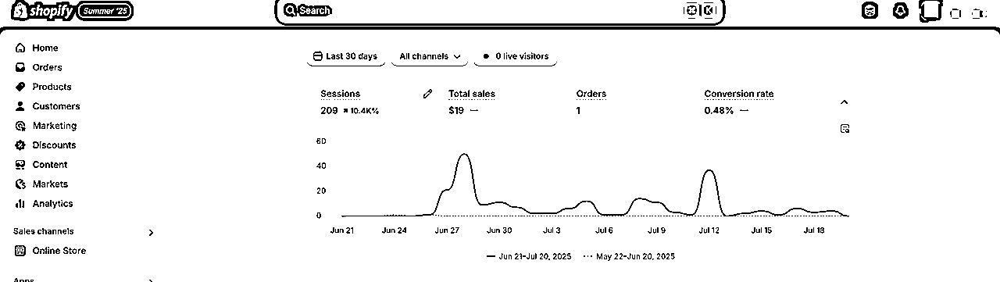

建站时间：

其中集中折腾了2天，先上线，后续陆陆续续修复一些信息，比方PayPal账号被封等等，整体来说精力消耗不大。

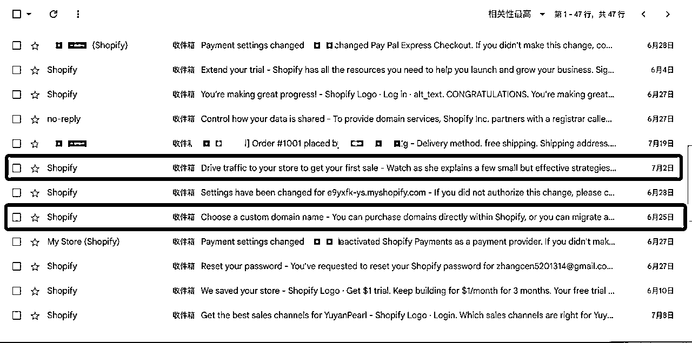

发货成功：

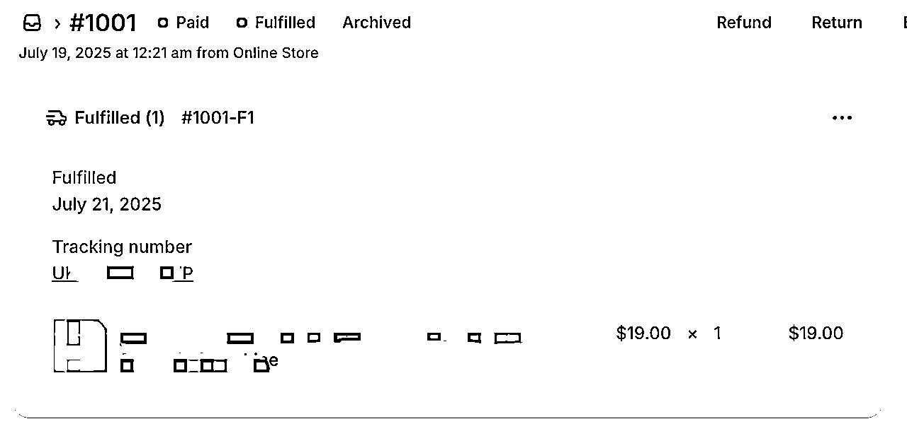

### 0.1 为什么看好tiktok

我觉得星球一定有比我更专业的大佬会回答这个问题，现在我就用deepseek的回答tiktok与抖音的发展时间差这个问题来呈现下。

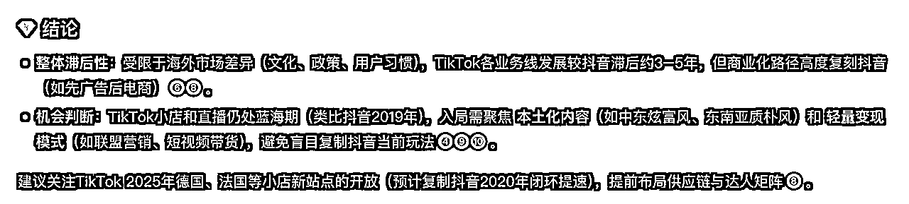

## 一、创建账号的步骤

如何进入tiktok我相信已经卡住了绝大部分的人，80%是有的，现来说说这个。以下都以美区为例进行阐述，如果你要做的是东南亚或者日本等其他国家，将里面的语言或者相关账号换成对应国家即可。

### 1.1 注册tiktok需要哪些材料

先说结论：苹果手机（安卓机只推荐谷歌的）、邮箱、科学上网

#### 1.1.1 手机设备购买

手机是基础，需要满足如下几个条件：iPhone8以上、拔卡、一机一tiktok号、刷机成原装系统。

手机哪里买？某东、某鱼都可以买到，500-700块就行，需要注意几个点，一些二手手机是不能刷机的，买之前需要问清楚，我之前在某多多上买了一个二手的，就是刷不了机。

然后再补充一点作为设计师才知道的一些信息，如果预算充足可以尝试买iPhone11，iPhone11拍出来的照片是最漂亮的，从iPhone12开始加上了些智能算法，结果我自己试出来还不如iPhone11的颜色和谐，以及自带近距离对焦功能。想节约预算就直接iPhone8。

#### 1.1.2 手机基础设置

刷机之后，还要做一些手机上的基础设置：

① 拔卡：任何卡都不要用，特别是国内的，当然如果能搞到国外的更好，没有也不影响；

② 刷机：设置-通用-还原-抹除所有内容和设置-抹掉iphone所有内容

③ 关闭定位功能：

抹除后，关闭定位服务，以防获取国内位置，设置路径：设置-隐私-定位服务-关闭“定位服务”

④ 关闭广告追踪

设置路径:设置-隐私-广告-打开“限制广告追踪

⑤ 设置时区

按照你选择的海外电商国家或地区，设置手机时间。设置路径:设置-通用-日期与时间-关闭自动设置时区-手动找到对应国家的时区

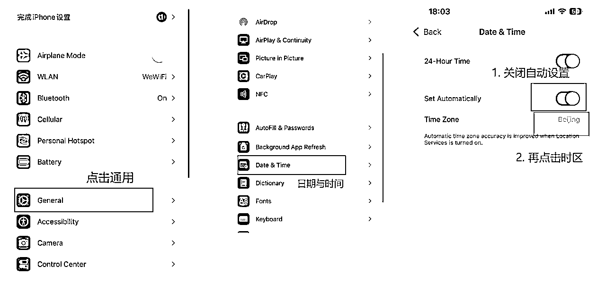

⑥ 切换系统语言

设置路径：设置-通用-语言与地区-添加语言-English

注意：设置成英语以后，不得随意更改系统语言! 否则TikTok后台会获取语言信息，导致无法使用TikTok

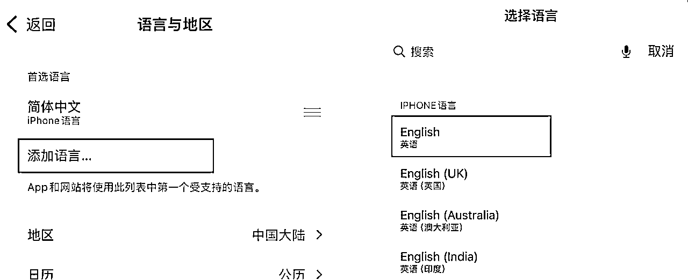

⑦ 苹果ID的购买和登录

购买相应地区的Apple ID，某宝有，费用在几十人民币不等。

打开WiFi，先连接国内的WiFi（如你的手机已经是英文系统，连接网络的路径:Setting-WLAN），家里公司都可以。

找到Apple Store即苹果应用商店，然后到美区的商店进行下载tiktok和科学上网的APP小火箭Shadowrocket，如下图。

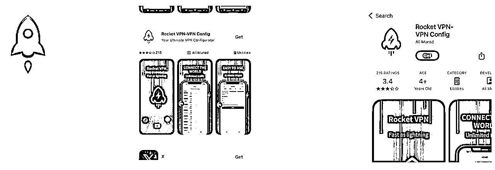

#### 1.1.3 邮箱

tiktok注册分为国外手机号、邮箱、第三方，这里建议使用邮箱最方便，因为被封号也是成本最低的。

需要注册一个邮箱，不要用国内的任何邮箱。最好是谷歌邮箱，那种老的谷歌邮箱稳定性更高，权重更高，意味着你可以在注册后得到更多的流量，也不容易被封。如果没有谷歌邮箱的可以在这些地方买，一个也就几十块人民币。算了，我还是不推荐了，大家某鱼上搜索。

实在不行，可以试试outlook邮箱，Outlook注册出来的权重整体上不如谷歌邮箱，但胜在它注册方便，不需要绑定手机号码和实名认证，对个人注册数量没有明确限制​，理论上允许用户注册无限个账户，很方便试错。前期足够让自己上手。

我自己注册了两个号，一个是老的谷歌邮箱，一个是新的Outlook邮箱，但整体Outlook邮箱的流量不如谷歌的好，给大家看看。但也跟内容有关，我后续再试试提升Outlook邮箱那个号的原创性和内容丰富度。

放出来给大家参考，别人肉我😭

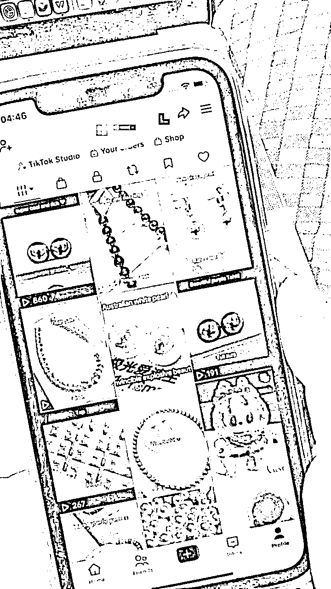

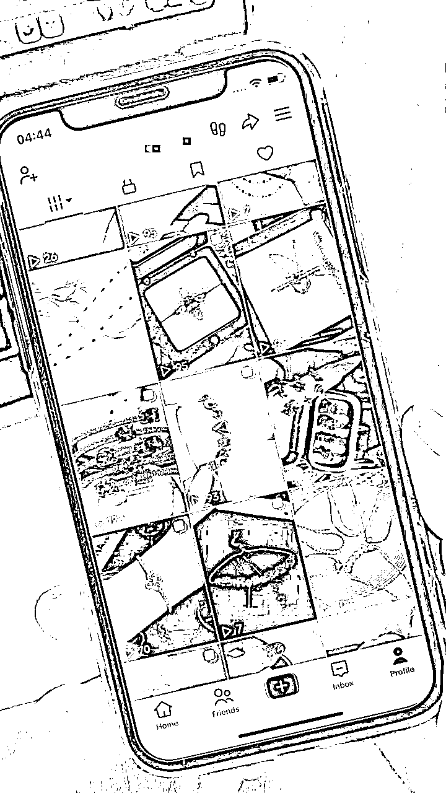

#### 1.1.4 网络环境监测

① 先要学会科学上网，这一块不方便说，大家自行解决吧。

② 环境验证：使用之前我们还要验证手机环境是不是在美国、

将如下网址复制到浏览器并打开:

网址1：用whoer.net

这个网站用来检查手机环境----里面的进度条是指监测环境的伪装度，达到80%-100%才算成功，最好是达到100%；

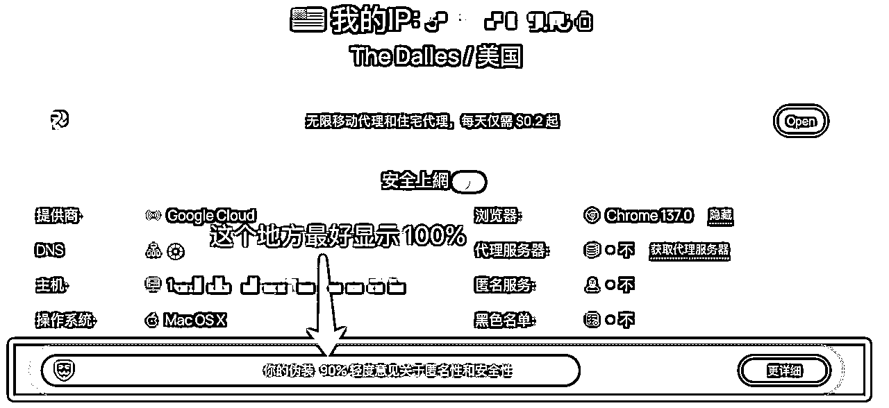

网址2：用en.ipip.net检查网络定位的位置--例如:美国 洛杉矶/美国 纽约(与你所使用的网络地点必须保持一致)，比方说你的网络用的是洛杉矶的，那么在这个网站里面就要显示你在洛杉矶。

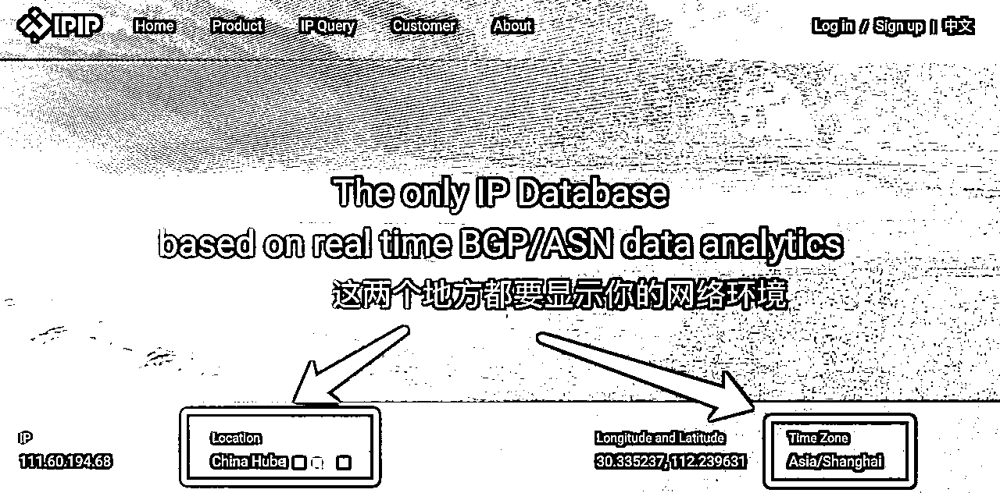

完成好这些后，后续登录网络的位置就固定在海外了。每次登录前最好检查下小火箭和这些信息，有时候没电关机重启，小火箭就自动关了。

恭喜大家，如果打怪通关到这里，你已经成功了50%！🎉🎉🎉~

## 二、养号

养号说到底，就是模仿一个正常的美国用户去使用tiktok，这里自己发视频的话就按照正常的定位、选题、拍摄、剪辑等流程去走。（这块大家有需要我可以后续补充）

养号如果你会混剪，那么会很快，只要原创程度达到40%或者混剪的重复率控制好，做爆款很容易起来。

而我自己有原创的内容，于是从开始我就走了一条难走而又正确的路。这一路，我的养号经历过三个阶段：

### 2.1 单个视频浏览量只有个位数

刚开始注册好之后，前面1个星期，我发的视频都是原创的，但浏览量非常低，一度让我怀疑我的号是不是被监测到了，而且在信息流里面刷到的信息都是这些😂。什么教你用TK网络之类的视频。

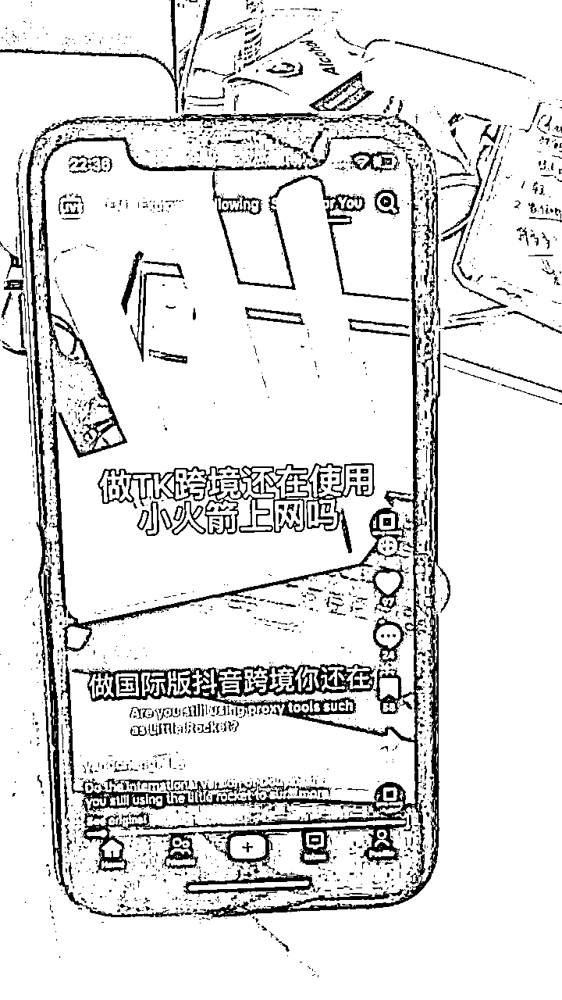

然后我开始反思，是不是哪些细节没做到位，不能骗自己了。注意下面我说的，在哪都看不到的内容：

手机有几个隐藏的点需要注意：

① tiktok的实时活动和后台APP刷新功能都要关闭；

② screen time只留照片和麦克风权限；

③ 我发现weather APP显示的是北京的天气，直接将weather APP卸载；

做好这3个之后，我账号发的短视频浏览量，从个位数、10+开始升到100+、200+，以前刷到的什么TK网络的问题，也不再出现。号真正步入了正轨的阶段。

### 2.2 单个视频浏览量突破500

当继续更新之后，我的视频始终在几十到200+之间。然后我就继续发，也不搬运和混剪，这个时间大概过了1~2周，情况有所好转，流量开始偶尔到300。我觉得自己的好号挺稳了，但问了行内人，说这也就是个起步的水平。

中间也因为一些没有耐心，我断更了1周，一周后继续更新，流量重回个位数。这让我很崩溃，于是又继续更，不停试试。持续了又1周，每天3条，无意中看到有个突破500的。

OK，我自己觉得这个500，是对我执着的奖励。

### 2.3 单个视频浏览量突破1000账号正式稳定

在突破500大关后，我开始分析那个视频为什么会小小地爆，因为我是做轻珠宝的，发现在颜色上它是偏紫色的，于是我又开始发一个紫色的珠宝，于是浏览量涨到了1000。

后来发现不是每个紫色都会涨，又开始研究其它颜色，发现彩色就会比白色好一丢丢（这个只适用于我做的品类）。

在这个阶段，我开始琢磨出，要延续好的视频的元素。到这里，我的账号彻底稳定了。过了1000，基本账号没什么问题了。

养号的经验总结：

① 至少1~2周才会稳定下来，耐心发视频；

② 发视频过程中总结好的地方不断延续；

③ 每天花至少半小时刷tiktok的内容找网感，也让系统给你打标签，在你的行业的内容前面多停留几秒，然后去别人主页看看，多模拟正常账号的行为。

## 三、做直播

在当我账号稳定之后，我第一件事做的是开始直播，而不是开通小店。因为小店要500美元的押金，前期我不想花这个钱。于是开始从直播开始。

直播有什么好处呢？就是我可以把人引到我的独立站进行成交，甚至是私域进行成交（跟国内的微信私域很像）。我先讲直播，稍后说独立站和私域的事情。

### 3.1 直播的门槛

#### 3.1.1 个人号门槛

如果你的账号是个人账号的话，直播现阶段是需要满足1000粉丝的。如果你有爆款，这个粉丝数量不难达到，但如果你和我一样是普通人，从非爆款视频入手，那么还有一个捷径，就是买粉。

现在某鱼上还能搜到tiktok的粉丝，价格现在比较便宜，是15元-50元之间/千粉。是不是很划算。于是呢这个也可以很快解决。

#### 3.1.2 企业号门槛

如果你是企业号，恭喜你，通过企业号认证后，0粉也是可以开播的。

如何申请企业号？考虑到后面可能要申请tiktok小店的话，必须要有企业营业执照，个体户的营业执照不行。如何申请营业执照，去某宝上买个服务，考虑到各地经营地址费用不一样，整体申请营业执照下来费用几百到一两千都算合理。以武汉为例，我申请下来首年是1500，免地址费用，供大家参考。

所以我们要做的就是去搞个营业执照。

### 3.2 直播的工具

#### 3.2.1 直播器材

有了直播权限后，tiktok直播入口跟抖音一样很相似，点中间发布加号后，会看到右下角有个“LIVE”的入口。就可以开始直播了。中间会有个试用的过程，你只要打开下，象征性播放几秒钟出来，隔几天真正的直播权限就开了。

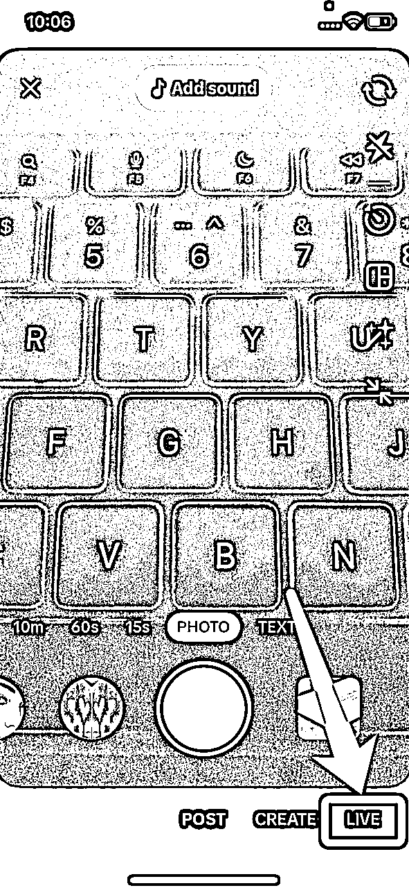

直播需要做哪些准备：一个手机支架、你要卖的产品、一个直播打光灯（几十到几百都可以）

然后没了，有人想要买的话，你就让他去你的首页看（首页备注好你的WhatsApp联系方式和独立站的地址）。无成本完成交易的链路。如下图

#### 3.2.2 英语到底重不重要

有人说我不会英语怎么直播？

先说结论：英语流利会有很大的优势，但是不会英语依然有很多方式可以直播。

以我刷tiktok的直播来看，至少有一半的人是咱们大陆同胞，蹩脚的中式英语，老美听得懂意思的。还有些是印度人、美国老太太等等，各式各样，想想美国多民族的文化，这点真的不用太在意，最重要的是开口说。

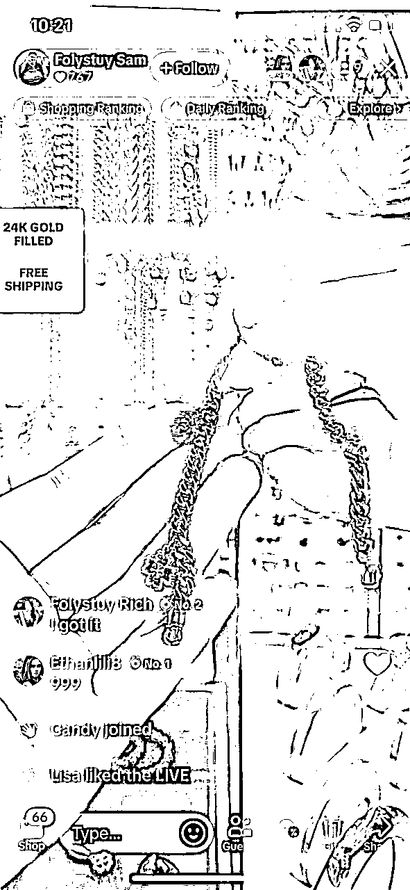

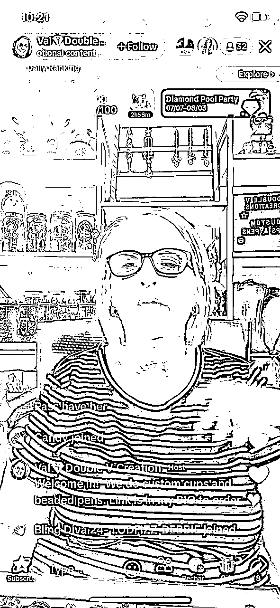

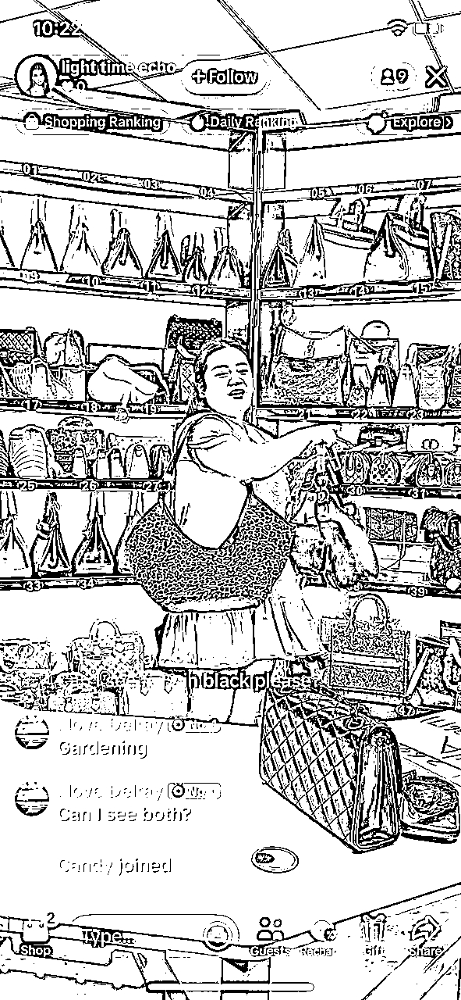

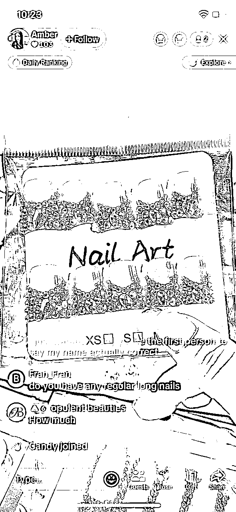

我个人也只是英语四级，然后开始干了。第一次直播17分钟，说了句敏感词限流10分钟，总共来了15人，3个评论。说明观众还是听懂我说什么了，流量我觉得也还行，第一次，直播间时不时来个人进来。

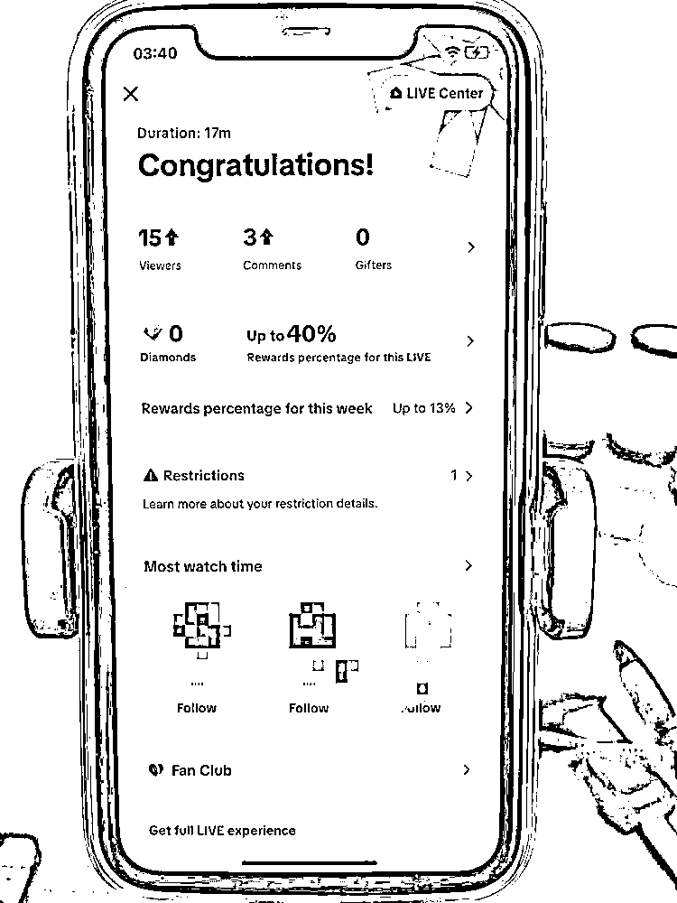

这也奠定了我后面继续直播的信心。后面也只直播了一场😄，时间还不长。

### 3.3 直播如何变现

#### 3.3.1 如何搭建独立站

我之前说在直播间是引导用户直接去独立站下单的，为什么用独立站去承接tiktok流量：

刚开始就是用tiktok去发发我的产品，但突然有一天，有个顾客看了我的视频要买产品，我没地方卖给他（当时我还没有tiktok小店，后来我建了tiktok店也发现卖不了我的珠宝产品😭），然后我就急匆匆建了个独立站给他，看他买不买，结果没买，但让我跑通了tiktok不开店铺直接带货的渠道。

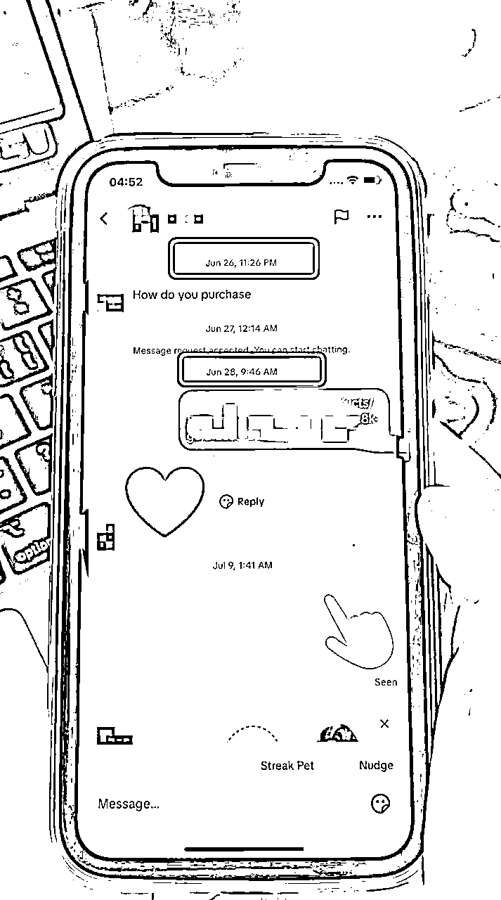

再来说说如何简易搭建独立站。

用什么方法？有人说是shopify有人说是WordPress。我在deepseek问了下区别，看看它的回答：

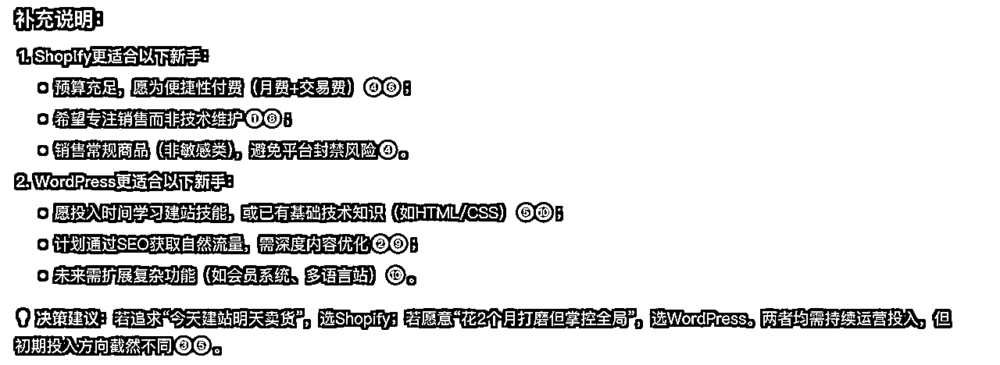

我个人使用的是shopify，主要是因为操作简单，像我这样的设计师2天就搭建了一个雏形，我相信各位大神应该会操作更容易。

它的操作就像某宝后台一样，一项项填写，非常迅速。相关的操作大家可以去某宝买个几块钱的教程看看。我就侧重分享个人的实操经验。

#### 3.3.2 把海外用户引进私域

是的，正如国内的加微信到私域里面成交，国外也有它的私域，它的私域分为：WhatsApp、独立站、邮箱、Facebook社群等等方式。

我就说在tiktok上最普遍的做法就是引到独立站和WhatsApp，然后这些联系方式会放在个人首页。如下图

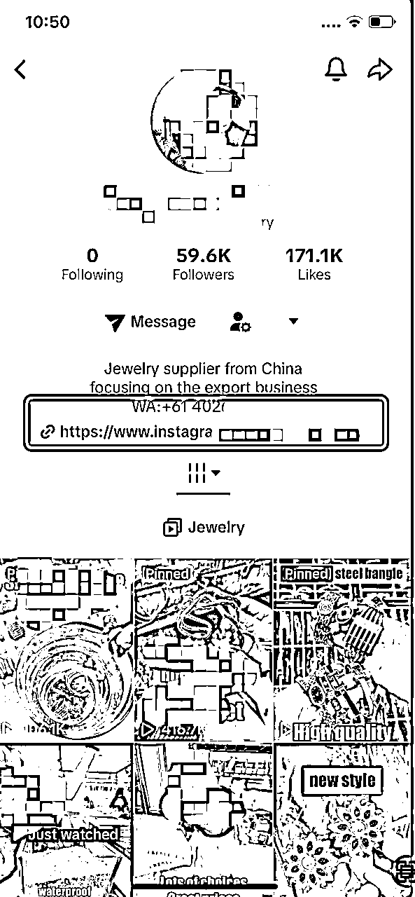

tiktok现在相对国内来说对于私域的封控没有那么严，所以这招现在还行。但它是有条件的，条件就是你要达到1000粉，又是1000粉的门槛（按照之前的做法就行☺️），有了1000粉就可以在简介里面添加链接了。

做好了这些之后，接下来，我们要开始进入直播环节了。

#### 3.3.3 直播方法

① 店播

就是你开了个tiktok小店，然后在小店上上架你的产品，挂上小黄车，直播的时候就播这些，这是主流的做法。

② 野播

就是没开通小店，不挂小黄车（有的挂小黄车也就是个象征，只是为了得到平台的流量扶持），就直接播，有人问怎么买，你就说“see my bio”等话术，让顾客去你主页下单。

还有些细节，就是在野播的时候可以用纸写上“$30 free shipping”这样的话术，表达30美金包邮等等的营销方法，这个就很多了。

而我用这样的方法终于在7月19日的凌晨00:21出了独立站的第一单。

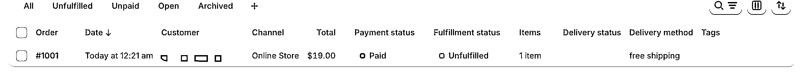

这个上限就看自己了，我认识一个宝妈，播了1个多月才开始出单，3个月后开始月入过万人民币好像也是挺正常，不算太多，但一遍带娃一边拿到这个成果，很可以了。我想想3个月后，我是不是也可以盈利这么多，😄

#### 3.3.4 自发货物流怎么办

如果走野播的形式，物流就要自己去承担，那我们要去找货代。货代除了现在一些国际物流，国内的顺丰可以寄过去，但价格比较贵，比方顺丰我寄一个首饰过去要五六百人民币，这个就不划算了。同时，因为刚起步，是小卖家，大公司其实也不太搭理你，选择一些专门的跨境物流公司会更好，有的能支持上门取件。看看deepseek给新手的建议如下

大家也可以试着尝试自己找找，看周围认识的人有没有合作的比较好的物流公司。

① 关于丢件怎么办？

一般跨境物流是有丢件的概率的，这个物流公司会根据你的货款进行赔偿。然后我们也可以联系顾客进行重新发货。这个是我找货代联系到的。

② 顾客退货怎么办？

作为小卖家我建议大家尽量不支持退货，提前跟顾客商量好，在你的独立站政策里面写清楚，不支持退货，以及发货时间是5天内，到货时间是15-21天左右。当然大家有实力优化这个事的话，那最好不过了。比方自己有海外仓，能直接海外发货，3天到货的话，订单当然会更好拿。

#### 3.3.5 如何提现

最简单的方法就是开通PayPal账号，到这个网站https://www.paypal.com

Shopify是默认用PayPal账号进行收款的，会有2%的手续费。申请这个需要用营业执照，个人和公司的都可以，并且可以提现到个人银行卡，对的，公司账户注册PayPal也可以提现到个人。

需要注意的是，申请PayPal账号审核的时间需要5-7个工作日，请留好时间。状态如下图

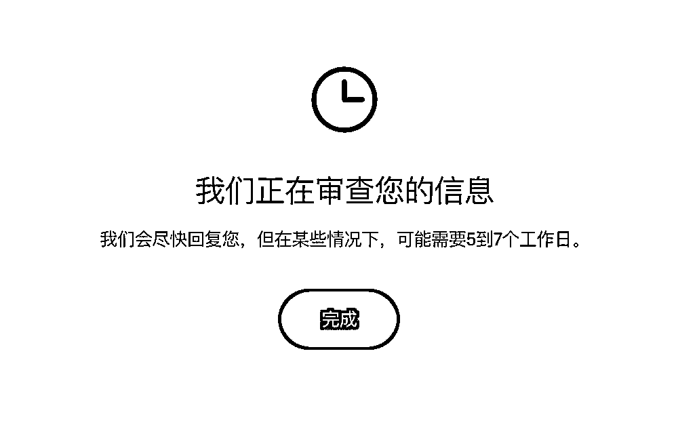

审核通过后会有短信通知，如下图

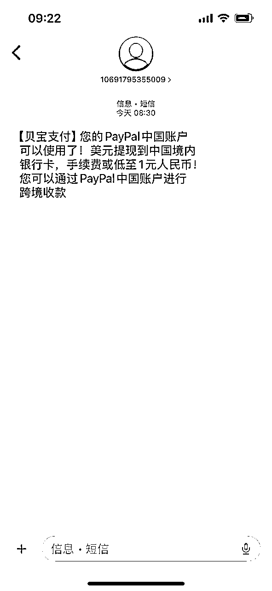

还有个小tips，申请通过后，系统过了几天把我的账号永久封了😭，我一个新号里面没有米，所以我也不急。联系了客服，说是系统误判，可以人工申请通过。大家遇到这个问题的时候不要着急，只要自己不违规，大概率问题不大。几天后，客服也帮我找回来了。

## 四、开通TK小店

### 4.1 开通tiktok小店有什么好处

对于在国内的号来说，最大的好处就是账号更稳定，且有流量扶持。如果你有自己的产品，那么交易链路更短，成交几率更大。

坏处就是需要交500美金的押金，如果用支付宝支付，收取手续费后是505美金。个人觉得，新手在没有摸清楚tiktok运转模式的时候，小店可以缓缓。有实力的商家，直接上小店。

### 4.2 如何开通tiktok小店

直接到https://seller.tiktokglobalshop.com这个网址进行注册，店铺运营最好使用电脑，手机不行。

特别提醒：

1.在确定了要做的店铺类型和大品类后，需要先准备对应的店铺注册材料

2.如果材料已经齐全，先不着急注册店铺，需要先进行：

① 选品的学习

② 选定具体的产品和货盘后

③ 再进行店铺注册

不建议提前操作的原因：TikTok店铺注册好后，若长时间不运营且不进行货盘上架将有平台封控的风险，后续申诉解封手续较为繁琐。

注册所需要的材料：

① 国内手机号(从未绑定过TK店铺)；

② 邮箱(从未绑定过TK店铺)；

③ 中国大陆主体的企业营业执照(注册时间满14天)或香港主体的企业商业登记证书/注册证书；

④ 法人身份证件(身份证/护照等)；

⑤ 法人人脸识别；

注册的时候可以用国内的网，通过之后要科学上网去美区。

### 4.3 小店货从哪里来

小店的货，有2种方式，一个是海外仓一件代发平台，二是自备海外仓。

#### 4.3.1 海外代发平台

先说第一种，一件代发平台有很多的，比方说美妆行业为主的西之月https://westmonth.com/

一般这样的代发平台，我们可以将自己的店铺绑定到它的系统，实现在对方网站上选品以及他们代发的目的。这样我们只需要集中于tiktok端的视频制作以及选达人进行营销等等的销售事宜。

除了西之月还有优速卖https://www.ushopfy.cn/等等，大家可以自行去寻找自己的货盘资源。

现在海外这些平台也慢慢趋近于国内的服务。

#### 4.3.2 自有海外仓

自有海外仓，需要经历海关备案、租赁海外仓、输入系统部署、头程发货等等操作，大卖家专属。这里新手就不涉及了。感觉风险很高。

有人问，为什么不从国内发货？因为TK小店发货是有时间限制的，跨境店铺是需要3个工作日内发出，7个工作日进行揽收。感觉有点超时的危险，最好从美国本土发货。

## 五、总结

到这里，我的从0到1的跨境生意就解说完毕了，这其中从一个稍微有点自媒体行业经验的角色带入，告诉大家如何用已有的自媒体经验去打通海外tiktok的变现成交链路。

总结下来最值得新手变现的低成本方式就是：

1、做tiktok野播，到独立站成交，有货了从国内发过去，不用囤货；（别管它是不是短时间的）

2、找海外代发平台，选tiktok现有的爆品去直播或者发带货笔记，也不用囤货，出单就赚钱；

底层逻辑就是赚平台红利的钱。

另外，大家如果觉得哪里写的不清楚的可以找鱼丸联系我，或者在贴子里留言，我慢慢补充。针对tiktok有两块还需要补充清楚的，比方如何优化直播的效果、以及如何建联达人，这块也是自己在继续琢磨的内容，我发现达人建联就是在给自己做分销啊，太赞了。先做，再完善☺️！