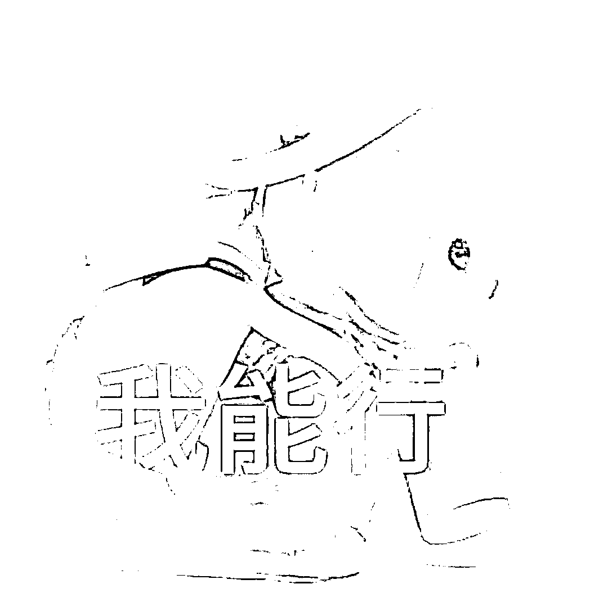
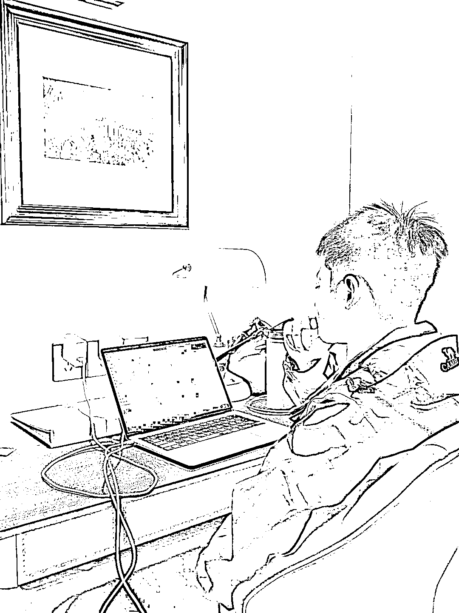
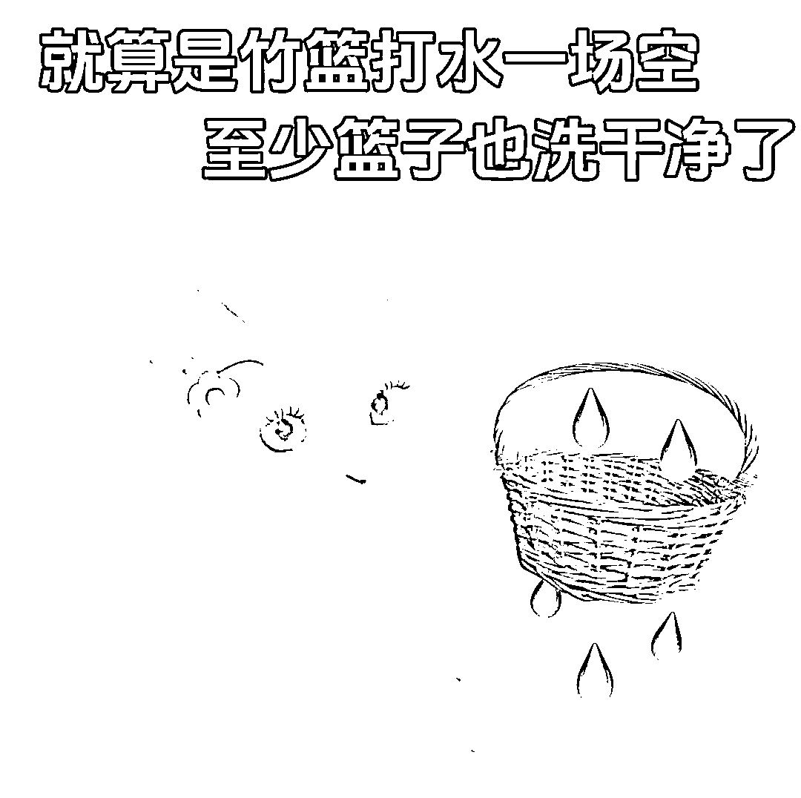
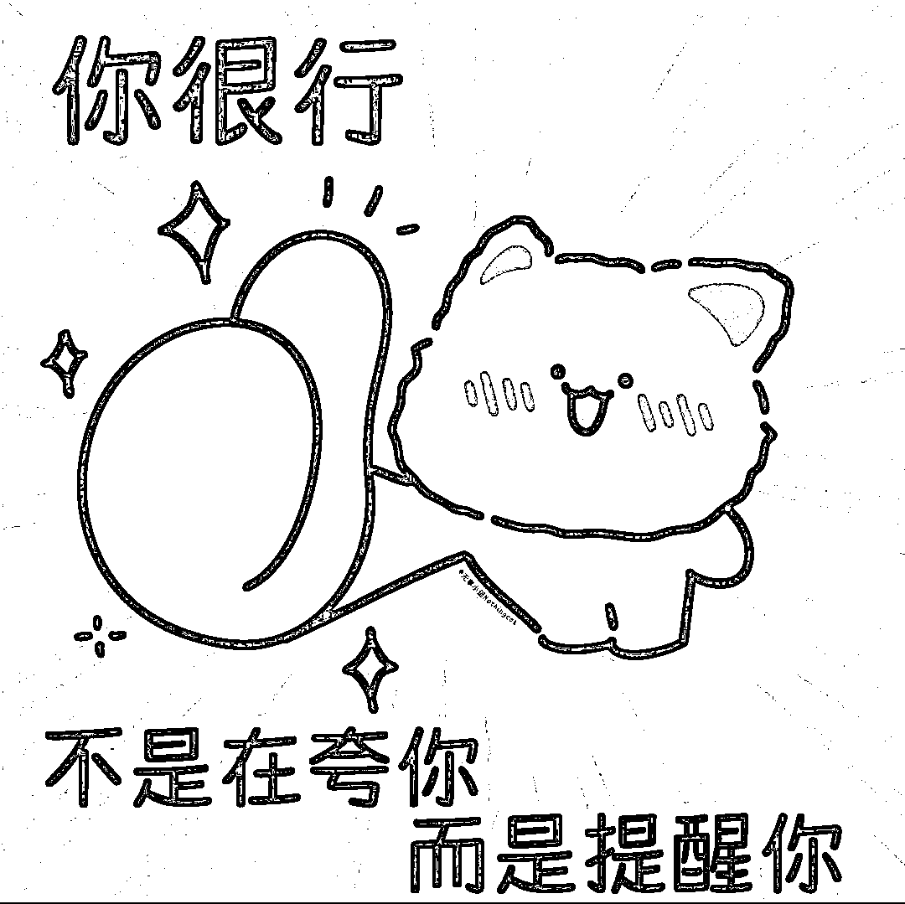

# (精华帖)(79 赞)写给独自一人在做项目的你

> 原文：[`www.yuque.com/for_lazy/zhoubao/xkq3dtyr0hzy9rlo`](https://www.yuque.com/for_lazy/zhoubao/xkq3dtyr0hzy9rlo)

## (精华帖)(79 赞)写给独自一人在做项目的你

作者： 瑾糖

日期：2025-09-22

# **一，自己独自做项目，如何消除内耗、焦虑？**

我觉得，内耗和焦虑产生的核心，是既改变不了自己，也改变不了环境。

容易焦虑、内耗的人，大概率是完美主义者，但完美主义很多时候真的会害己。

**你焦虑的根本原因，其实是在做一件事之前，脑子里已经把它预演了 100 遍 。**

光想就耗尽了能量，到真要行动时，就觉得动不了了。

**要知道，脑子思考、想事情是非常消耗能量的。**

比如输入的信息太多，听别人说太多，自己又处理不过来，瞬间就会脑子发懵；

在陌生环境里被迫接收大量外界信息，也会变得迷糊，不知道该想啥。

但体力劳动就不会这样，最多是肌肉酸痛、手脚累，绝不会让人脑子发懵。

**所以，想的越多，越不知道自己该做啥，内耗也就随之而来。**

说到底，内耗就是 **想得多，做得少** ，再往深了说，就是 **眼高手低** 。

想要的多，付出的却少。

我们常在社群、互联网上看到那些月入十万、百万的大佬，可能才 20 岁出头，再一想自己本身都 36 岁了，

**就会想他这么年轻都能做到，我肯定也能，只是我没做而已，给自己找各种借口。**

这就像有人说 我想考清华，只要认真点、努力点就能考上，只是我不想考罢了，

却从没想过，真正考上清华的学霸，背后是 五点起床、十二点睡觉，一天高强度学习 18 小时 的付出

那些月入十万、百万的大神，可能是每天工作 15 小时，坚持了五年、十年，才换来我们看到的结果。

**而我们呢？**

**只在脑子里把要做的事设想一千遍、一万遍，却从没付出过一次行动。**

我以前也是完美主义者，为了拍一条种草视频 。 最后拍出来还很垃圾的那种 。

光空想筹备就花了半个月。没拍之前，先想 手机不好，是不是得换个好手机、好相机？

角度不对，背景不好看，是不是得买装饰布置场景？

巴拉巴拉想一堆，最后东西都备齐了，拍出来还是一坨。

**这就是典型的 差生文具多，想的完美、计划得再好，做出来却一塌糊涂。**

后来我和朋友聊天，**养成了一个习惯，聊到一个想法，立马就干。**

我们的理念是，有想法很好，但无论想法对不对、有没有用，必须落地执行。

**想法只在脑子里毫无价值，落到手上，无论结果好坏，都是有意义的。**

所以，消除内耗和焦虑的关键，就是 想到事情立马就干。

**具体该怎么干？**

**分这几步，**

1.  **定一个 够得着 的目标，别给自己定假大空的目标。**

比如你现在还是小白，啥都没有，就别想 一天赚 3000 块，

先定 一个月跑通 0 到 1，赚到第一笔 100 块，或者 一个月赚一两千块，这样的目标才切实可行。

我们可以定一辈子的终极目标，但这辈子的成就，是靠一个月、三个月的积累攒出来的。

与其空想 20 年后、一辈子的目标，不如基于当下的现状、能获取的信息，

先定好近一两个月、三五个月的小目标，专注眼前事。

1.  **把目标拆解得足够细，细化到每一步的 颗粒度，细到不能再细。**

比如 今天发两篇帖子、剪一个视频、找一段素材、找 50 个对标账号、写两篇文案，

这些具体的小事，才是能立刻上手的行动项。

1.  **直接就干，不管三七二十一，先行动起来。**

做的人是不会内耗的，内耗焦虑的，全是光想不做的人 。

他们想的全是 别人有什么，自己没有什么，只看到别人呈现出的结果，却忽略自己拥有的东西。

其实多看自己有的，慢慢就会拥有更多；总盯着别人有的，只会让自己越来越空。

1.  **复盘迭代，做完之后及时复盘，总结好的地方和不足，再优化下一步行动。**

2.  **循环往复，就按 定目标 — 拆步骤 — 行动 — 复盘 这样循环下去** ，

每一步都在执行，人会变得充实，内耗和焦虑自然就远离了 。

你根本没时间去想这些，因为你是行动者，不是空想家。

# 二，如何建立真正的自信？

在我看来，愿力大于能力，我更愿意把“愿力”理解为信念感——就是**你越相信自己能做到，你就越有可能真正做到。**

因为在这个世界上，除了你自己，没有别人会真正地、完全地相信你。

哪怕有人表示相信，那种相信也往往是表面的，只有你内心深处真正了解自己、相信自己、坚定地认为自己能够做成，你才会真正朝着这个方向去努力。

当你朝着一个目标全力进发的时候，你就会想办法解决遇到的所有问题。

就像一路打怪一样，你会逐个击破困难，最终踏上属于自己的王座。

所以我们一定要做自己世界中的最强者，因为只有这样才能对抗外界的各种挫折和阻碍。

**创业本就是九死一生的事，如果你自己都不坚定，连自己这一关都过不了，外面一点风吹草动就可能让你崩溃，那样的话还怎么把事情做成呢？**

再来说说“相信”这件事。

我们常常说，普通人是“先看见，再相信”，但我们不能做普通人，我们要**“先相信，再看见”。**

因为当你已经看见自己成功的时候，其实你已经成功了，那时候再谈“相信”已经没什么意义。

而当你相信自己能成功时，那才是真正的起点。

正是因为你先相信自己能成，你才会真正去做；正因为你去做了，你最终才可能成功——这是一种因果关系。

**哪怕我们只是简单做一个项目，去看别人的成功案例、了解别人的路径，**

**你选择去相信，这时候你其实已经不是单纯在相信别人了，而是在相信自己也能够取得像别人那样的成绩，能够走通类似的路。**

**这个时候，你不再是“先看见再相信”，而是“先相信自己能做成”，别人的案例只是你学习的对象，是参考而不是依赖。**

所以自信非常重要。无论对谁，我都强调这一点：

**只有对自己有百分之百的自信，觉得自己一定能成，这就够了。**

**Q：不过我也有一个问题。你以前也经常和我说“要自信”，但光这么说，其实对我并没有真正的改变。**

**你知道吗？因为那时候我可能真的什么都没有，难道光靠嘴上说就能有自信吗？这是我自己的真实体会。**

**作为一个曾经的小白，我经历过这个阶段，所以我并不认为光靠嘴上说就能让自己真正自信起来。**

自信，从来不是靠嘴上说就能有的，而是你打心底认定自己是一个能成事的人，这才是自信的真正来源。

**当你持续焦虑的时候，其实是你心底并不认同自己，而不认同自己，就根本谈不上自信。**

就像有些人信仰宗教，信佛、信道、信天主，这也是一种“信”，但这不是信自己，而是信外在的力量。

但当一个人去信这些的时候，某种程度上也是一种自信的表现——比如他相信耶稣会保佑他，相信佛祖会助他发财，他就会去做事、去争取，而不是好吃懒做等着天上掉馅饼。

当他足够虔诚，他其实是在借助这种信仰获得信念感，从而相信自己能完成一件事。

这只是一种形式，不管你是信自己还是信外在，归根结底，信心要发自你的内心。

而只有当你真正去行动、并从中获得反馈，你才会逐渐积累起源源不断的自信。

**Q：那能不能你用自己的经历来说一说？比如你人生中发生过哪些事，有没有动摇过？如果没有动摇，结果怎样？如果动摇了，又带来了什么？**

就我自己来说，其实也不能说一直如此，

**主要是最近这两年，自从我跟沐文哥开始做小项目起，我就觉得自己一定能做成。**

为什么呢？因为之前我经历过一些周期，比如做广告的时候，虽然那段经历可能影响不算大，但自从开始做项目，我就发现自己特别喜欢这种创业的感觉——它可以由我自己把控。

这种把控并不是说我一定能成功，事实上我也经历了很多项目的失败，才慢慢找到真正值得做、也愿意持续耕耘的事情。

**但我从一开始就坚定地认为，我最终一定能过上我想要的生活。**

**所以我不断测试不同项目，而我测试项目的目的，也是为了积累经验、逐步接近我的目标和预期。**

项目本身并不是重点，重点是在这个过程中我积累了什么能力、学到了什么技能，而我愿意为了自己的目标持续付出。

当然，如果第一个项目能做成功是最好的，但如果没成，也没关系，它只是我积累能力和阅历的一个阶段，并不会阻碍我实现最终目标。

相反，它正是在帮助我积累。

等到有了一定的积累，我就始终朝着目标前进，所有的思考、学习、尝试都会围绕这个目标展开。

在这个过程中，很多时候可能因为阅历还不够，我会做出一些错误的决定，但这并不重要。

**踩过一次坑，下次就不会再踩了。**

**你仍然是在为你的目标努力，只是需要一些过程。**

这就像我们每个人都要参加高考，大家的目标都是考上好大学，只不过每个人的学习方法、解题方式不一样。

因为每个人的智商、情商、学习能力不同，所以成绩会有高有低，所花的时间也有长有短。

**但如果我们把时间拉长，从更宏观的社会底层逻辑来看，那些真正身居高位、拥有大量财富的人，**

**往往都是 45 到 50 岁这个年龄段，他们积累了足够的社会阅历和人脉，才能达到我们想要的成就。**

只是因为现在互联网太发达，加速了一部分人的财富积累，让他们在短期内获得了本不属于这个年龄的回报——其实他们是踩中了时代的风口。

如果我们没踩中，也没关系。

**只要我们持续积累、不断阅历，时间到了，你自然就会实现目标。**

所以，把时间线拉长，你的心态就会更稳。而在努力的过程中，说不定你就踩中了某个风口、找到了适合自己的方式，提前实现了目标。

所以说，我们一定要坚信自己能够做成，这就是信念感。

信念感真的非常重要，如果你自己都不相信自己，没有人能帮得了你。

**如果你觉得信念感还不够，随时可以来找我聊一聊。**

最后：

**我是瑾糖，2023 年 12 月进入 AI 写作赛道，**

**24 年全年都在跑自营盘，流量、销售、交付都是自己团队在做。**

**AI 写作单月营收近 50 万，3 个月做到 100 万，**

**目前在深耕写作板块，从流量，销售，**

**现在已经在广州大学城搭建了个全职的写手团队，目前持续深耕上下游。**

**往期优质内容：**

[【AI 写作团队实战经验】招人、识人、面试、分钱深度解读！](https://a1s0pkr2og.feishu.cn/wiki/M4SWwePa9iGgHLkKBIBcbix8nug)

[AI
写作项目怎么熬赢周期？团队、客单、流量、合伙的关键解法都在这里](https://a1s0pkr2og.feishu.cn/wiki/VxUMwBeLeiomddkZXsfcoUqgnee)

[为什么你的团队做不大：AI
代写十倍增长中的九大误区》](https://irvnps9bwl.feishu.cn/docx/WUV4dJlm3oxcyKxMlwIcxTycnOh)

[AI 代写从 1 到 100
团队化的核心增长逻辑](https://irvnps9bwl.feishu.cn/docx/S6gVdU2OmoMY6qxbDFpcbZ8QnYe)

* * *

评论区：

高盛 : 感谢分享，已收录到小灯塔中

厦门凝聚 MCN 阿星 : 加油，共勉

草帽 : 把我看的想流泪了。好温暖，好有力量的话。向你学习，我本就是有能力的人，我的成功就是水到渠成的事。埋头做事，成功自到。

偶尔的时光 : 至少写中了 3 条，每次都是一堆想法，但是没有去做，反而加重了自己的念想，焦虑就来了

Eleven : 睡前千万条路，睡醒之后走老路。之前还觉得自己执行力和心力超强，现在却越来越退化，脑子里明明有不错想法，下一秒就找借口推翻了，总感觉无比的颓废和沮丧

瑾糖 : [害羞]

一介凡人 : 太有道理了[流泪][流泪][流泪][流泪]