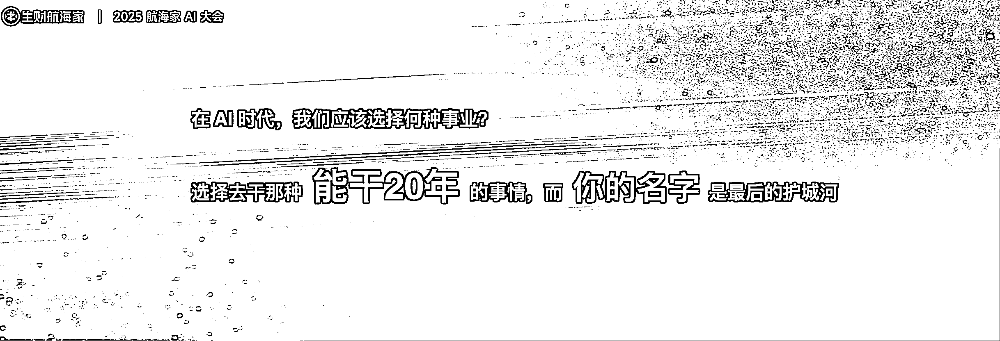

# (精华帖)(259 赞)《AI 编程 it is not for you, it is you》 演讲逐字稿

> 原文：[`www.yuque.com/for_lazy/zhoubao/ty5dc0ouf3irdy13`](https://www.yuque.com/for_lazy/zhoubao/ty5dc0ouf3irdy13)

## (精华帖)(259 赞)《AI 编程 it is not for you, it is you》 演讲逐字稿

作者： 刘小排

日期：2025-09-23

大家好，我是刘小排。

下面是我在 2025 年 9 月 20 日，生财有术 AI 航海家大会演讲《AI 编程 - it is not for you, it is
you》的逐字稿，以及广告。逐字稿尽量保留现场感，比较口语化，文风可能和以前的文章不一样。

### 引子

谢谢大家。我是做出海产品的刘小排。

这本来我是第五个讲，为什么调成第一个呢？

因为主办方说，做过脱口秀的人都知道，开场不好讲。我粉丝多，讲砸了也没事，毕竟我人比产品红。

我现在是做出海 AI 产品的，大家可能不一定知道。现在在嘉宾的桌上有一个“游泳健身了解一下”的传单，你们翻到背面，里面写着生财核心圈友，“出海”赛道里面根本没有我。

好，大家先给我点时间适应下，这个会真的很大，我第一次见脱口秀还有人卖站票的。

在座有看过《三体》的吗？举一下手。

好，看过的没有很多啊，那太好了，我讲错了也没关系。

《三体》是我非常喜欢的一部小说，它的故事背景是讲有一天，高智能的外星物种入侵了我们可爱的地球。这个时候，地球人分成了三个派别。

刚才看到看过《三体》的朋友不是很多，我简单介绍一下。

第一种叫“降临派”，意思是，他们本来就觉得人类不行，应该让外星人来接管我们的地球。

第二种叫“拯救派”，他们觉得虽然外星人很强，但是可以跟我们地球人和平相处，用一些外星的高科技解决我们地球上的问题。

还有一种叫“抵抗派”，在小说里面就是军方，他们觉得外星人是入侵，咱们得跟他干一干。

为什么举这个例子？因为这个例子看起来和我们今天面对的 AI 一模一样。我们正在面对的这个世界，正好就是“三体”的世界，只不过入侵我们的不是高智能的外星人，而是高智能的危机生物——AI。而普通人面对 AI，也分成了三个流派。

“降 临派”的代表人物马斯克，就经常鼓吹 AI 应该成为人类的家长，监管人类和所有的项目。

“拯救派”其实是大部分的创业者，他们想的是，我本来公司就这么多人，还可以再招一个 AI 来拯救我们公司。

“抵抗派”大家可能没意识到，在美国也是如此，比如你可能看到过新闻，去年好莱坞的编剧工会组织罢工，反对用 AI 写剧本；还有一些画家在前年的时候，也抵制大家使用 AI 来画画。

不知道你们是哪一派的？你们猜我是哪一派的？大声猜一下。

对，哎呀，熟悉我的朋友应该想到了，我哪一派都不是。

这个开头是不是很高级？我哪一派都不是。

这是我今天的核心观点，我们不应该做这三派中的任何一派。可惜小说里没有发展出这个派别，但今天的我们，应该做一个“融合派”。未来的生产力不是人和 AI 的对抗，而是人类和 AI 的深度融合，把 AI 变成我们的一部分。

融合派，这就来到我们的标题 ， AI —— it is not for you, it is you。这句话当时很简单，应该小学生都能明白。

这里我讲的 AI，特指的是 AI 编程。

### 第一部分 普通人如何跟 AI 融合到一起，变成一个超人？

普通人想要学习 AI 编程，最大的门槛是什么？

这个问题是大树在几个月前采访我的时候问我的，当时他说：“小排哥，这编程很神奇，普通人学习最大的门槛是什么？”我记得当时采访前，我真的没想过这个问题，当我想了一秒之后，告诉他：是勇气。

我当时就问了他三个问题：

你敢不敢相信，连英文字母都认不全的你能学会编程？

你敢不敢相信，你每天在那剪辑视频、导出文件的绝大部分工作都可以被自动化？

以及，你相不相信，你大部分的体力劳动都可以被自动化，而且不靠别人，只靠自己？

当时他沉默了。沉默就是告诉我：我不相信。

我是一直相信的。我觉得，“相信”才是最大的门槛，没有别的。

李荣禄完全不会英语，勉强能够认完 26 个英文字母。他学会了编程，通过软件外包挣到了钱。现在，他是出海 AI 产品创业者。

我想问一下在座有没有 50 岁以上的？有一个，那是家属。这个人更厉害，这是一个 58 岁的大哥。

58 岁，正是从零开始学编程的好年纪。

当时在我线下课的时候，他发现很多助教的父亲都没他大，因为可能很多同学是 95 后或 00 后，父亲不一定有 58 岁。

然后这大哥学完线下课程之后，两个月都没怎么交流，我还以为他放弃了。直到突然有一天，他跟我说：“小排老师”，给我发了个超大红包，说产品上线第一天收入 2000 美金。其实他给我发的时候收入是 1500 美金，他上线两个小时就给我发消息了，当时收入是 1500 美金。

我教一个 58 岁的大哥会了编程，产品上线第一天收入 2000 美金。这个故事我都可以吹 10 年。

我们还有一位女同学，兔子。她曾经是建筑师，这辈子从来没想过自己可能学会编程。 今天，她也做出来非常厉害的 AI 产品，正在用 AI 重新开启她的动画梦。
（产品尚未上线）

好，那你现在相信了吗？不知道大树在不在，你现在相信了吗？所以普通人学编程最大的障碍，就是相信的勇气，没有别的。

因为今天 AI 已经很强很强，你肯定可以学会。我们刚才展示了建筑设计师、不认识英文单词的人和 58 岁本来该退休却想学习的人，他们都能学会。

上面这些人本来都是我们生活中的普通人，只不过有一天，他把 AI 编程变成了自己的一个器官，从而成为了超人。

所以，普通人想要学习 AI 编程，最大的门槛是什么？是勇气。

大家一定要记得这个。还记得我刚开始的那三个问题吗？希望你能够发自内心地相信它，然后开始你的第一步。引用一下王阳明，“破山中贼易，破心中贼难”。

“山中贼”不就是你学习 AI 编程的过程吗？你看着那些看不懂的词，其实都不是事儿，真正难的是破除你心中的壁垒和心防，这个是难的。

### 第二部分 普通人如何跟 AI 融合到一起，变成一个超人？

我以前在猎豹移动，我的老师是傅盛老师，他以前跟我们讲过什么叫 AI 思维。我在今年 3 月的时候也把从他那学到的分享给了各位。

所谓“重视 AI”，就是“万事不决问 AI”，这个可能以前叫“万事不决问百度”还是知乎之类的。

有了 AI 之后，大家觉得“万事不决问 AI”就叫 AI 思维，其实不是的，这个最多叫“重视 AI”。真正的 AI 思维是“万事问 AI”，**去掉“不决”两个字** 。

大家品一品，为什么要去掉“不决”两个字？

你想想，有的人他特别重视 Prompt 工程。我来举个例子，Prompt 工程的实质上是什么？实质上是，重视 Prompt 工程的人都很自信，他误以为自己比 AI 厉害，要教 AI 做事，所以他才会写很长的 prompt，说：“你是一个专业的金融分析师，你现在要怎么样……”这个就叫 Prompt 工程。这种人太自负了。

因为今天应该早就明白，当你觉得你有一件事自己好像已经知道了答案，不用问 AI 的时候，你更可能是“不知道自己不知道”。重复一遍，当一件事你以为自己有答案，不打算问 AI 的时候，你可能是不知道自己不知道。

真正的 AI 思维是“万事问 AI”，不管你决不决，把这个当成你的习惯。

我今天想到任何一件事情，我都会先问 AI。就像苏格拉底说的，“我唯一知道的是我一无所知”。如果你养成“万事问 AI”的习惯，恭喜你，你有 AI 思维了。

这是我 3 月的时候的一个分享。今天，我们想对它做一个升级，就是“问”还不行，我们把 AI 思维从“万事问 AI”升级为“万事用 AI”。

当你问它的时候，它只是你的一个助理或者一个比较智能的搜索引擎。如果你只是问 AI 的话，你做不到刚才那个 58 岁大哥的那些事情。

AI 超人等于“万事用 AI”。

作为一个产品工作者，我面临的最多的问题是 —— 除了写代码，AI 还能帮你干什么事。

因为上个月我用 Claude Code，看了一个榜单，做的还行，我一个月消耗了价值 5 万多美金的费用。

我那个月应该是七八万美金，数据没全部传上去，显示出来是 5 万多美金。

为此我还破圈了，具体怎么用的，可以参考我在十字路口的播客。 [`mp.weixin.qq.com/s/QcYAf5-n1QrqwL0BAfQkuQ`](https://mp.weixin.qq.com/s/QcYAf5-n1QrqwL0BAfQkuQ)

很多人就说我是刷的，但了解我的人都知道我不是刷的。当很多人了解到我不是刷的之后，**他就能很快意识到：我根本没在写代码，因为写代码写不了这么多。**

此后，我回答的最多的问题变成了：**“除了写代码，AI 还能帮你干什么？”**

我会告诉他，你这个问题就问错了。

为什么问错了？就好比没有人问你：“手机除了打电话还能干什么？”这个问题它出现在 20 年前，你当时可能去回答说手机可以导航、发短信，但是今天不会有人问你这个问题，因为手机根本就是你的一部分，对不对？所以这个问题本身就问错了。

你如果一定要问这个问题的话，那我的答案是：万事。

但这不是一个好问题，真正的好问题是：“我要干什么？”不是“AI 能帮我干什么？”

就和你拿着手机一样，当你打开手机的时候，你只会问“我想干什么？”，不会问“手机能帮我干什么？”。作为融合派的人，我们就问：“我要干什么？”

我们举了几个很简单的例子，这些例子可能很多人都看过。考虑到在座很多人没有 AI 编程或者软件开发的习惯，我就展示一些特别简单的。

这个是我今年大概 5 月份做的。我是一个搞软件生意的，做产品的。大家记住，做产品这个生意，编程是非常小的一部分。你还要搞流量，去做用户运营、回复用户邮件、做 SEO、社交内容等等，甚至招聘和 PR 都会有。今天展示的例子不是跟编程有关的。

你会发现，用 AI 玩转小红书，根本不需要复杂的工作流。很多人说要用 n8n、coze 这些东西，当然很好，但它不够方便，对普通人的门槛稍微高一点。你可能得花时间去学。如果你已经是专业选手，你去学没有问题。但你如果不是专业选手，我也希望你能够记住，其实不用这些东西，你也能用 AI 在小红书上做这些事情。

这个视频大家仔细看看。你可以看到我啥都没动，我只是打了字。我只是说，我现在要用 AI 发小红书。先去豆包生成一个图，然后看小红书上面关于猫猫的文案有哪些，想一个写下来，再把你生成的这个猫猫的图加上文案发到小红书上。这是我干的全部事情，后面我就没动了，是 AI 自动在动，然后一会儿那条小红书就发出去了。

（无法插入视频，视频略）

微信也是可以的，而且这个事也很简单。我有一天早上很早就收到了一个微信，是亦仁用 AI 发给我的。反正大概就是他跟 AI 说：“我要给小排发一个微信，说我起床了。”然后我这儿微信消息就来了。

视频中这个剧本是，我跟 AI 讲：“我这两天要写新的 PPT，不管别人怎么邀请我，都帮我拒绝。”

在海外，这更没有问题，不管是 Telegram 还是 WhatsApp，本来都有官方的接口，可以给你做，也不需要自己去开发。

（无法插入视频，视频略）

当然，也可以做市场调研，对不对？比如你看现在有很多 AI 博主，他会去做一些介绍 AI 应用的视频。我就跟 AI 说，你上网找一些视频，自己帮我看看网上如果说有什么新的 AI 工具。没有任何编程，虽然这个界面是 Claude
Code 实现的，但跟我没关系，我就跟他说了一句话。

还有一个是发推特，这个很有意思。这个图我截得不太好。有一天我在推荐 Kimi，因为 Kimi 还挺好的，在国内的语境里面能力还蛮强的。推荐的时候我就顺手对 AI 说：“你给我发一条推特，帮我安利一下。”就这样，我就没管了，然后发完我就睡觉了。第二天早上一醒来，我想，昨天 AI 给我发的推特可能不太好，我就想去把它删掉。当我打开我的推特的时候，发现它阅读量已经 5 万了。这个图截早了，你今天去看这个推特的阅读量是 12 万。我自己亲自发一个推特，阅读量一般只有 3000，它能发出十几万。而你看左上角那张图，我只说了一个字：“发”。我前面还有一句话说：“Kimi 这个还挺好，你帮我发个推特吧。”它当时回复我说打算发什么东西，我也没看，我就说“发”，然后就这个效果。不需要编程，纯粹是对话。

再次印证了我刚开始说的，你信不信？你有没有勇气去试？其实这个不难，你们不用跟我学，你们只要多刷抖音就可以了。

好吧，现在大家明白了吗？为什么我觉得你们问我“AI 还能干什么”这个问题都错了。从今天开始，大家只问：“我要干什么？”

那你说这些神奇的东西是怎么做的？这是前两天一个同学问我的。

我现场给大家总结了一下：一件事，只要咱有 SOP，它就能被 AI 自动化。

什么意思呢？你就想想看，现在你的公司去招了一个名牌大学，比如哥伦比亚大学的实习生。这个实习生不一定有工作经验，但他可以把你公司的流程执行下来。比如说你让他回邮件，你可以告诉他一个 SOP：如果对方是第一次发，你应该怎么做；如果对方写的是德文，应该怎么回复；如果对方要退款，你先争取一下，争取不过再退。他肯定能执行。今天，同样的 SOP，你交给 AI 就好了，它就能被自动化。

一件事，只要咱有 SOP，它就能被 AI 自动化。如果把这句话再精炼一点，这是我总结的：流程即代码。你不用去学编程，写流程就行。

我们每天做的大量工作，本来就是重复的。去年的时候有人说，我们希望机器人帮人类扫地洗碗，因为人类要去写诗画画。而现在，机器人去写诗画画了，人类还在扫地洗碗。就短短过了一年，现在 AI 啥都干，他只外包了一个任务给我，就是帮他领工资。让 AI 代替你重复的自己，把你真正有创造力的时间释放出来。

### 第三部分 **AI 时代，我们何以自处?**

最后是也是我最常被问到的几个问题：AI 时代，我们如何自处？最重要的个人能力是什么？我们还需要学习吗？我们应该选择何种事业？

我要一块回答。AI 时代，我们最重要的能力是决策能力。我一直在想，为什么 AI 不能替代人？因为 AI 不能坐牢。你说 AI 给你写一个合同，你也不敢直接给客户，对不对？AI 不能坐牢，这句话虽然看着是开玩笑，但是是真的。

我们去想想这句话的实质是什么？是因为 AI 没有办法承担决策责任。

我们经常看新闻，哪里出了一个事故，虽然是临时工干的，但是领导要承担决策责任，对不对？AI 没有办法承担决策责任，它不能坐牢，所以 AI 不能取代人，这个请大家放心。决策者才需要承担责任，其他人包括 AI 的意见，都只是参考。借用一句我们编程里面的话：Talk
is cheap, show me your decision，意见都很廉价，决策才是最宝贵的。

这是 AI 为什么不能取代人类。好，如果你同意我的看法，那你就应该同意，我们现在当然要学习，而我们学习的一切，都是为了提升你的决策能力来准备。这是在座各位唯一要去提升的能力。

再讲讲 AI 时代如何学习。

这也是之前一个学术界的朋友跟我聊到的，AI 时代学习的终极方法，就是把自己当成大模型来训练。这张图，跟大家讲一个比较本质的知识，现在的大模型，它以前不叫大模型，叫深度神经网络。你听这个名字，深度神经网络这个东西本来就是人才有的。

那我们今天向 AI 学习如何学习，其实就是去找回我们本来就会的东西。我们人也是有神经网络的，对不对？我快速讲一下，这个有点技术化。其实大模型的学习是分为三个阶段的：预训练、后训练和强化学习。这是一个非常简单的模式，不一定完全准确，但大模型至少有这三个阶段的训练。

第一个阶段，预训练。它的意思是，对于大模型来说，它是要掌握全世界所有的知识。你还不能去删除。我再给你们讲一个知识，我以前在前公司也训过大模型，当时为了应对国家的一些监管要求，大模型不能输出黄赌毒这些内容。我们当时就天真地想，那从训练样本里面把色情的内容全拿掉，出来的模型是不是就不会说色情的话了呢？后来发现不是。你就想象一个很好的小孩，从小都没有看过色情的东西，那到他十五六岁第一次看到色情作品的时候，你想想他那个兴奋劲儿，AI 也一样。所以第一步是学习全人类所有的知识。对于想在商业上成功的人来说，这一步对应的就是“全覆盖”，全覆盖整个商业圈，把你看得懂的、看不懂的，你觉得好的、不好的都看一遍。这就是商业的预训练过程。

第二阶段，后训练。对大模型来说，就是对某个垂直领域进行深度垂直的学习。比如我们今天看到的一些模型写代码特别好，那它就是在代码领域进行了后训练。那对我们来说，你就加入航海家。开个玩笑，为什么呢？就是后训练，你找到一个垂直领域。比如说我们航海家大会，这个会就是关于 AI 的，你来这里参加，你就是在对 AI 的认知去做一些后训练，让自己变得更强。可能下个月还有 IP 的会，那如果你是做 IP 的，你应该去参加下个月的会。你还需要去参加一些专门的讨论会，去连接一些行业领域的高手，这些都是你的后训练素材。

模型的第三部分叫强化学习。它们是不断通过反馈去提升自己的能力。对于搞商业的同学来说，就是实战，实践出真知，在真实世界的风险里面去迭代，这样能够提升你的真实水平。这就是我们向 AI 学习的一个方法。

最后，AI 时代如何选择事业？

大家可以发现，AI 时代山寨特别快，AI 洗稿可能比原来还快。我的产品做了一个什么功能，没几天就出现一个一样的。就好像你做什么都会被别人山寨，那你的独特性一点都没有。所以我也在思考这个事情，跟大家分享一下我的思考。在 AI 洗稿时代，你觉得还有什么事业是不能被山寨的？

是有的。我至少观察到两个现象。

第一个现象是，AI 时代，一句话到底说了什么，变得越来越不重要；而这句话是谁说的，变得越来越重要。大家想想，就比如我们一直在说的 AI 编程，你可以自学，可以参加一些小航海，你还可以直接用 AI。但是有很多人他就是要花钱跟我学。是我讲的比 AI 好吗？肯定不是，我都说了 AI 比我强。那他花钱找我学的唯一理由，就因为我叫“刘小排”。这句话到底是谁说的，变得越来越重要。

第二个现象是，一个产品有什么功能也变得越来越不重要；这个产品叫什么名字，变得越来越重要。就比如说生财有术，也挺贵的。市面上也有别的一些社群，收费便宜点，点进去看了下，跟生财有术一模一样，甚抄了小航海，还抄了联合办公。那你为什么要买生财有术？就因为它叫“生财有术”。它已经做了 9 年了，我们做这个是专业的。这个产品叫什么名字，变得越来越重要了。

好，你结合我讲的这两个现象，你就会发现，AI 时代应该干何种事业？我们接下来要选择的是那种不能被山寨的事情，能做 20 年的事情，能体现你的名字的事情，这才是可以被积累的。

生财有术已经干了 9 年，我们丝毫没有理由怀疑它可以干 20 年。有哪些能干 20 年，并且让你的名字成为最后的护城河的事业，它就是值得你去干的。

举个例子，Citely 这就是一个能干 20 年，而且名字非常重要的事业。

Citely
最近全网爆火，视频在抖音上播放量已经超过了 70 万次，创作者是我第一期课程的学员。这是抖音视频，你可以感受一下。[`v.douyin.com/PVKQC3HWBPY/`](https://v.douyin.com/PVKQC3HWBPY)

它的功能很简单，你听我演讲的此时此刻，它可能已经被别人山寨了。

这个创业者他叫兔老师，她今天没来。她为什么没来？因为这一周都是投资人追着他跑。那投资人为什么不追着他的山寨品？因为这个 Citely 的名字和兔老师这个人本身的 IP，就是他最后的护城河，哪怕别人的功能跟他一模一样，都不能取代。

同样的例子还有 Manus，现在国内大概有五六家抄它的，功能做得比它好，但是 Manus 估值 50 亿美金，其他的山寨品都不值 1 个亿。

好，希望对大家有启发。

刚才有人说我看《金刚经》，我再给你讲一段《心经》：色即是空，空即是色；色不异空，空不异色。

AI 即是你，你即是 AI；AI 不异你，你不异 AI。

如果大家希望从我的分享里记住什么的话，就记住这个。

AI 只是一个为你设计的工具，它就是你自己。希望我们可以从今天起，做一个融合派，停止把 AI 当成“它”，而是把 AI 当成“我”。

AI - It is not for you, it is you.

谢谢大家。

上面提到了一些例子，比如 58 岁大哥钢铁的铁、CitelyAI 的作者兔老师、
曾经是建筑师今天重启动画梦的兔子 Molly、勉强认识 26 个字母但是能做出 AI 产品的李荣禄、一个人把直播间做到行业头部的包子老师……
他们还有一个共同点——都是我们第一期《Idea to Business》课程的学员！

在线下大会的时候，有很多朋友询问起是否还开第二期课程、什么时候开？

那我们就开吧！

### 第四部分(广告) 《Idea to Business: 用 AI 编程，兑现你的创意》课程（第二期）明天发售

朋友们好，我是刘小排。

我和生财有术合作的《Idea to Business:
用 AI 编程，兑现你的创意》课程（第二期），即将在北京时间 9 月 24 日 20:00 开始发售。这是今年最后一期。

在课程中，我们将会讨论**「从产品 idea、到使用 AI 编程做出软件产品、到变现、到成为一门可持续生意」** 的全流程**。**
每期课程交付时间为一年，前两个月为高强度学习期，后十个月为陪跑期**。**

回答几个常见问题。

#### 问题一、第一期的学员怎么样了？

**有人拿到了大成绩。**

钢铁的铁：58 岁的老大哥，产品上线**首日** ， 收入$2000 美金。

[`t.zsxq.com/B4s86`](https://t.zsxq.com/B4s86)

兔老师：Citely AI 全网爆火，投资人追着找。

产品介绍视频，在抖音已经有超过 70 万播放。

[`v.douyin.com/PVKQC3HWBPY/`](https://v.douyin.com/PVKQC3HWBPY) (这是一个抖音视频)

王马扎： 15 天破 1000 刀

[`t.zsxq.com/O9Lxu`](https://t.zsxq.com/O9Lxu)

**有人赚到了人生第一次美金**

井然：土木工程师裸辞，在 AI 出海产品赚到了第一笔美金

[`t.zsxq.com/90tQ7`](https://t.zsxq.com/90tQ7)

银河星游：自研解密类游戏

[`t.zsxq.com/GkqGS`](https://t.zsxq.com/GkqGS)

……

案例太多了。如果你需要看更多案例，请你在生财有术官网搜索刘小排或者深海圈。

**有人学会 AI 编程来为自己的业务赋能**

这样的案例很多。我们发现，更容易拿到结果的，往往是自身有业务、通过学习 AI 编程技能来放大的。

这也是我们第一期课程始料未及的。有人用 AI 编程来提升软著代写业务十倍效率、有人用 AI 编程来辅助做虚拟资料等等，我们还有来自电商、IP、出海、Web3 等等多个领域被 AI 编程赋能的喜报。

其中最典型的案例是 包子老师。他用 AI 编程来赋能自己的直播间业务，一个人做到了行业头部。详见 [`t.zsxq.com/164LA`](https://t.zsxq.com/164LA) 和
抖音账号 **大明白选专业。**

对了，包子老师，也将会成为我们第二期课程的助教。

**更多的同学没有拿到成绩**

我们课程的强度非常大，请大家不要过于激动，要做好投入充分时间精力的准备。

这里必须要强调，更多的同学没有取得任何成绩！

我们课程只讲技能和思维方式，不承诺学习完就能赚钱。

我真的不是在谦虚，我是认真的。请仔细看看课程标题——Idea to Business。 同学，清醒一点，你得先有一个有商业潜质的 Idea，才能 to
Business。

#### 问题二、第二期比第一期有哪些升级？

1.  直播成为重要的交付环节。 前两个月高强度学习期，在两个月内的每个重要节点结束，都有直播串讲

2.  增加有关“流量获取”的课程内容。

3.  增加有关“产品设计”的课程内容。

4.  不止是 Cursor，而是所有的 Vibe Coding 工具一通百通，包括 Codex/Claude Code 等等。

5.  增加一个适合新手的模板——Vibe to Production ，同时交付源码和配套教程， 让新手在学习完课程后、只需要一个周末、只靠 Vibe Coding(嘴喷需求)，就能上线正式的商用 AI SaaS 产品。

第二期课程升级，也将会同步给第一期学员。

#### 问题三、为什么是今年最后一期？

第一期，我们限制了名额 900 人，有很多朋友留言说没有抢到，强烈要求我们再开一期。

我的时间成本投入到课程上已经很不划算了。既然答应了再开一期，肯定会再开，不过，也肯定是今年最后一期了。

明年是否继续开第三期，看缘分吧，即便开，肯定也会涨价的。

#### 问题四、非生财圈友可以参加吗？

不能。只对生财有术圈友开放，限额 900 人。

为了保证课程与大家需求匹配，我们在报名结束后会有一个**双向选择和审核的环节** 。毕竟，人数如果太多，或者大家的需求与课程方向差异太大，我担心最终的学习效果会打折扣。

明天见！

* * *

评论区：

bravo : AI is not for you,it is you！

袁锐钦 : 明天广东台风，要是停电没信号怎么搞！！请求预留广东名额，哈哈哈

JOHNNY 强尼 : 笔记：养成 AI 思维：从万事问 AI 到万事用 AI 怎么用 Claude code： 问自己：我要干什么？而不是 AI 能帮我干什么 AI 时代最重要的能力是决策能力
向 AI 学习如何学习： 1.预训练-全覆盖，把商业圈的知识看一遍：全覆盖级阅读生财有术 2. 后训练：对某个领域进行垂直、深度的学习
3.强化学习：参加航海实战、每日复盘 做一个融合派，停止把 AI 当成它，而是把 AI 当成“我” 培养 AI 思维——从“使用工具”到“融合共生”
核心转变是：停止把 AI 当作一个外部的“它”，而是将其内化为延伸的“我”，成为一个“融合派”。 --- 一、 核心理念 1. 思维转变：从“万事问 AI”的被动索取，转变为“万事用 AI”的主动整合。 2. 行动起点：问自己“我要干什么？”，而不是“AI 能帮我干什么？”。让目标驱动 AI 的使用，而非被 AI 的功能限制。 3. 核心能力：在 AI 时代，最重要的能力是决策能力——即提出正确问题、判断信息价值、做出最佳选择的能力。 二、 向 AI 学习“如何学习”
可以将 AI 的学习方法论应用到个人成长中： 1. 预训练 · 广博涉猎 · 目标：建立广阔的知识基础，了解全局。 ·
实践：像 AI“阅读”全网数据一样，进行“全覆盖”式学习。例如，通读“生财有术”等商业圈的知识，建立宏观认知。 2. 后训练 · 垂直深耕 ·
目标：在广博的基础上，对特定领域进行精细化、深度学习。 · 实践：聚焦一个垂直领域，深入钻研，构建专业壁垒。 3. 强化学习 · 实战反馈 ·
目标：通过实践和反馈，不断优化和调整行动。 · 实践：参加“航海”等实战项目，并进行每日复盘，从行动结果中学习和迭代。 三、 实践工具与资源 ·
具体技能：学习如何高效利用 AI 工具，例如《怎么用 Claude 写代码》（参考链接：）。[`mp.weixin.qq.com/s/QcYAf5-n1QrqwL0BAfQkuQ`](https://mp.weixin.qq.com/s/QcYAf5-n1QrqwL0BAfQkuQ)[`mp.weixin.qq.com/s/QcYAf5-n1QrqwL0BAfQkuQ`](https://mp.weixin.qq.com/s/QcYAf5-n1QrqwL0BAfQkuQ)

安宇轩~ : 常看常新[呲牙][呲牙][呲牙]

徐师傅😏 ⁶⁶⁶ : 老师还有名额么 怎么报名加入

刘小排 : 谢谢支持。今晚开放，注意关注星球帖子

周幸 : AI 不能坐牢这句话真是精髓。很多科幻小说里面都提到未来会有很厉害的超级电脑掌控社会各个层面，但从来没人提万一这个超级电脑决策出错会怎样[微笑]

搞钱萌新 : 刘小排老师再长的文章我都能耐心看完，他的文章对我这个小白来说看得懂又有致命的吸引力