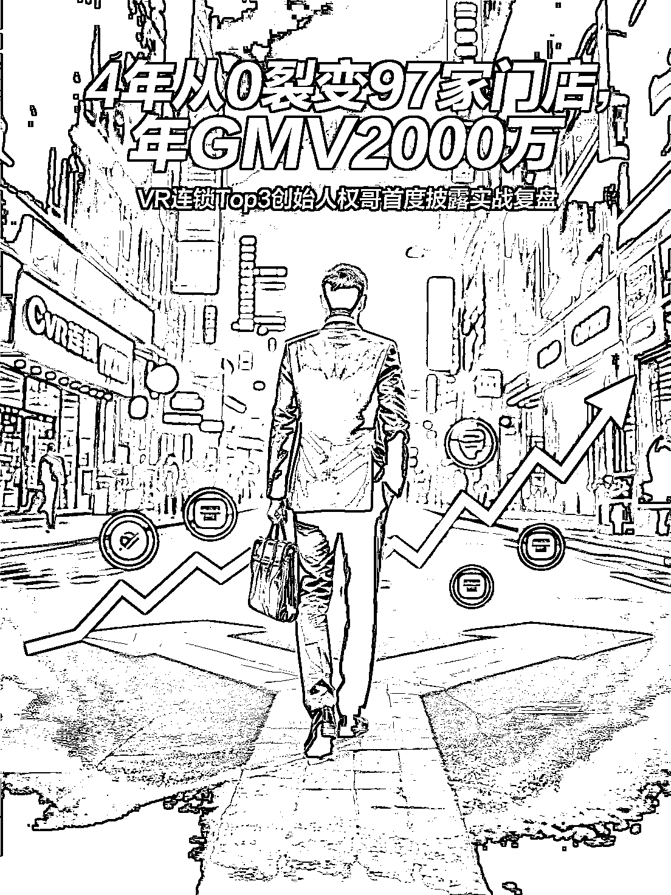
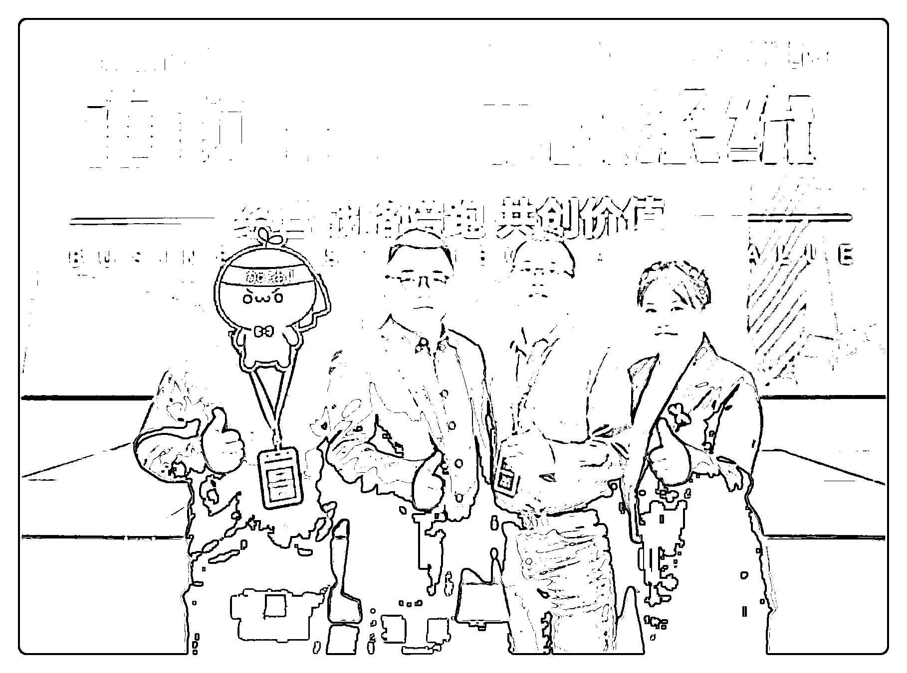
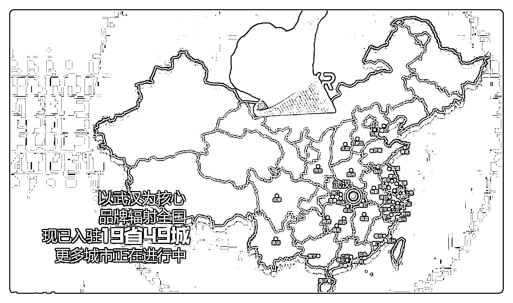

# (36 赞)4 年从 0 到 97 家店、年 GMV2000 万，VR 连锁创业复盘与再出发

> 原文：[`www.yuque.com/for_lazy/zhoubao/xbvaqea23zveu4yh`](https://www.yuque.com/for_lazy/zhoubao/xbvaqea23zveu4yh)

## (36 赞)4 年从 0 到 97 家店、年 GMV2000 万，VR 连锁创业复盘与再出发

作者： 权哥.Ai 进化版

日期：2025-09-28

4 年从 0 裂变 97 家门店、年 GMV2000 万， VR 连锁 Top3 创始人权哥首度披露实战复盘。 我曾亲手打造了一个全国 TOP3 的 VR 连锁帝国，
却又在巅峰时选择将它彻底“清零”。 这篇万字长文，没有高深的理论， 只有我用千万学费换来的两个词： 流量、人。 深度复盘我从 0 到 97 再到 0 的全过程。
如果你正陷在迷茫里，这篇文章能帮你找到答案。
请移步飞书：[`ymcncqsd4u.feishu.cn/docx/CdhXduiFloo4fux5gpzcL5wonUh`](https://ymcncqsd4u.feishu.cn/docx/CdhXduiFloo4fux5gpzcL5wonUh)

* * *

评论区：

暂无评论