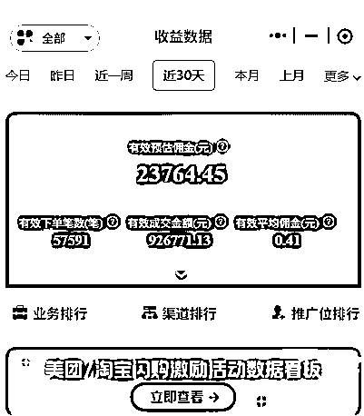

# (精华帖)(48 赞)从 0 到月销 5W 单我做外卖 CPS 短视频的爆款框架与思维转变

> 原文：[`www.yuque.com/for_lazy/zhoubao/vkr8vpnin9veuhxv`](https://www.yuque.com/for_lazy/zhoubao/vkr8vpnin9veuhxv)

## (精华帖)(48 赞)从 0 到月销 5W 单我做外卖 CPS 短视频的爆款框架与思维转变

作者： Lesley🐾

日期：2025-09-16

见字如面，大家好，我是新人 Lesley!是今年 5，6 月份加入生财的萌新一枚

在此之前我没有任何靠副业赚钱的经验

这次外卖 CPS Min 航海中我靠着之前信息流工作经验跑通了从 0-1 的闭环，单月佣金超 2W+

感谢航海过程中教练们的无私奉献，和圈友们的无私分享，这次成绩离不开各位的帮助

本篇帖子分享了我本次航海的实战思路，如何从短视频营销的底层逻辑产出爆款视频，希望能给小伙伴们带来启发~

下面是这篇分享的大纲:

一.从信息流编导到自由职业的探索

二.从 0 到 1:冷启动与快速破局

三.爆发增长:爆款的诞生与方法

四. 核心干货:爆款视频的底层逻辑

五.现状与未来:红利后的挑战与应对

详细可以查看飞书链接: [`uq5667tkx0.feishu.cn/wiki/JNHHw1snniSBPvkbhqWcUwsLn7f?from=from_copylink`](https://uq5667tkx0.feishu.cn/wiki/JNHHw1snniSBPvkbhqWcUwsLn7f?from=from_copylink)

* * *

评论区：

暂无评论