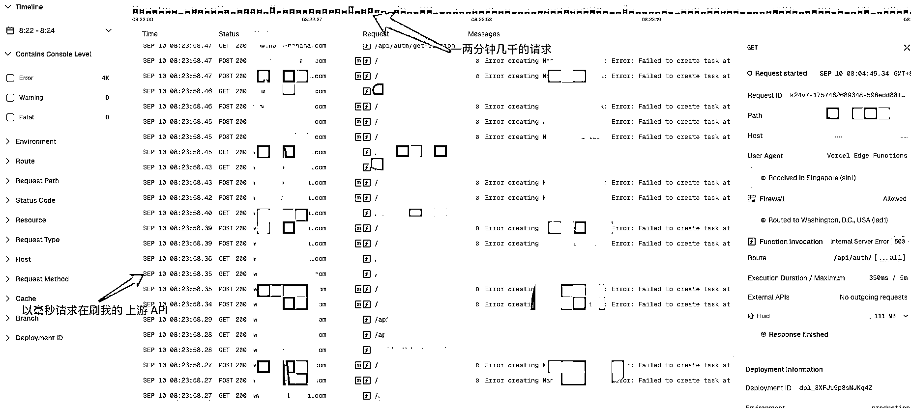

# (27 赞)你的 API_KEY 可能需要加强认证：亲历黑客每分钟数千次请求攻击，我是如何止损并全面加固网站的

> 原文：[`www.yuque.com/for_lazy/zhoubao/lxqcptsihvx2pnkf`](https://www.yuque.com/for_lazy/zhoubao/lxqcptsihvx2pnkf)

## (27 赞)你的 API_KEY 可能需要加强认证：亲历黑客每分钟数千次请求攻击，我是如何止损并全面加固网站的

作者： 井然

日期：2025-09-13

最近也有圈友说自己的网站被黑客绕开认证逻辑，疯狂刷上游 API 造成了损失。

我觉得应该把自己同样的经历写出来分享出来和大家一起探讨一下了！

我经历黑客攻击后立马对自己的网站做了全面检查维护并做好多层安全措施加固！

（认证逻辑加强，加 vercel kV 与 upstash 全局限流限制 IP 和单个用户频率限制使用）

文章末尾有我完整的完全措施加强日志文档。

本篇文章是个人见解，分享这篇文章希望能帮到有需要的朋友们！

图片有点多，请移步到飞书文档👇

[`acnwscsrr4nu.feishu.cn/wiki/AzWTw1HKYiQJdIkPmiWcI9nmnPf?from=from_copylink`](https://acnwscsrr4nu.feishu.cn/wiki/AzWTw1HKYiQJdIkPmiWcI9nmnPf?from=from_copylink)

* * *

评论区：

小吉玛丽亚 : 管他的！先赞再说

毒蘑菇🍄 : 我昨天也遇到一个类似被疯狂刷 api 的事情， 我不懂是不是被黑，还单纯是 bug。 我是在本地 cursor 中使用 Kimi 驱动的
claudecode，我让 安装了 for cc 的 figma 的 mcp，在对话中要求使用 figma mcp
的时候页面快速刷动，一开始我没在意，后来发现都是在重复请求 mcp 但结果都是 no request，几分钟以后我按 esc 中断了它，查看 kimi 的
token 几分钟消耗了几百万，也是毫秒级别的消耗。 我询问 cc 他在干嘛，又触发了上面的疯狂请求，我就没敢再试了。 写在这提醒大家用 api
的时候实施注意自己的 token 消耗。