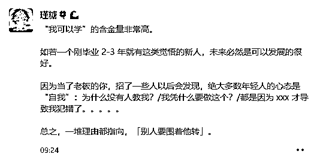
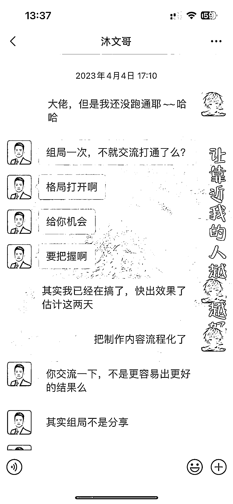
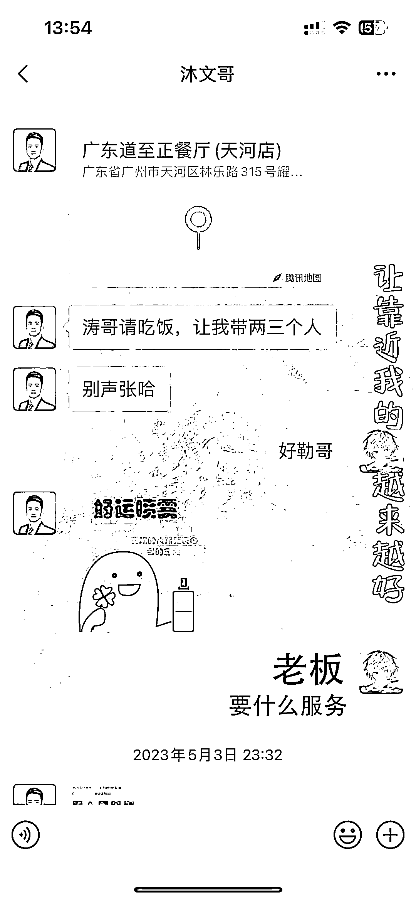
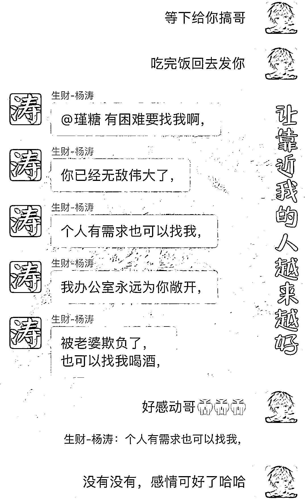
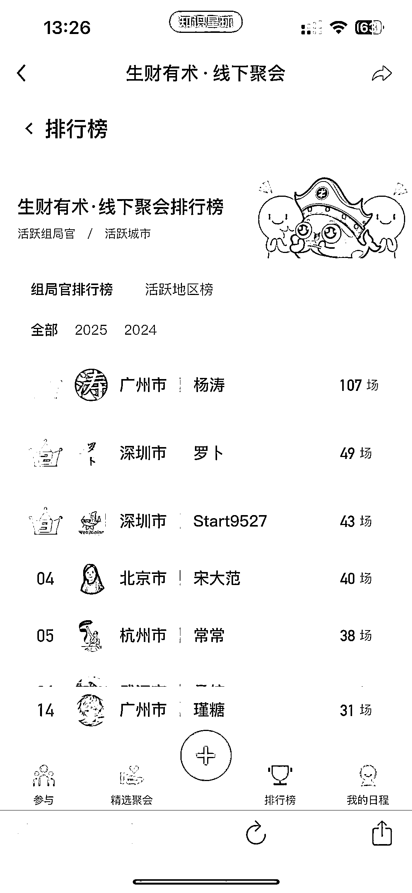
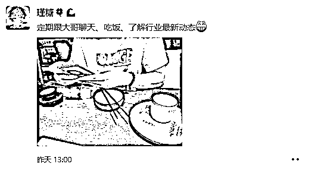
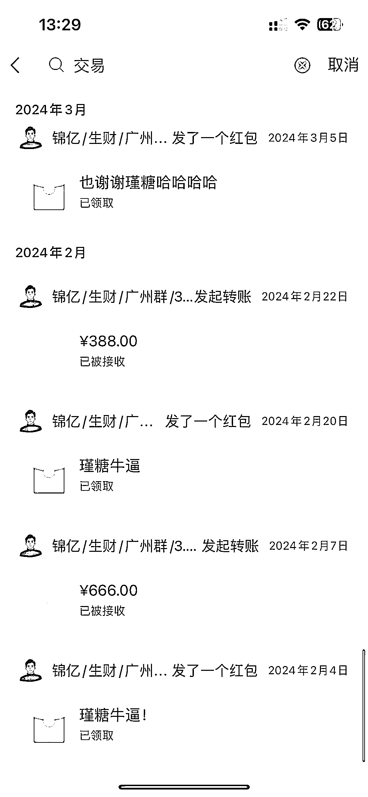
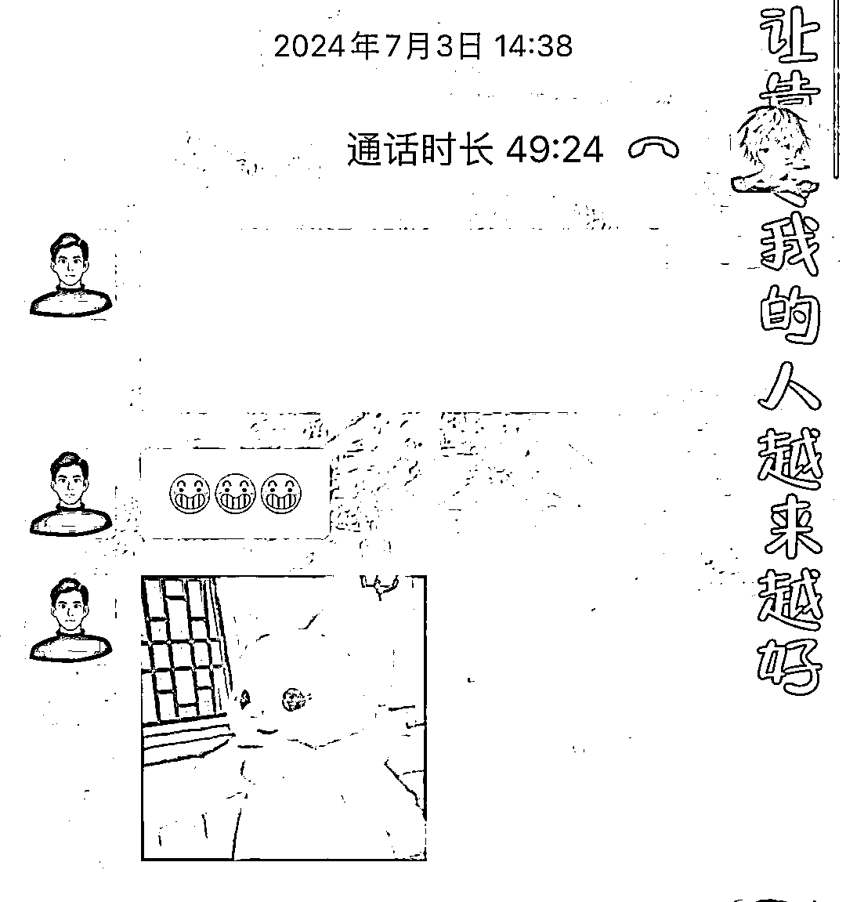
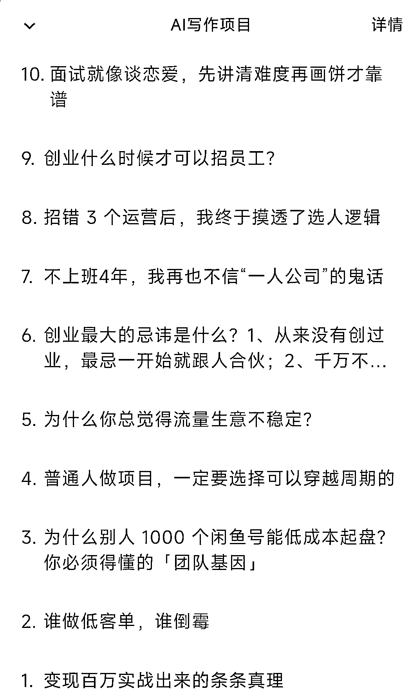

# (33 赞)什么样的人值得帮？看这 3 点就够了

> 原文：[`www.yuque.com/for_lazy/zhoubao/ga4vqydu4lch2rum`](https://www.yuque.com/for_lazy/zhoubao/ga4vqydu4lch2rum)

## (33 赞)什么样的人值得帮？看这 3 点就够了

作者： 瑾糖

日期：2025-09-19

今天我来从两个角度出发聊一下这个问题。

**一个是我当初籍籍无名、被大哥带的时候，**

**另一个是现在稍有成绩、自己带人的时候。**

**想获得大哥的带教或帮助**  **，核心原因无非两种。**

一是他在你身上看到了曾经的自己，想成就你变得比当年的他更好。

二是他有想完成的目标，而你刚好入了他的眼，比身边其他人更像当年的他。

这是最主要的两点，当然也不排除有一些大哥乐善好施，会给每个人初始阶段的定量帮助。

但想让这类大哥进一步带你，就得靠自己争取了。

**  **

**先说说我自己的经历，大家应该听过我总提沐文哥** 。他是我心目中真正的大哥。

那时候，沐文哥正想做成一些事，而我只是他几十个小弟里平平无奇的一个，为什么最后能成为他的头马。

答案很简单。

**我是最肯干的那一个**

**  **

别人每天花在大哥交代的事上只有一个小时，**而我每天至少投入 13 个小时。**

他一看就知道，**这个小伙子和别人不一样。**

木文哥曾是风向标王中王、龙珠训练营扛把子，手上握着大量龙珠资源。

他觉得风向标的价值极大，想把里面的项目和信息单独拎出来，孵化成一个又一个小项目，于是在广州发起了十来个项目。

我参与了其中 4 个，一开始也只是想跟着大哥学东西，

但真扎进去之后，我从没想过随便做做，而是尽全力把自己负责的部分做到最好。

等我把自己的板块做好后，**大哥觉得我靠谱，就让我牵头规划整个项目、负责执行。**

跑出第一个案例时， **我会定时定点跟大哥汇报，分享喜悦和成绩。**

我的喜悦其实也是他的喜悦，因为这正是他想做的事，我帮他做出了第一个 MVP，刚好达成了他要的效果。

在大哥带团队做事时，小弟们的能力本就参差不齐，

**你只要做最显眼、最肯干的那一个，** 就会在他心里埋下值得帮的信号。

他知道你会 **尽心尽力把事做成，还会给反馈，**

而不是把他的帮助当成自己的能力，自然会持续帮你。

沐文哥是这样，**涛哥也一样。**

涛哥会给每个人恒定的初始帮助，但你若能做出成绩、及时反馈，还把他放在心上，他就会进一步出力。

之前涛哥想把组局这个板块做好，铆足了劲要推进，于是把各个城市主局的人拢起来分享经验。

我当时就想着，得尽我所能帮大佬把这件事做好。

**  **

**那一年我组了 40 多场局，虽然不足涛哥的 1/5，但在所有主局官里也算靠前的。**

后来涛哥在群里说，哪怕我和媳妇闹矛盾，深更半夜找他，他办公室的门永远为我敞开。

大佬在圈子里拢小弟，本是为了完成自己的目标，我们能从中学经验，

但想获得更多，就得付出更多， **而反馈就是最好的付出。**

**我现在还隔三差五跟沐文哥汇报近况，这就是维持信任的关键。**

**  **

**  **

**还有一类大哥，不会在圈子里公开拢人，他们有自己的筛选标准，大多在专注做自己的事，未必需要别人帮忙。**

但他们为什么会帮你。因为在你身上看到了年轻时的自己。

他会想要是我年轻时有人带，是不是能少走两年弯路。

当他在你身上看到影子，就会不自觉倾斜帮助。

而当他的时间和心思换来了你的反馈，帮助就会持续。

**恒哥于我就是这样。**

他这样的大佬，**本不该和我有交集，** 但我们因组局相识后，我会持续和他保持联系。

我向他请教时，**从不是空着手去。**

我知道他身边业务制作的盘子需要什么，就主动把自己认识的、觉得有用的渠道和圈子分享给他。

第一次找他请教搭后端团队时，他跟我聊了四五个小时，把自己的盘子怎么搭、怎么培训的 **全教给了我。**

之后我也会**定时找他吃饭、汇报进度。**

团队怎么样了、业务做的如何、接下来的规划是什么，上门时还会带点小礼物。

不用多贵重，比如出差带的当地特色就行，他其实很开心。

就在昨天，他跟我说有个以前做过、随便做都能赚钱的业务，要是重新拾起来，想拉着我一起做。

你看， **大佬从不**  **看你多能说，只看你心里把他多当回事。**

聊完我被大哥带的经历，再说说我现在带人的体会。

在我全力做组局的时候，会毫无保留地分享。

当时组局、做业务的那些经验，在**我看来都是压箱底的东西，只要是能解决的问题，我都会尽全力给方案。**

这些年组局见过的人，不说一千也有八百，

**但真正把我的话放心里、还会反馈的人，十个里未必有一个，能一直持续联系的更是只有一两个。**

**锦亿就是这少数人之一。**

他在业务放大的过程中，总会来找我。

不是单纯来要建议，而是带着问题和他自己的解决方案来讨论。

每次聊完，**他会把我的建议落实执行，之后还会主动反馈。**

**  **

这个方案帮他解决了什么问题、做出了什么成绩。

**而且每次聊完他都会发个红包，这份心意和反馈，让我更乐意掏心窝子帮他。**

从他刚起步到现在，我们会定期吃饭、聊业务，互相给对方的板块当参谋。

**反观有些人，明明按我的方案做了（哪怕只是部分），却从没主动跟我说过，我还是从其他渠道偶然得知的。**

不是说要图什么，但如果他能主动说一句，我但凡有新的想法，肯定愿意再帮他一把。

所以说，**获得帮助后定时反馈太重要了，**

这是对帮你的人最好的回应。他能从中获得成就感。

另外，想找大哥请教，**一定要做好准备。**

我每次找人请教， **都是带着自己的思考和方案去的。**

但之前遇到过**有人直接问我 AI 写作有没有市场、怎么入行，**  **我真的懒得理。**

我正在做这件事，**也做出了成绩，50 多篇公众号文章、**

那么多帖子里**都详细写了怎么切入这行** ，**他连看都不看就来问。**

**我要是觉得没市场，还会做吗。**

当然，就算做好了所有准备，**也要有被拒绝的心理预期。**

**帮你是情分，不帮是本分。**

大佬的时间都很值钱，不会无缘无故花在任何人身上，他们只会投资有闪光点的人。

大哥的作用，是在你已经走出 99% 的时候，帮你完成那最后的 1%。

**千万别想着** 让大哥帮你走完 99% 的路。

大哥是你路途中的明灯，照亮的是方向，**不是点燃你这盏灯的燃料** 。

**世间没有凭空而来的提携，一切机遇，都是你过去所有选择和态度的总和。**

* * *

评论区：

水蜜桃🍑 : 感谢分享🌹

锦程拾光 : 你这篇文章给我的感觉是，还是要走出去，多交流多沟通，不要闭门造车

Cheer 林悦己 : 糖总真的，不来虚的！

锦亿 : 感谢大哥带飞~！！[跳跳]