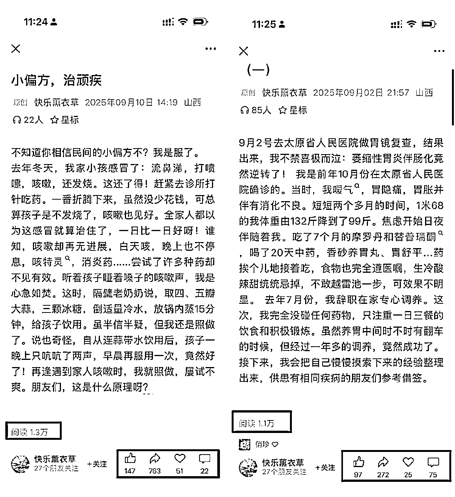
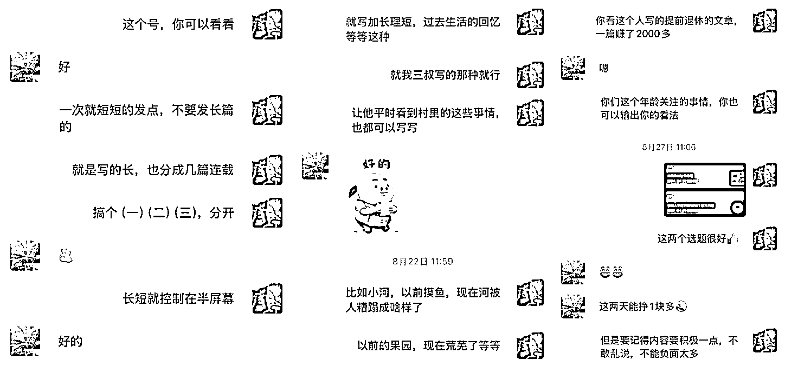
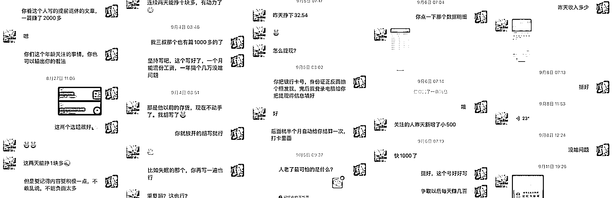
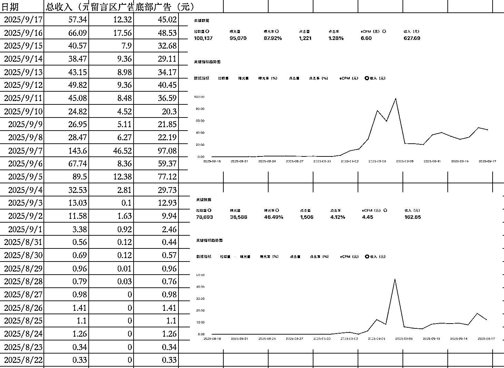

# (64 赞)带着 55 岁退休的婶子做公众号，一个月收入 790 元，得到的公众号稳定流量的核心逻辑

> 原文：[`www.yuque.com/for_lazy/zhoubao/sio0qmizbzkonnoz`](https://www.yuque.com/for_lazy/zhoubao/sio0qmizbzkonnoz)

## (64 赞)带着 55 岁退休的婶子做公众号，一个月收入 790 元，得到的公众号稳定流量的核心逻辑

作者： 张集慧

日期：2025-09-18

前几天公众号垂直小号直播中，我讲了我身边的一个案例，就是我让退休的婶子去写公众号，数据居然出奇的好，最近几天数据还在涨，收入也是越来越多了，反观公众号航海群里面大家每天这么多教练带着，大家各自高科技 AI 用着，数据反而天天挂 0，这个感觉太割裂了。今天我想就这个案例，和大家聊聊写好公众号背后最核心的逻辑。

**就这样没有排版，没有图片，挤成一坨的文字（我告她不要分段落，就写一坨），很多篇都 1w+阅读。**

让我婶子写公众号，完全是一个随口聊天引发的事情，8 月的一天，我的一个亲戚家有点事情，所以很多亲戚就都去了，聚在一起就难免会聊天最近做什么，我就说我最近在做公众号，收入还可以，写作也简单等等，这时候我婶子就问我，她能不能做啊，反正退休了，闲着也是闲着。

当时想着我要带公众号航海，别人都要带，身边的人也不能放过，正好测试一下纯小白，纯素人做公众号是怎样的效果。

说干就干，拿过来手机注册账号，人为干预涨到 500 粉，开通流量主，号就准备好了，号容易准备，但是写什么啊？这也是我婶子问我的问题，她不知道他该写什么？

我告诉她，你想写啥写啥，在村里今天吃了碗面，你就可以回忆一下过去饥饿的年代，过去吃什么，遇到个朋友，就可以写写过去和她的趣事，天旱了，庄稼不长了，下雨了，河里发水了，看到鸡，就拍张鸡的图，看到狗就拍张狗，随便写，就这样简单教了一下，完后我们就分开了，各回各家，剩下的就是在微信交流了。

**大家有没有发现一个问题，我什么规则都没和她说，没说几点发布，没说去用 ai 写作，去 ai 浓度，没说文字多写点，文章都插几个广告，没说要注意 ip.......,我什么都没提，我当时想着就是，她能写好内容，就行了，一开始越简单越好。简单她才能全部关注到内容。**

**  **

**  **

收入从每天的 1 块多，到 10 块多，到 80 多，到 140 多，收入一天天的在增长

这个从 8 月 22 号到今天不到一个月的账号的数据，我完整的给大家看一下

**1）收益数据**

 wwB)**2）阅读量数据** CKX8-sCK)

最后，我们回到我们开始的疑问，为什么完全没有互联网经验，也没有告诉她任何公众号写作技巧的老年人，他的公众号写的要比一些整天研究互联网，研究高科技的人，来的随意，来的轻松呢？我分析后感觉只有 8 个字

# **大道至简，内容为王**

一、大道至简，写好一个公众号，没那么多条条框框，你平台听太多课，太多的理论，技巧（99%的都是错误的，就算是对的，也是正确的废话），自媒体，本质就是内容，你要触动你的用户，就是用你的内容，只盯着内容就行，其他都是浮云。

二、内容为王，为什么这样随便写的一坨的碎碎念，流水账，有这样的阅读量，背后的根本，是内容的稀缺的，我们年轻人 10000 个人里面可能有 50 个人在写公众号，你关注的话题，你身边的人正好也关注，你写，别人也写，一片红海，就像早高峰的拥堵，老年人就不一样了，2 亿人的用户，整天看你们年轻人写的内容，年轻人喜欢的内容，还有年轻人认为的老年人喜欢的内容，他们真正喜欢的内容，又少的很，他们中间的内容创作者，又少之又少，10000 个人里面有 1 个创作者么？

需求远大于年轻人，内容供给又严重不足，你就是写一坨垃圾碎碎念，都是稀缺内容，都会有人看，都会有人互动。就像外国的留着，一碗白水煮挂面，加个荷包蛋，加勺子老干妈，就是人间美味，但是同样这碗面，你放国内让人吃，对方不把面糊你脸上，算他脾气好。

不知道大家会不会好奇我婶子创作内容的时候，是怎么想的么？老年人和我们年轻人思维有什么区别？有什么经验可以分享的么？如果大家有需要，点赞超 300 个，我就请她来给大家讲讲，思维碰撞一下？哈哈哈哈

* * *

评论区：

吴泽承 : 不愧是“慧姐”[强]

张集慧 : [坏笑]

不言 : 不愧是“慧姐”[强]+1

元启 : 还是慧姐厉害，一语道破天机

余白 : 大道至简，这句话的含金量一直在攀升啊[强][强]

孙大圣 : 教练厉害啊👍好有意思！

可可 : 原来，老年群体看的内容是稀缺性，我应该就是卡在中年群体的早高峰拥堵上了

不言 : 来看一眼 46 个点赞了，坐等 300 点赞