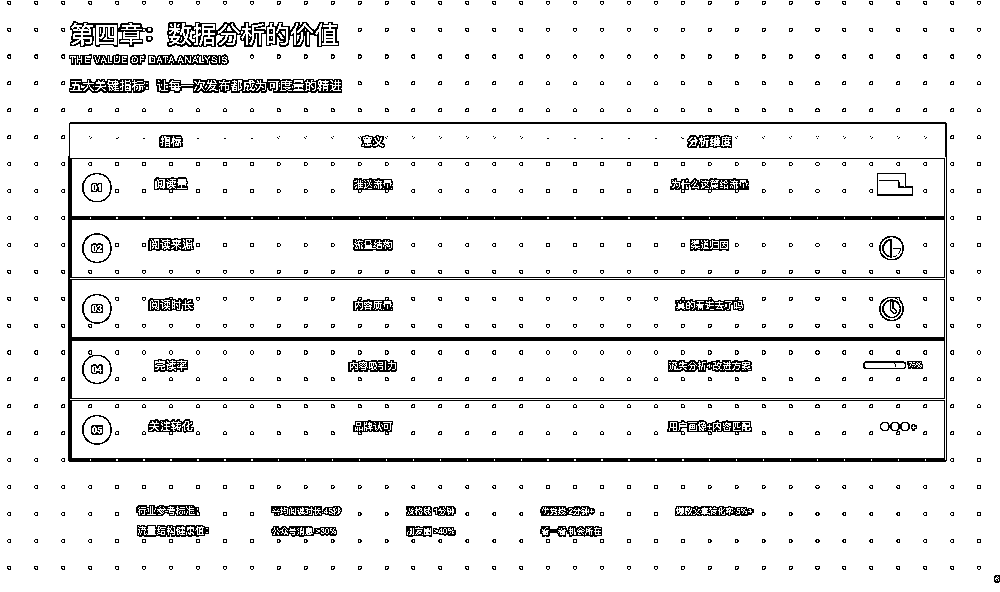
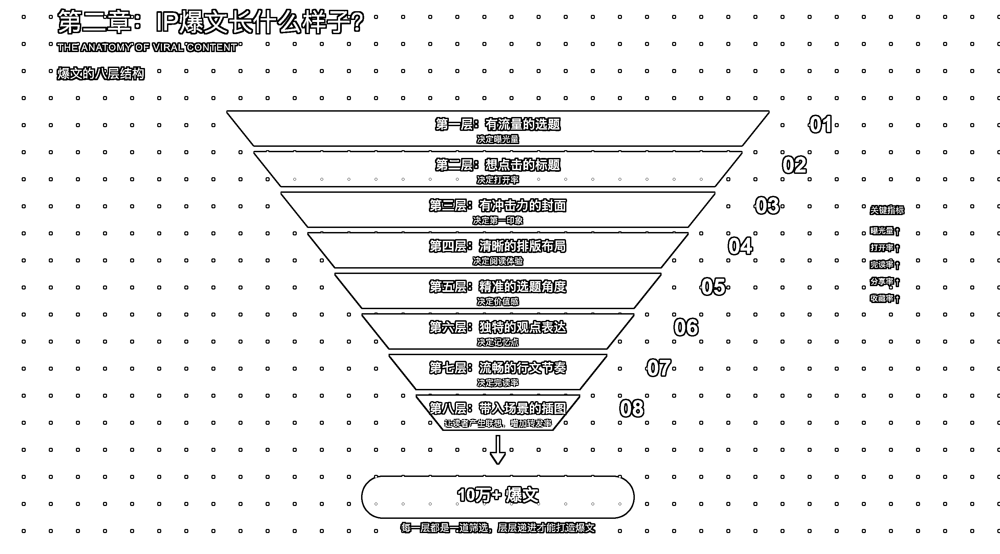
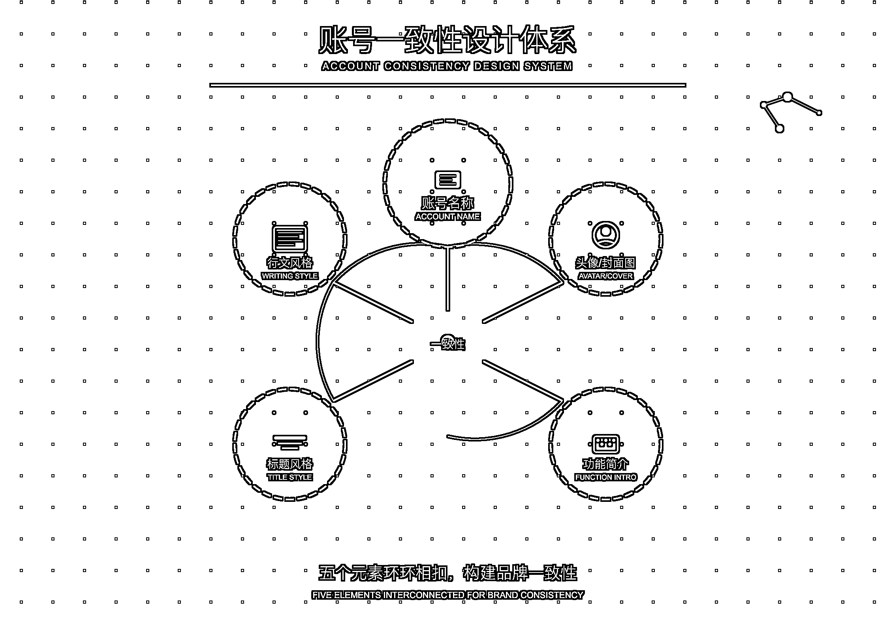

# (精华帖)(79 赞)AI 赋能公众号—用 AI 打造你的公众号品牌

> 原文：[`www.yuque.com/for_lazy/zhoubao/ncv9pamn3qiom3mx`](https://www.yuque.com/for_lazy/zhoubao/ncv9pamn3qiom3mx)

## (精华帖)(79 赞)AI 赋能公众号—用 AI 打造你的公众号品牌

作者： 周知 1.0

日期：2025-09-24

我是周知，垂直小号的航海教练，在深圳做了自己 AI Agent 公司， 公众号，是我作为 AI 超级个体的第一站， 我想把我过去一年常用的 AI
工具和数据分析思路，这篇《AI 赋能公众号 - 用 AI 打造你的公众号品牌（加餐）》 给到新入局公众号垂直小号的圈友加餐。
在短视频和直播的时代，公众号已经失去了光芒。没错， 但持续在看公众号的用户，也给了我们超级个体进一步展示“你最深”用内容去链接粉丝新机会。
微信公众号从严格的"订阅化分发"，走向了"算法推荐路线"。 过去，你没有粉丝，文章再好也没人看。
现在，新号只要内容够硬，系统直接给你推到适合“你最深”的用户脸上。 我觉得是： 今天的分享，分为 6 个部分。
我会告诉你，为什么"再小的个体，也有自己的品牌"这句话，在 AI 时代更加重要。 拆解一篇流量文背后的 7 层结构，让你知道爆文不是运气，而是可以度量拆解。
从黑箱到透明。"朋友推荐"的流量贡献，已经从 24.3%上升到 45.9%。我会告诉你算法到底在看什么。
微信算法的核心流量参数：在看、完读率、社交连接深度。每个指标背后，都是一次优化机会。 长文、图文、漫画。AI 如何提效创作。 最实用的提示词，让 AI
成为你的得力助手。
我想说下自己看法：[`aiawaken.feishu.cn/wiki/NzbPw4YIQiDwu0k33qhcmRy0nfa`](https://aiawaken.feishu.cn/wiki/NzbPw4YIQiDwu0k33qhcmRy0nfa)

* * *

评论区：

剑渊 : 太牛了[强]

深圳志哥 : 感谢教练的分享！！保存打印精读

ㄆ刂 丿丨 |༄༅ : 感谢教练分享，解决了我一直想解决而解决不了的问题