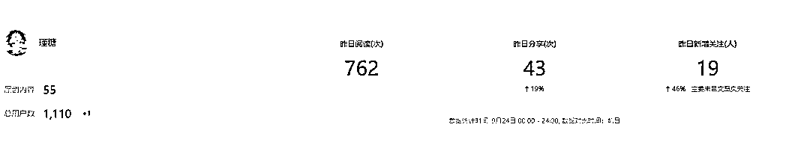
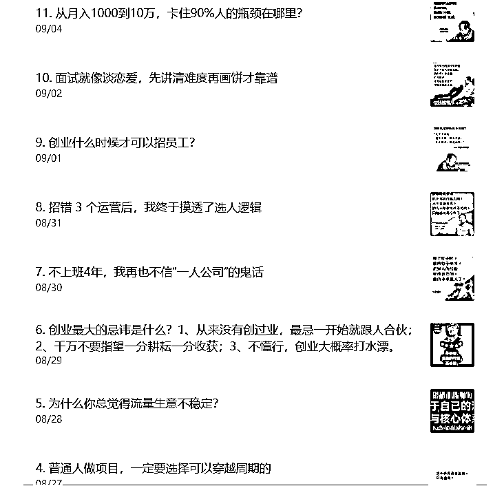
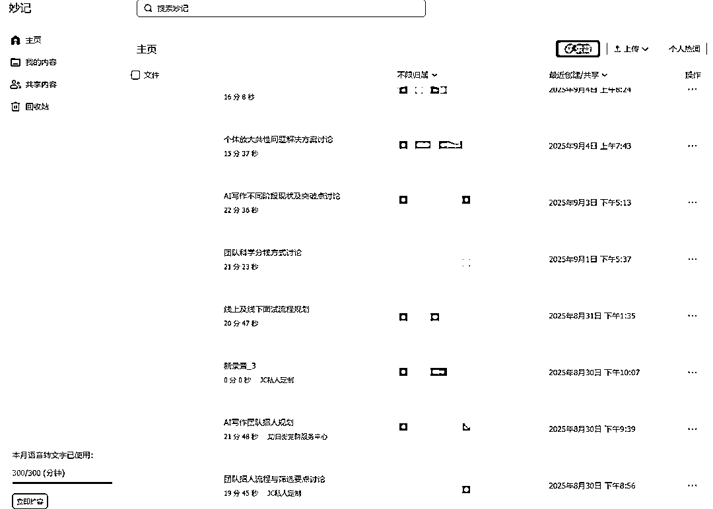
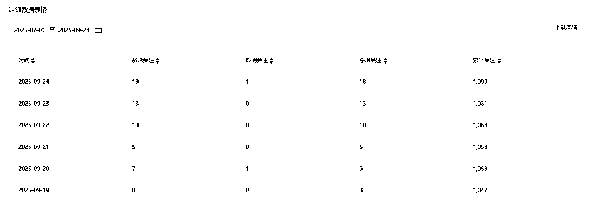
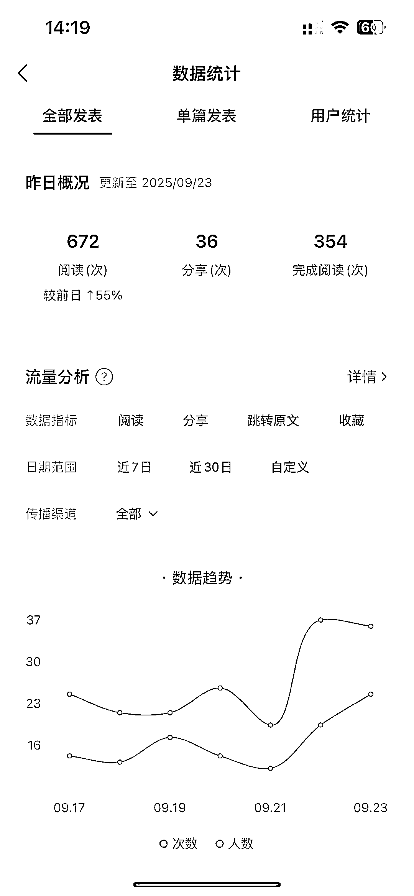

# (精华帖)(52 赞)商业 IP 公众号垂直小号 两个月涨粉 1000，变现能力远超 10 万泛粉，要精不要广

> 原文：[`www.yuque.com/for_lazy/zhoubao/shnxfvcpqeet1qyw`](https://www.yuque.com/for_lazy/zhoubao/shnxfvcpqeet1qyw)

## (精华帖)(52 赞)商业 IP 公众号垂直小号 两个月涨粉 1000，变现能力远超 10 万泛粉，要精不要广

作者： 瑾糖

日期：2025-09-26

下面是我的公众号信息。今天聊聊我是如何做公众号垂直小号的。

# **一，你的定位决定天花板**

从我重新写公众号的第一篇帖子说起，

当时我决定以【AI 写作赛道】回归，那篇帖子算得上是爆款。

* * *

**我是瑾糖，2023 年 12 月进入 AI 写作赛道，**

**24 年全年都在跑自营盘，流量、销售、交付都是自己团队在做。**

**AI 写作单月营收近 50 万，3 个月做到 100 万，**

**目前在深耕写作板块，从流量，销售，**

**现在已经在广州大学城搭建了个全职的写手团队，目前持续深耕上下游。**

* * *

它虽然没有突破公域流量池，**但价值在于引发了大量写作同行的转发，**

很多同行会转发到小群里，或是推荐给其他做写作的伙伴。

这篇帖子能爆，**我觉得核心是【价值足够大】且真正有成绩**

我分享的**全是干货，足够实在** ，且都是大家能借鉴的实操路径。

我做的是**【极致垂类细分】** ，只聚焦**【AI 写作】** 板块，

且专攻**【写作项目放大】** 这个细分领域，后续所有公众号内容也都围绕**【项目如何放大】展开。**

我没有选择 AI 这个大而泛的赛道，**而是聚焦到 AI 写作，**

并进一步聚焦到 **写作项目如何放大** 这个具体问题

这就像用一根针扎破天，力量集中**，不为泛流量所动，只服务对的人**

所以做垂直小号的核心逻辑是**【专业】** ，真正能给别人提供可感知的价值。

除了专业，还要足够**垂类细分** ，不能贪多，

比如做 AI 就别跨其他领域，哪怕 **AI 内部还要再细分** ，是做 AI 智能体、AI 写作，还是 AI 图片？

**不同细分对应不同人群** ，做 AI 图片，受众可能是自媒体创业者、电商老板、摄影工作室；

做 AI 智能体，受众可能是从业者、想靠 AI 替代重复工作的工作室老板。

我们要根据目标人群做好垂类定位。

# **二，好的内容是唯一的通行证**

定好垂类后，内容必须 **真实、真正有用。**

所谓 有用，就是**不讲虚的、不聊不能落地的，那些没意义。**

我分享的内容更侧重**【术】** 的层面，要能直接落地，

最好是手把手、一步一步颗粒度极细的内容，用 术 的形式呈现出来。

**它能直接解决问题，因此也更容易被收藏和转发，形成了在垂直圈子内的裂变**

**比如我的这篇爆款文章**

按我的体感，这类内容**更受平台青睐，** 因为容易被收藏、转发，自然能满足平台需要的基础数据，

平台就会认定你的内容是 **好内容，** 进而给更多推荐。

就像小红书，干货帖子永远比泛内容更易获赞、获收藏。

追求每一篇内容对用户的**绝对价值。**

这种策略虽然涨粉慢，但**粉丝质量极高，信任感强**

这种真实性是建立信任的基石。

# **三，系统化是坚持的关键**

确定好人群和内容方向后，怎么做？

我做公众号的逻辑比较简单，**核心是【日更】** ，不用打磨极高精度，关键是流程高效。

流程第一步是**选题，** 提前备好粉丝需要的内容选题。

选题可能提前几天定好几个，也可能只提前一两天，看事情优先级，毕竟有时会在其他事上多花心思。

但最少要提前一天**备好存稿** ，把第二天要发的内容做好，**这样才能保证日更。**

不然万一当天有重要事、要外出，就没内容发了，

**这种低容错的事我不喜欢** ，所以提前备稿是底线。

有了选题后，我会先捋自己的思路和框架，再看看其他人对这个话题的观点，找找灵感。

**接着结合自身认知和经历** ，用口述方式输出，打开飞书妙记，对着选题大纲口述 15~20 分钟，

之后用 AI 整理，保留核心表达，删减口水话、废话（如呃呃哦哦）

一篇 2000-3000 字的文章就出来了。

最后排版、发公众号。

**选题 - > 梳理大纲 -> 搜集信息 -> 口述录音（飞书妙记）-> AI 删除口水废话（如呃呃哦哦） -> 排版发布**

这就是我能以**最低成本、最低门槛把日更坚持下来的原因。**

将日更的难度降到了最低，保证了内容的持续稳定输出。

上面的流程，大家可以看到这里也有一些重复性的工作

**所以我一般是把重复性的工作交给小助理**

**自己只做最核心的内容输出**

我们要在细分群体里持续输出有价值的内容，**不追求爆款，只追求每篇都有价值。**

这和我做流量的逻辑一样，**不贪爆款，只求【低保】**

在垂直小号里，**低保 就是每篇内容都有其价值。**

这个价值可能是我主观判断的，未必对所有人有用，**但至少能给一部分人提供借鉴，**

这就是我理解的**足够垂的价值。**

当然，还需要**高颗粒度的内容，**

比如教大家怎么操作 AI 界面、使用工具，这就需要把操作流程一步步截图，再配上解析。

这类文章一天花一两小时就能做好，前提是你对流程足够熟悉、提前跑通过。

# **四，真诚是最大的捷径**

给粉丝的价值体现在文章里，但一定要有自己的产品，

做商业属性的公众号，没有自有产品太可惜了。

**当然前提是 你的产品有价值，** 我不赞同随便拿别人的东西当自己的卖，

尤其讨厌圈子里那种 看到谁项目好就照搬去卖 的做法，**很离谱也很恶心。**

我们能把公众号做这么专业、垂直，一定有自己的东西，**完全可以把 自己 当成产品，**

前期可以定低价做个圈子，或**是做些自己能力范围内能变现的事。**

比如做写作领域，就可以针对老师、医生、职场人等群体，做写作相关的垂直内容；

再靠自身能力变现，把垂直小号当成流量渠道之一，

变现方式有很多，**但不能做自己没有的东西。**

我们讲究的是自然而然，**用自有能力变现** ，别拿自己没有的东西变现，那样太虚、不稳，迟早会受反噬。

**这种做法虽然可能短期获利，但会损害个人品牌，无法持久**

**真诚才是最大的捷径。**

# **五，如果你也想做公众号——**

**分享最近写东西的一些经验，**

1）说人话，说人话，**说人话！**

2）写完多读几遍，不断地读、反复地读，**边读边改**

**3）要真诚，要敢于袒露内心，要敢于说出大众所想但未曾表达的事实** ，做第一个说出皇帝新衣的人，做第一个指出房间里的大象的人

写的时候要当作不会有任何一个人看到来写，**改的时候要当作全世界所有人都会看到来改**

**  **

**4）建立问题库，** 用备忘录随时随地记录自己生活当中发出的困惑，

比如“冥想是什么?它的作用是什么? 怎么开始冥想?”

“怎么提升自己的表达力? 表达力的核心是什么?怎么练习?”

一个问题会产生好几个问题，问题范围越小越好，**有时候问题就是答案。**

**5）我经常听到很多人抱怨根本没有专门的学习时间，我也没有。**

我每天的“写点什么”，通常是在地铁里、马桶上，或者吃饭的间隙完成的，可能是一句，也可能是两句，随便一个时段就可以写点什么。

我喜欢在地铁和飞机上阅读，马桶上也不错，几乎都是碎片化的输人。

我的输入大多来源于书，还可能是一条评论或一条信息。

**不是每天一定要读多少书、花多长时间去学习，那都是形式。**

你不应让任何外在的形式束缚自己，**任何时间、任何地点，你都可以读点什么。**

手机这么发达，看到什么，随手一拍做个标记，把它扔到你的资料库;

突发灵感时，随便录一条语音，把当时的灵感记录下来，日后成为你的素材、洞见。

我经常会把别人朋友圈里的一段话，或者抖音评论里的一段话，直接复制到我的素材库里。

**每一个人都应该有一个属于自己的素材库。**

把那些你认为有用或者有趣的素材存放在那里，标注好出处，并分门别类地打上标签

**加上一点感想，把阅读、理解、思考过程中的一些精华、洞见记录下来在我的表**

* * *

**往期优质内容：**

[为什么你的团队做不大：AI
代写十倍增长中的九大误区》](https://irvnps9bwl.feishu.cn/docx/WUV4dJlm3oxcyKxMlwIcxTycnOh)

[AI 代写从 1 到 100
团队化的核心增长逻辑](https://irvnps9bwl.feishu.cn/docx/S6gVdU2OmoMY6qxbDFpcbZ8QnYe)

* * *

评论区：

王健 : 9.29 阅读的第 2 篇精华

向丹 : 糖总太牛啦！！！基于自身业务做公众号垂直小号，简直就是放大器，可以放大超多倍！

瑾糖 : [机智][加油]