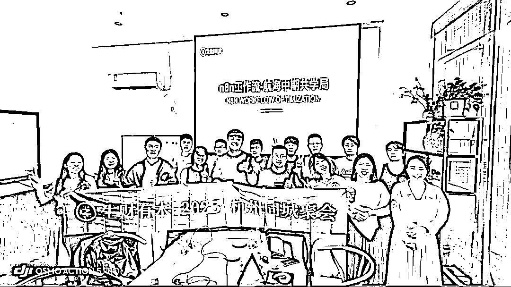
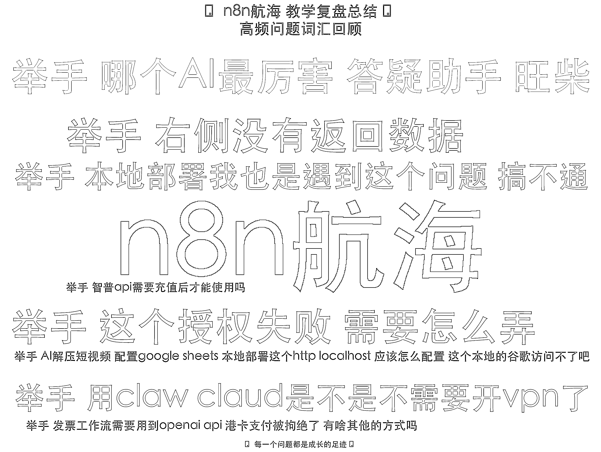
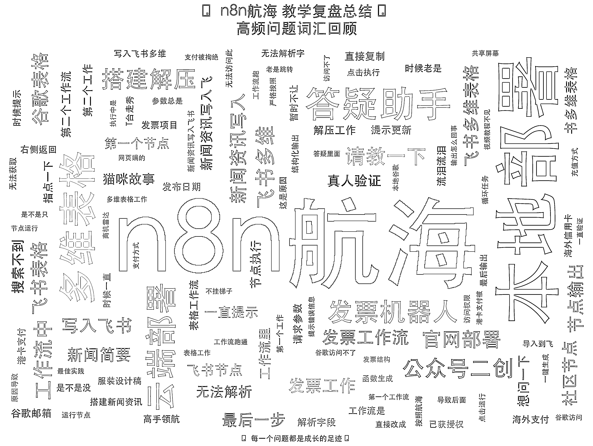

# (18 赞)9 月 3700+人参与的 n8n 航海复盘：答疑机器人新尝试及技术方案解析

> 原文：[`www.yuque.com/for_lazy/zhoubao/aup7lnbn71wv2k4c`](https://www.yuque.com/for_lazy/zhoubao/aup7lnbn71wv2k4c)

## (18 赞)9 月 3700+人参与的 n8n 航海复盘：答疑机器人新尝试及技术方案解析

作者： Cyrus-赛探长

日期：2025-09-28

n8n 航海教练复盘：微信答疑机器人新尝试！附数据分析与线下组局 n8n 干货
本次 9 月份的航海实战，3700+船员参与的 n8n 航海落幕！作为本次航海的教练，我把航海中的一些思路、新尝试都写进了复盘。因内容篇幅较长，诚邀大家到飞书品鉴：[`lag410zsdtc.feishu.cn/wiki/Gz3mwr7R3iGTUKk76xBcwXVdn7b?from=from_copylink`](https://lag410zsdtc.feishu.cn/wiki/Gz3mwr7R3iGTUKk76xBcwXVdn7b?from=from_copylink)

* * *

评论区：

龙咖 : 确实不容易，看到生财有人讨论 wxauto 框架了，用了很久了，挺不错的