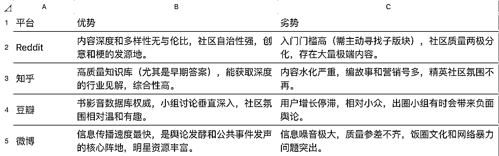

# (34 赞)N8N 抓取 Reddit 数据，助力出海需求挖掘与信息分析

> 原文：[`www.yuque.com/for_lazy/zhoubao/xq8g7kzougnfuqgf`](https://www.yuque.com/for_lazy/zhoubao/xq8g7kzougnfuqgf)

## (34 赞)N8N 抓取 Reddit 数据，助力出海需求挖掘与信息分析

作者： 龙哥

日期：2025-09-20

你好，我是龙哥，RPA 教练和 AI 智能体教练,专注于使用 N8N，RPA，AI 智能体，AI 编程等 AI 技术提效。
受本次航海启发，也写了一个 Reddit 帖子，这里可以玩的东西太多了。
最近很多大佬都在提 Reddit，于是好奇的我也去瞅瞅,也让我发现一些好玩的东西，原来 Reddit 才是这个世界的样子。对比国内微博，知乎，豆瓣，强太多了。
这里有 35 万个兴趣小组，你总能找到自己的创意和需求和好玩的东西，值得我们深挖，大家有空一定要去看看 Reddit。
我用 N8N 做了一套工作流可以深挖 Reddit 中我想挖的任意频道关键词下的热门帖子，并翻译提炼内容方便我查阅研究。 直接上车了，Go，Go，Go。
另外详细复盘了本次航海高阶部分两个案例，希望可以帮大家顺利通过航海 最后报个喜：我写 N8N 入门贴获得万次阅读学习获得生财传术师称号，感谢生财带我飞。
昨天看到圈友 老师发了一个朋友圈特别有感触： 在任何平台一定不要总想着索取，要反馈平台，像我们圈友能反馈给平台的就是写精华帖。
对于圈友来说第一个精华帖就相当于一个成人礼，你长大了，以后不要小看自己了。 回想过往，我来生财 3 年了： 第一年一直潜水，毫无存在感，感觉花钱打水漂了。
第二年续费的时候挣扎了一下，我要续费吗？犹豫了一下，后面还是续了 第三年续费的时候犹豫了一下，我要续费吗？挣扎了一下，后面还是续了。
其实发现你只有与平台多发生关系，你的存在感才强。 你不发帖，也不看贴，又不参加各种线上或线下活动，其实你和平台是割裂的，然后相忘于江湖。
拥抱平台，给平台做贡献，和平台共同成长是我们用好任何平台的基础，做长期的合作伙伴。 [`svox0dxsvym.feishu.cn/wiki/O6LIwNd8QiaNogkD3XZcPQegnxc?from=from_copylink`](https://svox0dxsvym.feishu.cn/wiki/O6LIwNd8QiaNogkD3XZcPQegnxc?from=from_copylink)[`t.zsxq.com/HDzvO`](https://t.zsxq.com/HDzvO)[`t.zsxq.com/BwJS3`](https://t.zsxq.com/BwJS3)

* * *

评论区：

道凉 Q : 厉害厉害~

龙哥 : [抱拳][抱拳][抱拳]

华仔 : 全能龙哥

龙哥 : [握手][握手]