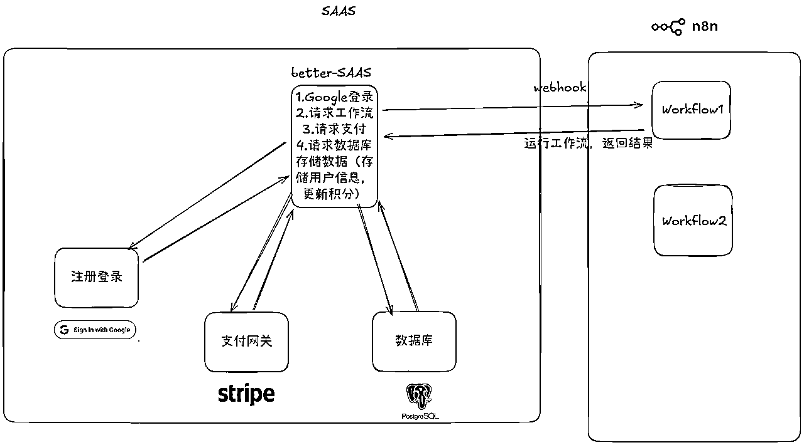

# (31 赞)N8N 与 Web 结合做出海 SaaS 项目实操教程

> 原文：[`www.yuque.com/for_lazy/zhoubao/wnm9p7qugi3qo6km`](https://www.yuque.com/for_lazy/zhoubao/wnm9p7qugi3qo6km)

## (31 赞)N8N 与 Web 结合做出海 SaaS 项目实操教程

作者： 达轮

日期：2025-09-24

N8N 和 Web 结合做出海 SAAS（变现！变现！变现！）
我是达轮，今年 418 加入生财，有幸被邀成为 n8n 的航海教练，谢谢生财有术这个社群，让我认识了优秀的圈友！恰好看到 N8N 的手册，没有 N8N 与 Web 结合的这个板块，来补上吧！！还有
之前反馈给我的灵感，还有@楞楞 的指导！ 废话不多说，开始吧！ N8N 航海接近尾声，加餐鸡腿🍗来了！！ Web 出海的圈友看过来，N8N 的圈友瞅过来！
如果你要 N8N 变现，适合看下去！ 如果你要集成 Stripe 支付服务老外，收割 MRR，适合看下去！ 如果你要了解 Saas 开发，适合看下去！
如果你觉得 n8n 太简单了，适合看下去！ 你觉得要了解更多 N8N 的玩法，适合看下去！
根据大家的水平不同，可以分为初级，中级，高级，阶段性的正反馈拉满大家的信心！！
这里可能会遇到其他问题，不要害怕，我们处于信息密度高度发达的时代，问 google ,AI ,一定没问题的。 这篇教程的意义是
我看到好多帖子都是用 AI 从 0 到 1 生成 Web 网站的例子。 相比用 AI 从 0 到 1 生成整个 Web SaaS 项目，直接从 GitHub
找一个成熟模板再进行修改的方式往往更高效。最大的优势是你只需要少量提示词或改动，就能“一通百通”，降低了 AI
随机性带来的不可控风险。同时，现成模板经过社区验证，代码结构清晰、常见问题已被解决，能显著减少踩坑时间；而且开发者能在真实项目的基础上学习最佳实践，更快积累可复用的经验。
准备好了，跟着这张藏宝地图，打怪开始！📢📢📢📢📢 飞书，走你 有什么意见,多多指正。🙏🏻🙏🏻🙏🏻  [`eafz7mo3of.feishu.cn/docx/M9nAdjDpZolUZcxVPWNc3Gqcn1d?from=from_copylink`](https://eafz7mo3of.feishu.cn/docx/M9nAdjDpZolUZcxVPWNc3Gqcn1d?from=from_copylink)

* * *

评论区：

黄金号 : 所以我离成功只差喝冰美式和喝水了吗

达轮 : 重要是执行[得意]