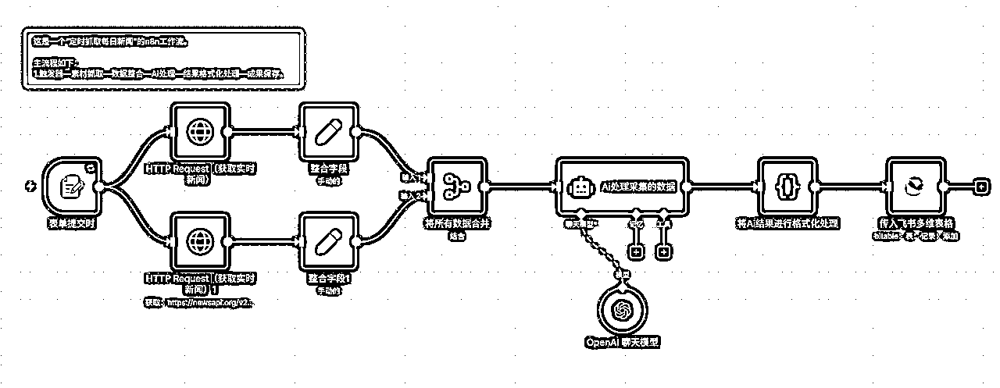

# (29 赞)N8N 全自动定时抓取热点资讯——学习《N8N 航海手册》复盘

> 原文：[`www.yuque.com/for_lazy/zhoubao/dzazqgi5ibxkx6sm`](https://www.yuque.com/for_lazy/zhoubao/dzazqgi5ibxkx6sm)

## (29 赞)N8N 全自动定时抓取热点资讯——学习《N8N 航海手册》复盘

作者： 越越

日期：2025-09-17

大家好！

我是你们的老朋友——**越越。**

**  **

**特别感谢：@李香君@猫大人@曹淦@方波妮**

**  **

特别感谢星球里各位 n8n 教练、帖子作者，你们的教程、经验、指导让我进步飞快。

**今天的这篇文章是我的航海作业，花了半天时间制作，我想把我自己的学习经验分享给大家。**

1.  **我的需求是什么**

我的需求是要做一个：**定时采集全球的热点新闻内容，并保存在多维表格。**

1.  **我的规模有多大？**

主要用于矩阵工具开发，需要满足高并发、容错率高、稳定运行。

1.  **我的水平有多少？**

我是一个刚接触 n8n 的新手小白，我没有一点工作流基础，也没有编程基础。

1.  **我有的资源是什么？**

n8n 航海进行中，很多优秀的帖子可供参考，我参加了最牛逼的 Youtube 深海圈，教练和圈友们都很牛逼！

1.  **我以后要做什么产品？**

我学习 n8n 的初衷是为 Youtube 深海圈的圈友们赋能，**我已经能够通过 Youtube 月入 5000 刀了我想赚更多钱！**

本文中涉及的工作流很简单、很基础，但是我把自己的思考、操作、踩坑经验写下来。

**所以我自己写得，我自己觉得很牛！**

**  **

**  **圈友做垂直小号矩阵，需要对热点新闻进行采集“的需求制作。

本工作流能实现的功能：**全自动新闻爬取——N8N 定时抓取热点资讯**

文档链接：[`txt6wm3b04b.feishu.cn/wiki/OtVWwoJ4fiH2F0koGJ9coLKnnef?from=from_copylink`](https://txt6wm3b04b.feishu.cn/wiki/OtVWwoJ4fiH2F0koGJ9coLKnnef?from=from_copylink)

* * *

评论区：

文少 : 越总，我也想用你的裤子！

嘻嘻姐 : 牛哇牛哇