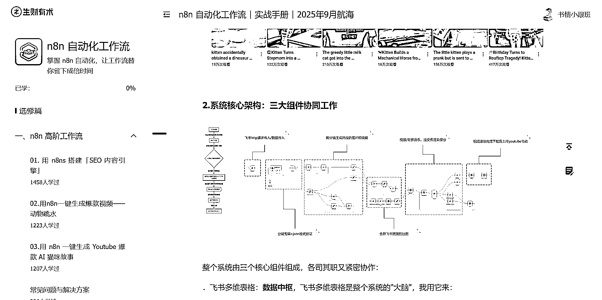

# (32 赞)如何用 n8n 一键生成视频发 YouTube 思路分享，值得一看

> 原文：[`www.yuque.com/for_lazy/zhoubao/rn3qm79611c2cctg`](https://www.yuque.com/for_lazy/zhoubao/rn3qm79611c2cctg)

## (32 赞)如何用 n8n 一键生成视频发 YouTube 思路分享，值得一看

作者： 书情小跟班

日期：2025-09-19

如下图昨天我调试 n8n 工作流成功把视频生成了，因此给大家分享下如何用 n8n 一键生成视频的思路

大家注意看标题哦，是思路分享，而不是完整的一步一步搭建 n8n,一步一步的搭建，大家看手册就好

好了，前面铺垫说明完了，接下来就以截图方式分享这个 n8n 一键生成视频发 YouTube 的工作流长啥样

工作流有两种模式 如下图红色圈圈，圈住的是自动化模式

另一种模式是手动输入需求的模式来生成视频

你需要手动输入视频的主题

提示词示例、场景数量

这里还有两个选项：自动化、表单模式

这里是一系列的处理过程，给工作流上传一个示例的爆款视频，让工作流分析你上传的视频从而把视频进行爆款拆解，也就是【分析爆款视频】这个节点

接下来工作流分两个分支： 1、生成视频

2、把视频进行打包处理

我们先看分支 1，如下图，下面的截图还是关于生图的逻辑

下一步就是生成图片工作完成，把生成的图片进行下载

图片生成后，接下来就是生成视频

到此分支 1 已全部分享完了，接下来分享分支 2

分支 2 的功能就简单了就是把分支 1 生成的视频进行整合，如图所示包括 【视频拼接】、【声音合成-裁剪】、【水印合成】、【下载视频】

分支 2 的结束部分就是把视频上传、最后把视频保存。

这个工作流可以改进一下，那就是一步到位把视频上传到 YouTube，这个工作后面再补上。

好了，今天的帖子只是思路分享，我在 2025 年 6 月 30 号就说要研究 n8n 了，懒惰、拖延让我一直迟迟未能行动，最近一段时间把大部分时间都花在了研究 n8n 上，终于算是有了阶段性的突破。

如航海手册分享的常用资料网站，如果想快人一步，那就去看官网吧，官网啥都有

我们所有的工作流都源于官网的支持，官网才是最好的学习资料，这里我要补充说明一下，如果你是学习力，执行力非常强的情况下，官网无疑是佳的选择。

但是，如果你时间有限，又想在最短的时间内掌握 n8n，那么跟着航海手册走，同时有各个 n8n 教练为你答疑解惑，你能在最短时间内掌握 n8n.

说说我自己的感受，我有种初入职场，技术薄弱的那种窘境，调试 n8n 遇到各种难题，毕竟 n8n，我也是初次接触，但是我秉持着 8 个字——**遇到问题，解决问题** 的心态来学习 n8n。

我在工作中同样遇到各种问题，但是，只要我不放弃，总能找到解决问题的办法，也希望对于 n8n 畏难的圈友，要迎难而上，很多事，你做出来了，就不难了。

我对于 n8n 这块，也是小白，这次算是现丑了，最后感谢大家看到这里。

* * *

评论区：

龙哥 : 精华精华，又是 N8N 又是油管

泉州百度顺哥 : 赞👍👍