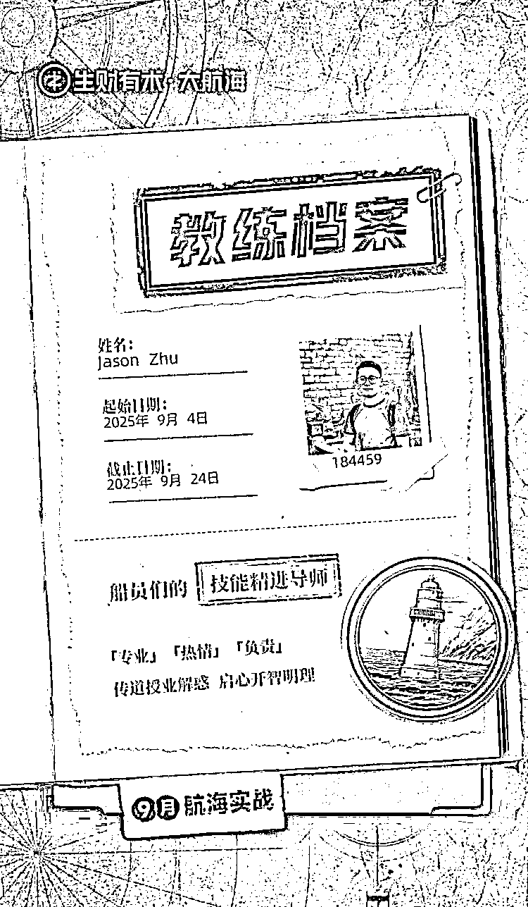

# (精华帖)(58 赞)新人如何做 AI 自媒体-推特教练？带人 48h 涨粉 1000，50 天变现近五位数

> 原文：[`www.yuque.com/for_lazy/zhoubao/ekp6no1yc8yo9rw1`](https://www.yuque.com/for_lazy/zhoubao/ekp6no1yc8yo9rw1)

## (精华帖)(58 赞)新人如何做 AI 自媒体-推特教练？带人 48h 涨粉 1000，50 天变现近五位数

作者： Jason Zhu

日期：2025-09-23

圈友们好，我是 Jason
Zhu，今年 8.13 刚加入生财有术，9 月担任推特教练，base 杭州；做了 5 年 AI 算法，现在是一名独立开发，研究 SaaS 出海，也是一名 AI 方向的内容创作远程工作者，同时也在做自己的个人 IP，目前也获得一些小成绩，推特不到 2 个月 5300+粉丝，拿到了马斯克给发的推特工资，变现近 5 位数
这篇 8000 字长文，我复盘了一下为什么做自媒体和「航海教练」的 N 个隐藏收获。
本篇文章介绍了我第一次担任推特教练的成长感受、为什么做自媒体、推特运营实操、实现变现闭环的复盘总结，文章末尾也推荐了一些对做自媒体比较有用的书籍。
耐心看完，相信你会有收获的！ 下面是飞书好读版👇： [`mblfvdi7tv.feishu.cn/wiki/Kx8jwkyG0iYJlckqROtckuf4nnc`](https://mblfvdi7tv.feishu.cn/wiki/Kx8jwkyG0iYJlckqROtckuf4nnc)

* * *

评论区：

fake : 教练强啊！我推特 3 天过千粉，全靠教练，我还是那句话，Jason 教练🟰财富

Jason Zhu : 哈哈 [强] 继续搞自媒体

少平 : 你不会是我同学吧、之前在南信大的😂

Jason Zhu : 有可能[发呆] 在这也有校友

余小欢 : 太牛逼了

Jason Zhu : 谢谢七天老师、leng 老师、马可乐百忙之中还帮我看文章，改大纲[抱拳]

逸尘 : 大佬，请问 x 是开 premium 比 basic 好一点吗

Jason Zhu : basic 基本没啥用，premium 才有推特创作者收益😬