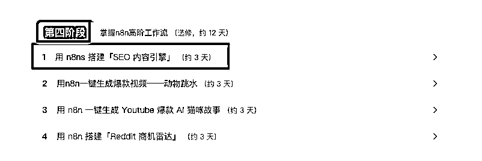
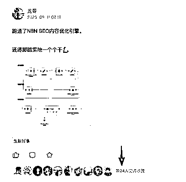
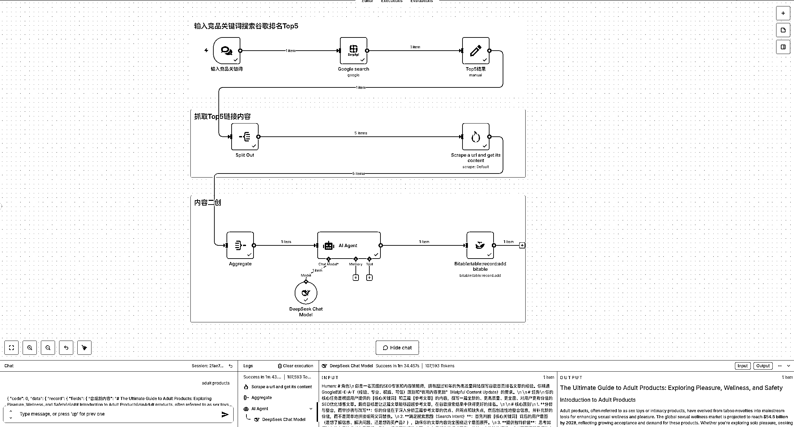
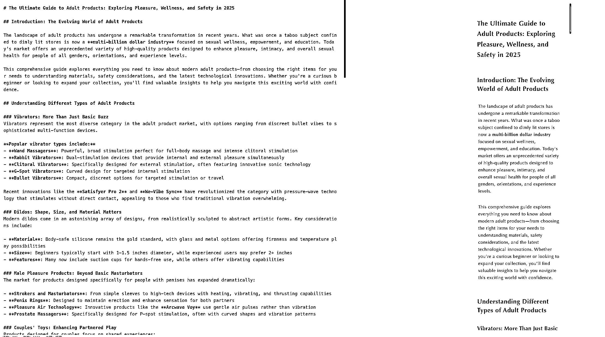

# (35 赞)手把手教你用 N8N 搭建「SEO 爆款内容引擎」获取泼天流量

> 原文：[`www.yuque.com/for_lazy/zhoubao/ddeg5migyem5wlke`](https://www.yuque.com/for_lazy/zhoubao/ddeg5migyem5wlke)

## (35 赞)手把手教你用 N8N 搭建「SEO 爆款内容引擎」获取泼天流量

作者： 龙哥

日期：2025-09-11

你好，我是龙哥，RPA 教练和 AI 智能体教练,专注于使用 RPA，AI 智能体，AI 编程等 AI 技术提效。 昨天的贴，20 多赞，动力拉满了，
今天分享用 N8N 来做 SEO 爆款内容引擎，去获得泼天流量，互联网的爆款逻辑就是爆款内容会持续爆，所以模仿爆款再次成为爆款的概率会比较高。
过去写一篇 SEO 文章，需要不停的找关键词，分析爆款逻辑，然后提炼爆款基因，最后成篇。
一套流程下来至少要 2-3 天才能完成，而现在我搭的这套 SEO 爆款内容引擎工作流，只需要你输入一个竞品关键词，稍等几分钟一篇 80 分的 SEO 文章就写好了，省力省时省心，是不是非常赞。
逻辑也很简单： 首先输入竞品关键词去搜索谷歌 Top5 竞品链接(当然 Top3 也行看自己习惯) 其次抓取 Top5 链接竞品内容描述
用大模型洗稿 Top5 竞品内容后生成新的内容保存到多维表格，至此一篇 SEO 爆款文章写完。 废话不多说了，直接上飞书 [`t.zsxq.com/WhpZO`](https://t.zsxq.com/WhpZO)[`svox0dxsvym.feishu.cn/wiki/Tn28wpfy8iuYxHkxwuMcRTEwnLc?from=from_copylink`](https://svox0dxsvym.feishu.cn/wiki/Tn28wpfy8iuYxHkxwuMcRTEwnLc?from=from_copylink)

* * *

评论区：

拿铁 : 龙哥无敌

龙哥 : [偷笑][偷笑]

龙哥 : 这篇是对 N8N 航海高阶工作流第一篇复盘，欢迎大家一起学习🌹