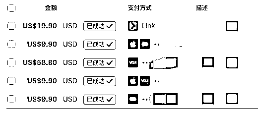

# (精华帖)(33 赞)土木工程师裸辞，零基础 3 个月跨界 AI，我在 AI 出海赚到了第一笔美金（深海圈）

> 原文：[`www.yuque.com/for_lazy/zhoubao/hrxyl2xl8sr4dgat`](https://www.yuque.com/for_lazy/zhoubao/hrxyl2xl8sr4dgat)

## (精华帖)(33 赞)土木工程师裸辞，零基础 3 个月跨界 AI，我在 AI 出海赚到了第一笔美金（深海圈）

作者： 井然

日期：2025-09-12

从土木工程到 AI 出海，我放弃了五年拼搏来的副总经理职位，选择裸辞。几个月后，我在这个全新的领域赚到了第一笔美金。

这是一个普通人的跨界冒险，没有科班背景，只有一路的实战复盘和贵人相助。故事有点多，但每一步都算数。

大家好，我是井然。最近有不少朋友问我，是怎么在短短几个月内从土木工程跨进 AI 圈子、还最近上线一周的网站就赚到了美金的。所以我想在这里分享一下我这段时间的经历，希望能给正在探索新方向的你一些启发。

此篇文章主要讲述了我这几个月来时路的故事，主要以下七个话题来讲述：

#### **

**

#### **一、简要自我介绍**

#### **二、AI 走进了我的视野，被小排老师的精神感染到**

#### **三、幸运加入【深海圈】海外 AI 产品**

#### **四、去香港办港卡遇到的（小坑）**

#### **五、日常出海工作**

#### **六、第三个 AI 工具站上线一周出单**

#### **七、我是如何拿到结果的？**

故事完整版请移步到飞书👇

[`acnwscsrr4nu.feishu.cn/wiki/IMLywNVP4iqkiwkmo6kcY5sRn9o`](https://acnwscsrr4nu.feishu.cn/wiki/IMLywNVP4iqkiwkmo6kcY5sRn9o)

* * *

评论区：

暂无评论