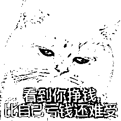

# (精华帖)(210 赞)看到别人挣钱就难受，怎么办？

> 原文：[`www.yuque.com/for_lazy/zhoubao/xwa3ngrig9l0mxdm`](https://www.yuque.com/for_lazy/zhoubao/xwa3ngrig9l0mxdm)

## (精华帖)(210 赞)看到别人挣钱就难受，怎么办？

作者： 家蒙

日期：2025-09-12

你好，我是家蒙。

B 站带货的深海圈，我们走了一段时间了，成绩还不错，群里时不时有同学晒出自己开单，甚至挣了一笔小钱的截图。

有些发在群里头，有些发到了生财有术的「好事」板块。

可喜可贺，是件值得高兴的事。

可能一开始大家零散开单，几块，几十块的时候还好，大伙心里都能平衡。

但陆续的，开始有那种，一单 300、500 的收益，甚至有一天能挣一千多，一单挣 2000 的案例蹦出来。

其实我私下能收到更多夸张的截图，没授权，就不展示出来了。

到这个时候，从一开始的替别人高兴，渐渐的会变成，你小子怎么挣这么多，倒是等等我啊。

说好一起哭惨，你怎么偷偷挣钱了。

**01**

羡慕、嫉妒难免会有，我也是这么过来的，经历过，能理解这种情绪。

电影《七宗罪》我看过好几遍，芒格说这里头的罪宗，有 6 个都是让自己爽的，懒惰、暴食、愤怒皆是如此。

唯独嫉妒，是让自己不爽的。

不爽，又不能排解，这可怎么办。

我有一些经验，看看对你是否有用。

**先说我的 1.0 版本，**

以前做知乎的时候，看到别人出成绩，自己也想赶紧跟上队伍，怕掉队，于是就匆匆忙忙赶进度，最后出来的作品质量不行，开单也不行，节奏很乱，收益很差。

知乎是一个讲究长尾流量的地方，更喜欢一篇长篇巨作长期霸占搜索流量。

这种流量结构，决定了我们的策略是：

花更久的时间打磨的一篇好文章，可以吃很多年流量。

即，先难后易，先易后难。

那时候我们讲究一个：慢慢来，比较快。

讲究一个，与其临渊羡鱼，不如退而结网。

每当看到别人有更好的成绩时，羡慕一小会儿就赶紧安慰自己，好，那我也要努力，回家编我自己的网去吧。

1.0 版本的时候，会用这样的逻辑来安慰自己。

2.0 版本，

但最近我们的培训项目是 b 站带货，这个是靠视频来带货。

流量逻辑变了，没有那么久的长尾流量，一个视频只能管一阵子。

而且，做一个视频是有点难度的，想要卷，更是可以卷到没边，

这个时候就不能再说，慢慢来，比较快了

真要慢慢来，两三个月都出不来一个视频，憋大招会把自己憋死掉

在 2.0 阶段，现在我们会说：要体系，不要目标。

**02**

相信不少人干过这样对事，听说谁挣钱了，知道对方的品类后，就直接干同样的事，同样的品。

好听点叫跟进，不好听叫抄袭品类。

不光是个体户，很多大老板也会做类似的决策，听说某某项目好，自己不亲自带队，又想要掺一手，成立一个新部门，让员工自己跑。

但结果如何？

绝大部分都做不成，都是瞎折腾，对吧。

也许是时机变了，也许像素级模仿还不够，条件在发生变化，没法拿到 100%预期的结果。

最关键的，这不是你体系里的东西。

甚至这种东一个西一个的零碎信息，会影响你去建立自己的体系。

要体系，不要目标。

听说别人挣钱了，确有其事，说明这个池塘真能搞到钱，有这个信息就够了。

随后就是去打造自己的工作、生产体系，慢慢推进，磨合、改进、优化自己的生产体系。

而不是我也要做 XXX，我也要挣他个 1000 万，这样具体的目标。

**03**

引用一下其他文章的内容：

目标是给失败者准备的。

如果你的目标是减肥 10 斤，在达成目标之前，你总觉得自己离目标很远。

目标导向的人总是处在一种持续的失败感中，这种感觉会消耗你的精力，甚至可能导致你放弃。

系统导向的人，每次应用他们的系统，都在成功，因为他们在做他们想做的事情。

目标导向的人在每个转折点都在与挫败感斗争。

系统导向的人每次应用系统时都感到满足。

在保持个人能量朝正确方向发展方面，这是一个很大的区别。

引用完毕

在减肥领域，减重 20 斤是一个目标，而健康饮食是一个体系。

在锻炼领域，四小时内完成马拉松是一个目标，而每天锻炼是一个体系。

在搞钱路上，赚到一百万是一个目标，而成为一个能持续产出好视频的 B 站博主，则是一个体系。

当然了，嘴巴说着容易，做起来还是挺难的。

我有段时间，看到同行又接广告，我就烦，这人做的也不好，怎么又恰饭了。MD

与此同时呢，自己单子又做不过来，自己的事乱糟糟，本来就挺烦的了。

还要去为别人的事生气、分心。

有单子，做不过来，烦；

没单子，看到别人挣钱，更烦。

这就是自己的体系不稳健，还被外界因素干扰到。

庸人自扰，瞎操心。

以至于有段时间会刻意不去看外界的信息，以免乱了道心。

磨炼一段时间，自己的事梳理清楚一些后，更能以一种平常心，去看待他人的成绩。

从「这个叼毛又恰饭了，可恶」，转变成：

哟呵，ta 做的挺好啊，真不错，

嗯！我也有自己的计划和安排，那么，认真推进执行自己的事吧，我也要跟着一块努力啊。

闲着无事，容易对别人指指点点，目光聚焦他人；

有自己的业务地图，向内专注，不管外界信息纷扰，道心不乱。

无论遇到点什么，最终都落到：方向没问题，计划不变，继续执行我的原计划。

稳得一匹。

**04**

好，说了这么些，提了很多次「体系」二字，这到底是啥意思。

以我自己为例子，我的体系是：

E = 核心算法 X 重复次数²；

是：数量也是质量的一部分；

是：每个月要出 10-20 个视频，认真的，敷衍的，都行，不管怎样都要做到这个数。

若没做到，就没资格羡慕、嫉妒别人。

做过视频的都知道，做一条视频就挺不容易的，单条花 7-10 天都很正常，一个月怎么才能发 20 条，这太不可能了。

其实做开了，会有规模效应，越做会越快。

团队、简化流程、复用、低成本，这些都是体系里可以参与优化的部分。

丰田集团，每 2 分钟就有 1 台汽车走下流水线，他们就是把造车这个巨大工程，打碎成 N 个「恰好 2 分钟」的环节，

细节不展开，更快的做出很多个，质量还过得去的视频，这就是我体系里需要要去攻克的课题。

哪怕最后实在完不成，只发了 8 个，10 个视频，也已经很厉害了。不用过度苛求自己。

**05**

目标是一个具体的未来目的地，可能实现，也可能不实现。

体系则是你定期要做的事情，长期来看会增加你的幸福感。

有体系的人，看到别人挣钱，心里不会难受。

希望大家打造自己稳健的体系，找到那种，一旦完成，天塌下来也不慌乱的状态。

闷头做事，偶尔抬头看看别人，稳定产出，道心不乱，保持这样的状态，直到好运降临。

到那个时候，就可以很装 X 地说一句：

也不是有多努力啦~，就是...运气好。

* * *

评论区：

朱一博 : 感谢
一文惊醒乱中人。最近航海也是遇到了这样的烦心事，看着各个圈友都特别牛，唯独我不行的念头就在脑子里转，乱了自己的阵脚，好几天都不知道在忙什么。的确是自己的体系仍然不够健壮。

龙云平* : 我最近就比较乱，选了品看大家群里讨论，我又觉得不行，又去换了，搞了几次不知道搞哪个品了。还是得冷静下来好好梳理梳理，感谢家蒙老师的及时雨

三颗芸豆 : 重复做一件事，真的会越做越快。我第一次从家走到公司需要 30 分钟，但是当我上了两三个月班之后，还是同样的路线，同样的出发时间，我却可以在 15 分钟，甚至 10 分钟之内走到公司，越走越快。

乔今 : 体系和目标这个第一次看到，说的太对了，最近一直在和挫败感斗争，弄得自己好烦，转换一下思路好很多

佳兴 : 讲得很好，与其紧盯数字目标，不如关注过程，修炼体系。

梅丽玲 : 体系，这个词可以抚平我乱糟糟的情绪了，谢谢家蒙哥

七月 : 把简单的事情重复做，容易的事情坚持做。

小薛 : 就像我打游戏 如果我是这局 ACE 看到有人很厉害 我回想他有什么值得学习的 反之 如果我没在 ace 我会想这货是不是开挂了