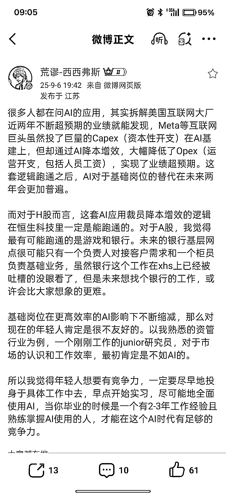

# (145 赞)用 n8n、Coze 搭建工作流的大学生，比名校生更让人眼前一亮

> 原文：[`www.yuque.com/for_lazy/zhoubao/bo8zddr2383c8n2b`](https://www.yuque.com/for_lazy/zhoubao/bo8zddr2383c8n2b)

## (145 赞)用 n8n、Coze 搭建工作流的大学生，比名校生更让人眼前一亮

作者： 亦仁

日期：2025-09-07

大学生在生财有术里面参加过几次 AI 相关航海并实操拿到一些结果，未来在求职市场上可能比 985 学历还吃香。 我现在要是招聘看到谁的简历里面写着，会用各种
AI 工具组合做视频，用 n8n 或者 coze 结合多维表格搭内容生产工作流，会用各种 AI
工具组合完成一场会议录音的整理和提炼，眼睛里面会发光，这些场景虽然简单，但是放到现在的求职者里面去，已经算是百里挑一了。
可惜大多数求职者的简历，还在写那些毫无意义的东西，对 AI 的使用仅限于和一些国内 AI 产品有一些简单的对话。

* * *

评论区：

乐轩麟 : 是的，学术界的 AI 早就烂大街了，现在真正需要的是 AI 和产业结合

夙愿学长 : 硅谷最近有个比较火的岗位叫做 AI 工作流优化师，就是帮助企业内部把重复复杂的工作使用 AI、Agent 等来提效

夙愿学长 : 我今年刚毕业，最近看了下工作，亦仁哥这个判断确实是真的

岳晓磊 : 没毛病

亦仁 : 不过在生财，又能把这些 AI 用的非常好，可能也不太想去求职了。

徐富贵 : 别说大学生了，现在在工作的人，很多人还是在自己的舒适区，甚至有些人连 AI 对话都不怎么用😂

b70（allin 版* : 我证明亦仁老大说的话是真的，本人双非一本，凭借着 YouTube 航海经验，已经在🐻厂做了运营的实习生

跑通小闭环✅ : 恭喜恭喜🎉🎉🎉。
因为这条评论，我去问了豆包，它说“🐻厂”一般是对百度公司的一种戏称。因为百度的 logo 中有熊掌的元素，所以网友们用“熊厂”来指代百度，再加上可爱的 emoji🐻，就成了“🐻厂”啦～
哈哈，是不是突然 get 到互联网公司“动物梗”的乐趣啦～其实很多大厂都有这类可爱的昵称，比如阿里叫“猫厂”、京东叫“狗厂”，都是从 logo 或者品牌元素衍生来的，记起来特别有意思。以后再看到类似的称呼，大概率也能猜个八九不离十啦～