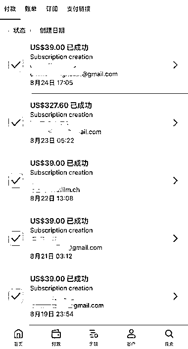
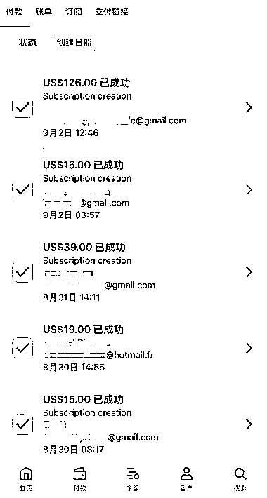

# (精华帖)(151 赞)海外 AI 产品新手复盘：4 个月赚到 1 刀，15 天破 1000 刀

> 原文：[`www.yuque.com/for_lazy/zhoubao/hiw8m7xr14ilubdn`](https://www.yuque.com/for_lazy/zhoubao/hiw8m7xr14ilubdn)

## (精华帖)(151 赞)海外 AI 产品新手复盘：4 个月赚到 1 刀，15 天破 1000 刀

作者： 王马扎

日期：2025-09-12

大家好，我是王马扎，从今年 3 月中旬开始动手做海外 AI 产品项目，到 8 月末突破 1000 刀，这篇文章我将分享从 0 刀到 0.01 刀花了 4 个月，从 0.01 刀到 1000 刀花了 15 天的完整经历。
整个复盘，来自我 3 月中旬到现在，自己的实践经历，结合在生财以及跟 和 两位老师学到方法。如有错误的地方，欢迎👏🏻交流。
本篇文章，主要有以下内容，省流版可略过‘自我介绍’部分： 一、自我介绍 二、为什么我选择海外 AI 产品这个项目？ 三、追新词，我花了 4 个月赚到第 0.01 刀
四、根据功能关键词，做品牌网站，赚到第 1000 刀 五、目前最大的卡点是什么？突破营收的思考 六、新手做海外 AI 产品，如何更快的拿到正反馈？
七、海外 AI 产品，还有哪些坑？ 八、送给想尝试的朋友一句话 由于内容篇幅较长，超过 1.5 万字，具体请查看飞书文档👇🏻： [`zhizhe888.feishu.cn/docx/Z40jdqs7woO8sxxDtgFcG6sDnVb`](https://zhizhe888.feishu.cn/docx/Z40jdqs7woO8sxxDtgFcG6sDnVb)

* * *

评论区：

跑通小闭环✅ : 太赞啦！㊗️早日日入万刀[庆祝][庆祝][庆祝]

王马扎 : 感谢🙏🏻，我先努力跑通月入万刀[憨笑]

易芝 AI|RPA 版 : 太赞了

锦辉 : 写得很用心，很有帮助。

王马扎 : 感谢反馈！

礼新 : 优秀，从 0 到 1 最难，

小宋 : 五年圈友[握手] 我先同步一下我的基础信息，小宋，00 后的程序员，6 月 16 号加入这里，现在当 n8n 教练。 我几乎没赚过钱，副业，赚的钱基本上是三位数。
其实为什么我会看这张帖子？因为我看 web 航海,其实我可以认为它这个是 长期主义➕长期战线➕产品迭代 的一种操作。
通篇看下来，最大的感触就是，你要一直在场，一直在不断的探索当中去寻找一些新词，通过新词挖掘背后的需求，然后找一个相对来说比较垂直的需求。 这个时候，需要你
动用你所有的经历也好，背景也好，做事的经验，利用 AI 的能力。以往的探索的过程。找到这垂直领域的方向。
web 航海，我认为，重要的是对产品的一个理解的能力以及对产品的迭代的能力。对网站的分析能力以及 SEO 的能力。
当然这都是前期需要去做一些准备的，当真正的流量来的时候，你才能接得住。（可以回答下我说的对不对）
我感觉你的综合能力是非常强的，你用到的工具会很多，因为可能是程序员，所以说你很有可能不需要模板，然后再加上对新词的判断（一直在找新词），对需求的一个挖掘能力，对产品迭代的一个更新的东西。
所以好像总结下来的话，他不太很适合小白，或者是说你只有具备了一些基础的东西，你才能稳定下来，长期收益，但这个东西是值得的。
或者是说你有可能会赚一波这种新词的小流量，但是长期做下来是需要考验你的这些核心能力的，对产品的迭代以及对代码的理解以及
对产品前端的一个这样的一个优化，最后是商业模式的洞察。 你刚才好像在文章里也讲到了一些，比如说需要去提效，需要去自动化的东西，我感觉你用 n8n 就非常棒。
因为 n8n 我认为的话是比较适合这种验证一些想法的最小 MVP，因为对于我 JAVA 程序员来说，一些 python 的代码，可能会需要一些服务器，包括各种东西，有可能也很简单，但 n8n 我感觉对于我来说还挺方便。
我感觉最重要的一个点，长期主义，一直在考虑的是我要如何利用这波流量，然后达到长期主义的这样的一个目标[强]好棒呀[强][强]
其实回到我自身的话，我也不太很清楚，我现在需要干？但是我知道，就是先做好 n8n 的一些定制，去接一些需求，这个需求实现。然后再把 n8n 当做后端。成功了之后再去做，最小 MVP 的一个验证。当然，这些需求肯定是前期能够赚到一些定制费的。这也是我现在以及近段时间方向

王马扎 : 太优秀了！评论写了这么多，思考的很深入，感觉可以把上面的内容单独发帖子了。让更多的圈友认识你。
我最近的体会是，公开表达很重要，不是只有做自媒体、做知识付费的人才需要公开表达，我们每个人都需要。
公开表达能让自己的思路越来越清晰，除此之外，公开表达还能链接到更多同频的人， 跟同频的人交流，会推着自己快速迭代，
比如如果不是跟好几个圈友聊，我不会这么快去研究做 SEM 投放。 多发帖，让更多圈友认识自己， 会进入到一个正向的积极的场域里面， 会让自己越来越专注，
我最近连刷视频的精力都没有了，因为除了做项目，每天跟好多圈友聊， 要日更 X 和即刻，要写分享的帖子， 我没时间去做其他毫无相关的事。