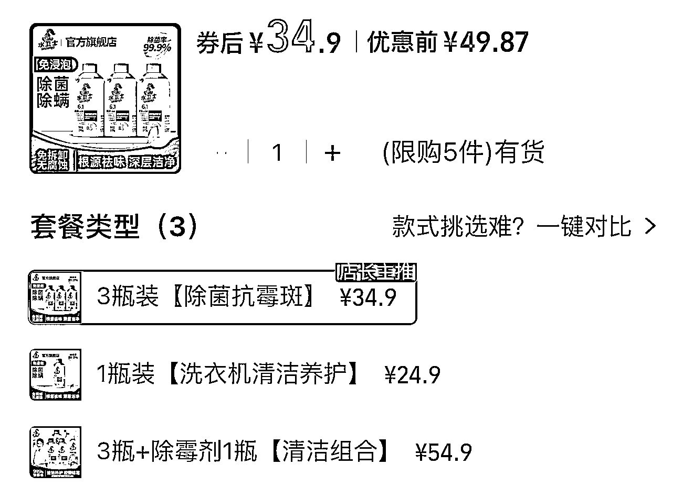

# (27 赞)闲鱼代下单模式拆解：流量入口+渠道差价的生意

> 原文：[`www.yuque.com/for_lazy/zhoubao/bqpvtpsg85n8pp7v`](https://www.yuque.com/for_lazy/zhoubao/bqpvtpsg85n8pp7v)

## (27 赞)闲鱼代下单模式拆解：流量入口+渠道差价的生意

作者： Xin

日期：2025-09-12

不知道大家有没有在闲鱼上买东西的习惯，一般在视频里刷到的商品，都先去闲鱼搜一遍，部分会有代下单。是从官方旗舰店发货的品质应该没啥问题。就是不知道背后的渠道是怎样的，通过什么来赚钱

* * *

评论区：

暴暴蓝 : 我就干这个，不过不代下，不发闲鱼。做私域，一手渠道

Xin : 想了解，可以链接么

郑好运 : 的确，蹲个评论解答

暴暴蓝 : 各个平台品牌需要出量，就需要我们真实推广，下单有要求，闲鱼上的有部分做折扣，有些是薅羊毛返利，有些是平台低价，各种信息差，想挣的多的话顾客有针对性

诗语 : 代购质量问题怎么售后？

Jarvis : 实体商品，有网供店接单代发

亦仁 : 感谢分享，已中标