# (50 赞)大陆人开香港卡的详细攻略，新手友好、亲测有效

> 原文：[`www.yuque.com/for_lazy/zhoubao/si6g3r0n2a6b10zh`](https://www.yuque.com/for_lazy/zhoubao/si6g3r0n2a6b10zh)

## (50 赞)大陆人开香港卡的详细攻略，新手友好、亲测有效

作者： 冯巧杰

日期：2025-09-08

大家好，我是小冯妮儿。

由于工作原因，我每个月都往返香港杭州，并且带客户开香港银行卡，我自己也办理了多家香港银行卡。今天给大家分享下众安、汇丰、中银香港、香港恒生的开卡攻略，亲测有效。

办理香港银行卡并不是都要去香港，在大陆同样可以办理，大陆办理香港卡的优点是不用去香港，这是他有且仅有的唯一优点，缺点一是慢，整个过程需要一个月时间，二是费钱，要
50 万打到外资行的银行卡。

去香港办理的优点是不用花钱，有些银行线上就能办理，甚至都不用去网点，缺点是人必须要到香港。下面我详细和大家说下操作细节。

### 不去香港办理银行卡

在国内，主要是外资行会推这个业务，比如香港恒生、汇丰、渣打这类银行。通常你在大陆办理香港的银行卡，开的卡并不是香港的基础卡，而是高级别的卡，这类卡的特点就是维护成本高，要么你保持账户始终有
50 万人民币，要么就要每个月扣账户管理费，比如汇丰卓越理财是每个月 380。

一般开通了高级卡，同行的大陆和香港互转就有了手续费的减免，通常 5 万美金额度内银行也不会限制你，等于花钱买了出入金的自由。

这里，我重点提一下香港恒生的银行卡，这家银行的好处是可以花 50
万最多开四个香港卡，比如以你为主卡，你的配偶、父母都可以同时开大陆卡和香港卡，这样跨境汇款的额度就大大提升了。

国内办理港卡的流程如下：

1、带身份证、港澳通行证去银行柜台先办理大陆卡，比如大陆汇丰，注意直接去大概率办不了，银行有专门的渠道经理负责这个业务，很多银行不会直接对外。

2、存入 50 万人民币，交 800 的律师鉴证费，提供个人相关资料，等银行办理。

3、收到香港卡邮寄到家，打电话激活。

这套流程看着是简单，我们实操中遇到了几个问题，一是很多外资行只在一线城市有网点，内陆地区或者二三线城市不方便。二是虽然不去香港，但让填写的个人资料有点多，等于香港客户经理要填的资料，有些需要你自己来填了。

### 去香港办理银行卡

人在香港境内可以办两类卡，一类是虚拟银行卡，类似众安银行、天星银行这类，第二类是传统实体银行卡，类似香港中银、香港汇丰这类。

虚拟卡到了香港就能办理，目前我带所有客户开虚拟卡全部都通过了，有些是秒过，有些是过几天了通过，成功率极高，也没有管理费。推荐办一个。

比如众安银行，下载 APP 跟着步骤一步步开户就好。

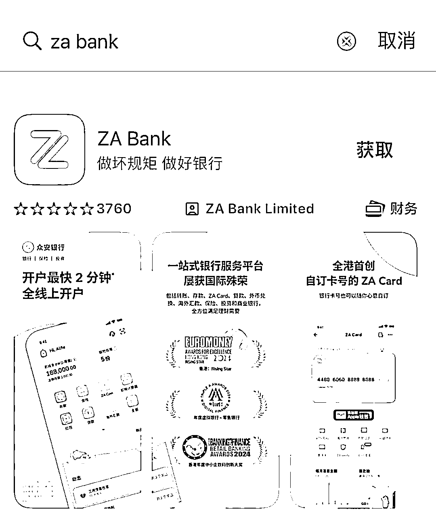

实体卡要看银行，目前来说对大陆人最友好的就是香港中银和香港汇丰，大陆人办理的最多，基础卡也没什么费用，我之前有次尝试了直接去香港恒生，没想到还被鄙视了。

去香港开户，你需要提前准备好这些材料：

1.  港澳通行证（6 个月有效期内）

2.  身份证

3.  通关小白条（首次通关时领取的）

4.  地址证明

5.  资产证明

6.  开卡目的

7.  开通了漫游功能的电话卡

8.  1000 左右的港币现金

9.  出入境记录

香港的金融在某些方面非常落后且古板，比如

地址证明，最好是提供水电煤气的账单，或者银行卡结算单，带着个人地址就行，不是一定会问到，建议做个准备。

开户目的：说存款或者储蓄，证明你确实香港银行贡献业绩。

资产证明：银行卡余额、股票账户、纳税记录都可以，别低于 20 万吧，毕竟年收入 100 万在香港也属于收入一般的群体。

出入境记录：

微信或支付宝搜索小程序 “移民局 12367”→选择中国公民服务→出入境记录查询→选择需要查询的时间范围→生成查询结果，发送 PDF 文件至个人邮箱！

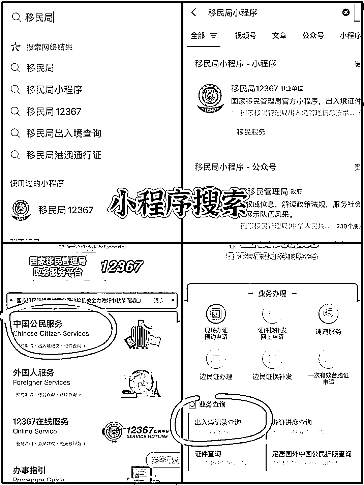

1000 元现金：

开户后可以直接存入激活卡片，而且留有一些现金银行也不会轻易给你销户。

好，下一步就是开户了，选了香港中银和香港汇丰，都可以在香港境内下 APP 直接办理。

先说说香港中银 APP，**只要你身在香港，连接香港 WiFi 就可以手机线上开户，不用再跑分行开了。**  *1、下载中银香港 APP，连接香港 wifi，* 但不能是内地手机卡漫游（有网友亲测不行）。苹果手机用 App Store、安卓手机在应用市场搜索“中银香港”，下载安装中银香港 app。

后面根据 APP 的提示一步步操作，通常符合条件立马就开通了，手机银行开通后可以直接登录，不用等实体卡寄出，转账额度是 20 万/天。

主要包括以下步骤：

step 1 ：打开 APP → 点击“开立账户” → 内地居民证件类型选身份证 → 身处香港

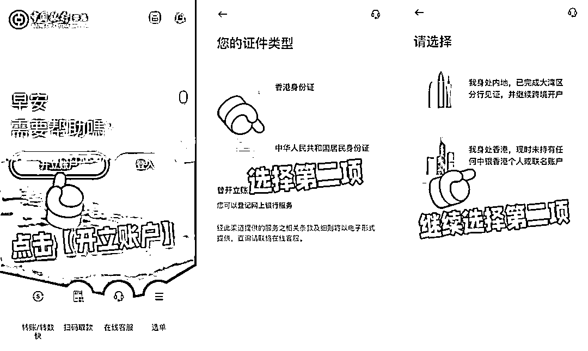

**step 2 ：** 即时开立 → 选择“我不在分行” →
选择综合理财服务类型，如“自在理财”（页面上有提示需要维持 1 万港币以上，但其实在开户过程中并不需要存入）。

step 3 ： 上传“出入境记录” → “身份证”拍照 → 人脸识别。

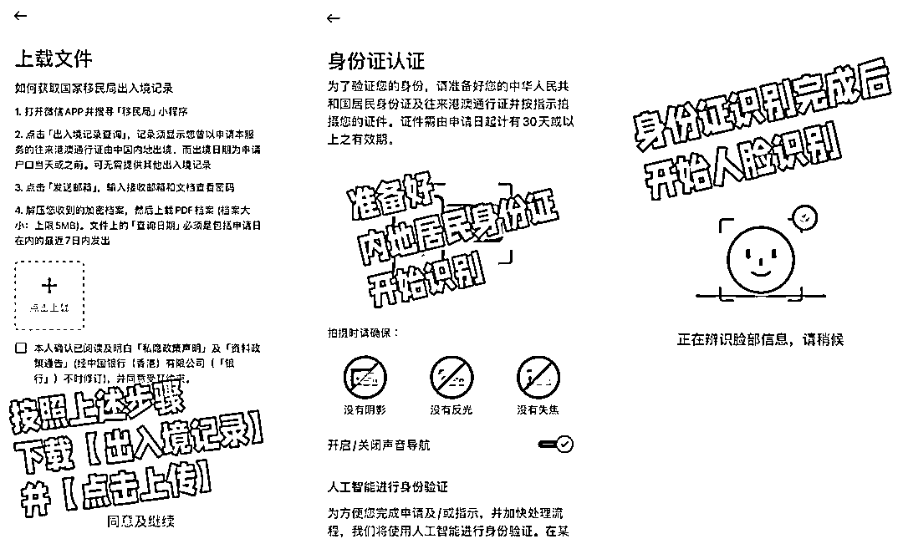

step 4 ： 拍照“港澳通行证” → 选择开户原因，比如保险/基金，填写地址（务必是能收到快件的地址，以便接收实体卡）。

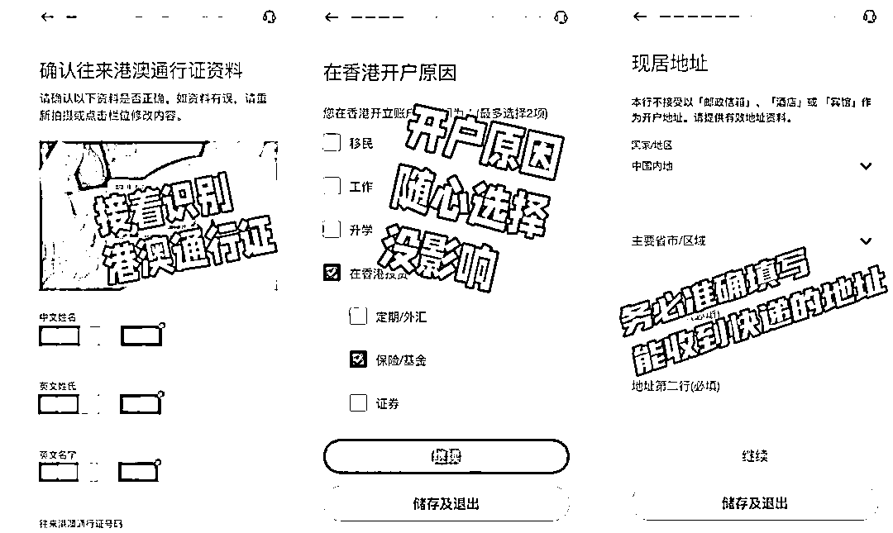

step 5 ：开户成功，交易额度 1 万。开户成功，不用等实体卡寄出，就能立即登录手机银行。

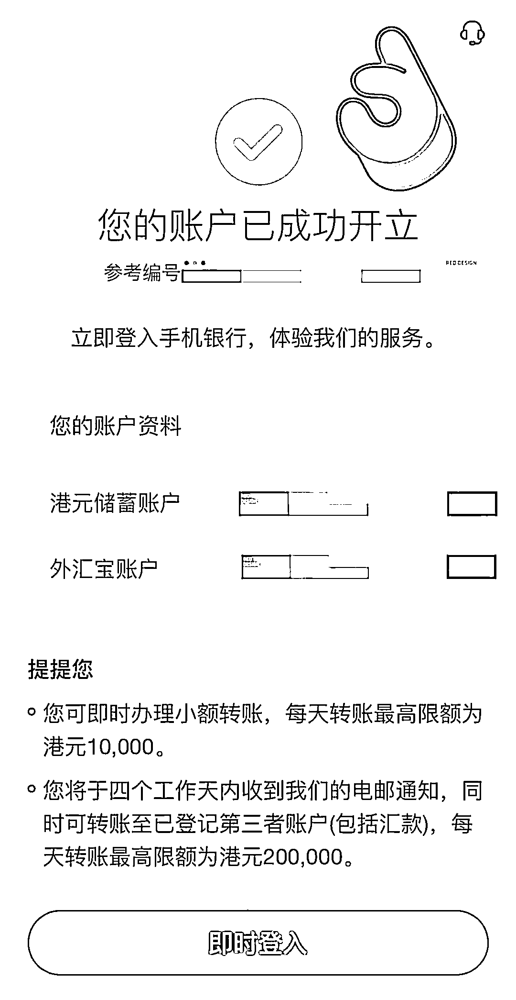

**注意事项：**

①线上开户成功后三天内，户口交易额度只有 1 万港币/天，第 4 天收到邮件确认之后，限额可调高到 20 万港元/天。

②如每天转账不超过 20 万，并且不需要柜台办理现金业务的话，可以不用到分行补签字！不然的话需要到分行补签字。

③在开户过程中，请妥善保管您的个人信息和账户密码，避免泄露给第三方。

再说说香港汇丰，下载“HSBC HK”APP，可以从 APP store 或者在官网下载 APK 文件安装（安卓需官网下载 APK）。

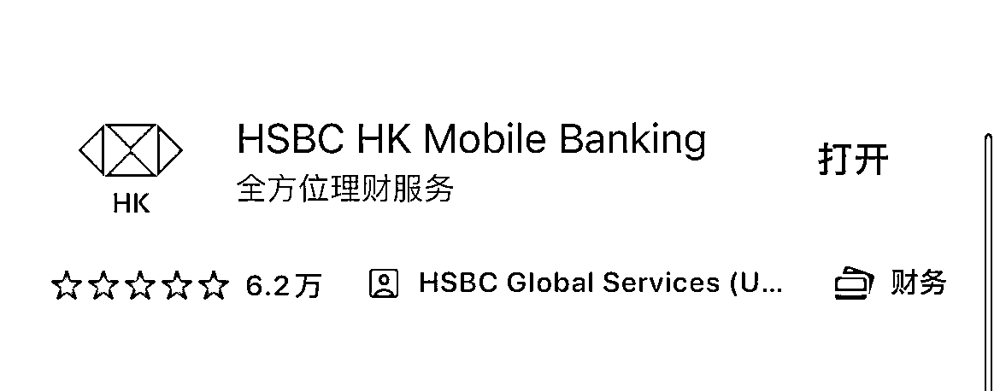

进入开户流程，选择开“汇丰 One”账户。同样的，按照步骤走。

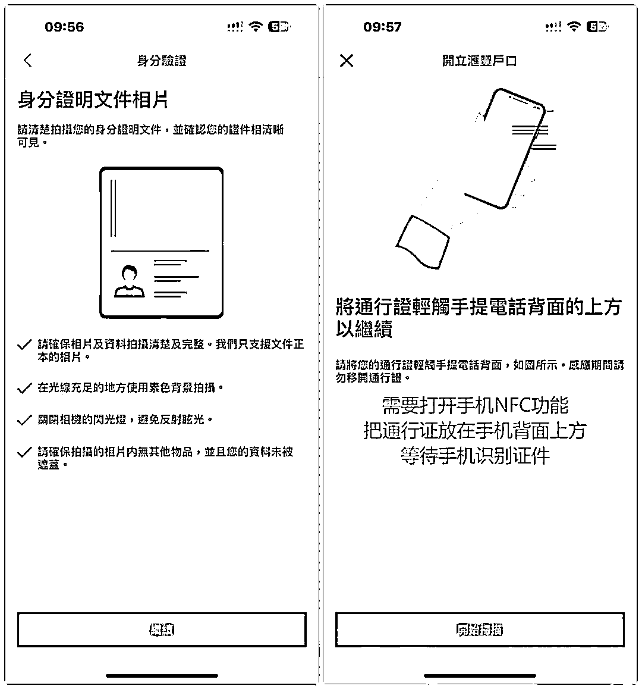

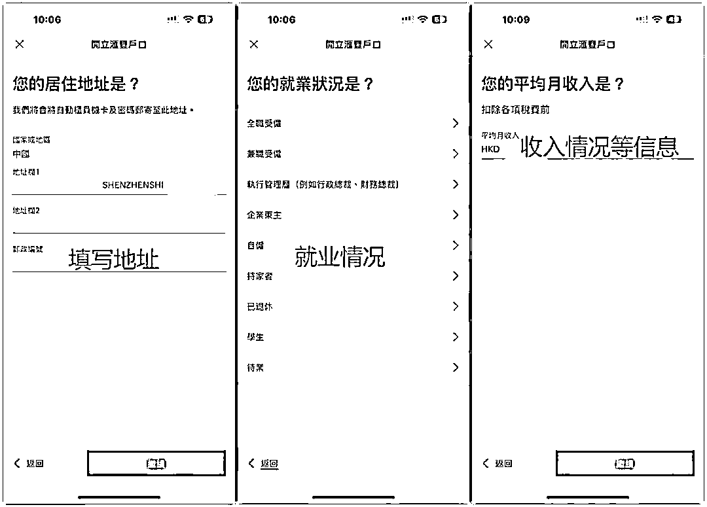

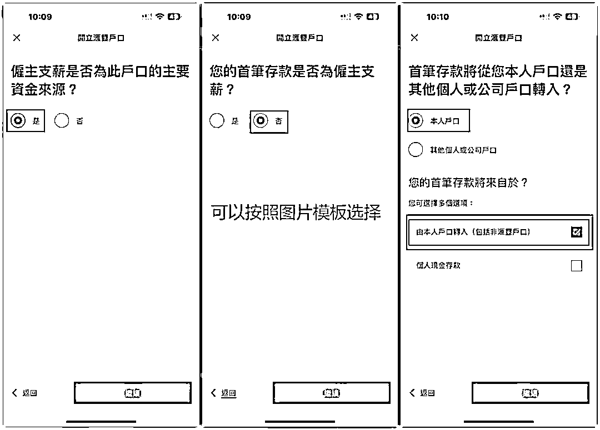

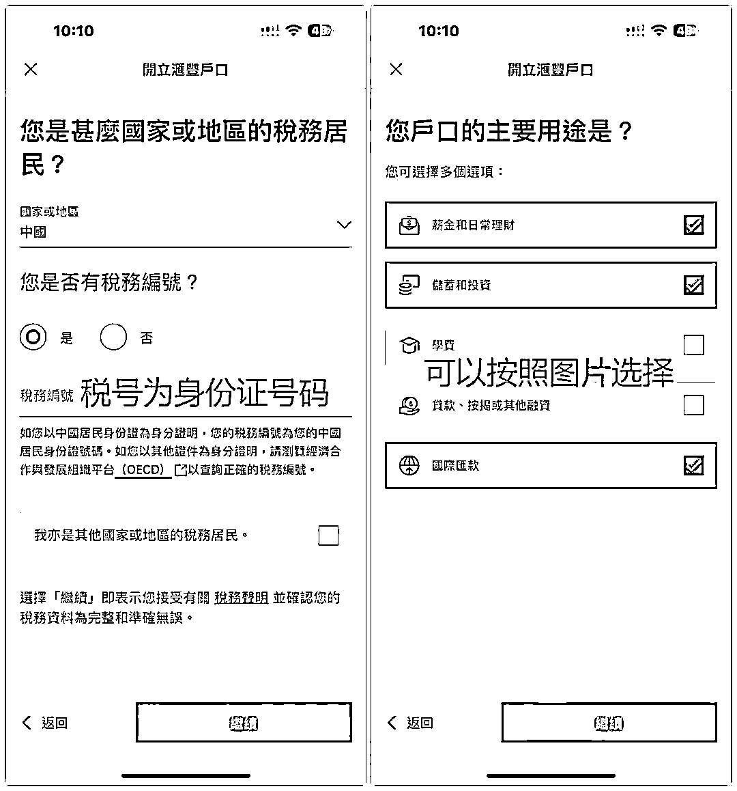

**说一下这两家银行的要点：**

1、不用去网点，如果想调高转账限额，可以去柜台网点拿号排队，去留下个人签名提额。

2、实体卡都是后续寄出，通常 7-15 天之间，但往往也容易寄丢。没有香港汇丰、香港中银的实体卡并不影响你使用银行转账。

3、香港汇丰的审核难度是大于香港中银的，这两家都不保证百分百能申请成功。

4、香港汇丰查重名严重，名字是两个字的人会更容易被查。

5、银行里要留有余钱，建议每三个月登录一次，不然容易被当成睡眠户销户。

6、香港银行卡的审核难度往往也是实时变动，时而放水，时而收紧，所以有些口子上个月行下个月就未必了。比如汇丰 one
之前是可以去网点排队办理，现在办的人太多了，网点就不再办理了。

最后：

以上攻略有时效性，目前建议大家办理一张虚拟卡+ 一张实体卡，互为备份，防止卡片因为长期不用销户。祝大家都能办到满意的香港卡。

* * *

评论区：

苏白 : 太感谢了！

朝云 : 谢谢分享。想请问下工资流水是否是必须的？

清木宁 : 请问下，地址证明是怎么解决的呢？

冯巧杰 : 有帮助就好哈

冯巧杰 : 不是所有都需要，通过下载 APP 开户，我自己是写了杭州地址，就没有要提供别的资料，如果需要，就是银行结算单

冯巧杰 : 不是

KDY : 这个方法办理的是普通卡吧，想要办理 stripe 能绑定的 visa 卡也可以用这两个办法吗

冯巧杰 : 不好意思不了解