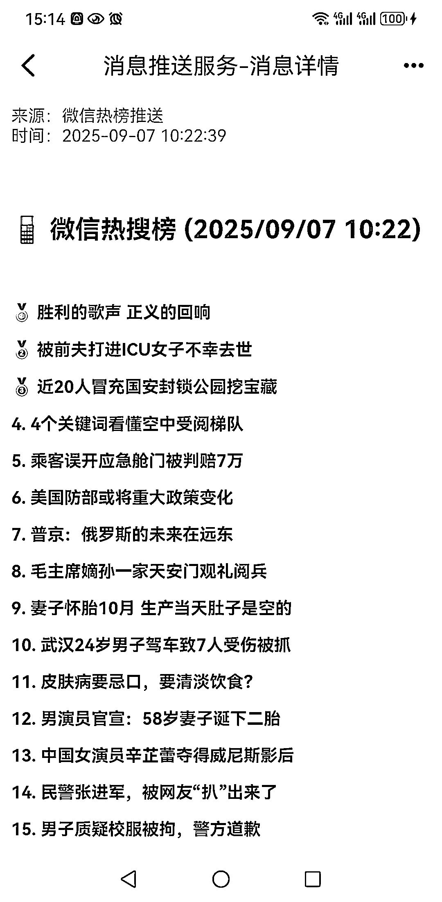

# (39 赞)零成本搞定微信热榜推送，配置半小时能用一辈子大家好，我是 Nancy~

> 原文：[`www.yuque.com/for_lazy/zhoubao/ivcvwglkei67a5sm`](https://www.yuque.com/for_lazy/zhoubao/ivcvwglkei67a5sm)

## (39 赞)零成本搞定微信热榜推送，配置半小时能用一辈子大家好，我是 Nancy~

作者： nancy

日期：2025-09-07

零成本搞定微信热榜推送，配置半小时能用一辈子 大家好，我是 Nancy~ 这期航海参加公众号的圈友很多，不知道有没有遇到和我同样的问题； 1、不知道写啥
2、每天为了写啥花了很长时间找到底应该写啥，生怕错过什么大事件，想订阅热榜，但是价格实在太贵了 3、看到别人写啥就写啥，但是自己写完了热度早过了
我也是你们其中的一员，于是我想，世界上有没有这样的好事，给我免费配个热榜推送的秘书？ 于是，我用三个工具搭一起， WxPusher：负责消息推送到微信
天聚数行 API：提供热榜数据源 GitHub Actions：不开电脑每天自动推送 现在我每天早上 10 点，微信会准时收到推送：之前那种
"别人都在追热点，我还在找素材" 的焦虑感，现在完全没了。
为了良好的阅读体验，请转到飞书[`l0xoaai7d9t.feishu.cn/docx/OU6edYOnnophrpx6GOsc6Ur6nsc?from=from_copylink`](https://l0xoaai7d9t.feishu.cn/docx/OU6edYOnnophrpx6GOsc6Ur6nsc?from=from_copylink)

* * *

评论区：

清木宁 : 谢谢分享，明天来试一试。

xq : 这个做成小工具，是不是也能弄个订阅模式呢[呲牙]

nancy : 肯定可以啊