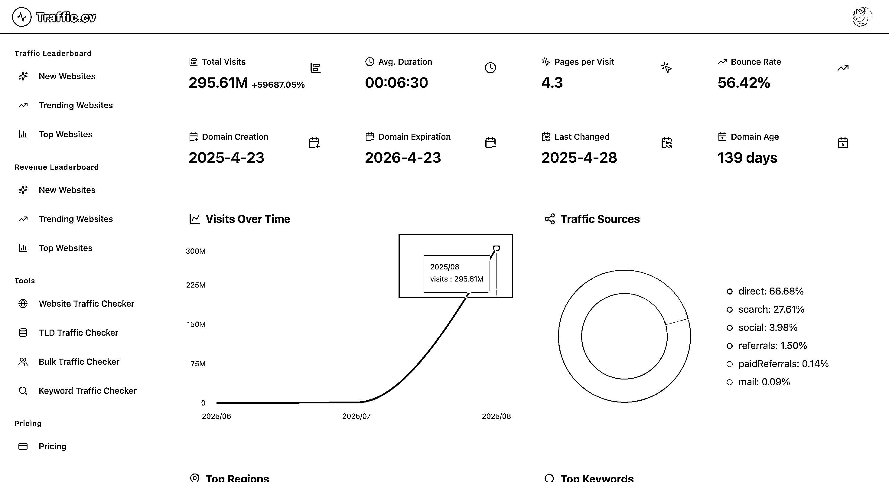
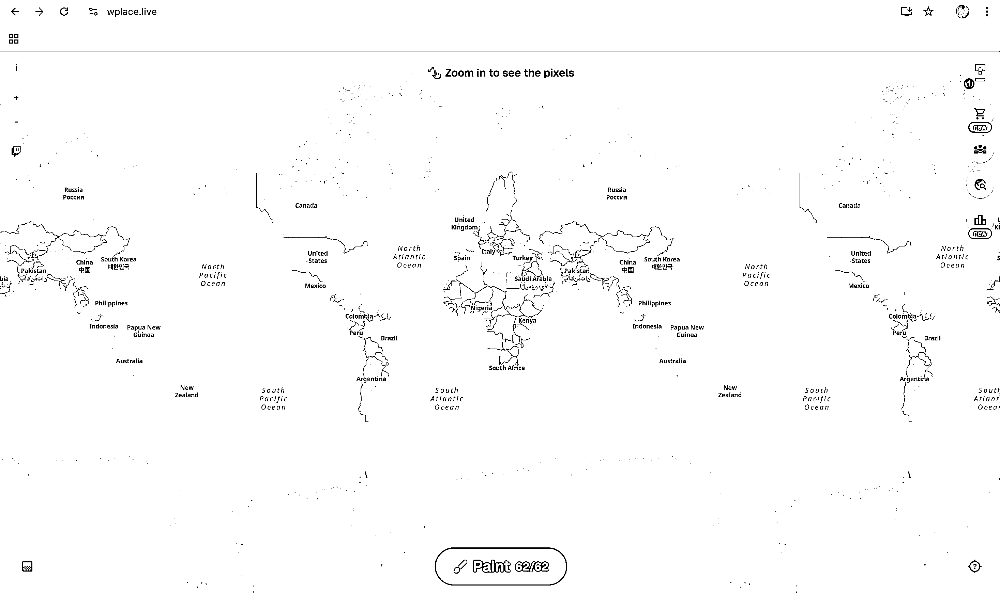
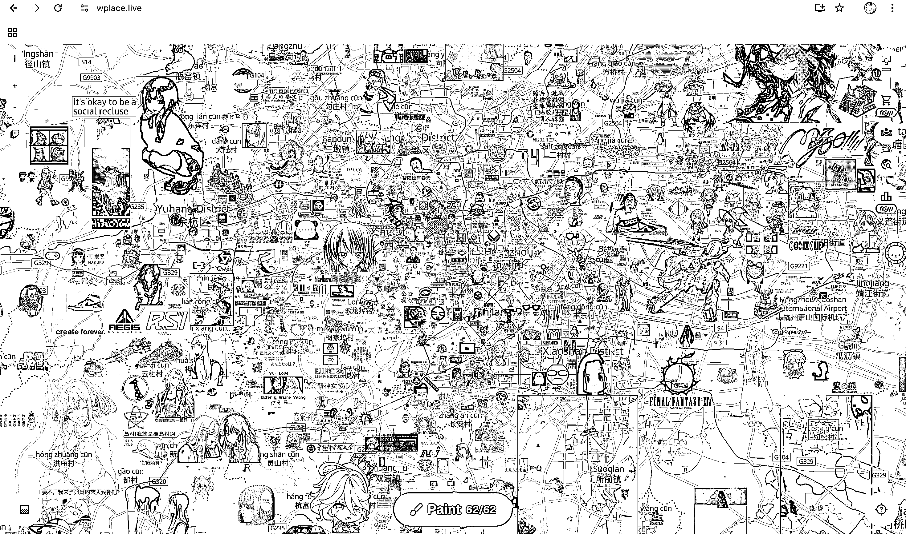
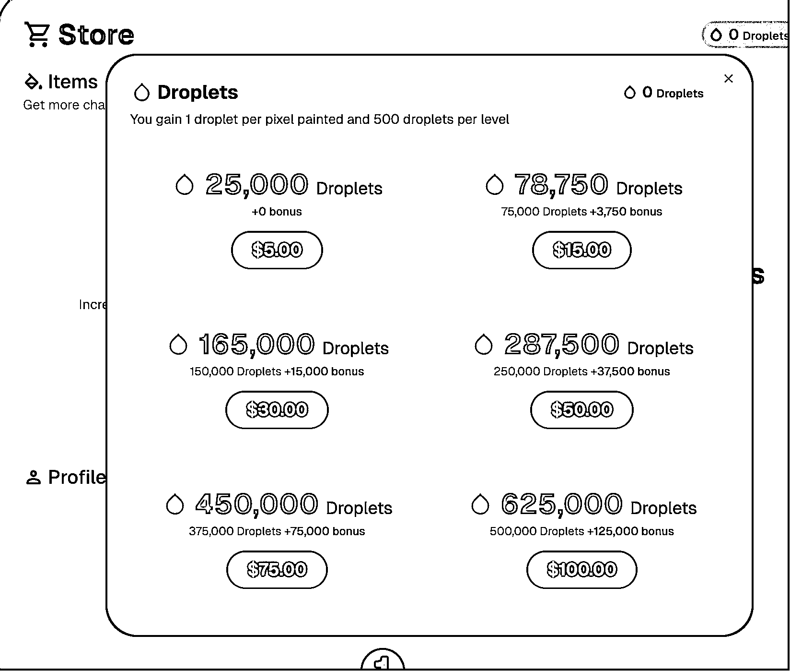

# (39 赞)流量异常值！一个涂鸦网站 1 个月从 49 万到 2.95 亿访问

> 原文：[`www.yuque.com/for_lazy/zhoubao/cz8fkxqszufvk0xg`](https://www.yuque.com/for_lazy/zhoubao/cz8fkxqszufvk0xg)

## (39 赞)流量异常值！一个涂鸦网站 1 个月从 49 万到 2.95 亿访问

作者： 馆主

日期：2025-09-10

-流量/产品 ｜ 异常值 刚刚浏览 Traffic.cv 发现网站的流量出现异常值 7 月份的时候流量是（494 K），但是到 8 月份（295 M）流量极速的增长 这个网站是一个开放地球画布，你可以在世界地图的任意地方进行涂鸦，像素级风格 但是你可以看到别人的涂鸦作品，比如说（图 3）我拖到杭州可以看到各种各样的涂鸦（二次元的比较多[旺柴]） 该网站的盈利模式：卖 droplets，就可以解锁道具，标准的卖工具卖皮肤模式 顺便推荐一下这个数据分析网站：Traffice.cv 可以免费分析检测任意网站流量，分析竞争对手并发现 SEO 机会

* * *

评论区：

亦仁 : 感谢分享，已中标