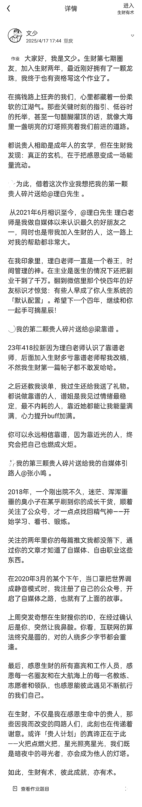

# (精华帖)(145 赞)从理发店学徒到 YouTube 赚美金，我的两年破圈之路

> 原文：[`www.yuque.com/for_lazy/zhoubao/rtgheic5a639ge55`](https://www.yuque.com/for_lazy/zhoubao/rtgheic5a639ge55)

## (精华帖)(145 赞)从理发店学徒到 YouTube 赚美金，我的两年破圈之路

作者： 文少

日期：2025-09-08

从理发店学徒到 YouTube 赚美金，我的两年破圈之路
大家好，我是文少，生财传术师，也是第七期圈友，现在主要做 YouTube，5 月 YouTube 航海结束后加入了 YouTube 深海圈。
目前有 4 个账号，高级 YPP 一个，其余 3 个还在开通 YPP 的路上。 加入生财两年，也终于有了两篇精华帖，也体验了志愿者、领队、教练。
可以说，这两年算是我成长速度最快的两年。 不过今天不是聊项目复盘的，而是和大家聊聊我自己。 起因是看到曹教练和枨惘教练的分享经历，看的我深有感触。
作为 YouTube 深海圈的一员，让我也忍不住来分享一下。 如果用三句话来概括我的成长经历：
所以这篇文章，我会尽量回到当时的视角，聊聊自己过去的一些选择与努力，顺带做一个复盘。它不会给你一夜暴富的捷径，只想坦诚分享我这几年踩坑、转型、慢慢找到节奏的过程。
如果你也曾觉得自己学历不够、起点太低、努力了却看不到结果——也许我的经历能给你一份「他行，那我也可以」的底气。
内容有些部分可能有点流水账，但都是真诚分享。希望能给正在经历相似阶段的你，带来一点点微小的帮助。
详细可以查看飞书链接：[`xpjursanoo.feishu.cn/wiki/EBjsw1RZ7iU91ckMGsccQijdn4g?from=from_copylink`](https://xpjursanoo.feishu.cn/wiki/EBjsw1RZ7iU91ckMGsccQijdn4g?from=from_copylink)

* * *

评论区：

清木宁 : 向你学习，说的真好，感受了心路历程。

伍拾陆 : 苦尽甘来了文少，以后库库赚美金[666]

大婷 : 看完好感动，同时也感慨一句:牛！

文少 : 加油💪

远鹏 : 文少雄起

阿牛 : 文少你是神！

小吉玛丽亚 : 为什么不让你轻易能上班？因为你注定是不平凡的人~

方波妮 : 强的，文少[强]