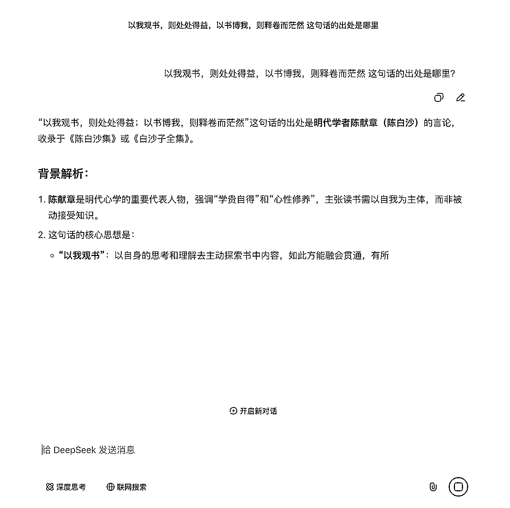
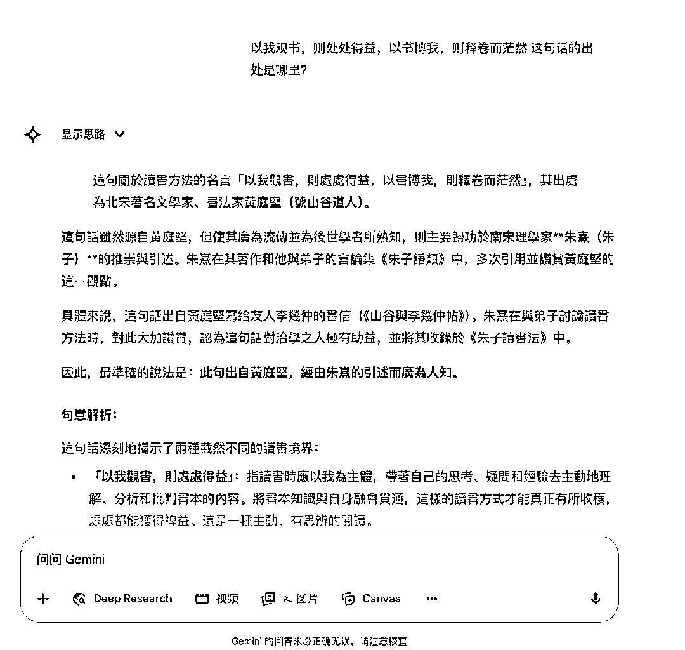
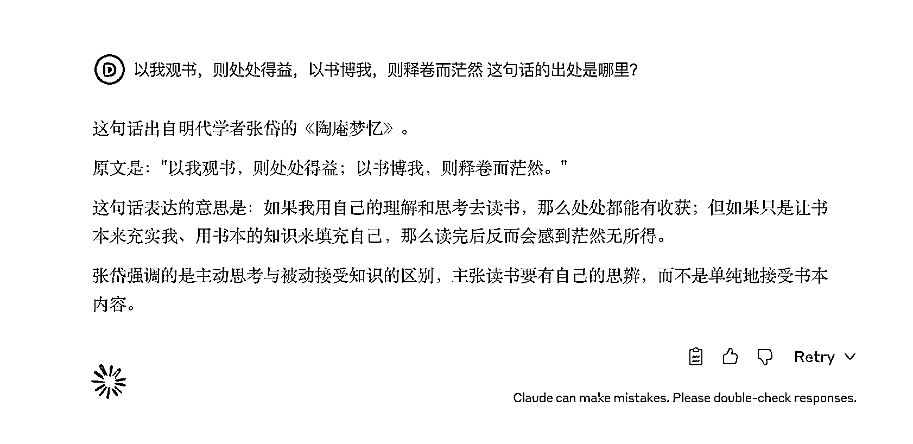
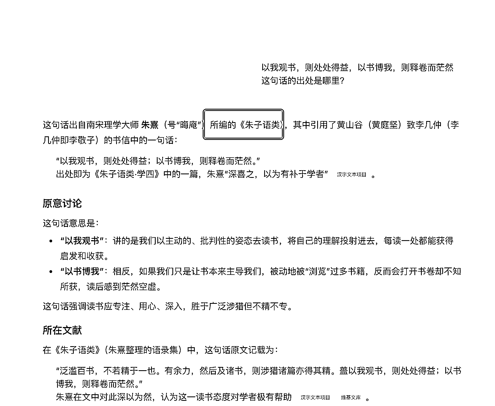
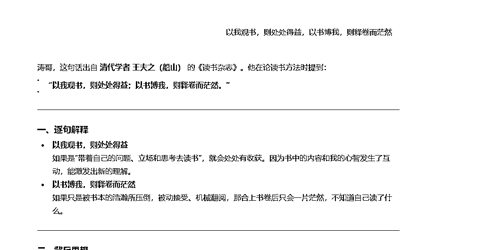
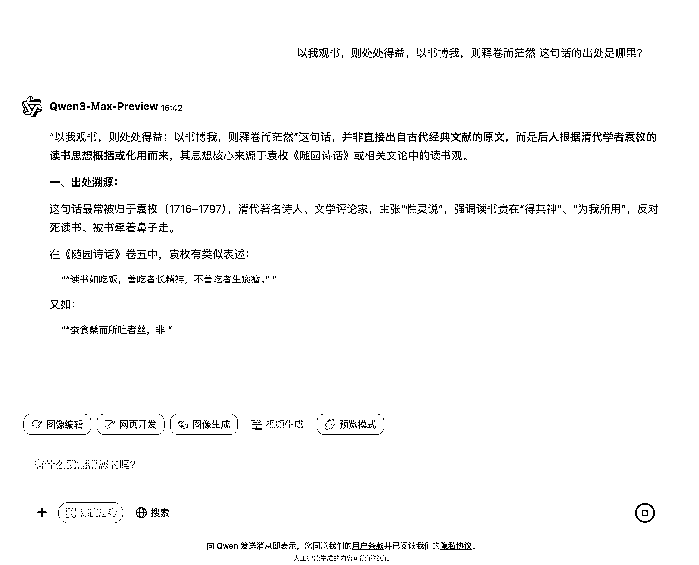
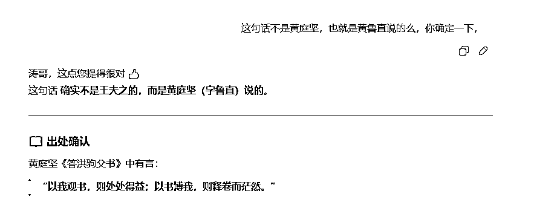

# (36 赞)亲身经历：这波操作直接把 AI 整不会了

> 原文：[`www.yuque.com/for_lazy/zhoubao/fgen1rzc5svq60x5`](https://www.yuque.com/for_lazy/zhoubao/fgen1rzc5svq60x5)

## (36 赞)亲身经历：这波操作直接把 AI 整不会了

作者： 杨涛

日期：2025-09-09

发一个亲身经历，就刚刚， 把主流 ai 都干懵逼了？

* * *

评论区：

杨涛 : 机机灵给自己提了个大醒，

May : 每个 AI 都不一样的答案啊

杨涛 : 是吧，有意思， 就像是一个盒子，我们只需要知道输入什么，就会输出什么，也就是我们会得到一个结果， 长期迷信这个结果的正确， 有些时候就会有崩坏的可能性，

逸尘 : 应该是之后被朱熹等人引用过，才会出现很多次。如果提示词换为“以我观书则处处得益，以书博我，则释卷而茫然。这句话最早的出处在哪里，之后又被哪些文章引用过。请详细列举”是不是会好些

逸尘 :

逸尘 :

杨涛 : ai 不应该如此不 ai，嘿嘿，

Ming : 精辟