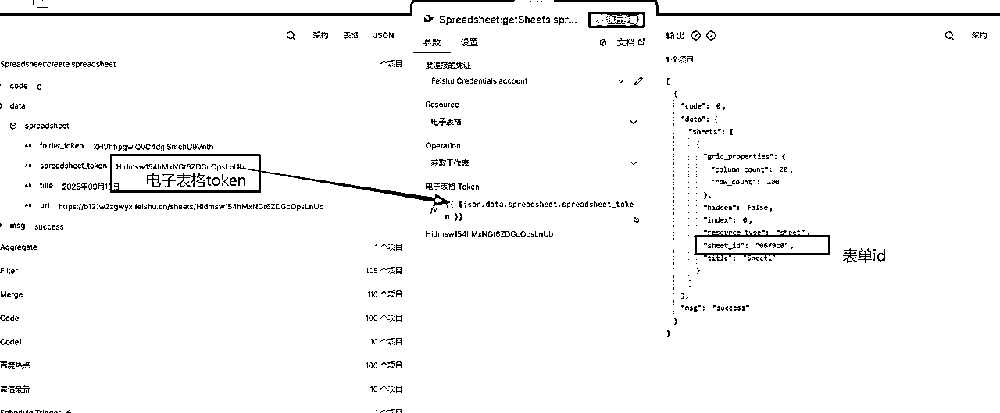

# 手把手教学：用n8n+RSS+飞书实现多平台热点自动抓取（含RSS源分享）

> 来源：[https://b121w2zgwyx.feishu.cn/docx/ADekdIdHJo17tUxnGM9cBYz6nac](https://b121w2zgwyx.feishu.cn/docx/ADekdIdHJo17tUxnGM9cBYz6nac)

之前几周手把手教大家从n8n的部署，到公众号的自动发布工作流的搭建，还有自动排版的搭建。还没有操作的，可以看看我之前的内容，全是几千字的详细实操，建议收藏后，慢慢跟着练！

现在自动生成和发布有了，又有了新的问题，我们该写点什么呢？

我平时写文章，都是看看各平台的热搜，然后还有最新资讯什么的，看看是否有合适的选题，可是每次都要打开各个平台去看，就比较麻烦。

是否有办法将不同平台的热搜，甚至是自己主要关注的资讯合并到一起呢？

还真有！今天就带大家用n8n + rss 打造一个自己专属的选题库，以下是我把这个功能集成到我软件的效果，现在通过我的软件，可以直接在这里搜到关键词，找到合适的内容，一键创作文章了。

鉴于大家没有自己的网站，我今天的工作流会改成将最终内容写到飞书中。


让我们开始吧！

## 一、添加一个定时节点

今天我们需要使用的触发节点是，定时触发节点，点添加节点，搜索schedule，然后找到这个节点添加，这个节点主要作用是可以进行定时执行，我们现在是测试，可以随便选个时间。


## 二、添加Rss节点

接下来，我们添加Rss节点，这个节点可以直接订阅支持Rss的网站，不过现在国内很多网站不支持Rss，大家可以去搜索别人自建的Rss地址，当然，如果有条件，也可以自己制作，这又是另外的技术了。

我在文末也给大家准备了一个开源的rss地址库，大家可以去挑挑看有没有合适的。

因为是演示，我这里就先添加两个节点


接着我们点击节点设置一下订阅地址

一个节点订阅的是百度热点，另一个节点订阅的是微信最新的文章

地址分别是：

https://rss.aishort.top/?type=baidu

https://rss.aishort.top/?type=wasi

大家如果有更多需要订阅的内容，可以多加些节点，配置更多的订阅地址。


添加好之后执行一下测试，看到获取成功，一个获得了100个数据，另外一个获得了10个数据：


## 三、数据预处理

为什么要做个数据的预处理？有的时候获取的数据，可能格式不是我们要的，或者没有我们需要的数据。比如，这现在这两个节点最终返回的内容数据结构都是这样的，如果到时候全部存到飞书，就会发现我们不知道这篇内容的来源是哪里的，如果节点多了就更难区分了


所以，现在我添加两个代码节点，对数据进行处理


进入code里面，按照如下配置，添加一个来源的属性，这个代码的意思就是给所有返回的内容加一个Source字段来标记内容的来源


我们执行一下工作流，就可以看到，现在的数据多了一个来源的标注，到时候我们给每个不同的订阅分支设置不同来源，就很好区分了


## 四、合并数据

接下来我们需要把多个rss地址获取的数据合并成一个，方便后续统一入库。

这个时候我们需要用到这个节点，搜索merge，添加这个节点，然后把不同分支都连进来


然后进入设置一下节点，模式选择append，下面那个数字代表合并多少个分支，如果你订阅的比较多，可以修改这个数字增加入口点。


设置好后，点击“执行步骤”，可以看到，现在项目合在一起了


## 五、数据过滤

有的时候，数据很多，我们需要筛选，比如说我只要发布日期在1天之内的内容那该怎么办呢？这个时候筛选节点就登场了，我们在合并的节点后面加上这个节点


接着设置一下过滤的条件如下


其中 new Date(Date.now() - 1 * 24 * 60 * 60 * 1000) 这部分代表 1天之前的时间。如果大家不懂的写，直接让AI帮你写就可以了。设置之后，直接运行，可以看到过滤了些内容


## 六、合并项目

接下来这是个重点，我们在批量获取数据，如果最终获得的项目是这种大于1个的项目，如上图的，有一百多个项目，那么接下来的一个节点，它就会批量执行一百次，这是n8n最容易出问题的地方，大家一定注意。我刚开始的时候就踩坑了，有一次把http请求节点放在后面，结果http请求一直报频繁请求错误，被限制。我心想我也没用循环处理，怎么就频繁请求了...。

为了解决这个问题，如果不是需要循环处理数据的情况，就比如我们这个，我接下来应该是要把所有内容组装成一个JSON，然后一口气写入飞书表格。不可能是一条一条写的，飞书也会有调用频次的限制。

所以我们接下来要用这个节点 aggregate，这个节点的作用就是可以将前面的多个项目合并到一个变量中


按照如下的设置之后，执行节点，所有内容数据就都到data中了，接下来在画布上看，就只有一个项目了


## 七、录入飞书

### 1、安装飞书社区节点

录入飞书需要用到一飞书的社区节点，它包含了飞书各种操作，我们进入节点地址

https://www.npmjs.com/package/n8n-nodes-feishu-lite 复制安装命令


然后进入n8n的设置里面找到社区节点，进行安装


### 2、添加飞书凭证

安装完成之后，我们要去添加一下飞书的凭证


找到这个飞书的凭证进行添加


这里需要输入飞书的AppID和密钥，如过有不懂得获取的朋友，可以看一下我这篇内容，不过飞书页面有进行改版，可能页面有点不同，但是基本流程是没有变的。获取成功之后填入保存就行了


接下来为了实现最大自由化的控制飞书资源，需要按照下面的教程，将一个文件夹的资源分配给我们的飞书应用，这一步很重要，关系到n8n能不能自由的创建编辑表格

https://open.feishu.cn/document/faq/trouble-shooting/how-to-add-permissions-to-app

### 3、创建电子表格

以上准备工作都完毕之后，我们添加一下创建电子表格节点，为什么不直接写表格呢？ 因为我想要把功能做的更友好一些，我要让工作流定时跑，每天都会生成一个电子表格，里面是当天的内容，搜索 feishu 找到下面这个节点，添加进来


配置一下节点，设置表格标题为今天的日期，可使用如下代码

```
{{ ((d) => `${d.getFullYear()}年${(d.getMonth()+1).toString().padStart(2,'0')}月${d.getDate().toString().padStart(2,'0')}日`)(new Date()) }}
```

文件token就是按照前面分配后资源后的文件夹打开


配置完成后执行一下，看到如下输出表示创建成功


### 4、写入电子表格

好了，终于到了最后一步写数据了，在进行写数据之前，还需要添加一个获取工作表的节点，如果你们熟悉excel的话就会知道，一个表格里面还可以有许多不同的表单，我们需要获取当前表格的表单ID，以确认后续要往哪个表单写入数据


我们配置执行一下



接下来还需要按飞书的要求对数据进行处理，否则无法写入飞书

这个处理还是有点复杂的，需要用到代码节点，把前面的JSON数据处理成，下面这样的格式


下面是代码节点中的代码

```
// 转换函数
function convertToTableData(data) {
  // 表头（固定）
  const headers = ["标题", "链接", "发布时间", "内容", "摘要", "来源"];

  // 数据行
  const rows = data.map(item => [
    item.title || "",             // 标题
    item.link || "",              // 链接
    item.pubDate || "",           // 发布时间
    item.content || "",           // 内容
    item.contentSnippet || "",    // 摘要
    item.source || ""             // 来源
  ]);

  // 返回：表头 + 数据行
  return [headers, ...rows];
}
// Add a new field called 'myNewField' to the JSON of the item
// 原始数据
const inputData = $('Aggregate').item.json.data;
console.log(inputData)

// 执行转换
const tableData = convertToTableData(inputData);

// 打印结果（可在控制台查看）
console.log(tableData);
$input.item.json.tableData = tableData;

return $input.item;
```

最后添加一下最后一个节点


将前面处理好的数据还有表格id放进来，然后保存，运行就可以了。

注意注意！第一次发的时候，数据这里漏了处理，以这个处理为准 {{ JSON.stringify($json.tableData) }}，大家对比一下就知道差别了


来看看成果吧


最后，大家自己改造没问题之后，如果要让工作流正式定时跑起来，记得把这个打开哦


完整工作流已经打包放到我的工具站上了,有需要的可自取。

对了，为了方便大家系统的学习AI+自动化，我把过往关于coze工作流教程、RPA教程、还有n8n教程全部放到一起，建了个星球。

进入星球可以获得配套的完整工作流学习。今后一些进阶的玩法会在星球分享。

感兴趣，快来加入吧，星球初建，给大家准备了优惠券，可在公众号领取后加入

## 资源地址

我的自动化工具站：https://auto.kanglan.vip

n8n飞书社区节点安装地址：https://www.npmjs.com/package/n8n-nodes-feishu-lite

rss地址库：https://github.com/weekend-project-space/top-rss-list