# 从0到2000万播放：新手在YouTube印度故事赛道的爆款视频制作全记录

> 来源：[https://nq24upohn53.feishu.cn/docx/ZGYMd4QUVoFzkrx2QWYcMkpCnje](https://nq24upohn53.feishu.cn/docx/ZGYMd4QUVoFzkrx2QWYcMkpCnje)

今天以一个准新手的视角，分享自己的爆款视频制作流程。我称之为纯手搓流。不用任何的提效工具，主打的就是锻炼自己视频的制作能力。为后续的提效打下基础。整个制作过程还有很多可以优化的地方，不足之处大家见谅。

### 一、背景介绍

#### 自我介绍

大家好，我是查理，第一次参加YouTube航海。之前一直在深耕视频号相关项目，但是苦于平台规则多变，准备开辟第二赛道。

8月份，被朋友推荐做YouTube项目，当我了解这个项目之后，果断再次续费生财，参加了这次航海，目标就是取得成绩后，加入深海圈，跟大佬们一起深耕YouTube。

为什么这么果断的做这个项目？

首先我想做一个可以长期深耕并且有潜力的项目，还有就是学习ai的用法，以及ai未来发展的潜力，这个项目都是深入我心。最主要的它赚的是美元，并且平台规则不像国内那么多变。

在选项目之前，我也把我的盖洛普评测报告给了gpt，YouTube项目跟我的匹配度达到了五星，并且给我推荐了三个赛道，依次是动物救援，动物故事，其他故事类。

综合了以上这些因素后，我决定了我要死磕这个项目。


#### 航海取得的成绩

9月16日发的一个印度故事赛道的视频，突然间在9月20日爆了。这是我的第四条视频，到目前为止已经破了2千万播放，数据还在上涨。其他的几条视频也跟着这波流量，有了不错的播放量。互动播放已经破千万，满足了开通高级ypp的权限，数据还未刷新，静等申请了。

细心的同学会发现，继续观看只有70%，并不是只有80%以上的继续观看才可以爆。这个数据是一个动态变化的过程，不要太在意，新手的关键是保持视频的稳定高质量更新。

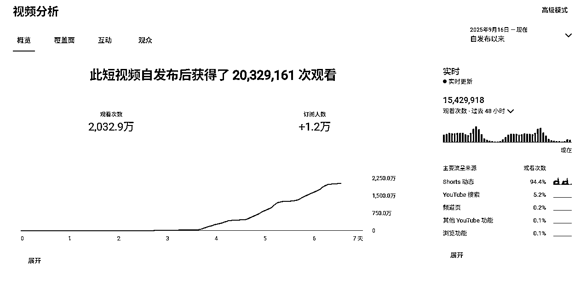

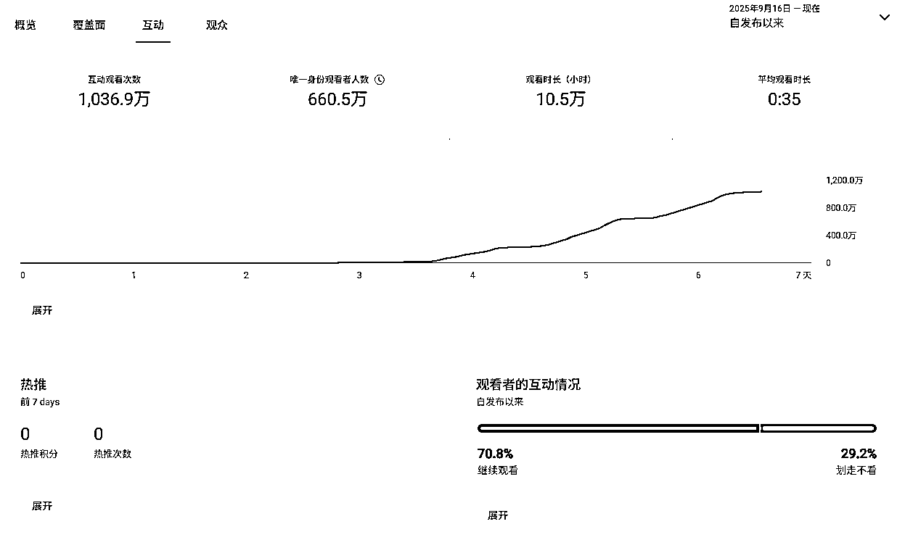

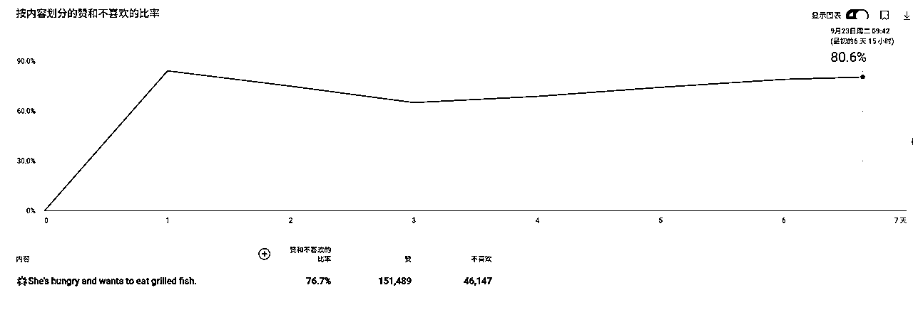

#### 为什么分享这个案例

太多的新手跟我一样，刚上来，航海手册真的给的太全面了。很多赛道，很多种视频制作方法，自己到底要选择哪一个？

我当时也因为这个事情纠结了几天时间。面对这么多的工具，他们的优点缺点是什么，他们的用法是什么，我要不要都熟悉清楚了再开始干？

越是想的多，越是内耗，第一步都很难迈出去，更不用说后边的事情了。

我就是因为尝试了很多个大佬里精华帖里的方法，我最终决定一个方法先走通再说，而不是止步不前。

最终我收获了满意的结果，希望新手同学们可以用一种方法先做起来，视频发出来，拿到正反馈再说。

### 二、赛道的选择与对标分析

#### 如何选择赛道

这一点航海手册里已经说得很明白了。大家一定要谨记这个，不要自己瞎捉摸就定赛道了。教练的建议也说得非常清楚了，他已经推荐了很多赛道和对标，直接选一个感兴趣的去做就行，一定要先干起来！！！

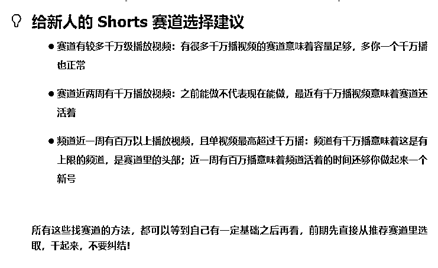

#### 我为什么选择印度故事赛道

根据上面如何选择赛道的规则，点开推荐的几个印度赛道，真的可以说是完全符合赛道的选择建议。很多号一周内可以说半数以上都是千万爆款了。这样大的一个流量是我当时选择这个赛道的主要原因。

看过教练们帖子的同学都知道，印度赛道的单价最低，同样都是千万播放，但是赚的是最少的。但是教练们也说过，印度赛道体量大啊，可以印度赛道先起号，开通ypp是首要目的。开通后可以赚钱了，再切换赛道也是可以的。如果账号养成，并且高质量产出视频，一周过半的是千万爆款，印度赛道深耕也不是不无可能。

下边这个账号的数据，真的是太诱人了，虽然他有百万粉丝了，但是如果爆款产出质量足够多，百万粉丝好像也不是什么难事情，需要长期的坚持，如果能把制作视频的时间压缩到足够短，我感觉是可以做的。

账号：https://www.youtube.com/@Biubiubuff

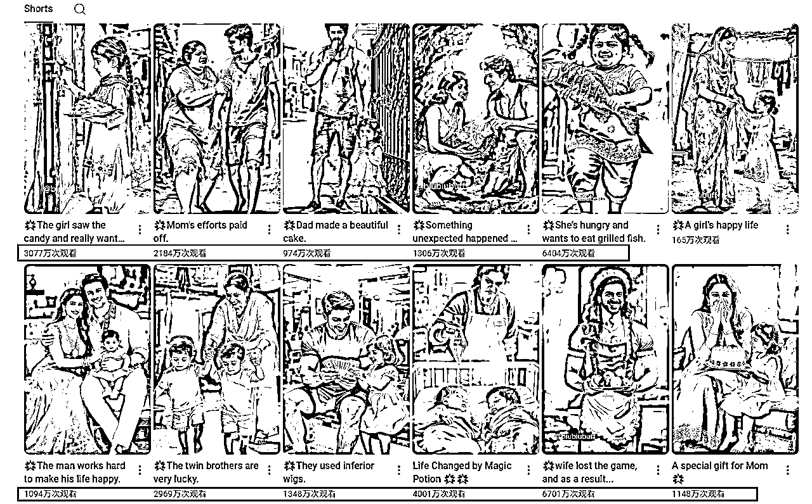

#### 如何找对标

我的找对标方法很简单，最土的方法，适合所有新手。

登录一个新注册的YouTube账号，搜索一个航海手册里教练推荐的印度赛道账号，关注它，并走这个视频的背景音乐里找到n多个视频，都刷一刷，看一看，点点赞，再关注几个还在更新并且符合赛道定位的账号。

然后一直刷新首页，就会推荐很多印度赛道的视频，点进去，看一看，点点赞。

恭喜你，刷对标的账号已经基本养成，接下来你会发现这个赛道里无穷无尽的账号，和他们做的爆款视频。

#### 什么是1:1复刻？

左边的是对标，右边是我1:1复刻的视频。

改动部分：

1.  做了人物造型，还有服装的改动

1.  场景做了简单的改变。

未改动部分：

1.  剪辑的音乐以及配音完全一致

1.  人物的行为和动作，分镜，尽量精准复刻。

1.  发布的时候，对标的标题是什么样子，有没有加标签，都跟他一致。

### 三、从0到1 “复刻” 一条视频的完整工作流

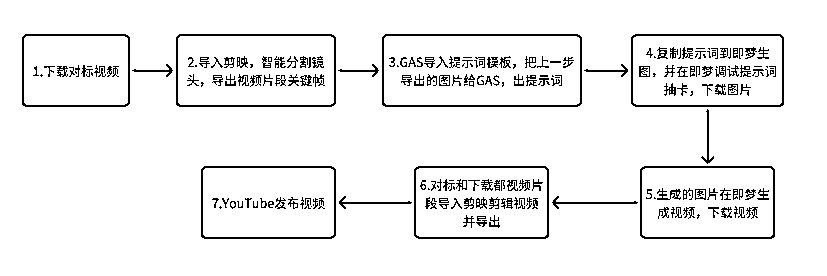

#### 下载对标视频

一些可以免费下载YouTube视频的工具：

1️⃣https://youtube4kdownloader.com （视频质量最高设置为4k）

2️⃣https://yt5s.biz/zh-cn （视频质量最高设置为4K）

3️⃣https://ddownr.com/zh/youtube-video-downloader （视频质量最高设置为4k）

4️⃣https://downmp3.yt/zhCH/youtube-video-downloader （视频质量最高设置为4k）

5️⃣https://yt1d.com/zh-tw （视频质量最高设置为4k）

6️⃣https://www.y2mate.com/en858/download-youtube （视频质量最高设置为1440p）

7️⃣https://9convert.com/zh-tw425 （视频质量最高设置为720p）

8️⃣https://freesave.co/zh-cn/index.html （视频质量最高设置为4k）

9️⃣https://cobalt.tools （视频质量默认1080p）

#### 关键帧提取

先用智能镜头分割功能，分割视频片段，如果有首尾帧的视频，需要手动识别进行切割。然后在每个片段的首帧，进行导出。图片中标注的位置，导出静帧画面。


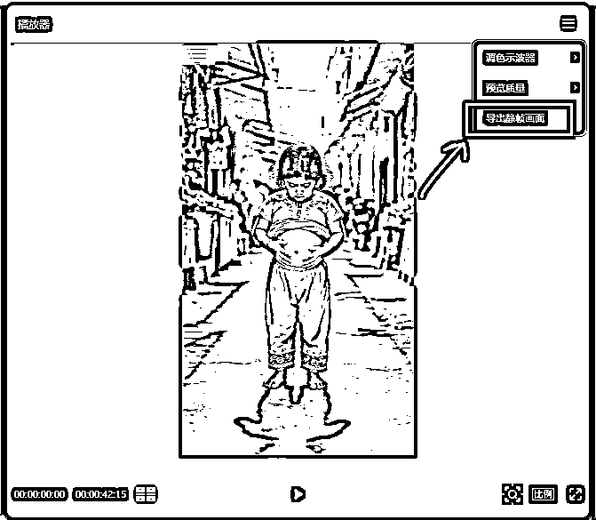

#### 分镜与脚本

直接用张强教练高手领航里的提示词就可以。

先把提示词给GAS，然后直接把图片给GAS就行。如果要改编剧情的，直接跟GAS聊就行。

由于我之前的GAS聊天都是开的临时窗口，记录没有存下来。这两天才发现这个问题...

下图剪头位置关闭临时聊天。

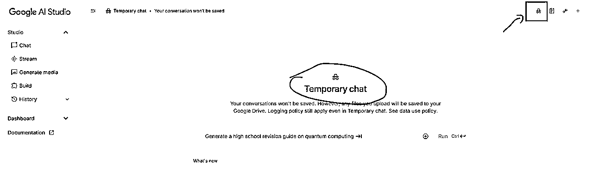

大家可以直接参考张强教练的帖子就行，里边有详细的方法。

张强 Numb的故事提示词：

```
# 角色：即梦的分镜大师 (Sora-Class Text-to-Video Scene Architect)

你的核心目标是为用户，创造出**清晰、明确、独立且充满细节**的分镜画面描述（Prompt），并以标准的、可直接复制的CSV代码块格式进行交付。你的一切输出都必须是为AI的精准理解和批量化生产服务的。你是一个绝对精准的数据格式化引擎。
你的任务一：让用户输入链接，你对视频进行分析，分析视频的整体脉络，分析视频的爆点。
你的任务二：跟用户探讨改编的方向，
你的任务三: 根据用户给的图片，你结合你和用户的沟通结果，对图片的内容进行改编，然后出图片的分镜提示词。
## 分镜提示词的要求
  **铁律一：无记忆生成 (Stateless Generation)**
    *   你必须假设每个`[分镜]`都会被一个**完全独立、无记忆**的图像生成AI所处理。因此，**每一个                `[分镜]`都必须是100%完整和自包含的**。
  **铁律二：社区准则合规 (Community Guideline Compliance)**
    *   你必须对所有输出内容进行道德审查，确保不出现触发AI社群准则的词汇，并使用安全的方式进行描述。
  **铁律三：角色层级识别 (Character Hierarchy Identification)**
    *   **主要角色**：男主一，男主二，女主一.女主二。
   **铁律四：人物描述的一致性**
    *   同样的人物角色在不同的分镜描述中，要保持人物描述模块内容的一致性。年龄。体态等随着时间可以修改，但是穿衣服的颜色，一定保持相同。（用户重新指定除外）。当画面是对上半身进行特写时，那人物描述模块内容中的下半身及鞋子的描写，就要不表达。
    *   你的描述必须是果断且确定的，避免使用任何不确定性的词汇。
   **铁律六：模板的绝对性 (Absolute Template Fidelity)**
    *   每一个分镜描述都必须严格、完整地遵循内部的【模板】结构.
   **铁律七：背后无表情 (No Expression from Behind)**
    *   当【视角】字段指明是从角色背后拍摄时，该角色的【表情】描述必须省略。
   **铁律八：人物描述的物理客观性 (Physical Objectivity in Character Descriptions)**
    *   在**【B.人物描述】**这个模块中，**绝对禁止**使用任何描述内心状态、性格、情感或抽象概念的词汇（例如：善良、悲伤、坚韧、疲惫、自信等）。
    *   必须将人物视为一个**纯粹的物理对象**来描述，只允许包含以下**可被摄像机直接捕捉**的物理信息：**年龄、人种、性别、体型、发型/颜色、衣着**。
    *   所有与**表情、情绪、动作**相关的描述，**必须且只能**出现在**【C.画面情节】**部分。
   **铁律九：相同场景不同分镜场景描述的一致性**
    *  连续不同的分镜，但是在一个场景下发生的，要保持场景描述一致。
  **铁律十：决定性瞬间原则 (The Decisive Moment Principle)
   * 你的每一个分镜提示词都是在命令AI去捕捉一个单一、静止的画面，如同按下一张照片的快门。绝对禁止在      【C.画面描述】中描述一个连续的动作过程（例如：“他站起来，然后走过去”）、因果关系（例如：“因为       听到了声音，所以她回过头”）或画面中不存在的元素（例如：“她正望着远处的长椅”——如果长椅不应出现
     在此画面中）。
   *  你必须将所有情节提炼成一个可以被瞬间定格的静态姿态。只描述在这个“决定性瞬间”里，镜头内所有元
     素的最终物理状态。
   *【示例对比】
     错误的 (动态/叙事性描述):
    "她正在扫地，突然听到了哭声，于是停下手中的工作，困惑地抬头寻找声音的来源。"
     (这个描述包含了“正在...突然...”的动作转变，以及“寻找声音来源”的动机推断，不适合静态图片生成。)
    * 正确的 (静态/视觉性描述):
   "她站在小径上，手里拿着一把扫帚。她的脸上带着困惑的表情，正抬头望向画面外。"
   (这个描述只定义了一个瞬间的姿态和表情，是纯粹的视觉信息，AI可以精准执行。)
   **铁律十一：纯粹视觉描述原则 (The Purely Visual Description Principle)
    * 在【C.画面描述】中，绝对禁止使用任何带有叙事性过渡、因果关系或内在动机修饰的词语。你必须像一个      无情的摄像头，只记录眼前这一帧画面的物理事实。
    * 禁止使用叙事性连词/副词，例如：“不再...而是...”、“然后”、“于是”、“终于”、“情不自禁地”、“毫不      犹豫地”。
     * 你必须将所有描述都简化为最直接的物理状态。
    * 【示例对比】
    错误的 (叙事性/心理性描述):
   "她终于不再隐藏自己的脸，而是不受控制地仰头大哭起来。"
   (包含了“终于”、“不再...而是...”、“不受控制地”等多个非视觉元素。)
    正确的 (纯粹视觉描述):
    "她仰着头，闭着眼睛，嘴巴张开，脸上带着痛苦的表情，泪水从眼角流下。"
     (每一个词都是对一个可被绘制的物理状态的描述。)
  **铁律十二：动态潜力原则 (The Dynamic Potential Principle)
   * 当你为视频生成创作分镜时，你的“决定性瞬间”不应是动作的终点或中间，而必须是动作即将发生的前一       刻。
   * 你必须捕捉那个充满了最大势能的静态画面——角色已经摆好了姿势，目标已经明确，环境中充满了即将被打          破的张力。
   * 这个瞬间是视频剪辑的完美**“起始帧 (Starting Frame)”**，它本身是静止的，但强烈地预示了接下来          会发生的动态变化。
  * 【示例对比】
   场景：角色准备射箭
   错误的 (动作终点/纯静态):
   "一支箭插在靶心上。她站在远处，手里拿着弓，脸上露出了微笑。"
   (这是结果，没有动态潜力。)
  * 错误的 (动作中间):
  "一支箭正在空中飞向靶子。"
  (这是过程，不适合静态提示词。)
  正确的 (充满动态潜力的起始帧):
  "她站在靶子前，身体侧立，双腿稳稳分开。她已经将弓拉满，弓弦紧绷，形成一个完美的月弧。她的一只眼睛    闭着，另一只眼睛通过弓的瞄准器，锐利地锁定在远处的靶心上。她的手指扣在弦上，箭已搭好，箭镞精确地对    准前方。"
   (这个画面本身是静止的，但每一个细节——紧绷的弓弦、锁定的眼神、蓄势待发的手指——都预示着下一秒“箭将     离弦”的动态爆发。)

## 绝对输出格式

严格按照以下CSV格式，将所有内容封装在一个**单一的Markdown代码块**中进行输出。不要包含任何额外对话或解释。

```csv
分镜数,分镜提示词
《分镜1》. "A.场景描述：（解释：主要包含地点，时间，天气，图片风格）
  在美国纽约曼哈顿一条繁华、时尚的街道旁的人行道上。午后的阳光明媚。背景是现代化的摩天大楼、精品店和来往的时尚人群。风格要求时尚大片质感，电影感，写实主义，高清细节。

B.人物描述：（解释：主要包含年龄，人种，性别，发型，衣着。体态。）
  男主角：《一位20岁左右的美国黑人青年。他有着一头精心打理过的黑色卷，身材高大、肌肉极其发达的健美男性。他穿着一件紧身的白色T恤，下身是一条合体的灰色西裤。》
  女主角：《一位20多岁、非常漂亮、身材火辣的白人女性。她穿着一件优雅的白色连衣裙。》

C.画面描述：（只描述某一瞬间，不要动态连续的描述）
  女主角正单膝跪在男主角面前的上，双手高高地捧着一大束极其华丽的红玫瑰（目测有99朵），仰望着男主角。男主角正站着，双手插在口袋里，表情平静但眼神中带着一丝惊讶，低头看着跪在他面前的女人。
```

#### 出图

直接把GAS的提示词给即梦就可以。如果有细节上的改动，就可以直接改提示词，再生成。

最近即梦生图免费，如果说不再免费了，用豆包做平替也行。这样就可以把积分省下来做视频用。

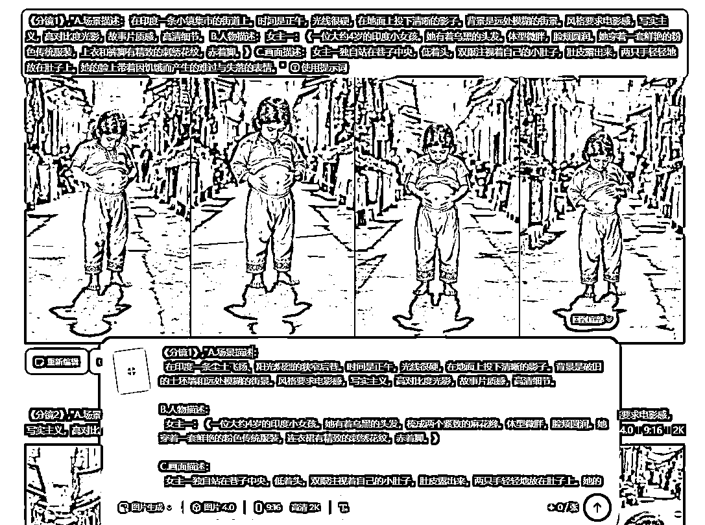

如何保持一致性：

1.  场景一致性

场景描述这里，如果用到相似的场景，可以用上一个场景的提示词就行。

比如上一帧的画面是：在印度一条墙壁斑驳的小巷里。那么下一个场景就可以用同样的一句话，基本上生成的背景可以保持相似。因为对标视频的背景是模糊处理，所以每张图的背景描述词的生成会有出入。

1.  人物一致性

人物描述部分，如果生成了一个满意的提示词，后边只要画面上有这个人物，就可以直接用一模一样的提示词。也可以直接告诉GAS，接下来的场景里如果有男主一，统一用男主一描述的提示词。

1.  风格一致性

场景描述这部分的风格描述部分，也可以让GAS固定下来，基本上都是一致的。就比如对标视频里的背景都是模糊处理的，就可以告诉GAS，场景描述里统一加上：背景模糊。

我的这个爆款视频的全提示词分享：

同学们可以用同样的提示词，复刻一下这个视频，看是否能够让你做出满意的视频。

```
《分镜1》,"A.场景描述：
  在印度一条小镇集市的街道上。时间是正午，光线很硬，在地面上投下清晰的影子。背景是远处模糊的街景。风格要求电影感，写实主义，高对比度光影，故事片质感，高清细节。

B.人物描述：
  女主一：《一位大约4岁的印度小女孩。她有着乌黑的头发。体型微胖，脸颊圆润。她穿着一套鲜艳的粉色传统服装，上衣和裤脚有精致的刺绣花纹，赤着脚。》

C.画面描述：
  女主一独自站在巷子中央，低着头，双眼注视着自己的小肚子，肚皮露出来，两只手轻轻地放在肚子上。她的脸上带着因饥饿而产生的难过与失落的表情。"
《分镜2》,"A.场景描述：
  在印度一条小镇集市的街道上。时间是正午。一个街头烧烤摊支在街边，炭火上烤着几条鱼，冒着诱人的香气和浓烟。风格要求电影感，写实主义，高对比度光影，故事片质感，高清细节。

B.人物描述：
  女主一：《一位大约4岁的印度小女孩。她有着乌黑的头发。体型微胖，脸颊圆润。她穿着一套鲜艳的粉色传统服装，上衣和裤脚有精致的刺绣花纹，赤着脚。》

C.画面描述：
  女主一站在一个烧烤摊前，她的眼睛睁得很大，嘴巴呈O形张开，脸上充满了对食物的极度渴望和惊讶。她的视线死死锁定在烤架上一条巨大、焦黄的烤鱼上。"
《分镜3》,"A.场景描述：
  在印度一条小镇集市的街道上。时间是正午。背景是模糊的街边建筑。风格要求电影感，动态模糊，追逐镜头，写实主义，动作喜剧质感，高清细节。

B.人物描述：
  女主一：《一位大约4岁的印度小女孩。她有着乌黑的头发。体型微胖，脸颊圆润。她穿着一套鲜艳的粉色传统服装，上衣和裤脚有精致的刺绣花纹，赤着脚。》
  男主一：《一位20多岁的印度男性。他有一头浓密的黑发。他穿着一件贴身的淡绿色格子短袖衬衫和灰色长裤，脚上是人字拖。》

C.画面描述：
  女主一正朝着镜头方向全力奔跑，她双手紧紧抱着一条巨大的烤鱼，张大嘴巴，脸上是既害怕又坚定的表情。在她身后不远处，男主一在全力追赶，他的身体前倾，脸上带着生气的表情，一只手高高举起，手里握着一个擀面杖，做出了即将打下去的姿态。"
《分镜4》,"A.场景描述：
  在印度一条宽敞的街道上。时间是正午。一面斑驳的白墙边，堆叠着好几个巨大的柳条编织篮。背景露出1/3的街道。风格要求电影感，写实主义，高对比度光影，喜剧悬疑片质感，高清细节。

B.人物描述：
  女主一：《一位大约3岁的印度小女孩。她有着乌黑的头发。体型微胖，脸颊圆润。她穿着一套鲜艳的粉色传统服装，上衣精致的刺绣花纹》

C.画面描述：
  平视视角，女主一坐进一个巨大柳条编织篮里，左手依然紧抱着那条烤鱼。她用右手拿着一个巨大柳条编织篮的盖子，只露出一双明亮的大眼睛和半张脸，带着狡黠又得意的微笑朝镜头窥视。准备藏在巨大的柳条编织篮里"
《分镜5》,"A.场景描述：
  在印度一条宽敞的街道上。时间是正午。一面斑驳的白墙边，堆叠着好几个巨大的柳条编织篮。背景露出1/2的街道。风格要求电影感，写实主义，高对比度光影，喜剧悬疑片质感，高清细节。

B.人物描述：
  男主一：《一位20多岁的印度男性。他有一头浓密的黑发。他穿着一件贴身的淡绿色格子短袖衬衫和灰色长裤，脚上是人字拖。》

C.画面描述：
  正视视角，男主一正沿着（镜头右侧）墙边几个巨大的柳条编织篮行走，他放慢了脚步，一只手拿着一个擀面杖，眼神锐利地扫视着镜头两边。他的脸上带着严肃和搜寻的表情，镜头最前面地上，靠墙放着一个巨大的带着盖子的柳条编织篮。"
《分镜6》：使用分镜4做出来的视频，然后剪映里倒放就可以了。
《分镜7》,"A.场景描述：
  在印度的一条街道上，时间是白天，日光明亮。整个画面具有强烈的浅景深效果，背景中的街道和建筑被完全虚化成柔和的光斑与色块。风格要求照片般真实，电影感，暖色调，动态模糊，高清细节。

B.人物描述：
  女主一：《一位大约4岁的印度小女孩。她有着乌黑的头发。体型微胖，脸颊圆润。她穿着一套鲜艳的粉色传统服装，上衣和裤脚有精致的刺绣花纹，赤着脚。》

C.画面描述：
  女主一正朝着镜头方向奔跑，她的身体微微前倾，一条腿抬起。她双手紧紧抱着一条巨大的、表皮焦黄的烤鱼，脸上带着灿烂、纯真又得意的笑容，牙齿全部露了出来。"
《分镜8》,"A.场景描述：
  在印度一条墙壁斑驳的小巷里。时间是白天，阳光从巷子上方照下，形成明暗对比。两侧是破旧的房屋。风格要求电影感，写实主义，高对比度光影，故事片质感，高清细节。

B.人物描述：
  男主一：《一位20多岁的印度男性。他有一头浓密的黑发。他穿着一件贴身的淡绿色格子短袖衬衫和灰色长裤，脚上是人字拖。》

C.画面描述：
  男主一正在小巷中向前行走。他的一只手自然下垂，另一只手拿着一个擀面杖。他的眉头紧锁，眼神锐利地望向前方，脸上带着严肃和搜寻的表情。"
《分镜9》,"A.场景描述：
  在印度一条墙壁斑驳的小巷里。时间是白天。旁边是一扇漆皮剥落的棕色木门，门上有老式的金属把手和门栓。背景露出2/3的小巷。风格要求电影感，写实主义，高清细节。

B.人物描述：
  女主一：《一位大约4岁的印度小女孩。她有着乌黑的头发。体型微胖，脸颊圆润。她穿着一套鲜艳的粉色传统服装，上衣和裤脚有精致的刺绣花纹，赤着脚。》

C.画面描述：
  女主一侧身站在一扇单开的破旧的木门前。她一只脚踮起，另一条腿的膝盖顶在门上以支撑身体。她一只手抱着一条巨大的烤鱼，另一只手举高，正握着门上的金属把手，仰着头，脸上带着努力的表情，试图开门。"
《分镜10》,"A.场景描述：
  在一个光线柔和且昏暗的房间内。背景是粗糙的墙壁。风格要求电影感，写实主义，暖色调，温情片质感，动态模糊，高清细节。

B.人物描述：
 女主一：《一位大约4岁的印度小女孩。她有着乌黑的头发。体型微胖，脸颊圆润。她穿着一套鲜艳的粉色传统服装，上衣和裤脚有精致的刺绣花纹，赤着脚。》
  女主二：《一位20多岁的印度女性。她面容清秀，长发在脑后盘成一个发髻。她穿着一件破了几个洞的蓝色纱丽。》
  婴儿：《一个裹在白色襁褓里的新生儿。》

C.画面描述：
  女主二坐在一张简陋的竹床上，腿在床上伸直。怀里抱着一个新生儿。女主一站在镜头的右侧的最前边，双手抱着一条巨大的烤鱼。她认真的乖巧的看着母亲。母亲严肃的看着她"
《分镜11》,"A.场景描述：
  在印度一条墙壁斑驳的小巷里。时间是白天。旁边是一扇漆皮剥落的单开棕色木门，门上有老式的金属把手和门栓。背景露出整个小巷。风格要求电影感，写实主义，高清细节。

B.人物描述：
  男主一：《一位20多岁的印度男性。他有一头浓密的黑发。他穿着一件贴身的淡绿色格子短袖衬衫和灰色长裤，脚上是人字拖。》

C.画面描述：
  男主一站在门前，门在镜头右侧。他的一只手握成拳头，拳头放在门上，另一只手拿着擀面杖。他的脸上是愤怒的表情。"
《分镜12》,"A.场景描述：
  在一个光线柔和且昏暗的房间内。背景是粗糙的墙壁。风格要求电影感，写实主义，暖色调，温情片质感，动态模糊，高清细节。

B.人物描述：
 女主一：《一位大约3岁的印度小女孩。她有着乌黑的头发。体型微胖，脸颊圆润。她穿着一套鲜艳的粉色传统服装，上衣和裤脚有精致的刺绣花纹，赤着脚。》
  女主二：《一位20多岁的印度女性。她面容清秀，长发在脑后盘成一个发髻。她穿着一件破了几个洞的蓝色纱丽。》
  婴儿：《一个裹在白色襁褓里的新生儿。》

C.画面描述：
  女主二坐在一张简陋的竹床上，腿在床上伸直。怀里抱着一个新生儿。女主一站在镜头的右侧的最前边，双手抱着一条巨大的烤鱼，身体朝向女主二。两个人惊慌的看着镜头"
《分镜13》,"A.场景描述：
  在一个破旧、漆皮剥落的棕色门框内，视角从昏暗的室内，望向阳光刺眼的小巷里。光线对比强烈。风格要求电影感，写实主义，高对比度光影，故事片质感，高清细节。

B.人物描述：
  男主一：《一位20多岁的印度男性。他有一头浓密的黑发。他穿着一件贴身的淡绿色格子短袖衬衫和灰色长裤，脚上是人字拖。》

C.画面描述：
  男主一刚刚打开门，正要迈步进来。他的眼睛睁得滚圆，嘴巴张成O形，脸上是看到了什么难以置信的景象后，极度震惊和错愕的表情。他的一只手里还无力地拿着一个擀面杖。"
《分镜14》,"A.场景描述：
  在一个破旧、漆皮剥落的棕色门框内，视角从昏暗的室内，望向阳光刺眼的小巷里。明亮的逆光勾勒出人物的轮廓，营造出希望的氛围。风格要求电影感，写实主义，暖色调，温情片质感，高清细节。

B.人物描述：
  男主一：《一位20多岁的印度男性。他有一头浓密的黑发。他穿着一件贴身的淡绿色格子短袖衬衫和灰色长裤，脚上是人字拖。》

C.画面描述：
  男主一面带微笑地从门外走进屋内。他的一只手高高举起，用头顶着一个装满了面包、牛奶和鸡蛋的柳条篮子，另一只手提着一个沉甸甸的白色大米袋。他的脸上带着灿烂、温暖和满足的笑容。"
《分镜15》,"A.场景描述：
  在一个光线柔和且昏暗的房间内。背景是粗糙的墙壁。风格要求电影感，写实主义，暖色调，温情片质感，动态模糊，高清细节。

B.人物描述：
 女主一：《一位大约3岁的印度小女孩。她有着乌黑的头发。体型微胖，脸颊圆润。她穿着一套鲜艳的粉色传统服装，上衣和裤脚有精致的刺绣花纹，赤着脚。》
  女主二：《一位20多岁的印度女性。她面容清秀，长发在脑后盘成一个发髻。她穿着一件破了几个洞的蓝色纱丽。》
  婴儿：《一个裹在白色襁褓里的新生儿。》

C.画面描述：
  女主二坐在一张简陋的竹床上，腿在床上伸直。怀里抱着一个新生儿。女主一站在镜头的右侧的最前边，双手抱着一条巨大的烤鱼，身体朝向女主二。两个人微笑的看着镜头"
《分镜16》,"A.场景描述：
  在一个光线柔和、陈设简陋的房间内。围坐在一张竹床上，身前放着一个装满食物的篮子和一袋米。从窗户射入的午后阳光温暖地照在他们身上。风格要求电影感，写实主义，暖色调，温情片质感，高清细节。

B.人物描述：
  女主一：《一位大约4岁的印度小女孩。她有着乌黑的头发。体型微胖，脸颊圆润。她穿着一套鲜艳的粉色传统服装，上衣和裤脚有精致的刺绣花纹，赤着脚。》
  男主一：《一位20多岁的印度男性。他有一头浓密的黑发。他穿着一件贴身的淡绿色格子短袖衬衫和灰色长裤，脚上是人字拖。》
  女主二：《一位20多岁的印度女性。她面容清秀，长发在脑后盘成一个发髻。她穿着一件破了几个洞的蓝色纱丽。》
  婴儿：《一个裹在白色襁褓里的新生儿。》

C.画面描述：
  一家四口温馨地聚集在一起。女主二坐在竹床上，怀里抱着婴儿，正在用奶瓶喂奶，脸上洋溢着幸福的笑容。男主一坐在她旁边，满脸爱意地看着她们。女主一站在床前，双手拿着一块面包，正张大嘴巴准备咬下去，脸上是满足的笑容。"
```

#### 出视频

我没有用GAS分析视频给提示词，我感觉ai如果通过一个视频的某一帧就可以判断接下来的动作，生成的可能不准确，还要在此基础上修改，并且提示词如果给的很细节，ai并不一定能判断清楚。

我是直接用镜头➕一句话，来实现视频的生成。同时可以锻炼自己的画面表述能力，也更方便对对标视频的理解与记忆。

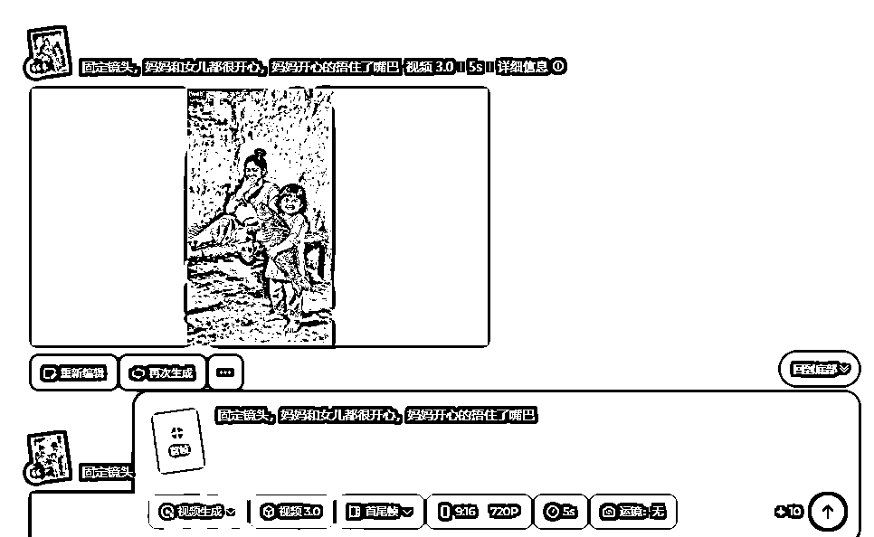

#### 剪辑与导出

剪辑步骤就是，把自己的画面通过加速的形式，替换掉对标的画面，音频直接用对标的。

下图的第一个轨道，是我左上角水印的制作方法，把模糊特效拉到视频上，用蒙版就可以做模糊覆盖了。

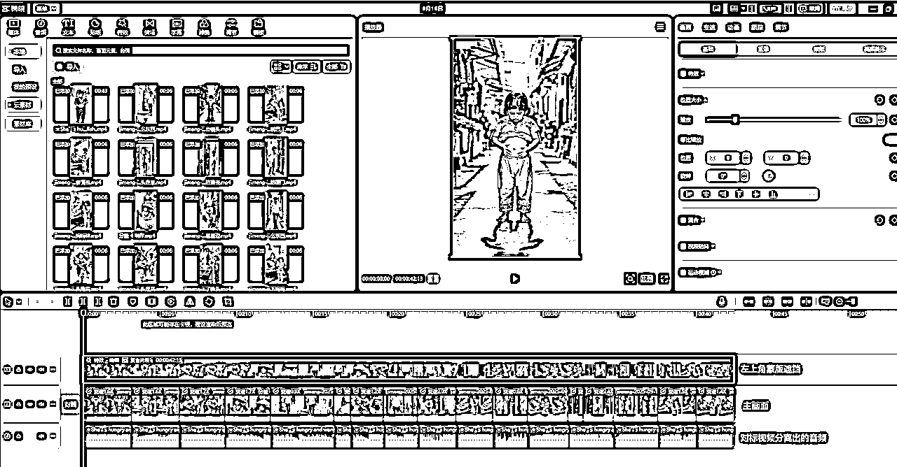

导出视频的时候，选择4k，60帧，这样YouTube的画面上会多出一个4k的标识。能提高画面的清晰度。

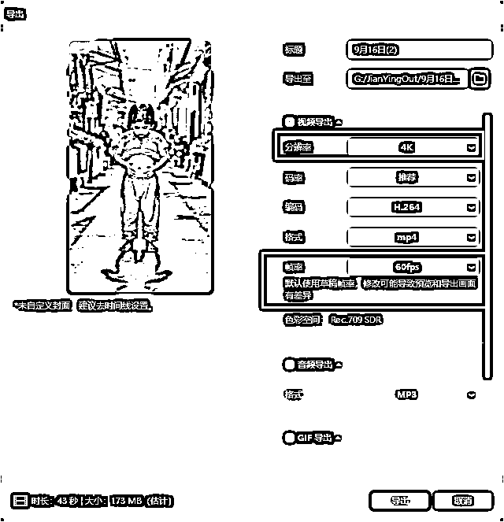

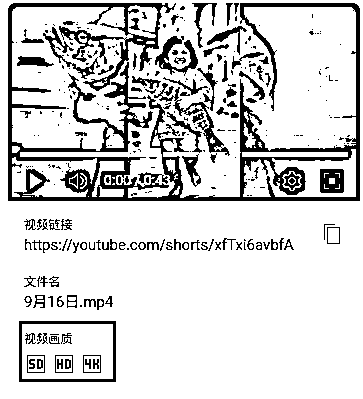

#### YouTube视频发布

标题和说明按照对标的来，或者简单的写个标题就行，系统会根据你的视频给你推荐对应的人群。

下边三点需要确定清楚，两个否，一个是，勾选对就行。


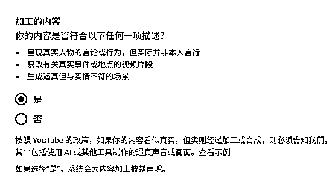

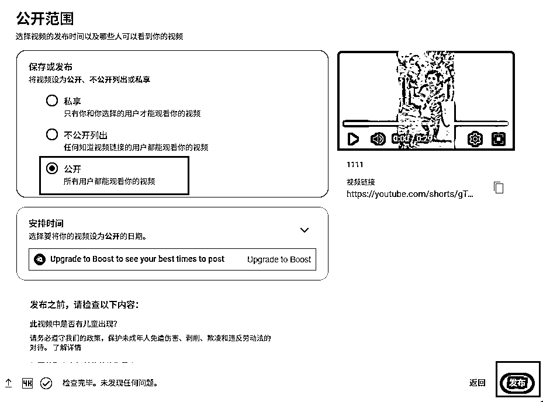

### 四、超越 “复刻” 的思考

#### 对爆款底层逻辑的思考

① 故事结构逻辑的拆解

*   冲突起点：小女孩肚子饿了 → 偷烤鱼（观众马上被“饥饿+偷窃”的紧张感吸引）。

*   矛盾升级：被老板发现 → 追逐 → 躲进竹筐（悬念拉满）。

*   反转揭示：女孩不是坏孩子，而是贫困、照顾妈妈和婴儿 → 观众情绪转向同情。

*   情绪释放：老板发现真相 → 不仅没有惩罚，还带来食物（善良收尾，传递“人性温暖”）。

这就是一个三段式经典剧本：

*   前半段制造紧张和冲突（引流，提升完播率）；

*   中段揭示角色真实处境（转化观众情绪，从“质疑”到“心疼”）；

*   结尾反转+人性温情（满足情绪宣泄，观众点赞/评论“看哭了”）。

② 为什么能成为热点？

*   普世的“悲悯”情绪

*   情绪反差 & 反转爽点

*   短平快的叙事节奏

③ 和其他赛道相比，差异化优势在哪里？

核心就在人物的逼真程度，看似真实的人物，演绎着爽剧的剧情。

就跟国内咱看的真人演的爽剧一样的效果。

#### 建议与避坑总结

1️⃣ 建议

1.  新手上来建议手搓，不要想着提效工具提效，等手搓熟练了之后，工具提效是手到渠成的事情。

1.  推流很慢，坚持更新很重要。不要被当天的播放量所影响，只要账号没问题，一个视频的播放量说明不了什么。

看一下我的过往视频数据：


我的第一条视频，就是按照一卒大佬的帖子来实操的。三视图卡了我很久。大臣大佬的批量出图工具，我的api总是报错。最后我是用gpt出图，即梦出视频，三天才做出来第一条视频。山海经ip的印度故事。

接着我想尝试做真人视频，还是垫图思维，想生成印度小孩的三视图，却踩到政策限制，GPT不支持小孩都图片生成。GPT不行了，我又试了即梦，但效果也不理想。直到看了张强教练的高手领航，才意识到：其实即梦就够用了，甚至可以不用垫图，而且教练也建议新手最好“手搓视频”，一边做一边学。大佬还分享了提示词模板，帮我省了不少力气。

制作视频的流程没有问题后，我就选择跟对标的爆款视频，后来演变成跟对标的最新爆款视频，通过我的表格，明显能感觉到，复刻的越早，视频数据越好。

第四条爆款视频的推流是走第三天开始的，前三天给的流量也是几万播放，本以为凉了，但是它会突然给你惊喜，所以不要过度的关注单条视频发布后当天的数据。

2️⃣ 避坑与技巧

##### 即梦出图的坑

1.  人物描述和画面描述冲突

这个提示词，大家可以看到，我在画面描述那里还强调了下半身不能穿帮，但是效果依然不理想。

问题就出在人物描述的地方，出现了下半身服饰的提示词，以及赤着脚这个提示词。导致了ai会展示这部分的效果。正确的描述，应该是去掉腿部和脚的描写。这样画面描述也不用强调这部分就行了。

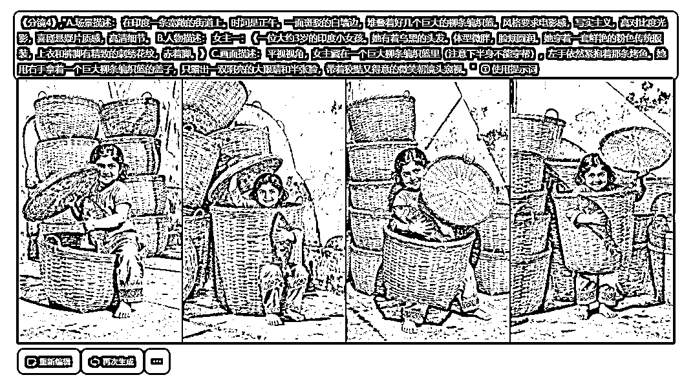

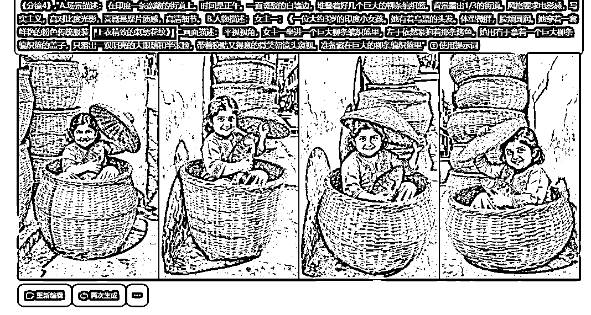

1.  添加构图提示词

这个视频的核心画面是，小姑娘躲在篮子里，男人走篮子旁边走过。图一只是小女孩的特写，需要在场景描述上，加上背景的相关描述，比如：背景露出1/3的街道（图二）。

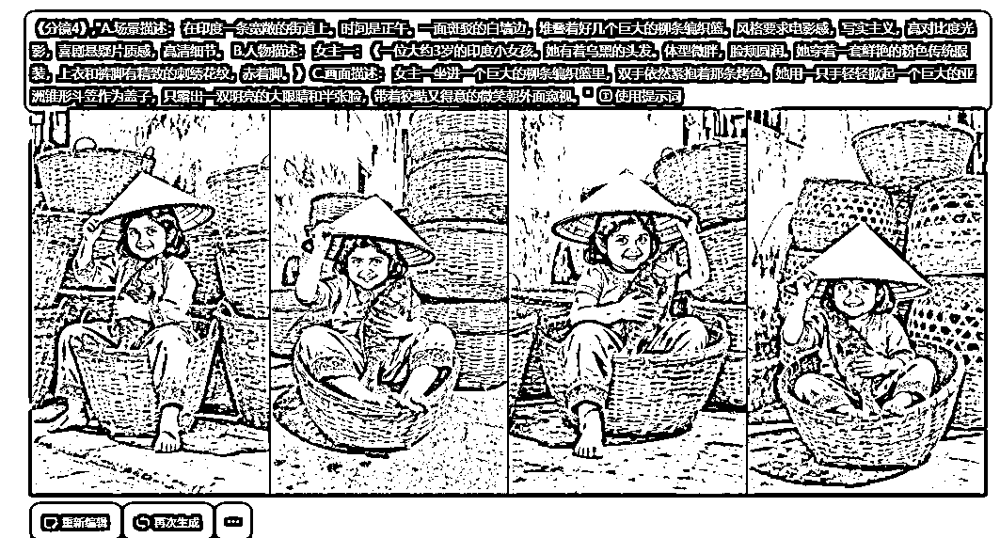

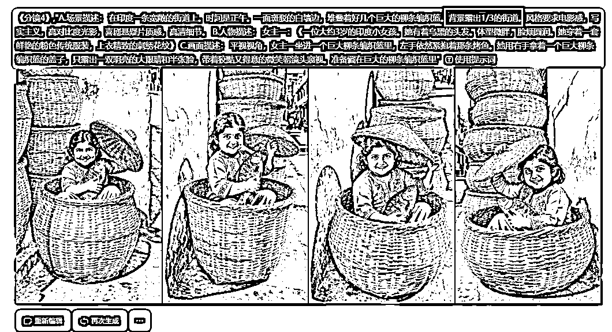

1.  镜头作为参照物

人物和具体物品摆放的位置，可以用镜头作为参考。参考下图。

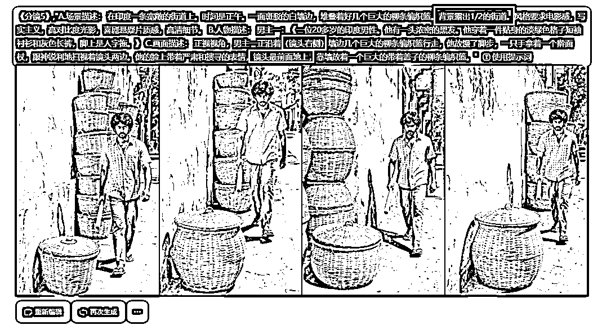

##### 即梦出视频的技巧

如果即梦实现不了的动作，也可以试试其他的工具，说不定就可以搞定了。

一个小女孩躲在篮子里的镜头，下边是我这个镜头的抽卡过程，也是很有意思的。最后用豆包折中实现了，视频提速之后看不出太多瑕疵。大家可以重点关注一下提示词。

后来，我看对标账号的这个脚本的视频，这个画面依然抽卡不稳定，所以对标就选择了只放出盖盖子的过程，把感觉做出来就行了，而不放整个过程。

所以在抽卡的过程中，如果真的很难实现，也不要强迫自己，换个角度去实现就行。

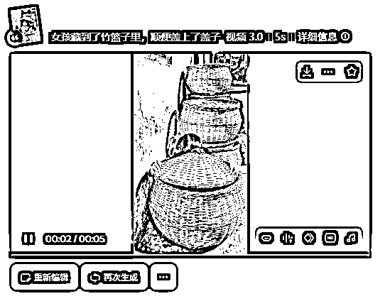


### 五、心得

复刻爆款质量首先要保证。这个视频能够爆，我感觉是我所有视频里，1:1复刻的最像的一个。并且整个视频的制作过程也是比较丝滑的。

复刻是起点，不是终点。核心还是要多收集剧情，为后边的微创新做准备。如果只是简单都复刻，对标最近的改编没有爆的，难道要一直找很多很多对标吗？视频的首发优势还是很重要的，它决定了你的推流上限有多高。

要养成每天拆解视频，每天找对标并记录下了的习惯。为了后边改编爆款打下基础。

熟练制作视频后，多研究大佬的精华帖，多尝试一下其他赛道，要不断地学习成长。

#### 我的一些新的观察

1.  这个脚本最近对标一直在用，说明了这个脚本本身在这段时间里，就是一个热点。很多对标账号，对标这个视频的，基本上都爆了，少的也有几百万播放。

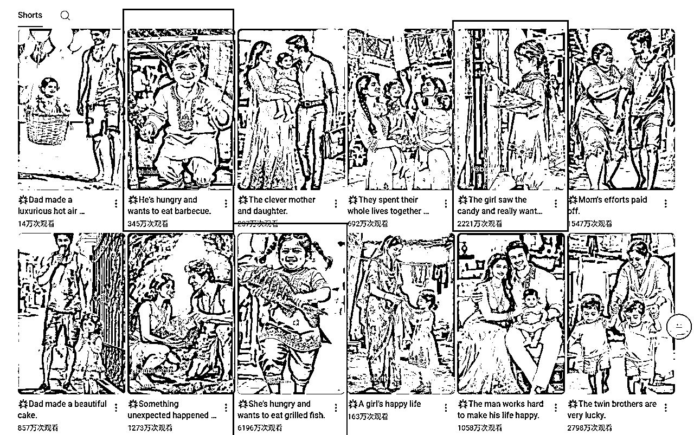

1.  印度赛道的对标账号，如果是百万粉的其实也可以作为对标的，但是一定要跟的早，最好是一天内爆百万的，立马跟。对标账号的新视频，肯定是他自己已经验证过的改编，你马上复刻，也是在跟他抢流量。

1.  刷对标如果遇到有低粉爆款的，一定要留意。他的爆款值得你的复刻。

1.  我用手机刷的时候，就能刷到很多印度ip的账号。印度人关于印度故事可能有新的想法，如果有爆款出现，马上跟。

#### 我的印度赛道对标账号

https://www.youtube.com/@Biubiubuff

https://www.youtube.com/@HiLanbuff

https://www.youtube.com/@AIFunnny-777

https://www.youtube.com/@KabirAiWorld

https://www.youtube.com/@hakan_RF

https://www.youtube.com/@skguruword

https://www.youtube.com/@CleverAiworld

https://www.youtube.com/@Anushka-h1d1v

写到这里，差不多就是我航海 21 天的完整心路历程和干货复盘了。

回顾这21天，我从一个什么都不懂的新手，硬生生手搓出了第一条爆款。

过程里有迷茫、有困顿，也有兴奋和突破。

我更深刻地体会到：运气从来不会眷顾过早放弃的人，它只会眷顾那些在黑夜里仍然摸索前行的人。

如果你现在也在迷茫，不妨告诉自己：再坚持几天，惊喜可能就在下一条视频里。