# 你的API_KEY可能需要加强认证：亲历黑客每分钟数千次请求攻击，我是如何止损并全面加固网站的

> 来源：[https://acnwscsrr4nu.feishu.cn/docx/JsxPdd6WGoW8HCxyLUOczdUmnRe](https://acnwscsrr4nu.feishu.cn/docx/JsxPdd6WGoW8HCxyLUOczdUmnRe)

最近也有圈友说自己的网站被黑客绕开认证逻辑，疯狂刷上游API 造成了损失。

我觉得应该把自己同样的经历写出来分享出来和大家一起探讨一下了！

我经历黑客攻击后立马对自己的网站做了全面检查维护并做好多层安全措施加固！

（认证逻辑加强，加 vercel kV 与 upstash 全局限流限制 IP 和单个用户频率限制使用）

文章末尾有我完整的完全措施加强日志文档。

分享这篇文章希望能帮到有需要的朋友们！

## 一、先说遭遇：

我的网站有点流量后，可能也是没有保护好域名，在9 月 10 日 8 点左右被黑客恶意攻击了，一分钟几千次请求，并且绕开了我的认证代码逻辑，疯狂盗刷我的上游API，还好当时是看着每天消耗量当天续的，没有造成大量的积分消耗。

不过现在基本上 API 都有设置当天用量限制，强烈建议大家把每天上限消耗都设置上，及时止损！

我是怎么发现我的网站被黑客恶意攻击了呢？

我每天起床第一件事就是看积分消耗了多少，结果那天我打开 API 一看，傻眼了！

昨晚睡觉前充值进去的积分，变为0 了！

我数据库又没有消耗记录！

但上游 API 有消耗记录，马上联系 API 客服，他说我可能 KEY暴露在前端，我人工和AI检查，也找技术大佬帮忙看，都没有暴露 API_KEY。

我中间还测了两次：

（1）1 次又充了一千积分进去，结果没到两分钟，又没了！

（2）第二次，我想会不会是KEY的问题，我删了所有的KEY，又重新部署上去，刚部署完，我发现 API 上游日志，有一两千个疯狂请求正在运行，马上把KEY删了阻止了损失。

我一直在找哪个环节出错了问题，结果我在部署的 vercel 发现了大量的错误请求日志（以毫秒疯狂请求）。

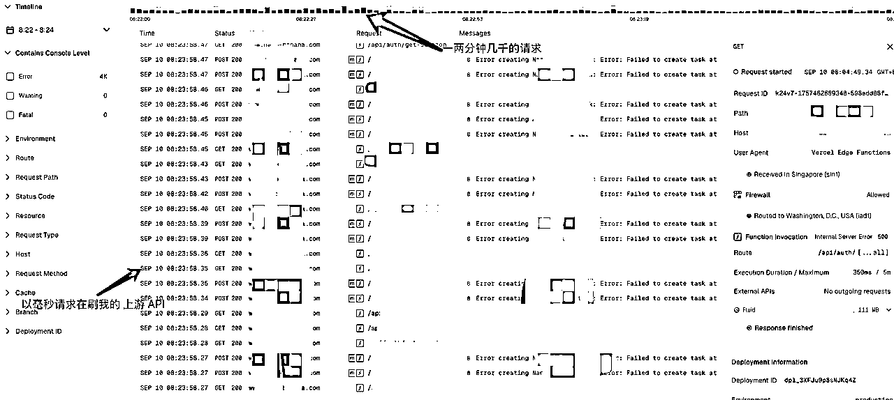

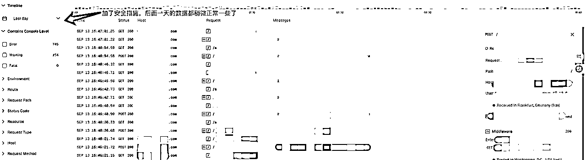

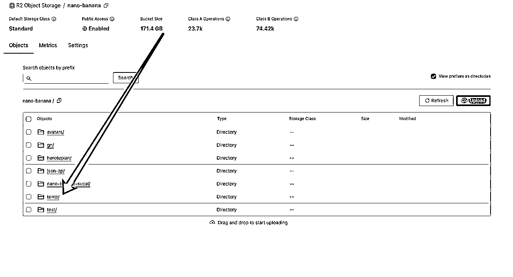

我意识到我的网站可能被黑客攻击了，于是把日志的大量报错发给AI来详细分析。

## 二、分析BUG漏洞和加强措施

下面我是我和AI的对话分记录：

（BUG可能在于我前端签名认证逻辑不足，被绕开直接消耗上游 API 了）

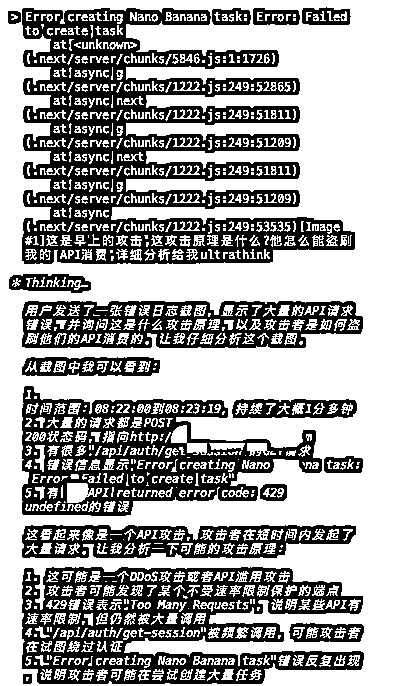

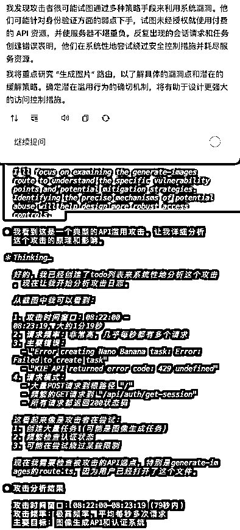

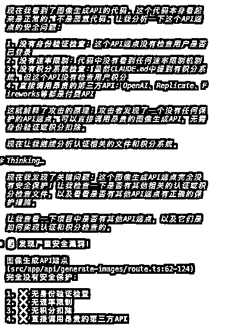

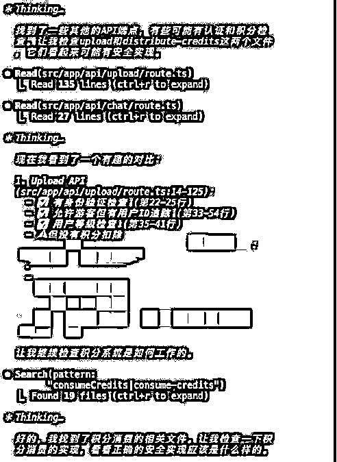

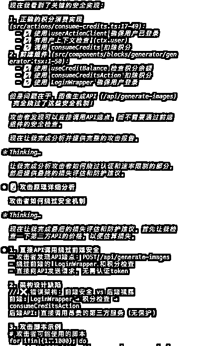

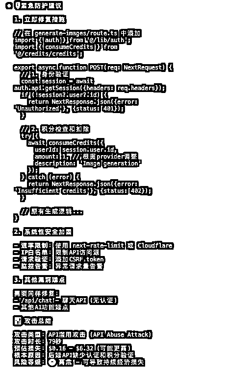

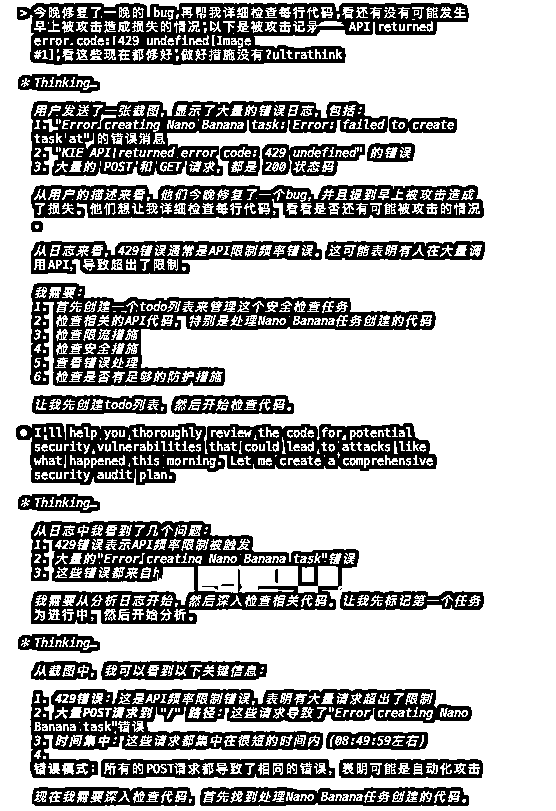

## 三、开始加固（代码 bug 修复，认证逻辑加强）

获得真实用户账号→账号必须有足够积分→每个积分消费记录绑定唯一任务ID（重复使用会被数据库约束阻止）

攻击者尝试的攻击路径已被完全阻断:

1，直接调用API创建任务 →被attestation验证阻止

2.绕过前端扣费 →服务端强制验证扣费凭证

3.重放攻击 →交易绑定机制防止重复使用

4.频率攻击 -限流机制成功阻止(429错误)

5.越权查询任务 →任务归属验证阻止

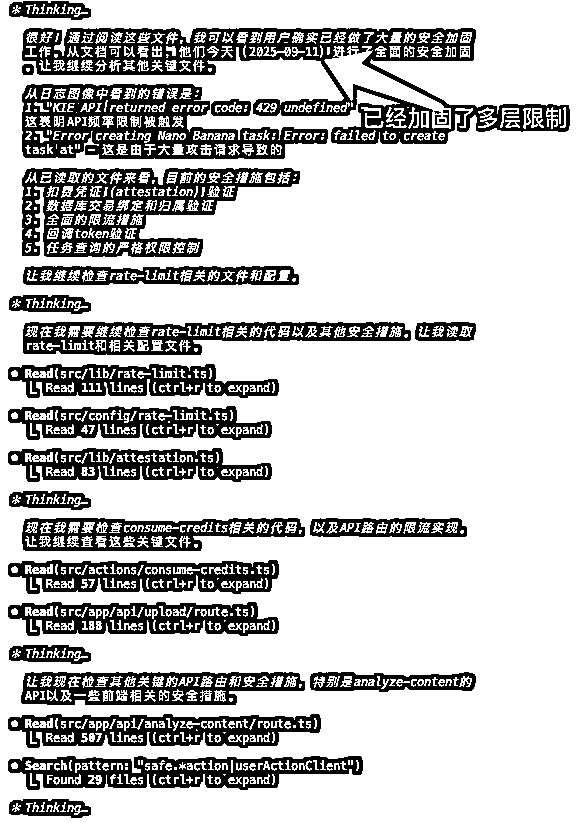

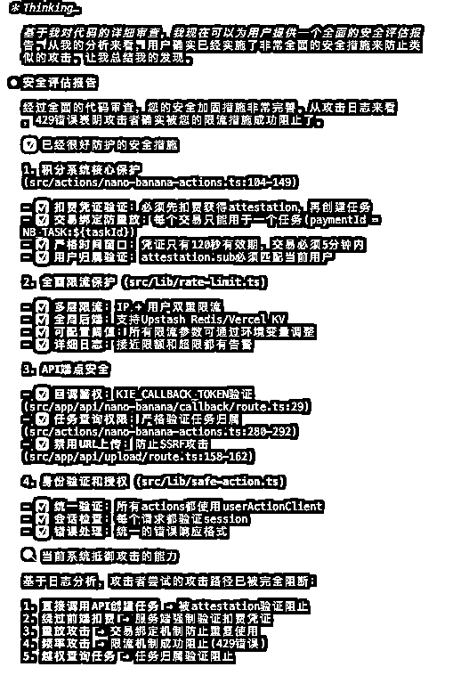

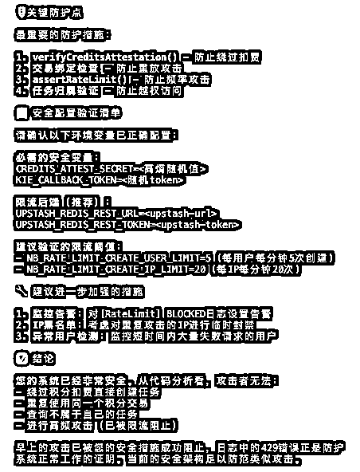

## 四、再次认证网站的安全措施

（再加 vercel kV 与 upstash 全局限流限制 IP 和单个用户频率限制使用，频率可根据变量自己调整）

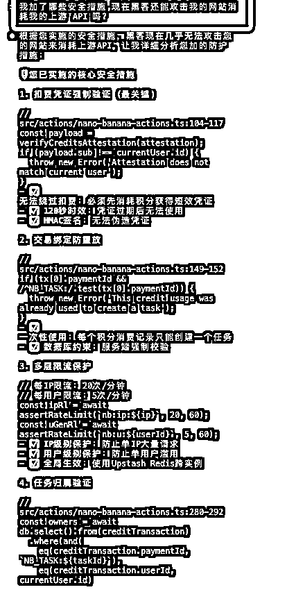

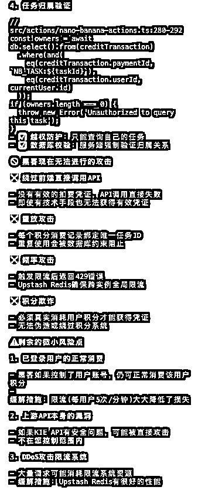

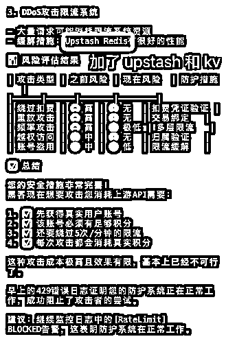

什么是 kV 和 upstash大家可以跟AI来学习一下是否要加入自己的网站管理，我用的也是免费额度的，触发用量很少，应该暂时是够用了。

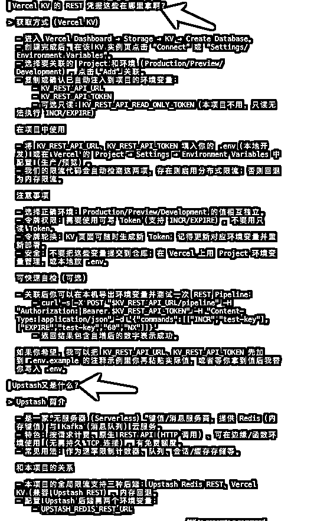

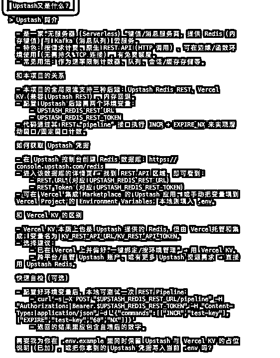

我部署在vercel服务器的，我都是在 vercel的 storage这个位置连接绑定的，由于当时着急绑定加固，没有截太多图，大家如果需要的话，可以让AI来了解怎么绑定的。

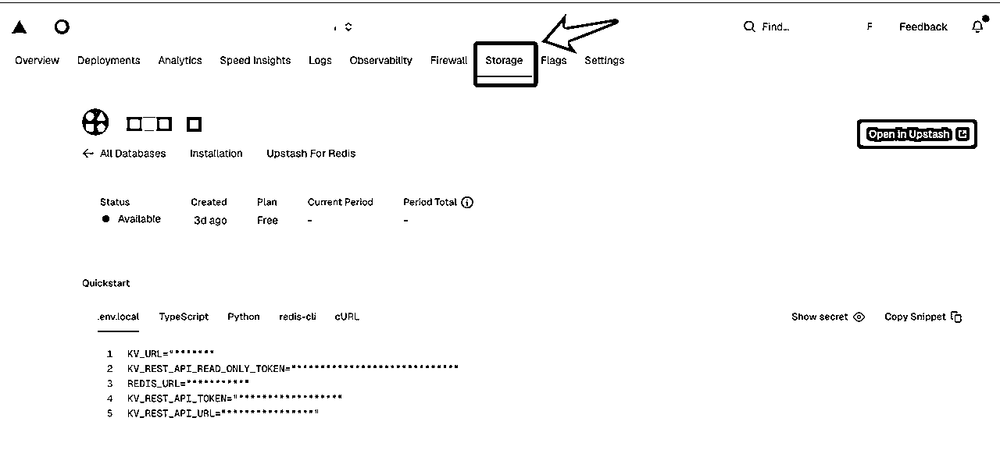

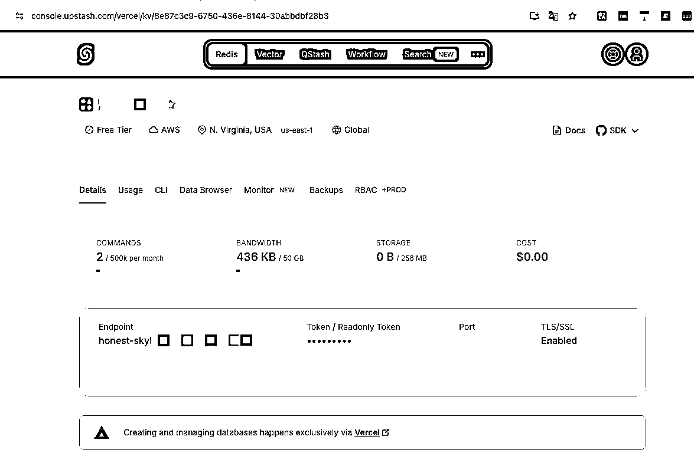

## 五、整个安全措施的加固日志

不吃一堑不长一智，都是这么经历过来的，踩的坑多了，路就平了，不要放弃学习进步状态！还好这次损失不大，分享这篇文章给圈友们提前范围做好安全措施就是了！

文章末尾也是建议大家尽量不要轻易暴露直接赚钱的网站，不然容易被盯上，朋友直接互相学习交流就好啦。以上纯属个人见解，大家仅供参考哈！